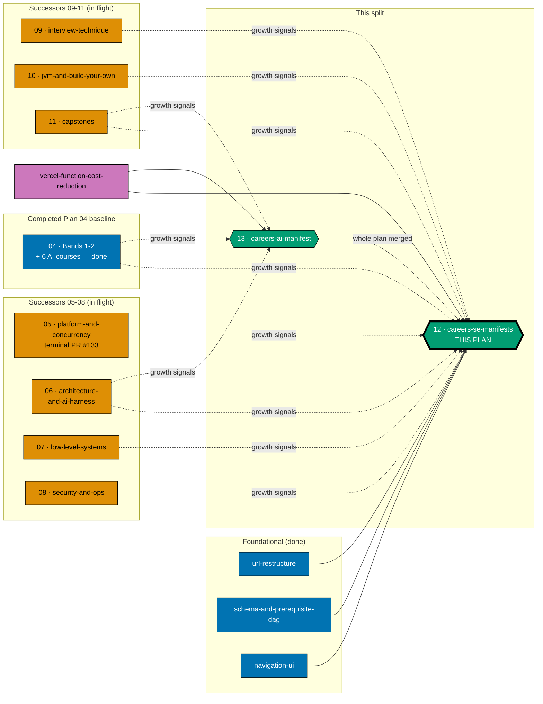
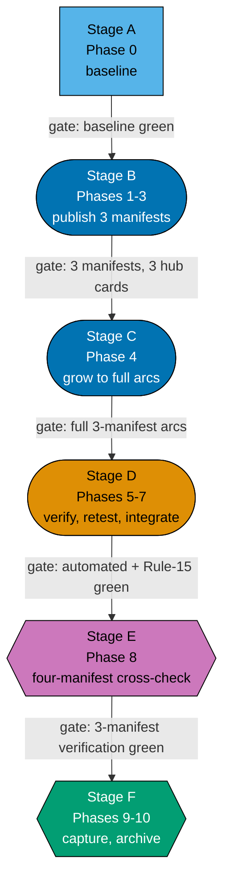

# Learning Path Manifests — the three `software-engineer`-role `careers/` manifests

## Delivery amendment — one final PR and Plan 13 handoff

This plan uses one branch and its sole PR in Phase 10, after verification and Knowledge Capture; the archival move, secret scan, local quality checks, PR quality gate, merge, and deploy are all in that final delivery. Plan 13 begins only after this plan merges, and carries its own later cross-manifest verification. Earlier per-manifest or delivery-boundary PR wording is superseded.

> **Successor plan.** This plan and its sibling
> [`ayokoding-learning-path-13-careers-ai-manifest`](../../backlog/ayokoding-learning-path-13-careers-ai-manifest/README.md)
> together replace the single prior plan that authored, published, grew, and verified all four
> `careers/` path manifests. That prior plan covered `interview-ready`, `immediately-effective`
> (both `software-engineer` and `ai-engineer`), and `fundamentally-strong` in one folder. It is split
> here into **3 + 1**: this plan owns the **three `software-engineer`-role manifests**
> (`interview-ready`, `immediately-effective/software-engineer`, `fundamentally-strong/software-engineer`);
> the sibling plan owns the **one `ai-engineer` manifest**
> (`immediately-effective/ai-engineer`) alone. See [§Why 3 + 1, not 2 + 2](#why-3--1-not-2--2) below
> for why the split is not symmetric.
>
> **Programme decisions** — this plan cites the shared `R*`/`A*` decision ids `R2`, `R4`, `R9`, `A2`,
> `A8`, `A10`, `A11`, and `A12`; their definitions are folded into
> [tech-docs §Programme decisions](./tech-docs.md#programme-decisions). `A8` (programme-wide
> clean-room licensing) governs every landing-prose authoring step in this plan — Phases 1.2, 2.2, and
> 3.2 — and is invoked there explicitly rather than assumed.

**Category scope.** The paths hub serves two categories at different URL depths:
`careers/<arc>/<role>` (3 segments, 4 paths total, split across this plan and its sibling) and
`skills/<subject>` (2 segments, 4 paths, owned by a separate accounting/ERP split — see
[§Depends-on](#depends-on)). This plan is **`careers/`-software-engineer-role-only**; "three
manifests" in this plan always means the three `software-engineer`-role manifests, never the whole
four-path `careers/` category and never the eight-path programme.

Three manifests ship here, in the DD-27 build order:

1. `careers/interview-ready/software-engineer` — the architecture smoke test, published over
   already-live re-homed content. **Ships first** — its delivery unit merging is what unblocks the
   sibling AI-manifest plan's own start (see [§The plan-12 / plan-13 coupling](#execution-handoff-to-plan-13)
   below).
2. `careers/immediately-effective/software-engineer` — the build-app-first arc.
3. `careers/fundamentally-strong/software-engineer` — the university-style theory-first arc.

The fourth `careers/` manifest, `careers/immediately-effective/ai-engineer`, is authored entirely by
the sibling plan `ayokoding-learning-path-13-careers-ai-manifest` — this plan never touches it.

## Why 3 + 1, not 2 + 2

Splitting the original single plan's four manifests into two equal-sized folders (2+2) looks like the
natural cut, but the manifests do not divide that way. Three cross-manifest checks bind specifically
across the **three `software-engineer`-role manifests** — never the AI-engineer manifest:

- **"No forked body" check.** `Given a course appears in all three of the interview-ready,
immediately-effective/software-engineer, and fundamentally-strong/software-engineer manifests ...
Then exactly one canonical path-neutral body exists` — first satisfiable only once all three
  software-engineer manifests exist, which happens entirely inside this plan.
- **Band-9 growth.** The five interview-technique course IDs land in **two** of the three
  software-engineer manifests only (`interview-ready` and `fundamentally-strong`;
  `immediately-effective/software-engineer` omits them by design — see
  [tech-docs DD-41](./tech-docs.md#design-decisions)) — a genuine same-plan, multi-manifest atomic
  operation.
- **Ownership-boundary sweep** ("no forked body across the three software-engineer paths") at this
  plan's own verification phase.

The AI-engineer manifest has its own independent growth track (the nine-course AI/harness cluster) and
is not part of any of the three checks above. So the split is **3 + 1**: this plan owns the three
software-engineer manifests and every 3-way cross-manifest check; the sibling plan owns the
AI-engineer manifest alone. **One check spans all four manifests** — see below.

## Execution handoff to plan 13

This plan completes and archives its three software-engineer manifests before plan 13 begins. Plan 13 is the only successor and owns the AI-engineer manifest plus any later four-manifest verification. This plan never waits for plan 13.

## The manifest ownership invariant (now scoped per plan, within the `careers/` category)

_Binding — and the reason this plan and its sibling exist as separate units from course-authoring._

**This plan owns every file under `apps/ayokoding-www/src/features/course-paths/manifests/careers/interview-ready/`,
`.../careers/immediately-effective/software-engineer.json`, and
`.../careers/fundamentally-strong/software-engineer.json`, plus every step that creates, appends to,
reorders, or re-verifies one of those three manifests.**
`ayokoding-learning-path-13-careers-ai-manifest` owns exactly
`.../careers/immediately-effective/ai-engineer.json` under the identical invariant, scoped to its own
one manifest. Neither plan touches the other's manifest file. The seven course-authoring successor
plans (Plan 04's completed retained scope and the seven `05`-`11` successors, per the mapping in
[tech-docs §Growth signal routing](./tech-docs.md#growth-signal-routing-from-the-seven-course-authoring-successor-plans))
own course **bodies only** and never edit a manifest under either plan's scope.

A genuine dependency cycle existed between course-authoring and manifest-authoring before this
invariant was ruled (in the plan this split replaces): course-authoring's backfill phases grow
manifests the manifest plan(s) author, while the manifest plan's AI-path phase publishes a manifest
over courses course-authoring writes. No wave ordering satisfies both directions — only the ownership
invariant breaks it, which is why this plan's hard prerequisite includes both Wave-2 plans
(`ayokoding-learning-path-03-navigation-ui` and, transitively via growth, the seven course-authoring
successor plans) rather than the navigation plan alone.

Its mechanical consequence: growth steps that the original single course-authoring plan would have
performed are instead recorded as **band-completion signals** in each of the seven course-authoring
successor plans' own `delivery.md` files, and this plan's [Phase 4](./delivery.md#phase-4-manifest-growth-as-backfill-lands)
performs the growth for its own three manifests as each signal arrives.

## Scope

**In scope**

- Three `careers/`-`software-engineer`-role `PathManifest` JSON manifest data files under
  `apps/ayokoding-www/src/features/course-paths/manifests/careers/`.
- Three thin content landing anchors under
  `apps/ayokoding-www/content/en/learn/paths/careers/<arc>/software-engineer/_index.md` (prose/SEO
  only — no `courseOrder`).
- **This plan's slice** of the paths-hub card population — three cards, one per manifest as it ships,
  inside the category-grouped hub layout `ayokoding-learning-path-03-navigation-ui` owns. The fourth
  `careers/` card (`ai-engineer`) is the sibling plan's own addition to the same shared file.
- Manifest integrity + prerequisite-consistency + no-forked-body verification at every phase gate,
  scoped to this plan's three manifests (plus, at the final phase only, the full four-manifest check
  once the sibling plan has merged).
- Per-path progression-smoothness audits for all three manifests, including the interview-ready
  refresh-register re-audit deferred by the smoke-test phase.
- All growth of these three manifests as the seven course-authoring successor plans land their bands.
- The **four-manifest** "a shared course names every path" check and the terminal 127-course catalog
  assertion — both run at this plan's own final phase, since this plan is the last of the two to
  finish (see [§The plan-12 / plan-13 coupling](#execution-handoff-to-plan-13)).

**Out of scope**

- The `careers/immediately-effective/ai-engineer` manifest, its landing, and its hub card — owned
  entirely by `ayokoding-learning-path-13-careers-ai-manifest`.
- Any course **body** — authored by the seven course-authoring successor plans.
- The `PathManifest` zod schema, the pure `course-paths` core modules, the `<MANIFESTS>` directory
  itself, and the `syllabus/` detail layer — owned by
  `ayokoding-learning-path-02-schema-and-prerequisite-dag`.
- Every rendering component (`path-landing.tsx`, `path-card.tsx`, `path-rail.tsx`,
  `manifest-repository.ts`, `?path=` wiring) — owned by `ayokoding-learning-path-03-navigation-ui`.
- The flat `courses/` namespace, the `legacy/` bucket, and both redirect modules — owned by
  `ayokoding-learning-path-01-url-restructure`.
- The `skills/` category's four manifests — owned end-to-end by the accounting/ERP split plans (see
  [§Depends-on](#depends-on)).
- The `apps/ayokoding-www` root-layout dynamic-API removal, middleware deletion, and static-conversion
  work — owned by `vercel-function-cost-reduction` (see [§Depends-on](#depends-on)); this plan's
  landing pages and hub cards land on top of that app once it has merged.

## Where this plan sits

**Accessibility note.** Group membership is carried by the labelled subgraph containers and by
node shape (rectangle = foundational, stadium = course-authoring successor, hexagon = this split's two
manifest plans) as well as by fill; this plan's node additionally carries a thicker border. Edge kind
is carried by line style (solid = hard blocking edge; dotted = partial/staged or signal-only edge) and
by edge labels. Fills use the verified accessible palette (`#0173B2` blue, `#DE8F05` orange, `#029E73`
teal, `#CC78BC` purple) with black borders and WCAG-AA-contrasting text, per the
[Color Accessibility Convention](../../../repo-governance/conventions/formatting/color-accessibility.md).

## Delivery flow

Inside Stage B the three manifest phases are **strictly serial**, in DD-27's locked order.

| Phase | Manifest published                                | Closing gate                                                                    |
| ----- | ------------------------------------------------- | ------------------------------------------------------------------------------- |
| 1     | `careers/interview-ready/software-engineer`       | architecture proven; 1 manifest, 1 hub card; unblocks plan 13                   |
| 2     | `careers/immediately-effective/software-engineer` | 2 manifests, 2 hub cards; arcs provably distinct                                |
| 3     | `careers/fundamentally-strong/software-engineer`  | 3 manifests, 3 hub cards; no forked body across the three                       |
| 4     | _(growth only)_                                   | full three-manifest arcs; this plan's own catalog contribution resolves         |
| 5     | —                                                 | all automated sweeps green; ownership boundary intact                           |
| 6     | —                                                 | 9 screenshots committed (3 landings + hub slice); zero open defects             |
| 7     | —                                                 | CI green on `main`; production serving this plan's 3 paths                      |
| 8     | —                                                 | three-manifest verification green; plan 13 may begin after this final PR merges |
| 9     | —                                                 | every `learnings.md` entry terminal                                             |
| 10    | —                                                 | archived                                                                        |

**Stage groupings above describe verification, not delivery boundaries.** See
[delivery.md §Delivery Boundaries](./delivery.md#delivery-boundaries) for the authoritative mapping of
phases to delivery units, branches, and PRs.

## Depends-on

| Relation      | Plan (full folder name)                                 | Nature                                                                                                                                                                                                                         |
| ------------- | ------------------------------------------------------- | ------------------------------------------------------------------------------------------------------------------------------------------------------------------------------------------------------------------------------ |
| **blockedBy** | `ayokoding-learning-path-11-course-authoring-capstones` | **Hard; sole direct execution prerequisite.** It must be fully merged and archived on `origin/main` before Phase 0. All earlier completion and repository-baseline facts are transitive context, not extra plan prerequisites. |

**Phase 0 start check:** `git ls-tree -r --name-only origin/main plans/done | rg -q "__ayokoding-learning-path-11-course-authoring-capstones/README\.md$"` exits 0. This is this plan's only plan-level start gate.

## Recorded judgment calls

### JC-3: numbering continuity, not renumbering, across the split

The prior single plan this split replaces was folder-named `ayokoding-learning-path-05-manifests`.
That numeral is now occupied by a course-authoring successor plan
(`ayokoding-learning-path-05-course-authoring-platform-and-concurrency`), so this split could not reuse
`05`. **Choice**: this plan and its sibling take the next free numerals in sequence, `12` and `13`,
rather than renumbering any already-in-flight sibling plan to make room. **Reason**: renumbering a
plan folder that other in-flight plans already cite by name (band-completion signals, cross-links)
would break every existing cross-reference at once; taking the next free numerals costs nothing and
disturbs no sibling plan's own text.

### JC-4: the Band-9 two-of-three correction is adopted, not re-derived

The plan this split replaces contained an internal inconsistency: its own `delivery.md` Phase 5.2 grew
Band 9's five interview-technique courses into **all three** software-engineer manifests, while its
sibling course-authoring plan's README summary table described the same growth as landing in
**`interview-ready` + `fundamentally-strong` only**. This split adopts the **two-of-three** reading as
authoritative — see [tech-docs DD-41](./tech-docs.md#design-decisions) for the full resolution and the
falsifiable check that makes the correction auditable rather than asserted.

## Delivery Mode: worktree-to-pr

This plan has exactly one dedicated worktree, one persistent final-delivery branch, and one PR.
All authoring, verification, and Knowledge Capture phases commit on that branch without a push, PR, merge, or deployment. In Phase 10, the executor commits the archival move and
any index updates, opens the sole draft PR, completes the secret scan, local quality checks, and PR quality-gate verification and CI gates,
marks it ready, and performs the normal AI merge/deploy after the hardened preconditions hold.
No per-course, cohort, stage, or phase worktree/branch/PR is permitted.

## Navigation

- [Business Requirements (brd.md)](./brd.md) — WHY the three software-engineer manifests are their own
  deliverable and who they serve.
- [Product Requirements (prd.md)](./prd.md) — the personas, user stories, Gherkin acceptance criteria,
  and product scope.
- [Technical Docs (tech-docs.md)](./tech-docs.md) — the ownership invariant, the manifest format and
  integrity invariants, the design decisions (including the new DD-40/DD-41/DD-42 this split adds),
  the growth-signal routing table, and the architecture diagrams.
- [Delivery Checklist (delivery.md)](./delivery.md) — the phased executable checklist.
- [Learnings (learnings.md)](./learnings.md) — knowledge-capture running log.
- [Sibling plan — `ayokoding-learning-path-13-careers-ai-manifest`](../../backlog/ayokoding-learning-path-13-careers-ai-manifest/README.md)
  — the fourth `careers/` manifest, coupled to this plan as described above.
- [Syllabus (cross-plan, read-only)](../../done/2026-07-24__ayokoding-learning-path-02-schema-and-prerequisite-dag/syllabus/README.md) —
  the per-course and per-path detail layer. The three `paths/` manifest mirrors this plan transcribes
  from are
  [`manifest-interview-ready-software-engineer.md`](../../done/2026-07-24__ayokoding-learning-path-02-schema-and-prerequisite-dag/syllabus/paths/manifest-interview-ready-software-engineer.md),
  [`manifest-immediately-effective-software-engineer.md`](../../done/2026-07-24__ayokoding-learning-path-02-schema-and-prerequisite-dag/syllabus/paths/manifest-immediately-effective-software-engineer.md),
  and
  [`manifest-fundamentally-strong-software-engineer.md`](../../done/2026-07-24__ayokoding-learning-path-02-schema-and-prerequisite-dag/syllabus/paths/manifest-fundamentally-strong-software-engineer.md).
