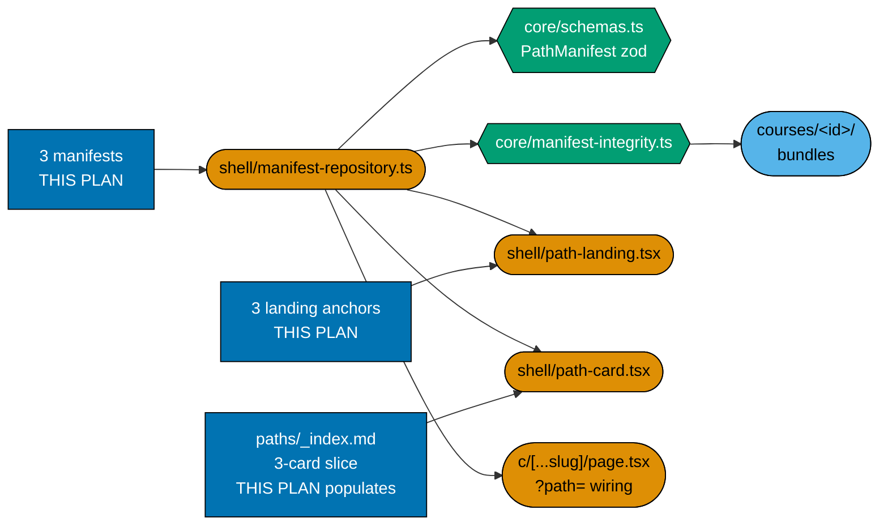

# Technical Documentation — Learning Path Manifests (software-engineer-role)

## Corpus Custody

`custodied-by:ayokoding-learning-path-02-schema-and-prerequisite-dag` — this plan **reads** the shared
course corpus custodied by that plan but never edits, copies, or forks any file under it. Any needed
change to that corpus is routed to that plan's own `delivery.md` as a change request, per the
[Learning-Plan Syllabus Convention §Custody Rule](../../../repo-governance/conventions/structure/learning-plan-syllabus/custody-rule.md#custody-rule).

> **Cross-plan source of truth**: the authoritative per-course and per-path specs live in
> `plans/done/2026-07-24__ayokoding-learning-path-02-schema-and-prerequisite-dag/syllabus/`. Do not copy
> them; do not author from any other source. Each manifest's `courseOrder` is **transcribed** from its
> `syllabus/paths/manifest-*.md` mirror, never re-derived.

## Programme decisions

Folded in verbatim so this plan is self-contained. `A*` amendments are **later than** the `R*` rules
and **win on conflict**.

| Id  | Decision                                                                                                                                                                                 |
| --- | ---------------------------------------------------------------------------------------------------------------------------------------------------------------------------------------- |
| R2  | `pathId` is **variable-depth by design** — `careers/<arc>/<role>` is 3 segments, `skills/<subject>` is 2; nothing may key on segment count.                                              |
| R4  | Ownership split: the `careers/`-manifest plans are `careers/`-only; the `skills/` category is separate.                                                                                  |
| R9  | Every plan declares its **UI-gate and API-gate posture explicitly**; a plan bearing neither surface is _not_ thereby exempt and must state why.                                          |
| A2  | The skills category splits across separate accounting and ERP plans, the latter historical source context the former.                                                                    |
| A8  | **Strict clean-room licensing, programme-wide** — binds every plan in the programme; nothing copyrighted is reproduced, and every concept is restated in original words with a citation. |
| A10 | The skills category carries **four** paths — two accounting, two ERP; each Sharia path covers the basics too, and `A11` governs how.                                                     |
| A11 | Shared courses are **referenced by both manifests, authored once** — a Sharia path's `courseOrder` interleaves shared and Sharia-specific ids rather than duplicating files.             |
| A12 | Every syllabus is **independently authored, then externally confirmed** — a published curriculum may corroborate coverage but must never supply the structure being written.             |

### A8 — licensing binds every landing this plan authors

`A8`'s posture is uniform: **describe, cite and link; never reproduce.** This plan's three landing
anchors are original prose — no sentence, heading, or ordered list is lifted or closely paraphrased
from a third-party curriculum, syllabus, or course page. Each landing-authoring step in
[delivery.md](./delivery.md) carries its own explicit A8 self-check, naming the sources consulted.
Trademarks (language/framework/vendor names) are used nominatively only, never in a way implying
endorsement or affiliation.

## Overview

This plan delivers the **software-engineer-role slice of the `careers/` composition layer**: three
`PathManifest` JSON manifest data files, their thin content landing anchors, this plan's slice of the paths-hub
card population, the per-path smoothness audits, every manifest growth as backfill content lands, and
— at this plan's own final phase — the four-manifest completeness check that spans the whole `careers/`
category.

| Layer                                                   | Owner                                                    | This plan's relationship             |
| ------------------------------------------------------- | -------------------------------------------------------- | ------------------------------------ |
| URL / IA                                                | `ayokoding-learning-path-01-url-restructure`             | consumes                             |
| Schema / core / integrity                               | `ayokoding-learning-path-02-schema-and-prerequisite-dag` | consumes                             |
| Rendering / route wiring                                | `ayokoding-learning-path-03-navigation-ui`               | consumes                             |
| Course bodies                                           | seven course-authoring successor plans (`04`-`11`)       | consumes (band signals)              |
| `apps/ayokoding-www` rendering-mode fix                 | `vercel-function-cost-reduction`                         | consumes (repository-baseline check) |
| **Three `software-engineer`-role manifests + landings** | **this plan**                                            | **produces**                         |
| The `ai-engineer` manifest + landing + hub card         | `ayokoding-learning-path-13-careers-ai-manifest`         | sibling — coupled, not consumed      |
| `skills/` manifests + landings + corpus                 | the accounting/ERP split plans                           | sibling — out of scope               |

## The manifest ownership invariant (scoped to this plan's three files)

**This plan owns exactly**
`apps/ayokoding-www/src/features/course-paths/manifests/careers/interview-ready/software-engineer.json`,
`.../careers/immediately-effective/software-engineer.json`, and
`.../careers/fundamentally-strong/software-engineer.json`, plus every step that creates, appends to,
reorders, or re-verifies one of them. The sibling plan owns exactly
`.../careers/immediately-effective/ai-engineer.json` under the identical invariant. Neither plan's
mechanical checks ever assume the other's file exists or does not exist, except at this plan's own
final phase (Phase 8), which explicitly checks for the sibling manifest's presence as its start
condition.

**Variable depth (R2).** `<MANIFESTS>careers/<arc>/<role>.json` is 3 path segments deep. Every glob and
`find` below walks `<MANIFESTS>careers/` scoped to this plan's three specific file paths — never a
directory-wide count that would also match the sibling plan's file — so a concurrent edit from the
sibling plan can never change this plan's own gate results.

### What this plan writes

| Path                                                               | Kind    | Note                                                                                                                                                                            |
| ------------------------------------------------------------------ | ------- | ------------------------------------------------------------------------------------------------------------------------------------------------------------------------------- |
| `<MANIFESTS>careers/interview-ready/software-engineer.json`        | data    | created Phase 1, grown Phase 4                                                                                                                                                  |
| `<MANIFESTS>careers/immediately-effective/software-engineer.json`  | data    | created Phase 2, grown Phase 4                                                                                                                                                  |
| `<MANIFESTS>careers/fundamentally-strong/software-engineer.json`   | data    | created Phase 3, grown Phase 4                                                                                                                                                  |
| `<MANIFESTS>careers/careers-se-manifests.unit.test.ts`             | test    | asserts this plan's three manifests' shape, integrity, and growth state — **not shared** with the sibling plan, which owns its own `careers-ai-manifest.unit.test.ts`           |
| `<PATHS>careers/interview-ready/software-engineer/_index.md`       | content | thin landing anchor, prose/SEO only                                                                                                                                             |
| `<PATHS>careers/immediately-effective/software-engineer/_index.md` | content | thin landing anchor, prose/SEO only                                                                                                                                             |
| `<PATHS>careers/fundamentally-strong/software-engineer/_index.md`  | content | thin landing anchor, prose/SEO only                                                                                                                                             |
| `<PATHS>_index.md`                                                 | content | this plan's **three-card** slice only — the file itself is owned by `ayokoding-learning-path-01-url-restructure`; the fourth `careers/` card is the sibling plan's own addition |

### What this plan never touches

- Any file under `apps/ayokoding-www/content/en/learn/courses/` — read only.
- `<MANIFESTS>careers/immediately-effective/ai-engineer.json` or its landing/hub card — the sibling
  plan's own file.
- Any file under `<MANIFESTS>skills/` — the accounting/ERP split's own subtree.
- Any file under `<FEAT>core/` or `<FEAT>shell/` — consumed, never modified.
- Any redirect module, `next.config.ts` entry, `legacy/` content, or `apps/ayokoding-www` root layout /
  middleware file — the last is `vercel-function-cost-reduction`'s own surface, treated here as an
  already-merged precondition.

## Growth signal routing from the seven course-authoring successor plans

The original single course-authoring plan is now seven successor plans. Each still records a
**band-completion signal** (the same 5-field contract: `BAND` / `PLAN` / `LANDED_COURSE_IDS` /
`GROW_MANIFESTS` / `FINAL_PR`) in its own `delivery.md`, naming every manifest that must grow, by
full path. This plan's [Phase 4](./delivery.md#phase-4-manifest-growth-as-backfill-lands) processes
each signal **as it arrives** — one sub-phase per source plan — rather than waiting for all seven;
it processes a signal only after verifying that its `FINAL_PR` is merged.

| Source plan                                                                                                                                                                                    | Grows this plan's 3 manifests?                                                                                                   | Grows the sibling's `ai-engineer` manifest?                    |
| ---------------------------------------------------------------------------------------------------------------------------------------------------------------------------------------------- | -------------------------------------------------------------------------------------------------------------------------------- | -------------------------------------------------------------- |
| `ayokoding-learning-path-04-course-authoring` (Phase 1 — 6 AI courses)                                                                                                                         | no                                                                                                                               | **yes — the very first growth**                                |
| `ayokoding-learning-path-04-course-authoring` (Bands 1, 2)                                                                                                                                     | yes (all three)                                                                                                                  | no                                                             |
| [`ayokoding-learning-path-05-course-authoring-platform-and-concurrency`](../../done/2026-08-04__ayokoding-learning-path-05-course-authoring-platform-and-concurrency/README.md) (old Band 3+4) | yes (all three), after terminal PR #133 is merged                                                                                | no                                                             |
| `ayokoding-learning-path-06-course-authoring-architecture-and-ai-harness` (old Band 5)                                                                                                         | yes (all three)                                                                                                                  | **yes — also grows AI-engineer (8 of 9 AI-cluster courses)**   |
| `ayokoding-learning-path-07-course-authoring-low-level-systems` (old Band 6 half)                                                                                                              | yes (all three)                                                                                                                  | no                                                             |
| `ayokoding-learning-path-08-course-authoring-security-and-ops` (old Band 7)                                                                                                                    | yes (all three)                                                                                                                  | no                                                             |
| `ayokoding-learning-path-09-course-authoring-interview-technique` (old Band 9)                                                                                                                 | **yes — two of three only** (`interview-ready` + `fundamentally-strong`; never `immediately-effective/software-engineer`, DD-41) | no                                                             |
| `ayokoding-learning-path-10-course-authoring-jvm-and-build-your-own` (old Band 6 half)                                                                                                         | yes (all three)                                                                                                                  | no                                                             |
| `ayokoding-learning-path-11-course-authoring-capstones` (old Band 8)                                                                                                                           | yes (all three)                                                                                                                  | **yes — also grows AI-engineer (9th/final AI-cluster course)** |

Six source plans grow this plan's three manifests (`04`'s Bands 1-2, `05`, `06`'s SE-slice, `07`, `08`,
`10`), one source plan grows this plan's manifests with the two-of-three exception (`09`), and one
source plan (`11`) grows this plan's manifests **and** independently grows the sibling's manifest —
those are two separate growth actions the same source plan's completion triggers, one per receiving
plan.

## Manifest format (inherited contract)

The `PathManifest` shape, its zod schema, and the integrity gates are authored and owned by
`ayokoding-learning-path-02-schema-and-prerequisite-dag`; restated here because every acceptance clause
in this plan's checklist is written against them.

A **path** is a manifest: a **path ID**, a display **title**, a **description**, and an ordered
**`courseOrder`** list of course IDs, stored under `apps/ayokoding-www/src/features/course-paths/manifests/`,
globbed as `manifests/**/*.json`. This data file is the **single machine-consumed source of truth** —
never `courseOrder` frontmatter on a content `_index.md`.

```json
{
  "pathId": "careers/interview-ready/software-engineer",
  "title": "Interview-Ready Software Engineer",
  "description": "Interview-first track for an experienced engineer re-entering the market.",
  "courseOrder": [
    "just-enough-nvim",
    "just-enough-lua",
    "extending-neovim",
    "just-enough-python",
    "capstone-forge-ready"
  ]
}
```

### Manifest integrity invariants

Re-run at every phase gate in this plan, scoped to this plan's own three manifests, plus the sibling's
fourth at Phase 8 only:

- Every `courseOrder` ID resolves to an existing course under `courses/<course-id>/`.
- No course ID appears twice within one manifest.
- **Prerequisite-consistency**: every declared prerequisite that is also present in the manifest
  appears before it.
- **No forked body**: all manifests reference courses by ID, never copy a body.
- Course IDs are stable slugs; a re-home changes a body's URL, never its ID.

## Architecture

### Component interaction



**Accessibility note.** Owning plan is carried by node shape (rectangle = this plan, hexagon = the
schema plan, stadium = the navigation/upstream plans) as well as by fill, per the
[Color Accessibility Convention](../../../repo-governance/conventions/formatting/color-accessibility.md).

### Manifest lifecycle (this plan's three manifests)

```mermaid
%% Lifecycle of this plan's three manifests. Truncated is the failure state the growth phase prevents.
%% TD (default) required: the chain is 5 states deep, so LR depth would exceed MaxWidth=4.
stateDiagram-v2
    Absent --> SmokeTestScoped: interview-ready over 33 topics
    Absent --> MainBodyPublished: IE/FS complete-minus-Band-9
    SmokeTestScoped --> Grown: Bands land, appended
    SmokeTestScoped --> Truncated: growth skipped — FAILURE
    MainBodyPublished --> Grown: Bands land, appended
    MainBodyPublished --> Truncated: growth skipped — FAILURE
    Grown --> Verified: integrity + smoothness green
    Verified --> CrossChecked: sibling merged; check green

    note right of SmokeTestScoped
        interview-ready defers its 4 interview
        courses + capstone-interview-loop.
    end note
    note right of MainBodyPublished
        immediately-effective (114) and
        fundamentally-strong (116) publish
        their complete main body immediately;
        each defers only the Band-9 tail.
    end note
    note right of CrossChecked
        Terminal state for this plan.
        Only reachable after the sibling
        plan's whole-plan merge.
    end note
```



`Absent` is the entry state; `CrossChecked` is this plan's terminal state, reachable only once the
sibling plan has merged. `Truncated` is a defect, never an accepted outcome.

## Design Decisions

This plan reproduces the design decisions it needs from the plan it succeeds, unchanged in substance,
plus three new decisions this split introduces.

- **DD-5, DD-7, DD-13, DD-16, DD-21, DD-22, DD-23, DD-24 through DD-27, DD-33, DD-34** — reproduced by
  citation only, unchanged, since none of them are amended by this split: three-paths-one-endpoint,
  omit-or-create/callout-only framing, the smoothness levers, the AI-path scope decisions (relevant
  only for cross-referencing why the sibling plan's manifest looks the way it does), the build order,
  and the category-segment ruling. Read their full text at
  [the predecessor plan's tech-docs, cited historically](../../done/2026-07-19__fundamentally-strong-software-engineer/README.md)
  or, for the still-open ones, at the sibling plan's own tech-docs where the AI-path decisions now live
  in full (`ayokoding-learning-path-13-careers-ai-manifest`). This plan's own three manifests need only
  DD-5, DD-7, DD-13 (the shared-library and framing invariants), DD-16 (smoothness), DD-22 (per-role
  convergence — states why this plan's three still share one endpoint while the sibling's does not),
  and DD-27 (build order — reproduced in full below since it governs this plan's own phase sequence).
- **DD-27 · Build order (locked).** Group A (architecture + UI, done) → **`interview-ready` MVP,
  architecture-smoke-test-only** (this plan's Phase 1) → **the AI-engineer path** (the sibling plan,
  authoring priority #1) → **`immediately-effective/software-engineer`** (this plan's Phase 2) →
  **`fundamentally-strong/software-engineer`** (this plan's Phase 3) → backfill. This plan's Phase 1 is
  DD-27's second step; Phases 2 and 3 are its fourth and fifth steps. The sibling plan's whole run
  occupies DD-27's third step, concurrently with this plan's later phases — see
  [README §The plan-12 / plan-13 coupling](./README.md#execution-handoff-to-plan-13).

### DD-40 · The four-manifest predecessor plan is split 3+1, not 2+2 (new, 2026-08-01)

**Decision.** The plan this split replaces authored all four `careers/` manifests in one folder. It is
split here into this plan (the three `software-engineer`-role manifests) and
`ayokoding-learning-path-13-careers-ai-manifest` (the one `ai-engineer` manifest), not into two
symmetric two-manifest folders.

**Rationale.** Three cross-manifest checks — no-forked-body, Band-9 growth, and the ownership-boundary
sweep — bind specifically across the three software-engineer-role manifests and never touch the
AI-engineer manifest (see [README §Why 3 + 1, not 2 + 2](./README.md#why-3--1-not-2--2) for the full
argument). A 2+2 split would have to either duplicate those three checks across two folders with no
natural owner, or introduce an artificial cross-plan dependency between two equally-sized folders for
no structural reason. The 3+1 split keeps every 3-way check inside one plan and isolates the
AI-engineer manifest's independent nine-course growth track in its own plan.

**Consequence.** One check — "a shared course names every path that includes it" — genuinely spans all
four manifests and cannot be resolved inside either plan alone. DD-42 below records how that residual
coupling is placed and sequenced.

### DD-41 · Band-9 growth is two-of-three, correcting an inconsistency in the predecessor plan (new, 2026-08-01)

**Decision.** The five Band-9 interview-technique course IDs (`coding-interview`,
`take-home-and-live-coding`, `system-design-interview`, `behavioral-and-leadership-interviews`,
`capstone-interview-loop`) grow **exactly two** of this plan's three manifests —
`interview-ready` and `fundamentally-strong` — and are **never** added to
`immediately-effective/software-engineer`.

**Why this needed a decision, not a citation.** The plan this split replaces contained an internal
inconsistency: its own `delivery.md` Phase 5.2 grew all **three** software-engineer manifests
("Band 9 grows all three software-engineer manifests, exactly like Bands 1-8"), while its sibling
course-authoring plan's README summary table described the same growth scoped to
`interview-ready` + `fundamentally-strong` **only**. A reader following either document alone would
reach a different, confidently-stated answer. This split adopts the **two-of-three** reading as
authoritative — the course-authoring plan's own table, since it is the plan that records what a band
actually delivers and to which manifests, is treated as the more precise source for scope, while the
manifest plan's older text is treated as the drifted copy.

**Falsifiable, both directions.** Phase 4.2's acceptance clause checks all three manifests in the same
step: the five-ID grep must return **5** against `interview-ready` and against `fundamentally-strong`,
and must return **0** against `immediately-effective/software-engineer` — a wrongly-scoped append in
either direction (adding to the excluded manifest, or missing one of the two included ones) fails the
gate.

### DD-42 · The plan-12 / plan-13 coupling is a sequential, two-edge dependency, not a cycle (new, 2026-08-01)

**Decision.** `ayokoding-learning-path-13-careers-ai-manifest` is the successor of this plan and begins after this plan's whole-plan merge. These are two distinct edges terminating at two distinct nodes inside this plan — Phase 1
(first) and Phase 8 (last) — so the coupling is sequential, never cyclic.

**Rationale.** The sequential chain makes ownership unambiguous: this plan verifies its three manifests, and plan 13 verifies all four after plan 12 is archived.

**Execution order, stated precisely.** Plan 12 follows plan 11; plan 13 follows plan 12. Plan 12 never waits for plan 13, and plan 13 owns any four-manifest verification after its predecessor is archived.

## UI-gate and API-gate posture (R9)

### UI gate — **exempt**

`swe-ui-checker` validates component **source**; this plan writes no `.tsx` file. Every rendering
component this plan's three landings and hub-card slice use is owned by
`ayokoding-learning-path-03-navigation-ui`. The exemption is narrow: manual behavioural verification
via Playwright MCP and the **Rule-15 three-tester retest are mandatory and performed** at
[Phase 6](./delivery.md#phase-6-manual-ui-verification-and-rule-15-three-tester-retest), scoped to this
plan's three landings plus its hub-card slice.

### API gate — **NOT exempt**

This plan has a reachable behavioural delta: manifest integrity scoped to its own three files, and —
at Phase 8 only — the four-manifest completeness check. `ayokoding-www` publishes no OpenAPI 3.x
document and no GraphQL SDL, so `api-quality-gate` cannot run; this plan records what it exercises
instead (schema validation, `checkManifestIntegrity`, prerequisite-consistency, the path-walk e2e),
exactly as the predecessor plan did.

## UI-design-funnel exemption (recorded explicitly)

Same disposition as the predecessor plan: no net-new component, no net-new screen — this plan
contributes content and data to Screen 1 (paths hub) and Screen 2 (path landing), both already
funnelled and owned by `ayokoding-learning-path-03-navigation-ui`. What the exemption does **not**
cover — manual UI verification, evidence capture, and the Rule-15 retest — remains mandatory, scoped to
this plan's own three landings and its hub-card slice.

**Locale scope.** `en`-only; `id/belajar/` has zero courses and zero paths.

## File-Impact Analysis

Root-relative annotated tree — the scan-first source of truth for this plan's scope. **[E]** edit,
**[N]** new file/pattern, **[D]** delete, **[G]** generated/regenerated.

```text
.
├── apps/ayokoding-www/src/features/course-paths/manifests/
│   ├── README.md [E] — fix stale ownership refs to retired plan names
│   └── careers/
│       ├── careers-se-manifests.unit.test.ts [N] — created Phase 1, extended 2-4
│       ├── interview-ready/software-engineer.json [N] — Phase 1, grown Phase 4
│       ├── immediately-effective/software-engineer.json [N] — Phase 2, grown Phase 4
│       └── fundamentally-strong/software-engineer.json [N] — Phase 3, grown Phase 4
├── apps/ayokoding-www/content/en/learn/paths/
│   ├── _index.md [E] — populate this plan's 3-card slice (file created by plan 01)
│   ├── careers/interview-ready/software-engineer/_index.md [N]
│   ├── careers/immediately-effective/software-engineer/_index.md [N]
│   └── careers/fundamentally-strong/software-engineer/_index.md [N]
├── specs/apps/ayokoding/behavior/ayokoding-www/gherkin/course-paths/
│   └── path-composition.feature [N] — created Phase 1, extended 2-4 and 8
└── apps/ayokoding-www-fe-e2e/src/steps/path-composition.steps.ts [N] — same cadence
└── plans/in-progress/ayokoding-learning-path-12-careers-se-manifests/
    ├── tech-docs.md [E] — this file
    ├── delivery.md [E] — checkbox ticks and per-phase implementation notes
    ├── learnings.md [E] — running log, drained by the Knowledge Capture phase
    └── evidence/ [N] — phase-0 snapshot, growth records, Playwright screenshots
```

### More Detail

The leaf landing narrative is hand-authored. `paths/_index.md` is generated from those landings, so this plan does not append cards manually: after manifest and landing changes run `npm exec nx run ayokoding-www:generate-indexes`, then `npm exec nx run ayokoding-www:validate-indexes`.

The three `.json` manifests are created in Phases 1-3 and then **grown** in Phase 4 as the upstream
band-completion signals arrive; the same file therefore appears once in the tree even though it is
written across two phases, because the tree records intent per path, not per commit.

No `[D]` or `[G]` rows exist: this plan deletes nothing, and no emitter runs over its output.

| Path                                                                      | Change                                                  | Phase   |
| ------------------------------------------------------------------------- | ------------------------------------------------------- | ------- |
| `<MANIFESTS>careers/careers-se-manifests.unit.test.ts`                    | created (Phase 1), extended (2, 3, 4)                   | 1-4     |
| `<MANIFESTS>careers/interview-ready/software-engineer.json`               | created                                                 | 1       |
| `<PATHS>careers/interview-ready/software-engineer/_index.md`              | created                                                 | 1       |
| `<MANIFESTS>careers/immediately-effective/software-engineer.json`         | created                                                 | 2       |
| `<PATHS>careers/immediately-effective/software-engineer/_index.md`        | created                                                 | 2       |
| `<MANIFESTS>careers/fundamentally-strong/software-engineer.json`          | created                                                 | 3       |
| `<PATHS>careers/fundamentally-strong/software-engineer/_index.md`         | created                                                 | 3       |
| `<PATHS>_index.md`                                                        | edited (this plan's 3-card slice; once per phase)       | 1, 2, 3 |
| This plan's three manifest `.json` files                                  | edited (growth)                                         | 4       |
| `<SPECS>path-composition.feature`                                         | created (1), extended (2, 3, 4, 8)                      | 1-4, 8  |
| `apps/ayokoding-www-fe-e2e/src/steps/path-composition.steps.ts`           | created (1), extended (2, 3, 4, 8)                      | 1-4, 8  |
| `plans/backlog/ayokoding-learning-path-12-careers-se-manifests/evidence/` | created (0), extended (4, 6)                            | 0, 4, 6 |
| `apps/ayokoding-www/src/features/course-paths/manifests/README.md`        | edited (fix stale ownership refs to retired plan names) | 1       |

All paths are marked _New file_ except `<PATHS>_index.md`, which is created by
`ayokoding-learning-path-01-url-restructure` and only **populated** here (with the sibling plan
populating the fourth card independently).

## Testing Strategy

| Level                    | What it covers here                                                                                                                                         | Command                                                               |
| ------------------------ | ----------------------------------------------------------------------------------------------------------------------------------------------------------- | --------------------------------------------------------------------- |
| Unit                     | this plan's 3 manifests load + zod-validate; integrity; prerequisite-consistency; no-forked-body; growth checks                                             | `npm exec nx run ayokoding-www:test:unit`                             |
| Specs (Gherkin coverage) | this plan's 6 `prd.md` scenarios bind a step definition (the scoped-build-green scenario is documentation-verified, no step binding, by design)             | `npm exec nx run ayokoding-www:specs:behavior:coverage`               |
| E2E                      | path-walk from each of this plan's 3 landings; `?path=` persistence; breadcrumb; prerequisite display                                                       | `npm exec nx run ayokoding-www-fe-e2e:test:e2e`                       |
| Build                    | this plan's 3 manifests resolve against the currently-landed non-AI course bundles; at Phase 8, all 4 manifests resolve against the full 127-course catalog | `npm exec nx run ayokoding-www:build`                                 |
| Manual                   | 3 landings + this plan's hub-card slice at 375/768/1280px, `en`, committed evidence                                                                         | Playwright MCP (Phase 6)                                              |
| Live-site triad          | Rule-15 EWT/UWT/DWT retest before archival, scoped to this plan's surfaces                                                                                  | `web-exploratory-tester`, `web-usability-tester`, `web-design-tester` |

**TDD shape.** Phases 1-3 (each manifest's first authoring) are Red→Green→Refactor. Phase 4's growth
steps are **exempt** from RED/GREEN/REFACTOR except **4.2** (Band-9 growth), which carries a real RED
because it introduces a new cross-manifest completeness invariant (present in two named manifests,
absent in the third) that no existing assertion covers — identical reasoning to the predecessor plan's
own Phase 5.2. Phase 8's four-manifest check also carries a real RED, since it is a new invariant this
plan's own prior phases could not assert (it needs the sibling manifest to exist).

## Execution dependency

This plan has one direct execution prerequisite: `ayokoding-learning-path-11-course-authoring-capstones`, fully merged and archived on `origin/main`. Course-level source citations and repository facts are implementation context, not extra plan dependencies.

## Rollback

This plan has one delivery unit: its persistent `final-delivery` branch and one terminal archival PR.
Before that PR merges, rollback is local and non-destructive:

- **A manifest unit (Phases 1-3, one PR each)**: `git revert` the unit's merge commit. The manifest and
  its landing disappear; the hub card count drops by one; every other path (including the sibling
  plan's, if already live) keeps working, since manifests are independent data files.
- **The growth work (Phase 4)**: amend or revert the relevant local commit to return each manifest to
  its pre-growth state; integrity
  still passes at the smaller scope.
- **The four-manifest cross-check unit (Phase 8)**: reverting removes only this plan's own check and
  assertion record — it never touches the sibling plan's manifest, since this plan writes none of its
  files.
- **No content or component rollback is ever required**, because this plan writes neither.
