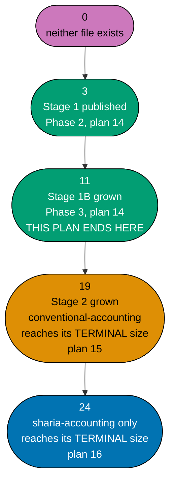

# Technical Documentation — Skills Paths: Accounting Foundations & Transactional Cycles

## Corpus Disposition

`archive-with-plan` — this plan custodies its own `syllabus/` corpus (courses #1–#11 only) and no
consumer **outside `plans/`** reads it (no checker, agent, Nx target, build/generation step, or
shipped content front-matter names a syllabus path). The corpus therefore moves to `plans/done/`
with the plan folder on archival. See
[Learning-Plan Syllabus Convention §Corpus Disposition](../../../repo-governance/conventions/structure/learning-plan-syllabus/corpus-disposition.md#corpus-disposition).

## Provenance of this split

The retired the superseded accounting-programme draft (reproduced and owned locally) plan authored all 24
courses and grew both manifests to their full terminal sizes (19 for `conventional-accounting`, 24
for `sharia-accounting`) in a single 11-phase delivery checklist. **This plan, together with
sibling plans 15 and 16, replaces that single plan with a strict sequential chain**, mapping the
retired plan's phases onto three smaller plans as follows:

| Retired plan's phase                                                            | Retired plan's scope                         | This chain's plan                                                                                                                                                                                                                                                                                                      |
| ------------------------------------------------------------------------------- | -------------------------------------------- | ---------------------------------------------------------------------------------------------------------------------------------------------------------------------------------------------------------------------------------------------------------------------------------------------------------------------- |
| Phase 1 (syllabus specs, all 24)                                                | All 24 courses' specs                        | Split: this plan authors specs for #1–#11; plan 15 for #12–#19; plan 16 for #20–#24                                                                                                                                                                                                                                    |
| Phase 2 (Stage 1: courses #1–#3, both manifests published at 3)                 | Courses #1–#3, manifest publish              | **This plan's own Phase 2** — unchanged in substance                                                                                                                                                                                                                                                                   |
| Phase 3 (Stage 2: courses #4–#19, both manifests grown to 19)                   | Courses #4–#19, manifest growth to 19        | **Split in two**: this plan's own Phase 3 grows courses #4–#11 and both manifests to 11; plan 15's own authoring phase grows courses #12–#19 and both manifests to 19                                                                                                                                                  |
| Phase 4 (verification debt: OI-1, OI-2, OI-3)                                   | Sharia-doctrinal verification debt           | Not carried by this plan (none of courses #1–#11 touch Sharia doctrine) — plan 16 owns OI-1/OI-2/OI-3, since only courses #20–#24 cite AAOIFI/PSAK Syariah/riba doctrine                                                                                                                                               |
| Phase 5 (Stage 3: courses #20–#24, sharia-accounting grown to 24)               | Sharia-only courses, manifest growth to 24   | plan 16's own authoring phase                                                                                                                                                                                                                                                                                          |
| Phases 6–10 (verification, manual UI, Rule-15, CI, knowledge capture, archival) | Corpus-wide sweeps, one retest, one final PR | **Each of the three plans runs its own instance** of these phases, scoped to its own authored slice, **including its own Rule-15 retest** scoped to what that plan actually ships (see [README.md §Rule-15 disposition](./README.md#rule-15-disposition-for-this-plan--scoped-retest-against-the-eleven-course-slice)) |

**Nothing about the domain's business/product reasoning changes.** The silent-failure constraint
(DD-609), the licensing posture (A8), the personas, and the A10/A11 two-path-one-corpus mechanics
are restated **verbatim** across all three plans — only the delivery-unit size and the phase
boundaries change.

## Overview

This plan delivers the **first eleven courses** of a twenty-four-course, two-manifest corpus (A10):
courses #1–#3 (the shared Dangerous-1 foundation) and courses #4–#11 (the transactional-and-cost-accounting
cycle: journal entries, revenue recognition, procure-to-pay, order-to-cash, managerial/cost
accounting, fixed assets, inventory/COGS, leases). All eleven courses are **shared-spine** courses —
none is Sharia-specific — so both manifests hold the identical 11-ID `courseOrder` at this plan's
end.

It touches **no application code**. Its artefacts are markdown page bundles under
`apps/ayokoding-www/content/`, two JSON manifest data files (created here) under
`apps/ayokoding-www/src/features/course-paths/manifests/skills/`, and eleven markdown spec files
inside this plan's own folder. Every component, resolver, schema, and route it depends on is built
by plans 01–03 and consumed here.

## The manifest ownership invariant across the sequential chain

Unlike the retired single plan (which owned both manifest data files and their tests for the whole
corpus lifecycle in one plan), **this three-plan chain shares custody of the same two files across
time, never concurrently**:

| Plan           | Touches `conventional-accounting.json` / `sharia-accounting.json` | State at plan's end                                                                                         |
| -------------- | ----------------------------------------------------------------- | ----------------------------------------------------------------------------------------------------------- |
| 14 (this plan) | **Creates both files**, grows both 0 → 3 → 11                     | Both hold 11 identical IDs                                                                                  |
| 15             | Grows both further, 11 → 19                                       | `conventional-accounting.json` reaches its **terminal** 19; `sharia-accounting.json` also at 19, continuing |
| 16             | Grows `sharia-accounting.json` only, 19 → 24                      | `sharia-accounting.json` at its terminal 24; `conventional-accounting.json` **untouched** since plan 15     |

**This is safe because the chain is strictly sequential** — plan 15 does not start authoring until
this plan's course bodies, manifests, and landings are merged to `origin/main` (repository baseline context,
checked mechanically at plan 15's own Phase 0), and plan 16 does not start until plan 15's merge.
There is never a window where two plans in this chain edit the same manifest file concurrently.
Each manifest's co-located unit test (`conventional-accounting-manifest.unit.test.ts`,
`sharia-accounting-manifest.unit.test.ts`) is likewise **created by this plan** and **extended, not
replaced,** by plans 15 and 16 — new assertions are appended for the larger `courseOrder` length
each later plan grows to, following the same RED→GREEN→REFACTOR shape this plan establishes.

**No plan among 14, 15 and 16 creates an `_index.md` under `paths/`.** Every structural index —
`paths/_index.md`, `paths/careers/_index.md`, the three `paths/careers/<arc>/_index.md`, and
`paths/skills/_index.md` — belongs to `ayokoding-learning-path-01-url-restructure` (A3 ruling,
2026-07-21). Both path **landings** are this plan's to **create**; the **bucket** they sit in is
not.

## Two manifests, shared courses (A10 + A11)

**A11 is the schema's existing rule, not a new mechanism this plan invents.** Plan 02's own
`tech-docs.md` (archived under `plans/done/`) establishes:

- _"No course ID appears twice **within one manifest**"_ [Repo-grounded —
  `ayokoding-learning-path-02-schema-and-prerequisite-dag/tech-docs.md`, locate via
  `grep -F 'No course ID appears twice'`]. The uniqueness constraint is **per manifest**. The same ID
  appearing in both `conventional-accounting.json` and `sharia-accounting.json` violates nothing.
- _"No course body is duplicated per path (all manifests reference courses **by ID**, never copy a
  body)"_ [Repo-grounded — same file, locate via `grep -F 'No course body is duplicated'`].
- _"One body cannot encode four orders; moving order to the manifest [is what enables the shared
  library]"_ [Repo-grounded — same file, DD-1, locate via
  `grep -F 'One body cannot encode four orders'`].

**Consequence for this plan**: all eleven of this plan's courses are authored **once**, under
`<COURSES>`, and referenced by both manifests. `conventional-accounting.json`'s and
`sharia-accounting.json`'s `courseOrder`s are **byte-identical** at this plan's end — 11 entries,
same order. This identity persists through course #19 (plan 15's terminus for
`conventional-accounting`); `sharia-accounting.json` alone continues past that point in plan 16.

**"Interleaves" (A10's own wording) resolves to shared-then-Sharia composition, not mid-ramp
alternation** — unchanged from the retired plan's DD-601 reasoning, restated here since this plan is
where the two manifests are first created: the array is built by combining IDs from two
authored-once pools (shared courses landing in plans 14/15, Sharia-specific courses landing only in
plan 16), never by scattering Sharia content through the conventional spine. That reading would
contradict the silent-failure argument (DD-609) that the Sharia stage sits at the corpus's end.

## Path constants

- `<COURSES>` = `apps/ayokoding-www/content/en/learn/courses/` — course bundles; served at
  `/en/learn/courses/<course-id>` _(created by plan 01)_
- `<PATHS>` = `apps/ayokoding-www/content/en/learn/paths/` — path landings; served at
  `/en/learn/paths/<path-id>` _(created by plan 01)_
- `<LANDING_CA>` = `<PATHS>skills/conventional-accounting/` — **created by this plan**
- `<LANDING_SA>` = `<PATHS>skills/sharia-accounting/` — **created by this plan**
- `<FEAT>` = `apps/ayokoding-www/src/features/course-paths/` _(created by plans 02 and 03)_
- `<MANIFESTS>` = `<FEAT>manifests/` — JSON manifest data files, nested to mirror slash path IDs
- `<MANIFEST_CA>` = `<MANIFESTS>skills/conventional-accounting.json` — **created by this plan**
- `<MANIFEST_SA>` = `<MANIFESTS>skills/sharia-accounting.json` — **created by this plan**
- `<MTEST_CA>` = `<MANIFESTS>skills/conventional-accounting-manifest.unit.test.ts` — **created by
  this plan**; extended by plans 15 and 16
- `<MTEST_SA>` = `<MANIFESTS>skills/sharia-accounting-manifest.unit.test.ts` — **created by this
  plan**; extended by plans 15 and 16. Both match the vitest `unit` project's
  `**/*.unit.{test,spec}.{ts,tsx}` include [Repo-grounded — `apps/ayokoding-www/vitest.config.ts`]
  and are excluded from the coverage denominator by that config's `**/*.{test,spec}.{ts,tsx}`
  exclude.
- `<PLANDIR>` = this plan's folder — `plans/backlog/ayokoding-learning-path-14-skills-accounting-foundations/`
  today, `plans/in-progress/…` once promoted for execution, `plans/done/YYYY-MM-DD__…` after Phase 9. [delivery.md §Path constants](./delivery.md#path-constants) carries the shell block that
  detects the current stage and re-derives every dependent constant in one command.
- `<SPEC>` = `<PLANDIR>syllabus/courses/` — this plan's own 11-file spec layer (courses #1–#11
  only), each carrying a module/topic breakdown
- `<SPECPATHS>` = `<PLANDIR>syllabus/paths/` — this plan's own **slice** of both path mirrors,
  holding `manifest-skills-conventional-accounting.md` and `manifest-skills-sharia-accounting.md`,
  **each containing only this plan's 11 rows** — not a running cross-plan file. Plan 15 and plan 16
  each hold their **own** slice files, inside their **own** folders, for their own course ranges;
  reconstructing the full ordered mirror means reading all three plans' slices in `courseOrder`
  sequence. See [§Syllabus layer](#syllabus-layer--custody-and-shape).
- `<DELIVERY>` = `<PLANDIR>delivery.md` — named through the constant, never as a bare `delivery.md`
- Path IDs: **`skills/conventional-accounting`** and **`skills/sharia-accounting`** — full slash
  strings, category segment included, no separate `category` field. Arc: `immediately-effective` on
  both. **Nothing keys on segment count.**

## The eleven-course catalog slice (courses #1–#11)

`(SWE)` marks a **linked** cross-domain prerequisite into the existing software-engineering
library — linked, never walked. All eleven courses in this plan's range are **shared** — authored
once, referenced by both manifests. No course in this range is Sharia-specific.

> **The 24-course count, the 11/8/5 split across this three-plan chain, and the three-stage
> grouping are curriculum judgment, not a sourced fact** [Judgment call], restated from the retired
> plan's own framing. What is sourced is the dependency structure and the domain facts each course
> teaches; the packaging into plans is an additional editorial decision layered on top of the
> retired plan's own editorial packaging into courses.

| #   | Course ID                                    | Format     | Prerequisites (this range) | External link          |
| --- | -------------------------------------------- | ---------- | -------------------------- | ---------------------- |
| 1   | `accounting-foundations`                     | By Example | —                          | —                      |
| 2   | `chart-of-accounts-and-data-modeling`        | By Example | 1                          | `sql-essentials` (SWE) |
| 3   | `financial-statements-and-close-cycle`       | By Example | 2                          | —                      |
| 4   | `journal-entries-and-posting-mechanics`      | By Example | 3                          | —                      |
| 5   | `accrual-accounting-and-revenue-recognition` | By Example | 4                          | —                      |
| 6   | `accounts-payable-and-procure-to-pay`        | By Example | 4                          | —                      |
| 7   | `accounts-receivable-and-order-to-cash`      | By Example | 4, 5                       | —                      |
| 8   | `managerial-and-cost-accounting`             | By Example | 3                          | —                      |
| 9   | `fixed-assets-and-depreciation`              | By Example | 2                          | —                      |
| 10  | `inventory-and-cogs-accounting`              | By Example | 2, 8                       | —                      |
| 11  | `lease-and-intangible-asset-accounting`      | By Example | 9                          | —                      |

**Format counts, this plan's range**: all 11 By Example. No Annotated-concept course falls in
courses #1–#11 — the five Annotated-concept courses (#14, #15, #18, #20, #23) all land in plans 15
and 16.

**The ramp order is a valid topological order** for every prerequisite edge above — every numbered
prerequisite of a course in this range is a course with a lower number, so `courseOrder` in catalog
order satisfies `checkPrerequisiteConsistency` by construction. **No course in this range cites a
prerequisite outside this range.**

### The full 24-course catalog, for context (this plan authors only rows 1–11)

The full catalog — including the eight courses plan 15 authors (#12–#19) and the five courses
plan 16 authors (#20–#24) — is reproduced here **once**, in full, since this plan is where the
corpus is first introduced to this three-plan chain. Plans 15 and 16 reference this table rather
than re-deriving it.

| #   | Course ID                                      | Owning plan | Format            | Prerequisites (full catalog)     | Stage |
| --- | ---------------------------------------------- | ----------- | ----------------- | -------------------------------- | ----- |
| 1   | `accounting-foundations`                       | 14          | By Example        | —                                | 1     |
| 2   | `chart-of-accounts-and-data-modeling`          | 14          | By Example        | 1, `sql-essentials` (SWE)        | 1     |
| 3   | `financial-statements-and-close-cycle`         | 14          | By Example        | 2                                | 1     |
| 4   | `journal-entries-and-posting-mechanics`        | 14          | By Example        | 3                                | 1B    |
| 5   | `accrual-accounting-and-revenue-recognition`   | 14          | By Example        | 4                                | 1B    |
| 6   | `accounts-payable-and-procure-to-pay`          | 14          | By Example        | 4                                | 1B    |
| 7   | `accounts-receivable-and-order-to-cash`        | 14          | By Example        | 4, 5                             | 1B    |
| 8   | `managerial-and-cost-accounting`               | 14          | By Example        | 3                                | 1B    |
| 9   | `fixed-assets-and-depreciation`                | 14          | By Example        | 2                                | 1B    |
| 10  | `inventory-and-cogs-accounting`                | 14          | By Example        | 2, 8                             | 1B    |
| 11  | `lease-and-intangible-asset-accounting`        | 14          | By Example        | 9                                | 1B    |
| 12  | `multi-currency-accounting-and-fx-translation` | 15          | By Example        | 3                                | 2     |
| 13  | `consolidation-and-multi-entity-accounting`    | 15          | By Example        | 3, 2, 12                         | 2     |
| 14  | `financial-reporting-standards-ifrs-vs-gaap`   | 15          | Annotated-concept | 5, 11                            | 2     |
| 15  | `audit-controls-and-compliance`                | 15          | Annotated-concept | 3                                | 2     |
| 16  | `payroll-and-tax-accounting-essentials`        | 15          | By Example        | 2                                | 2     |
| 17  | `treasury-and-cash-management`                 | 15          | By Example        | 6, 7                             | 2     |
| 18  | `financial-reporting-and-xbrl`                 | 15          | Annotated-concept | 14                               | 2     |
| 19  | `general-ledger-system-architecture`           | 15          | By Example        | 2, 3, `backend-essentials` (SWE) | 2     |
| 20  | `sharia-accounting-and-aaoifi-standards`       | 16          | Annotated-concept | 5, 14                            | 3     |
| 21  | `islamic-contract-modeling-for-systems`        | 16          | By Example        | 20, 2                            | 3     |
| 22  | `zakah-computation-and-reporting-for-systems`  | 16          | By Example        | 21                               | 3     |
| 23  | `sukuk-and-islamic-capital-markets-accounting` | 16          | Annotated-concept | 21, 12                           | 3     |
| 24  | `sharia-ledger-system-architecture`            | 16          | By Example        | 21, 19                           | 3     |

**Cross-plan-boundary edges, stated precisely** (verified against the exact edges above, not the
looser prose summary that seeded this split): courses #20 (cites #14), #23 (cites #12), and #24
(cites #19) each reach back into **plan 15's** course range. This is exactly **three** edges, not
four — course #21's own prerequisites (#20, #2) resolve entirely within plan 16 and plan 14
respectively, reaching neither into plan 15's range. All three edges are satisfiable because plan
15 completes, and is merged to `origin/main`, before plan 16 begins (the sequential historical source context
chain). **No course in plan 14's own range (#1–#11) is cited as a prerequisite by anything in plans
15 or 16 outside the ordinary forward-ramp reads every later course makes of the shared spine** —
this plan's own outbound edges are entirely internal.

## Staged manifest growth across the three-plan chain

This is the mechanical heart of the split, stated precisely because the retired plan's own Phase
2/3/5 boundaries do **not** map one-to-one onto this chain's plan boundaries — Phase 3 (in the
retired plan, courses #4–#19 in one sixteen-course sub-phase) splits into **two** separate
authoring passes across two separate plans, with a manifest-length seam at 11 that the retired plan
never had:



**Accessibility note.** Plan ownership of each growth step is carried by node **shape** (all
stadium here, since this is a single linear sequence, not a role comparison) and by explicit text
in every label, never by colour alone; colour is retained only to visually group each step with its
owning plan.

| Step                         | `conventional-accounting.json` length           | `sharia-accounting.json` length | Owning plan | Owning phase                                      |
| ---------------------------- | ----------------------------------------------- | ------------------------------- | ----------- | ------------------------------------------------- |
| Before Phase 2               | 0 (file does not exist)                         | 0 (file does not exist)         | 14          | —                                                 |
| After Phase 2                | 3                                               | 3                               | 14          | Phase 2                                           |
| After Phase 3                | **11**                                          | **11**                          | 14          | Phase 3 — **this plan's terminal manifest state** |
| After plan 15's growth phase | 19 (**terminal — frozen forever**)              | 19                              | 15          | plan 15's own authoring phase                     |
| After plan 16's growth phase | 19 (unchanged, verified via `git diff --quiet`) | **24 (terminal)**               | 16          | plan 16's own authoring phase                     |

**Why the seam lands at 11, not at the retired plan's own Phase 3 boundary of 19.** The retired
plan's Phase 3 grew both manifests from 3 to 19 in one sixteen-course sub-phase because it was one
plan authoring one contiguous stretch. This chain's split point (11) is this plan's own business
rationale — see [brd.md §Why courses #1–#11 land here](./brd.md#why-courses-111-land-here-not-more-or-fewer) —
layered on top of the retired plan's course numbering; it introduces a growth-length checkpoint the
retired plan never needed because it never paused mid-Stage-2. **This plan's own Phase 3 gate
therefore asserts a NEW invariant the retired plan's Phase 3 gate did not have**: `courseOrder`
length equals exactly 11, not 19 — see [delivery.md Phase 3 Gate](./delivery.md#phase-3-gate).

**Six properties both manifests must hold at this plan's end, each asserted at the Phase 3 gate**:

1. `pathId` is the FULL slash string, category segment included.
2. `arc` is a separate required field, `immediately-effective` on both.
3. Every `courseOrder` entry is a plain course-ID string — no `{ id, framing }` mappings.
4. Neither manifest's `courseOrder` contains `sql-essentials`.
5. Both manifests' `courseOrder`s are **byte-identical**, 11 entries.
6. **Neither manifest exceeds 11 entries at this plan's end** — the falsifiable boundary that makes
   plan 15's own starting state unambiguous.

## Syllabus layer — custody and shape

This plan's syllabus layer follows the same folder convention
`ayokoding-learning-path-02-schema-and-prerequisite-dag` established for custodied human-readable
mirrors, applied inside this plan's own folder. The per-course file shape is inherited from plan
02's 120 existing `syllabus/courses/*.md` files (same header fields, section names and order,
problem-before-solution framing) and from the retired plan 06's own accounting-specific adaptation
(no `**Language**` field, `## Applied synthesis (no build — A6)` instead of `## Capstone spec`) —
see [Learning-Plan Syllabus Convention](../../../repo-governance/conventions/structure/learning-plan-syllabus.md)
for the measured section tiers this shape satisfies.

| Half             | Location                                                                                                   | Contents                                                                                          |
| ---------------- | ---------------------------------------------------------------------------------------------------------- | ------------------------------------------------------------------------------------------------- |
| Per-course specs | `<SPEC>`                                                                                                   | 11 `<course-id>.md` files (courses #1–#11) plus a folder `README.md`                              |
| Path mirrors     | `<SPECPATHS>manifest-skills-conventional-accounting.md`, `<SPECPATHS>manifest-skills-sharia-accounting.md` | **This plan's own slice only** — 11 rows in each, matching this plan's `courseOrder` contribution |

**Path ids inside every spec use the canonical prefixed form** — `skills/conventional-accounting` or
`skills/sharia-accounting`, never a bare subject slug.

Each per-course spec is one `<course-id>.md` file, sectioned exactly as plan 02's own files are, in
the same order:

- **H1 + top matter** — `# <Title> (By Example)` and a `**Course ID**` / `**Format**` line, a
  `**Scope note**`, and a short summary.
- **`## Why this exists · the big idea`** — the problem before the solution, and
  keep-this-if-you-forget-everything.
- **`## Prerequisites`** — prior courses (including the linked `sql-essentials` edge on course #2)
  and assumed knowledge.
- **`## Accuracy notes`** — every claim this course depends on that is dated, standard-specific, or
  method-specific (revenue-recognition standard, lease-accounting standard, depreciation and
  inventory-costing method names), carried with its `[Verified]` / `[Unverified]` /
  `[Needs Verification]` tag.
- **`## Concepts`** — the `co-NN` enumeration, floor ≥ 8, domain knowledge and architecture only,
  never a build exercise.
- **`## Worked examples`** — `ex-NN`, each citing its `co-NN`, Beginner/Intermediate/Advanced bands
  (all eleven courses in this plan's range are By Example format). "Verify" means recompute by hand
  or spreadsheet against a stated expected figure.
- **No `## Capstone spec` section.** `## Applied synthesis (no build — A6)` instead — one
  integrative worked scenario per course.
- **`## Read more`** — 2–3 real, citable sources, nominative citation only.
- **`## In which paths`** — one line per consuming manifest (`conventional-accounting`,
  `sharia-accounting`), each stating its stage and a short thematic label.

**Post-authoring verification (A12-compliant)**: every syllabus is **authored first**, from domain
reasoning; only **after** a syllabus exists does Phase 1 dispatch `web-researcher`, and only to
check **coverage**. A coverage finding is actionable only as "add/remove this concept," never as
"reorder to match theirs."

## Licensing and IP Compliance (A8)

**`A8` binds the whole seven-plan-and-growing programme, not only this plan** — restated verbatim
from the retired plan, since this plan is the first of the three-plan chain to author any content.

**Strict clean-room licensing binds every course.** No standards text, proprietary schema, or
copyleft code is ever reproduced; every concept is restated in original words citing number and
title only.

### Posture per body relevant to this plan's range

Courses #1–#11 cite general accounting standards (ASC 606/IFRS 15 revenue recognition, ASC
842/IFRS 16 lease accounting, GAAP/IFRS depreciation and inventory-costing method names) but touch
**no** Sharia-specific standards body (AAOIFI, PSAK Syariah). Only the IFRS Foundation, FASB/GAAP,
and MASB postures are relevant here; the full four-body posture table (including AAOIFI and IAI,
relevant to plan 16) is restated verbatim in plan 15's and plan 16's own `tech-docs.md`.

| Body            | Posture                                                                                                                                                                                                                                                        |
| --------------- | -------------------------------------------------------------------------------------------------------------------------------------------------------------------------------------------------------------------------------------------------------------- |
| IFRS Foundation | **The most open of the bodies this plan's range touches, but narrowly so.** Its own designated teaching materials are reproducible under conditions; the Standards text is not. `[Verified, 2026-07-22 grounding run, carried forward from the retired plan]`. |
| FASB (US GAAP)  | Closed copyright.                                                                                                                                                                                                                                              |

**No public-domain chart of accounts exists anywhere.** [Verified, carried forward from the retired
plan's 2026-07-22 grounding run]. Every chart of accounts that appears in this plan's courses —
course #2 onward — is **originally authored**, never copied from any textbook, standard, or
reference implementation.

### The eleven safe-authoring rules (bind every course in this plan, restated verbatim)

1. Restate concepts in original words; never reproduce standards text, tables, or clause numbering
   layouts.
2. Cite standard number + title + official link; quote nothing.
3. Never translate a standard.
4. Author every chart of accounts, worked example and dataset originally.
5. Reference implementations: prefer permissive licences; describe copyleft projects behaviourally
   rather than quoting their code.
6. Never paste code from a copyleft codebase, in any quantity.
7. Use vendor names nominatively only — never in a title or path segment.
8. Screenshots of proprietary software are out.
9. Carry `[Verified]` / `[Unverified]` / `[Needs Verification]` markers verbatim into course
   frontmatter or body where a claim depends on them.
10. Where a doctrinal claim rests on secondary sources only, say so in the course. (No claim in this
    plan's range currently rests on secondary-only sourcing; this rule is inherited for consistency
    with plans 15/16, where it binds materially.)
11. When in doubt between describing and reproducing, describe.

### The _Baker v. Selden_ basis — why domain reimplementation is lawful

Restated verbatim from the retired plan: **17 U.S.C. §102(b)** and **EU Directive 2009/24/EC
Art. 1(2)** exclude ideas, procedures, processes and systems from copyright. **_Baker v. Selden_**
(101 U.S. 99, 1879) is directly on point — a bookkeeping system case — and is the strongest
authority for this corpus's posture across all three plans in this chain.

### Where this binds mechanically

Phase 1's syllabus authoring records each course's licensing-sensitive sources so Phase 4's
licensing reading audit has a concrete list to check against. See
[delivery.md Phase 4](./delivery.md#phase-4-section-and-app-verification) for the audit step.

## The ramp and its stages (this plan's slice)

| Stage | Courses | Boundary                                                       | Path(s) | Delivery phase | Reader outcome                                                                                                                                               |
| ----- | ------- | -------------------------------------------------------------- | ------- | -------------- | ------------------------------------------------------------------------------------------------------------------------------------------------------------ |
| 1     | #1–#3   | **Dangerous 1** ⚡                                             | both    | Phase 2        | Working, correctly balancing ledger; routine postings; three statements, single entity                                                                       |
| 1B    | #4–#11  | Transactional-cycle complete (internal, not cross-plan-facing) | both    | Phase 3        | Full transactional-and-cost-accounting cycle: journal entries, revenue recognition, AP, AR, managerial/cost accounting, fixed assets, inventory/COGS, leases |

Courses #12–#19 (Stage 2 continuing, Dangerous-2) and #20–#24 (Stage 3, Dangerous-3) are plan 15's
and plan 16's own ramp continuations respectively — not restated here.

### Landing content contract — what each landing must convey (this plan's contribution)

Each landing states, in prose, before any rendered course list: (1) its arc promise, stated once,
with no arc chooser; (2) the Dangerous-1 boundary, naming both the capability it confers and the
limit the reader has not yet cleared; (3) `sharia-accounting`'s landing additionally states the
**path-choice affordance** distinguishing it from `conventional-accounting`; and (4) the one linked
cross-domain prerequisite reachable within this plan's range (`sql-essentials`), linked at its
canonical `/en/learn/courses/<id>` URL. **This plan's own landing content does not yet state path
completeness for either path** — that claim belongs to plan 15 (for `conventional-accounting`, at
course #19). The rendered course list itself is never hand-listed in the landing — plan 03's
component renders it from the loaded manifest.

## How accounting joins the library DAG (this plan's own edge)

**This plan carries exactly one inbound cross-domain prerequisite edge, in the shared spine,
resolved by course #2**:


**Accessibility note.** Domain is carried by node **shape** (rectangle = existing library course,
hexagon = accounting course) and by the edge's explicit label, never by colour alone.

The second linked cross-domain edge (`backend-essentials`, resolved by course #19) lands in plan
15's range, not this plan's. **Zero outbound edges into software engineering** — no existing
library course gains an accounting prerequisite from this plan's range.

**This plan carries no dependency on `ayokoding-learning-path-04-course-authoring`** — the one
inbound edge is among plan 01's **37 re-homed bundles** [Repo-grounded — verified present under
`apps/ayokoding-www/content/en/learn/fundamentally-strong/software-engineer/`].

## Link, do not walk (the cross-domain composition rule)

Neither manifest's `courseOrder` contains `sql-essentials`. It is **linked** — declared in course
\#2's `prerequisites:` frontmatter, surfaced on that course's page by plan 03's prerequisite display,
and linked from both landings.

## Manifest format

```json
{
  "pathId": "skills/conventional-accounting",
  "arc": "immediately-effective",
  "title": "Conventional Accounting for Systems Builders",
  "description": "Build a ledger that balances, then run the full transactional cycle a mid-size company depends on.",
  "courseOrder": [
    "accounting-foundations",
    "chart-of-accounts-and-data-modeling",
    "financial-statements-and-close-cycle",
    "journal-entries-and-posting-mechanics",
    "accrual-accounting-and-revenue-recognition",
    "accounts-payable-and-procure-to-pay",
    "accounts-receivable-and-order-to-cash",
    "managerial-and-cost-accounting",
    "fixed-assets-and-depreciation",
    "inventory-and-cogs-accounting",
    "lease-and-intangible-asset-accounting"
  ]
}
```

```json
{
  "pathId": "skills/sharia-accounting",
  "arc": "immediately-effective",
  "title": "Sharia-Compliant Accounting for Systems Builders",
  "description": "Every basic the conventional path teaches, plus murabaha, ijara, mudaraba, musharaka, zakah and sukuk modelled correctly.",
  "courseOrder": [
    "accounting-foundations",
    "chart-of-accounts-and-data-modeling",
    "financial-statements-and-close-cycle",
    "journal-entries-and-posting-mechanics",
    "accrual-accounting-and-revenue-recognition",
    "accounts-payable-and-procure-to-pay",
    "accounts-receivable-and-order-to-cash",
    "managerial-and-cost-accounting",
    "fixed-assets-and-depreciation",
    "inventory-and-cogs-accounting",
    "lease-and-intangible-asset-accounting"
  ]
}
```

## Stage-signal contract (the plan-18 handoff, stage granularity)

**This plan emits NO cross-plan stage signal.** This is a deliberate design decision, stated
explicitly rather than left as a silent gap:

- The retired plan's own stage-signal contract recorded exactly two cross-plan signals across its
  whole lifecycle (`STAGE: 1` at the end of its Phase 2, `STAGE: 3` at the end of its Phase 5) —
  its own Stage 2 (courses #4–#19 complete, `conventional-accounting` done) explicitly emitted **no**
  recorded signal, because "it hands plan 07 nothing that Stage 1 did not already clear."
- **This plan's own boundary (course #11) is not one of the retired plan's own stage boundaries at
  all** — it is a new seam this three-plan split introduces, internal to the accounting chain, with
  no ERP-facing capability of its own. Emitting a signal here would assert an ERP-facing milestone
  this split's own course numbering does not support.
- Per this plan's authoring instructions, **only plans 15 and 16 carry `blocks` edges into**
  `ayokoding-learning-path-18-skills-erp-enterprise-depth`, at their own
  stage granularity (Dangerous-2 for plan 15, Dangerous-3 for plan 16). See plan 15's and plan 16's
  own `tech-docs.md §Stage-signal contract` sections for the recorded signal shape.

**What plan 15 checks instead of a stage signal**: a plain merge-presence check, the same mechanism
the retired plan used to gate on plans 01/02/03:

```bash
git log origin/main --oneline | grep -q "ayokoding-learning-path-14-skills-accounting-foundations" \
  || echo "NOT MERGED: ayokoding-learning-path-14-skills-accounting-foundations"
```

Acceptance: empty output. This is plan 15's own Phase 0 precondition, not a signal this plan emits.

## Programme decisions

> **Restated verbatim from the retired plan's own tech-docs.md**, which itself folded these from a
> now-deleted shared programme file. Only the ids this plan cites are reproduced.

| Id  | Decision                                                                                                                                                                    |
| --- | --------------------------------------------------------------------------------------------------------------------------------------------------------------------------- |
| R8  | Every `skills/` path uses the **immediately-effective** arc, always                                                                                                         |
| R9  | Every plan declares its **UI-gate and API-gate posture explicitly**                                                                                                         |
| A3  | Plan 01 owns **every structural `_index.md`** under `paths/`; every skills-category plan owns only its own path landings, manifests and corpora                             |
| A4  | Research verification status is carried forward verbatim — an `[Unverified]` claim must never be restated as fact                                                           |
| A6  | The accounting-domain plans teach the domain to **build-founding depth** — enough to implement the software — but contain **no system-building courses**                    |
| A8  | **Strict clean-room licensing, programme-wide** — nothing copyrighted is reproduced, and every concept is restated in original words with a citation                        |
| A9  | The accounting corpus **expands past 20 courses** as the domain requires; every derived count follows                                                                       |
| A10 | The skills category carries **two accounting paths** — `conventional-accounting`, `sharia-accounting`; each Sharia path covers the basics too, and `A11` governs how        |
| A11 | Shared courses are **referenced by both manifests, authored once** — a Sharia path's `courseOrder` interleaves shared and Sharia-specific ids rather than duplicating files |
| A12 | Every syllabus is **independently authored, then externally confirmed** — a published curriculum may corroborate coverage but must never supply the structure being written |

### A6 — the build-founding-depth line

- **In scope**: the domain knowledge an implementer needs — double-entry mechanics, the
  subledger-to-general-ledger relationship, costing methods, period close, document state machines,
  posting rules, the failure modes each of these produces.
- **Out of scope**: building it. No capstone that constructs a system, no "implement X" exercise, no
  scaffolded codebase the reader extends.

None of this plan's eleven courses is an architecture-closing course (those are #19, in plan 15,
and #24, in plan 16); this plan's own applied-synthesis sections are integrative worked scenarios,
never build exercises.

### A8 — licensing binds the whole chain, restated

Every course example, dataset, and chart of accounts is authored originally; documentation prose,
figures, and datasets are never lifted from a framework's docs, a vendor site, or an unexamined
source; trademarks are used nominatively only.

### A12 — how a syllabus may and may not be confirmed

1. Author the syllabus from domain reasoning and this plan's own grounding.
2. **Then** research externally to ask whether the coverage is right.
3. Treat the answer as **evidence about coverage**, never as a structure to adopt.

## Design Decisions

- **DD-1401 · This plan is one of a three-plan sequential chain replacing the retired single
  the superseded accounting-programme draft plan.** Full mapping:
  [§Provenance of this split](#provenance-of-this-split).
- **DD-1402 · "Interleaves" (A11) resolves to shared-then-Sharia composition, not mid-ramp
  alternation.** Unchanged from the retired plan's DD-601.
- **DD-1403 · This plan creates both manifests and their co-located unit tests; plans 15 and 16
  extend, never replace, those same files.** New to this split — the retired plan's DD-602 assumed
  one plan owned the whole lifecycle; this decision replaces it for the three-plan chain.
- **DD-1404 · The 11 syllabus specs in this plan's range live in this plan's own folder**, not
  plan 02's corpus and not any sibling plan's folder. Unchanged in mechanism from the retired
  plan's DD-603, scoped to this plan's own course range.
- **DD-1405 · Link, do not walk**, for this plan's one linked prerequisite (`sql-essentials`).
  Unchanged in mechanism from the retired plan's DD-604.
- **DD-1406 · This plan has NO dependency on `ayokoding-learning-path-04-course-authoring`.**
  Unchanged reasoning from the retired plan's DD-605.
- **DD-1407 · `courseOrder` entries are plain ID strings, with no `framing` mappings.** Unchanged
  from the retired plan's DD-606.
- **DD-1408 · This plan emits no cross-plan stage signal — see [§Stage-signal contract](#stage-signal-contract-the-plan-18-handoff-stage-granularity)
  for the full reasoning.** New to this split, replacing the retired plan's DD-623 (ERP-capability
  granularity) with a decision about **which** plans in the chain emit a signal at all.
- **DD-1409 · Every id list in `delivery.md` is a shell ARRAY, never a space-separated string.**
  Unchanged HARD rule from the retired plan's DD-622.
- **DD-1410 · `business/accounting.md` is mined, not transplanted (course #1).** Unchanged from the
  retired plan's DD-626.
- **DD-1411 · Syllabus file shape is inherited from plan 02's `syllabus/courses/*.md`, adapted for
  a non-code, no-build domain.** Unchanged from the retired plan's DD-627.
- **DD-1412 · This plan's own Phase 3 gate introduces a manifest-length checkpoint (exactly 11) the
  retired plan never needed**, because the retired plan never paused mid-Stage-2. See
  [§Staged manifest growth](#staged-manifest-growth-across-the-three-plan-chain).

## UI-gate and API-gate posture (R9)

### UI gate — **exempt**

`swe-ui-checker` validates component **source**. This plan authors **zero** files under
`apps/ayokoding-www/src/features/course-paths/` other than two YAML **data** files. A checker run
scoped to this plan's diff would scan zero component files: a **vacuous pass**, recorded as an
exemption instead of asserted as evidence.

**The exemption is narrow.** It covers the `ui-quality-gate` **only**. Manual behavioural
verification via Playwright MCP is **mandatory and performed** (Phase 5, both landings), and **this
plan's own Rule-15 three-tester retest also runs in Phase 5**, scoped to the two live partial
landings as they exist at this plan's end — see
[README.md §Rule-15 disposition](./README.md#rule-15-disposition-for-this-plan--scoped-retest-against-the-eleven-course-slice).

### API gate — **NOT exempt**

**Manifest integrity is behaviour.** Exercised through both manifests' zod validation,
`checkManifestIntegrity`, and `checkPrerequisiteConsistency`, run as unit assertions at every
publication and growth step and re-run as a sweep at the Phase 4 gate, plus the path-walk e2e for
both `pathId`s.

**What cannot run, and why**: `ayokoding-www` publishes no OpenAPI 3.x document and no GraphQL SDL;
`api-quality-gate` is therefore not claimed as run and passed.

**Rule-16 API exploratory retest — not applicable.**

## Other exemptions

### Specs and Gherkin (app-code)

This plan's app/lib-code footprint is small but not zero: two JSON manifest data files, plus three
TypeScript test-layer files — two co-located unit tests and one step-definition file pairing with
this plan's one shared Gherkin feature file (a Scenario Outline with two Examples rows, one per
path). All three TypeScript files are test code, covered by this plan's own Gherkin scenarios.

### UI-design funnel

Recorded in [prd.md §UI-design-funnel disposition](./prd.md#ui-design-funnel-disposition). No
net-new screen, no net-new component, no `assets/` folder, for either path.

## File-Impact Analysis

Root-relative annotated tree — the scan-first source of truth for this plan's scope. **[E]** edit,
**[N]** new file/pattern, **[D]** delete, **[G]** generated/regenerated.

```text
.
├── apps/ayokoding-www/content/en/learn/courses/
│   ├── _index.md [E] — append 11 catalog rows (file created by plan 01)
│   └── <course-id>/ [N] — 11 full page bundles, courses #1-#11; bounded family, members
│                          enumerated in this plan's own syllabus/courses/ spec layer
├── apps/ayokoding-www/content/en/learn/paths/skills/
│   ├── conventional-accounting/_index.md [N] — landing content, no `courseOrder`
│   └── sharia-accounting/_index.md [N] — landing content, no `courseOrder`
├── apps/ayokoding-www/src/features/course-paths/manifests/skills/
│   ├── conventional-accounting.json [N] — created here at 11 ids; plan 15 extends
│   ├── sharia-accounting.json [N] — created here at 11 ids; plans 15+16 extend
│   ├── conventional-accounting-manifest.unit.test.ts [N]
│   └── sharia-accounting-manifest.unit.test.ts [N]
├── specs/apps/ayokoding/behavior/ayokoding-www/gherkin/course-paths/
│   └── <this plan's feature file> [N] — Scenario Outline, two Examples rows
└── apps/ayokoding-www-fe-e2e/src/steps/<matching steps file> [N]
└── plans/in-progress/ayokoding-learning-path-14-skills-accounting-foundations/
    ├── tech-docs.md [E] — this file
    ├── delivery.md [E] — checkbox ticks and per-phase implementation notes
    ├── learnings.md [E] — running log, drained by the Knowledge Capture phase
    └── evidence/ [N] — phase-0 snapshot, growth records, Playwright screenshots
```

### More Detail

**This plan owns a `syllabus/` corpus and must ship its required folder layout.** Its
`## Corpus Disposition` above declares `archive-with-plan`, which makes it the corpus **custodian**,
so under the
[Learning-Plan Syllabus Convention §Required Folder Layout](../../../repo-governance/conventions/structure/learning-plan-syllabus/required-folder-layout.md#required-folder-layout)
the corpus needs `syllabus/README.md` (carrying the `**Custodian**` line), `syllabus/courses/README.md`,
and `syllabus/paths/README.md`. This is a **new** corpus created after that convention landed, so the
two per-subfolder READMEs are REQUIRED, not grandfathered — the plan folder rows above show them as
`[N]` because Phase 1 authors them.

The 11 `<course-id>/` bundles are bounded by this plan's own `syllabus/courses/` spec layer: the
member list is the set of spec files, not a glob over the content tree.

Both manifests are created here at 11 ids and later **grown** by plans 15 and 16. That later growth is
an explicitly authorized sequential hand-off, not a same-time collision — plan 14 finishes before plan
15 starts.

No `[D]` or `[G]` rows: this plan deletes nothing, and no emitter runs over its output.

| Path                                                    | Kind                                | Note                                                                                                                          |
| ------------------------------------------------------- | ----------------------------------- | ----------------------------------------------------------------------------------------------------------------------------- |
| `<SPEC><course-id>.md` × 11                             | _New files_                         | This plan's own spec layer, courses #1–#11                                                                                    |
| `<SPEC>../README.md`                                    | _New file_                          | Syllabus-folder index                                                                                                         |
| `<SPECPATHS>manifest-skills-conventional-accounting.md` | _New file_                          | This plan's own slice (11 rows)                                                                                               |
| `<SPECPATHS>manifest-skills-sharia-accounting.md`       | _New file_                          | This plan's own slice (11 rows, identical to the conventional slice)                                                          |
| `<COURSES><course-id>/**` × 11                          | _New dirs_                          | Full page bundles, one per course — never duplicated                                                                          |
| `<LANDING_CA>_index.md`                                 | _New file_                          | `conventional-accounting` landing content — **no `courseOrder`**                                                              |
| `<LANDING_SA>_index.md`                                 | _New file_                          | `sharia-accounting` landing content — **no `courseOrder`**                                                                    |
| `<MANIFEST_CA>`                                         | _New file_                          | Created here, grown to 11; extended by plan 15                                                                                |
| `<MANIFEST_SA>`                                         | _New file_                          | Created here, grown to 11; extended by plans 15 and 16                                                                        |
| `<MTEST_CA>`, `<MTEST_SA>`                              | _New files_                         | Co-located unit tests — created here, extended by later plans                                                                 |
| One Gherkin feature file + one step-definition file     | _New files_                         | Scenario Outline, two Examples rows — one per path's composition scenario                                                     |
| `<COURSES>_index.md`                                    | Existing                            | 11 catalog rows appended (created by plan 01)                                                                                 |
| `verification-log.md`                                   | _New file — created only if needed_ | Created at Phase 4.6 only if a `[Needs Verification]` marker survives the facts-checker sweep; one entry per surviving marker |
| `learnings.md`                                          | _New_                               | Knowledge-capture log                                                                                                         |
| `evidence/`                                             | _New_                               | Screenshot evidence from Phase 5's manual verification                                                                        |

**Never touched**: any `_index.md` under `<PATHS>` other than this plan's own two landing bundles;
any existing library course; `manifests/careers/**`; `manifests/skills/conventional-erp.json` and
`manifests/skills/sharia-erp.json` and their tests; any file inside plan 02's `syllabus/`; any file
inside plan 15's or plan 16's own `syllabus/` folder (they do not exist yet at this plan's
authoring time); any component, schema, or resolver.

**No new package dependency.**

## Testing / Verification Strategy

| Level                         | What it verifies                                                                                                                   | Mechanism                                                                         |
| ----------------------------- | ---------------------------------------------------------------------------------------------------------------------------------- | --------------------------------------------------------------------------------- |
| Manifest unit (TDD, ×2)       | Loads, zod-validates, integrity, prerequisite-consistency, exact `courseOrder` length (3, then 11), per manifest                   | `npm exec nx run ayokoding-www:test:unit`                                         |
| Path-walk e2e (×2)            | Both 2-segment `pathId`s resolve; `?path=` persists; prev/next follows manifest order                                              | `npm exec nx run ayokoding-www-fe-e2e:test:e2e`                                   |
| Composition assertions        | Linked prerequisite absent from both `courseOrder`s **and** present in frontmatter; shared-11 byte-identity                        | Grep-checkable clauses                                                            |
| Per-course content checks     | Concept coverage, register, format, worked-example volume, scope boundary                                                          | `apps-ayokoding-www-by-example-checker`                                           |
| Silent-failure assertion      | Every course #4–#11 carries its section                                                                                            | Grep-checkable clause on each authoring step                                      |
| Licensing audit               | No verbatim standards text, no proprietary CoA structure, no copyleft code pasted                                                  | Reading audit against Phase 1's licensing-sensitive-sources list (Phase 4)        |
| Structural                    | Bundle anatomy present; `prerequisites` declared                                                                                   | `test -d` / `test -f` plus frontmatter grep                                       |
| Ownership footprint           | Two manifest data files plus their tests; zero `_index.md` under `<PATHS>` outside the two landings                                | This plan's own merged-PR file list, authorship-scoped                            |
| Shared-course non-duplication | Exactly 11 directories under `<COURSES>` at Phase 3, never 22                                                                      | `find <COURSES> -maxdepth 1 -type d` intersected against this plan's IDs          |
| Section build                 | The authored tree renders                                                                                                          | `npm exec nx run ayokoding-www:build`                                             |
| Markdown quality              | markdownlint, link validation, heading hierarchy                                                                                   | `npm run lint:md` plus the two `rhino-cli md` subcommands                         |
| Regression                    | No existing project's gates broke                                                                                                  | `npm exec nx affected -t typecheck lint test:quick specs:behavior:coverage`       |
| Manual behavioural            | Both landings and sample courses render at three breakpoints in `en`                                                               | Playwright MCP plus committed `evidence/` screenshots                             |
| Rule-15 retest                | Live-site EWT/UWT/DWT triad against both partial landings and a sample of their courses, scoped to this plan's own 11-course slice | `web-exploratory-tester` + `web-usability-tester` + `web-design-tester` (Phase 5) |

**This plan's own Rule-15 retest** (the live-site EWT/UWT/DWT triad) is scoped to the two partial
landings as they exist at this plan's end — see
[README.md §Rule-15 disposition](./README.md#rule-15-disposition-for-this-plan--scoped-retest-against-the-eleven-course-slice).

**Deliberately not cited as evidence anywhere**: `ayokoding-www:test:e2e` and
`ayokoding-www:test:integration` are no-op echo targets. The real e2e project is
`ayokoding-www-fe-e2e` [Repo-grounded — `apps/ayokoding-www-fe-e2e/` present].

**Locale scope**: `en` only — `id/belajar/` holds zero courses and zero paths.

## Execution dependency

This plan has one direct execution prerequisite: `ayokoding-learning-path-13-careers-ai-manifest`, fully merged and archived on `origin/main`. Course-level source citations and repository facts are implementation context, not extra plan dependencies.

## Rollback

Every artefact is **additive**. Because this plan's own eleven courses have **zero outbound edges
into software engineering**, removing them cannot break any library course.

- **Per course**: `git rm -r <COURSES><course-id>/`, remove its row from `<COURSES>_index.md`, and
  remove its ID from both manifests.
- **Whole plan, before plan 15 starts**: revert every merge in reverse order and delete both
  manifests and both landings. `paths/skills/_index.md` survives — it is plan 01's.
- **Whole plan, after plan 15 or plan 16 has started**: **not safely revertible in isolation** — both
  later plans' manifests reference this plan's shared courses by ID, so removing them breaks plans
  15 and 16 downstream. Coordinate any rollback with those plans before applying it, exactly as the
  retired plan's own one-way-door rule stated for stage-level rollback against plan 07.
