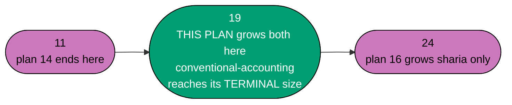
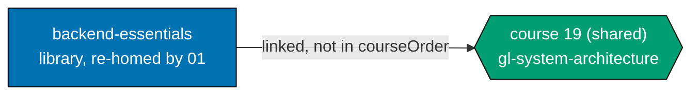
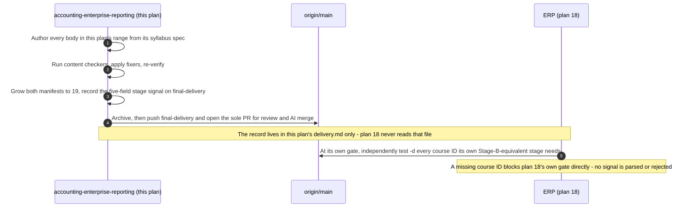

# Technical Documentation — Skills Paths: Accounting Enterprise Reporting & Architecture

## Corpus Disposition

`archive-with-plan` — this plan custodies its own `syllabus/` corpus (courses #12–#19 only) and no
consumer **outside `plans/`** reads it. The corpus therefore moves to `plans/done/` with the plan
folder on archival. See
[Learning-Plan Syllabus Convention §Corpus Disposition](../../../repo-governance/conventions/structure/learning-plan-syllabus/corpus-disposition.md#corpus-disposition).

## Provenance of this split

This plan is the **second** of the three-plan chain replacing the retired
the superseded accounting-programme draft (reproduced and owned locally) plan — see
`ayokoding-learning-path-14-skills-accounting-foundations/tech-docs.md §Provenance of this split`
for the full phase-to-plan mapping. This plan corresponds to the **second half** of the retired
plan's own Phase 3 (Stage 2, courses #4–#19 in the retired plan's numbering): specifically the
enterprise-reporting-and-architecture courses #12–#19, continuing directly from plan 14's own
Phase 3 (courses #4–#11).

**Nothing about the domain's business/product reasoning changes.** The silent-failure constraint,
the licensing posture, the personas, and the A10/A11 two-path mechanics are restated verbatim from
plan 14 — only the delivery-unit size and phase boundaries differ.

## Overview

This plan delivers the **second slice** of the twenty-four-course, two-manifest corpus (A10):
courses #12–#19 — multi-currency translation, consolidation, IFRS-vs-GAAP reporting, audit and
controls, payroll and tax, treasury and cash management, XBRL reporting, and the terminal
`general-ledger-system-architecture` course. All eight courses are **shared-spine** courses — none
is Sharia-specific — so both manifests hold the identical 19-ID `courseOrder` at this plan's end,
and `conventional-accounting.json` reaches its **terminal** state here.

It touches **no application code**. Its artefacts are markdown page bundles under
`apps/ayokoding-www/content/`, growth of two existing JSON manifest data files (created by plan 14), and
eight markdown spec files inside this plan's own folder.

## The manifest ownership invariant across the sequential chain (this plan's role)

This plan **extends, never replaces**, the two manifest data files and their co-located unit tests
created by plan 14:

| Plan           | Touches `conventional-accounting.json` / `sharia-accounting.json` | State at plan's end                                                                                         |
| -------------- | ----------------------------------------------------------------- | ----------------------------------------------------------------------------------------------------------- |
| 14             | Created both files, grew both 0 → 3 → 11                          | Both hold 11 identical IDs                                                                                  |
| 15 (this plan) | **Grows both further, 11 → 19**                                   | `conventional-accounting.json` reaches its **terminal** 19; `sharia-accounting.json` also at 19, continuing |
| 16             | Grows `sharia-accounting.json` only, 19 → 24                      | `sharia-accounting.json` at its terminal 24; `conventional-accounting.json` **untouched** since this plan   |

**This is safe because the chain is strictly sequential** — this plan does not start authoring
until plan 14's course bodies, manifests, and landings are merged to `origin/main` (hard
historical source context, checked mechanically at this plan's own Phase 0), and plan 16 does not start until this
plan's own merge. There is never a window where two plans in this chain edit the same manifest file
concurrently.

**No plan among 14, 15 and 16 creates an `_index.md` under `paths/`.** Both path **landings** were
created by plan 14; this plan only **updates** their content.

## Two manifests, shared courses (A10 + A11) — restated

**A11 is the schema's existing rule.** All eight of this plan's courses are authored **once**,
under `<COURSES>`, and referenced by both manifests. `conventional-accounting.json`'s and
`sharia-accounting.json`'s `courseOrder`s remain **byte-identical** at this plan's end — 19 entries,
same order. This is the **last** point at which the two manifests are identical: plan 16 diverges
`sharia-accounting.json` by five entries while `conventional-accounting.json` stays frozen. Full
rationale for the two-manifest, shared-course design: `ayokoding-learning-path-14-skills-accounting-foundations/tech-docs.md
§Two manifests, shared courses`.

## Path constants

Identical to plan 14's own constants (same repo paths, same manifest files, same test files), with
this plan's own `<SPEC>` and `<SPECPATHS>` pointing at its own folder:

- `<COURSES>`, `<PATHS>`, `<LANDING_CA>`, `<LANDING_SA>`, `<FEAT>`, `<MANIFESTS>`, `<MANIFEST_CA>`,
  `<MANIFEST_SA>`, `<MTEST_CA>`, `<MTEST_SA>` — same absolute paths as plan 14's, now at their
  11-entry (manifests) / 11-course (landings) starting state inherited from plan 14's merge.
- `<PLANDIR>` = this plan's folder —
  `plans/backlog/ayokoding-learning-path-15-skills-accounting-enterprise-reporting/` today.
- `<SPEC>` = `<PLANDIR>syllabus/courses/` — this plan's own 8-file spec layer (courses #12–#19).
- `<SPECPATHS>` = `<PLANDIR>syllabus/paths/` — this plan's own **slice** of both path mirrors (8
  rows each), inside this plan's own folder — never plan 14's.
- `<DELIVERY>` = `<PLANDIR>delivery.md`.

Full definitions, including the shell block that re-derives `<PLANDIR>` by lifecycle stage:
[delivery.md §Path constants](./delivery.md#path-constants).

## The eight-course catalog slice (courses #12–#19)

`(SWE)` marks a **linked** cross-domain prerequisite. All eight courses in this plan's range are
**shared** — authored once, referenced by both manifests.

| #   | Course ID                                      | Format            | Prerequisites (cross-plan noted) | External link              |
| --- | ---------------------------------------------- | ----------------- | -------------------------------- | -------------------------- |
| 12  | `multi-currency-accounting-and-fx-translation` | By Example        | 3 (plan 14)                      | —                          |
| 13  | `consolidation-and-multi-entity-accounting`    | By Example        | 3, 2 (plan 14), 12 (this plan)   | —                          |
| 14  | `financial-reporting-standards-ifrs-vs-gaap`   | Annotated-concept | 5, 11 (plan 14)                  | —                          |
| 15  | `audit-controls-and-compliance`                | Annotated-concept | 3 (plan 14)                      | —                          |
| 16  | `payroll-and-tax-accounting-essentials`        | By Example        | 2 (plan 14)                      | —                          |
| 17  | `treasury-and-cash-management`                 | By Example        | 6, 7 (plan 14)                   | —                          |
| 18  | `financial-reporting-and-xbrl`                 | Annotated-concept | 14 (this plan)                   | —                          |
| 19  | `general-ledger-system-architecture`           | By Example        | 2, 3 (plan 14)                   | `backend-essentials` (SWE) |

**Format counts, this plan's range**: 5 By Example, 3 Annotated-concept (#14, #15, #18) — the first
Annotated-concept courses in this three-plan chain (plan 14's own range was 100% By Example).

**The ramp order is a valid topological order**: every prerequisite of a course in this range
resolves either to a lower-numbered course inside this plan's own range, or to one of plan 14's
already-merged courses (#2, #3, #5, #6, #7, #11) — never forward into plan 16's range. This is the
mirror image of the cross-plan-boundary edges plan 16 carries into this plan's range (see plan 14's
tech-docs for the full accounting: courses #20, #23, #24 cite this plan's #14, #12, and #19
respectively).

## Staged manifest growth across the three-plan chain (this plan's step)



| Step                         | `conventional-accounting.json` length       | `sharia-accounting.json` length | Owning plan |
| ---------------------------- | ------------------------------------------- | ------------------------------- | ----------- |
| Before this plan (inherited) | 11                                          | 11                              | 14          |
| After this plan's Phase 2    | **19 (terminal — frozen forever)**          | **19**                          | 15          |
| After plan 16's growth phase | 19 (unchanged, verified `git diff --quiet`) | 24 (terminal)                   | 16          |

**Six properties both manifests must hold at this plan's end, each asserted at the Phase 2 gate**:

1. `pathId` is the FULL slash string, unchanged from plan 14.
2. `arc` remains `immediately-effective` on both.
3. Every `courseOrder` entry remains a plain course-ID string.
4. Neither manifest's `courseOrder` contains `backend-essentials`.
5. Both manifests' `courseOrder`s are **byte-identical**, 19 entries.
6. **`conventional-accounting.json` never grows again after this plan** — the falsifiable boundary
   plan 16 (and any later plan) must respect via `git diff --quiet`.

## Syllabus layer — custody and shape (this plan's own slice)

Same inherited shape as plan 14's own syllabus layer (plan 02's `syllabus/courses/*.md` structure,
adapted for a non-code, no-build domain). This plan's own eight specs live inside **this plan's
own** `syllabus/courses/` folder — never plan 14's, never plan 02's.

| Half             | Location                                                                                                   | Contents                                                             |
| ---------------- | ---------------------------------------------------------------------------------------------------------- | -------------------------------------------------------------------- |
| Per-course specs | `<SPEC>`                                                                                                   | 8 `<course-id>.md` files (courses #12–#19) plus a folder `README.md` |
| Path mirrors     | `<SPECPATHS>manifest-skills-conventional-accounting.md`, `<SPECPATHS>manifest-skills-sharia-accounting.md` | This plan's own slice only — 8 rows in each                          |

Three of this plan's eight courses (#14, #15, #18) are **Annotated-concept** format — their
`## Worked examples` section uses plan 02's themed grouping instead of the
Beginner/Intermediate/Advanced bands the retired plan's By Example courses use, per plan 02's own
convention for that format.

## Licensing and IP Compliance (A8)

Restated from plan 14, extended for this plan's range's specific volatile facts.

### Posture per body relevant to this plan's range

| Body            | Posture                                                                                                                                                                                |
| --------------- | -------------------------------------------------------------------------------------------------------------------------------------------------------------------------------------- |
| IFRS Foundation | The most open of the bodies this plan's range touches, but narrowly so — its own designated teaching materials are reproducible under conditions; the Standards text is not.           |
| FASB (US GAAP)  | Closed copyright.                                                                                                                                                                      |
| XBRL taxonomies | Each taxonomy release is a versioned, dated artefact — cited by version and release date, never quoted verbatim, and marked as a volatile fact requiring re-verification at authoring. |

**No public-domain chart of accounts exists anywhere.** [Verified, carried forward]. Every chart of
accounts in this plan's courses is originally authored.

### The eleven safe-authoring rules (restated verbatim, bind every course in this plan)

1. Restate concepts in original words; never reproduce standards text, tables, or clause numbering
   layouts.
2. Cite standard number + title + official link; quote nothing.
3. Never translate a standard.
4. Author every chart of accounts, worked example and dataset originally.
5. Reference implementations: prefer permissive licences (ledger-cli BSD-3-Clause, Apache Fineract
   Apache-2.0); describe copyleft projects (GnuCash GPLv2+, hledger GPLv3, Beancount GPL-2.0-only)
   behaviourally.
6. Never paste code from a copyleft codebase, in any quantity.
7. Use vendor names nominatively only.
8. Screenshots of proprietary software are out.
9. Carry `[Verified]` / `[Unverified]` / `[Needs Verification]` markers verbatim.
10. Where a doctrinal claim rests on secondary sources only, say so.
11. When in doubt between describing and reproducing, describe.

### `DD-15` reference-implementation precedent, applied to course #19

`general-ledger-system-architecture` (#19) extends the `DD-15` License-aware technology choices
precedent (inherited via plan 02's course corpus): ledger-cli (BSD-3-Clause) and Apache Fineract
(Apache-2.0) are named as permissively-licensed examples; GnuCash (GPLv2+), hledger (GPLv3), and
Beancount (GPL-2.0-only) are described behaviourally, never quoted from.

### Fast-moving facts, re-verify at authoring

Stable and safe to state: double-entry mechanics, current-rate vs. temporal FX translation method
names, the process names this plan cites. Volatile and requiring a dated accuracy-note sidebar: any
XBRL taxonomy release, any IFRS-vs-GAAP standard's effective date, any tooling version pin.

## The ramp and its stages (this plan's slice)

| Stage | Courses | Boundary           | Path(s)                                              | Delivery phase | Reader outcome                                                                                       |
| ----- | ------- | ------------------ | ---------------------------------------------------- | -------------- | ---------------------------------------------------------------------------------------------------- |
| 2     | #12–#19 | **Dangerous 2** ⚡ | both — `conventional-accounting` **terminates here** | Phase 2        | Most conventional systems a mid-size company runs, plus how to architect (not build) a ledger system |

### Landing content contract — what each landing must convey (this plan's update)

`conventional-accounting`'s landing states, for the first time, that **the path is complete** — no
further growth is coming. `sharia-accounting`'s landing states the Dangerous-2 boundary and
continues to promise the not-yet-authored Sharia stage (courses #20–#24, plan 16). Both continue
linking `sql-essentials` (plan 14's course #2) and now additionally link `backend-essentials`
(this plan's course #19) at its canonical URL.

## How accounting joins the library DAG (this plan's own edge)

**This plan carries exactly one inbound cross-domain prerequisite edge, resolved by course #19 —
the second and last such edge in the whole 24-course catalog:**



**Accessibility note.** Domain is carried by node **shape** and the edge's explicit label, never by
colour alone.

**Zero outbound edges into software engineering.** No existing library course gains an accounting
prerequisite from this plan's range. `backend-essentials` is among plan 01's **37 re-homed bundles**
[Repo-grounded — verified present under
`apps/ayokoding-www/content/en/learn/fundamentally-strong/software-engineer/`].

## Link, do not walk

Neither manifest's `courseOrder` contains `backend-essentials`. It is **linked** — declared in
course #19's `prerequisites:` frontmatter, surfaced on that course's page by plan 03's prerequisite
display, and linked from both landings.

## Manifest format (state at this plan's end)

```json
{
  "pathId": "skills/conventional-accounting",
  "arc": "immediately-effective",
  "title": "Conventional Accounting for Systems Builders",
  "description": "Build a ledger that balances, then learn the mistakes that still balance — the complete conventional path.",
  "courseOrder": [
    "accounting-foundations",
    "chart-of-accounts-and-data-modeling",
    "financial-statements-and-close-cycle",
    "journal-entries-and-posting-mechanics",
    "accrual-accounting-and-revenue-recognition",
    "accounts-payable-and-procure-to-pay",
    "accounts-receivable-and-order-to-cash",
    "managerial-and-cost-accounting",
    "fixed-assets-and-depreciation",
    "inventory-and-cogs-accounting",
    "lease-and-intangible-asset-accounting",
    "multi-currency-accounting-and-fx-translation",
    "consolidation-and-multi-entity-accounting",
    "financial-reporting-standards-ifrs-vs-gaap",
    "audit-controls-and-compliance",
    "payroll-and-tax-accounting-essentials",
    "treasury-and-cash-management",
    "financial-reporting-and-xbrl",
    "general-ledger-system-architecture"
  ]
}
```

`sharia-accounting.json` at this plan's end holds the **identical** 19 entries, in the same order,
and continues past this point only in plan 16.

## Stage-signal contract (the plan-18 handoff, stage granularity)

**This plan emits the first cross-plan stage signal in this three-plan chain** — plan 14 emitted
none (see its own `tech-docs.md §Stage-signal contract`). The retired plan's original
stage-signal contract named ERP courses by number, which does not survive either plan's own
renumbering; this signal instead names an **ERP capability**, at the granularity this three-plan
split's authoring instructions specify: Stage 2 (Dangerous-2, this plan's own completion) unblocks
`ayokoding-learning-path-18-skills-erp-enterprise-depth`'s
**Stage-B-equivalent** capability.



**Five fields, all required**:

| Field                     | Meaning                                                                                                                                                                                                                                       |
| ------------------------- | --------------------------------------------------------------------------------------------------------------------------------------------------------------------------------------------------------------------------------------------- |
| `STAGE`                   | `2` — this plan's own Dangerous-2 completion                                                                                                                                                                                                  |
| `PLAN`                    | `ayokoding-learning-path-15-skills-accounting-enterprise-reporting`                                                                                                                                                                           |
| `LANDED_COURSE_IDS`       | Every course ID authored by this plan (#12–#19)                                                                                                                                                                                               |
| `UNBLOCKS_ERP_CAPABILITY` | "the ERP stages delivering inventory-costing, multi-company/consolidation, hire-to-retire/payroll, and segregation-of-duties/security capability (Stage-B-equivalent) — and the whole conventional-accounting path is complete at this point" |
| `FINAL_DELIVERY_BRANCH`   | The persistent branch carrying the signal until the terminal archival PR merges                                                                                                                                                               |

**Recording format (grep-checkable)**. Record the five fields as their own paragraph in
`delivery.md`, each field name anchored at **column 0**, outside any table, bullet, or blockquote:

```
STAGE: 2
PLAN: ayokoding-learning-path-15-skills-accounting-enterprise-reporting
LANDED_COURSE_IDS: multi-currency-accounting-and-fx-translation, consolidation-and-multi-entity-accounting, financial-reporting-standards-ifrs-vs-gaap, audit-controls-and-compliance, payroll-and-tax-accounting-essentials, treasury-and-cash-management, financial-reporting-and-xbrl, general-ledger-system-architecture
UNBLOCKS_ERP_CAPABILITY: the ERP stages delivering inventory-costing, multi-company/consolidation, hire-to-retire/payroll, and segregation-of-duties/security capability (Stage-B-equivalent) — and the whole conventional-accounting path is complete at this point
FINAL_DELIVERY_BRANCH: ayokoding-learning-path-15-skills-accounting-enterprise-reporting/final-delivery
```

**Why this plan's own Stage number is "2", matching the retired plan's own Dangerous-2 vocabulary,
even though plan 14 never emitted a "Stage 1" signal**: this is a judgment call [Judgment call],
recorded explicitly. The retired plan's own stage numbering (1, 2, 3) tracked its own three ramp
boundaries (Dangerous-1/2/3), not a count of emitted signals — Stage 2 there also carried no
recorded cross-plan signal, by the retired plan's own design (see plan 14's tech-docs). This split
preserves the same **stage numbers** (2 for Dangerous-2, 3 for Dangerous-3) for continuity with the
domain's own ramp vocabulary, while changing **which plan boundary** each stage's authoring lands
in and **which stages actually emit a signal** (both 2 and 3 do, in this split, unlike the retired
plan where only 1 and 3 did) — because in this split, Stage 2 is the point at which
`conventional-accounting` becomes genuinely complete, which is exactly the kind of milestone worth
signalling to plan 18 concretely rather than folding silently into a later plan's own signal.

## Programme decisions

Restated verbatim from plan 14's own tech-docs — see
`ayokoding-learning-path-14-skills-accounting-foundations/tech-docs.md §Programme decisions` for
the full table (R8, R9, A3, A4, A6, A8, A9, A10, A11, A12) and the A6/A8/A12 elaborations. Not
reproduced a third time here; this plan cites the same ids with the same meanings.

## Design Decisions

- **DD-1501 · This plan is the second of a three-plan sequential chain.** Full mapping:
  [§Provenance of this split](#provenance-of-this-split).
- **DD-1502 · This plan extends, never replaces, the two manifest files and their tests created by
  plan 14.** Continues DD-1403 from plan 14.
- **DD-1503 · The 8 syllabus specs in this plan's range live in this plan's own folder**, not plan
  14's, plan 02's, or plan 16's (once it exists). Continues DD-1404.
- **DD-1504 · Link, do not walk**, for this plan's one linked prerequisite (`backend-essentials`).
  Continues DD-1405.
- **DD-1505 · This plan emits the FIRST cross-plan stage signal in this chain (Stage 2)**,
  unblocking plan 18's Stage-B-equivalent capability. See
  [§Stage-signal contract](#stage-signal-contract-the-plan-18-handoff-stage-granularity) for the
  full numbering-continuity reasoning.
- **DD-1506 · `conventional-accounting.json` becomes TERMINAL after this plan** — any later touch,
  by plan 16 or any future plan, is a defect, verified via `git diff --quiet` at every later gate.
- **DD-1507 · This plan runs its own full Rule-15 retest, for `conventional-accounting` only** — a
  deliberate exception to the "retest once, at the end of the chain" default, justified by
  `conventional-accounting` reaching genuine production completeness here. See
  [README.md §Rule-15 disposition](./README.md#rule-15-disposition-for-this-plan).
- **DD-1508 · Every id list in `delivery.md` is a shell ARRAY, never a space-separated string.**
  Unchanged HARD rule.
- **DD-1509 · Syllabus file shape is inherited from plan 02's `syllabus/courses/*.md`.** Unchanged.

## UI-gate and API-gate posture (R9)

### UI gate — **exempt** (unchanged reasoning from plan 14)

This plan authors **zero** files under `apps/ayokoding-www/src/features/course-paths/` other than
growing two existing YAML **data** files. Manual behavioural verification via Playwright MCP is
**mandatory and performed** (Phase 4). **The full Rule-15 three-tester retest is mandatory and
performed here, for `conventional-accounting` only** — the one deliberate deviation from plan 14's
own exemption scoping (which deferred the retest entirely).

### API gate — **NOT exempt** (unchanged reasoning)

Manifest integrity is behaviour, exercised through both manifests' zod validation,
`checkManifestIntegrity`, and `checkPrerequisiteConsistency`.

**Rule-16 API exploratory retest — not applicable.**

## Other exemptions

### Specs and Gherkin (app-code)

This plan's app/lib-code footprint: growth of two existing JSON manifest data files, extension of two
existing co-located unit tests, and extension of one existing step-definition file. No new
TypeScript test file is created.

### UI-design funnel

Recorded in [prd.md §UI-design-funnel disposition](./prd.md#ui-design-funnel-disposition). No
net-new screen, no net-new component.

## File-Impact Analysis

Root-relative annotated tree — the scan-first source of truth for this plan's scope. **[E]** edit,
**[N]** new file/pattern, **[D]** delete, **[G]** generated/regenerated.

```text
.
├── apps/ayokoding-www/content/en/learn/courses/
│   ├── _index.md [E] — append 8 catalog rows (file created by plan 01)
│   └── <course-id>/ [N] — 8 full page bundles, courses #12-#19
├── apps/ayokoding-www/content/en/learn/paths/skills/
│   ├── conventional-accounting/_index.md [E] — grown; file created by plan 14
│   └── sharia-accounting/_index.md [E] — grown; file created by plan 14
├── apps/ayokoding-www/src/features/course-paths/manifests/skills/
│   ├── conventional-accounting.json [E] — grown 11 -> 19; created by plan 14
│   ├── sharia-accounting.json [E] — grown 11 -> 19; created by plan 14
│   ├── conventional-accounting-manifest.unit.test.ts [E] — extended
│   └── sharia-accounting-manifest.unit.test.ts [E] — extended
├── specs/apps/ayokoding/behavior/ayokoding-www/gherkin/course-paths/
│   └── <the accounting feature file> [E] — extended; created by plan 14
└── apps/ayokoding-www-fe-e2e/src/steps/<matching steps file> [E] — extended
└── plans/in-progress/ayokoding-learning-path-15-skills-accounting-enterprise-reporting/
    ├── tech-docs.md [E] — this file
    ├── delivery.md [E] — checkbox ticks and per-phase implementation notes
    ├── learnings.md [E] — running log, drained by the Knowledge Capture phase
    └── evidence/ [N] — phase-0 snapshot, growth records, Playwright screenshots
```

### More Detail

**This plan owns its own `syllabus/` corpus slice and must ship the required folder layout** —
`syllabus/README.md` with the `**Custodian**` line, plus `syllabus/courses/README.md` and
`syllabus/paths/README.md`, per the
[Learning-Plan Syllabus Convention §Required Folder Layout](../../../repo-governance/conventions/structure/learning-plan-syllabus/required-folder-layout.md#required-folder-layout).
The corpus is new, so both per-subfolder READMEs are REQUIRED rather than grandfathered.

**Every cross-plan row is an `[E]` growth of a file plan 14 authored**, never a re-creation. That is a
sequential hand-off along the 14 → 15 → 16 chain: plan 14 archives before this plan starts, so the two
never write the same file at the same time. The eight new course bundles are this plan's only `[N]`
content rows.

No `[D]` or `[G]` rows: this plan deletes nothing, and no emitter runs over its output.

| Path                                                    | Kind        | Note                                                                      |
| ------------------------------------------------------- | ----------- | ------------------------------------------------------------------------- |
| `<SPEC><course-id>.md` × 8                              | _New files_ | This plan's own spec layer, courses #12–#19                               |
| `<SPEC>../README.md`                                    | _New file_  | Syllabus-folder index                                                     |
| `<SPECPATHS>manifest-skills-conventional-accounting.md` | _New file_  | This plan's own slice (8 rows)                                            |
| `<SPECPATHS>manifest-skills-sharia-accounting.md`       | _New file_  | This plan's own slice (8 rows, identical to the conventional slice)       |
| `<COURSES><course-id>/**` × 8                           | _New dirs_  | Full page bundles, one per course — never duplicated                      |
| `<LANDING_CA>_index.md`                                 | Existing    | Updated to state path completeness (created by plan 14)                   |
| `<LANDING_SA>_index.md`                                 | Existing    | Updated to state the Dangerous-2 boundary (created by plan 14)            |
| `<MANIFEST_CA>`                                         | Existing    | Grown from 11 to 19 — TERMINAL after this plan                            |
| `<MANIFEST_SA>`                                         | Existing    | Grown from 11 to 19 — continues in plan 16                                |
| `<MTEST_CA>`, `<MTEST_SA>`                              | Existing    | Extended with the 19-entry assertions                                     |
| `<COURSES>_index.md`                                    | Existing    | 8 catalog rows appended (created by plan 01)                              |
| `learnings.md`                                          | _New_       | Knowledge-capture log                                                     |
| `evidence/`                                             | _New_       | Screenshot evidence from Phase 4's manual verification and Rule-15 retest |

**Never touched**: any `_index.md` under `<PATHS>`; any existing library course; `manifests/careers/**`;
`manifests/skills/conventional-erp.json` and `manifests/skills/sharia-erp.json`; any file inside
plan 02's, plan 14's, or plan 16's (once it exists) own `syllabus/`; any component, schema, or
resolver.

**No new package dependency.**

## Testing / Verification Strategy

| Level                     | What it verifies                                                                                            | Mechanism                                                                   |
| ------------------------- | ----------------------------------------------------------------------------------------------------------- | --------------------------------------------------------------------------- |
| Manifest unit (TDD, ×2)   | Loads, zod-validates, integrity, prerequisite-consistency, exact `courseOrder` length (19), per manifest    | `npm exec nx run ayokoding-www:test:unit`                                   |
| Path-walk e2e (×2)        | Both 2-segment `pathId`s resolve across all 19 courses; `?path=` persists                                   | `npm exec nx run ayokoding-www-fe-e2e:test:e2e`                             |
| Composition assertions    | Linked prerequisite absent from both `courseOrder`s **and** present in frontmatter; shared-19 byte-identity | Grep-checkable clauses                                                      |
| Per-course content checks | Concept coverage, register, format, worked-example volume, scope boundary                                   | `apps-ayokoding-www-by-example-checker` / `-annotated-concept-checker`      |
| Silent-failure assertion  | Every course #12–#19 carries its section                                                                    | Grep-checkable clause on each authoring step                                |
| Licensing audit           | No verbatim standards text, no proprietary CoA structure, no copyleft code pasted                           | Reading audit against Phase 1's licensing-sensitive-sources list (Phase 3)  |
| Terminal-freeze assertion | `conventional-accounting.json` unchanged after this plan's own merge point                                  | `git diff --quiet -- "$MANIFEST_CA"`                                        |
| Structural                | Bundle anatomy present; `prerequisites` declared                                                            | `test -d` / `test -f` plus frontmatter grep                                 |
| Section build             | The authored tree renders                                                                                   | `npm exec nx run ayokoding-www:build`                                       |
| Markdown quality          | markdownlint, link validation, heading hierarchy                                                            | `npm run lint:md` plus the two `rhino-cli md` subcommands                   |
| Regression                | No existing project's gates broke                                                                           | `npm exec nx affected -t typecheck lint test:quick specs:behavior:coverage` |
| Manual behavioural        | Both landings and sample courses render at three breakpoints in `en`                                        | Playwright MCP plus committed `evidence/` screenshots                       |
| Live-site retest          | Rule-15 EWT/UWT/DWT against the running `conventional-accounting` landing and full 19-course walk           | The three live-site testers                                                 |

**Locale scope**: `en` only.

## Execution dependency

This plan has one direct execution prerequisite: `ayokoding-learning-path-14-skills-accounting-foundations`, fully merged and archived on `origin/main`. Course-level source citations and repository facts are implementation context, not extra plan dependencies.

## Rollback

Every artefact is **additive**. Because this plan's own eight courses have **zero outbound edges
into software engineering**, removing them cannot break any library course.

- **Per course**: `git rm -r <COURSES><course-id>/`, remove its row from `<COURSES>_index.md`, and
  remove its ID from both manifests.
- **Whole plan, before plan 16 starts**: revert every merge in reverse order and shrink both
  manifests back to 11 entries (plan 14's terminal state).
- **Whole plan, after plan 16 has started**: **not safely revertible in isolation** — plan 16's own
  `sharia-accounting.json` growth references this plan's shared courses by ID. Coordinate any
  rollback with plan 16 before applying it.
- **The one-way door**: once `ayokoding-learning-path-18-skills-erp-enterprise-depth`
  has authored a course against this plan's Stage-2 signal, deleting the corresponding accounting
  course(s) breaks plan 18's manifest downstream. Coordinate any stage-level rollback with plan 18
  before applying it.
