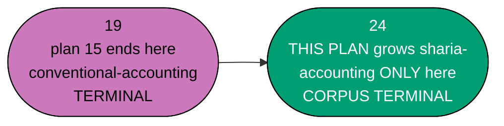
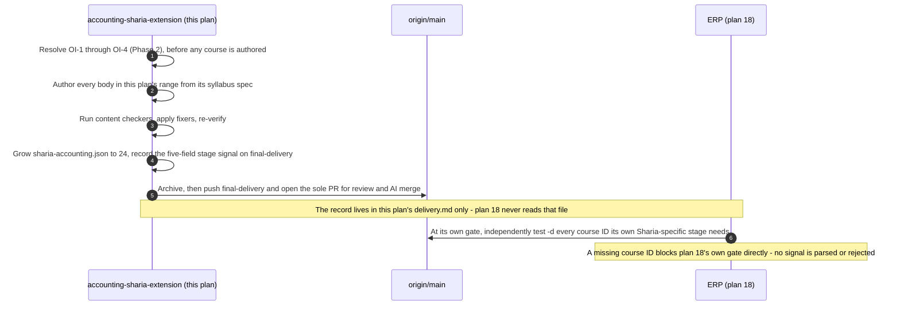

# Technical Documentation — Skills Paths: Accounting Sharia Extension

## Corpus Disposition

`archive-with-plan` — this plan custodies its own `syllabus/` corpus (courses #20–#24 only) and no
consumer **outside `plans/`** reads it. The corpus therefore moves to `plans/done/` with the plan
folder on archival. See
[Learning-Plan Syllabus Convention §Corpus Disposition](../../../repo-governance/conventions/structure/learning-plan-syllabus/corpus-disposition.md#corpus-disposition).

## Provenance of this split

This plan is the **third and final** of the three-plan chain replacing the retired
the superseded accounting-programme draft (reproduced and owned locally) plan — see
`ayokoding-learning-path-14-skills-accounting-foundations/tech-docs.md §Provenance of this split`
for the full phase-to-plan mapping. This plan corresponds to the retired plan's own **Phase 4**
(the Sharia-doctrinal verification debt: OI-1, OI-2, OI-3) and **Phase 5** (Stage 3, courses
\#20–#24, `sharia-accounting` grown to 24) — the only two of the retired plan's phases plan 14 and
plan 15 did not already absorb.

**Nothing about the domain's business/product reasoning changes.** The silent-failure constraint,
the licensing posture, the personas, and the A10/A11 two-path mechanics are restated verbatim from
plans 14 and 15 — only the delivery-unit size and phase boundaries differ, and this plan
additionally resolves the carried verification debt before authoring begins.

## Overview

This plan delivers the **final slice** of the twenty-four-course, two-manifest corpus (A10):
courses #20–#24 — the Sharia standards landscape (AAOIFI, PSAK Syariah, MFRS-plus-BNM), Islamic
contract modelling, Zakah computation, Sukuk accounting, and the terminal
`sharia-ledger-system-architecture` course. All five courses are **Sharia-specific** — none is
shared — so only `sharia-accounting.json` grows here; `conventional-accounting.json` stays exactly
as plan 15 left it.

It touches **no application code**. Its artefacts are markdown page bundles under
`apps/ayokoding-www/content/`, growth of **one** existing JSON manifest data file (created by plan 14, grown
by plan 15), and five markdown spec files inside this plan's own folder.

## The manifest ownership invariant across the sequential chain (this plan's role)

This plan **extends, never replaces**, `sharia-accounting.json` and its co-located unit test, and
**never touches** `conventional-accounting.json` or its test:

| Plan           | Touches `conventional-accounting.json` / `sharia-accounting.json` | State at plan's end                                                                                         |
| -------------- | ----------------------------------------------------------------- | ----------------------------------------------------------------------------------------------------------- |
| 14             | Created both files, grew both 0 → 3 → 11                          | Both hold 11 identical IDs                                                                                  |
| 15             | Grew both further, 11 → 19                                        | `conventional-accounting.json` reached its **terminal** 19; `sharia-accounting.json` also at 19             |
| 16 (this plan) | **Grows `sharia-accounting.json` only, 19 → 24**                  | `sharia-accounting.json` at its **terminal** 24; `conventional-accounting.json` **untouched since plan 15** |

**This is safe because the chain is strictly sequential** — this plan does not start authoring
until plan 15's course bodies, manifest growth, and landing updates are merged to `origin/main`
(repository baseline context, checked mechanically at this plan's own Phase 0). There is never a window where
two plans in this chain edit the same manifest file concurrently, and **no later plan exists in
this chain to touch either manifest again** — this plan's own end is the corpus's own end.

**No plan among 14, 15 and 16 creates an `_index.md` under `paths/`.** Both path **landings** were
created by plan 14 and updated by plan 15; this plan **updates only `sharia-accounting`'s landing**
— `conventional-accounting`'s landing is **not touched**.

## Two manifests, shared courses (A10 + A11) — restated, and where they diverge for the first time

**A11 is the schema's existing rule.** All five of this plan's courses are authored **once**, under
`<COURSES>`, and referenced by **`sharia-accounting.json` only** — none is added to
`conventional-accounting.json`. This is the point in the chain where the two manifests' `courseOrder`
arrays **stop being identical**: `conventional-accounting.json` freezes at 19 (plan 15's terminus);
`sharia-accounting.json` grows five entries further, to 24. Full rationale for the two-manifest,
shared-course design:
`ayokoding-learning-path-14-skills-accounting-foundations/tech-docs.md §Two manifests, shared courses`.

## Path constants

Identical to plan 14's own constants, with this plan's own `<SPEC>` and `<SPECPATHS>` pointing at
its own folder:

- `<COURSES>`, `<PATHS>`, `<LANDING_CA>`, `<LANDING_SA>`, `<FEAT>`, `<MANIFESTS>`, `<MANIFEST_CA>`,
  `<MANIFEST_SA>`, `<MTEST_CA>`, `<MTEST_SA>` — same absolute paths as plan 14's and plan 15's, now
  at their 19-entry (manifests) / 19-course (landings) starting state inherited from plan 15's
  merge.
- `<PLANDIR>` = this plan's folder —
  `plans/backlog/ayokoding-learning-path-16-skills-accounting-sharia-extension/` today.
- `<SPEC>` = `<PLANDIR>syllabus/courses/` — this plan's own 5-file spec layer (courses #20–#24).
- `<SPECPATHS>` = `<PLANDIR>syllabus/paths/` — this plan's own **slice** of the `sharia-accounting`
  path mirror only (5 rows), inside this plan's own folder. **This plan creates no
  `manifest-skills-conventional-accounting.md` slice** — it never grows that manifest.
- `<DELIVERY>` = `<PLANDIR>delivery.md`.

Full definitions, including the shell block that re-derives `<PLANDIR>` by lifecycle stage:
[delivery.md §Path constants](./delivery.md#path-constants).

## The five-course catalog slice (courses #20–#24)

All five courses in this plan's range are **Sharia-specific** — authored once, referenced by
`sharia-accounting.json` only. None carries a linked `(SWE)` cross-domain prerequisite of its own;
course #24 inherits `backend-essentials`'s grounding through its own prerequisite on plan 15's
course #19 (already resolved, in `<COURSES>`, at this plan's Phase 0).

| #   | Course ID                                      | Format            | Prerequisites (cross-plan noted) |
| --- | ---------------------------------------------- | ----------------- | -------------------------------- |
| 20  | `sharia-accounting-and-aaoifi-standards`       | Annotated-concept | 5 (plan 14), 14 (plan 15)        |
| 21  | `islamic-contract-modeling-for-systems`        | By Example        | 20 (this plan), 2 (plan 14)      |
| 22  | `zakah-computation-and-reporting-for-systems`  | By Example        | 21 (this plan)                   |
| 23  | `sukuk-and-islamic-capital-markets-accounting` | Annotated-concept | 21 (this plan), 12 (plan 15)     |
| 24  | `sharia-ledger-system-architecture`            | By Example        | 21 (this plan), 19 (plan 15)     |

**Format counts, this plan's range**: 3 By Example, 2 Annotated-concept (#20, #23).

**The ramp order is a valid topological order**: every prerequisite of a course in this range
resolves either to a lower-numbered course inside this plan's own range, or to one of plan 14's or
plan 15's already-merged courses (#2, #5 from plan 14; #12, #14, #19 from plan 15) — never forward
to a course that does not yet exist. This is the mirror image of the cross-plan-boundary edges
documented in plan 14's own `tech-docs.md`: courses #20, #23, #24 cite plan 15's #14, #12, and #19
respectively — **exactly three edges reaching back across the plan-14/plan-15 boundary**, not four;
course #21's own prerequisites (#20, #2) resolve entirely within this plan and plan 14, never
reaching into plan 15's range.

**No course in this plan's own range (#20–#24) is cited as a prerequisite by anything in plans 14 or
15** — there is nothing left in the chain to cite it; this plan's own outbound edges are entirely
internal or terminal.

## Staged manifest growth across the three-plan chain (this plan's final step)



**Accessibility note.** Ownership of each growth step is carried by node **shape** and by explicit
text in every label, never by colour alone.

| Step                         | `conventional-accounting.json` length           | `sharia-accounting.json` length | Owning plan |
| ---------------------------- | ----------------------------------------------- | ------------------------------- | ----------- |
| Before this plan (inherited) | 19 (terminal, from plan 15)                     | 19                              | 15          |
| After this plan's Phase 3    | **19 (unchanged, verified `git diff --quiet`)** | **24 (CORPUS TERMINAL)**        | 16          |

**Six properties, restated for this plan's own final growth step, each asserted at the Phase 3
gate**:

1. `pathId` is the FULL slash string, unchanged from plan 14.
2. `arc` remains `immediately-effective`.
3. Every `courseOrder` entry remains a plain course-ID string.
4. `sharia-accounting.json`'s `courseOrder` never contains `sql-essentials` or `backend-essentials`.
5. `sharia-accounting.json`'s `courseOrder` is exactly **24** entries at this plan's end, and never
   grows again.
6. **`conventional-accounting.json` is byte-for-byte unchanged since plan 15's own merge** — the
   single falsifiable boundary this plan's entire risk profile hinges on:
   `git diff --quiet -- "$MANIFEST_CA"` exits 0, explicitly asserted at the Phase 3 and Phase 4
   gates (the phases that touch or verify the manifests); the invariant continues to hold
   through Phases 5-8 as an unbroken consequence of no later phase touching either manifest file.

## Syllabus layer — custody and shape (this plan's own slice)

Same inherited shape as plans 14 and 15's own syllabus layers. This plan's own five specs live
inside **this plan's own** `syllabus/courses/` folder — never plan 14's, plan 15's, or plan 02's.

| Half             | Location                                          | Contents                                                                        |
| ---------------- | ------------------------------------------------- | ------------------------------------------------------------------------------- |
| Per-course specs | `<SPEC>`                                          | 5 `<course-id>.md` files (courses #20–#24) plus a folder `README.md`            |
| Path mirror      | `<SPECPATHS>manifest-skills-sharia-accounting.md` | This plan's own slice only — 5 rows. **No conventional-accounting slice file.** |

Two of this plan's five courses (#20, #23) are **Annotated-concept** format — their
`## Worked examples` section uses plan 02's themed grouping instead of the
Beginner/Intermediate/Advanced bands the By Example courses use.

## Open verification items (OI-1 through OI-4)

The retired plan's own `verification-log.md` carried four open verification items, all
Sharia-specific and all landing squarely in this plan's own scope. Per the "six files only"
constraint for this three-plan split, that register is folded into this plan's own `tech-docs.md`
rather than carried forward as a separate file. **This plan's Phase 2 resolves what can be
resolved and formally re-registers what cannot, before course #20 is authored.**

### Status lines (grep-checkable — one per item, first column anchored)

Each line begins at column 0 and matches `^OI-<n>: <STATUS>`. Valid statuses: `OPEN` (not yet
resolved, blocks the phase named here), `RESOLVED` (checked against the named primary source, line
carries the source URL and access date), `SCOPED-AROUND` (the primary source could not be reached;
the affected course teaches the structure without publishing the specific claim), `ROUTED` (not a
research item — a cross-plan seam handed to its owning plan). Do **not** delete a line when it
resolves — rewrite its status in place.

```
OI-1: RESOLVED — IAI's published PSAK Syariah standard list (iaiglobal.or.id), re-confirmed via the
2026-07-22 web-researcher grounding run — the operative series is PSAK 101-110; PSAK 59 is
superseded. Residual: the exact PPSAK ratification date for PSAK 101 was NOT confirmed by that run —
course #20 cites the series only, never a specific ratification date, until that residual is
separately resolved.
OI-2: OPEN
OI-3: RESOLVED — AAOIFI's adoption-by-country index, re-confirmed via the 2026-07-22 web-researcher
grounding run, for the adoption-relationship claim specifically: Malaysia is not on AAOIFI's
mandatory-adoption list; Indonesia uses AAOIFI as a basis, not an adoption. Residual: governance
mechanics beyond this specific relationship (e.g. the internal provisions of Bank Negara Malaysia's
Shariah Governance Policy 2019) were not directly fetched by that run and remain subject to the
standing "fast-moving facts, re-verify at authoring" rule.
OI-4: ROUTED — plan 02's checkPrerequisiteConsistency already permits link-don't-walk (Direction A);
plan 02's dated ruling (2026-07-21) confirms it explicitly. Blocks nothing mechanically.
```

### Item summaries

- **OI-1** `RESOLVED` (with a stated residual) — **Indonesian PSAK numbering.** PSAK 101-110 is the
  operative series; PSAK 59 was superseded. The exact PPSAK ratification date for PSAK 101 remains
  unconfirmed; course #20 cites the series and never a specific ratification date, so there is no
  unverified claim to mark for the residual. Course #20's authoring proceeds without further
  blocking on this item.
- **OI-2** `OPEN` — **Riba doctrinal basis.** Sourced only from a secondary source (not a primary
  standard). The practical consequence is well-attested (profit must arise from trade, leasing,
  partnership or service risk, never a predetermined return on a pure loan); the specific doctrinal
  derivation is **not settled** and is not this corpus's to settle. **This item is explicitly left
  OPEN by this plan — it must never be restated as fact.** Blocks course #20's doctrinal-basis
  framing specifically (not the whole course): course #20 states the practical consequence, never
  the unsettled derivation.
- **OI-3** `RESOLVED` (for the adoption-relationship claim; governance minutiae beyond it remain
  re-verify-at-authoring) — **Three-jurisdiction adoption relationship.** Malaysia does **not**
  appear on AAOIFI's published mandatory-adoption list; MASB standards are IFRS-converged, with
  Sharia treatment handled through Bank Negara policy documents; Indonesia's position is "AAOIFI as
  basis", not adoption. Governance-mechanics detail beyond this specific relationship (Bank Negara
  Malaysia's Shariah Governance Policy 2019's own internal provisions) remains re-verify-at-authoring.
  Blocks courses #20, #21, #24 (the adoption-relationship portion is now clear; the
  governance-minutiae portion is unchanged).
- **OI-4** `ROUTED`, already answered — plan 02's own ruling permits link-don't-walk manifests
  (Direction A). Blocks nothing mechanically; recorded here for completeness since this plan is the
  last to touch a manifest in this chain.

### Verified facts carried in (do not re-litigate, do re-confirm at authoring)

`[Verified]` AAOIFI Financial Accounting Standards numbers for the contract types this plan's
courses cover: **FAS 3** (Mudaraba), **FAS 4** (Musharaka), **FAS 7** (Salam), **FAS 9** (Zakah —
course #22), **FAS 10** (Istisnaa), **FAS 28** (Murabaha and deferred payment sales), **FAS 32–34**
(Ijarah through sukuk-holder reporting — Sukuk, course #23). AAOIFI keeps **Financial Accounting
Standards** and **Shari'ah Standards** as two separate series — "what to book" versus "what makes
the contract compliant." **FAS numbers outside this list are `[Unverified]`** and are re-verified
or dropped, never published on trust.

`[Verified]` (2026-07-22 grounding run) — **licensing posture**: IAI (Indonesia) is the strictest
of the four bodies this corpus touches, with **no educational exception at all**; AAOIFI is free to
read but has no published permission-to-reproduce policy (treated as closed); **no public-domain
chart of accounts exists anywhere**, so every chart of accounts in this plan's courses is
originally authored.

### Phase 2 gate for this register

`delivery.md`'s Phase 2 asserts: (a) OI-1's and OI-3's `RESOLVED` status lines are present verbatim
above; (b) OI-2's status line reads exactly `OI-2: OPEN`, never anything else; (c) OI-4's `ROUTED`
line is present; (d) no course body authored in Phase 3 restates OI-2's doctrinal derivation as
settled fact — verified by `apps-ayokoding-www-facts-checker` plus a direct reading pass.

## Licensing and IP Compliance (A8) — the full four-body posture, applying in full for the first time

`A8` binds the whole programme. This plan's range is where **all four** bodies this corpus ever
touches are simultaneously relevant — IFRS Foundation and FASB (restated from plans 14/15) plus
**AAOIFI** and **IAI**, relevant for the first time.

### Posture per body

| Body            | Posture                                                                                                                                               |
| --------------- | ----------------------------------------------------------------------------------------------------------------------------------------------------- |
| IFRS Foundation | The most open of the four, but narrowly so — its own designated teaching materials are reproducible under conditions; the Standards text is not.      |
| FASB (US GAAP)  | Closed copyright.                                                                                                                                     |
| AAOIFI          | **Free to read but no published permission-to-reproduce policy** — treated as closed. `[Verified, 2026-07-22 grounding run]`.                         |
| IAI (Indonesia) | **The strictest of the four** — forbids reproduction or translation with **no educational exception at all**. `[Verified, 2026-07-22 grounding run]`. |

**No public-domain chart of accounts exists anywhere.** `[Verified, carried forward]`. Every chart
of accounts in this plan's courses — including every murabaha, ijara, mudaraba, musharaka, zakah,
and sukuk illustration — is **originally authored**, never copied from any textbook, standard, or
reference implementation.

### The eleven safe-authoring rules (restated verbatim, bind every course in this plan)

1. Restate concepts in original words; never reproduce standards text, tables, or clause numbering
   layouts.
2. Cite standard number + title + official link; quote nothing.
3. Never translate a standard.
4. Author every chart of accounts, worked example and dataset originally.
5. Reference implementations: prefer permissive licences; describe copyleft projects
   behaviourally rather than quoting their code.
6. Never paste code from a copyleft codebase, in any quantity.
7. Use vendor names nominatively only — never in a title or path segment.
8. Screenshots of proprietary software are out.
9. Carry `[Verified]` / `[Unverified]` / `[Needs Verification]` markers verbatim.
10. **Where a doctrinal claim rests on secondary sources only, say so in the course** — this rule
    binds materially in this plan's range for the first time: course #20's riba-adjacent framing
    (OI-2) is exactly this case.
11. When in doubt between describing and reproducing, describe.

### The _Baker v. Selden_ basis, restated

**17 U.S.C. §102(b)** and **EU Directive 2009/24/EC Art. 1(2)** exclude ideas, procedures,
processes and systems from copyright. **_Baker v. Selden_** (101 U.S. 99, 1879) remains the
strongest authority for this plan's own posture, applied here to its most legally sensitive
content: a Sharia-compliant ledger's account structure and murabaha/ijara/sukuk computation
mechanics are systems and processes, not the doctrinal text of AAOIFI's or IAI's standards.

### Where this binds mechanically

Phase 1's syllabus authoring records each course's licensing-sensitive sources; Phase 4's licensing
reading audit checks against that list, at the corpus's strictest posture.

## The ramp and its stages (this plan's slice, and the corpus's terminal boundary)

| Stage | Courses | Boundary                            | Path(s)                  | Delivery phase | Reader outcome                                                                                       |
| ----- | ------- | ----------------------------------- | ------------------------ | -------------- | ---------------------------------------------------------------------------------------------------- |
| 3     | #20–#24 | **Dangerous 3** ⚡, corpus TERMINAL | `sharia-accounting` only | Phase 3        | Full competence across both corpora, including architecting (not building) a Sharia-compliant ledger |

### Landing content contract — what the `sharia-accounting` landing must convey (this plan's update)

`sharia-accounting`'s landing states, for the first time, that **the whole path is complete** at 24
courses — no further growth is coming, matching `conventional-accounting`'s own completeness claim
established in plan 15. `conventional-accounting`'s landing is **not touched** by this plan; it
already states completeness since plan 15.

## No new cross-domain DAG edge

Unlike plans 14 and 15, this plan introduces **no** linked `(SWE)` prerequisite of its own. Course
\#24 (`sharia-ledger-system-architecture`) inherits `backend-essentials`'s grounding transitively
through its own prerequisite on plan 15's course #19, which already resolved that edge. **The
24-course catalog's full cross-domain DAG carries exactly two linked edges, both established by
earlier plans**: `sql-essentials` (plan 14, course #2) and `backend-essentials` (plan 15, course
\#19) — see plan 14's own tech-docs for the full diagram of both.

## Manifest format (state at this plan's end)

The conventional-accounting manifest is not opened or rewritten in this phase. Its JSON from plan
15 remains immutable; Phase 3 verifies `jq '.courseOrder | length == 19'` against the existing
manifest rather than presenting a partial replacement document.

```json
{
  "pathId": "skills/sharia-accounting",
  "arc": "immediately-effective",
  "title": "Sharia-Compliant Accounting for Systems Builders",
  "description": "Every basic and enterprise capability the conventional path teaches, plus murabaha, ijara, mudaraba, musharaka, zakah and sukuk modelled correctly.",
  "courseOrder": [
    "accounting-foundations",
    "chart-of-accounts-and-data-modeling",
    "financial-statements-and-close-cycle",
    "journal-entries-and-posting-mechanics",
    "accrual-accounting-and-revenue-recognition",
    "accounts-payable-and-procure-to-pay",
    "accounts-receivable-and-order-to-cash",
    "managerial-and-cost-accounting",
    "fixed-assets-and-depreciation",
    "inventory-and-cogs-accounting",
    "lease-and-intangible-asset-accounting",
    "multi-currency-accounting-and-fx-translation",
    "consolidation-and-multi-entity-accounting",
    "financial-reporting-standards-ifrs-vs-gaap",
    "audit-controls-and-compliance",
    "payroll-and-tax-accounting-essentials",
    "treasury-and-cash-management",
    "financial-reporting-and-xbrl",
    "general-ledger-system-architecture",
    "sharia-accounting-and-aaoifi-standards",
    "islamic-contract-modeling-for-systems",
    "zakah-computation-and-reporting-for-systems",
    "sukuk-and-islamic-capital-markets-accounting",
    "sharia-ledger-system-architecture"
  ]
}
```

## Stage-signal contract (the plan-18 handoff, Sharia-stage granularity)

**This plan emits the second and final cross-plan stage signal in this three-plan chain** — plan
14 emitted none; plan 15 emitted Stage 2. This signal names an **ERP capability**, at the
granularity this three-plan split's authoring instructions specify: Stage 3 (Dangerous-3, this
plan's own completion) unblocks
`ayokoding-learning-path-18-skills-erp-enterprise-depth`'s
**Sharia-specific** courses (Sharia-compliant ERP capability and founding-architecture capability).



**Five fields, all required**:

| Field                     | Meaning                                                                                                                                                                                                                                                                 |
| ------------------------- | ----------------------------------------------------------------------------------------------------------------------------------------------------------------------------------------------------------------------------------------------------------------------- |
| `STAGE`                   | `3` — this plan's own Dangerous-3 completion, and the corpus's own terminal state                                                                                                                                                                                       |
| `PLAN`                    | `ayokoding-learning-path-16-skills-accounting-sharia-extension`                                                                                                                                                                                                         |
| `LANDED_COURSE_IDS`       | Every course ID authored by this plan (#20–#24)                                                                                                                                                                                                                         |
| `UNBLOCKS_ERP_CAPABILITY` | "the Sharia-specific ERP stages delivering Sharia-compliant contract handling, Zakah/Sukuk reporting, and Sharia-ledger founding-architecture capability — and the whole sharia-accounting path, and the whole 24-course accounting corpus, are complete at this point" |
| `FINAL_DELIVERY_BRANCH`   | The persistent branch carrying the signal until the terminal archival PR merges                                                                                                                                                                                         |

**Recording format (grep-checkable)**, same shape as plan 15's:

```
STAGE: 3
PLAN: ayokoding-learning-path-16-skills-accounting-sharia-extension
LANDED_COURSE_IDS: sharia-accounting-and-aaoifi-standards, islamic-contract-modeling-for-systems, zakah-computation-and-reporting-for-systems, sukuk-and-islamic-capital-markets-accounting, sharia-ledger-system-architecture
UNBLOCKS_ERP_CAPABILITY: the Sharia-specific ERP stages delivering Sharia-compliant contract handling, Zakah/Sukuk reporting, and Sharia-ledger founding-architecture capability — and the whole sharia-accounting path, and the whole 24-course accounting corpus, are complete at this point
FINAL_DELIVERY_BRANCH: ayokoding-learning-path-16-skills-accounting-sharia-extension/final-delivery
```

**Why this plan's own Stage number is "3", continuing plan 15's numbering choice** [Judgment call],
restated: the domain's own Dangerous-1/2/3 vocabulary is preserved for continuity across the whole
chain, rather than renumbering signals sequentially from the count of signals actually emitted (1,
here, since plan 14 emitted none and plan 15 emitted the first). See plan 15's own `tech-docs.md
§Stage-signal contract` for the full reasoning, which applies unchanged to this plan's own choice.

## Programme decisions

Restated verbatim from plan 14's own tech-docs — see
`ayokoding-learning-path-14-skills-accounting-foundations/tech-docs.md §Programme decisions` for
the full table (R8, R9, A3, A4, A6, A8, A9, A10, A11, A12) and the A6/A8/A12 elaborations. Not
reproduced a third time here; this plan cites the same ids with the same meanings, with A8 applying
in full for the first time (see [§Licensing and IP Compliance](#licensing-and-ip-compliance-a8--the-full-four-body-posture-applying-in-full-for-the-first-time)
above).

## Design Decisions

- **DD-1601 · This plan is the third and final of a three-plan sequential chain.** Full mapping:
  [§Provenance of this split](#provenance-of-this-split).
- **DD-1602 · This plan extends, never replaces, `sharia-accounting.json` and its test; it never
  opens `conventional-accounting.json` or its test.** Continues DD-1502 from plan 15, narrowed to
  one file only.
- **DD-1603 · The 5 syllabus specs in this plan's range live in this plan's own folder**, not plan
  14's, plan 15's, or plan 02's. Continues DD-1503/DD-1404.
- **DD-1604 · This plan introduces no new linked cross-domain prerequisite** — course #24 inherits
  `backend-essentials`'s grounding transitively through plan 15's course #19. New to this split;
  the retired plan's own DD-604/DD-1405/DD-1504 lineage does not extend a third time because there
  is nothing left to link.
- **DD-1605 · This plan emits the SECOND and FINAL cross-plan stage signal in this chain (Stage 3)**, unblocking plan 18's Sharia-specific capability. See
  [§Stage-signal contract](#stage-signal-contract-the-plan-18-handoff-sharia-stage-granularity).
- **DD-1606 · `sharia-accounting.json` becomes CORPUS TERMINAL after this plan** — the whole
  24-course, two-manifest corpus is complete once this plan archives. No future plan in this chain
  exists to grow it further.
- **DD-1607 · This plan runs its own full Rule-15 retest, for `sharia-accounting` only** —
  completing the chain's retest allocation started by plan 15's DD-1507. See
  [README.md §Rule-15 disposition](./README.md#rule-15-disposition-for-this-plan).
- **DD-1608 · The carried verification debt (OI-1 through OI-4) is resolved, or formally
  re-registered, in this plan's own Phase 2, before any course in this plan's range is authored.**
  New to this split — the retired plan's own Phase 4 occupied a dedicated phase for the same reason;
  this plan preserves that ordering.
- **DD-1609 · OI-2 (the riba doctrinal basis) stays explicitly OPEN through this plan's own
  archival.** A4 forbids promoting it to fact regardless of any pressure to close every open item.
- **DD-1610 · Every id list in `delivery.md` is a shell ARRAY, never a space-separated string.**
  Unchanged HARD rule.
- **DD-1611 · Syllabus file shape is inherited from plan 02's `syllabus/courses/*.md`.** Unchanged.

## UI-gate and API-gate posture (R9)

### UI gate — **exempt** (unchanged reasoning from plans 14/15)

This plan authors **zero** files under `apps/ayokoding-www/src/features/course-paths/` other than
growing one existing YAML **data** file. Manual behavioural verification via Playwright MCP is
**mandatory and performed** (Phase 5). **The full Rule-15 three-tester retest is mandatory and
performed here, for `sharia-accounting` only** — completing the chain's retest allocation (plan 15
already covered `conventional-accounting`).

### API gate — **NOT exempt** (unchanged reasoning)

Manifest integrity is behaviour, exercised through `sharia-accounting.json`'s zod validation,
`checkManifestIntegrity`, and `checkPrerequisiteConsistency`, plus a `git diff --quiet` freeze
assertion on `conventional-accounting.json`.

**Rule-16 API exploratory retest — not applicable.**

## Other exemptions

### Specs and Gherkin (app-code)

This plan's app/lib-code footprint: growth of one existing JSON manifest data file, extension of one
existing co-located unit test, and extension of one existing step-definition file. No new
TypeScript test file is created.

### UI-design funnel

Recorded in [prd.md §UI-design-funnel disposition](./prd.md#ui-design-funnel-disposition). No
net-new screen, no net-new component.

## File-Impact Analysis

Root-relative annotated tree — the scan-first source of truth for this plan's scope. **[E]** edit,
**[N]** new file/pattern, **[D]** delete, **[G]** generated/regenerated.

```text
.
├── apps/ayokoding-www/content/en/learn/courses/
│   ├── _index.md [E] — append 5 catalog rows (file created by plan 01)
│   └── <course-id>/ [N] — 5 full page bundles, courses #20-#24
├── apps/ayokoding-www/content/en/learn/paths/skills/
│   └── sharia-accounting/_index.md [E] — grown; file created by plan 14
├── apps/ayokoding-www/src/features/course-paths/manifests/skills/
│   ├── sharia-accounting.json [E] — grown 19 -> 24; created by plan 14
│   └── sharia-accounting-manifest.unit.test.ts [E] — extended to the terminal 24-id state
├── specs/apps/ayokoding/behavior/ayokoding-www/gherkin/course-paths/
│   └── <the accounting feature file> [E] — extended; created by plan 14
└── apps/ayokoding-www-fe-e2e/src/steps/<matching steps file> [E] — extended
└── plans/in-progress/ayokoding-learning-path-16-skills-accounting-sharia-extension/
    ├── tech-docs.md [E] — this file
    ├── delivery.md [E] — checkbox ticks and per-phase implementation notes
    ├── learnings.md [E] — running log, drained by the Knowledge Capture phase
    └── evidence/ [N] — phase-0 snapshot, growth records, Playwright screenshots
```

### More Detail

**This plan owns its own `syllabus/` corpus slice and must ship the required folder layout** —
`syllabus/README.md` with the `**Custodian**` line, plus `syllabus/courses/README.md` and
`syllabus/paths/README.md`, per the
[Learning-Plan Syllabus Convention §Required Folder Layout](../../../repo-governance/conventions/structure/learning-plan-syllabus/required-folder-layout.md#required-folder-layout).

**`conventional-accounting.json` is deliberately absent from this tree.** This is the first plan in the
14 → 15 → 16 chain where the two manifests diverge: the five Sharia-extension courses grow
`sharia-accounting` only. A step here that touched the conventional manifest would be a boundary
violation, not a convenience — its absence from the tree is the assertion.

Every cross-plan row is an `[E]` growth of a file plan 14 authored, along the same sequential hand-off.
No `[D]` or `[G]` rows: this plan deletes nothing, and no emitter runs over its output.

| Path                                              | Kind        | Note                                                                                  |
| ------------------------------------------------- | ----------- | ------------------------------------------------------------------------------------- |
| `<SPEC><course-id>.md` × 5                        | _New files_ | This plan's own spec layer, courses #20–#24                                           |
| `<SPEC>../README.md`                              | _New file_  | Syllabus-folder index                                                                 |
| `<SPECPATHS>manifest-skills-sharia-accounting.md` | _New file_  | This plan's own slice (5 rows). No conventional-accounting slice.                     |
| `<COURSES><course-id>/**` × 5                     | _New dirs_  | Full page bundles, one per course — never duplicated                                  |
| `<LANDING_SA>_index.md`                           | Existing    | Updated to state full 24-course completeness (created by plan 14, updated by plan 15) |
| `<LANDING_CA>_index.md`                           | Existing    | **Not touched by this plan**                                                          |
| `<MANIFEST_SA>`                                   | Existing    | Grown from 19 to 24 — CORPUS TERMINAL after this plan                                 |
| `<MANIFEST_CA>`                                   | Existing    | **Not touched by this plan** — verified via `git diff --quiet` at every gate          |
| `<MTEST_SA>`                                      | Existing    | Extended with the 24-entry assertions                                                 |
| `<MTEST_CA>`                                      | Existing    | **Not touched by this plan**                                                          |
| `<COURSES>_index.md`                              | Existing    | 5 catalog rows appended                                                               |
| `learnings.md`                                    | _New_       | Knowledge-capture log                                                                 |
| `evidence/`                                       | _New_       | Screenshot evidence from Phase 5's manual verification and Rule-15 retest             |

**Never touched**: any `_index.md` under `<PATHS>`; `<LANDING_CA>_index.md`; `<MANIFEST_CA>`;
`<MTEST_CA>`; any existing library course; `manifests/careers/**`;
`manifests/skills/conventional-erp.json` and `manifests/skills/sharia-erp.json`; any file inside
plan 02's, plan 14's, or plan 15's own `syllabus/`; any component, schema, or resolver.

**No new package dependency.**

## Testing / Verification Strategy

| Level                        | What it verifies                                                                                                     | Mechanism                                                                                    |
| ---------------------------- | -------------------------------------------------------------------------------------------------------------------- | -------------------------------------------------------------------------------------------- |
| Manifest unit (TDD)          | `sharia-accounting.json` loads, zod-validates, integrity, prerequisite-consistency, exact `courseOrder` length (24)  | `npm exec nx run ayokoding-www:test:unit`                                                    |
| Path-walk e2e                | `sharia-accounting`'s `pathId` resolves across all 24 courses; `conventional-accounting`'s 19-course walk unaffected | `npm exec nx run ayokoding-www-fe-e2e:test:e2e`                                              |
| Composition assertions       | No linked prerequisite absent-from-courseOrder check needed (no new linked edge); shared-19 unaffected               | Grep-checkable clauses                                                                       |
| Per-course content checks    | Concept coverage, register, format, worked-example volume, scope boundary                                            | `apps-ayokoding-www-by-example-checker` / `-annotated-concept-checker`                       |
| Silent-failure assertion     | Every course #20–#24 carries its section                                                                             | Grep-checkable clause on each authoring step                                                 |
| Verification-debt resolution | OI-1/OI-3 residuals recorded; OI-2 remains OPEN; OI-4 remains ROUTED                                                 | Reading audit against [§Open verification items](#open-verification-items-oi-1-through-oi-4) |
| Licensing audit              | No verbatim standards text, no proprietary CoA structure, no copyleft code pasted, strictest (four-body) posture     | Reading audit against Phase 1's licensing-sensitive-sources list (Phase 4)                   |
| Terminal-freeze assertion    | `conventional-accounting.json` unchanged since plan 15's own merge                                                   | `git diff --quiet -- "$MANIFEST_CA"`                                                         |
| Structural                   | Bundle anatomy present; `prerequisites` declared                                                                     | `test -d` / `test -f` plus frontmatter grep                                                  |
| Section build                | The authored tree renders                                                                                            | `npm exec nx run ayokoding-www:build`                                                        |
| Markdown quality             | markdownlint, link validation, heading hierarchy                                                                     | `npm run lint:md` plus the two `rhino-cli md` subcommands                                    |
| Regression                   | No existing project's gates broke                                                                                    | `npm exec nx affected -t typecheck lint test:quick specs:behavior:coverage`                  |
| Manual behavioural           | `sharia-accounting`'s landing and sample courses render at three breakpoints in `en`                                 | Playwright MCP plus committed `evidence/` screenshots                                        |
| Live-site retest             | Rule-15 EWT/UWT/DWT against the running `sharia-accounting` landing and full 24-course walk                          | The three live-site testers                                                                  |

**Locale scope**: `en` only.

## Execution dependency

This plan has one direct execution prerequisite: `ayokoding-learning-path-15-skills-accounting-enterprise-reporting`, fully merged and archived on `origin/main`. Course-level source citations and repository facts are implementation context, not extra plan dependencies.

## Rollback

Every artefact is **additive**. Because this plan's own five courses have **zero outbound edges
into software engineering**, removing them cannot break any library course.

- **Per course**: `git rm -r <COURSES><course-id>/`, remove its row from `<COURSES>_index.md`, and
  remove its ID from `sharia-accounting.json`.
- **Whole plan**: revert every merge in reverse order, shrink `sharia-accounting.json` back to 19
  entries (plan 15's state), and revert `sharia-accounting`'s landing to its plan-15 content.
  `conventional-accounting.json` and its landing are never touched, so nothing there needs
  reverting.
- **The one-way door**: once `ayokoding-learning-path-18-skills-erp-enterprise-depth`
  has authored a course against this plan's Stage-3 signal, deleting the corresponding accounting
  course(s) breaks plan 18's manifest downstream. Coordinate any rollback with plan 18 before
  applying it. **This is the whole three-plan chain's final one-way door** — no later accounting
  plan exists to coordinate a rollback with beyond plan 18.
