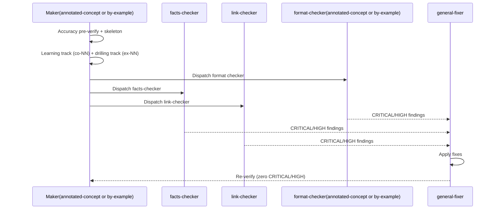

# Delivery Checklist — Skills Path: ERP Foundations (Stage A)

> **Legend** — `[AI]`: an agent performs the step (the default; unmarked steps are `[AI]`).
> `[HUMAN]`: only a human can do it (physical action, out-of-band approval, real-secret or
> privileged-credential handling). `[AI+HUMAN]`: agent prepares, human approves or finishes.
> Git-mechanical steps (worktree create/remove, branch, commit, push, merge) are `[AI]`.
>
> **Phase Gate** — every phase ends with a `### Phase N Gate` (must-pass verification) plus a
> `> **Pause Safety**:` note. The sole PR opens only at the terminal archival boundary — see
> [Parallelization Model §Delivery Boundaries](#delivery-boundaries). Every earlier phase commits to
> the persistent final-delivery branch without opening, reviewing, merging, or deploying a PR.

Three standing constraints govern every step below.

> **Cross-plan source of truth**: this plan's 15-course slice — ids, formats, prerequisite edges, ramp
> order — is settled in
> [tech-docs.md §The ERP catalog (this plan's 15-course slice)](./tech-docs.md#the-erp-catalog-this-plans-15-course-slice),
> transcribed from the retired the superseded ERP-programme draft design. Transcribe it; do not
> re-derive it. The syllabus module/topic content is authored fresh at Phase 1 from domain reasoning,
> per `A12`.
>
> **The category ownership invariant (binding)**: this plan owns `<CONVMAN>`, `<SHARMAN>`,
> `<CONVLANDING>`, `<SHARLANDING>`, fifteen ERP course bundles, and `<SYL>`/`<SYLPATHS>`. It **never**
> writes an accounting file, a careers manifest, a component, a design asset, a structural
> `_index.md`, or a Stage B/C course body. A step here that authors accounting or Stage-B/C material
> is a boundary violation.
>
> **Id-shape rule (schema-owner ruling, inherited)**: each path id is the **full** string
> (`skills/conventional-erp` or `skills/sharia-erp`) — no separate `category` field, and **nothing
> keys on segment count**. Every URL/id match below is a **full-string literal** (`grep -F -q`).

## One-PR delivery contract (binding, 2026-08-01)

This 15-course plan is one inseparable delivery unit: every Phase 1–8 change lands in **one
worktree, one branch, and exactly one draft PR**. Courses may still be authored, checked, and
committed in their dependency order, but no intermediate phase may push, open a PR, run the PR
merge, deploy, or record a merge SHA. Only Phase 8 opens the draft PR, after all
course work, verification, and Knowledge Capture are green; it includes the archival move to
`plans/done/`, then runs the secret scan, local quality checks, and PR quality-gate verification, CI verification, ready-for-review
transition, and the normal `[AI]` merge/deploy protocol. No earlier stage or delivery boundary opens
a PR.

The `worktrees/ayokoding-learning-path-17-skills-erp-foundations/` path below is this plan's only
worktree; no per-course, stage, phase, or closeout worktree is created.

## Worktree

Worktree path: `worktrees/ayokoding-learning-path-17-skills-erp-foundations/`

Provision this path exactly once with `claude --worktree ayokoding-learning-path-17-skills-erp-foundations` (or `git worktree add -b worktree/ayokoding-learning-path-17-skills-erp-foundations worktrees/ayokoding-learning-path-17-skills-erp-foundations origin/main` when provisioning manually). Both forms designate the same one worktree; never create a second path for a phase, course, or closeout.

Final-delivery branch: `ayokoding-learning-path-17-skills-erp-foundations/final-delivery`

This path is the one and only worktree for the entire plan. Provision it once from current
`origin/main`, create the persistent `final-delivery` branch after Phase 0, and use neither
per-course/cohort/stage worktrees nor per-phase branches. Remove it only after the final PR merges.

> **Worktree Cap conformance note (added when the rule landed):** this plan already declared a
> single, plan-wide worktree before the
> [Worktree Cap](../../../repo-governance/conventions/structure/plans/worktree-cap.md#worktree-cap--one-worktree-per-repository-per-plan-hard-rule)
> and
> [Per-Repository Delivery Mode Restrictions](../../../repo-governance/conventions/structure/plans/per-repository-delivery-mode-restrictions.md#per-repository-delivery-mode-restrictions-hard-rule)
> rules landed. Reviewed against both — already compliant, no change required.

## Delivery Mode: worktree-to-pr

**CI scope note**: "CI green"/"CI gates" below mean the PR's own check run
(`pr-quality-gate.yml`) — never `.github/workflows/main-ci.yml`, which is deprecated,
schedule-only, and must not be monitored or gated on.

This plan has one delivery unit: all change-producing work is committed on the persistent
`final-delivery` branch in the declared worktree. Phases before 8 must not push, open
a PR, start an external merge, deploy, or record an in-repository merge SHA. Phase 8 first
commits the archival move and index updates, then opens the sole draft PR, runs the secret scan, local quality checks, and PR quality-gate verification plus local and CI gates, marks it ready, merges under the hardened
preconditions, and deploys once.

## Content-only delivery safeguards

This plan produces content only and has exactly one final PR. It has no review-cycle requirement. Before pushing that PR:

- [x] [AI] Inspect the staged diff and confirm it contains no machine-secret value.
- [x] [AI] Use a scoped Conventional Commit (for example, `docs(plans): refresh course-preparation backlog`).
- [x] [AI] Run `apps/rhino-cli/scripts/rhino-bin.sh gate run --surface=pre-push`; acceptance: exits 0 for the affected scope.
- [x] [AI] Push the single branch, then wait for `.github/workflows/pr-quality-gate.yml`; acceptance: the PR quality gate is green before merge.

## Depends-on

| Relation      | Plan (full folder name)                                         | Nature                                                                                                                                                                                                                         |
| ------------- | --------------------------------------------------------------- | ------------------------------------------------------------------------------------------------------------------------------------------------------------------------------------------------------------------------------ |
| **blockedBy** | `ayokoding-learning-path-16-skills-accounting-sharia-extension` | **Hard; sole direct execution prerequisite.** It must be fully merged and archived on `origin/main` before Phase 0. All earlier completion and repository-baseline facts are transitive context, not extra plan prerequisites. |

**Phase 0 start check:** `git ls-tree -r --name-only origin/main plans/done | rg -q "__ayokoding-learning-path-16-skills-accounting-sharia-extension/README\.md$"` exits 0. This is this plan's only plan-level start gate.

## Parallelization Model

This plan's 15 courses have no accounting precondition and no gate to wait on — every course whose
prerequisite is either an existing library course or another id already inside this plan's own slice
may author concurrently, up to the concurrency cap; courses with an in-slice prerequisite edge
(e.g. course 9 depends on course 4) serialize behind it. The two manifests are identical at this
checkpoint, so their TDD publication cycles are not parallelizable against each other (both assert the
same 15-id set and share the REFACTOR step's integrity check) but are independent of course authoring
once the 15 course bundles exist.

### Delivery Boundaries

| Phase(s) | Delivery unit                                               | Worktree / branch                                                         | PR opens                           |
| -------- | ----------------------------------------------------------- | ------------------------------------------------------------------------- | ---------------------------------- |
| 0        | Setup and baseline                                          | No delivery worktree or PR                                                | no                                 |
| 1–7      | Intermediate authoring, verification, and Knowledge Capture | This plan's single declared worktree and persistent final-delivery branch | no — commit only                   |
| 8        | Final archival and integration                              | The same worktree and branch; archive before opening the PR               | yes — exactly once, after archival |

No phase may create an additional worktree or branch. The final phase is the only delivery boundary.

## Shell constants (reused across phases)

```bash
if [ -d "plans/backlog/ayokoding-learning-path-17-skills-erp-foundations" ]; then
  PLANDIR="plans/backlog/ayokoding-learning-path-17-skills-erp-foundations/"
elif [ -d "plans/in-progress/ayokoding-learning-path-17-skills-erp-foundations" ]; then
  PLANDIR="plans/in-progress/ayokoding-learning-path-17-skills-erp-foundations/"
else
  PLANDIR=$(find plans/done -maxdepth 1 -type d -name "*ayokoding-learning-path-17-skills-erp-foundations" | head -1)/
fi
echo "PLANDIR=$PLANDIR"
[ -d "$PLANDIR" ] || { echo "PLANDIR-UNRESOLVED — every sweep below would pass vacuously"; }

COURSES="apps/ayokoding-www/content/en/learn/courses/"
PATHS="apps/ayokoding-www/content/en/learn/paths/"
MANIFESTS="apps/ayokoding-www/src/features/course-paths/manifests/"
CONVMAN="${MANIFESTS}skills/conventional-erp.json"
SHARMAN="${MANIFESTS}skills/sharia-erp.json"
MTEST_CE="${MANIFESTS}skills/conventional-erp-manifest.unit.test.ts"
MTEST_SE="${MANIFESTS}skills/sharia-erp-manifest.unit.test.ts"
CONVLANDING="${PATHS}skills/conventional-erp/_index.md"
SHARLANDING="${PATHS}skills/sharia-erp/_index.md"
SYL="${PLANDIR}syllabus/courses/"

# This plan's 15-course slice, transcribed from tech-docs.md — authoring order
ERP_STAGE_A=(
  erp-foundations-and-history erp-conceptual-data-model erp-module-map-and-architecture
  erp-document-lifecycle-and-state-machines erp-posting-rules-and-account-determination
  erp-subledger-to-gl-architecture erp-fiscal-calendar-and-period-close
  erp-numbering-sequences-and-uom-conversion erp-audit-trail-and-change-tracking
  procure-to-pay-systems order-to-cash-systems erp-procurement-and-fulfillment-exceptions
  erp-bom-and-routing-architecture erp-extension-and-customization erp-integration-patterns
)

# Ids from the eventual Stage B/C slice this plan must NOT collide with or author against —
# used only for the substring/collision guard below, never authored here.
ERP_STAGE_BC_FORWARD=(
  record-to-report-systems inventory-and-warehouse-management erp-inventory-costing-methods
  erp-inventory-integrity-and-concurrency production-planning-and-mrp demand-and-supply-planning
  erp-availability-and-reservations quality-management-and-inspection
  human-capital-management-and-hire-to-retire multi-company-and-multi-currency-erp
  erp-security-and-controls erp-analytics-and-reporting sharia-compliant-erp-design
  islamic-contract-based-transaction-flows zakat-and-sharia-compliance-modules
)
```

## Phase 0: Environment Setup

- [x] [AI] **Promote out of `plans/backlog/` first — on the local `main` checkout, before any worktree exists.**
      Run `git mv plans/backlog/ayokoding-learning-path-17-skills-erp-foundations/ plans/in-progress/ayokoding-learning-path-17-skills-erp-foundations/`
      (a pure move — neither stage carries a date prefix), update `plans/backlog/README.md` and
      `plans/in-progress/README.md`, commit on the plan branch and include the move in the one final PR — acceptance:
      `git ls-tree -r --name-only origin/main -- plans/in-progress/ayokoding-learning-path-17-skills-erp-foundations/README.md | grep -c .`
      returns **1** and the same query against `plans/backlog/ayokoding-learning-path-17-skills-erp-foundations/README.md` returns **0**.
      Falsifiable both ways: before the push lands, the first query returns 0 and the second
      returns 1. Execution never runs out of `plans/backlog/` — this push is a mandatory
      precondition, not a courtesy. See
      [plan-execution → Execute Plan from Backlog](../../../repo-governance/workflows/plan/plan-execution/example-usage-and-iteration-example.md#execute-plan-from-backlog).
- [x] [AI] Direct predecessor archival check passed; repository baseline facts checked — run the loop in
      [§Depends-on](#depends-on); acceptance: empty output.
- [x] [AI] Install dependencies: `npm install`.
- [x] [AI] Run doctor to verify tooling: `npm run doctor -- --fix`.
- [x] [AI] Verify dev server starts: `nx dev ayokoding-www`.
- [x] [AI] Verify existing tests pass before making changes: `npm exec nx run ayokoding-www:test:quick`.
- [x] [AI] **Cardinality guard**:
      `[ "${#ERP_STAGE_A[@]}" -eq 15 ] && echo GUARD-OK || echo GUARD-FAIL` — acceptance: `GUARD-OK`.
- [x] [AI] Verify no id in `ERP_STAGE_A` already exists under `<COURSES>`:
      `for id in "${ERP_STAGE_A[@]}"; do test -d "${COURSES}${id}" && echo "COLLISION: $id"; done | grep -q . && echo FAIL || echo PASS`
      — acceptance: `PASS`.
- [x] [AI] Verify no id in `ERP_STAGE_A` is a substring of another, nor of any forward Stage-B/C id:
      `for a in "${ERP_STAGE_A[@]}"; do for b in "${ERP_STAGE_A[@]}" "${ERP_STAGE_BC_FORWARD[@]}"; do [ "$a" != "$b" ] && case "$b" in *"$a"*) echo "SUBSTRING: $a ⊂ $b";; esac; done; done | grep -q . && echo FAIL || echo PASS`
      — acceptance: `PASS`. **Control probe**: append a known-colliding id to a scratch copy and
      re-run — it must print `FAIL`.
- [x] [AI] rendering repository-baseline check (DD-6):
      `git log origin/main --oneline | grep -q "vercel-function-cost-reduction" && echo PASS || echo FAIL`
      — acceptance: `PASS`.

### Phase 0 Gate

- [x] [AI] All checks above pass; `npm exec nx run ayokoding-www:test:quick` is green on a clean tree.

> **Pause Safety**: no plan file yet modified. Safe to stop. To resume: re-run
> `npm exec nx run ayokoding-www:test:quick`.

## Phase 1: Syllabus Authoring and Verification

Per the retired source plan's `A12` order of operations: author from domain reasoning first, confirm
coverage second, never adopt a curriculum's structure.

### 1.1 — Author all 15 syllabus specs

- [x] [AI] Create `${PLANDIR}syllabus/README.md` (index, one level **above** `<SYL>`), `${SYL}README.md`,
      and all 15 `<SYL><id>.md` files, each with the REQUIRED section set per the
      [Learning-Plan Syllabus Convention](../../../repo-governance/conventions/structure/learning-plan-syllabus/copy-paste-course-template.md#copy-paste-course-template)
      (Course ID line, Scope note, Why this exists, Prerequisites, Accuracy notes, Concepts ≥ 8, In
      which paths) plus RECOMMENDED sections (Short summary, Worked examples for By Example ids, Read
      more). Verify:

  ```bash
  test -f "${PLANDIR}syllabus/README.md" || echo "MISSING: syllabus/README.md"
  test -f "${SYL}README.md" || echo "MISSING: syllabus/courses/README.md"
  for id in "${ERP_STAGE_A[@]}"; do test -f "${SYL}${id}.md" || echo "MISSING: $id"; done
  ```

  Acceptance: **empty output**. Guard first —
  `[ "${#ERP_STAGE_A[@]}" -eq 15 ] && echo GUARD-OK` must print `GUARD-OK`.

- [x] [AI] In every one of the 15 `<SYL><id>.md` files, end the **Scope note** with the literal tag
      `License-aware` (this plan's own convention, on top of the base template's Scope note
      requirement — it flags that the note was written under the eleven safe-authoring rules in
      [tech-docs.md §Licensing and IP Compliance](./tech-docs.md#licensing-and-ip-compliance-a8) and is
      re-checked at Phase 4). Verify:

  ```bash
  for id in "${ERP_STAGE_A[@]}"; do grep -qF 'License-aware' "${SYL}${id}.md" || echo "MISSING TAG: $id"; done | grep -q . && echo FAIL || echo PASS
  ```

  Acceptance: prints `PASS`.

- [x] [AI] Author `${PLANDIR}syllabus/paths/README.md`,
      `${PLANDIR}syllabus/paths/manifest-skills-conventional-erp.md`, and
      `${PLANDIR}syllabus/paths/manifest-skills-sharia-erp.md` — both mirrors list the same 15 ids in
      authoring-derived ramp order at this checkpoint. Verify:

  ```bash
  SYLPATHS="${PLANDIR}syllabus/paths/"
  conv=$(grep -cE '^[0-9]+\. `' "${SYLPATHS}manifest-skills-conventional-erp.md")
  shar=$(grep -cE '^[0-9]+\. `' "${SYLPATHS}manifest-skills-sharia-erp.md")
  echo "conv=$conv shar=$shar"
  [ "$conv" -eq 15 ] && [ "$shar" -eq 15 ] && echo PASS || echo FAIL
  ```

  Acceptance: prints `conv=15 shar=15` then `PASS`. **Control probe**: delete one id line from a
  scratch copy and re-run — it must print `FAIL`.

### 1.2 — The A4 verification pass before any spec asserts a fact

- [x] [AI] **Cardinality guard first**:
      `[ "$(find "${SYL}" -maxdepth 1 -name '*.md' ! -name 'README.md' | wc -l)" -eq 15 ] && echo GUARD-OK || echo GUARD-FAIL`
      — acceptance: `GUARD-OK`.
- [x] [AI] For every syllabus's Accuracy notes section, confirm every `[Verified]` claim traces to
      domain reasoning already recorded in this plan's `tech-docs.md` or a fetched primary source, and
      every `[Unverified]`/`[Needs Verification]` claim is **not** restated as fact elsewhere in the
      same file:
      `for f in $(find "${SYL}" -maxdepth 1 -name '*.md' ! -name 'README.md'); do grep -qE '\[(Verified|Unverified|Needs Verification|Judgment call)\]' "$f" && continue; grep -qF 'has not yet run' "$f" && continue; echo "NO-MARKER-AND-NOT-PENDING: $f"; done | grep -c .`
      returns **0**. Do **not** use `grep -L`. **Control probe**: append `x` to both patterns and
      re-run — the count must jump to 15.

### 1.2a — `web-researcher` confirmation pass (`A12`, coverage-only)

- [x] [AI] Dispatch `web-researcher` once per syllabus (15 dispatches, or batched by module-family)
      asking exactly: "does the named open-source system's own published module structure
      (architecture/module-map content, nominative reference only) suggest a topic this syllabus's
      module list omits, or include a topic the field does not recognise?" — never "how should these
      modules be ordered".
- [x] [AI] For each finding, add the missing topic to the relevant module in this plan's own words,
      citing the confirming body nominatively — never quoting or reproducing its text.
- [x] [AI] Resolve every `[Needs Verification]` tag left in a syllabus's Concepts/module list: confirm
      and relabel, or leave `[Needs Verification]` explicitly — never silently drop the tag.

### Phase 1 Gate

- [x] [AI] `npm run lint:md` is green on all `syllabus/**` files.
- [x] [AI] Every syllabus file's Accuracy notes section reflects the Phase 1.2/1.2a pass results.
- [x] [AI] Commit this phase's checked artifacts on the persistent final-delivery branch — acceptance:
      no PR, merge, deployment, or merge-commit record occurs before Phase 8.
      CI green, `[AI]` merge, no deploy needed (plan-folder-only change).

> **Pause Safety**: `syllabus/` is fully authored and confirmed; no `<COURSES>` or manifest file yet
> exists. Safe to stop. To resume: re-derive `PLANDIR`/`SYL` from the Shell constants block above,
> then `test -f "${SYL}erp-integration-patterns.md" && echo READY`.

## Phase 2: Stage A — Foundations and Architecture

15 courses, no accounting precondition. Both manifests publish fresh at 15 ids.

### 2.1 — Author all 15 Stage A course bodies (maker-checker-fixer, per format)

For each `id` in `ERP_STAGE_A`, following the seven-step NEW-course authoring convention (accuracy
pre-verify → skeleton → learning track → drilling track → checkers → fixers → re-verify),
transcribing the module/topic content from `<SYL>${id}.md`:



**Note on shape**: this pipeline runs once per course id (15 iterations); it is drawn once here as the
repeating unit rather than expanded 15 times.

- [x] [AI] Accuracy pre-verify: re-check every marker in `<SYL>${id}.md`'s Accuracy notes is current —
      acceptance: every marker re-confirmed or updated, and zero `[Unverified]`/`[Needs Verification]`
      claims restated as settled fact elsewhere in `<SYL>${id}.md`.
- [x] [AI] Skeleton: create `<COURSES>${id}/_index.md` with frontmatter (`title`, `format`,
      `prerequisites: [...]` transcribed verbatim from `tech-docs.md`'s catalog table) and the section
      scaffold.
- [x] [AI] Learning track: dispatch `apps-ayokoding-www-annotated-concept-maker` (Annotated-concept
      ids) or `apps-ayokoding-www-by-example-maker` (By Example ids), transcribing every `co-NN` from
      the syllabus — acceptance:
      `grep -oE 'co-[0-9]+' "${COURSES}${id}/_index.md" | sort -u | wc -l` equals
      `grep -oE 'co-[0-9]+' "${SYL}${id}.md" | sort -u | wc -l` and is **at least 8**.
- [x] [AI] Drilling track: for By Example ids, author worked examples from the syllabus's `ex-NN` list
      (prose worked scenarios, never runnable code standing up a system — A6). For Annotated-concept
      ids, author equivalent worked-scenario drills — acceptance: for By Example ids,
      `grep -oE 'ex-[0-9]+' "${COURSES}${id}/_index.md" | sort -u | wc -l` equals the syllabus count;
      for Annotated-concept ids, every drill traces to a `co-NN` already present.
- [x] [AI] Checkers: dispatch `apps-ayokoding-www-annotated-concept-checker` or
      `apps-ayokoding-www-by-example-checker` plus `apps-ayokoding-www-facts-checker` and
      `apps-ayokoding-www-link-checker` — acceptance: zero CRITICAL and zero HIGH findings.
- [x] [AI] Fixers: dispatch `apps-ayokoding-www-general-fixer`-family agents for every finding —
      acceptance: zero unresolved CRITICAL/HIGH findings on re-check.
- [x] [AI] Re-verify: `test -d "${COURSES}${id}" && test -f "${COURSES}${id}/_index.md" && echo PASS`
      — acceptance: prints `PASS` for every id in `ERP_STAGE_A`.

The two scope-boundary-risk courses this plan authors (`erp-extension-and-customization` vs.
`sql-essentials`, and `erp-integration-patterns` — the third risk, `erp-analytics-and-reporting` vs.
`data-engineering`, is a Stage B course and belongs to the successor plan) additionally require the
scope-boundary self-check worked example, reviewed by `apps-ayokoding-www-facts-checker`.

- [x] [AI] `for id in "${ERP_STAGE_A[@]}"; do test -d "${COURSES}${id}" || echo "MISSING: $id"; done | grep -q . && echo FAIL || echo PASS` prints `PASS`.

### 2.2 — TDD: publish both manifests at 15 ids

**Gherkin (underpins) →** "conventional-erp manifest validates against the PathManifest schema at 15
ids"; "sharia-erp manifest validates against the PathManifest schema at 15 ids" — `<MTEST_CE>` and
`<MTEST_SE>` are pure-core schema/data-validation unit tests (no browser, no `.feature` file
consumption; the companion `skills-erp-paths.feature` authored at Phase 2.4 is scoped to the
Dangerous 1 boundary scenario only, per
[tech-docs.md §Path constants — What this plan writes](./tech-docs.md#what-this-plan-writes)), so
this step supplies the data both scenarios rely on without binding either scenario's own steps —
tagged per the pure-core `(underpins)` exemption to the one-scenario-per-cycle rule.

```gherkin
Scenario: conventional-erp manifest validates against the PathManifest schema at 15 ids
  Given the file "manifests/skills/conventional-erp.json"
  When the manifest is loaded and validated
  Then it parses against the PathManifest zod schema
  And its pathId equals "skills/conventional-erp"
  And its arc equals "immediately-effective"
  And its courseOrder contains exactly 15 unique course ids

Scenario: sharia-erp manifest validates against the PathManifest schema at 15 ids
  Given the file "manifests/skills/sharia-erp.json"
  When the manifest is loaded and validated
  Then it parses against the PathManifest zod schema
  And its pathId equals "skills/sharia-erp"
  And its courseOrder contains exactly 15 unique course ids
  And its courseOrder is identical to "skills/conventional-erp"'s courseOrder at this checkpoint
```

- [x] [AI] **RED** — Write `<MTEST_CE>` and `<MTEST_SE>` _(two new files; this plan owns both)_, each
      asserting its own manifest parses against the `PathManifest` zod schema, has the correct
      `pathId`, `arc: immediately-effective`, and `courseOrder` containing exactly the 15
      `ERP_STAGE_A` ids in order — run
      `npm exec nx run ayokoding-www:test:unit -- conventional-erp-manifest sharia-erp-manifest` and verify
      both **fail** (files do not exist yet).
- [x] [AI] **GREEN** — Create `<CONVMAN>` and `<SHARMAN>` (identical at this stage — 15 ids,
      transcribed from `syllabus/paths/manifest-skills-conventional-erp.md`) — run the same command
      and verify both **pass**.
- [x] [AI] **REFACTOR** — Run `checkManifestIntegrity` and `checkPrerequisiteConsistency` (from
      `ayokoding-learning-path-02-schema-and-prerequisite-dag`'s `course-paths` core) against both
      manifests; factor a shared load-and-validate test helper — verify both manifests return zero
      violations.

### 2.3 — Create both path landings and populate cards

- [x] [AI] Create `<CONVLANDING>` and `<SHARLANDING>` with the content spec from
      [tech-docs.md §Landing content requirements](./tech-docs.md#landing-content-requirements-what-plan-03-cannot-infer--this-plans-boundary-only)
      (the Dangerous 1 boundary table, the L-2 runway justification, and — for `<SHARLANDING>` — the
      DD-10 identical-to-conventional-erp statement) — author **content only**, no new component.
- [x] [AI] Run `npm exec nx run ayokoding-www:generate-indexes`; generated path hubs list both landings (A3).
- [x] [AI] Run `npm exec nx run ayokoding-www:generate-indexes`; do not manually edit `<COURSES>_index.md` (A3).

### 2.4 — TDD: Stage A path-walk coverage

**Gherkin (binds) →** "Stage A landings render and both manifests validate at 15 courses"

```gherkin
Scenario: Stage A landings render and both manifests validate at 15 courses
  Given both manifests are published with courseOrder containing the 15 Stage A ids
  When a reader opens either the conventional-erp or sharia-erp path landing
  Then both landings render and both manifests validate against the PathManifest schema
  And the Dangerous-1 boundary appears correctly on both landings
```

- [x] [AI] **RED** — add
      `specs/apps/ayokoding/behavior/ayokoding-www/gherkin/course-paths/skills-erp-paths.feature`
      _(new file)_ carrying the scenario above, plus failing step definitions at
      `apps/ayokoding-www-fe-e2e/src/steps/skills-erp-paths.steps.ts` _(new file, pairing 1:1)_ —
      command: `npm exec nx run ayokoding-www-fe-e2e:test:e2e` — acceptance: the new spec **fails**.
- [x] [AI] **GREEN** — implement the step bindings against the already-published `<CONVLANDING>` /
      `<SHARLANDING>` and `<CONVMAN>` / `<SHARMAN>` (from §2.2/§2.3) — command:
      `npm exec nx run ayokoding-www:specs:behavior:coverage && npm exec nx run ayokoding-www-fe-e2e:test:e2e` —
      acceptance: both exit 0, and `specs:behavior:coverage` reports 100% for the new feature file.
- [x] [AI] **REFACTOR** — extract a reusable "assert a Dangerous-N boundary on a path landing" helper
      step definition, parameterized on path id and boundary number, so the successor plan's own
      Dangerous 2/3/4 scenarios extend it without duplicating step bindings — command:
      `npm exec nx run ayokoding-www-fe-e2e:test:e2e` — acceptance: exits 0, scenario count unchanged.

### Phase 2 Gate

- [x] [AI] `npm exec nx run ayokoding-www:test:unit -- conventional-erp-manifest sharia-erp-manifest` green.
- [x] [AI] `npm exec nx run ayokoding-www-fe-e2e:test:e2e` green for the new feature file (**not**
      `ayokoding-www:test:e2e`, a no-op echo stub).
- [x] [AI] `npm exec nx run ayokoding-www:typecheck`, `:lint`, `:test:quick` all green.
- [x] [AI] `for id in "${ERP_STAGE_A[@]}"; do test -d "${COURSES}${id}" || echo "MISSING: $id"; done | grep -q . && echo FAIL || echo PASS` prints `PASS`.
- [x] [AI] Commit this phase's checked artifacts on the persistent final-delivery branch — acceptance:
      no PR, merge, deployment, or merge-commit record occurs before Phase 8.
      `ayokoding-www` deployed, post-deploy curl check passes for both `<CONVLANDING>` and
      `<SHARLANDING>`, and the `vercel-function-cost-reduction` mechanism-level prerender check
      (from `tech-docs.md`) confirms both new routes are static, not dynamic.

> **Pause Safety**: both manifests exist at 15 ids; both landings render; Dangerous 1 is live for both
> paths — this plan's own terminal state for the corpus. Safe to stop. To resume:
> `curl -sf https://ayokoding.com/en/learn/paths/skills/conventional-erp | grep -q "Dangerous"`.

## Phase 3: Cross-Path Integrity and Spec Coverage Verification

- [x] [AI] Run `checkManifestIntegrity` and `checkPrerequisiteConsistency` against **both** manifests
      together — acceptance: zero violations reported by each.
- [x] [AI] **A11 — one body, two references.** Verify no shared course id has a second copy anywhere
      under `<COURSES>`:

  ```bash
  for id in "${ERP_STAGE_A[@]}"; do
    n=$(find "${COURSES}" -type d -name "$id" | grep -c .)
    [ "$n" -eq 1 ] || echo "EXPECTED-1-GOT-$n: $id"
  done
  ```

  Acceptance: **empty output**. Guard first —
  `[ "${#ERP_STAGE_A[@]}" -eq 15 ] && echo GUARD-OK` must print `GUARD-OK`.
  **Control probe**: `mkdir -p "${COURSES}sharia-erp/erp-foundations-and-history"` in a scratch
  checkout and re-run — it must print `EXPECTED-1-GOT-2`. Remove it afterwards.

- [x] [AI] `npm exec nx run ayokoding-www:specs:behavior:coverage` reports 100% for `skills-erp-paths.feature`.
- [x] [AI] `npm exec nx run ayokoding-www:test:unit` **and** `npm exec nx run ayokoding-www-fe-e2e:test:e2e` both green
      for this plan's 15-course corpus.

### Phase 3 Gate

- [x] [AI] All checks above pass. Any residual fixes are committed to the persistent final-delivery
      branch; no PR is opened or merged before Phase 8.

> **Pause Safety**: this plan's corpus is integrity-verified. Safe to stop. To resume: re-run
> `npm exec nx run ayokoding-www:specs:behavior:coverage`.

## Phase 4: Section and App Verification (Licensing and Trademark)

Grep-checkable licensing and trademark acceptance clauses (A8) — each clause fails when violated,
never passes vacuously.

- [x] [AI] **No vendor name in any course id, path id, or product name**:
      `grep -riE 'sap|oracle|netsuite|erpnext|odoo' <(printf '%s\n' "${ERP_STAGE_A[@]}" skills/conventional-erp skills/sharia-erp)` —
      acceptance: **empty output**.
- [x] [AI] **No screenshot of proprietary software.** Sweep the course bundles this plan actually
      authored, by id:
      `for id in "${ERP_STAGE_A[@]}"; do find "${COURSES}${id}" \( -iname '*.png' -o -iname '*.jpg' -o -iname '*.jpeg' -o -iname '*.gif' -o -iname '*.webp' \); done | grep -c .`
      — acceptance: returns **0**. Guard first:
      `[ "$(for id in "${ERP_STAGE_A[@]}"; do test -d "${COURSES}${id}" && echo x; done | grep -c .)" -eq 15 ] && echo GUARD-OK || echo GUARD-FAIL`
      must print `GUARD-OK`.
- [x] [AI] **No chart of accounts lifted from a reference implementation**: manual review confirms
      every worked example's dataset in every By-Example course under `ERP_STAGE_A` uses an
      originally-authored account/item/customer/vendor naming scheme — `apps-ayokoding-www-facts-checker`
      performs this check per course; acceptance: zero matches for every course.
- [x] [AI] **Every syllabus's Scope note ends with the inherited licence tag**:
      `for id in "${ERP_STAGE_A[@]}"; do grep -qF 'License-aware' "${SYL}${id}.md" || echo "MISSING TAG: $id"; done | grep -q . && echo FAIL || echo PASS` —
      acceptance: prints `PASS`.
- [x] [AI] Read both layers (15 syllabi + 15 course bodies, 30 files total) against the eleven
      safe-authoring rules in
      [tech-docs §Licensing and IP Compliance](./tech-docs.md#licensing-and-ip-compliance-a8) —
      confirm none reproduces a standard's clause text, pastes copyleft code, lifts a reference
      implementation's demo dataset, or uses a vendor name in a title. Cardinality guard first:
      `[ "$(find "${SYL}" -maxdepth 1 -name '*.md' ! -name 'README.md' | wc -l)" -eq 15 ] && echo GUARD-OK || echo GUARD-FAIL`
      must print `GUARD-OK` — acceptance: `GUARD-OK`, then zero violations across all 30 files.

### Phase 4 Gate

- [x] [AI] All five clauses above pass. Commit any residual fixes to the persistent final-delivery
      branch; nothing opens or merges before Phase 8.

> **Pause Safety**: licensing/trademark posture is verified across this plan's corpus. Safe to stop.
> To resume: re-run the five clauses above.

## Phase 5: Manual UI Retest (Rule 15)

Per [tech-docs.md §Rule-15 retest split decision](./tech-docs.md#rule-15-retest-split-decision), this
plan runs its own retest at the Stage A checkpoint rather than deferring to the successor plan. Verifies
`/en/` only — see
[tech-docs.md §Locale scope](./tech-docs.md#locale-scope-learncourses-and-learnpaths-are-english-only-by-established-convention)
for why this content tree is English-only by established repo convention.

- [x] [AI] Dispatch `web-exploratory-tester` (spec-aware) against both live landings
      (`/en/learn/paths/skills/conventional-erp`, `/en/learn/paths/skills/sharia-erp`) in `delivery`
      mode — verify zero CRITICAL/HIGH findings.
- [x] [AI] Dispatch `web-usability-tester` (spec-blind) against both landings — verify zero
      CRITICAL/HIGH findings.
- [x] [AI] Dispatch `web-design-tester` (design-aware) against both landings — verify zero
      CRITICAL/HIGH findings, and specifically confirm the Dangerous-1 boundary statement renders
      legibly and the color-blind-friendly palette is preserved.
- [x] [AI] **Capture the retest evidence.** Each tester writes into `${PLANDIR}evidence/`:
  - each tester's report path recorded as `phase5__<tester>__report.md`;
  - `browser_take_screenshot` of both landings at mobile 375px, tablet 768px, and desktop 1440px,
    using `browser_resize` between each, named `phase5__<path-id>__<width>.png`.
    Acceptance: `ls "${PLANDIR}evidence/" | grep -c '^phase5__'` returns **at least 9**, and each
    tester's verdict is zero CRITICAL and zero HIGH.

### Phase 5 Gate

- [x] [AI] All three testers report zero CRITICAL/HIGH findings, or every finding is fixed and
      re-verified.
- [x] [AI] Evidence captured under `${PLANDIR}evidence/` and committed to the persistent
      final-delivery branch; nothing opens or merges before Phase 8.

> **Pause Safety**: both landings are manually retested and clean at the Stage A checkpoint. Safe to
> stop. To resume: re-dispatch the three testers.

## Phase 6: Full-Corpus (Stage A) Integration Verification

- [x] [AI] `npm exec nx run ayokoding-www:build` succeeds with both manifests and all 15 course bundles
      present.
- [x] [AI] `npm exec nx affected -t build,test:quick,lint --base=main` is green for `ayokoding-www`.
- [x] [AI] End-to-end path-walk: navigate `/en/learn/paths/skills/conventional-erp`, step through
      prev/next across all 15 courses via Playwright MCP, verify no broken link and no console error;
      repeat for `/en/learn/paths/skills/sharia-erp`.
- [x] [AI] Re-confirm the `vercel-function-cost-reduction` mechanism-level signal from
      [tech-docs.md](./tech-docs.md#repository-baseline): both new routes'
      `.next/server/app` output contains a prerendered `.html` file, not a dynamic-only entry.
- [x] [AI] **Capture evidence.** Write to `${PLANDIR}evidence/`:
  - `browser_take_screenshot` of each path landing at three breakpoints, named
    `phase6__<path-id>__<width>__landing.png`.
  - `browser_take_screenshot` of the first and last course page of each walk, named
    `phase6__<path-id>__<position>__<course-id>.png` — the last is `erp-integration-patterns`
    (course 15 of this plan's own slice) for both paths at this checkpoint.
  - `browser_console_messages` output for each walk saved as `phase6__<path-id>__console.txt`.
    Acceptance: `ls "${PLANDIR}evidence/" | grep -c '^phase6__'` returns **at least 11**, and every
    `phase6__*__console.txt` contains zero lines matching `-iE 'error|warning'`.

### Phase 6 Gate

- [x] [AI] Build succeeds; affected checks green; both path-walks complete with zero errors. Commit
      the evidence to the persistent final-delivery branch; Phase 8 alone opens the terminal archival PR.

> **Pause Safety**: this plan's 15-course corpus builds and both paths are walkable end to end at the
> Stage A checkpoint. Safe to stop. To resume: re-run the Playwright path-walk.

## Phase 7: Knowledge Capture

> _Triage every surviving `learnings.md` entry before archival. See the
> [Knowledge Capture Convention](../../../repo-governance/development/quality/knowledge-capture.md)._

- [x] [AI] Apply the litmus test to every `learnings.md` entry — keep only if a durable surface would
      catch this automatically next time; discard the rest with a one-line reason.
- [x] [AI] Apply the secret/sensitivity gate — sanitize or discard any entry naming a real credential
      or private hostname.
- [x] [AI] Apply the repo-relevance gate.
- [x] [AI] Route each surviving learning to exactly one durable home per the open-ended routing
      matrix — including, if applicable, a note for the successor plan
      (`ayokoding-learning-path-18-skills-erp-enterprise-depth`) about anything this plan's authoring
      experience surfaced that its own Phase 0 should know before growing the manifests further.
- [x] [AI] **Code-routing rule**: if a learning's home is `apps/`, `libs/`, or tests, file it as a
      separate `plans/backlog/<slug>/` plan — NEVER land it inline in this plan's own commits/PR. The
      sole carve-out is a bug/lint/test failure that blocks THIS plan's own scope, which is fixed
      inline as ordinary Root Cause Orientation work, not routed as a deferred learning.
- [x] [AI] For any entry routed to `plans/ideas/`, scan `plans/ideas/README.md` and the existing
      two-pagers FIRST for a brief already covering the same problem or area — fold the learning into
      that brief instead of creating a new file; only create a new `plans/ideas/<slug>.md` when the
      scan confirms no existing brief overlaps (see
      [Integrate Before You Add](../../../repo-governance/conventions/structure/plans/ideas-folder-overview-rationale-and-file-layout.md#integrate-before-you-add-no-duplicate-two-pagers))
      — acceptance: the entry's routing line names either the folded-into brief or confirms the
      overlap scan found nothing.
- [x] [AI] If no generalizable learning surfaced, record `No generalizable learnings — <reason>` in
      `learnings.md`.

### Phase 7 Gate

- [x] [AI] Every `learnings.md` entry is terminal, or the explicit "none" escape is recorded.
- [x] [AI] No code-homed learning landed inline in this plan's own commits/PR.
- [x] [AI] The triaged `learnings.md` is committed to the persistent final-delivery branch; no PR is
      open before archival.

> **Pause Safety**: `learnings.md` is fully triaged. Safe to stop. To resume: re-read `learnings.md`.

## Phase 8: Plan Archival

### Sole PR integration (binding)

- [x] [AI] Archive this plan on its persistent final-delivery branch before review — acceptance: the archive move and index updates are committed in the same branch.
- [x] [AI] Open exactly one draft PR from that branch and run the secret scan, local quality checks, and PR quality-gate verification plus every local and CI gate — acceptance: the PR is the only PR for this plan.
- [x] [AI] Mark the PR ready, merge under the hardened preconditions, and deploy once — acceptance: the merge/deploy record is the plan's sole delivery record.

- [x] [AI] **Custody hand-off check first** — determine whether
      `ayokoding-learning-path-18-skills-erp-enterprise-depth` exists yet as a live consumer of this
      plan's syllabus corpus:
      `find plans/backlog plans/in-progress -maxdepth 1 -iname "*ayokoding-learning-path-18-skills-erp-enterprise-depth*" | grep -q . && echo LIVE-CONSUMER || echo NO-CONSUMER-YET`.
      If `LIVE-CONSUMER`, after the `git mv` below, grep the successor plan's `tech-docs.md` for any
      relative link into this plan's old `plans/backlog/…/syllabus/` path and rewrite each to the new
      `plans/done/YYYY-MM-DD__ayokoding-learning-path-17-skills-erp-foundations/syllabus/…` path
      (branch (a), link rewrite, per the Learning-Plan Syllabus Convention's Custody Rule) — commit
      that rewrite as part of this same archival step.
- [x] [AI] `git mv plans/in-progress/ayokoding-learning-path-17-skills-erp-foundations plans/done/$(date +%Y-%m-%d)__ayokoding-learning-path-17-skills-erp-foundations`.
- [x] [AI] Update `plans/in-progress/README.md` to remove this plan's in-progress entry and reflect its
      completed status.
- [x] [AI] Commit the archival move (and any link rewrite from the custody check above) to the
      persistent final-delivery branch before opening the only PR. Use a Conventional
      Commits message, e.g.
      `git commit -m "chore(plans): archive ayokoding-learning-path-17-skills-erp-foundations"`.
- [x] [AI] **Push it** — `git push origin HEAD` — acceptance: exits 0 and
      `git status -sb | grep -c 'ahead'` returns **0**.
- [x] [AI] **Monitor CI on the new head** — poll every 2 minutes, one
      `gh run view --json status,conclusion` per wakeup; never tight-loop, never `gh run watch`; on a
      403 rate-limit wait ~35 minutes. Acceptance: `status` is `completed` and `conclusion` is
      `success` **for the run whose head SHA equals `git rev-parse HEAD`**.
- [x] [AI] Re-confirm all five PR Merge Protocol preconditions on the new head, perform the `[AI]`
      merge, then deploy `ayokoding-www` to `prod-ayokoding-www`. These are the terminal steps.

### Phase 8 Gate

- [x] [AI] The plan folder exists under `plans/done/` with the date prefix; no reference to it remains
      under `plans/backlog/`.
- [x] [AI] The archival commit landed **inside** the merged PR:
      `gh pr list --head "$(git rev-parse --abbrev-ref HEAD)" --state merged --json number,mergeCommit`
      returns this plan's PR. Use `gh pr list --head`, not `git merge-base --is-ancestor` (this repo
      squash-merges).
- [x] [AI] **Integration**: this phase opens, reviews, and merges the plan's sole terminal archival PR,
      then deploys `ayokoding-www` to `prod-ayokoding-www`.

> **Pause Safety**: the plan is archived. Terminal state — no further resume needed.

## File impact and rollback

See [tech-docs.md §File impact](./tech-docs.md#file-impact-analysis) and [§Rollback](./tech-docs.md#rollback)
— this delivery checklist implements exactly that file set, phase by phase, with no step outside it.
