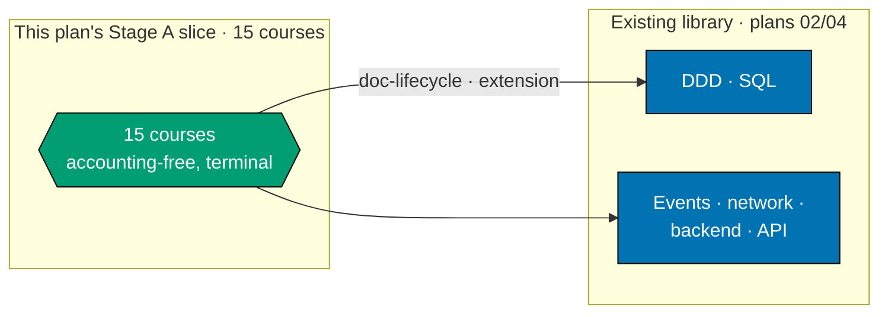
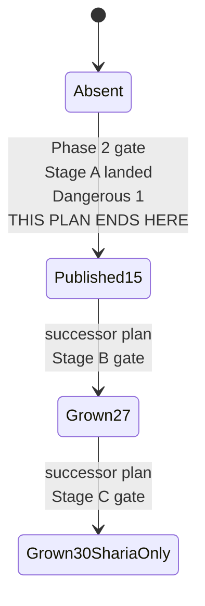

# Technical Documentation — Skills Path: ERP Foundations (Stage A)

## Corpus Disposition

`archive-with-plan` — this plan custodies its own `syllabus/` corpus (15 courses) and no consumer
**outside `plans/`** reads it (no checker, agent, Nx target, build/generation step, or shipped content
front-matter names a syllabus path). The corpus therefore moves to `plans/done/` with the plan folder
on archival. **One consumer inside `plans/` does exist** —
[`ayokoding-learning-path-18-skills-erp-enterprise-depth`](../../backlog/ayokoding-learning-path-18-skills-erp-enterprise-depth/tech-docs.md)
reads this plan's syllabus corpus by relative link for the cross-plan prerequisite edges it must cite
by id (see [§Corpus Custody](#corpus-custody) below); that is a `plans/`-internal read and does not
trip the promotion trigger. See
[Learning-Plan Syllabus Convention §Corpus Disposition](../../../repo-governance/conventions/structure/learning-plan-syllabus/corpus-disposition.md#corpus-disposition).

## Corpus Custody

This plan is the **sole custodian** of its own 15-course syllabus corpus — named
`**Custodian**: ayokoding-learning-path-17-skills-erp-foundations` in
[`syllabus/README.md`](./syllabus/README.md). The successor plan,
`ayokoding-learning-path-18-skills-erp-enterprise-depth`, is a **read-only consumer** of this corpus
(never an editor) and echoes `custodied-by:ayokoding-learning-path-17-skills-erp-foundations` under
its own `## Corpus Custody` heading. Per the Custody Rule's archival hand-off table: if this plan
archives to `plans/done/` while the successor plan is still a live consumer and no longer editing its
own corpus, the successor plan's inbound links are rewritten to this plan's new
`plans/done/YYYY-MM-DD__ayokoding-learning-path-17-skills-erp-foundations/syllabus/…` path (branch
(a), link rewrite) — see this plan's own [Phase 8](./delivery.md#phase-8-plan-archival) archival step.

## Overview

This plan delivers **Stage A of both `skills/` ERP paths**: 15 of the eventual 30 courses, and the
**fresh publication** of both `skills/conventional-erp` and `skills/sharia-erp` at 15 course ids each.
It is the first half of a two-plan split of the retired single-plan design
the superseded ERP-programme draft. The second half,
`ayokoding-learning-path-18-skills-erp-enterprise-depth` (historical source context this plan), grows both manifests
to their terminal 27/30-id state across Stage B and Stage C.

It touches **no application code** beyond two new JSON manifest data files and their co-located unit tests.
Every component, resolver, schema, and route it depends on is built by plans 01–03 and consumed here.

| Layer                                                                                             | Owner                                                    | This plan's relationship                  |
| ------------------------------------------------------------------------------------------------- | -------------------------------------------------------- | ----------------------------------------- |
| `courses/` + `paths/` content homes, structural `_index.md` files                                 | `ayokoding-learning-path-01-url-restructure`             | consumes                                  |
| `PathManifest` zod schema, pure `course-paths` core, integrity gates                              | `ayokoding-learning-path-02-schema-and-prerequisite-dag` | consumes                                  |
| `path-landing.tsx`, `path-card.tsx`, `manifest-repository.ts`, `?path=` wiring, all design assets | `ayokoding-learning-path-03-navigation-ui`               | consumes                                  |
| Static-rendering fix for `apps/ayokoding-www` (root layout, `?path=` client-side reads)           | `vercel-function-cost-reduction`                         | consumes (repository baseline; see below) |
| The accounting corpus, its manifests, its landings                                                | `ayokoding-learning-path-14/15/16-skills-accounting-*`   | no relationship — zero edge               |
| **The 15 Stage-A ERP courses, both manifests at 15 ids, both landings through Dangerous 1**       | **this plan**                                            | **authors**                               |
| Stage B/C course bodies, manifest growth past 15 ids, landing content past Dangerous 1            | `ayokoding-learning-path-18-skills-erp-enterprise-depth` | **not this plan — successor's job**       |

## Repository baseline

Repository structure, route behavior, schemas, and already-published course data are verified against current `origin/main` during Phase 0. They are implementation context, not plan prerequisites: this plan's only direct execution prerequisite is `ayokoding-learning-path-16-skills-accounting-sharia-extension`.

## Path constants

- `<COURSES>` = `apps/ayokoding-www/content/en/learn/courses/` — course bundles, served at
  `/en/learn/courses/<course-id>`
- `<PATHS>` = `apps/ayokoding-www/content/en/learn/paths/` — path landings and structural indexes
- `<CONVLANDING>` = `<PATHS>skills/conventional-erp/_index.md` — **this plan creates it fresh**
- `<SHARLANDING>` = `<PATHS>skills/sharia-erp/_index.md` — **this plan creates it fresh**
- `<FEAT>` = `apps/ayokoding-www/src/features/course-paths/`
- `<MANIFESTS>` = `<FEAT>manifests/`
- `<CONVMAN>` = `<MANIFESTS>skills/conventional-erp.json` — **this plan creates it fresh, at 15 ids**
- `<SHARMAN>` = `<MANIFESTS>skills/sharia-erp.json` — **this plan creates it fresh, at 15 ids**
- `<MTEST_CE>` = `<MANIFESTS>skills/conventional-erp-manifest.unit.test.ts` — **this plan creates it**
- `<MTEST_SE>` = `<MANIFESTS>skills/sharia-erp-manifest.unit.test.ts` — **this plan creates it**
- `<SYL>` = `plans/backlog/ayokoding-learning-path-17-skills-erp-foundations/syllabus/courses/` — this
  plan's own 15-file syllabus corpus
- `<SYLPATHS>` = `plans/backlog/ayokoding-learning-path-17-skills-erp-foundations/syllabus/paths/` —
  this plan's two path-manifest mirrors (each listing 15 ids at this checkpoint)
- `<SPECS>` = `specs/apps/ayokoding/behavior/ayokoding-www/gherkin/course-paths/`
- Path ids: `skills/conventional-erp` and `skills/sharia-erp` — the **full** strings including the
  category segment; there is no separate `category` field, and **nothing keys on segment count**
  (R2 / DD-21, inherited)

### Locale scope: `learn/courses` and `learn/paths` are English-only by established convention

`ayokoding-www` is bilingual (`apps/ayokoding-www/src/features/i18n/`), but its `learn/courses` and
`learn/paths` content trees are English-only in practice today: `content/id/learn/courses/` has
**0** directories against **59** in `content/en/learn/courses/` [Repo-grounded]. This plan follows
that established precedent — it authors no `content/id/` course or path content, and Phase 5's
three-tester retest and Phase 6's Playwright path-walk verify the `/en/` locale only. This is a
deliberate, auditable continuation of existing repo convention across the entire course-authoring
plan series, not an unaddressed gap.

### What this plan writes

- `<CONVMAN>`, `<SHARMAN>` — the two manifest files, created fresh at 15 ids. **The successor plan
  inherits edit rights over these same two files** to grow them further — see
  [§Manifest ownership across the two-plan split](#manifest-ownership-across-the-two-plan-split).
- `<CONVLANDING>`, `<SHARLANDING>` — the two path landings, created fresh through the Dangerous 1
  boundary. The successor plan inherits edit rights to extend their content through Dangerous 2/3/4.
- `<COURSES><erp-course-id>/` — 15 new course bundles.
- `<SYL><id>.md` + `<SYL>README.md` — 15 syllabus files inside this plan's own folder.
- `<SYLPATHS>manifest-skills-conventional-erp.md` and `<SYLPATHS>manifest-skills-sharia-erp.md` — the
  authoritative Stage-A-only orderings (15 ids each, identical at this checkpoint) this plan's
  manifests are transcribed from. The successor plan inherits edit rights to extend these two files to
  their terminal 27/30-id orderings.
- One ERP card each in `<PATHS>_index.md` and `<PATHS>skills/_index.md` for **each** path (four card
  insertions total) — **populate only**, created once here (the successor plan never touches these
  four insertions again).
- `<SPECS>skills-erp-paths.feature` and its step definitions
  (`apps/ayokoding-www-fe-e2e/src/steps/skills-erp-paths.steps.ts`) — **this plan creates both
  fresh**, scoped to the Dangerous 1 scenario. The successor plan inherits edit rights to extend both
  with Dangerous 2/3/4 scenarios.
- 15 new rows in `<COURSES>_index.md` — the shared course-catalog index — **populate only**.

### What this plan never touches

- Any file under `<MANIFESTS>careers/` or `<MANIFESTS>skills/*accounting*.json`.
- Any accounting course bundle, syllabus spec, or landing.
- Any Stage B/C course body, syllabus, or manifest entry past position 15.
- Any structural `_index.md` — created by plan 01 (A3). This plan edits populated cards into two of
  them and creates none.
- Any component under `<FEAT>shell/` or `<FEAT>core/`.
- Any design asset. This plan ships no `assets/` folder.

## Manifest ownership across the two-plan split

The retired source plan's manifest-ownership invariant ("each plan owns its own data file(s) plus
their co-located unit test, never a sibling's") governed **cross-plan** boundaries — this plan and
its successor are not siblings in that sense; they are a **sequential historical source context pair splitting one
formerly-single plan's own internal Stage A→B→C growth cycle** across two plan folders instead of one.
The retired plan grew `<CONVMAN>`/`<SHARMAN>` from 15→27 (Stage B) and 27→30 (Stage C) entirely within
itself; this split moves that same growth into a second plan rather than introducing a new kind of
cross-plan edit. Concretely: **this plan authors `<CONVMAN>`, `<SHARMAN>`, `<MTEST_CE>`, `<MTEST_SE>`,
`<CONVLANDING>`, `<SHARLANDING>`, the Gherkin feature file, and its step-definition file as new files;
the successor plan is explicitly authorized to edit (grow) every one of them** — this is a growth-edit
performed by the plan the historical source context edge exists precisely to sequence, not an ownership violation.
No third plan may edit any of these eight files.

## The ERP catalog (this plan's 15-course slice)

Course ids, formats, prerequisite edges, and ramp order for the **full 30-course catalog** were
settled once in the retired source plan and are **transcribed here, not re-derived**. This plan
authors exactly the 15 rows below; the remaining 15 (Stage B/C) belong to the successor plan's own
tech-docs.md.

| #   | Course id                                     | Format            | ERP prereqs | SWE prereqs                                                                              |
| --- | --------------------------------------------- | ----------------- | ----------- | ---------------------------------------------------------------------------------------- |
| 1   | `erp-foundations-and-history`                 | Annotated-concept | —           | —                                                                                        |
| 2   | `erp-conceptual-data-model`                   | Annotated-concept | 1           | —                                                                                        |
| 3   | `erp-module-map-and-architecture`             | Annotated-concept | 2           | —                                                                                        |
| 4   | `erp-document-lifecycle-and-state-machines`   | Annotated-concept | 3           | `domain-driven-design`                                                                   |
| 5   | `erp-posting-rules-and-account-determination` | By Example        | 4           | —                                                                                        |
| 6   | `erp-subledger-to-gl-architecture`            | By Example        | 5           | —                                                                                        |
| 7   | `erp-fiscal-calendar-and-period-close`        | Annotated-concept | 6           | —                                                                                        |
| 8   | `erp-numbering-sequences-and-uom-conversion`  | Annotated-concept | 3           | —                                                                                        |
| 9   | `erp-audit-trail-and-change-tracking`         | Annotated-concept | 4           | — · **Dangerous 1 ⚡ lands here**                                                        |
| 10  | `procure-to-pay-systems`                      | By Example        | 6           | —                                                                                        |
| 11  | `order-to-cash-systems`                       | By Example        | 6           | —                                                                                        |
| 12  | `erp-procurement-and-fulfillment-exceptions`  | By Example        | 10, 11      | —                                                                                        |
| 17  | `erp-bom-and-routing-architecture`            | By Example        | 2           | — · authored here despite reading 17th (see README)                                      |
| 22  | `erp-extension-and-customization`             | By Example        | 3           | `sql-essentials`                                                                         |
| 23  | `erp-integration-patterns`                    | By Example        | 22          | `event-driven-architecture`, `networking-essentials`, `backend-essentials`, `api-design` |

**Format counts (this plan's 15)**: 8 By Example, 7 Annotated-concept.

**No id in this 15-course list is a substring of another**, and no id collides with an existing
software-engineering course id, an accounting course id, or any Stage B/C ERP course id — verified at
Phase 0.

**Forward references this plan declares but does not author**: none. Every prerequisite named in the
table above is either an existing library course or another id inside this plan's own 15. No course
in this plan's slice depends on a Stage B/C id.

## The prerequisite graph — this plan's edges only

R5 requires stating whether the domain joins the existing prerequisite DAG. It does: this plan's slice
declares 6 edges into the software-engineering library (`domain-driven-design`, `sql-essentials`,
`event-driven-architecture`, `networking-essentials`, `backend-essentials`, `api-design`) and **zero**
edges into any accounting corpus. No software-engineering course declares any of this plan's ids as a
prerequisite — this slice is downstream-only, exactly as the full catalog is.

**Two of these six are not yet published — this is a repository baseline context, not an assumption.**
`sql-essentials`, `networking-essentials`, `backend-essentials`, and `api-design` already exist under
`apps/ayokoding-www/content/en/learn/courses/`. `domain-driven-design` (course 4's prerequisite) and
`event-driven-architecture` (course 23's prerequisite) do **not** — both are pending authoring targets
listed in `ayokoding-learning-path-06-course-authoring-architecture-and-ai-harness`'s own backlog
`delivery.md`, not yet merged to `origin/main`. This plan's
[§Depends-on](./delivery.md#depends-on) therefore adds
`ayokoding-learning-path-06-course-authoring-architecture-and-ai-harness` as a fifth repository baseline context
precondition — Phase 0 does not complete, and course 4/23 authoring does not start, until that plan
merges and both ids exist on disk. `checkPrerequisiteConsistency` (see
`apps/ayokoding-www/src/features/course-paths/core/prerequisites.ts`) would otherwise fail
non-deterministically depending on execution order relative to plan 06.



**Accessibility note.** Domain is carried by node shape and by the two labelled subgraph containers,
never by colour alone, per the
[Color Accessibility Convention](../../../repo-governance/conventions/formatting/color-accessibility.md).

## Why split at the Stage A/B boundary

The retired source plan's own DD-4 already established that the accounting historical source context edge is "soft
overall and hard at two of the three stage gates" — Stage A carries **zero** accounting precondition
while Stage B and Stage C each wait on a named accounting boundary. That asymmetry is exactly the
seam this split follows: Stage A's 15 courses are fully self-contained and independently deployable
the moment plans 01/02/03 and `vercel-function-cost-reduction` are merged, while Stage B/C's 15
courses cannot start authoring their course bodies until the accounting-split plans resolve. Splitting
at any other boundary (for example, mid-Stage-B) would produce a plan whose own manifest state is
mid-growth and not independently deployable — violating the delivery-boundary test's requirement (c)
"defensible on `main`". The Stage A/B seam is the only split point where **both** halves land on a
real, already-declared boundary in the catalog.

## Stage A is a deployable milestone (DD-5)

Both manifests publish fresh at 15 ids (courses `#1-12, 17, 22, 23` in that authoring order) as this
plan's own terminal state — this is a real, valid, schema-checked, e2e-tested, **deployed** state (both
landings live in prod at Dangerous 1), not a placeholder pending the successor plan. A reader visiting
either path today gets a coherent, if smaller, experience: 15 real courses, a real ramp, a real
boundary statement. This mirrors the retired source plan's own DD-5, narrowed to what this plan alone
delivers.

## Manifest format and lifecycle (this plan's slice)

### Shape (both manifests share this shape at this checkpoint; only the ids differ from their eventual terminal state)

```json
{
  "pathId": "skills/conventional-erp",
  "arc": "immediately-effective",
  "title": "Enterprise Resource Planning (Conventional)",
  "description": "Learn the architecture and cross-cutting spine of a conventional ERP — deep enough to found an implementation, never asked to build one. This release covers Stage A (Foundations & Architecture); enterprise-depth content follows in a later release.",
  "courseOrder": ["erp-foundations-and-history", "erp-conceptual-data-model"]
}
```

```json
{
  "pathId": "skills/sharia-erp",
  "arc": "immediately-effective",
  "title": "Enterprise Resource Planning (Sharia-Compliant)",
  "description": "The same conventional-ERP grounding, plus jurisdiction-plural Sharia-compliant design in a later release. This release covers Stage A (Foundations & Architecture) — identical to conventional-erp's own Stage A release.",
  "courseOrder": ["erp-foundations-and-history"]
}
```

Four invariants specific to these manifests (inherited, schema-owner-ruled, binding on this plan):

- **`pathId` is the full string, category segment included** — `skills/conventional-erp` or
  `skills/sharia-erp`, nothing shorter. There is **no separate `category` field**.
- **Validation is on the first-segment literal plus resolvability, never on arity.**
- **`arc` is a separate required field, present even though the URL omits it** (R8 / DD-7, inherited).
- **`courseOrder` is each file's only YAML sequence.** Asserted at the REFACTOR step of the
  publication cycle.

### courseOrder at Stage A publication (this plan's own terminal state)

Both `<CONVMAN>` and `<SHARMAN>` publish **identically** at this checkpoint (15 ids):
`erp-foundations-and-history`, `erp-conceptual-data-model`, `erp-module-map-and-architecture`,
`erp-document-lifecycle-and-state-machines`, `erp-posting-rules-and-account-determination`,
`erp-subledger-to-gl-architecture`, `erp-fiscal-calendar-and-period-close`,
`erp-numbering-sequences-and-uom-conversion`, `erp-audit-trail-and-change-tracking`,
`procure-to-pay-systems`, `order-to-cash-systems`, `erp-procurement-and-fulfillment-exceptions`,
`erp-bom-and-routing-architecture`, `erp-extension-and-customization`, `erp-integration-patterns`.

**The successor plan grows both arrays from this exact 15-id state.** This plan's own delivery.md
records the falsifiable before/after check for this publication (the array is empty before Phase 2,
exactly these 15 ids after) so the successor plan's own growth checks have a known starting point to
diff against.

### Lifecycle (this plan's slice of the full lifecycle)



## Landing content requirements (what plan 03 cannot infer) — this plan's boundary only

`ayokoding-learning-path-03-navigation-ui` owns **how the landings look**. This plan ships no design
asset. What this plan owes plan 03 is a **content specification** for each of the two landings, scoped
to the Dangerous 1 boundary this plan reaches.

### Requirement L-1 — the Dangerous 1 boundary must be visible on both landings

| Boundary           | Reached after                                                                                                   | Can                                                                                                                                                                                         | Cannot                                                                                                                          | Path(s) |
| ------------------ | --------------------------------------------------------------------------------------------------------------- | ------------------------------------------------------------------------------------------------------------------------------------------------------------------------------------------- | ------------------------------------------------------------------------------------------------------------------------------- | ------- |
| **Dangerous 1 ⚡** | `erp-audit-trail-and-change-tracking` (course 9 of 15, this plan's own terminal count; 9 of the eventual 27/30) | Read and reason about how any real ERP structures documents, postings, and account determination — informed enough to review an implementation's design or ask a vendor the right questions | Reason about inventory costing, closing the books, multi-entity consolidation, or anything past this plan's own 15-course slice | both    |

### Requirement L-2 — the 9-course runway to Dangerous 1 is justified, not hidden

Inherited from the retired source plan (unchanged rationale): ERP's cross-cutting spine has no small
usable subset — skipping any one of the six architecture-spine courses leaves a reader unable to
distinguish sound account-determination logic from broken. Stated on the landing itself, not just in
narrative.

### Requirement L-3 — the arc is stated once, not per URL

The skills category states the immediately-effective promise once (R8). Neither landing carries an
arc chooser.

### Requirement L-4 — linked-not-walked prerequisites are outbound links

Each landing carries outbound links to its own set of existing software-engineering prerequisites
(this plan's slice touches no accounting prerequisite), each to its canonical
`/en/learn/courses/<id>` page. None appears in either `courseOrder`.

### Requirement L-5 — sharia-erp states explicitly it is identical to conventional-erp at this checkpoint

Unlike the retired source plan's full-corpus L-5 (which states `sharia-erp` "covers all the basics"
against a _different_, longer `courseOrder`), this plan's own checkpoint has both manifests
**byte-identical in courseOrder**. The `sharia-erp` landing must say so plainly — "identical to
conventional-erp today; Sharia-specific depth ships in a later release" — rather than implying a
distinction that does not yet exist.

## Verification status carried forward (A4)

Inherited from the retired source plan without change for this plan's own 15-course slice: module
names (FI/CO/MM/SD), process names (P2P/O2C), and the general architecture claims are **safe to
assert**. Platform version pins and analyst-positioning claims remain `[Unverified]` and are never
restated as fact — see the retired source plan's own carried table, reproduced identically for this
slice's 15 courses in each syllabus file's Accuracy notes section.

## Licensing and IP Compliance (A8)

**Every course in this plan's 15-course slice is authored clean-room.** No standards text, proprietary
schema, or copyleft code is reproduced anywhere. This section carries the **general ERP licensing
posture** forward from the retired source plan verbatim — this plan does not touch Sharia-specific
standards bodies (AAOIFI, PSAK, MFRS) directly; that material belongs to the successor plan's Stage C
sub-phase.

### Per-project licence table (`[Web-cited]` per row; access date 2026-07-22, carried forward from the retired source plan)

| Project                                             | Licence            | Note                                                                                                                                                                                                                                                                                                                                                                                      |
| --------------------------------------------------- | ------------------ | ----------------------------------------------------------------------------------------------------------------------------------------------------------------------------------------------------------------------------------------------------------------------------------------------------------------------------------------------------------------------------------------- |
| Odoo Community                                      | LGPLv3             | `[Web-cited: odoo/odoo LICENSE — https://raw.githubusercontent.com/odoo/odoo/17.0/LICENSE ; accessed 2026-07-22]`: "Odoo is published under the GNU LESSER GENERAL PUBLIC LICENSE, Version 3 (LGPLv3), as included below." Permissive-ish copyleft; describe behaviourally, never quote code                                                                                              |
| Odoo Enterprise                                     | OEEL (proprietary) | `[Web-cited: Odoo official documentation — https://www.odoo.com/documentation/master/legal/licenses.html ; accessed 2026-07-22]`: "This software and associated files (the 'Software') can only be used (executed, modified, executed after modifications) with a valid Odoo Enterprise Subscription for the correct number of users." Never reference internals beyond nominative naming |
| ERPNext                                             | GPLv3              | `[Web-cited: frappe/erpnext license.txt — https://raw.githubusercontent.com/frappe/erpnext/develop/license.txt ; accessed 2026-07-22]`: "GNU GENERAL PUBLIC LICENSE Version 3, 29 June 2007". Code is copyleft; docs are CC-BY-SA-3.0                                                                                                                                                     |
| Frappe Framework                                    | MIT                | `[Web-cited: frappe/frappe GitHub — https://github.com/frappe/frappe ; accessed 2026-07-22]`: repository license badge reads "License: MIT", linking to the MIT `LICENSE` file at the repo root. The only fully permissive project in the table                                                                                                                                           |
| Tryton                                              | GPLv3+             | `[Web-cited: tryton/tryton-client LICENSE — https://github.com/tryton/tryton-client/blob/develop/LICENSE ; accessed 2026-07-22]`: "GNU GENERAL PUBLIC LICENSE Version 3, 29 June 2007". Copyleft; describe behaviourally                                                                                                                                                                  |
| Apache OFBiz                                        | Apache-2.0         | `[Web-cited: ofbiz.apache.org/download.html ; accessed 2026-07-22]`: "Licensed under the Apache License, Version 2.0". Permissive; never paste verbatim without attribution                                                                                                                                                                                                               |
| Dolibarr                                            | GPLv3+             | `[Web-cited: Dolibarr/dolibarr COPYRIGHT ; accessed 2026-07-22]`: "The Dolibarr software as a whole is distributed under the GNU General Public License as published by the Free Software Foundation; either version 3 of the License, or (at your option) any later version (GPL-3+)." Copyleft; describe behaviourally                                                                  |
| iDempiere                                           | GPLv2              | `[Web-cited: idempiere/idempiere LICENSE.md ; accessed 2026-07-22]`: "GNU General Public License, Version 2, June 1991". Copyleft; describe behaviourally                                                                                                                                                                                                                                 |
| Metasfresh                                          | GPLv2              | `[Web-cited: metasfresh/metasfresh LICENSE.md ; accessed 2026-07-22]`: "GNU GENERAL PUBLIC LICENSE Version 2, June 1991". Copyleft; describe behaviourally, never quote code                                                                                                                                                                                                              |
| ledger-cli (reference for GL mechanics)             | BSD-3-Clause       | `[Web-cited: ledger/ledger README.md license badge ; accessed 2026-07-22]`: README license badge reads "BSD", linking to the BSD-3-Clause license page. Permissive; safe to reference more directly than the above                                                                                                                                                                        |
| Apache Fineract (reference for subledger mechanics) | Apache-2.0         | `[Web-cited: fineract.apache.org ; accessed 2026-07-22]`: "Licensed under the Apache License, Version 2.0." Permissive; safe to reference more directly than the above                                                                                                                                                                                                                    |

**No public-domain chart-of-accounts template was found during authoring research.** Any chart of
accounts anywhere in this plan's slice (course 2's data-model examples, course 5's posting-rule
worked examples, and every By-Example course's sample company) must be **authored originally**.

### The eleven safe-authoring rules (bind every course in this plan)

1. Restate concepts in original words; never reproduce standards text, tables, or clause numbering.
2. Cite standard number + title + official link where referenced at all; quote nothing.
3. Never translate a standard.
4. Author every chart of accounts, worked example, and dataset originally.
5. Reference implementations: prefer permissive (ledger-cli BSD-3-Clause, Apache Fineract
   Apache-2.0); describe copyleft projects behaviourally.
6. Never paste code from a copyleft codebase, in any quantity.
7. Use vendor names nominatively only — never in a course title, path segment, or product name.
8. Screenshots of proprietary software are out.
9. Carry `[Verified]`/`[Unverified]`/`[Needs Verification]` markers verbatim into course frontmatter
   or body where a claim depends on them.
10. Where a doctrinal or jurisdictional claim rests on secondary sources only, say so in the course.
11. When in doubt between describing and reproducing, describe.

## R9 gate posture (declared explicitly)

### UI gate — exempt, with the exemption stated

This plan authors **no** file under `<FEAT>shell/` or `<FEAT>core/`; its user-visible output is
content and data rendered by components `ayokoding-learning-path-03-navigation-ui` owns. This plan is
**exempt from `ui-quality-gate`** with the Rule-15 three-tester retest as the mandatory non-vacuous
substitute (Phase 5) — see [§Rule-15 retest split decision](#rule-15-retest-split-decision).

### API gate — NOT exempt

Both manifests are **reachable behavior** — loaded, zod-validated, and integrity-checked at build time
by `manifest-repository.ts`. `ayokoding-www` has no OpenAPI 3.x document, no GraphQL SDL, and its only
route is the internal tRPC handler [Repo-grounded, R9's verified precondition state].

## Rule-15 retest split decision

**This plan runs its own three-tester Rule-15 retest at its Stage A checkpoint, rather than deferring
entirely to the successor plan's end-of-programme retest.** Reasoning: DD-5 (above) establishes that
Stage A is a genuinely deployable milestone, not an intermediate scaffold — both manifests are live,
schema-valid, and reachable, and both landings render a real, if partial, ramp. A checkpoint the plan
itself calls "deployable" that ships to production without its own manual UI verification would leave
a real, user-visible surface unverified for the entire span of the successor plan's execution (which
may run for weeks, gated on the accounting-split plans). This mirrors the parallel accounting-split
programme's own choice to retest at every standalone-shippable milestone rather than only at the final
one, keeping the two split programmes' retest cadence consistent. The successor plan runs its **own**
Rule-15 retest at its own terminal checkpoint (both manifests at 27/30 ids); the two retests are not
redundant — each verifies a distinct, independently-shipped state of the same two landings.

## Design Decisions

- **DD-1 · This plan owns Stage A of both ERP paths; the successor plan owns Stage B+C.** Splits the
  retired the superseded ERP-programme draft's single-plan design at the one boundary where both
  halves are independently deployable (Stage A has no accounting precondition; Stage B/C both do). See
  [§Why split at the Stage A/B boundary](#why-split-at-the-stage-ab-boundary). **Decided.**
- **DD-2 · The 15 Stage-A syllabus specs live in this plan's own `syllabus/courses/`, not the
  successor plan's and not plan 02's.** Custody is exactly this plan's 15 files; the successor plan is
  a read-only consumer for the cross-plan prerequisite edges it must cite. **Decided.**
- **DD-3 · Course 17 authors here despite reading late.** Its only prerequisite (course 2) is inside
  this plan's own slice; deferring it would idle three Stage-B courses in the successor plan for no
  reason. **Decided.**
- **DD-4 · This plan carries zero accounting precondition.** Per the retired plan's own stage-gate
  table, "Stage A start — no gate". This plan therefore runs fully concurrently with the
  accounting-split plans (`14`/`15`/`16`) and with every careers/course-authoring plan **except
  `ayokoding-learning-path-06-course-authoring-architecture-and-ai-harness`**, which is a new hard
  historical source context precondition — see
  [§The prerequisite graph](#the-prerequisite-graph--this-plans-edges-only). **Decided.**
- **DD-5 · Stage A publication is a genuine deployable milestone, never a placeholder.** Both
  manifests are schema-valid, e2e-tested, and deployed at 15 ids; both landings render a real,
  honestly-scoped ramp through Dangerous 1. This is what justifies this plan's own Rule-15 retest (see
  above) rather than deferring entirely to the successor plan. **Decided.**
- **DD-6 · `vercel-function-cost-reduction` is a new repository baseline context precondition.** This plan ships
  two brand-new content routes in the same app that plan is fixing; authoring against the post-fix
  static-rendering posture avoids reintroducing the exact regression that plan closes. **Decided.**
- **DD-7 · Both manifests record `arc: immediately-effective` even though the URL omits it.**
  Unchanged rationale (R8/R2, inherited). **Decided.**
- **DD-8 · The manifest-ownership invariant is satisfied by explicit successor-plan edit
  authorization, not violated by it.** The eight files this plan authors that the successor plan later
  grows (`<CONVMAN>`, `<SHARMAN>`, `<MTEST_CE>`, `<MTEST_SE>`, `<CONVLANDING>`, `<SHARLANDING>`, the
  feature file, the step-definition file) are a sequential historical source context-ordered growth, not a
  same-time cross-plan collision. See [§Manifest ownership across the two-plan split](#manifest-ownership-across-the-two-plan-split).
  **Decided.**
- **DD-9 · Corpus custody is single-owner, per the Learning-Plan Syllabus Convention.** This plan is
  sole custodian of its own 15-file syllabus corpus; the successor plan is a read-only consumer,
  echoing `custodied-by:` under its own `## Corpus Custody` heading. **Decided.**
- **DD-10 · The `sharia-erp` landing states identity-with-`conventional-erp`, not "covers all the
  basics" (a claim that requires the full 27/30-course corpus to be meaningful).** At this
  checkpoint the two manifests are byte-identical; the honest landing statement reflects that,
  deferring the retired plan's L-5 language to the successor plan's own terminal checkpoint.
  **Decided.**
- **DD-11 · UI gate: exempt, with the exemption and its reason stated; API gate: not exempt.**
  Unchanged rationale, scoped to this plan's own 15-course, 2-manifest surface. **Decided.**
- **DD-12 · This plan runs its own Rule-15 retest at the Stage A checkpoint.** See
  [§Rule-15 retest split decision](#rule-15-retest-split-decision). **Decided.**
- **DD-13 · Licensing posture: the general ERP per-project table and eleven safe-authoring rules
  apply in full; Sharia-specific standards bodies are out of this plan's scope.** AAOIFI/PSAK/MFRS
  material belongs entirely to the successor plan's Stage C sub-phase. **Decided.**

## File-Impact Analysis

Root-relative annotated tree — the scan-first source of truth for this plan's scope. **[E]** edit,
**[N]** new file/pattern, **[D]** delete, **[G]** generated/regenerated.

```text
.
├── apps/ayokoding-www/content/en/learn/courses/
│   ├── _index.md [E] — append 15 catalog rows, populate only (created by plan 01)
│   └── <erp-course-id>/ [N] — 15 course bundles, this plan's Stage A slice
├── apps/ayokoding-www/content/en/learn/paths/
│   ├── _index.md [E] — add two ERP cards, populate only
│   ├── skills/_index.md [E] — add two ERP cards, populate only
│   ├── skills/conventional-erp/_index.md [N] — landing through Dangerous 1
│   └── skills/sharia-erp/_index.md [N] — landing through Dangerous 1
├── apps/ayokoding-www/src/features/course-paths/manifests/skills/
│   ├── conventional-erp.json [N] — published at 15 ids; plan 18 grows it
│   ├── sharia-erp.json [N] — published at 15 ids; plan 18 grows it
│   ├── conventional-erp-manifest.unit.test.ts [N] — asserts 15 ids
│   └── sharia-erp-manifest.unit.test.ts [N] — asserts 15 ids
├── specs/apps/ayokoding/behavior/ayokoding-www/gherkin/course-paths/
│   └── skills-erp-paths.feature [N] — Dangerous-1-scoped
└── apps/ayokoding-www-fe-e2e/src/steps/skills-erp-paths.steps.ts [N]
└── plans/in-progress/ayokoding-learning-path-17-skills-erp-foundations/
    ├── tech-docs.md [E] — this file
    ├── delivery.md [E] — checkbox ticks and per-phase implementation notes
    ├── learnings.md [E] — running log, drained by the Knowledge Capture phase
    └── evidence/ [N] — phase-0 snapshot, growth records, Playwright screenshots
```

### More Detail

**This plan is the corpus custodian and its `syllabus/` tree already exists on disk** — the plan
folder rows above therefore show `syllabus/README.md` (carrying
`**Custodian**: ayokoding-learning-path-17-skills-erp-foundations`), `syllabus/courses/` (15 spec
files) and `syllabus/paths/` (two manifest mirrors at 15 ids each) as `[E]`/`[N]` work Phase 1
completes. Plan 18 is a read-only consumer that echoes `custodied-by:` under its own
`## Corpus Custody` heading and never edits a file here.

**This plan creates both ERP manifests fresh at 15 ids and hands edit rights to plan 18** to grow them
to 27/30. That is a sequential hand-off across the Stage A/B boundary, not a shared write — plan 17
archives before plan 18 starts.

The three `[E]` rows under `content/en/learn/` are all **populate-only** edits of files plan 01
created; this plan appends its ERP slice rather than rewriting them.

No `[D]` or `[G]` rows: this plan deletes nothing, and no emitter runs over its output.

| Path                                                              | Change | Note                                                                     |
| ----------------------------------------------------------------- | ------ | ------------------------------------------------------------------------ |
| `syllabus/README.md` + `<SYL><id>.md` × 15                        | new    | this plan's own syllabus corpus (DD-2)                                   |
| `<SYLPATHS>manifest-skills-conventional-erp.md`, `…sharia-erp.md` | new    | the two manifest mirrors at Stage A (15 ids each, identical)             |
| `<CONVMAN>`, `<SHARMAN>`                                          | new    | published at 15 ids; successor plan inherits edit rights to grow further |
| `<CONVLANDING>`, `<SHARLANDING>`                                  | new    | the two path landings through Dangerous 1                                |
| `<COURSES><erp-course-id>/` × 15                                  | new    | course bundles, this plan's Stage A slice                                |
| `<PATHS>_index.md`                                                | edit   | add two ERP cards — populate only                                        |
| `<PATHS>skills/_index.md`                                         | edit   | add two ERP cards — populate only                                        |
| `<COURSES>_index.md`                                              | edit   | add fifteen catalog rows — populate only; file created by plan 01        |
| `<SPECS>skills-erp-paths.feature`                                 | new    | this plan's Gherkin, Dangerous-1-scoped                                  |
| `apps/ayokoding-www-fe-e2e/src/steps/skills-erp-paths.steps.ts`   | new    | step bindings; successor plan inherits edit rights to extend             |
| `<MTEST_CE>`                                                      | new    | asserts `<CONVMAN>` at 15 ids                                            |
| `<MTEST_SE>`                                                      | new    | asserts `<SHARMAN>` at 15 ids                                            |

## Rollback

- **Phase 1** (syllabus specs) — plan-folder-only; reverting removes the specs and nothing
  user-visible changes.
- **Phase 2** (Stage A authoring + manifest publication + landings) — reverting removes both
  manifests, both landings, the four cards, and 15 course bundles. The skills category landing returns
  to its plan-01 empty state for the ERP slot specifically, which plan 03 has designed for.
- **Phases 3-8** — verification, licensing audit, retest, integration, knowledge capture, and archival
  ship no product change; reverting affects evidence and plan documents only.

No rollback path touches an accounting file, a careers manifest, a component, or a Stage B/C course
body — this plan's blast radius is exactly the files listed above.
