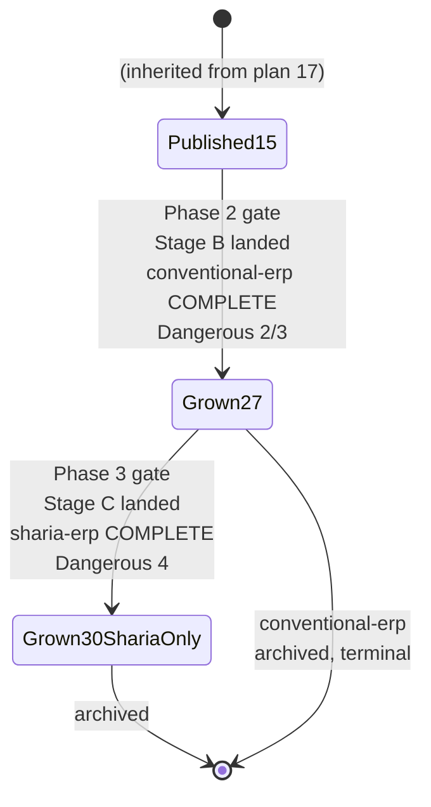

# Technical Documentation — Skills Path: ERP Enterprise Depth (Stage B + Stage C)

## Corpus Disposition

`archive-with-plan` — this plan custodies its own 15-file `syllabus/` corpus and no consumer
**outside `plans/`** reads it. The corpus moves to `plans/done/` with the plan folder on archival. See
[Learning-Plan Syllabus Convention §Corpus Disposition](../../../repo-governance/conventions/structure/learning-plan-syllabus/corpus-disposition.md#corpus-disposition).

## Corpus Custody

`custodied-by:ayokoding-learning-path-17-skills-erp-foundations` — this plan is a **read-only
consumer** of plan 17's 15-file Stage-A syllabus corpus, cited by relative link for the seven
cross-plan prerequisite edges in [§Cross-plan prerequisite edges](#cross-plan-prerequisite-edges-into-plan-17)
below. This plan never edits, copies, or forks any file under plan 17's `syllabus/`. Separately, this
plan is the **sole custodian** of its own 15-file Stage B+C syllabus corpus, named
`**Custodian**: ayokoding-learning-path-18-skills-erp-enterprise-depth` in
[`syllabus/README.md`](./syllabus/README.md) — no further plan is expected to consume it, so its own
`## Corpus Disposition` above stands as `archive-with-plan` without qualification.

## Overview

This plan completes both `skills/` ERP paths: it grows `<CONVMAN>` and `<SHARMAN>` from the 15 ids
`ayokoding-learning-path-17-skills-erp-foundations` publishes to their terminal state (27 for
`conventional-erp`, 30 for `sharia-erp`), authoring the 15 remaining courses (Stage B's 12,
Stage C's 3) and updating both landings through every remaining Dangerous-N boundary.

It touches **no application code** beyond editing the two JSON manifest data files plan 17 created plus their
co-located unit tests. Every component, resolver, schema, and route it depends on is built by plans
01–03 and consumed here; every accounting course it links is built by the accounting-split programme.

| Layer                                                                                                 | Owner                                                    | This plan's relationship                                                                              |
| ----------------------------------------------------------------------------------------------------- | -------------------------------------------------------- | ----------------------------------------------------------------------------------------------------- |
| `courses/` + `paths/` content homes, structural `_index.md` files                                     | `ayokoding-learning-path-01-url-restructure`             | consumes                                                                                              |
| `PathManifest` zod schema, pure `course-paths` core, integrity gates                                  | `ayokoding-learning-path-02-schema-and-prerequisite-dag` | consumes                                                                                              |
| `path-landing.tsx`, `path-card.tsx`, `manifest-repository.ts`, `?path=` wiring, all design assets     | `ayokoding-learning-path-03-navigation-ui`               | consumes                                                                                              |
| 15 Stage-A course bodies, both manifests at 15 ids, both landings through Dangerous 1                 | `ayokoding-learning-path-17-skills-erp-foundations`      | **grows** (not authors fresh — see [§Manifest ownership](#manifest-ownership-inherited-from-plan-17)) |
| Accounting course ids used in ERP course frontmatter                                                  | existing `origin/main` course bundles                    | verify the specific ids before authoring; this is artifact context, not a plan dependency             |
| **The 15 Stage-B/C ERP courses, both manifests grown to terminal, both landings through Dangerous 4** | **this plan**                                            | **authors**                                                                                           |

## Manifest ownership (inherited from plan 17)

Per plan 17's own `tech-docs.md` §Manifest ownership across the two-plan split, this plan is
**explicitly authorized** to edit (grow) eight files plan 17 authored fresh: `<CONVMAN>`, `<SHARMAN>`,
`<MTEST_CE>`, `<MTEST_SE>`, `<CONVLANDING>`, `<SHARLANDING>`, the Gherkin feature file
(`skills-erp-paths.feature`), and its step-definition file
(`apps/ayokoding-www-fe-e2e/src/steps/skills-erp-paths.steps.ts`). This is a sequential growth-edit the
historical source context edge between the two plans exists precisely to sequence, not a violation of the
one-custodian-per-file norm — it mirrors exactly how the retired single-plan design grew the same
files across its own internal Stage A→B→C, now split across two plan folders instead of one. **No
third plan may edit any of these eight files.**

## Cross-plan prerequisite edges into plan 17

Stated by specific course id rather than a blanket "Stage A must exist" — the blanket historical source context on
plan 17 (see [delivery.md §Depends-on](./delivery.md#depends-on)) already
guarantees all 15 Stage-A ids exist on `origin/main`; this table is the audit-readable record of
**which** ids each of this plan's courses actually cites in its own frontmatter `prerequisites`:

| This plan's course id                              | Cites plan 17's course id(s)                                                               |
| -------------------------------------------------- | ------------------------------------------------------------------------------------------ |
| `record-to-report-systems` (13)                    | `erp-subledger-to-gl-architecture` (6), `erp-fiscal-calendar-and-period-close` (7)         |
| `inventory-and-warehouse-management` (14)          | `erp-subledger-to-gl-architecture` (6)                                                     |
| `production-planning-and-mrp` (18)                 | `erp-bom-and-routing-architecture` (17)                                                    |
| `quality-management-and-inspection` (21)           | `erp-procurement-and-fulfillment-exceptions` (12), `erp-bom-and-routing-architecture` (17) |
| `human-capital-management-and-hire-to-retire` (24) | `erp-module-map-and-architecture` (3)                                                      |
| `erp-security-and-controls` (26)                   | `erp-module-map-and-architecture` (3)                                                      |
| `islamic-contract-based-transaction-flows` (29)    | `procure-to-pay-systems` (10), `order-to-cash-systems` (11)                                |

Two of this plan's own courses depend on **another course inside this same plan** rather than on plan
17: `erp-inventory-costing-methods` (15) and `erp-inventory-integrity-and-concurrency` (16) both
depend on `inventory-and-warehouse-management` (14, also this plan); `demand-and-supply-planning` (19)
and `erp-availability-and-reservations` (20) depend on `production-planning-and-mrp` (18, also this
plan); `multi-company-and-multi-currency-erp` (25) and `erp-analytics-and-reporting` (27) depend on
`record-to-report-systems` (13, also this plan); `sharia-compliant-erp-design` (28) depends on
`multi-company-and-multi-currency-erp` (25, also this plan); `zakat-and-sharia-compliance-modules`
(30) depends on `erp-security-and-controls` (26) and `sharia-compliant-erp-design` (28, both this
plan). These in-plan edges are ordinary same-plan authoring-order constraints, not cross-plan edges,
and are listed in the full catalog table below rather than in this cross-plan table.

## Path constants

- `<COURSES>`, `<PATHS>`, `<FEAT>`, `<MANIFESTS>`, `<CONVMAN>`, `<SHARMAN>`, `<MTEST_CE>`, `<MTEST_SE>`,
  `<CONVLANDING>`, `<SHARLANDING>`, `<SPECS>` — identical constants to plan 17's own, since this plan
  edits the same files plan 17 created. See
  [plan 17's tech-docs.md §Path constants](../../done/2026-08-16__ayokoding-learning-path-17-skills-erp-foundations/tech-docs.md#path-constants)
  for the full definitions; not re-derived here.
- `<SYL>` = `plans/backlog/ayokoding-learning-path-18-skills-erp-enterprise-depth/syllabus/courses/` —
  **this plan's own** 15-file syllabus corpus (Stage B + Stage C only; Stage A's 15 files live in plan
  17's own `<SYL>`).
- `<SYLPATHS>` = `plans/backlog/ayokoding-learning-path-18-skills-erp-enterprise-depth/syllabus/paths/`
  — this plan's two path-manifest mirrors, each carrying the **full terminal ordering** (27/30 ids):
  positions 1-15 are references into plan 17's corpus (by id, with a link to plan 17's own
  `<SYL><id>.md`, never a copy of that file's content); positions 16-30 are this plan's own courses.

### What this plan writes

- `<CONVMAN>`, `<SHARMAN>` — **grown**, not created (plan 17 authored them fresh). Two TDD growth
  cycles: 15→27 (Stage B, both manifests) and 27→30 (Stage C, `<SHARMAN>` only).
- `<CONVLANDING>`, `<SHARLANDING>` — **grown**, updating the Dangerous-N ramp table and, for
  `<SHARLANDING>`, the terminal "covers all the basics" statement (L-5).
- `<COURSES><erp-course-id>/` — 15 new course bundles (Stage B's 12, Stage C's 3).
- `<SYL><id>.md` + `<SYL>README.md` — 15 syllabus files inside this plan's own folder.
- `<SYLPATHS>manifest-skills-conventional-erp.md` and `<SYLPATHS>manifest-skills-sharia-erp.md` — the
  full 27/30-id orderings, extending plan 17's own 15-id mirrors.
- `<SPECS>skills-erp-paths.feature` and its step-definition file — **grown**, not created; extended
  with the Dangerous 2/3/4 scenarios.
- Run `npm exec nx run ayokoding-www:generate-indexes` after the 15 bundles land, then `npm exec nx run ayokoding-www:validate-indexes`.

### What this plan never touches

- Any file under `<MANIFESTS>careers/` or `<MANIFESTS>skills/*accounting*.json`.
- Any accounting course bundle, syllabus spec, or landing.
- Any Stage-A course body or syllabus file (plan 17's exclusive scope) — this plan only reads plan
  17's syllabus corpus by relative link.
- Any structural `_index.md`, any component under `<FEAT>shell/` or `<FEAT>core/`, any design asset.
- The four card insertions in `<PATHS>_index.md` / `<PATHS>skills/_index.md` — those were created once
  by plan 17 and are never touched again.

## The ERP catalog (this plan's 15-course slice)

Transcribed from the retired source plan's already-settled 30-course catalog; not re-derived.

### Stage B — 12 courses

| #   | Course id                                     | Format            | ERP prereqs (this plan / plan 17)           | Accounting prereqs                                                        |
| --- | --------------------------------------------- | ----------------- | ------------------------------------------- | ------------------------------------------------------------------------- |
| 13  | `record-to-report-systems`                    | By Example        | plan 17: 6, 7                               | `financial-statements-and-close-cycle` — **HARD**                         |
| 14  | `inventory-and-warehouse-management`          | By Example        | plan 17: 6                                  | `inventory-and-cogs-accounting`                                           |
| 15  | `erp-inventory-costing-methods`               | By Example        | this plan: 14                               | _(transitive via 14)_                                                     |
| 16  | `erp-inventory-integrity-and-concurrency`     | By Example        | this plan: 14                               | _(transitive via 14)_ · **Dangerous 2 ⚡ lands here**                     |
| 18  | `production-planning-and-mrp`                 | By Example        | this plan: 14; plan 17: 17                  | _(transitive via 14)_                                                     |
| 19  | `demand-and-supply-planning`                  | Annotated-concept | this plan: 18                               | _(transitive via 18)_                                                     |
| 20  | `erp-availability-and-reservations`           | By Example        | this plan: 14, 18                           | _(transitive via 14, 18)_                                                 |
| 21  | `quality-management-and-inspection`           | By Example        | plan 17: 12, 17; this plan: 14 (transitive) | _(transitive via 14)_                                                     |
| 24  | `human-capital-management-and-hire-to-retire` | Annotated-concept | plan 17: 3                                  | `payroll-and-tax-accounting-essentials`                                   |
| 25  | `multi-company-and-multi-currency-erp`        | By Example        | this plan: 13                               | `consolidation-and-multi-entity-accounting`                               |
| 26  | `erp-security-and-controls`                   | Annotated-concept | plan 17: 3                                  | `audit-controls-and-compliance`                                           |
| 27  | `erp-analytics-and-reporting`                 | By Example        | this plan: 13                               | _(transitive via 13)_ · **Dangerous 3 ⚡ — `conventional-erp` ENDS HERE** |

### Stage C — 3 courses (`sharia-erp` only)

| #   | Course id                                  | Format            | ERP prereqs                    | Accounting prereqs                                                                |
| --- | ------------------------------------------ | ----------------- | ------------------------------ | --------------------------------------------------------------------------------- |
| 28  | `sharia-compliant-erp-design`              | Annotated-concept | this plan: 25                  | `islamic-contract-modeling-for-systems`, `sharia-accounting-and-aaoifi-standards` |
| 29  | `islamic-contract-based-transaction-flows` | By Example        | plan 17: 10, 11; this plan: 28 | _(transitive via 28)_                                                             |
| 30  | `zakat-and-sharia-compliance-modules`      | Annotated-concept | this plan: 26, 28              | _(transitive via 28)_ · **Dangerous 4 ⚡ — `sharia-erp` ENDS HERE**               |

**Format counts (this plan's 15)**: 10 By Example, 5 Annotated-concept. Combined with plan 17's 15 (8
By Example, 7 Annotated-concept), the full 30-course corpus totals 18 By Example, 12 Annotated-concept
— matching the retired source plan's own settled count.

**No id in this plan's 15-course list is a substring of another**, and no id collides with an existing
software-engineering course id, an accounting course id, or any of plan 17's 15 ids — verified at
Phase 0.

## Accounting-split gates, re-pointed

The retired source plan's `ACCT_GATE_B`/`ACCT_GATE_C` arrays remain course-id-identical. They are
repository artifact checks, not execution dependencies on the accounting plans that first authored
the course bundles.

| Gate          | Course ids (unchanged)                                                                                                                                                                         | Verification                                                                            |
| ------------- | ---------------------------------------------------------------------------------------------------------------------------------------------------------------------------------------------- | --------------------------------------------------------------------------------------- |
| `ACCT_GATE_B` | `financial-statements-and-close-cycle`, `inventory-and-cogs-accounting`, `payroll-and-tax-accounting-essentials`, `consolidation-and-multi-entity-accounting`, `audit-controls-and-compliance` | Verify the listed course bundles on `origin/main`; no plan merge is an additional gate. |
| `ACCT_GATE_C` | `islamic-contract-modeling-for-systems`, `sharia-accounting-and-aaoifi-standards`                                                                                                              | Verify the listed course bundles on `origin/main`; no plan merge is an additional gate. |

**Caveat:** if repository content renames or restructures any of these seven ids before this plan
executes, the `ACCT_GATE_*` arrays in [delivery.md](./delivery.md) must be updated to match before
Stage B/C authoring starts. The mechanical `test -d` check fails **safely** if this
happens — a renamed id simply never resolves and the affected stage waits indefinitely rather than
authoring against a wrong assumption — but the wait would be for the wrong reason until the id list is
corrected.

**Confirmed: this plan's own internal phase order is naturally sequential and non-circular.** Stage B
Stage B and Stage C verify their listed course bundles before authoring; those artifact checks do not add plan dependencies.

## courseOrder arrays at each growth boundary

Transcribed verbatim from the retired source plan's settled design, adjusted only for the two-plan
split (positions 1-15 originate in plan 17, not authored fresh here).

`<CONVMAN>` (27 ids, terminal; grows 15 → 27 in this plan's Stage B):

- Stage B growth (+12 → 27): insert `record-to-report-systems`, `inventory-and-warehouse-management`,
  `erp-inventory-costing-methods`, `erp-inventory-integrity-and-concurrency` **after**
  `erp-procurement-and-fulfillment-exceptions` (plan 17's position 12); insert
  `production-planning-and-mrp`, `demand-and-supply-planning`, `erp-availability-and-reservations`,
  `quality-management-and-inspection` **after** `erp-bom-and-routing-architecture` (plan 17's position
  13); **append** `human-capital-management-and-hire-to-retire`,
  `multi-company-and-multi-currency-erp`, `erp-security-and-controls`, `erp-analytics-and-reporting`
  at the end.

`<SHARMAN>` (30 ids, terminal; grows 15 → 27 → 30 across this plan's Stage B and Stage C):

- Stage B growth (+12 → 27) — identical insertion positions to `<CONVMAN>`'s own Stage B growth.
- Stage C growth (+3 → 30): **append** `sharia-compliant-erp-design`,
  `islamic-contract-based-transaction-flows`, `zakat-and-sharia-compliance-modules` after the complete
  27-id shared corpus — that is, after `erp-analytics-and-reporting` — occupying positions 28, 29 and 30. Stage C is appended, never inserted mid-corpus: this is what makes
  `zakat-and-sharia-compliance-modules` the terminal id and lets Dangerous 4 mark the end of the path.

**Never reorder an already-published id.** Every growth step inserts new ids at a fixed position
relative to what already exists — including the 15 ids plan 17 already published, which this plan
never reorders. Any reading-smoothness regression a growth step surfaces is fixed by bridging prose
**in place**, never by reordering.

### Lifecycle (completing plan 17's slice)



## Landing content requirements — Dangerous 2/3/4 (what plan 03 cannot infer)

### Requirement L-1 — the remaining ramp must be visible

| Boundary           | Reached after                                                                         | Can                                                                                                                                                                | Cannot                                                                                      | Path(s)                                |
| ------------------ | ------------------------------------------------------------------------------------- | ------------------------------------------------------------------------------------------------------------------------------------------------------------------ | ------------------------------------------------------------------------------------------- | -------------------------------------- |
| **Dangerous 2 ⚡** | `erp-inventory-integrity-and-concurrency` (course 16 of 27/30)                        | Explain the full subledger-to-GL relationship in practice (P2P/O2C/R2R) and the hard parts of inventory (costing methods, negative stock, backdating, concurrency) | Production planning, enterprise-scale concerns (multi-entity, payroll, security, analytics) | both                                   |
| **Dangerous 3 ⚡** | `erp-analytics-and-reporting` (course 27 of 27/30) — **`conventional-erp` ENDS HERE** | Full conventional-ERP domain competence — deep enough to found a conventional implementation                                                                       | Jurisdiction-plural Sharia-compliant ERP design                                             | both (terminal for `conventional-erp`) |
| **Dangerous 4 ⚡** | `zakat-and-sharia-compliance-modules` (course 30 of 30)                               | Full competence including jurisdiction-plural Sharia-compliant ERP design                                                                                          | —                                                                                           | `sharia-erp` only                      |

### Requirement L-5 — sharia-erp's terminal "covers all the basics" statement (A10)

Plan 17's own checkpoint stated `sharia-erp` was **identical** to `conventional-erp` (DD-10 in plan
17's tech-docs.md). Once this plan's Stage C ships, that framing is no longer accurate — `sharia-erp`
now carries 3 additional Sharia-exclusive courses. `<SHARLANDING>` must be updated to state the
retired source plan's original L-5 language: `sharia-erp` is **not** an add-on assuming
`conventional-erp` — a reader entering it cold gets full grounding, because its `courseOrder`
**includes** all 27 shared ids ahead of the 3 Sharia-exclusive ones.

## Verification status carried forward (A4)

Inherited without change for this plan's 15 courses: module names, process names (P2P/O2C/R2R/H2R),
the MRP algorithm, BOM explosion mechanics, and the EAV/JSONB/generated-schema extensibility trade-off
are safe to assert. Platform version pins and analyst-positioning claims remain `[Unverified]`.

### Load-bearing for courses 28-30 — there is no single "Sharia accounting standard"

Carried forward verbatim from the retired source plan: three structurally different jurisdictional
models coexist (AAOIFI/Bahrain, PSAK Syariah/Indonesia, MFRS + BNM Shariah Governance Policy
2019/Malaysia). The whole per-jurisdiction detail table is `[Unverified]` pending the primary-source
re-verification pass at this plan's own Phase 3.0 (mirroring the retired plan's Phase 1.2/4.0). The
engineering lesson of `sharia-compliant-erp-design` is **jurisdictional pluggability**: the chart of
accounts, recognition rules, and disclosure set are configuration, not hardcoded constants — this
structural claim is independent of the `[Unverified]` cell details and does not itself require
re-verification.

The Indonesian **PSAK numbering** is `[Verified]` — **PSAK 101-110 is the operative series; PSAK 59
was superseded.** One residual stays `[Needs Verification]`: the exact PPSAK ratification date for
PSAK 101. The corpus rule is to **cite the series and never a specific ratification date** until that
residual is separately resolved. **Malaysia is not on AAOIFI's mandatory-adoption list, and Indonesia
uses AAOIFI as a basis rather than adopting it** — resolved per the retired plan's own `OI-3`. The
riba doctrinal basis (`OI-2`) **remains OPEN**; no course may restate it as fact.

## Licensing and IP Compliance — Stage C addendum (A8)

**General ERP licensing posture (per-project licence table, eleven safe-authoring rules, legal basis)
is inherited unchanged from plan 17** — see
[plan 17's tech-docs.md §Licensing and IP Compliance](../../done/2026-08-16__ayokoding-learning-path-17-skills-erp-foundations/tech-docs.md#licensing-and-ip-compliance-a8);
not reproduced redundantly here. This plan's own first-class addition is the **Sharia-specific**
addendum, binding on Stage C (courses 28-30) specifically.

### AAOIFI FAS verbatim-reproduction rule

For each `[Verified]` AAOIFI FAS number (FAS 3, 4, 7, 9, 10, 28, 32, 33, 34 — carried forward from
the retired source plan's own citation of the accounting corpus's verification, per the verification
each accounting-split plan's own Phase 4 will produce), no
course body in Stage C may contain a 100+-character verbatim span matching AAOIFI's own published
standard text. This requires a `web-researcher`-assisted diff against the official AAOIFI standard for
any course quoting a FAS number — see [delivery.md Phase 5](./delivery.md#phase-5-section-and-app-verification-licensing-and-trademark).

### Twelfth safe-authoring rule (Stage C only)

**12.** Never state a specific PPSAK/PSAK ratification date; cite the series (PSAK 101-110) only, per the
residual `[Needs Verification]` item above. Never state the riba doctrinal basis (`OI-2`) as
settled; the minority time-value-of-money position is unsettled and is not this corpus's to
settle.

## R9 gate posture (declared explicitly)

### UI gate — exempt, with the exemption stated

This plan authors **no** file under `<FEAT>shell/` or `<FEAT>core/`. Exempt from `ui-quality-gate`
with the Rule-15 three-tester retest as the mandatory non-vacuous substitute (Phase 6).

### API gate — NOT exempt

Both manifests remain reachable behavior at this plan's growth. Unchanged rationale from plan 17 and
the retired source plan. The binding consequence: no code sample in this plan's courses may depend on
a live network call to a third-party ERP.

## UI-design-funnel exemption (recorded explicitly)

This plan adds no net-new screen and no net-new component. Every screen its output appears on is
designed, mocked, and rendered by `ayokoding-learning-path-03-navigation-ui`.

## Syllabus layer — custody and shape

Every one of this plan's 15 courses carries a syllabus with an explicit module/topic breakdown,
mirroring plan 17's own format (itself mirroring the retired source plan, itself mirroring
`ayokoding-learning-path-02-schema-and-prerequisite-dag`). Required sections, concept floor (≥ 8, with
`record-to-report-systems` held to ≥ 10 per the retired plan's own DD-35 reasoning about the
subledger-to-GL convergence being this corpus's own architectural crux), and the "Synthesis exercise —
intra-topic" rename are all inherited unchanged. See
[Learning-Plan Syllabus Convention](../../../repo-governance/conventions/structure/learning-plan-syllabus.md).

## Design Decisions

- **DD-1 · This plan owns Stage B + Stage C of both ERP paths; plan 17 owns Stage A.** Splits the
  retired the superseded ERP-programme draft's single-plan design at the boundary where Stage A
  is accounting-free and independently deployable while Stage B/C both wait on the accounting
  programme. **Decided.**
- **DD-2 · The 15 Stage-B/C syllabus specs live in this plan's own `syllabus/courses/`.** This plan
  is a read-only consumer of plan 17's own 15-file corpus, never an editor. **Decided.**
- **DD-3 · Manifest ownership is a sequential growth-edit, inherited from plan 17's own DD-8, not a
  new cross-plan mechanism.** This plan edits the eight files plan 17 authored fresh, authorized
  explicitly by the historical source context edge between the two plans. **Decided.**
- **DD-4 · The `ACCT_GATE_B`/`ACCT_GATE_C` arrays remain course-id checks.** They verify repository artifacts only and do not add execution prerequisites. **Decided.**
- **DD-5 · Stage B and Stage C retain separate authoring checkpoints.** Each checks the course ids it cites on `origin/main`; only the plan-level chain gates execution. **Decided.**
- **DD-6 · `<CONVMAN>` is verified unchanged once Stage C grows only `<SHARMAN>`.** Deferral-check
  assertion mirrors the retired source plan's own §4.2 REFACTOR step. **Decided.**
- **DD-7 · The Sharia-specific licensing addendum is a first-class addition, not a duplicate of plan
  17's general posture.** Plan 17 carries the general ERP per-project table; this plan adds the AAOIFI
  FAS verbatim-reproduction rule and the PSAK-numbering carry-forward, scoped to Stage C only.
  **Decided.**
- **DD-8 · This plan runs its own Rule-15 retest at its own terminal checkpoint**, distinct from and
  not redundant with plan 17's own Stage A retest — each verifies a different, independently-shipped
  state of the same two landings. **Decided.**
- **DD-9 · `<SHARLANDING>`'s L-5 statement is updated from plan 17's "identical to conventional-erp"
  framing to the retired source plan's original "covers all the basics" framing**, since only after
  this plan's Stage C ships does the distinction the original L-5 language describes actually exist.
  **Decided.**
- **DD-10 · UI gate: exempt, with the exemption and its reason stated; API gate: not exempt.**
  Unchanged rationale from plan 17 and the retired source plan. **Decided.**

## File-Impact Analysis

Root-relative annotated tree — the scan-first source of truth for this plan's scope. **[E]** edit,
**[N]** new file/pattern, **[D]** delete, **[G]** generated/regenerated.

```text
.
├── apps/ayokoding-www/content/en/learn/courses/
│   ├── _index.md [E] — append 15 catalog rows (30 total), populate only
│   └── <erp-course-id>/ [N] — 15 course bundles, Stage B (12) + Stage C (3)
├── apps/ayokoding-www/content/en/learn/paths/skills/
│   ├── conventional-erp/_index.md [E] — grown through Dangerous 2/3/4; created by plan 17
│   └── sharia-erp/_index.md [E] — grown; created by plan 17
├── apps/ayokoding-www/src/features/course-paths/manifests/skills/
│   ├── conventional-erp.json [E] — grown 15 -> 27; created by plan 17
│   ├── sharia-erp.json [E] — grown 15 -> 27 -> 30; created by plan 17
│   ├── conventional-erp-manifest.unit.test.ts [E] — terminal 27-id assertion
│   └── sharia-erp-manifest.unit.test.ts [E] — terminal 30-id assertion
├── specs/apps/ayokoding/behavior/ayokoding-www/gherkin/course-paths/
│   └── skills-erp-paths.feature [E] — Dangerous 2/3/4 scenarios; created by plan 17
└── apps/ayokoding-www-fe-e2e/src/steps/skills-erp-paths.steps.ts [E] — extended
└── plans/in-progress/ayokoding-learning-path-18-skills-erp-enterprise-depth/
    ├── tech-docs.md [E] — this file
    ├── delivery.md [E] — checkbox ticks and per-phase implementation notes
    ├── learnings.md [E] — running log, drained by the Knowledge Capture phase
    └── evidence/ [N] — phase-0 snapshot, growth records, Playwright screenshots
```

### More Detail

**This plan owns its own `syllabus/` corpus slice** (Stage B + C, 15 spec files) and is a
**read-only consumer** of plan 17's corpus — it references plan 17's `syllabus/courses/<id>.md` files
by id and never copies or edits one. That asymmetry is why plan 17's corpus appears nowhere in this
tree, and why this plan carries both a `## Corpus Disposition` (for what it owns) and a
`## Corpus Custody` echo (for what it reads).

**Every manifest, landing, spec, and step-definition row is an `[E]` growth of a file plan 17
authored.** This plan's only cross-plan file edits are those eight files, an explicitly authorized
sequential growth across the Stage A/B boundary — plan 17 archives before this plan starts, so it is
never a same-time collision. The 15 new course bundles are this plan's only `[N]` content rows.

**`conventional-erp.json` stops at 27 while `sharia-erp.json` reaches 30.** The three Stage C courses
grow the Sharia manifest only; a step that pushed the conventional manifest past 27 would be a
boundary violation. The divergence is stated in the tree rather than left to be inferred.

No `[D]` or `[G]` rows: this plan deletes nothing, and no emitter runs over its output.

| Path                                                              | Change | Note                                                                                |
| ----------------------------------------------------------------- | ------ | ----------------------------------------------------------------------------------- |
| `syllabus/README.md` + `<SYL><id>.md` × 15                        | new    | this plan's own syllabus corpus (Stage B + C)                                       |
| `<SYLPATHS>manifest-skills-conventional-erp.md`, `…sharia-erp.md` | new    | full 27/30-id orderings, referencing plan 17's ids for positions 1-15               |
| `<CONVMAN>`, `<SHARMAN>`                                          | edit   | grown from 15 → 27 (both) then 27 → 30 (`<SHARMAN>` only); files created by plan 17 |
| `<CONVLANDING>`, `<SHARLANDING>`                                  | edit   | grown through Dangerous 2/3/4; files created by plan 17                             |
| `<COURSES><erp-course-id>/` × 15                                  | new    | course bundles, Stage B + Stage C                                                   |
| `<COURSES>_index.md`                                              | edit   | add fifteen catalog rows (30 total) — populate only                                 |
| `<SPECS>skills-erp-paths.feature`                                 | edit   | extended with Dangerous 2/3/4 scenarios; file created by plan 17                    |
| `apps/ayokoding-www-fe-e2e/src/steps/skills-erp-paths.steps.ts`   | edit   | step bindings extended; file created by plan 17                                     |
| `<MTEST_CE>`                                                      | edit   | extended to assert the terminal 27-id state; file created by plan 17                |
| `<MTEST_SE>`                                                      | edit   | extended to assert the terminal 30-id state; file created by plan 17                |

**No shared code file with any accounting-split plan.** This plan's only cross-plan file edits are
the eight files plan 17 authored, an explicitly authorized sequential growth, not a same-time
collision.

## Rollback

- **Phase 1** (syllabus specs) — plan-folder-only; reverting removes the specs and nothing
  user-visible changes.
- **Phase 2** (Stage B growth) — reverting a growth PR returns both manifests to their previous
  15-id set (plan 17's own published state). The deferral checks are written in both directions
  precisely so a reverted growth is detectable rather than silent. `<CONVMAN>` reaches its terminal
  27-id state at the end of this phase.
- **Phase 3** (Stage C growth) — reverting returns `<SHARMAN>` to 27 ids; `<CONVMAN>` is unaffected
  since it never grows past Phase 2.
- **Phases 4-9** — verification, retest, integration, knowledge capture, and archival ship no product
  change; reverting affects evidence and plan documents only.

No rollback path touches an accounting file, a careers manifest, a component, or any of plan 17's
Stage-A course bodies — this plan's blast radius is exactly the files listed above.
