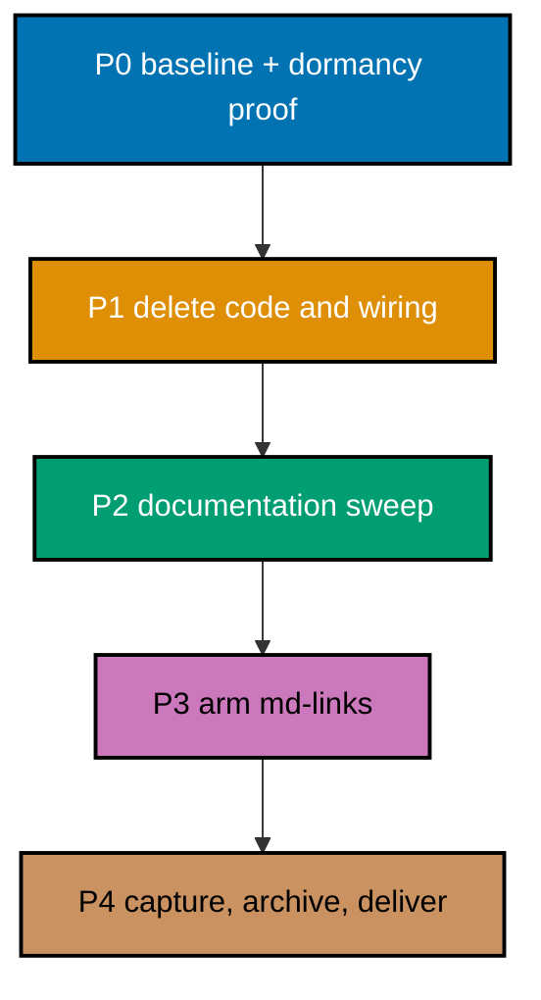

# Delivery Checklist — Repository Clean-Up

## Executor Legend

- `[AI]` performs all repository, test, evidence, PR, and merge work authorized by this plan.
- `[HUMAN]` performs no step in this plan; every decision it depended on is resolved in `tech-docs.md`.

## Worktree

Worktree path: `worktrees/repo-clean-up/`, branch `worktree/repo-clean-up`.

This plan declares that worktree. It is the sole worktree for this plan and is reused for every
delivery unit. If it is missing, provision it with `claude --worktree repo-clean-up` per the
[Worktree Specification convention](../../../repo-governance/conventions/structure/plans/worktree-specification.md),
then run `npm install` and `npm run doctor -- --fix`. Never provision a second worktree for this
plan under any other name.

## Delivery Mode: worktree-to-pr

Each delivery boundary uses a branch cut from current `origin/main` in this worktree, opens a PR
against `main`, completes the PR Review Maker→Fixer cycle, passes CI, and is merged by `[AI]` once
the merge preconditions hold.

## Quality, Commit, and CI Protocol

Every checklist item below writes `$RHINO` for the gate binary. Export it once per shell before
executing any phase — there is no `rhino-cli` on `PATH` in this repository, so the bare name would
fail with "command not found":

```bash
export RHINO="$PWD/apps/rhino-cli/target/gate/rhino-cli"
# build it first if absent:
cargo build --profile gate --manifest-path apps/rhino-cli/Cargo.toml
```

- [x] [AI] Before each delivery-boundary push, run `apps/rhino-cli/scripts/rhino-bin.sh gate run --surface=pre-push` and `npm exec nx affected -t build,test:quick,lint`, recording exact commands and results in `plans/in-progress/repo-clean-up/evidence/quality-<branch>.md` — acceptance: every affected gate passes and every pre-existing failure encountered is root-caused, not bypassed.
- [x] [AI] Before each commit, reconcile the append-only ledger `plans/in-progress/repo-clean-up/evidence/file-touch-ledger.md` against `git status --short` and stage only ledger-owned paths — acceptance: no sibling actor's file is staged, and `git add -A` is never used.
- [x] [AI] Commit thematically in Conventional Commit form, one concern per commit — for example `chore(repo): retire dormant CLIs`, `docs(governance): sweep retired CLI references`, `chore(gates): arm md-links on content trees` — never bundling a deletion, a doc sweep, and a gate change into one commit — acceptance: `git log --oneline origin/main..HEAD` shows each subject naming a single concern, and `git show --stat <sha>` for each shows only paths belonging to that concern.
- [ ] [AI] After each PR push, record the URL and run IDs in `plans/in-progress/repo-clean-up/evidence/ci-<branch>.md` and poll `gh run view <run-id> --json status,conclusion` every two minutes — acceptance: every applicable run reaches `success`; `gh run watch` is never used.

## Parallelization Model

Dependency DAG: `P0 -> P1 -> P2 -> P3 -> P4`. Every post-baseline phase is one delivery unit: the
deletions, the documentation that names them, and the gate whose exclusions they justified are a
single coherent change, and splitting them would leave `main` transiently self-inconsistent.



### Delivery Boundaries

| Phase(s) | Delivery unit           | Worktree                  | Branch                   | PR opens         |
| -------- | ----------------------- | ------------------------- | ------------------------ | ---------------- |
| 0        | — (setup and baseline)  | —                         | —                        | no               |
| 1-4      | Retirement and coverage | `worktrees/repo-clean-up` | `worktree/repo-clean-up` | yes — at Phase 4 |

There is exactly **one** delivery boundary, at Phase 4, and therefore exactly **one** branch and
**one** PR for this plan. Phase 0 opens no branch and no PR. Phases 1, 2, and 3 end at gates, not at
boundaries — a gate marks a coherent stopping point, not an integration point. No second worktree
and no second branch is created under any circumstance.

## Phase 0: Baseline and Dormancy Proof

_No PR, push, review, merge, or CI monitoring occurs in this phase._

- [x] [AI] Create `plans/in-progress/repo-clean-up/evidence/file-touch-ledger.md` and make its **first** entry the already-applied content-link fix — `apps/ayokoding-www/content/en/learn/courses/chart-of-accounts-and-data-modeling/overview.md`, line 10 retargeted from `../sql-essentials/overview.md` to `../sql-essentials/learning/overview.md` — then run `git status --short`, `git worktree list --porcelain`, and `npm run doctor -- --fix` — acceptance: the ledger exists, lists that path first, and lists only paths this plan owns; `git diff --name-only` also lists that path, so the staging protocol (which stages only ledger-owned paths) cannot silently drop it; and the toolchain converges before any deletion.
- [x] [AI] Capture the baseline in `evidence/phase-0-baseline.md`: `npm exec nx run ayokoding-www:test:quick`, `npm exec nx run ose-www:test:quick`, `npm exec nx run rust-commons:test:quick` — acceptance: each result is recorded pass or fail before changes, so no post-deletion failure can be misattributed.
- [x] [AI] Confirm `apps/beavernest-app-web/` holds only `LICENSE` and no `project.json` — acceptance: `git ls-files apps/beavernest-app-web` prints exactly one path; any second tracked file removes it from this plan's scope.
- [x] [AI] Prove dormancy in `evidence/phase-0-dormancy.md` by searching every execution surface — Nx target `command`/`commands` strings, `package.json` scripts, `.husky/**`, `.github/workflows/**`, and `repo-config.yml` gates — for `ayokoding-cli` and `ose-cli` — acceptance: the only Nx hit is `ose-www:links:check` (itself unreferenced by any `test:quick`), the only other hit is `ayokoding-www`'s `implicitDependencies`, and every other surface returns zero. A nonzero hit anywhere else halts the plan.
- [x] [AI] Re-verify in `evidence/phase-0-dormancy.md` that `libs/rust-commons` has no consumer outside the two CLIs, and that every `apps/rhino-cli/**` mention of a deleted path is a `#[cfg(test)]` tempdir fixture or a `//!` comment — acceptance: a consumer found outside the two CLIs, or any rhino-cli reference that reads the real path, halts the plan rather than opening a four-repo parity obligation.

### Phase 0 Gate

> All checks below must pass before starting Phase 1. If any check fails, fix it in Phase 0 before
> proceeding.

- [x] [AI] Confirm the baseline is green and dormancy is proven for both CLIs, for `libs/rust-commons`, and for `apps/beavernest-app-web` — acceptance: `evidence/phase-0-baseline.md` and `evidence/phase-0-dormancy.md` both exist and record a concrete result for every project named in this phase; any unproven item blocks Phase 1.

> **Pause Safety**: nothing is deleted or edited — only evidence files under
> `plans/in-progress/repo-clean-up/evidence/` are added, so the repository is exactly as it was.
> Safe to stop. To resume: `npm run doctor -- --fix`.

## Phase 1: Delete Code, Specs, and Wiring

- [x] [AI] Delete `apps/ayokoding-cli/`, `apps/ose-cli/`, and `libs/rust-commons/` entirely — acceptance: `git status --short` shows only deletions under those three roots, and `npm exec nx show projects` lists none of them.
- [x] [AI] Delete `apps/beavernest-app-web/` — acceptance: `git ls-files apps/beavernest-app-web` returns empty, `bash infra/dev/beavernest-app/tests/workflow-contract.sh` still passes, and `npm exec nx run-many -t test:quick -p beavernest-app,beavernest-be` is unaffected, confirming the directory carried nothing.
- [x] [AI] Delete `specs/apps/ayokoding/behavior/ayokoding-cli/`, `specs/apps/ose/behavior/ose-cli/`, and `specs/libs/rust-commons/` outright — no Gherkin scenario is salvaged — then update every parent README index that names them — acceptance: `$RHINO governance readme-index validate --fail-kinds orphan --fail-kinds ghost` exits 0 and `$RHINO specs counts validate --apps ayokoding,ose` exits 0 (the subcommand takes one positional folder or a comma-separated `--apps` list of app **names**, never two paths).
- [x] [AI] Remove the `links:check` target from `apps/ose-www/project.json` and the `implicitDependencies` entry from `apps/ayokoding-www/project.json` — acceptance: both `ayokoding-www:test:quick` and `ose-www:test:quick` pass, confirming neither depended on the removed wiring.
- [x] [AI] Remove the `ose-cli`, `ayokoding-cli`, and `rust-commons` registry entries from `repo-config.yml` — acceptance: `$RHINO repo-config validate` and `$RHINO gate validate` both exit 0.
- [x] [AI] Re-run `grep -rn 'ayokoding-cli\|ose-cli\|rust-commons\|beavernest-app-web' .github/` and delete or edit whatever it names — acceptance: the search returns zero matches after Phase 1, and if it returned nonzero **before** deletion the plan records which workflow was changed and why, rather than assuming none exists.
- [x] [AI] Remove the two CLI paths from `.dockerignore`, and update `libs/README.md` to drop the `rust-commons/` entry — acceptance: no ignore rule names a nonexistent path and `$RHINO governance readme-index validate` exits 0.
- [x] [AI] Confirm `apps/rhino-cli/**` is untouched — acceptance: `git diff --name-only origin/main -- apps/rhino-cli` is empty and `apps/rhino-cli/parity-manifest.sha256` needs no regeneration, so no cross-repo propagation obligation is opened.

### Phase 1 Gate

> All checks below must pass before starting Phase 2. If any check fails, fix it in Phase 1 before
> proceeding.

- [x] [AI] `npm exec nx run-many -t test:quick -p ayokoding-www,ose-www,beavernest-app,beavernest-be` — acceptance: all four pass, proving nothing depended on the deleted projects.
- [x] [AI] `$RHINO repo-config validate && ./apps/rhino-cli/target/gate/rhino-cli gate validate` — acceptance: both exit 0 with the three registry entries gone.
- [x] [AI] `git diff --name-only origin/main -- apps/rhino-cli` — acceptance: empty output.

> **Pause Safety**: code and specs for the four retired projects are gone and the build is green,
> but documentation still names them, so `md links validate` may report broken links into deleted
> paths. That is expected and is Phase 2's job. Safe to stop. To resume:
> `npm exec nx run-many -t test:quick -p ayokoding-www,ose-www`.

## Phase 2: Documentation Sweep

- [x] [AI] Delete `repo-governance/development/quality/code/14-ayokoding-www-link-validation.md`, renumber `15`–`18` to `14`–`17` with `git mv`, and update both index entries in `repo-governance/development/quality/code/README.md` and `repo-governance/development/quality/code.md` — acceptance: `grep -rn '14-ayokoding-www-link-validation\|links:check' repo-governance/ docs/` returns zero, the directory's numbers run contiguously `01`–`17`, and `$RHINO md links validate --exclude plans/done` plus `$RHINO governance readme-index validate --fail-kinds orphan --fail-kinds ghost` both exit 0.
- [x] [AI] Rewrite the renumbered `14-rust-cli-linting.md` around `rhino-cli` — acceptance: every command it shows is executed and succeeds, including replacing the stale `nx lint organiclever-be` example, which names an F# project.
- [x] [AI] Substitute `rhino-cli` for the retired CLIs in every convention doc that cites them as a worked example — the `bdd-spec-test-mapping`, `nx-targets`, `specs-directory-structure`, `hexagonal-architecture-cli`, `git-fixture-isolation`, and `three-level-testing-standard` families — acceptance: each substituted example names a path that exists on disk; the surrounding guidance is preserved, not deleted.
- [x] [AI] Update the descriptive inventories: `apps/README.md`, `docs/reference/monorepo-structure.md`, `docs/reference/project-dependency-graph.md`, `docs/reference/system-architecture/{applications,components,technology-stack}.md`, `docs/how-to/setup-development-environment.md`, `docs/explanation/software-engineering/licensing/dependency-compatibility.md`, `docs/explanation/software-engineering/programming-languages/README.md`, `docs/explanation/software-engineering/architecture/c4-architecture-model/nx-workspace-visualization.md`, `docs/explanation/lint-safety-parity-decisions.md`, and `docs/explanation/standardize-app-spec-trees-parity-decisions.md` — acceptance: no live reference remains, and `$RHINO governance word-budget validate` exits 0 with no new finding naming any of these files.
- [x] [AI] Retire `plans/ideas/q4-not-urgent-not-important/simplify-ayokoding-ose-cli.md` and its `plans/ideas/README.md` index entry, since this plan answers its open question — acceptance: `$RHINO governance readme-index validate` exits 0 and no orphan remains.
- [x] [AI] File a `plans/ideas/` two-pager for the ayokoding courses that have no course-root `overview.md`, with its `plans/ideas/README.md` index entry — acceptance: the two-pager names each such directory (23, re-counted during execution against the plan's original estimate of 22), states that none is currently linked as though it had one, and `$RHINO governance readme-index validate` exits 0.
- [x] [AI] Correct the two `.claude/skills/` reference files that state the CLIs as live fact — `docs-validating-links/reference/internal-link-validation.md:16` (which currently says the content trees are validated by the CLIs and **not** by link-validation rules, the exact inverse of the post-plan truth) and `docs-creating-by-example-tutorials/reference/checking-grouping-compliance-and-diagrams.md:49` — then run `npm run generate:bindings` to confirm no mirror drift (skill reference files are not mirrored, per `CLAUDE.md` and `apps/rhino-cli/src/application/agents/sync.rs:37-40`) — acceptance: `sed -n '16p' .claude/skills/docs-validating-links/reference/internal-link-validation.md` prints a line containing the phrase "validated repository-wide by rhino-cli md links validate", `grep -rn 'ayokoding-cli\|ose-cli' .claude/skills/` returns zero hits, `npm run validate:sync` exits 0, and `git status --short` shows zero files staged under `.opencode/`, `.cursor/`, or `.amazonq/`.
- [x] [AI] Sweep the individually-named surfaces the family globs do not catch, listed in `tech-docs.md` — `app-readme-vs-specs/07-*`, `specs-application-sync/06-*`, `worktree-setup/04-*`, `repo-dependency-bump-planning/04-phase-1-inventory.md`, `licensing/{02-standards,03-applying-and-validating}.md`, `file-naming/01-app-naming-types.md`, and `docs/explanation/software-engineering/programming-languages/typescript/README.md` — acceptance: each edit either removes the retired name or substitutes an example path that exists on disk.
- [x] [AI] Resolve `plans/ideas/q2-not-urgent-important/beavernest-first-deploy.md`, which proposes deploying the deleted `apps/beavernest-app-web` and cites a README that does not exist — rebase it onto `beavernest-app` or retire it with its `plans/ideas/README.md` index entry — acceptance: `grep -rc beavernest-app-web plans/ideas/ | grep -v ':0$'` returns nothing and `$RHINO governance readme-index validate` exits 0.
- [x] [AI] Run the whole-repository sweep that the Definition of Done actually depends on: `grep -rn 'ayokoding-cli\|ose-cli\|rust-commons\|beavernest-app-web' . --exclude-dir=node_modules --exclude-dir=.git --exclude-dir=target` — acceptance: every remaining hit lies in one of the roots enumerated below and the count of hits outside them is **zero**. A surface omitted from `tech-docs.md` still fails this step.

  The accepted roots, each with the reason it is exempt rather than stale:

  | Root                                                                                | Why a hit there is not a defect                                                                                                                                                   |
  | ----------------------------------------------------------------------------------- | --------------------------------------------------------------------------------------------------------------------------------------------------------------------------------- |
  | `plans/done/**`                                                                     | Archived plans are a historical record of what was true when they ran.                                                                                                            |
  | `apps/*/content/**`                                                                 | Published site content, including dated update posts that reported the CLIs shipping.                                                                                             |
  | `social-media-posts/**`                                                             | Published posts; already sent.                                                                                                                                                    |
  | `apps/rhino-cli/**`                                                                 | The four hits are `#[cfg(test)]` tempdir fixture strings and `//!` doc comments — inert, and editing them opens a four-repo parity obligation. Ruled out of scope in `README.md`. |
  | `plans/in-progress/repo-clean-up/**` and its entry in `plans/in-progress/README.md` | This plan documents the retirement; naming the retired projects is its subject matter.                                                                                            |
  | `plans/in-progress/repository-onboarding-readme-refresh/artifacts/**`               | A dated audit ledger belonging to another in-progress plan. Rewriting it would falsify that plan's evidence.                                                                      |
  | `infra/dev/beavernest-app/tests/workflow-contract.sh:9`                             | An `assert_no_match` guard that names `beavernest-app-web` in order to prove the workflow never references it. Deleting the token would weaken a passing test.                    |
  | `plans/ideas/q2-not-urgent-important/beavernest-first-deploy.md:13`                 | A dated retarget note recording that the idea was rebased off the retired shell.                                                                                                  |

- [x] [AI] Verify that `apps/*/content/**`, `social-media-posts/**`, and `plans/done/**` were not modified — acceptance: `git diff --name-only origin/main` shows no path under those roots except the single content link fix recorded in `tech-docs.md`.

### Phase 2 Gate

> All checks below must pass before starting Phase 3. If any check fails, fix it in Phase 2 before
> proceeding.

- [x] [AI] `$RHINO md links validate --exclude plans/done` — acceptance: exit 0, no link points into a deleted path. The `plans/done` exclusion is required: that tree carries 289 pre-existing broken links, which this plan does not touch and which the `md-links` gate itself excludes.
- [x] [AI] `$RHINO governance readme-index validate --fail-kinds orphan --fail-kinds ghost` and `$RHINO governance word-budget validate` — acceptance: both exit 0.
- [x] [AI] `npm run validate:sync` — acceptance: exit 0, harness mirrors regenerated and in sync with `.claude/`.

> **Pause Safety**: code, specs, and every documenting surface are consistent — no document names a
> deleted path and no command in the governance surface fails when run. The `md-links` gate still
> carries its two content exclusions, so content coverage is unchanged from `main`. Safe to stop.
> To resume: `$RHINO md links validate --exclude plans/done`.

## Phase 3: Arm the Coverage and Close

- [x] [AI] Remove the `apps/ayokoding-www/content` and `apps/ose-www/content` exclusions from the `md-links` gate in `repo-config.yml` — acceptance: `$RHINO md links validate --exclude plans/done` exits 0, confirming the single pre-existing broken link recorded in `tech-docs.md` is the only one and is already fixed.
- [x] [AI] Run the negative test: temporarily insert a link to a nonexistent file in one file under each content tree, confirm the gate exits 1 naming both, then revert — acceptance: `evidence/phase-3-negative-test.md` records both failing outputs and a clean `git status` afterwards, proving coverage is real rather than nominal.

### Phase 3 Gate

> All checks below must pass before Phase 4. If any check fails, fix it in Phase 3 before
> proceeding.

- [x] [AI] `$RHINO md links validate --exclude plans/done` — acceptance: exit 0 with the content exclusions removed from `repo-config.yml`.
- [x] [AI] `git status --short` after the negative test — acceptance: clean; no deliberately-broken link is left behind.

> **Pause Safety**: the `md-links` gate now covers both content trees and passes, and the negative
> test has proved it fails when a content link breaks. Nothing is merged yet. Safe to stop.
> To resume: `$RHINO md links validate --exclude plans/done`.

## Phase 4: Knowledge Capture, Archival, and Delivery

- [x] [AI] Triage every entry in `learnings.md` through the [Knowledge Capture Convention](../../../repo-governance/development/quality/knowledge-capture.md) routing matrix, running both safety gates (secret/sensitivity, repo-relevance) on each surviving entry, and scanning `plans/ideas/` for overlap before filing anything new — acceptance: every entry reaches exactly one terminal state (routed inline in this PR's commits, filed as a `plans/backlog/` follow-up, or discarded with a one-line reason), and no entry is left unrouted. Code routings and large non-code routings become backlog plans, never inline edits.
- [x] [AI] Archive the plan **inside this PR, before merge**: `git mv plans/in-progress/repo-clean-up plans/done/2026-08-18__repo-clean-up`, then update `plans/in-progress/README.md` and `plans/done/README.md` — acceptance: `$RHINO governance readme-index validate` and `$RHINO md links validate --exclude plans/done` both exit 0, and no plan index names a moved path. Archival must land in the delivering PR: `main` is branch-protected, so a post-merge archival would require a second PR, which this plan forbids.
- [x] [AI] Run the pre-push gate and affected build from the worktree — command: `apps/rhino-cli/scripts/rhino-bin.sh gate run --surface=pre-push && npm exec nx affected -t build,test:quick,lint` — acceptance: both exit 0; a pre-existing failure is root-caused and fixed, never bypassed with `--no-verify`.
- [x] [AI] Push the branch — command: `git push -u origin worktree/repo-clean-up` — acceptance: the push succeeds with the pre-push hook running (never `--no-verify`), and `git rev-parse HEAD` equals `git rev-parse origin/worktree/repo-clean-up`.
- [x] [AI] Open the single draft PR — command: `gh pr create --draft --base main --head worktree/repo-clean-up --title '<conventional-commit title>' --body-file <path>` — acceptance: `gh pr list --head worktree/repo-clean-up --json number` returns exactly **one** PR; if it returns more, stop, because this plan permits only one.
- [ ] [AI] Mark the PR ready and wait for CI — commands: `gh pr ready <n>` then poll `gh run list --branch worktree/repo-clean-up --json databaseId,status,conclusion` every two minutes — acceptance: every applicable run reaches `success`; never use `gh run watch`.
- [ ] [AI] Run the PR Review Maker→Fixer cycle per [pr-review-quality-gate](../../../repo-governance/workflows/pr/pr-review-quality-gate.md) — acceptance: `pr-review-synthesis-maker` posts one consolidated review per cycle, `pr-review-fixer` replies to and resolves every thread, and the cycle repeats until a cycle produces zero new threshold findings.
- [ ] [AI] Confirm no thread is left open — command: `gh api graphql -f query='{repository(owner:"wahidyankf",name:"ose-public"){pullRequest(number:<n>){reviewThreads(first:100){nodes{isResolved}}}}}'` — acceptance: every node reports `isResolved: true`; a PR reads `mergeStateStatus: BLOCKED` with all checks green when even one is left open.
- [ ] [AI] Merge — command: `gh pr merge <n> --squash --delete-branch=false` — acceptance: `gh pr view <n> --json state` reports `MERGED`, and the squash commit on `main` carries the `(#<n>)` suffix.
- [ ] [AI] Fast-forward local `main` after the merge and remove the worktree once the user authorizes — acceptance: `git -C <repo-root> rev-parse main` equals `origin/main`, so the base checkout does not silently diverge.

### Phase 4 Gate

> All checks below must pass before this plan is considered delivered.

- [ ] [AI] `gh pr view <n> --json state,mergeStateStatus,reviewDecision` — acceptance: `state` is `MERGED` and no review thread remains unresolved.
- [ ] [AI] `test -d plans/done/2026-08-18__repo-clean-up && test ! -d plans/in-progress/repo-clean-up` — acceptance: both true on `main`.

> **Pause Safety**: the work is merged, the plan is archived, and local `main` matches
> `origin/main`. Safe to stop. To resume: `git -C <repo-root> status`.
