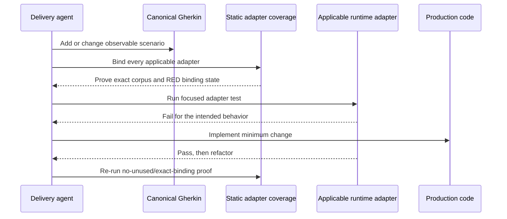

# Gherkin Coverage and Adapter Design

## Ownership Model

[Judgment call] A behavior owner is an application, executable tool, or library that owns one or
more canonical recursive roots. Dedicated E2E projects implement an owner's public-boundary adapter;
they never own a second copy of the specification. Inferred contract projects consume the owning
API corpus and do not duplicate it.

## Registry Schema and Migration Contract

The current `repo-config.yml` schema is `rhino-cli/repo-config/v1`. Its legacy behavior registry is
the existing `coverage.projects` list. A current row has exactly these three fields:

```yaml
coverage:
  projects:
    - name: organiclever-app-web
      levels: [unit]
      specs: "specs/apps/organiclever/app-web/behaviors/**"
```

`name` is an Nx project name, `levels` is a list containing only `unit`, `integration`, or `e2e`,
and `specs` is one repository-relative recursive corpus glob. Phase 4 must not rename, delete, or
rewrite this legacy block. It freezes the block as the comparison source while adding the following
exact sibling root:

```yaml
testing:
  schema: ose-test-contract/v1
  coverage:
    minimum-line: 99
  compatibility:
    mappings:
      - project: organiclever-app-web
        behavior-id: organiclever-app-web:default
        state: identity
        legacy:
          present: true
          corpus: "specs/apps/organiclever/app-web/behaviors/**"
          levels: [unit]
        canonical:
          owner: organiclever-app-web
          corpus: "specs/apps/organiclever/app-web/behaviors/**"
          runtimes:
            - level: unit
              project: organiclever-app-web
  projects:
    - project: organiclever-app-web
      profile: application
      migration-state: expanded
      behavior:
        id: organiclever-app-web:default
        lifecycle-state: active
        owner: organiclever-app-web
        corpus:
          - "specs/apps/organiclever/app-web/behaviors/**"
        adapters:
          unit:
            disposition: required
            project: organiclever-app-web
            driver: apps/organiclever-app-web/src/testing/bdd/unit-driver.ts
          integration:
            disposition: inapplicable
            reason: no isolated local-resource boundary
          e2e:
            disposition: delegated
            project: organiclever-app-web-e2e
            driver: apps/organiclever-app-web-e2e/src/bdd/e2e-driver.ts
```

The keys are not implementation choices. `RepoConfig.fs`, fixtures, help text, and both repository
files use them literally. Unknown keys fail closed. The field contract is:

| Path                             | Type            | Allowed value and purpose                                                                                                             |
| -------------------------------- | --------------- | ------------------------------------------------------------------------------------------------------------------------------------- |
| `testing.schema`                 | string          | Exactly `ose-test-contract/v1`; selects the strict parser.                                                                            |
| `testing.coverage.minimum-line`  | integer         | Exactly `99`; repository floor, never a project override.                                                                             |
| `testing.compatibility.mappings` | list            | Exactly one migration map per Nx project until contraction; removed together with the frozen legacy root.                             |
| `testing.projects`               | list            | Exactly one row per `rtk nx show projects --json` project.                                                                            |
| `.project`                       | string          | Exact, unique Nx project name.                                                                                                        |
| `.profile`                       | enum            | One of `application`, `library`, `tool`, or `e2e`.                                                                                    |
| `.migration-state`               | enum            | One of `expanded`, `migrating`, `verified`, or `contracted`.                                                                          |
| `.behavior.id`                   | string          | Stable path-independent identity `<owner-project>:<lowercase-kebab-partition>`; unique on owner rows and reused by delegates.         |
| `.behavior.lifecycle-state`      | enum            | `bootstrap` or `active` when `owner` is non-null; absent when `owner` is null.                                                        |
| `.behavior.owner`                | string or null  | Owning Nx project; self for an owner, another project for a delegated harness, null only when the project owns no behavior.           |
| `.behavior.corpus`               | list of strings | Recursive repository-relative globs on the owner row; empty only for a valid `bootstrap`, delegate, or behavior-free project.         |
| `.behavior.seed`                 | mapping         | Required only for `bootstrap`; exact `target` and repo-relative `driver` planned to seed the first corpus.                            |
| `.behavior.adapters`             | mapping         | Exactly the keys `unit`, `integration`, and `e2e`; no fourth adapter or omitted adapter.                                              |
| `.disposition`                   | enum            | One of `required`, `delegated`, or `inapplicable`.                                                                                    |
| `.project` under an adapter      | string          | Required for `required`/`delegated`; self for `required`, a different existing Nx project for `delegated`; absent for `inapplicable`. |
| `.driver`                        | string          | Required repository-relative file for `required`/`delegated`; absent for `inapplicable`.                                              |
| `.reason`                        | string          | Required non-blank explanation for `inapplicable`; absent for `required`/`delegated`.                                                 |

Compatibility-map fields are also closed and typed:

| Path                  | Type             | Allowed value and purpose                                                                                                |
| --------------------- | ---------------- | ------------------------------------------------------------------------------------------------------------------------ |
| `.project`            | string           | Exact unique Nx project; must equal one canonical project row.                                                           |
| `.behavior-id`        | string           | Exact `.behavior.id`, or null only when the canonical project has `behavior.owner: null`.                                |
| `.state`              | enum             | `identity`, `redirected`, or `verified`.                                                                                 |
| `.legacy.present`     | boolean          | `true` only when the frozen `coverage.projects` contains the project.                                                    |
| `.legacy.corpus`      | string or null   | Exact frozen `specs` value when present; null when absent. This half is immutable.                                       |
| `.legacy.levels`      | list of enums    | Exact frozen sorted set of `unit`, `integration`, and `e2e`; empty when absent. This half is immutable.                  |
| `.canonical.owner`    | string or null   | Exact current canonical behavior owner.                                                                                  |
| `.canonical.corpus`   | string or null   | Exact current owner corpus glob; null for a delegate, bootstrap row, or behavior-free row.                               |
| `.canonical.runtimes` | list of mappings | Sorted `{level, project}` pairs resolved from canonical required/delegated adapters; empty only when no behavior exists. |

The map exists for every Nx project, including projects omitted by legacy. An omitted project uses
`legacy.present: false`, `legacy.corpus: null`, and `legacy.levels: []`; that is an explicit absence,
not missing data. `identity` means the canonical path and runtime set still match legacy;
`redirected` means a canonical owner delivery intentionally changed a path, level, or runtime
project while preserving the behavior identity; `verified` means the owner delivery has proved the
new canonical location and adapters. Only `identity -> redirected -> verified` and
`identity -> verified` are valid. Reverse transitions, editing any `.legacy.*` value, mapping two
legacy rows to one behavior ID, or changing a behavior ID after expansion fail closed.

### Finite verification closure

Phase 0 freezes every repository's Nx project set into three disjoint files: owner projects,
delegate projects, and behavior-free projects. Their exhaustive union is
`phase-0/registry/registry-project-closure.tsv`, with exactly
`project<TAB>class<TAB>owner-id-or-dash<TAB>verification-binding`. Owner and delegate rows use the
owner's concrete `D-O-*` delivery; behavior-free rows use that repository's Rhino owner delivery as
registry steward. The closure project column must equal `rtk nx show projects --json` exactly and
its Git-object hash is frozen before prospective inputs are materialized.

An owner delivery is not terminal when only its owner row is verified. Its `OM-17` selects every
closure row assigned to that delivery, transitions every selected compatibility map to `verified`,
takes one repository-wide legacy snapshot with `--source legacy --output`, derives one full
canonical snapshot with `--source canonical --project-list-from <legacy.tsv> --output`, and proves
both project columns equal the frozen closure. It then extracts exactly one legacy and canonical TSV
row for each project assigned to that binding, compares those normalized rows, and hashes them into
the binding proof. Snapshot does not accept `--project`; filtering happens mechanically after the
two complete snapshots. This covers dedicated delegates and behavior-free steward rows explicitly.
Phase 20 concatenates the finite per-binding proof files, requires one-to-one equality with the
frozen closure, rechecks every extracted-row hash and the Nx count, then requires
`validate-mapping --all --require-state verified` before contraction. A missing, extra, duplicate,
or proofless project reopens its exact OM-17.

### Behavior lifecycle state

An owner row with `lifecycle-state: bootstrap` is a bounded seed contract, not a coverage
exemption. Its literal corpus must be empty and `behavior.seed.target` and `behavior.seed.driver`
must both be present. The target must be an exact Nx target on that project and the driver must be a
repo-relative path admitted by the delivery allocation. A bootstrap row cannot satisfy coverage,
BDD, or closure gates. The only transition is `bootstrap -> active`, performed atomically with the
first non-empty corpus, an existing driver, removal of `behavior.seed`, and an updated compatibility
mapping. An active owner must resolve at least one feature; an active delegate may have an empty
literal corpus only when its owner resolves a non-empty corpus. `active -> bootstrap` is forbidden.

`fsharp-env-loader` is the only planned bootstrap row. Phase 4 creates it with
`behavior.id: fsharp-env-loader:default`, empty corpus, `seed.target: test:behavior:seed`, and
`seed.driver: libs/fsharp-env-loader/tests/unit/Behavior/FsharpEnvLoaderBehaviorDriver.fs`. Its
compatibility row records `legacy.present: false`. Phase 8B must create
`specs/libs/fsharp-env-loader/behaviors/environment-loading.feature`, add that exact driver and the
`test:behavior:seed` target in `libs/fsharp-env-loader/project.json`, then atomically set the row to
`active`, set the canonical mapping corpus/runtime values, and remove `seed`. No dependent coverage,
BDD, specs, or closure gate may run before this activation is green.

The exact Phase-4 seed fragment is:

```yaml
- project: fsharp-env-loader
  profile: library
  migration-state: expanded
  behavior:
    id: fsharp-env-loader:default
    lifecycle-state: bootstrap
    owner: fsharp-env-loader
    corpus: []
    seed:
      target: test:behavior:seed
      driver: libs/fsharp-env-loader/tests/unit/Behavior/FsharpEnvLoaderBehaviorDriver.fs
```

This is the exact lifecycle fragment, not a complete project row: Phase 4 appends the required
three-key `adapters` mapping from the frozen Phase-1 applicability/consumer evidence. That bounded
evidence choice does not change the seed target, driver, behavior ID, or lifecycle transition.

For `behavior.owner: null`, `id` and `lifecycle-state` are absent, `corpus` is empty, and all three
adapters are `inapplicable`. A delegated project declares the owner and behavior ID with an empty
literal corpus; its required adapter must be the reciprocal target of exactly one owner-row
`delegated` adapter. This reference shares the owner's resolved corpus without creating a second
specification copy. Absolute paths, `..`, invalid empty globs, duplicate projects, unknown Nx
projects, missing reciprocal delegation, invalid lifecycle/seed combinations, and invalid
conditional fields fail.

### Allowed migration transitions

Every project starts with no canonical row and one legacy row. The only forward path is:

| From        | To           | Entry condition                                                                                                            | Compatibility after transition                                  |
| ----------- | ------------ | -------------------------------------------------------------------------------------------------------------------------- | --------------------------------------------------------------- |
| legacy only | `expanded`   | Phase 4 adds one canonical row and one compatibility map while the frozen legacy row still exists.                         | Dual reader required; canonical writer only.                    |
| `expanded`  | `migrating`  | Phase 4 validates immutable legacy fields and normalized behavior/owner/runtime identities.                                | Dual reader required; legacy is comparison-only.                |
| `migrating` | `verified`   | Phase 4 proves normalized equality, Nx/mapping bijection, reciprocal delegation, lifecycle schema, and read-only behavior. | Dual reader required; identity or compatibility mismatch fails. |
| `verified`  | `contracted` | Every owner map is `verified`; Phase 20 removes both compatibility mappings and `coverage.projects` in the same delivery.  | Canonical reader only; both compatibility inputs forbidden.     |

Skipping, reversing, or mixing `contracted` with a surviving legacy block is invalid. Phase 4 may
contain adjacent nonterminal states only while its bounded TDD edits are still uncommitted; its
delivery cannot enter review until every row is `verified`. Owner deliveries consume the verified
canonical rows and never change migration state or remove `coverage.projects`. Phase 20 may set
`contracted` only after every owner lifecycle and repository gate is terminal.

### Compatibility reader and writer boundary

`RepoConfig.fs` is the only compatibility reader. While any row is nonterminal, it parses the frozen
legacy root, the canonical rows, and the typed mapping. It converts both sides to the same stable
behavior projection and compares normalized project, owner, behavior, and runtime identities; it
does not compare raw legacy and canonical paths. Raw paths are instead validated against the
immutable legacy half and current canonical half of each map. `coverage.projects` and every
`.legacy.*` mapping field are frozen: repository authors and tools update only canonical project
rows, `.canonical.*`, and mapping state. Rhino never rewrites `repo-config.yml`; fixture overlays are
memory-only. The migration commands may write only the explicitly supplied ignored `local-tmp/`
output. At `contracted`, the reader rejects both `coverage.projects` and
`testing.compatibility`, then disables the compatibility parser branch.

The exact read-only CLI is:

```bash
rtk apps/rhino-cli/scripts/rhino-bin.sh test-contract registry snapshot \
  --source legacy --output local-tmp/adopt-beavernest-test-automation/registry/legacy.tsv
rtk apps/rhino-cli/scripts/rhino-bin.sh test-contract registry snapshot \
  --source canonical \
  --project-list-from local-tmp/adopt-beavernest-test-automation/registry/legacy.tsv \
  --output local-tmp/adopt-beavernest-test-automation/registry/canonical.tsv
rtk apps/rhino-cli/scripts/rhino-bin.sh test-contract registry compare \
  --legacy local-tmp/adopt-beavernest-test-automation/registry/legacy.tsv \
  --canonical local-tmp/adopt-beavernest-test-automation/registry/canonical.tsv
rtk apps/rhino-cli/scripts/rhino-bin.sh test-contract registry validate \
  --require-state expanded
rtk apps/rhino-cli/scripts/rhino-bin.sh test-contract registry validate \
  --fixture apps/rhino-cli/tests/fixtures/test-contract/owners/O-PUB-FS-ENV/bootstrap-empty.json
rtk apps/rhino-cli/scripts/rhino-bin.sh test-contract registry validate-mapping \
  --all
```

These are the complete snapshot option shapes. Phase 4 parser tests and `HelpText.fs` must expose
both forms and must reject a snapshot `--project` option with CLI misuse exit 2. Project-scoped
commands such as `validate-mapping --project <name>` retain their separately documented grammar.

Each snapshot is sorted UTF-8 TSV with exactly
`project<TAB>canonical-owner<TAB>behavior-id<TAB>runtime-identities`. `runtime-identities` is a
sorted comma-separated list of `<level>@<runtime-project>` values. The legacy source resolves these
stable values through `testing.compatibility.mappings`; the canonical source derives them from the
current project/adapter rows. Paths are deliberately absent from this comparison so a controlled
move does not masquerade as behavior loss. Legacy-absent projects still produce
`project<TAB>-<TAB>-<TAB>-`; the canonical preservation snapshot uses
`--project-list-from <legacy.tsv>` and reproduces that sentinel. `validate` separately proves that
every mapping's frozen path matches legacy, its current path/runtime values match canonical, every
active owner resolves a non-empty corpus, and every project appears exactly once. `compare` requires
byte equality of the normalized identities and
prints `registry-preservation: equal rows=<integer>` on success. On failure it prints the first
missing, extra, or changed row before exiting 1.
`validate` checks the full typed schema, Nx-project bijection, migration and lifecycle transitions,
reciprocal delegation, paths, and conditional fields, then prints
`registry-valid state=<state> projects=<integer> behavior=<bootstrap:N,active:N>
legacy=<present|absent> compatibility=<present|absent>`. `validate-mapping` checks immutable legacy
values, current canonical values, stable IDs, allowed mapping transitions, and mapping/project
bijection, then prints `registry-mapping-valid state=<state|mixed> mappings=<integer>`. Exit 0 means
valid, exit 1 means contract failure, and exit 2 means CLI/input misuse. None of these commands may
change a tracked byte.

### Expand, migrate, verify, contract, and rollback

1. **Expand (Phase 4):** save the frozen legacy TSV and SHA-256 of `repo-config.yml`; add every
   canonical row at `expanded` and exactly one compatibility map per Nx project without editing
   `coverage.projects`; include the explicit `fsharp-env-loader` bootstrap row; implement the dual
   reader; require normalized `compare`, `validate --require-state expanded`, and exact Nx counts.
2. **Migrate (Phase 4):** enable the dual reader, change rows to `migrating`, and prove every frozen
   legacy value or explicit absence resolves through its map to one stable canonical identity.
3. **Verify (Phase 4):** require normalized equality, mapping/Nx bijection, lifecycle validity,
   reciprocal delegation, and read-only commands; then change migration rows to `verified`. Owner
   deliveries may update canonical paths/runtimes only by atomically updating the canonical half of
   the same map and moving `identity -> redirected -> verified` (or `identity -> verified`).
4. **Contract (Phase 20):** require every migration row and compatibility map `verified`, every
   behavior owner `active`, and normalized equality; remove both `coverage.projects` and
   `testing.compatibility` while changing every row to `contracted` in one edit; run
   `validate --require-state contracted --require-behavior-state active --forbid-legacy --forbid-compatibility`
   and all repository gates.

No-loss proof consists of equal normalized legacy/canonical projections before contraction, the
legacy and mapping digests, a `validate` result whose canonical project and mapping counts equal
`rtk nx show projects --json`, every owner map and behavior lifecycle at its required terminal
state, and the equal terminal canonical projection after compatibility removal. Stop and roll back
on any normalized identity difference, frozen legacy mutation, mapping/canonical path mismatch,
missing/extra Nx project, invalid migration/mapping/lifecycle transition, tracked-byte mutation by
a read command, owner gate failure, or parity drift. Before commit, restore
`repo-config.yml` from the exact ignored Phase-4/Phase-20 `repo-config.before.yml` snapshot and
revert only the admitted parser/test edits. After a commit or merge, use the delivery lifecycle's
recorded commit/merge SHA to create a normal `rtk git revert <sha>` rollback commit/PR; never edit
history or partially retain a new reader with an old schema. Rerun the legacy validation and the
previous green Nx gate, then record the rollback SHA and reason.

## Recursive Discovery

1. Resolve every configured glob from the repository root.
2. Reject an empty resolved corpus for an `active` behavior owner. Accept an empty literal corpus
   only for a schema-valid `bootstrap` owner with both seed fields or for an active delegate whose
   owner resolves a non-empty corpus.
3. Parse every feature, rule, background, scenario, and scenario-outline example.
4. Assign each feature path to exactly one owner; reject unowned and multiply-owned paths.
5. Attach the owner's complete normalized corpus to every required or delegated adapter.
6. Include the corpus glob, registry, driver, bindings, and validator code in Nx named inputs so
   cache invalidation follows behavior changes.

[Judgment call] Discovery is path-recursive and registry-bounded. A list of individual feature
files is invalid because it lets new files escape coverage silently.

## Static Adapter Contract

For each applicable adapter, `test:behavior:coverage:<adapter>` must prove:

- non-empty normalized owner corpus;
- every feature and expanded scenario is enumerated;
- an explicit `When` and `Then` exists per repository Gherkin rules;
- the adapter driver implements its required language-neutral operations;
- every canonical step resolves to exactly one binding in that adapter;
- no adapter binding is unused after normalization;
- no placeholder, pending, undefined, or ambiguous binding remains; and
- exact covered counts equal total counts for files, expanded examples, scenarios, steps, and
  applicable owner-adapter pairs.

Failure output identifies `project`, `owner`, `adapter`, feature path, scenario/example, step text,
binding candidates, and remediation category. A summary-only failure is insufficient for a junior
engineer to act on.

## Applicability Without Coverage Exemptions

[Judgment call] A required or delegated adapter covers exactly 100% of its declared corpus. No
feature, example, scenario, or step exemption exists after applicability is established.

A whole layer may be `inapplicable` only when the project profile proves that runtime boundary does
not exist. A multi-surface corpus may be partitioned before coverage calculation only when each
partition has an unambiguous path/root, behavior owner, and adapter applicability. Empty,
overlapping, unowned, or catch-all-excluded partitions fail. Runner difficulty is never evidence of
inapplicability.

## Runtime Contract

- Unit adapter runtime uses doubles and no local resource/process/network boundary.
- Integration runtime uses isolated local resources; no public network or production server.
- E2E runtime uses the shipped public interface: browser, HTTP API, or compiled executable process.
- A dedicated E2E harness receives its owner's exact corpus through Nx inputs and registry
  delegation.
- Static adapter coverage cannot satisfy runtime execution; full/scheduled gates require both.

## Gherkin Change Sequence



## Coverage Reconciliation Report

Rhino emits a deterministic machine-readable report and a human table with one row per normalized
scenario/adaptor pair:

| Owner | Feature | Scenario/example | Adapter | Binding state | Runtime target | Disposition |
| ----- | ------- | ---------------- | ------- | ------------- | -------------- | ----------- |

The final gate asserts:

```text
normalized scenario-adapter pairs
= bound applicable pairs

unowned features = 0
duplicate owners = 0
undefined bindings = 0
ambiguous/multiple bindings = 0
unused bindings = 0
uncovered applicable pairs = 0
covered files/examples/scenarios/steps = total files/examples/scenarios/steps
```

The machine report includes both numerator and denominator. The validator tests integer equality;
it does not accept a rounded `100.0%` display when one item is absent.

## Negative Proof Fixtures

The Rhino behavior corpus and unit tests include fixtures for:

- a newly added feature omitted by an adapter;
- one scenario-outline example omitted;
- undefined, ambiguous, duplicate, and unused bindings;
- incomplete driver operation contract;
- duplicate and missing owner roots;
- a dedicated E2E project declaring independent ownership;
- an ungoverned echo target;
- a feature/scenario/step exemption attempted on an applicable adapter;
- one missing item in a large corpus whose rounded display would otherwise appear as 100%;
- a corpus or binding edit that must invalidate the Nx cache.
- a numeric coverage declaration of 98%, a conflicting runner threshold, a coverage echo, and an
  exclusion without alternate proof.
- an executable test outside the three layer roots and one discovered by two layer targets; and
- an unclassified project-local manifest plus an npm script that only forwards to its Nx target.

These fixtures provide the required RED evidence before validator implementation.
