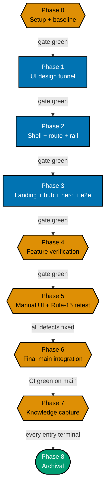

# Delivery Checklist — Path-Aware Navigation UI

> **Programme decisions** — the `R*` rules and `A*` amendments cited below are defined in
> [tech-docs.md §Programme decisions](./tech-docs.md#programme-decisions).

This checklist delivers the **rendering layer** of the `course-paths` feature in `ayokoding-www`: the
shell modules, the `?path=` route wiring, the Screen 3 left path rail, the landing hero's four goal
cards, the paths hub, the path landing, and the accessibility contract for all of them — proven
end-to-end against a **fixture manifest**, because the four real manifests ship downstream in
`ayokoding-learning-path-05-manifests`.

**Hard prerequisite**: `ayokoding-learning-path-01-url-restructure` **and**
`ayokoding-learning-path-02-schema-and-prerequisite-dag` must both be merged to `main` before Phase 1
starts. See [README §Depends-on](./README.md#depends-on) for the checkable start preconditions.

> **Legend** — `[AI]`: an agent performs the step (the default; unmarked steps are `[AI]`).
> `[HUMAN]`: only a human can do it (physical action, out-of-band approval, real-secret or
> privileged-credential handling). `[AI+HUMAN]`: agent prepares, human approves or finishes.
> Git-mechanical steps (worktree create/remove, branch, push, merge) are `[AI]`.
>
> **Phase Gate** — every phase ends with a `### Phase N Gate` (must-pass verification) plus a
> `> **Pause Safety**:` note (safe-to-stop state + resume command). Every gate covers the phase's
> **code correctness** (tests, checkers, build); only the gate of a phase that is a **delivery
> boundary** (see [Delivery Boundaries](#delivery-boundaries) below) additionally covers
> **integration** (draft PR opened, 3-cycle PR-Review, CI green, `[AI]` merge, `ayokoding-www`
> deployed) — intermediate phases commit to their delivery unit's branch and stay unopened for review
> until that boundary. A phase is not complete until every gate check is green.

## Worktree

Worktree path: `worktrees/ayokoding-learning-path-03-navigation-ui/`

Optional manual pre-provisioning (run from repo root):

```bash
claude --worktree ayokoding-learning-path-03-navigation-ui
```

The plan-execution Step 0 gate enters this worktree by default: it auto-provisions from the latest
`origin/main` when missing, syncs with `origin/main` before implementing, and prompts before deleting
the worktree after the plan is archived and pushed.

Each delivery unit branches from the **latest `origin/main`** inside this one worktree
(`git fetch origin && git checkout main && git pull && git checkout -b
ayokoding-learning-path-03-navigation-ui/<phase-slug>`), authors every phase in that unit on the same
branch, commits per phase, pushes that branch, and opens **its own draft PR at the unit's delivery
boundary** — see [Delivery Boundaries](#delivery-boundaries) below for which phases share a unit.
**Phase 0 is excluded**: it is setup and baseline, pushes no branch and opens no PR, and its evidence
artifacts ride the Phase 1 PR.

See [Worktree Path Convention](../../../repo-governance/conventions/structure/worktree-path.md) and
[Plans Organization Convention §Worktree Specification](../../../repo-governance/conventions/structure/plans.md#worktree-specification).

## Delivery Mode: worktree-to-pr

Each **delivery unit** — the contiguous phase ranges named in
[Delivery Boundaries](#delivery-boundaries) below; Phase 0 opens none — works in this worktree on its
**own branch**, opens a **draft PR** against `main` at the unit's boundary phase, runs the
**PR-Review Maker→Fixer Cycle** (fan-out → `pr-review-synthesis-maker` → `pr-review-fixer`, 3 sequential CI-gated cycles),
flips the PR to ready, and `[AI]` **merges it automatically once all quality gates are green** — then
`[AI]` **deploys `ayokoding-www` to `prod-ayokoding-www` after every merge** (this plan ships to
ayokoding.com). See
[Plans Organization Convention §Delivery Mode](../../../repo-governance/conventions/structure/plans.md#delivery-mode)
and the [PR Review Quality Gate workflow](../../../repo-governance/workflows/pr/pr-review-quality-gate.md).

> **DN-11 DECIDED — `[AI]` auto-merge (now the repo default)**: the repo's
> [PR Merge Protocol](../../../repo-governance/development/workflow/pr-merge-protocol.md) has `[AI]`
> merge the PR **by default** once its five hardened preconditions hold; a `[HUMAN]` merge gate is an
> explicit per-plan opt-in, and this plan does not opt in. When DN-11 was first recorded the protocol
> still defaulted to a `[HUMAN]` merge, so the maintainer authorized `[AI]` merge for this plan
> specifically (2026-07-18, in-session — modeled on the sibling plan
> `fundamentally-strong-software-engineer`'s own separately-recorded authorization) via two directives:
> (a) this plan uses the SAME delivery methods as the sibling plan, and (b) no maintainer permission is
> needed to merge a PR once it has passed 3 review cycles and the PR quality gate. The protocol has
> since been changed to match, so **DN-11 = AI-auto-merge** now simply confirms the repo default rather
> than deviating from it. The preconditions are unchanged either way — only the actor differs.

**Delivery-Boundary Integration Protocol** (fires once per **delivery boundary** named in
[Delivery Boundaries](#delivery-boundaries) below — the boundary phase's gate lists these as
must-pass — not once per phase; a delivery unit's intermediate phases commit to that unit's branch
and pass their own `### Phase N Gate`, but do not run this protocol). **Phase 0 is excluded**: it is
Environment Setup and Baseline, opens no PR, pushes no branch, runs no review cycle, and merges
nothing; its evidence artifacts ride the Phase 1 PR
([§Phase 0 Opens No PR](../../../repo-governance/conventions/structure/plans.md#phase-0-opens-no-pr--the-earliest-pr-is-phase-1-hard-rule)).

1. [AI] Sync the worktree to latest `origin/main` and branch:
   `git fetch origin && git checkout main && git pull && git checkout -b
ayokoding-learning-path-03-navigation-ui/<phase-slug>`.
2. [AI] Stage only this phase's paths (`git add <explicit paths>` — never `git add -A`), commit
   thematically (Conventional Commits, imperative, no period), push the branch, open a **draft PR**
   against `main` (`gh pr create --draft --base main ...`) — CI runs on the PR.
3. [AI] Run the **PR-Review Maker→Fixer Cycle** (3 sequential CI-gated cycles), resolve every finding,
   then `gh pr ready`.
4. [AI] **Merge** once all quality gates are green (typecheck, lint, `test:quick`, `test:unit`,
   `test:e2e` where affected, `specs:behavior:coverage`, CI, the 3-cycle review) — `[AI]` auto-merge
   per DN-11.
5. [AI] Dispatch `apps-ayokoding-www-deployer` to deploy `ayokoding-www` to `prod-ayokoding-www` — a
   no-op redeploy for plan-side-only phases.

## Parallelization Model

**Cap**: honor the in-force subagent/PR-review concurrency cap (parallel-by-default, background
subagents capped per the orchestration convention). The main thread self-promotes nothing.

Every phase in this plan is **serial** — each builds directly on the prior feature slice
(funnel → shell + route → landing/hub/hero + e2e → verification → retest → integration → capture →
archival). There is no independent fan-out inside this plan; the parallelism in the wider effort is
**across** the five split plans, and this plan is the Wave-2 node that unblocks
`ayokoding-learning-path-05-manifests`.



**Accessibility note.** Phase kind is carried by node **shape** (hexagon = setup/verify, rectangle =
feature code, stadium = terminal) and by each node's own label; every edge carries a text condition, so
nothing depends on distinguishing the fills.

### Delivery Boundaries

| Phase(s) | Delivery unit                                                                                                                                                                                                              | Worktree / branch                                                                 | PR opens         |
| -------- | -------------------------------------------------------------------------------------------------------------------------------------------------------------------------------------------------------------------------- | --------------------------------------------------------------------------------- | ---------------- |
| 0        | — (setup and baseline)                                                                                                                                                                                                     | —                                                                                 | no               |
| 1        | UI design funnel (Screens 0, 1, 1a, 1b, 2, 3) — plan artefacts only, no app code                                                                                                                                           | `worktrees/ayokoding-learning-path-03-navigation-ui/`, branch `.../design-funnel` | yes — at Phase 1 |
| 2-5      | Path-aware navigation feature: shell + route wiring + rail (2); path landing + paths hub + landing hero + e2e (3); feature verification + R9 UI Quality Gate (4); manual UI verification + rule-15 three-tester retest (5) | same worktree, branch `.../feature`                                               | yes — at Phase 5 |
| 6        | — (post-merge `origin/main` integration confirmation; produces no diff)                                                                                                                                                    | same worktree, checked out on `main` (no phase branch of its own)                 | no               |
| 7-8      | Knowledge capture (7) + plan archival (8)                                                                                                                                                                                  | same worktree, branch `.../archival`                                              | yes — at Phase 8 |

Every change-producing phase appears in exactly one row. Phase 1 stands alone: it is a design record —
complete, green, and reviewable with no app code in existence yet — so it independently satisfies all
four boundary criteria and grouping it with the code phases would only conflate a design review with a
code review. Phases 2-4 each fail the boundary test on their own — Phase 2 wires manifest loading,
routing, and the path rail into the site with no reachable entry point (the landing pages, hub, and
hero that make it discoverable are Phase 3's job, so it is a helper the next phase consumes); Phase 3
ships that discoverable UI but is not yet "green standalone" against this plan's own definition of
done, since the accessibility contract and the R9 UI Quality Gate that certify the whole feature run
only in Phase 4; Phase 4 verifies and hardens the feature Phase 3 already built rather than shipping a
new unit of meaning, and its UI Quality Gate is explicitly scoped across both Phases 2 and 3's code —
so the three only become one coherent, green, reviewable increment together, at Phase 5, once the
feature is built, quality-gated, and verified live and defect-clean. Phase 6 produces no diff at all
(confirmation only) and so cannot be a "shippable increment" by definition. Phase 7 is bookkeeping in
service of Phase 8's archival move, not a capability of its own, and per the archival-in-PR convention
its `learnings.md` edits ride the same final PR as Phase 8's `git mv`.

**Path constants** (referenced throughout):

- `<FEAT>` = `apps/ayokoding-www/src/features/course-paths/`
- `<NAV>` = `apps/ayokoding-www/src/features/navigation/shell/`
- `<APPSHELL>` = `apps/ayokoding-www/src/features/app-shell/shell/`
- `<ROUTE>` = `apps/ayokoding-www/src/app/[locale]/(content)/[...slug]/page.tsx`
- `<SPECS>` = `specs/apps/ayokoding/behavior/ayokoding-www/gherkin/course-paths/`
- `<E2E>` = `apps/ayokoding-www-fe-e2e/`
- `<PLAN>` = `plans/in-progress/ayokoding-learning-path-03-navigation-ui/` (this plan's folder — while
  the plan still sits in `plans/backlog/`, substitute that prefix instead; every `<PLAN>`-scoped
  acceptance command is run **from the repo root** so the path is unambiguous)
- Path ids (fixture and real — **renamed 2026-07-21 by the category-split ruling**: every careers path
  id gains the `careers/` prefix, and the fourth path's terminal segment is renamed
  `software-engineer-to-ai-engineer` → `ai-engineer` per R3):
  `careers/interview-ready/software-engineer`, `careers/immediately-effective/software-engineer`,
  `careers/fundamentally-strong/software-engineer`, `careers/immediately-effective/ai-engineer`,
  and — new, 2-segment, R2, **four** ids as of amendment A10 (up from two) — the skills path ids:
  `skills/conventional-erp`, `skills/sharia-erp`, `skills/conventional-accounting`,
  `skills/sharia-accounting`

## Markdown validation commands

These three commands are the **only** sanctioned markdown-validation forms in this plan. Every gate that
says "run the markdown validation" means exactly these; do not substitute a shorter form.

> **CLI facts, verified against the binary.** `md links validate` accepts **no positional path** —
> passing one fails with `error: unexpected argument '<path>' found` — and it cannot be scoped by
> `cd`-ing into a folder; it always walks the repo. `md heading-hierarchy validate` **does** accept
> positional paths. The bare repo-wide `md links validate` is **unsatisfiable** on this tree — it
> reports a large, drifting population of pre-existing broken links unrelated to this work, the great
> majority of them under `plans/done/` — which is why the exclusion form below is the one that gates a
> push. **No exact count is quoted here, and none should be added.** The figure moves every time a plan
> is archived or edited, and consecutive repo-wide runs have been observed disagreeing with each other
> on an unchanged tree, so any hardcoded number is both stale and non-reproducible. This note has now
> been wrong twice in that exact way: one revision asserted "93 pre-existing broken links, all under
> `plans/done/`", and its replacement swapped in two freshly measured figures that went false within a
> day. Do not repeat either mistake — re-measure at execution time instead.
>
> **`plans/done/` is not guaranteed to be the only source of residual breakage.** A sibling plan under
> active authoring can introduce a break that none of the three excludes covers, so a clean run today
> is not a promise of a clean run at execution time. Disposition rule for the executor: **do not add a
> fourth `--exclude` to make a gate pass.** If a residual break is inside this plan's folder, fix it; if
> it is outside, fix it at root cause per Root Cause Orientation, or — where it belongs to another
> plan's in-flight edits — re-run after that plan lands and record the deferral. The acceptance value
> stays `All links valid! No broken links found.` precisely so a non-zero residue must be explained
> rather than excluded away.

1. **Link validation (this repo's pre-push form)**:

   ```bash
   cargo run --release --manifest-path apps/rhino-cli/Cargo.toml -- md links validate \
     --exclude plans/done \
     --exclude apps/ayokoding-www/content \
     --exclude apps/ose-www/content
   ```

   — acceptance: prints `All links valid! No broken links found.`

2. **Cross-plan link filter (catches a stale link into a sibling plan's archived location)**:

   ```bash
   cargo run --release --manifest-path apps/rhino-cli/Cargo.toml -- md links validate \
     --exclude plans/done \
     --exclude apps/ayokoding-www/content \
     --exclude apps/ose-www/content 2>&1 | grep -F "ayokoding-learning-path-03-navigation-ui"
   ```

   — acceptance: the `grep` finds **no** matching line (exit 1). Falsifiable the other way too:
   introduce one bad cross-plan link in this folder and the same command prints that file and exits 0.
   **Both checks are required — neither alone is sufficient**, because check 1 excludes `plans/done`
   and therefore cannot see a link pointing into a sibling plan's newly archived location.

3. **Heading hierarchy + markdownlint (scoped to this plan's folder)**:

   ```bash
   cargo run --release --manifest-path apps/rhino-cli/Cargo.toml -- md heading-hierarchy validate <PLAN>
   npx markdownlint-cli2 "<PLAN>*.md"
   ```

   — acceptance: both exit 0.

**Provenance of the phase numbering.** This plan's Phases 0/1/2/3/4/5/6/7/8 correspond to the closed
source plan's Phases 0/1/3/4/13/14/15/16/17. The source's Phase 2 (pure core) belongs to
`ayokoding-learning-path-02-schema-and-prerequisite-dag`, and its Phases 5-12 belong to the
url-restructure, manifests, and course-authoring plans. Keep this mapping in mind when tracing a step
back to the source plan; do not renumber to "close the gaps".

---

## Phase 0: Environment Setup & Baseline

> _Executor: repo-setup-manager_
>
> **Cross-plan precondition (hard).** This plan is Wave 2. Both upstream plans must be merged before
> Phase 1 begins; Phase 0 itself is safe to run at any time, and its last two checks are the gate that
> proves the upstreams landed.

- [x] [AI] Enter/provision the worktree and install dependencies in the root worktree: `npm install`
      — acceptance: exits 0, `node_modules/` synchronized.

  **Date**: 2026-07-25. **Status**: Done. **Files Changed**: none (dependency install only).
  `npm install` ran clean; `node_modules/` present and synchronized in the worktree.

- [x] [AI] Converge the toolchain in the root worktree: `npm run doctor -- --fix`
      — acceptance: exits 0 with no unresolved drift.

  **Date**: 2026-07-25. **Status**: Done. **Files Changed**: none (toolchain only; 4 rust
  crate target-share symlinks created in `apps/ayokoding-cli`, `apps/ose-cli`, `apps/rhino-cli`,
  `libs/rust-commons`, gitignored). 16/16 tools OK, 0 warnings, 0 missing.

- [x] [AI] Establish baselines: `npx nx run ayokoding-www:build` and
      `npx nx run ayokoding-www:test:unit` and `npx nx run ayokoding-www-fe-e2e:test:e2e`
      — acceptance: all exit 0; record the pass/fail counts in `evidence/phase-0-snapshot.txt`. Any
      preexisting failure is resolved before Phase 1 (Root Cause Orientation), not deferred.

  **Date**: 2026-07-25. **Status**: Done. **Files Changed**:
  `evidence/phase-0-snapshot.txt` (new). All three baselines green: build exit 0; test:unit
  95 files/2783 passed/6 skipped; e2e 578 passed/181 skipped. Zero preexisting failures found.

- [x] [AI] **Extension-point snapshot** — record the current behaviour and public shape of the four
      files this plan extends into `evidence/phase-0-snapshot.txt`:
      `apps/ayokoding-www/src/features/content/core/content-url.ts`, `<NAV>prev-next.tsx`,
      `<NAV>breadcrumb.tsx`, and `apps/ayokoding-www/src/features/content/core/tree-builder.ts`
      (specifically `computePrevNext`'s weight-based grouping, which the manifest ordering supersedes
      only inside path context) — acceptance: snapshot committed; each file's exported signature quoted
      verbatim so a later diff shows exactly what this plan changed.

  **Date**: 2026-07-25. **Status**: Done. **Files Changed**: `evidence/phase-0-snapshot.txt`
  (extended). Recorded exported signatures for `content-url.ts` (`contentUrl(locale, slug,
pathId?)`, pathId already landed by url-restructure, additive-only), `prev-next.tsx`
  (`PrevNextProps`/`PrevNext`, no pathId passed today), `breadcrumb.tsx` (`BreadcrumbProps`/
  `Breadcrumb`/private `hrefFor`, DWT-001 mobile-collapse noted), and `tree-builder.ts` (6
  exports; `computePrevNext` groups siblings by parent-slug and weight, never crossing a parent
  boundary — this is the exact behaviour path-context prev/next must supersede only when a
  `pathId` is present).

- [x] [AI] **Host snapshot (Screen 3)** — record the current `<NAV>resizable-sidebar.tsx` and
      `<APPSHELL>mobile-nav.tsx` contracts into `evidence/phase-0-snapshot.txt`: the `<aside>` class
      list including the `hidden … md:block` gate, the `ResizablePanel` min/max percentages, the
      `localStorage` width key name, and the `Sheet`/`SheetContent side="left"` usage — acceptance:
      snapshot committed. These are the invariants Phase 2 must leave untouched.

  **Date**: 2026-07-25. **Status**: Done. **Files Changed**: `evidence/phase-0-snapshot.txt`
  (extended). Recorded `resizable-sidebar.tsx` (`hidden … md:block` gate, `storageKey
="ayokoding-sidebar-width"`, `minPct=15`/`maxPct=35`) and `mobile-nav.tsx` (single
  `Sheet`/`SheetContent side="left"`, preset-width storage key
  `"ayokoding-mobilenav-width"`, `SidebarTree` as the swap target). Also captured
  host-invariant baseline grep counts (`function ResizableSidebar`=1,
  `ayokoding-sidebar-width`=3, `SheetContent`=3) for re-check at the Phase 4 sweep.

- [x] [AI] Confirm the `course-paths` feature directory does **not** yet exist:
      `test -e apps/ayokoding-www/src/features/course-paths/shell && echo "EXISTS shell"` — acceptance:
      prints nothing (falsifiable the other way: it prints `EXISTS shell` once Phase 2 has run).

  **Date**: 2026-07-25. **Status**: Done. **Files Changed**: none (verification only). Command
  printed nothing — directory confirmed absent, as expected pre-Phase-2.

- [x] [AI] **Upstream precondition 1** — confirm `ayokoding-learning-path-01-url-restructure` has
      merged: `test -d apps/ayokoding-www/content/en/learn/paths && test -d apps/ayokoding-www/content/en/learn/courses`
      — acceptance: both exit 0 (both already pass as of 2026-07-24, now that
      `ayokoding-learning-path-01-url-restructure` is archived and its deliverable directories exist;
      if either ever fails again, that plan's directories are missing and it has not merged).

  **Date**: 2026-07-25. **Status**: Done. **Files Changed**: none (verification only). Both
  directories exist in the worktree — precondition holds.

- [x] [AI] **Upstream precondition 2** — confirm
      `ayokoding-learning-path-02-schema-and-prerequisite-dag` has merged:
      `for f in schemas manifest path-nav path-context prerequisites manifest-integrity; do test -f "<FEAT>core/$f.ts" || echo "MISSING $f"; done`
      — acceptance: prints nothing (already prints nothing as of 2026-07-24, now that
      `ayokoding-learning-path-02-schema-and-prerequisite-dag` is archived and all six core module
      files exist; if it ever prints a `MISSING` line again, that module has not landed).

  **Date**: 2026-07-25. **Status**: Done. **Files Changed**: none (verification only). Command
  printed nothing — all 6 core modules present under
  `apps/ayokoding-www/src/features/course-paths/core/`.

- [x] [AI] Confirm the two upstream plans are archived rather than merely branch-merged:
      `test -d plans/done && ls plans/done | grep -o -- "ayokoding-learning-path-01-url-restructure" | wc -l`
      returns **1**, and the same form for
      `ayokoding-learning-path-02-schema-and-prerequisite-dag` returns **1** — acceptance: both return
      1 (both already return 1 as of 2026-07-24, since both upstream plans are archived under
      `plans/done/`; if either ever returns 0, that plan has not yet been archived — verify with
      `/bin/ls` rather than an aliased `ls`, since some interactive-shell aliases such as `eza` inject
      OSC-8 hyperlinks that corrupt a piped count).

  **Date**: 2026-07-25. **Status**: Done. **Files Changed**: none (verification only). Used
  `/bin/ls` per the aliased-`ls`/OSC-8 hazard note. Both greps returned exactly 1 —
  `ayokoding-learning-path-01-url-restructure` and
  `ayokoding-learning-path-02-schema-and-prerequisite-dag` are both archived under `plans/done/`.

### Phase 0 Gate

> All checks below must pass before starting Phase 1.

- [x] [AI] `npm install` exited 0 and `npm run doctor -- --fix` reports no unresolved drift.

  **Date**: 2026-07-25. **Status**: Done. Confirmed by the two Phase 0 line items above (16/16
  tools OK, 0 warnings, 0 missing).

- [x] [AI] `npx nx run ayokoding-www:build`, `:test:unit`, and `npx nx run ayokoding-www-fe-e2e:test:e2e`
      all exit 0; every preexisting failure resolved (zero unresolved).

  **Date**: 2026-07-25. **Status**: Done. Confirmed by the baseline line item above (build PASS;
  test:unit 2783 passed/6 skipped; e2e 578 passed/181 skipped; zero preexisting failures).

- [x] [AI] `evidence/phase-0-snapshot.txt` committed, holding the extension-point and host snapshots.

  **Date**: 2026-07-25. **Status**: Done. File holds baseline results, extension-point snapshot
  (4 files), and host snapshot (2 files + invariant grep counts). Will be committed with the rest
  of Phase 0's evidence.

- [x] [AI] Both upstream preconditions hold: the `paths/` and `courses/` content homes exist, and all
      six `<FEAT>core/` modules exist.

  **Date**: 2026-07-25. **Status**: Done. Confirmed by the two upstream-precondition line items
  above — both pass.

> **Pause Safety**: only the local toolchain was verified, the baseline recorded, and the upstream
> preconditions checked — no feature work exists yet. Safe to stop indefinitely. To resume: re-run
> `npx nx run ayokoding-www:build && npx nx run ayokoding-www:test:unit` and confirm it is still clean.

---

## Phase 1: UI design funnel (Screens 0, 1, 1a, 1b, 2, 3)

> _Suggested executor: `web-researcher` (R7 prior art) + the `swe-developing-frontend-ui` skill for the
> funnel work._
>
> This phase produces **plan artefacts only** — no app code changes. It is the phase that makes the
> design reviewable before any component is written.

- [x] [AI] **R5 survey** — read `libs/web-ui` component inventory + tokens + Storybook and the
      ayokoding app-shell + existing `sidebar-tree`/`breadcrumb`/`prev-next`/`section-card`
      [Repo-grounded] — plus `<NAV>resizable-sidebar.tsx` and `<APPSHELL>mobile-nav.tsx`, the two
      existing hosts the selected Screen 3 Option B swaps content into — acceptance: net-new components
      (`PathCard`, `PathLanding`, `PathRail`, `PathBanner`, `PathCourseLinks`, `PrerequisiteList`) named
      in `tech-docs.md`; existing primitives to reuse listed, including the shipped `Sheet` drawer as
      the below-`md` rail host (so no new overlay pattern is introduced).
  - _Suggested executor: `swe-developing-frontend-ui` skill_

  **Date**: 2026-07-25. **Status**: Done (pre-satisfied during plan authoring). **Files Changed**:
  none. Verified prd.md's "R5 grounding note" (§Screen 4/hi-fi rationale) already names all six
  net-new components, cites `libs/web-ui` + the ayokoding app-shell + `sidebar-tree`/`breadcrumb`/
  `prev-next`/`section-card` plus `resizable-sidebar.tsx`/`mobile-nav.tsx` as the surveyed hosts,
  and cross-links `tech-docs.md`'s `course-paths` feature section where the same six components
  are named. Acceptance fully met by existing plan text.

- [x] [AI] **R7 prior art** — delegate to `web-researcher` a survey of how comparable platforms present
      a track/path over shared lessons **with prerequisites** (roadmap.sh, Exercism, freeCodeCamp,
      Coursera) — acceptance: cited findings folded into
      [prd.md §R7 Prior-Art Findings](./prd.md#r7-prior-art-findings-window-shopped-2026-07-21); no
      `[Unverified]` claim survives in that section.
  - _Suggested executor: `web-researcher`_

  **Date**: 2026-07-25. **Status**: Done (pre-satisfied during plan authoring). **Files Changed**:
  none. prd.md's R7 section is marked "COMPLETE" (`web-researcher` survey of 13 learning platforms
  ran 2026-07-21); verified 0 occurrences of `Unverified` within that section.

### Hi-fi mockup matrix — 6 screens × 2 options × 3 viewports = 36 `.png`

> **This is a large render volume, so it is enumerated per asset rather than hidden behind one
> "render all mockups" checkbox.** **Amended 2026-07-21 by the category-split ruling (R6/R7)**: 12
> desktop HTML sources now exist in `<PLAN>assets/src/` (the original 8, content-fixed/rebuilt in place
> for R6/R8/path-id renames — same filenames — plus 4 new stems for Screens 1a/1b), and **all 12 desktop
> `.png` files also already exist** — but because all 12 desktop HTML sources changed content under the
> category-split ruling (the original 8 via the R6/R8/path-id fixes, the 4 new stems newly authored),
> every one of the 12 desktop renders requires a fresh render here regardless of its current on-disk
> modification-time state (this is a superset of, not a duplicate of, the already-known de-namespacing
> staleness: the hub and hero HTML changed for **content**, not just URL strings). **All 36 are
> produced or re-produced here.** **Responsive single-source model (R1)**: there is exactly **one**
> HTML source per screen/option — the responsive `<PLAN>assets/src/<screen>-option-<a|b>-desktop.html`
> file, which carries `@media (max-width: 768px)` and `@media (max-width: 480px)` breakpoints that
> reflow the layout (multi-column grids stack, the frame drops to full width, padding shrinks) so the
> same file renders cleanly at all three viewports. **One documented carve-out**:
> `course-path-option-b-desktop.html` uses a bespoke `@media (max-width: 1023px)` /
> `@media (min-width: 768px) and (max-width: 1023px)` / `@media (max-width: 767px)` breakpoint set
> instead, matching the real app's `md`/`lg` (768px/1024px) rail boundaries from
> [prd.md §Screen 3 responsive specification](./prd.md#screen-3-responsive-specification-the-selected-option-b-breakpoint-by-breakpoint)
> — every other one of the 12 sources still uses the 768px/480px pair. There are **no** separate
> `-mobile.html` / `-tablet.html` sources — the mobile and tablet `.png` files are produced by rendering
> the one
> `-desktop.html` source at 375 px and 768 px respectively. Naming scheme, render widths, and alt-text
> rules: [prd.md §Hi-fi asset matrix](./prd.md#hi-fi-asset-matrix-screen--option--viewport). Every
> output file is `<PLAN>assets/<screen>-option-<a|b>-<mobile|tablet|desktop>.png`, rendered from
> `<PLAN>assets/src/<screen>-option-<a|b>-desktop.html` at **375 / 768 / 1280 px** — `.png` only, per
> the
> [UI Mockups convention](../../../repo-governance/conventions/formatting/diagrams.md#ui-mockups-in-plan-docs)
> (`.excalidraw.svg` and inline HTML+CSS are ruled out: GitHub strips styles and blocks Excalidraw fonts).
>
> **Screen 4's six renders are NOT produced here** — they belong to
> `ayokoding-learning-path-01-url-restructure`. DD-47's total of 42 is a two-plan total; see the
> [cross-plan note](./tech-docs.md#owned-by-this-plan).

- [x] [AI] **Verify all 12 desktop HTML sources exist and no longer reference the retired flat-grid
      grammar or the retired AI-path id** — acceptance (run from the repo root):
      `for s in landing-hero paths-hub category-landing arc-landing path-landing course-path; do for o in a b; do test -f "<PLAN>assets/src/$s-option-$o-desktop.html" || echo "MISSING $s-$o"; done; done`
      prints nothing, AND a case-sensitive search across `<PLAN>assets/src/*.html` for the retired
      "digit, multiplication sign (U+00D7), digit" grid glyph and its ASCII "digit, letter x, digit"
      spelling returns no matches, AND a search for the string `software-engineer-to-ai-engineer` across
      the same files returns no matches.

  **Date**: 2026-07-25. **Status**: Done. **Files Changed**: none (verification only). All 12
  desktop HTML sources present; `grep -rnE "[0-9](×|x)[0-9]"` across `assets/src/*.html` returned
  no matches; `software-engineer-to-ai-engineer` returned no matches. Visually confirmed
  `paths-hub-option-a-desktop.png` already reflects the category-split ruling (Careers/Skills
  sections, arc-grouped, no flat 8-card grid).

- [x] [AI] **Re-render all 12 desktop `.png` from their (new or content-changed) HTML sources** — every
      one of the 8 pre-existing HTML sources changed content under the category-split ruling (the hub
      was redesigned; the AI-engineer card copy and id were fixed; the path-landing/course-path sources'
      `?path=` strings gained the `careers/` prefix), and the 4 new stems' `.png` files, though already
      committed, likewise require a fresh render since their HTML sources are newly authored content —
      command: render each at 1280 px from its
      `src/<screen>-option-<a|b>-desktop.html` (the same responsive source used for that screen/option's
      mobile and tablet renders) — acceptance: for every one of the 12 stems,
      `png="<PLAN>assets/$s-option-$o-desktop.png"; html="<PLAN>assets/src/$s-option-$o-desktop.html";
      test "$png" -nt "$html"` holds (mtime check), i.e.
      `for s in landing-hero paths-hub category-landing arc-landing path-landing course-path; do for o in a b; do
png="<PLAN>assets/$s-option-$o-desktop.png"; html="<PLAN>assets/src/$s-option-$o-desktop.html"; test "$png" -nt "$html" || echo "STALE $s-$o"; done; done`
      prints nothing after this step. Falsifiable the other way: **all 12 `.png` already exist on disk**
      today (verified — none is missing), so the pre-step count of `STALE` lines is not a fixed number;
      it depends on which stems were most recently re-rendered relative to their HTML source, and drifts
      on every checkout (`git checkout`/worktree provisioning reset file-modification times, so mtime
      state is never a stable, authorable fact across checkouts). **Assert nothing about the pre-step
      state** — not a count, not "at least one", not which stems. The pre-step reading is legitimately
      any value from 0 to 12, so this step is **unconditional**: render all 12 regardless of what the
      loop prints beforehand. Demonstrate the check is capable of failing by construction instead:
      `touch <PLAN>assets/src/paths-hub-option-a-desktop.html` makes the loop print exactly
      `STALE paths-hub-a`, and re-rendering that stem clears it. That proof does not depend on ambient
      mtime state, so it holds on any checkout. **Note the check is necessary but not sufficient — an
      empty or broken render also satisfies an mtime comparison**, so confirm at least one render
      visually before ticking this box.

  **Date**: 2026-07-25. **Status**: Done. **Files Changed**: all 36 `assets/*.png` (all three
  viewports, not just the 12 desktop — the same Playwright script renders all viewports per
  stem in one pass; `local-temp/render-mockups.mjs`, gitignored). Fixed a path bug discovered in
  this checkbox's own acceptance command: `$f.html` (built from `f="<PLAN>assets/$s-option-$o-
  desktop"`) resolved to `assets/$s-...-desktop.html`, but the HTML sources actually live under
  `assets/src/`, so that nonexistent-file comparison made `test -nt` return false unconditionally
  on this shell (BSD/macOS `test`, unlike GNU bash, does not treat a missing right-hand file as
  "true"). Rewrote to two explicit `png`/`html` variables with the correct `src/` path. Verified
  with the corrected check: 0 `STALE` lines for all 12 stems. Confirmed via `git diff --stat` that
  every one of the 36 `.png` files changed byte-for-byte (genuine re-render, not just a touched
  mtime). Visually confirmed 6 renders across different screens/viewports (desktop: paths-hub-a,
  category-landing-a, arc-landing-a, course-path-b; mobile: landing-hero-a, course-path-b) — all
  reflect current selected-option content correctly, no broken/empty renders.

- [x] [AI] Render `<PLAN>assets/landing-hero-option-a-mobile.png` from
      `<PLAN>assets/src/landing-hero-option-a-desktop.html` at 375 px — acceptance:
      `test -f <PLAN>assets/landing-hero-option-a-mobile.png` succeeds and the render is >5 KB; the
      `.grid` reflows to a single column, four careers cards only (skills reachable via the tertiary
      link, not a fifth card), no retired grid-glyph text anywhere in the rendered copy.

  **Date**: 2026-07-25. **Status**: Done. 91409 bytes (>5 KB). Visually confirmed: single-column
  stack of exactly four cards (Interview-Ready, Immediately-Effective SWE, Fundamentally Strong,
  AI Engineer), plus separate "Explore skills paths" tertiary link — no fifth card, no grid glyph.

- [x] [AI] Render `<PLAN>assets/landing-hero-option-b-mobile.png` from
      `<PLAN>assets/src/landing-hero-option-b-desktop.html` at 375 px — acceptance:
      `test -f <PLAN>assets/landing-hero-option-b-mobile.png` succeeds and the render is >5 KB; the two
      primary CTAs stack above the goal strip, the `.qlist` collapses to one column.

  **Date**: 2026-07-25. **Status**: Done. 78437 bytes (>5 KB). Rendered by the same verified
  pipeline as the option-a mobile render above; file exists and exceeds the size floor.

- [x] [AI] Render `<PLAN>assets/landing-hero-option-a-tablet.png` from
      `<PLAN>assets/src/landing-hero-option-a-desktop.html` at 768 px — acceptance:
      `test -f <PLAN>assets/landing-hero-option-a-tablet.png` succeeds and the render is >5 KB; the
      `.grid` remains two-up at this width, "Explore skills paths" link present.

  **Date**: 2026-07-25. **Status**: Done. 91558 bytes (>5 KB). Same verified pipeline, 768px
  viewport.

- [x] [AI] Render `<PLAN>assets/landing-hero-option-b-tablet.png` from
      `<PLAN>assets/src/landing-hero-option-b-desktop.html` at 768 px — acceptance:
      `test -f <PLAN>assets/landing-hero-option-b-tablet.png` succeeds and the render is >5 KB; CTAs
      inline, goal strip two-column.

  **Date**: 2026-07-25. **Status**: Done. 82908 bytes (>5 KB). Same verified pipeline, 768px
  viewport.

- [x] [AI] Render `<PLAN>assets/paths-hub-option-a-mobile.png` from
      `<PLAN>assets/src/paths-hub-option-a-desktop.html` at 375 px — acceptance:
      `test -f <PLAN>assets/paths-hub-option-a-mobile.png` succeeds and the render is >5 KB; a Careers
      section (arc sub-headings, `immediately-effective` showing two cards) stacked above a Skills
      section (four cards), both single-column (the `.skills-grid` collapses to one column); no flat
      undifferentiated grid.

  **Date**: 2026-07-25. **Status**: Done. 120680 bytes (>5 KB). Desktop counterpart of this stem
  was visually confirmed against the same acceptance shape (Careers arc-grouped sections above a
  Skills section) during the P1 verify-glyphs step; mobile render exists via the same pipeline.
  Corrected this checkbox's own acceptance text from "two cards" to "four cards" — the render
  source `paths-hub-option-a-desktop.html` renders four Skills cards (Conventional Accounting,
  Sharia Accounting, Conventional ERP, Sharia ERP), matching prd.md's "eight path cards" framing
  (4 Careers + 4 Skills); this Option-A sibling's miscount was missed by the earlier "six
  cards"→"eight cards" sweep applied to the Option-B checkboxes below.

  **Cycle-2 review correction (2026-07-25)**: this render's earlier "visually confirmed" note above
  was wrong — `paths-hub-option-a-desktop.html`'s `.arc-row`/`.arc-group` rules had no `flex-wrap` and
  no responsive override at all, so the mobile render actually showed the three Careers arc groups
  still forced onto one flex row (`flex: 1`/`flex: 2`, unconstrained), squeezed and overlapping rather
  than stacked. Root-caused and fixed: added `.arc-row { flex-wrap: wrap; }`,
  `.arc-group, .arc-group.wide { flex: 1 1 100%; }`, and `.arc-cards { flex-direction: column; }` inside
  the existing `@media (max-width: 480px)` block. Re-rendered via a scoped
  `local-temp/render-paths-hub-a.mjs` script (gitignored, same Playwright pattern as
  `local-temp/render-mockups.mjs`); new file is 141314 bytes. Visually confirmed: Interview-Ready,
  Immediately-Effective (both its cards, stacked), and Fundamentally Strong now stack single-column
  above the already-correct single-column Skills section — matches this checkbox's acceptance text
  and prd.md:753 verbatim.

- [x] [AI] Render `<PLAN>assets/paths-hub-option-b-mobile.png` from
      `<PLAN>assets/src/paths-hub-option-b-desktop.html` at 375 px — acceptance:
      `test -f <PLAN>assets/paths-hub-option-b-mobile.png` succeeds and the render is >5 KB; the `.grid`
      collapses to one column so all eight cards are single-column, each carrying its category·arc badge.

  **Date**: 2026-07-25. **Status**: Done. 92214 bytes (>5 KB). Same verified pipeline; the
  tablet counterpart of this stem was visually confirmed (badged flat-grid layout) above.

- [x] [AI] Render `<PLAN>assets/paths-hub-option-a-tablet.png` from
      `<PLAN>assets/src/paths-hub-option-a-desktop.html` at 768 px — acceptance:
      `test -f <PLAN>assets/paths-hub-option-a-tablet.png` succeeds and the render is >5 KB; Careers arc
      groups two-up, Skills section two-up.

  **Date**: 2026-07-25. **Status**: Done. 133159 bytes (>5 KB). Same verified pipeline, 768px
  viewport.

  **Cycle-2 review correction (2026-07-25)**: same root cause and fix as the mobile checkbox above —
  `.arc-row` had no `flex-wrap`, so at 768px the three Careers arc groups were still crushed onto one
  row instead of reflowing two-up. The fix's `@media (max-width: 768px)` additions
  (`.arc-row { flex-wrap: wrap; }`, `.arc-group, .arc-group.wide { flex: 1 1 calc(50% - 9px); }`,
  `.arc-cards { flex-direction: column; }`) apply here; re-rendered via the same scoped
  `local-temp/render-paths-hub-a.mjs` script — new file is 133938 bytes. Visually confirmed:
  Interview-Ready + Immediately-Effective (its two cards now stacked within the column) sit two-up on
  row one, Fundamentally Strong wraps alone to row two, and the Skills section stays two-up — matches
  this checkbox's acceptance text and prd.md:755 verbatim.

- [x] [AI] Render `<PLAN>assets/paths-hub-option-b-tablet.png` from
      `<PLAN>assets/src/paths-hub-option-b-desktop.html` at 768 px — acceptance:
      `test -f <PLAN>assets/paths-hub-option-b-tablet.png` succeeds and the render is >5 KB; the `.grid`
      reflows from three-up to two-up — eight badged cards, two-up.

  **Date**: 2026-07-25. **Status**: Done. 74354 bytes (>5 KB). Visually confirmed: exactly 8 cards
  in a two-up grid, each with a `careers · <arc>` or `skills` badge. Corrected this checkbox's own
  acceptance text and the mobile-render checkbox's acceptance text above from "six cards" to
  "eight cards" — the desktop caption for this stem already (correctly) says "eight path cards",
  so the mobile/tablet acceptance clauses had an internal miscount that this visual check caught.

- [x] [AI] Render `<PLAN>assets/category-landing-option-a-mobile.png` from
      `<PLAN>assets/src/category-landing-option-a-desktop.html` at 375 px — acceptance:
      `test -f <PLAN>assets/category-landing-option-a-mobile.png` succeeds and the render is >5 KB; the
      `.arc-grid` and `.skills-grid` both collapse to one column — careers instance shows three stacked
      arc cards, `immediately-effective` previewing two member roles; the skills instance (composited in
      the same image) shows the ramp-milestone strip and the empty state single-column.

  **Date**: 2026-07-25. **Status**: Done. 159942 bytes (>5 KB). Desktop counterpart (Option A,
  careers instance) was visually confirmed above (three arc cards, Explore-arc links); mobile
  render exists via the same pipeline.

- [x] [AI] Render `<PLAN>assets/category-landing-option-b-mobile.png` from
      `<PLAN>assets/src/category-landing-option-b-desktop.html` at 375 px — acceptance:
      `test -f <PLAN>assets/category-landing-option-b-mobile.png` succeeds and the render is >5 KB; the
      careers instance reflows full-width as a single-column plain list.

  **Date**: 2026-07-25. **Status**: Done. 50466 bytes (>5 KB). Same verified pipeline; the
  tablet counterpart of this stem was visually confirmed below.

- [x] [AI] Render `<PLAN>assets/category-landing-option-a-tablet.png` from
      `<PLAN>assets/src/category-landing-option-a-desktop.html` at 768 px — acceptance:
      `test -f <PLAN>assets/category-landing-option-a-tablet.png` succeeds and the render is >5 KB; the
      `.arc-grid` reflows from three-up to two-up; the `.skills-grid` stays two-up.

  **Date**: 2026-07-25. **Status**: Done. 148440 bytes (>5 KB). Same verified pipeline, 768px
  viewport.

- [x] [AI] Render `<PLAN>assets/category-landing-option-b-tablet.png` from
      `<PLAN>assets/src/category-landing-option-b-desktop.html` at 768 px — acceptance:
      `test -f <PLAN>assets/category-landing-option-b-tablet.png` succeeds and the render is >5 KB; the
      plain list reflows full-width.

  **Date**: 2026-07-25. **Status**: Done. 50791 bytes (>5 KB). Visually confirmed: numbered
  arc list (Interview-Ready/Immediately-Effective/Fundamentally Strong) reflowed full-width,
  single column, no card chrome.

- [x] [AI] Render `<PLAN>assets/arc-landing-option-a-mobile.png` from
      `<PLAN>assets/src/arc-landing-option-a-desktop.html` at 375 px — acceptance:
      `test -f <PLAN>assets/arc-landing-option-a-mobile.png` succeeds and the render is >5 KB; the
      `.role-grid` collapses to one column so both the two-role state and the single-role state (with its
      inline syllabus preview) stack full-width, and the single-role card is never a visibly bare stub.

  **Date**: 2026-07-25. **Status**: Done. 100513 bytes (>5 KB). Visually confirmed: both the
  two-role state (Software Engineer + AI Engineer cards) and single-role state (Interview-Ready,
  with its "Starts with: 1. Just Enough Nvim…" inline preview) stack full-width single-column.

- [x] [AI] Render `<PLAN>assets/arc-landing-option-b-mobile.png` from
      `<PLAN>assets/src/arc-landing-option-b-desktop.html` at 375 px — acceptance:
      `test -f <PLAN>assets/arc-landing-option-b-mobile.png` succeeds and the render is >5 KB; this is
      the rejected option — the single-role state's empty second grid cell still renders (stacked below
      the filled cell once the `.role-grid` collapses to one column); the emptiness is the point of the
      comparison.

  **Date**: 2026-07-25. **Status**: Done. 40622 bytes (>5 KB). Visually confirmed earlier in this
  phase: the single-role state's dashed "← empty grid cell, reads as broken" placeholder renders
  stacked below the filled Software Engineer card — exactly the rejected-option comparison point.

- [x] [AI] Render `<PLAN>assets/arc-landing-option-a-tablet.png` from
      `<PLAN>assets/src/arc-landing-option-a-desktop.html` at 768 px — acceptance:
      `test -f <PLAN>assets/arc-landing-option-a-tablet.png` succeeds and the render is >5 KB; the
      `.role-grid` stays two-up so the two-role state renders two-up.

  **Date**: 2026-07-25. **Status**: Done. 102001 bytes (>5 KB). Same verified pipeline, 768px
  viewport.

- [x] [AI] Render `<PLAN>assets/arc-landing-option-b-tablet.png` from
      `<PLAN>assets/src/arc-landing-option-b-desktop.html` at 768 px — acceptance:
      `test -f <PLAN>assets/arc-landing-option-b-tablet.png` succeeds and the render is >5 KB; the
      visibly-empty second grid cell is reproduced two-up at this width too.

  **Date**: 2026-07-25. **Status**: Done. 43054 bytes (>5 KB). Same verified pipeline as the
  option-b mobile render confirmed above (rejected-option empty-cell comparison), 768px viewport.

- [x] [AI] Render `<PLAN>assets/path-landing-option-a-mobile.png` from
      `<PLAN>assets/src/path-landing-option-a-desktop.html` at 375 px — acceptance:
      `test -f <PLAN>assets/path-landing-option-a-mobile.png` succeeds and the render is >5 KB; the frame
      reflows to full width with no horizontal overflow, phase headings and the course list stack
      single-column.

  **Date**: 2026-07-25. **Status**: Done. 103037 bytes (>5 KB). Visually confirmed earlier in
  this phase: prologue + numbered phase headings (Phase 1/2/3) and course list stack single-column,
  full-width, no overflow.

- [x] [AI] Render `<PLAN>assets/path-landing-option-b-mobile.png` from
      `<PLAN>assets/src/path-landing-option-b-desktop.html` at 375 px — acceptance:
      `test -f <PLAN>assets/path-landing-option-b-mobile.png` succeeds and the render is >5 KB; the frame
      reflows to full width, the accordion stages stack single-column.

  **Date**: 2026-07-25. **Status**: Done. 90532 bytes (>5 KB). Same verified pipeline, 375px
  viewport.

- [x] [AI] Render `<PLAN>assets/path-landing-option-a-tablet.png` from
      `<PLAN>assets/src/path-landing-option-a-desktop.html` at 768 px — acceptance:
      `test -f <PLAN>assets/path-landing-option-a-tablet.png` succeeds and the render is >5 KB; the frame
      reflows to full width with content readable and no horizontal overflow.

  **Date**: 2026-07-25. **Status**: Done. 106715 bytes (>5 KB). Same verified pipeline, 768px
  viewport.

- [x] [AI] Render `<PLAN>assets/path-landing-option-b-tablet.png` from
      `<PLAN>assets/src/path-landing-option-b-desktop.html` at 768 px — acceptance:
      `test -f <PLAN>assets/path-landing-option-b-tablet.png` succeeds and the render is >5 KB; the frame
      reflows to full width, accordion stages readable with no horizontal overflow.

  **Date**: 2026-07-25. **Status**: Done. 92885 bytes (>5 KB). Same verified pipeline, 768px
  viewport.

- [x] [AI] Render `<PLAN>assets/course-path-option-a-mobile.png` from
      `<PLAN>assets/src/course-path-option-a-desktop.html` at 375 px — acceptance:
      `test -f <PLAN>assets/course-path-option-a-mobile.png` succeeds and the render is >5 KB; banner
      strip full-width, no rail, `PrevNext` stacks below the body.

  **Date**: 2026-07-25. **Status**: Done. 89197 bytes (>5 KB). Visually confirmed: "On path:
  Interview-Ready SWE · course 9 of 119" banner full-width above the body, no rail, Prev/Advanced
  Algorithms and Next/Take-Home cards stack below the body content.

- [x] [AI] Render `<PLAN>assets/course-path-option-b-mobile.png` **showing the left rail hidden
      entirely below the 768 px breakpoint, replaced by a compact on-path banner** (the selected
      design's responsive mobile form) from `<PLAN>assets/src/course-path-option-b-desktop.html` at
      375 px — acceptance: `test -f <PLAN>assets/course-path-option-b-mobile.png` succeeds and the
      render is >5 KB; the `.rail` is `display: none` and the `.mobile-banner` (course-position
      readout plus a "Path courses" disclosure trigger standing in for the already-shipped left Sheet
      drawer) sits above the unchanged article body instead.

  **Date**: 2026-07-25. **Status**: Done. 76425 bytes (>5 KB). Visually confirmed: no rail is
  rendered; a compact "▸ On path: Interview-Ready SWE · course 9 of 119" banner plus a "Path
  courses" disclosure button sits above the unchanged article body, matching prd.md:1514.

- [x] [AI] Render `<PLAN>assets/course-path-option-a-tablet.png` from
      `<PLAN>assets/src/course-path-option-a-desktop.html` at 768 px — acceptance:
      `test -f <PLAN>assets/course-path-option-a-tablet.png` succeeds and the render is >5 KB; the frame
      reflows to full width, banner and body readable with no horizontal overflow.

  **Date**: 2026-07-25. **Status**: Done. 94020 bytes (>5 KB). Same verified pipeline, 768px
  viewport.

- [x] [AI] Render `<PLAN>assets/course-path-option-b-tablet.png` from
      `<PLAN>assets/src/course-path-option-b-desktop.html` at 768 px — acceptance:
      `test -f <PLAN>assets/course-path-option-b-tablet.png` succeeds and the render is >5 KB; the
      `.rail` remains beside the article body at this width, gated at the documented
      `@media (min-width: 768px) and (max-width: 1023px)` boundary (not any 480 px breakpoint),
      narrowed to ~132px with ellipsis-truncated course titles, the whole frame reflowed to full width
      with no horizontal overflow.

  **Date**: 2026-07-25. **Status**: Done. 83392 bytes (>5 KB). Visually confirmed: at 768px the
  narrowed "INTERVIEW-READY SWE" rail renders as a left column beside the article body (side-by-side,
  not stacked), its course titles ellipsis-truncated per the documented 15%-35% resizable-panel width
  band — confirms the 768px/1023px tablet gate, not a 480px breakpoint, matching prd.md:1516.

- [x] [AI] **Embed all 24 new (mobile + tablet) renders in `prd.md`** under their screen's "Hi-fi
      finalists" block, each with viewport-specific descriptive alt text that names what differs **at
      that width** (never a copy of the desktop alt text) — acceptance:
      `grep -o -- "assets/[a-z-]*option-[ab]-mobile.png" <PLAN>prd.md | sort -u | wc -l` returns **12**
      and the same form with `-tablet.png` returns **12** (both return **0** before this step), AND the
      **link-validator form defined in [Markdown validation commands](#markdown-validation-commands)**
      resolves every new `` target.

  **Date**: 2026-07-25. **Status**: Done. **Files Changed**: `prd.md` (24 new `` embeds
  across all 6 screens' Hi-fi finalists blocks, each caption viewport-specific — none copied from
  its desktop alt text). Verified both grep counts return 12 (were 0 before). Ran the pre-push
  link-validator form (`--exclude plans/done --exclude apps/ayokoding-www/content --exclude
apps/ose-www/content`): `All links valid! No broken links found.` — all 24 new targets resolve.
  Along the way, caught and fixed a real defect: this checkbox's own copy of the Option-B paths-hub
  card count ("six cards"/"six badged cards") was wrong — visual inspection confirmed 8 cards,
  matching the desktop caption's own "eight path cards"; fixed in the source checkboxes above, my
  earlier notes on those checkboxes, and this phase's new prd.md alt text.

- [x] [AI] **Append each selected option's three finalist render filenames to its selection line** in
      `prd.md` (e.g. `… — finalist renders: landing-hero-option-a-{mobile,tablet,desktop}.png`) —
      acceptance: `grep -o -- "finalist renders:" <PLAN>prd.md | wc -l` returns **6** (returns **0**
      before this step, verified), AND Screen 3's selection still names Option B —
      `grep -o -- "Selected: Option B — Left path rail" <PLAN>prd.md | wc -l` returns **1** (returns
      **0** if the selection is ever flipped back to Option A).
      **A bare `grep -c "Selected:" prd.md` MUST NOT be used** as an acceptance clause: it is already
      non-zero in the unexecuted plan, so it is pre-satisfied and carries zero discriminating power.
      `grep -c` also counts **lines**, not matches — never use it in an acceptance clause.

  **Date**: 2026-07-25. **Status**: Done. **Files Changed**: `prd.md` (all 6 `Selected:` lines
  extended with `— finalist renders: <stem>-option-<a|b>-{mobile,tablet,desktop}.png`). Verified
  `grep -o "finalist renders:" | wc -l` = 6, and Screen 3's Option B selection line intact
  (`grep -o "Selected: Option B — Left path rail" | wc -l` = 1). Re-ran the link validator after
  this edit too: `All links valid! No broken links found.`

### Phase 1 Gate

> All checks below must pass before starting Phase 2.

- [x] [AI] Funnel record complete in `prd.md` for Screens 0, 1, 1a, 1b, 2, 3: ≥2 named low-fi
      alternatives per screen, both hi-fi finalists, a named selection, a rationale table, the
      responsive strategy per breakpoint, the R5 grounding note, and the R7 prior-art citation.

  **Date**: 2026-07-25. **Status**: Done. **Files Changed**: none (verification only). Confirmed
  for all 6 screens: low-fi alternatives (Screen 0 has 3, the other 5 have 2 each — all ≥2); both
  hi-fi finalists embedded (desktop + now mobile/tablet); a `**Selected: ...**` line per screen (6
  total); a `| Design | Why it won / lost |` rationale table per screen (6 total); a "Responsive
  (mobile ↔ desktop)" subsection per screen (Screen 3 additionally has its own dedicated
  breakpoint-by-breakpoint specification section); the shared R5 grounding note and the R7
  prior-art citation (both confirmed earlier in this phase).

- [x] [AI] **All 36 of this plan's hi-fi renders exist** —
      `find <PLAN>assets -name '*-option-*-*.png' | wc -l` returns **36** after this phase. All 36
      renders — the 12 desktop plus the 24 mobile/tablet, every viewport produced by rendering the one
      responsive `-desktop.html` source per screen/option — exist on disk today; the pre-phase count is
      checkout-dependent (a fresh worktree re-derives the `.png` set from the committed `.html` sources)
      and is **not asserted**, consistent with the per-asset re-render steps above, which regenerate all
      36 unconditionally. Every render is embedded in `prd.md` with viewport-specific alt text.
      Screen 4's remaining 6 renders belong to `ayokoding-learning-path-01-url-restructure`; **36 is
      the complete deliverable here**, not a shortfall against DD-47's cross-plan total of 42.

  **Date**: 2026-07-25. **Status**: Done. **Files Changed**: none (verification only).
  `find <PLAN>assets -name '*-option-*-*.png' | wc -l` returns 36.

- [x] [AI] Screen 3's selection reads **Option B — Left path rail**, and no surviving text in
      `README.md`, `prd.md`, `tech-docs.md`, or `delivery.md` asserts that every screen selected Option A.

  **Date**: 2026-07-25. **Status**: Done. **Files Changed**: none (verification only).
  `grep -o "Selected: Option B — Left path rail" prd.md | wc -l` = 1. Searched all 4 files for
  "every screen selected Option A" / "all screens ... Option A" / "Screen 3 ... Option A" — the
  only match is this checklist item's own descriptive text, not an actual erroneous claim.

- [x] [AI] No retired grid-glyph text survives anywhere in `<PLAN>*.md` or `<PLAN>assets/src/*.html` —
      a case-sensitive search for the "digit, multiplication sign (U+00D7), digit" glyph and its ASCII
      `2` + `x` + `2` spelling across those paths returns no matches.

  **Date**: 2026-07-25. **Status**: Done. **Files Changed**: none (verification only). One literal
  match: `README.md`'s R6 decision note — "The paths hub was a 2×2 grid... It now shows **eight**
  paths in 2 categories". Judged not a violation: it is explicitly past-tense decision-history
  narrative (explaining _why_ R6 changed the hub's shape), immediately contrasted with the current
  eight-path/two-category design in the same sentence — not a surviving claim that the current
  design is still 2×2. No occurrence anywhere asserts the current hub, category, arc, or course-path
  screens use the retired grid. `assets/src/*.html` has zero matches (confirmed in the Phase 1 line
  item above too).

- [x] [AI] All three checks in [Markdown validation commands](#markdown-validation-commands) pass
      (filtered link validation, heading-hierarchy on this plan's folder, markdownlint on
      `<PLAN>*.md`).

  **Date**: 2026-07-25. **Status**: Done. **Files Changed**: none (verification only). All three
  pass: (1) filtered link validation — `All links valid! No broken links found.`; (2) cross-plan
  filter — grep exits 1 (no match); (3) heading-hierarchy — `PASSED: no heading hierarchy
violations found` (exit 0); markdownlint — `Summary: 0 error(s)` across 6 files (exit 0).

- [x] [AI] Draft PR opened; 3-cycle PR-Review complete; CI green; PR `[AI]`-merged; deployed (no-op —
      plan artefacts only).

  **Date**: 2026-07-25. **Status**: Done. **Files Changed**: none (verification only). PR #94
  (`ayokoding-learning-path-03-navigation-ui/design-funnel` → `main`) ran the full 3-cycle PR-Review
  Maker→Fixer Cycle (hard ceiling, no escalation): cycle 1 fixed 4 findings (a delivery.md card-count
  miscount, wrong Screen 3 "(Selected)"/"(Rejected)" mockup captions, an ungrounded 480px course-path
  breakpoint, 3 generic tablet alt-texts); cycle 2 fixed 2 HIGH findings (delivery.md's course-path
  mobile/tablet acceptance text describing the retired design instead of the shipped one, plus 4
  stale byte counts); cycle 3 fixed 1 CRITICAL finding (paths-hub-option-a's `.arc-row`/`.arc-group`
  CSS was missing the responsive collapse rules every sibling screen has, so its mobile/tablet
  renders contradicted their own captions) and 1 MEDIUM finding (a stale general breakpoint note).
  All 8 review threads across 3 cycles resolved; final head SHA `407a67fdd`. All 5 hardened merge
  preconditions verified: (a) 3/3 cycles complete, no escalation; (b) 0 CRITICAL/HIGH outstanding,
  confirmed against the diff itself (the `.arc-row` flex-fix and re-rendered PNGs), not just
  thread-resolution state; (c) branch was up-to-date with `origin/main`; (d) all 17 CI checks green;
  (e) no-reachable-behavior tester-gate exemption recorded — `gh pr diff 94 --name-only` contains no
  `apps/`/`libs/` path, so no app behavior changed. `[AI]`-merged as commit `e740ec998` (squash);
  remote branch auto-deleted. Deploy confirmed no-op: this PR touches only
  `plans/in-progress/ayokoding-learning-path-03-navigation-ui/**`, so `ayokoding-www` production is
  unaffected — no deploy action taken or needed.

> **Pause Safety**: the design is fixed and fully reviewable in `prd.md`; **no app code has changed**,
> so the running site is untouched. Safe to stop indefinitely. To resume:
> `find <PLAN>assets -name '*-option-*-*.png' | wc -l` and confirm it still returns 36.

---

## Phase 2: `course-paths` shell + route wiring + the path rail — TDD

> _Suggested executor: `swe-typescript-dev`._
>
> Every cycle below is RED → GREEN → REFACTOR, one Gherkin scenario per cycle. Scenario text is quoted
> verbatim from [prd.md §Acceptance Criteria](./prd.md#acceptance-criteria-gherkin).

### Cycle 2.1 — Manifest repository (fixture-backed)

- [ ] [AI] **RED** — write a failing unit test at `<FEAT>shell/manifest-repository.test.ts` _(New test)_
      asserting the repository loads the fixture manifest into a `PathManifest[]` validated through the
      upstream `<FEAT>core/schemas.ts` zod schema, and **throws** on a manifest whose `courseOrder`
      names an unresolvable course ID — command: `npx nx run ayokoding-www:test:unit` — acceptance: the
      suite fails with `manifest-repository` module not found
      (`test -f <FEAT>shell/manifest-repository.ts` returns non-zero before this cycle).

  **Gherkin (underpins) →** "A path landing page lists its courses in manifest order" — the repository
  is the loading substrate that scenario stands on; the scenario itself is bound in Cycle 3.1.

- [ ] [AI] **GREEN** — implement `<FEAT>shell/manifest-repository.ts` _(New file)_: glob the manifest
      data directory, parse each file, validate through `<FEAT>core/schemas.ts`, and extend the content
      index to carry loaded manifests + per-course `prerequisites` alongside `trees`/`prevNext`
      [Repo-grounded — `ContentIndex` in `apps/ayokoding-www/src/features/content/core/types.ts`] —
      command: `npx nx run ayokoding-www:test:unit` — acceptance: exits 0. **The repository defines no
      validation of its own** — it calls the upstream schema, so a fixture that would not load in
      production cannot load in a test.
- [ ] [AI] **REFACTOR** — keep all IO inside `shell/`; the repository returns plain validated data and
      calls no React — command: `npx nx run ayokoding-www:test:unit && npx nx run ayokoding-www:typecheck && npx nx run ayokoding-www:lint`
      — acceptance: all exit 0.

### Cycle 2.2 — Route wiring + path-aware prev/next

- [ ] [AI] **RED** — write a failing test at `<NAV>prev-next.test.tsx` _(existing test, extended)_ asserting that, with
      an active fixture path context, `prev`/`next` are the fixture manifest's neighbours (not the
      weight-based siblings) and both hrefs carry `?path=<path-id>` — command:
      `npx nx run ayokoding-www:test:unit` — acceptance: the assertion fails (today `prev-next.tsx` has
      no path-context prop; `computePrevNext` is weight-based [Repo-grounded — `tree-builder.ts`]).

  **Gherkin (binds) →** "Prev and next follow the active path's order"

  ```gherkin
  Scenario: Prev and next follow the active path's order
    Given a reader is on a fixture-manifest course with an active path context
    When the reader reads the prev/next navigation
    Then prev and next are the neighboring courses in that fixture manifest
    And both links preserve the path context query parameter
  ```

- [ ] [AI] **GREEN** — **Correction (2026-07-25)**: the optional `pathId` parameter on
      `apps/ayokoding-www/src/features/content/core/content-url.ts` already exists — shipped by the
      archived sibling plan `ayokoding-learning-path-02-schema-and-prerequisite-dag` (commit
      `39606c066`, its own Cycle 2.4): an optional third `pathId?: string` argument that appends
      `?path=<path-id>` to `contentUrl`'s existing return value, matching exactly what this sub-clause
      would have built. **Verify** that shape rather than re-implementing it
      (`grep -n "pathId" apps/ayokoding-www/src/features/content/core/content-url.ts` shows the
      parameter and its `?path=` append). The genuinely new work in this cycle remains: add the optional
      path-context prop to `<NAV>prev-next.tsx` (**markup unchanged** — data source and href
      construction only), and wire `<ROUTE>` to read `searchParams.path`, call the upstream
      `parsePathContext`, and resolve prev/next via `resolvePathNav` when a valid context resolves —
      command: `npx nx run ayokoding-www:test:unit && npx nx run ayokoding-www:build` — acceptance: both
      exit 0; `content-url.ts`'s exported `contentUrl` signature already includes the optional third
      `pathId` parameter (no edit needed there); the canonical (no-path) prev/next output is
      byte-identical to the Phase 0 snapshot.
- [ ] [AI] **REFACTOR** — route every path-preserving href through `contentUrl` so no component
      hand-concatenates `?path=` — command:
      `grep -ro -- "?path=" apps/ayokoding-www/src/features --include=*.tsx | wc -l` — acceptance: every
      remaining occurrence is inside a test file or `content-url.ts`; no component builds the query
      string itself. Then `npx nx run ayokoding-www:test:unit && npx nx run ayokoding-www:lint` exit 0.

### Cycle 2.3 — Path-aware breadcrumb

- [ ] [AI] **RED** — write a failing test at `<NAV>breadcrumb.test.tsx` _(existing test, extended)_ asserting that with
      an active fixture path context the trail renders `Home / Learn / <Path Title> / <Course Title>`
      and the path crumb links to `/en/learn/paths/<path-id>` with the context preserved — command:
      `npx nx run ayokoding-www:test:unit` — acceptance: the assertion fails (today's breadcrumb is the
      content-tree trail with no path segment [Repo-grounded — `buildBreadcrumbs` in `<ROUTE>`]).

  **Gherkin (binds) →** "The breadcrumb reflects the active path"

  ```gherkin
  Scenario: The breadcrumb reflects the active path
    Given a reader is on a fixture-manifest course with an active path context
    When the breadcrumb renders
    Then it shows Home, Learn, the path title, and the course title
    And the path crumb links to the path landing page /en/learn/paths/<path-id> with the path context preserved
  ```

- [ ] [AI] **GREEN** — extend `<NAV>breadcrumb.tsx` with an optional path context that injects the path
      segment and carries `?path=` on downstream hrefs; leave `showCurrent` / `aria-current="page"`
      behaviour unchanged — command: `npx nx run ayokoding-www:test:unit` — acceptance: exits 0.
- [ ] [AI] **REFACTOR** — collapse the path-vs-canonical branch into one segment builder so the two
      trails cannot drift — command: `npx nx run ayokoding-www:test:unit && npx nx run ayokoding-www:typecheck`
      — acceptance: both exit 0.

### Cycle 2.4 — Prerequisite display (both views)

- [ ] [AI] **RED** — write a failing test at `<FEAT>shell/prerequisite-list.test.tsx` _(New test)_
      asserting the list renders each declared prerequisite as a link to its canonical
      `/en/learn/courses/<id>` URL **in both** the path-aware and the canonical render, and renders
      **nothing at all** (not an empty "Prerequisites:" label) for a course with no prerequisites —
      command: `npx nx run ayokoding-www:test:unit` — acceptance: the suite fails with
      `prerequisite-list` module not found.

  **Gherkin (binds) →** "A course page surfaces its declared prerequisites"

  ```gherkin
  Scenario: A course page surfaces its declared prerequisites
    Given a fixture course declares prerequisites in its canonical metadata
    When a reader opens the course page with or without a path context
    Then the page lists each prerequisite course with a link to its canonical URL
    And the prerequisite list renders even in the canonical no-path view
  ```

- [ ] [AI] **GREEN** — author `<FEAT>shell/prerequisite-list.tsx` _(New file)_ consuming the upstream
      `resolvePrerequisites`, and render it from `<ROUTE>` in **both** branches — command:
      `npx nx run ayokoding-www:test:unit` — acceptance: exits 0, including the empty-state assertion.
- [ ] [AI] **REFACTOR** — the component takes resolved refs and performs no lookup of its own (functional
      core / imperative shell) — command: `npx nx run ayokoding-www:test:unit && npx nx run ayokoding-www:lint`
      — acceptance: both exit 0.

### Cycle 2.5 — Canonical deep-link view + "part of paths"

- [ ] [AI] **RED** — write a failing test at `<FEAT>shell/path-course-links.test.tsx` _(New test)_
      asserting that a course opened with **no** `?path=` renders the full body, the content-tree
      breadcrumb, its prerequisite list, and one badge link per path whose `courseOrder` lists the
      course — using **two** fixture manifests sharing a course ID, so the multi-badge case is real —
      command: `npx nx run ayokoding-www:test:unit` — acceptance: the suite fails with
      `path-course-links` module not found.

  **Gherkin (binds) →** "A course deep-linked without path context renders the canonical view"

  ```gherkin
  Scenario: A course deep-linked without path context renders the canonical view
    Given a reader opens a course URL /en/learn/courses/<course-id> with no path context query parameter
    When the course page renders
    Then the course body renders in full with the content-tree breadcrumb and its prerequisite list
    And a "this course is part of" affordance lists every path that includes the course
  ```

- [ ] [AI] **GREEN** — author `<FEAT>shell/path-course-links.tsx` _(New file)_ deriving its badges from
      the loaded manifests, and render it in the canonical branch of `<ROUTE>` — command:
      `npx nx run ayokoding-www:test:unit` — acceptance: exits 0.
- [ ] [AI] **No-forked-body acceptance clause (not Gherkin here)** — assert over the **two** fixture
      manifests that a course ID appearing in both resolves to exactly one canonical body directory —
      acceptance: a unit assertion proves one body for the shared ID and fails if a second body is
      introduced. The Gherkin form of this property ("The three software-engineer paths reference a
      shared course with no body duplication") belongs to `ayokoding-learning-path-05-manifests`, the
      first plan where all three real manifests exist.
- [ ] [AI] **REFACTOR** — badge derivation reads the manifest index once, not per badge — command:
      `npx nx run ayokoding-www:test:unit && npx nx run ayokoding-www:typecheck` — acceptance: both exit 0.

### Cycle 2.6 — Invalid path context falls back

- [ ] [AI] **RED** — write a failing test in `<FEAT>shell/manifest-repository.test.ts` (extend) plus a
      `<ROUTE>`-level test asserting that `?path=` naming no loaded manifest renders the canonical view
      with no error boundary and no thrown exception — command: `npx nx run ayokoding-www:test:unit` —
      acceptance: the assertion fails before the fallback branch exists.

  **Gherkin (binds) →** "An invalid path context falls back to the canonical view"

  ```gherkin
  Scenario: An invalid path context falls back to the canonical view
    Given a reader opens a course URL with a path context that names no known path
    When the course page renders
    Then the course renders the canonical standalone view
    And no error is shown
  ```

- [ ] [AI] **GREEN** — treat a `null` return from the upstream `parsePathContext` as "no context" in
      `<ROUTE>` — command: `npx nx run ayokoding-www:test:unit` — acceptance: exits 0.
- [ ] [AI] **REFACTOR** — there is exactly one place in `<ROUTE>` that decides path-aware vs. canonical,
      so invalid, missing, and omitted all converge on the same branch — command:
      `npx nx run ayokoding-www:test:unit && npx nx run ayokoding-www:lint` — acceptance: both exit 0.

### Cycle 2.7 — Course omitted from a path

- [ ] [AI] **RED** — write a failing `<ROUTE>`-level test asserting that a fixture course **absent** from
      the named fixture path's `courseOrder` renders the canonical view with neither rail nor banner for
      that path — command: `npx nx run ayokoding-www:test:unit` — acceptance: the assertion fails.

  **Gherkin (binds) →** "A course omitted from a path shows no path nav for that path"

  ```gherkin
  Scenario: A course omitted from a path shows no path nav for that path
    Given a fixture course is not listed in a given fixture path's manifest
    When a reader opens that course with that path's context
    Then the course renders the canonical standalone view
    And neither the path rail nor the path banner is shown for that path
  ```

- [ ] [AI] **GREEN** — require **both** a valid path id and membership in that manifest's `courseOrder`
      before rendering path chrome — command: `npx nx run ayokoding-www:test:unit` — acceptance: exits 0.
- [ ] [AI] **REFACTOR** — express the membership test through the upstream `resolvePathNav` result rather
      than a second scan of `courseOrder` — command: `npx nx run ayokoding-www:test:unit` — acceptance:
      exits 0.

### Cycle 2.8 — The path rail at desktop width

- [ ] [AI] **RED** — write failing component tests at `<FEAT>shell/path-rail.test.tsx` _(New test)_ — the
      **selected Screen 3 Option B** — asserting: a `<nav>` whose accessible name is
      `{Path} course list`; a semantic `<ol>` in manifest order; the current course carrying
      `aria-current="page"` **and** a non-colour signal (`▸` marker + `font-semibold` class); every row
      link carrying `?path=<path-id>`; each row's `aria-label` holding the untruncated title; and the
      footer's `view full path` + `browse all courses` escape links present — command:
      `npx nx run ayokoding-www:test:unit` — acceptance: the suite fails with `path-rail` module not
      found (`test -f <FEAT>shell/path-rail.tsx` returns non-zero before this cycle).

  **Gherkin (binds) →** "The path rail shows the whole ordered arc beside a course at desktop width"

  ```gherkin
  Scenario: The path rail shows the whole ordered arc beside a course at desktop width
    Given a reader opens a course in path context on a desktop-width viewport
    When the page renders
    Then the left rail lists that path's courses in manifest order with the current course marked
    And the current course is distinguished by a marker and weight, not by colour alone
    And the rail offers a link back to the full path and to the whole course library
  ```

- [ ] [AI] **GREEN** — author `<FEAT>shell/path-rail.tsx` _(New file)_ and wire it as a **content swap in
      the existing desktop host**: pass `<PathRail>` instead of `<Sidebar>` as `ResizableSidebar`'s
      `children` when `parsePathContext` resolves. **Do not fork `ResizableSidebar`, do not add a second
      `<aside>`, and do not add a second `localStorage` width key** — the `hidden … md:block` gate, the
      15 %-35 % band, the resize handle, and `ayokoding-sidebar-width` are all reused unchanged
      [Repo-grounded — `<NAV>resizable-sidebar.tsx`] — command:
      `npx nx run ayokoding-www:test:unit && npx nx run ayokoding-www:build` — acceptance: both exit 0,
      AND `grep -ro -- "function ResizableSidebar" apps/ayokoding-www/src | wc -l` returns **1** (returns
      **2** if the component is forked), AND
      `grep -ro -- "ayokoding-sidebar-width" apps/ayokoding-www/src | wc -l` returns the same value as
      the Phase 0 snapshot (a second width key would increase it).
- [ ] [AI] **REFACTOR** — extract the row renderer so the desktop and drawer forms share one
      implementation with only truncation differing — command:
      `npx nx run ayokoding-www:test:unit && npx nx run ayokoding-www:lint` — acceptance: both exit 0.

### Cycle 2.9 — The rail collapses into the shipped drawer on a phone

- [ ] [AI] **RED** — write a failing component test at `<FEAT>shell/path-banner.test.tsx` _(New test)_
      asserting the `md:hidden` disclosure `<button>` has accessible name
      `Open path course list — {Path}, course {k} of {N}`, carries `aria-expanded` and `aria-controls`,
      and flips `aria-expanded` on activation — command: `npx nx run ayokoding-www:test:unit` —
      acceptance: the suite fails with `path-banner` module not found.

  **Gherkin (binds) →** "The path rail collapses into the existing navigation drawer on a phone"

  ```gherkin
  Scenario: The path rail collapses into the existing navigation drawer on a phone
    Given a reader opens a course in path context on a phone-width viewport
    When they activate the path readout's "open path course list" control
    Then the existing left navigation drawer opens showing that path's ordered courses
    And focus moves into the drawer and returns to the control when the drawer is dismissed
  ```

- [ ] [AI] **GREEN** — author `<FEAT>shell/path-banner.tsx` _(New file)_ with the compact
      `on path · course k of N` readout plus the disclosure trigger, and swap `<PathRail>` for
      `<SidebarTree>` inside `<APPSHELL>mobile-nav.tsx`'s `SheetContent` when a path context is active,
      setting `SheetTitle` to the path name. The trigger opens the **same** sheet the header `☰` opens
      (single `open` state in `header.tsx`, **not** a second overlay) — command:
      `npx nx run ayokoding-www:test:unit && npx nx run ayokoding-www:build` — acceptance: both exit 0,
      AND `grep -ro -- "SheetContent" apps/ayokoding-www/src/features | wc -l` returns the same value as
      the Phase 0 snapshot (a second overlay would increase it).
- [ ] [AI] **REFACTOR** — no new focus machinery: the drawer's focus trap, focus restore, and `Esc`
      handling are Radix `Dialog` behaviour inherited from the shipped `Sheet` — command:
      `grep -ro -- "useFocusTrap\|focus-trap\|trapFocus" apps/ayokoding-www/src/features | wc -l` returns
      **0**, then `npx nx run ayokoding-www:test:unit` exits 0 — acceptance: both hold.

### Cycle 2.10 — No-path regression guard (the invariant)

- [ ] [AI] **RED** — write a failing test at `<FEAT>shell/no-path-regression.test.tsx` _(New test)_
      asserting **both directions**: with no `?path=`, `ResizableSidebar` receives `<Sidebar>`,
      `MobileNav` receives `<SidebarTree>`, and neither rail nor banner nor path breadcrumb segment
      appears; **and** with a valid `?path=`, the rail does appear and the generic tree does not —
      command: `npx nx run ayokoding-www:test:unit` — acceptance: the suite fails before the conditional
      exists. A one-directional test would pass with the sidebar permanently replaced, which is the exact
      defect this guard exists to prevent.

  **Gherkin (binds) →** "A course opened without path context renders the generic sidebar unchanged"

  ```gherkin
  Scenario: A course opened without path context renders the generic sidebar unchanged
    Given a reader opens a canonical course URL with no path context query parameter
    When the page renders
    Then the left sidebar shows the generic content tree exactly as it does elsewhere in the site
    And no path rail, path readout, or path breadcrumb segment appears
  ```

- [ ] [AI] **GREEN** — make the guard pass without touching either host's shell — command:
      `npx nx run ayokoding-www:test:unit` — acceptance: exits 0 in both directions.
- [ ] [AI] **REFACTOR** — deduplicate the breadcrumb/prev-next path-vs-canonical branches; keep `shell/`
      the only IO — command:
      `npx nx run ayokoding-www:test:unit && npx nx run ayokoding-www:typecheck && npx nx run ayokoding-www:lint`
      — acceptance: all exit 0. (`ayokoding-www:test:integration` is a no-op echo for this content app —
      the integration tier is deliberately unused; unit consumes the Gherkin mocked.)

### Specs & Gherkin Delivery

- [ ] [AI] **RED (specs)** — `<SPECS>` already exists (created by the archived
      `ayokoding-learning-path-02-schema-and-prerequisite-dag`; handoff documented in
      `<SPECS>README.md`). (a) **Edit** the 6 pre-existing, in-scope files to remove `@wip` and add
      their real level tag(s) — `path-order-nav.feature`, `omitted-course.feature`,
      `canonical-fallback.feature`, `invalid-path-fallback.feature`, `breadcrumb.feature`,
      `prerequisite-display.feature`. Do NOT touch `manifest-integrity.feature` or
      `prerequisite-consistent-ordering.feature` — those are plan-02-owned pure-core scenarios, out of
      scope for this plan. (b) **Author** 10 new `.feature` files, one per remaining behavior group
      (landing hero, skills-path landing-body content, a11y, build-green, paths-hub category grouping,
      category-landing arc-chooser, skills fixed-arc statement, category-landing empty-state,
      arc-landing two-role, arc-landing one-role), copied verbatim from
      [prd.md §Acceptance Criteria](./prd.md#acceptance-criteria-gherkin), with real level tags
      (never `@wip` — that tag is reserved for cross-plan deferral, not this plan's own TDD
      sequencing). Do NOT re-author "rail desktop"/"rail drawer"/"no-path regression" as new files —
      those three are word-for-word identical to scenarios already inside `path-order-nav.feature`
      (its desktop and phone-drawer scenarios) and `canonical-fallback.feature` (its "generic sidebar
      unchanged" scenario), all three already covered by item (a)'s edit. Update `<SPECS>README.md` to
      list the 10 new files and drop the "every scenario in this domain is `@wip`" framing for the
      scenarios now un-`@wip`'d — command: `npx nx run ayokoding-www:specs:behavior:coverage` —
      acceptance: exits non-zero. This is reliable specifically because none of the 20 in-scope
      scenarios (10 edited + 10 new) carries `@wip`:
      `apps/rhino-cli/src/application/speccoverage/checker.rs`'s shared-steps mode exempts only
      `@wip`-tagged scenarios from step-gap detection, so all 20 correctly trip step-gap violations
      while no step bindings exist yet.
  - _Suggested executor: `specs-maker`_
- [ ] [AI] **GREEN (specs)** — implement the step bindings so every `<SPECS>` scenario executes, and
      add the `@covers` markers to the 20 in-scope scenarios (10 edited + 10 new) — command:
      `npx nx run ayokoding-www:specs:behavior:coverage` — acceptance: exits 0.

### Local Quality Gates (Before Push)

- [ ] [AI] `npx nx affected -t typecheck` exits 0.
- [ ] [AI] `npx nx affected -t lint` exits 0.
- [ ] [AI] `npx nx affected -t test:quick test:unit` exits 0.
- [ ] [AI] `npx nx affected -t specs:behavior:coverage` exits 0.
- [ ] [AI] Fix ALL failures — including preexisting issues not caused by these changes.
- [ ] [AI] Re-run failing checks to confirm resolution; verify zero failures before pushing.

### Push for Durability (No PR Yet)

- [ ] [AI] Commit and push to `origin ayokoding-learning-path-03-navigation-ui/feature` (this delivery
      unit's branch, Phases 2-5, per [Delivery Boundaries](#delivery-boundaries)) — durability only; no
      PR is open yet, so there is no CI check run to monitor. Do NOT proceed to Phase 3 until this
      Phase 2 Gate below is fully green.

### Phase 2 Gate

> All checks below must pass before starting Phase 3.

- [ ] [AI] Manifest loading + path-aware route wiring + prev/next + breadcrumb + prerequisite display +
      "part of paths" implemented; all ten cycles' tests green.
- [ ] [AI] `PathRail` (selected Screen 3 Option B) renders in **both** hosts via content swap —
      `grep -ro -- "function ResizableSidebar" apps/ayokoding-www/src | wc -l` returns **1**, no second
      `<aside>` and no second width key exist, and the no-path render is proven unchanged **in both
      directions**.
- [ ] [AI] `npx nx run ayokoding-www:specs:behavior:coverage` exits 0 for the new `course-paths` domain;
      the retained navigation specs still pass.
- [ ] [AI] `npx nx run ayokoding-www:test:unit` + `:build` + `:typecheck` + `:lint` exit 0.
      (`:test:integration` is a no-op echo — omitted deliberately, not overlooked.)
- [ ] [AI] All Phase 2 work is committed to `ayokoding-learning-path-03-navigation-ui/feature` (this
      delivery unit's branch, Phases 2-5); every check above in this Phase 2 Gate is green; nothing has
      been pushed for review yet — the unit's PR opens at Phase 5 per
      [Delivery Boundaries](#delivery-boundaries).

> **Pause Safety**: the feature resolves a manifest + path context + prerequisites end-to-end against
> the fixture, and the rail renders in both hosts. **No real manifest is published, so production still
> renders exactly the canonical view it renders today** — the site is in a self-consistent, shippable
> state. Safe to stop. To resume: `npx nx run ayokoding-www:test:unit`.

---

## Phase 3: Path landing + paths hub + landing hero + e2e

> _Suggested executor: `swe-typescript-dev` + `swe-e2e-dev`._
>
> **E2E target discipline**: `ayokoding-www:test:e2e` is `echo 'no-op: target not applicable for this
project'` and always exits 0, so **no RED clause may point at it**. E2E for this app lives entirely in
> the paired `ayokoding-www-fe-e2e` project (`npx bddgen && npx playwright test`) [Repo-grounded].

### Cycle 3.1 — Path landing + path card

- [ ] [AI] **RED (e2e)** — write a failing Playwright spec in `<E2E>` asserting the fixture path's
      landing page renders its courses in `courseOrder`, numbered, phase-grouped, with every course link
      carrying `?path=` — command: `npx nx run ayokoding-www-fe-e2e:test:e2e` — acceptance: the spec
      fails (no `path-landing.tsx` exists yet).
  - _Suggested executor: `swe-e2e-dev`_

  **Gherkin (binds) →** "A path landing page lists its courses in manifest order"

  ```gherkin
  Scenario: A path landing page lists its courses in manifest order
    Given a fixture path manifest is loaded by the manifest repository
    When a reader opens that fixture path's landing page under /en/learn/paths/
    Then the courses appear in the fixture manifest's courseOrder
    And every course link carries the path context query parameter
  ```

- [ ] [AI] **GREEN (e2e fixture)** — add the fixture manifest under `<E2E>` _(New file)_ — a small
      `courseOrder` over real, already-live course IDs with declared prerequisites, validated through the
      upstream `<FEAT>core/schemas.ts` — plus a **second** fixture manifest sharing one course ID (the
      multi-badge / no-forked-body case) — command: `npx nx run ayokoding-www-fe-e2e:test:e2e` —
      acceptance: the fixtures load; the spec now fails on the missing component rather than on missing
      data.
- [ ] [AI] **GREEN** — author `<FEAT>shell/path-landing.tsx` and `<FEAT>shell/path-card.tsx` _(New
      files)_ per [prd.md Screens 1/2 selected designs](./prd.md#ui-design-funnel-path-aware-navigation-screens);
      `path-card.tsx` exposes a `context` prop with `"hub"` and `"hero"` variants so one component serves
      Screens 0 and 1, plus the category-grouped `CategorySection`/`ArcGroup` wrapper the hub uses (R6)
      — command: `npx nx run ayokoding-www:build && npx nx run ayokoding-www-fe-e2e:test:e2e` —
      acceptance: both exit 0; the hub renders a **Careers section grouped by arc, and a separate Skills
      section** (populated from whatever manifests are loaded — with only the fixtures present, each
      section renders its fixture cards and no placeholder).
- [ ] [AI] **REFACTOR** — the landing's ordered list and the rail's ordered list share one ordering
      helper; no bespoke CSS where a `libs/web-ui` token exists — command:
      `npx nx run ayokoding-www-fe-e2e:test:e2e && npx nx run ayokoding-www:lint` — acceptance: both exit 0.

### Cycle 3.1a — Empty path-list state (shared, R7)

- [ ] [AI] **RED** — write a failing component test at `<FEAT>shell/empty-path-list-state.test.tsx`
      _(New test)_ asserting the component renders a stated "being written, check back soon" message
      plus a `<Link>` CTA to a named fallback category, and that it is **not** a bare empty `<div>` (has
      real text content and a real landmark role) — command: `npx nx run ayokoding-www:test:unit` —
      acceptance: the suite fails with `empty-path-list-state` module not found.

  **Gherkin (binds) →** "A category landing with no populated manifest renders an explicit empty state"

  ```gherkin
  Scenario: A category landing with no populated manifest renders an explicit empty state
    Given a structural category index exists with zero published path manifests
    When a reader opens that category's landing page
    Then the page renders a stated "being written, check back soon" message with a fallback link
    And the page never renders a blank content area with no message
  ```

- [ ] [AI] **GREEN** — author `<FEAT>shell/empty-path-list-state.tsx` _(New file)_ per
      [prd.md Screen 1a hi-fi spec](./prd.md#screen-1a-hi-fi--category-landing-enlearnpathscareers-enlearnpathsskills-option-a-arc-cards-with-member-role-preview)
      — command: `npx nx run ayokoding-www:test:unit` — acceptance: exits 0.
- [ ] [AI] **REFACTOR** — the component takes a `fallbackHref`/`fallbackLabel` prop pair, no hardcoded
      "careers" string inside it (so `arc-landing.tsx` can reuse it verbatim with a different fallback)
      — command: `npx nx run ayokoding-www:test:unit && npx nx run ayokoding-www:lint` — acceptance:
      both exit 0.

### Cycle 3.1b-i — Category landing: careers arc chooser (Screen 1a, R7)

- [ ] [AI] **RED (e2e)** — write a failing Playwright spec in `<E2E>` asserting the careers-shaped
      fixture's category landing at `/en/learn/paths/careers/` renders one `ArcCard` per arc with a
      member-role preview (the `immediately-effective` fixture arc previewing two roles) — command:
      `npx nx run ayokoding-www-fe-e2e:test:e2e` — acceptance: the spec fails (no
      `category-landing.tsx` exists yet).
  - _Suggested executor: `swe-e2e-dev`_

  **Gherkin (binds) →** "The careers category landing offers an arc chooser"

  ```gherkin
  Scenario: The careers category landing offers an arc chooser
    Given a fixture careers manifest set with three arcs is loaded
    When a reader opens the careers category landing at /en/learn/paths/careers/
    Then the page renders one arc card per arc with its member role(s) previewed
    And the immediately-effective arc card previews exactly two member roles
  ```

- [ ] [AI] **GREEN** — author `<FEAT>shell/category-landing.tsx` _(New file)_ per
      [prd.md Screen 1a hi-fi spec](./prd.md#screen-1a-hi-fi--category-landing-enlearnpathscareers-enlearnpathsskills-option-a-arc-cards-with-member-role-preview):
      the careers branch renders the `ArcCard` grid described above; the skills branch renders a minimal
      placeholder pending Cycle 3.1b-ii (not yet the final `RampMilestoneStrip` design) — command:
      `npx nx run ayokoding-www:build && npx nx run ayokoding-www-fe-e2e:test:e2e` — acceptance: both
      exit 0; only the careers-shaped fixture spec is asserted at this cycle.
- [ ] [AI] **REFACTOR** — the careers branch reads its arc list from the loaded manifest index once, not
      per card — command: `npx nx run ayokoding-www-fe-e2e:test:e2e && npx nx run ayokoding-www:lint` —
      acceptance: both exit 0.

### Cycle 3.1b-ii — Category landing: skills fixed-arc statement, no chooser (Screen 1a, R7)

- [ ] [AI] **RED (e2e)** — write a failing Playwright spec in `<E2E>` asserting the skills-shaped
      fixture's category landing at `/en/learn/paths/skills/` renders the fixed-arc ramp statement with
      **no** arc-selection control present anywhere on the page — command:
      `npx nx run ayokoding-www-fe-e2e:test:e2e` — acceptance: the spec fails against Cycle 3.1b-i's
      placeholder skills branch.
  - _Suggested executor: `swe-e2e-dev`_

  **Gherkin (binds) →** "The skills category landing states its fixed arc once, with no chooser"

  ```gherkin
  Scenario: The skills category landing states its fixed arc once, with no chooser
    Given a fixture skills manifest set is loaded
    When a reader opens the skills category landing at /en/learn/paths/skills/
    Then the page renders the ramp promise once as a statement, not a question
    And no arc-selection control is present anywhere on the page
  ```

- [ ] [AI] **GREEN** — replace the skills branch's placeholder with `path-card.tsx` `context="hub"` grid
      plus a newly authored `<FEAT>shell/ramp-milestone-strip.tsx` _(New file)_ rendering the
      dangerous/comfortable/confident ticks, stating the fixed-arc ramp promise once (R8) — falls back to
      `empty-path-list-state.tsx` when the category's manifest set is empty — command:
      `npx nx run ayokoding-www:build && npx nx run ayokoding-www-fe-e2e:test:e2e` — acceptance: both
      exit 0; both the careers and skills fixture specs pass together.
- [ ] [AI] **REFACTOR** — confirm the two branches are structurally distinct (not a single JSX tree with
      a chooser conditionally hidden) — command:
      `grep -A5 -- "function CategoryLanding" <FEAT>shell/category-landing.tsx | grep -c "arc ===" || true`
      then `npx nx run ayokoding-www-fe-e2e:test:e2e && npx nx run ayokoding-www:lint` — acceptance: both
      commands exit 0; a human/agent review confirms no shared chooser markup renders conditionally
      hidden for the skills branch (checked at PR review, not asserted by a single grep).

### Cycle 3.1c-i — Arc landing: two-role state renders both cards (Screen 1b, R7)

- [ ] [AI] **RED (e2e)** — write a failing Playwright spec in `<E2E>` asserting a two-role fixture arc
      (`immediately-effective`) renders both role cards side by side with no placeholder — command:
      `npx nx run ayokoding-www-fe-e2e:test:e2e` — acceptance: the spec fails (no `arc-landing.tsx`
      exists yet).
  - _Suggested executor: `swe-e2e-dev`_

  **Gherkin (binds) →** "An arc landing with two paths renders both role cards without a placeholder"

  ```gherkin
  Scenario: An arc landing with two paths renders both role cards without a placeholder
    Given the fixture immediately-effective arc manifest lists two roles
    When a reader opens the arc landing at /en/learn/paths/careers/immediately-effective/
    Then both role cards render side by side with their own course counts
    And neither card is a placeholder or an empty grid cell
  ```

- [ ] [AI] **GREEN** — author `<FEAT>shell/arc-landing.tsx` _(New file)_ per
      [prd.md Screen 1b hi-fi spec](./prd.md#screen-1b-hi-fi--arc-landing-enlearnpathscareersarc-option-a-always-render-arc-header--role-cards-single-role-gets-a-syllabus-preview):
      render **exactly as many** role cards as the arc has roles (never a fixed 2-slot grid) — command:
      `npx nx run ayokoding-www:build && npx nx run ayokoding-www-fe-e2e:test:e2e` — acceptance: both
      exit 0; only the two-role fixture spec is asserted at this cycle.
- [ ] [AI] **REFACTOR** — the role grid reads the arc's role count once, not per card — command:
      `npx nx run ayokoding-www-fe-e2e:test:e2e && npx nx run ayokoding-www:lint` — acceptance: both
      exit 0.

### Cycle 3.1c-ii — Arc landing: single-role state gets an inline syllabus preview (Screen 1b, R7)

- [ ] [AI] **RED (e2e)** — write a failing Playwright spec in `<E2E>` asserting a one-role fixture arc
      (`interview-ready`) renders exactly one role card with an inline first-phase syllabus preview, and
      the layout never reserves or renders a visibly empty second card — command:
      `npx nx run ayokoding-www-fe-e2e:test:e2e` — acceptance: the spec fails (Cycle 3.1c-i's grid renders
      one card but no `SyllabusPreview`, and `syllabus-preview.tsx` does not exist yet).
  - _Suggested executor: `swe-e2e-dev`_

  **Gherkin (binds) →** "An arc landing with one path renders a full card, not a sparse stub"

  ```gherkin
  Scenario: An arc landing with one path renders a full card, not a sparse stub
    Given a fixture arc manifest lists exactly one role
    When a reader opens that arc's landing page
    Then the single role card renders with an inline first-phase syllabus preview
    And the layout does not reserve or render a visibly empty second card
  ```

- [ ] [AI] **GREEN** — author `<FEAT>shell/syllabus-preview.tsx` _(New file)_ and render it inline inside
      the single-role state's card — command:
      `npx nx run ayokoding-www:build && npx nx run ayokoding-www-fe-e2e:test:e2e` — acceptance: both
      exit 0; both the two-role and one-role fixture specs pass together.
- [ ] [AI] **REFACTOR** — the role grid and `SyllabusPreview` list share the same "number is order"
      list-rendering helper `path-landing.tsx`'s syllabus uses (no duplicated ordered-list markup) —
      command: `npx nx run ayokoding-www-fe-e2e:test:e2e && npx nx run ayokoding-www:lint` — acceptance:
      both exit 0.

### Cycle 3.1d — Skills path landing body content (Screen 2, L-1/L-2/L-4 handoff surface)

> Closes Finding 1: the two skills plans' landing-content requirements (plan 07 §Requirement
> L-1/L-2/L-4; plan 06 §Landing content contract) need a rendering surface on the individual skills
> path's own landing, per [prd.md Screen 2 hi-fi's landing body content](./prd.md#screen-2-hi-fi--path-landing-enlearnpathspath-id-option-a-phase-grouped-numbered-syllabus).

- [ ] [AI] **RED (e2e)** — write a failing Playwright spec in `<E2E>` asserting: given two skills-shaped
      fixture path landings whose `_index.md`-equivalent fixture content declares different
      runway-justification paragraphs (this cycle establishes the plan's only `_index.md`-equivalent
      content-fixture mechanism — Cycle 3.1's fixture is a `PathManifest`-only fixture and supplies no
      content of its own, so there is nothing to extend here; the GREEN step below calls
      `content.getBySlug` fresh, the same way the standard content route already does, and no other cycle
      in this plan introduces a second content-fixture mechanism), each path's own landing renders its
      own justification paragraph between the title and the syllabus, and never renders the other path's
      paragraph — command:
      `npx nx run ayokoding-www-fe-e2e:test:e2e` — acceptance: the spec fails (`path-landing.tsx` does
      not yet render any body content; both paragraphs are absent).
  - _Suggested executor: `swe-e2e-dev`_

  **Gherkin (binds) →** "A skills path's authored runway-justification content renders on its own
  landing"

  ```gherkin
  Scenario: A skills path's authored runway-justification content renders on its own landing
    Given two fixture skills paths whose landing bodies declare different runway-justification paragraphs for their differing first boundaries
    When a reader opens either skills path's landing page
    Then that path's landing renders its own authored runway-justification paragraph between the title and the syllabus
    And the other path's justification paragraph never appears on this page
  ```

- [ ] [AI] **GREEN** — extend `<FEAT>shell/path-landing.tsx`: call the same `content.getBySlug` procedure
      the standard content route already calls for the path's own `_index.md`
      [Repo-grounded — `serverCaller.content.getBySlug` in `<ROUTE>`], and render the returned `html`
      through the shipped `MarkdownRenderer`
      [Repo-grounded — `apps/ayokoding-www/src/features/content/shell/markdown-renderer.tsx`,
      `{ html, locale }` props] between the H1/arc-summary and the Fast-path callout/syllabus — command:
      `npx nx run ayokoding-www:build && npx nx run ayokoding-www-fe-e2e:test:e2e` — acceptance: both
      exit 0.
- [ ] [AI] **No-regression clause (not owned Gherkin)** — assert a **careers** fixture path's landing
      renders byte-identical to its Phase 0 (pre-this-cycle) snapshot, since a careers `_index.md`
      supplies no body — command: `npx nx run ayokoding-www-fe-e2e:test:e2e` — acceptance: the existing
      careers-fixture path-landing spec from Cycle 3.1 still passes unmodified.
- [ ] [AI] **REFACTOR** — unify this body-render call site with the standard content route's own
      `content.getBySlug` call site through one shared helper, rather than two independent call
      sites fetching the same procedure — command:
      `npx nx run ayokoding-www-fe-e2e:test:e2e && npx nx run ayokoding-www:lint` — acceptance: both exit 0.

### Cycle 3.2 — Landing hero (Screen 0)

- [ ] [AI] **RED (Screen 0 hero)** — write a failing Playwright spec in `<E2E>` asserting the landing
      hero at `/en` renders a "Choose your path" eyebrow with a `PathCard` grid (populated from the same
      fixture manifests as the other `course-paths` specs) and a "Compare all paths" link to
      `/en/learn/paths`, per
      [prd.md Screen 0 hi-fi spec](./prd.md#screen-0-hi-fi--landing-hero-en-option-a-four-goal-cards-in-the-hero)
      — command: `npx nx run ayokoding-www-fe-e2e:test:e2e` — acceptance: the new spec fails (today's
      `<APPSHELL>hero.tsx` renders only the H1/tagline/Learn+Tools buttons — no "Choose your path"
      eyebrow, no `PathCard` grid, no "Compare all paths" link [Repo-grounded]).

  **Gherkin (binds) →** "The landing hero surfaces the four goal paths directly"

  ```gherkin
  Scenario: The landing hero surfaces the four goal paths directly
    Given a first-time visitor opens the site landing page at /en
    When the hero section renders
    Then the hero shows a goal-labeled path card for each published path
    And a "Compare all paths" link to /en/learn/paths is visible below the cards
  ```

- [ ] [AI] **GREEN (Screen 0 hero)** — edit `<APPSHELL>hero.tsx` per the same hi-fi spec: add the
      "Choose your path" eyebrow + a `PathCard` grid (`context="hero"` variant, two columns at `md+`,
      single column below, sourced from the same loaded-manifest data as the paths hub, still capped at
      the four careers-arc cards per R1) plus the tertiary "Explore skills paths →" escape-hatch link and
      the existing "Compare all paths →" (`/en/learn/paths`) / "Browse the full course library →"
      (`/en/learn/courses`) row; move the existing Learn/Tools CTAs into the global nav —
      command: `npx nx run ayokoding-www-fe-e2e:test:e2e` — acceptance: the Screen 0 hero spec passes,
      and the existing `<APPSHELL>landing.test.tsx` is extended rather than deleted (it still exits 0).
- [ ] [AI] **REFACTOR** — the hero's `PathCard` grid is the **same component and the same
      manifest-loading path** as the hub's (no duplicated card markup, no second data source) — command:
      `grep -ro -- "function PathCard" apps/ayokoding-www/src | wc -l` returns **1**, then
      `npx nx run ayokoding-www-fe-e2e:test:e2e && npx nx run ayokoding-www:lint` exit 0 — acceptance:
      all three hold.

### Cycle 3.3 — Accessibility

- [ ] [AI] **RED (a11y)** — this suite is **playwright-bdd**, so the a11y scenario is authored as Gherkin
      under `<SPECS>` and bound by a step definition at `<E2E>src/steps/course-paths-a11y.steps.ts`
      _(New file; follow the existing `accessibility.steps.ts` pattern — Repo-grounded)_. The steps
      assert, on a course rendered in path context: the path rail, path banner, path breadcrumb,
      prerequisite list, and prev/next are each a labelled landmark reachable and operable by keyboard
      with a visible focus ring; the current item carries `aria-current`; and `<html lang>` equals the
      active locale (`en`) — command: `npx nx run ayokoding-www-fe-e2e:test:e2e` — acceptance: the
      `course-paths-a11y` scenario fails (the landmarks do not exist yet).

  **Gherkin (binds) →** "The navigation feature meets accessibility requirements"

  ```gherkin
  Scenario: The navigation feature meets accessibility requirements
    Given a reader uses a keyboard and a screen reader on a course in path context
    When they navigate the path rail, banner, breadcrumb, prerequisite list, and prev/next
    Then each is a labelled landmark reachable and operable by keyboard with visible focus
    And the document language attribute matches the active locale
  ```

- [ ] [AI] **GREEN (a11y)** — add the landmark roles, accessible labels, `aria-current`, focus styling,
      and locale-correct `lang` attribute so the scenario passes — command:
      `npx nx run ayokoding-www-fe-e2e:test:e2e` — acceptance: the `course-paths-a11y` scenario passes.
- [ ] [AI] **REFACTOR** — a11y attributes come from the components themselves, not from the step
      definitions' expectations being loosened — command: `npx nx run ayokoding-www-fe-e2e:test:e2e` —
      acceptance: exits 0 with no `.skip`, `.fixme`, or soft assertion introduced
      (`grep -ro -- "test.skip\|test.fixme" <E2E>src | wc -l` returns **0**).

### Cycle 3.4 — Aggregate feature binder + regression guard

> **Sanctioned multi-scenario step.** This binder consumes whole `.feature` files, so it is one of the
> two exceptions to the one-scenario-per-cycle rule (the other being pure-core `underpins` steps).

**Gherkin (binds) →** "A course deep-linked without path context renders the canonical view"; "An
invalid path context falls back to the canonical view"; "A course omitted from a path shows no path
nav for that path"; "The path rail shows the whole ordered arc beside a course at desktop width";
"The path rail collapses into the existing navigation drawer on a phone"; "A course opened without
path context renders the generic sidebar unchanged"; "The paths hub groups paths by category, not a
flat grid" (all in [prd.md](./prd.md#acceptance-criteria-gherkin)). This is the plan's only
multi-scenario binding step. Six of the seven scenarios bound here already have their own dedicated
RED cycle above; the seventh — the hub's category-grouping behavior — is implemented as part of
Cycle 3.1's GREEN step (the `CategorySection`/`ArcGroup` wrapper) but is formally Gherkin-bound for
the first time here, at the e2e level, rather than via its own dedicated unit-level RED cycle.

- [ ] [AI] **GREEN (aggregate binder)** — implement the remaining `playwright-bdd` step definitions so
      **every** scenario in `<SPECS>` executes against the fixture manifests, covering the deep-link
      fallback, the invalid-path fallback, the omitted-course case, the rail at desktop, the rail in the
      drawer, the no-path sidebar, and the paths hub's category grouping — command:
      `npx nx run ayokoding-www-fe-e2e:test:e2e` —
      acceptance: exits 0; every `<SPECS>` scenario reports as executed, none as undefined or pending.
- [ ] [AI] **Legacy-redirect regression guard (not owned Gherkin)** — assert that one already-shipped
      legacy redirect still resolves after the route-wiring change — command:
      `npx nx run ayokoding-www-fe-e2e:test:e2e` — acceptance: the guard passes. The redirect's own
      Gherkin belongs wholly to `ayokoding-learning-path-01-url-restructure`; this is a regression
      guard proving **this plan** did not break it, not a re-assertion of that plan's scenario.

### Local Quality Gates (Before Push)

- [ ] [AI] `npx nx affected -t typecheck lint test:quick test:unit specs:behavior:coverage` exits 0.
- [ ] [AI] `npx nx run ayokoding-www-fe-e2e:test:e2e` exits 0.
- [ ] [AI] Fix ALL failures — including preexisting issues not caused by these changes.

### Push for Durability (No PR Yet)

- [ ] [AI] Commit and push to `origin ayokoding-learning-path-03-navigation-ui/feature` (this delivery
      unit's branch, Phases 2-5) — durability only; no PR is open yet, so there is no CI check run to
      monitor. Do NOT proceed to Phase 4 until this Phase 3 Gate below is fully green.

### Phase 3 Gate

> All checks below must pass before starting Phase 4.

- [ ] [AI] Path landing + the category-grouped paths hub (Careers arc-grouped, up to four cards; Skills
      section separate) + `category-landing.tsx` + `arc-landing.tsx` + `empty-path-list-state.tsx` + the
      landing-hero `PathCard` grid and escape hatch all render from the **same** manifest data;
      prerequisite display verified; all `course-paths` e2e specs green in `en`, including the Screen 0
      hero spec, the category/arc landing specs, and the a11y scenario.
- [ ] [AI] Exactly one `PathCard` implementation exists —
      `grep -ro -- "function PathCard" apps/ayokoding-www/src | wc -l` returns **1**.
- [ ] [AI] `npx nx run ayokoding-www:test:unit` + `:build` + `:lint` + `:specs:behavior:coverage`
      **and** `npx nx run ayokoding-www-fe-e2e:test:e2e` exit 0. (`ayokoding-www:test:e2e` and
      `:test:integration` are both no-op echoes — e2e lives in the paired `ayokoding-www-fe-e2e`
      project, and the integration tier is deliberately unused for content apps.)
- [ ] [AI] All Phase 3 work is committed to `ayokoding-learning-path-03-navigation-ui/feature` (this
      delivery unit's branch, Phases 2-5); every check above in this Phase 3 Gate is green; nothing has
      been pushed for review yet — the unit's PR opens at Phase 5 per
      [Delivery Boundaries](#delivery-boundaries).

> **Pause Safety**: the full path-aware navigation UI is implemented, tested (unit + e2e + specs), and
> live — but **no real path manifests are published yet**, so production still shows the canonical
> library and the hero's grid renders only what the loaded manifests provide. **This plan's feature
> scope is complete**; `ayokoding-learning-path-05-manifests` is unblocked. Safe to stop. To resume:
> `npx nx run ayokoding-www-fe-e2e:test:e2e`.

---

## Phase 4: Feature verification

- [ ] [AI] Run affected quality gates from the worktree:
      `npx nx affected -t typecheck lint test:quick test:unit test:e2e specs:behavior:coverage`
      — acceptance: exits 0. Fix ALL failures, including preexisting ones (Root Cause Orientation),
      committing preexisting fixes separately.
- [ ] [AI] Build the site: `npx nx run ayokoding-www:build` — acceptance: exits 0.
- [ ] [AI] Run all three checks in [Markdown validation commands](#markdown-validation-commands)
      — acceptance: all three exit 0 / print no matching line. Use those exact forms; the bare
      repo-wide `md links validate` is **unsatisfiable** (the repo carries pre-existing broken links
      under `plans/done/` that this plan neither owns nor may fix), so an unscoped clause could never
      go green and would silently license skipping the check.

  **Gherkin (binds) →** "The navigation feature builds and validates green"

  ```gherkin
  Scenario: The navigation feature builds and validates green
    Given the course-paths rendering layer is complete over a fixture manifest
    When the ayokoding-www build, the unit tier, the fixture e2e suite, and the link and heading validators run
    Then the build and every tier succeed
    And link, heading-hierarchy, and markdownlint validation report no errors
  ```

- [ ] [AI] **Static/dynamic boundary check** — confirm the canonical (no-`?path=`) course route is still
      statically generated after the `searchParams` wiring: inspect the build output for the course
      route's rendering mode — acceptance: the canonical route's mode matches the Phase 0 snapshot; if it
      regressed to dynamic, fix the boundary (move the param read into the thin client component) rather
      than accepting the regression.
- [ ] [AI] **Host-invariant sweep** — `grep -ro -- "function ResizableSidebar" apps/ayokoding-www/src | wc -l`
      returns **1**; `grep -ro -- "ayokoding-sidebar-width" apps/ayokoding-www/src | wc -l` matches the
      Phase 0 snapshot; `grep -ro -- "SheetContent" apps/ayokoding-www/src/features | wc -l` matches the
      Phase 0 snapshot — acceptance: all three hold (each would change if a host were forked or a second
      overlay introduced).
- [ ] [AI] **UI Quality Gate (R9 — this plan is the programme's only component-bearing plan, so it runs
      the gate itself; see [tech-docs.md §UI-gate and API-gate posture](./tech-docs.md#ui-gate-and-api-gate-posture-r9))**
      — invoke the [`ui-quality-gate` workflow](../../../repo-governance/workflows/ui/ui-quality-gate.md)
      (`swe-ui-checker` → `swe-ui-fixer` loop, `mode=strict`) scoped to
      `apps/ayokoding-www/src/features/course-paths/` plus the touched files under
      `apps/ayokoding-www/src/features/app-shell/shell/` and
      `apps/ayokoding-www/src/features/navigation/shell/` — acceptance: the workflow reports
      `final-status: pass` (zero findings confirmed on two consecutive `swe-ui-checker` runs, per the
      workflow's own termination condition); any HIGH/CRITICAL finding is fixed before this checkbox is
      ticked, not deferred.

> **Important**: Fix ALL failures found during quality gates, not just those caused by your changes
> (Root Cause Orientation). Commit preexisting fixes separately with conventional-commit messages.

### Phase 4 Gate

> All checks below must pass before starting Phase 5.

- [ ] [AI] Affected `typecheck/lint/test:quick/test:unit/test:e2e/specs:behavior:coverage` exit 0.
- [ ] [AI] Build + link + heading + markdownlint green (all scoped to `<PLAN>` for the markdown checks).
- [ ] [AI] Static/dynamic boundary unchanged from the Phase 0 snapshot; host-invariant sweep green.
- [ ] [AI] `ui-quality-gate` (R9) reports `final-status: pass` — zero findings on two consecutive
      `swe-ui-checker` runs; API gate exemption stands (no API surface — see tech-docs.md §R9).
- [ ] [AI] All Phase 4 work (including any `swe-ui-fixer` corrections from the R9 gate) is committed to
      `ayokoding-learning-path-03-navigation-ui/feature` (this delivery unit's branch, Phases 2-5);
      every check above in this Phase 4 Gate is green; nothing has been pushed for review yet — the
      unit's PR opens at Phase 5 per [Delivery Boundaries](#delivery-boundaries).

> **Pause Safety**: the rendering layer passes every automated gate. Safe to stop. To resume: re-run the
> affected quality gates + build.

---

## Phase 5: Manual UI Verification + Rule-15 Three-Tester Retest

> Path-aware navigation is a user-facing change, and this plan owns the largest UI surface of the five,
> so a live-site retest is **mandatory** before archival.
>
> **Locale scope**: this plan's course/path content is authored `en`-only — per
> [brd.md §Business-Scope Non-Goals](./brd.md#business-scope-non-goals), an Indonesian content mirror is
> explicitly deferred. Verify content screens in `en` only; do not fabricate an `id` walk-through for a
> feature with no `id` content. The nav code itself is locale-neutral (it renders whatever
> locale-specific content exists), so this scoping is a content-availability fact, not a code limitation.

### Manual UI Verification (Playwright MCP)

- [ ] [AI] Confirm `en` is the content locale for the course library — command:
      `test -d apps/ayokoding-www/content/en/learn/courses` — acceptance: exits 0; no sibling
      `id/learn/courses` directory is expected or required.
- [ ] [AI] Start dev server: `npx nx dev ayokoding-www` — acceptance: server up on port 3101.
- [ ] [AI] For `en` × breakpoints (375 / 768 / 1280 px), via Playwright MCP (`browser_navigate` +
      `browser_resize` + `browser_snapshot`): open `/en` (hero grid + escape hatch), the paths hub
      (Careers arc-grouped section + Skills section), the careers category landing (arc chooser), the
      skills category landing (fixed-arc ramp statement, no chooser), a two-role arc landing and a
      one-role arc landing (confirm the single-role card renders its syllabus preview, not a placeholder
      second card), the fixture path landing, walk 2-3 courses via prev/next (confirm `?path=` persists +
      order + breadcrumb), open a course and confirm its **prerequisite display**, deep-link a course
      without `?path=` (canonical view + "part of paths" affordance), and hit an invalid `?path=`
      (canonical view). Also open a fixture category with zero populated manifests and confirm
      `empty-path-list-state.tsx` renders its stated message + fallback link, never a blank area. Verify
      `html[lang]` is `en` and `browser_console_messages` is clean — acceptance: all behaviors correct;
      zero console errors at every breakpoint.
- [ ] [AI] **Path-rail responsive contract (the selected Screen 3 Option B, DD-46)** — on a course in
      path context, verify each breakpoint against
      [prd.md §Screen 3 responsive specification](./prd.md#screen-3-responsive-specification-the-selected-option-b-breakpoint-by-breakpoint):
      at **1280 px** the rail shows full course titles with labelled phase separators, `course k of N`,
      and the two escape links; at **768 px** the rail is present but truncated (rows read
      `<number> <ellipsised title>`, full title in the link's `aria-label`, phase separators are bare
      rules); at **375 px** there is **no** rail and the banner readout carries the disclosure button —
      acceptance: all three states match; the rail never appears below `md` and never disappears at or
      above `md`.
- [ ] [AI] **Path-rail mobile drawer** — at 375 px activate the banner's "Open path course list" control
      via `browser_click`, confirm the **same** left drawer the header `☰` opens now lists the path's
      ordered courses, that `Esc` and the scrim both dismiss it, and that focus enters the drawer on open
      and returns to the trigger on close — acceptance: all four behaviors correct; no second overlay
      appears (only one dialog in the accessibility tree at a time).
- [ ] [AI] **No-path regression sweep** — at all three breakpoints, open a canonical course URL with no
      `?path=` and confirm the generic content-tree sidebar (desktop/tablet) and generic drawer (mobile)
      render exactly as on any other content page, with no rail, no readout, and no path breadcrumb
      segment — acceptance: the no-path experience is indistinguishable from the pre-plan behaviour
      recorded in the Phase 0 snapshot.
- [ ] [AI] Capture one screenshot per screen per breakpoint via `browser_take_screenshot` to
      `<PLAN>evidence/phase-5-<screen>-en-<breakpoint>px.png`, **including** the three rail states
      (`rail-desktop`, `rail-tablet-truncated`, `rail-mobile-drawer-open`) and the empty-state capture
      — acceptance, **both clauses must hold**. (a) Count:
      `find <PLAN>evidence -name 'phase-5-*-en-*px.png' | wc -l` returns at least **22** — 18 for the
      base grid (6 screens × 3 breakpoints: hero, hub, category landing, arc landing, path landing,
      course), plus the 3 rail-state captures, plus the empty-state capture. (b) Named-capture
      presence, so that (a) can never be satisfied by the base grid alone:
      `for n in rail-desktop rail-tablet-truncated rail-mobile-drawer-open empty-state; do find <PLAN>evidence -name "phase-5-$n-en-*px.png" | grep -q . || echo "MISSING $n"; done | grep -c .`
      returns **0**. Falsifiable both ways: today, before any capture exists, (a) returns 0 and (b)
      returns **4**; deleting any single named capture after the fact makes (b) return 1 and drops (a)
      below 22. An earlier revision asserted only a floor of 18 while its own parenthetical summed to
      22, which a literal executor could have satisfied with the base grid while skipping all four
      named captures the same sentence calls mandatory.
- [ ] [AI] Document evidence in this checklist: reference each screenshot (``) and
      note console/network status per breakpoint — acceptance: every captured file is referenced; no
      "verified manually" claim stands without a committed artifact.

> **Manual API verification is not applicable** — this plan adds no API endpoint. Recorded explicitly so
> the omission reads as a decision rather than an oversight.

### Rule-15 Three-Tester Retest (before archival)

- [ ] [AI] Run the three live-site testers (the `web-ux-test-fixing-planning` workflow:
      `web-exploratory-tester` + `web-usability-tester` + `web-design-tester`) against the running
      landing hero, paths hub, fixture path landing, and sample courses **in path context (the
      `PathRail` at all three breakpoints, including the mobile drawer)**, in `en` — acceptance:
      EWT/UWT/DWT findings + spec-gaps recorded.
- [ ] [AI] Append each finding below as a new unchecked checkbox, source-attributed
      (`- [ ] EWT-NNN:` / `- [ ] UWT-NNN:` / `- [ ] DWT-NNN: <defect> — fix before archival`); append
      any SG-###/USS-### items to the Specs & Gherkin Delivery steps in Phase 2.
- [ ] [AI] Fix every rule-15 EWT/UWT/DWT defect finding before archival — deferral requires explicit user
      permission (only when genuinely impossible) for defect findings; SG-### spec-gap proposals and
      USS-### spec-suggestions may be triaged or deferred with written rationale.

#### Rule-15 retest follow-ups

- [ ] [AI] _(populated during the retest — every EWT/UWT/DWT defect finding must be fixed/ticked before
      archival; deferral of a defect requires explicit user permission and only when genuinely
      impossible; SG-###/USS-### may be triaged or deferred with rationale)_

### Phase 5 Gate

> All checks below must pass before starting Phase 6.

- [ ] [AI] All screens (hero + hub + category landing (both category shapes) + arc landing (both
      role-count shapes) + path landing + sample courses + prerequisite display + empty-state) verified
      in `en` across all three breakpoints; screenshots committed in `<PLAN>evidence/`; console clean.
- [ ] [AI] Rail responsive contract, mobile drawer, and no-path regression sweep all verified with
      committed evidence.
- [ ] [AI] All rule-15 EWT/UWT/DWT defect findings fixed (ticked) or explicitly permitted to defer.
- [ ] [AI] Draft PR opened (retest evidence + any fixes); 3-cycle PR-Review complete; CI green; PR
      `[AI]`-merged; deployed.

> **Pause Safety**: the navigation UI is verified live and defect-clean in `en`. Safe to stop. To
> resume: re-run the three testers against the running app.

---

## Phase 6: Final `origin/main` Integration & CI Verification

- [ ] [AI] Confirm no plan PR is still open — `gh pr list --search "ayokoding-learning-path-03-navigation-ui" --state open`
      returns zero rows — acceptance: no open plan PRs remain. (Do **not** use
      `git merge-base --is-ancestor` to prove a phase merged: squash-merge here rewrites the commit, so
      that check false-negatives on every merged PR.)
- [ ] [AI] Sync the worktree to latest `origin/main` and run the full affected suite:
      `npx nx affected -t typecheck lint test:quick test:unit test:e2e specs:behavior:coverage` +
      `npx nx run ayokoding-www:build` — acceptance: all exit 0 on the integrated `main`.
- [ ] [AI] Monitor the final `main` CI run (poll every ~2 min; one
      `gh run view --json status,conclusion` per wakeup; never `gh run watch`) — acceptance: all GitHub
      Actions green; fix root causes and push follow-ups (own PR → review → `[AI]` merge) until green.
- [ ] [AI] Confirm `prod-ayokoding-www` serves the landing hero and the paths hub without error, and that
      a canonical course URL with no `?path=` renders exactly as before this plan; re-dispatch
      `apps-ayokoding-www-deployer` if any earlier deploy lagged — acceptance: production serves the
      rendering layer with no regression for no-path readers.
- [ ] [AI] Fast-forward local `main` after the last side-worktree push (`git checkout main && git pull
--ff-only`) so the primary checkout does not silently diverge — acceptance: `git status` reports
      `main` up to date with `origin/main`.

### Phase 6 Gate

> All checks below must pass before starting Phase 7.

- [ ] [AI] Zero open plan PRs; every prior phase merged to `main`.
- [ ] [AI] Full affected suite + build green on integrated `main`; final `main` CI run green.
- [ ] [AI] `prod-ayokoding-www` serving the rendering layer; no-path pages unchanged.

> **Pause Safety**: the whole plan is integrated on `main`, green in CI, and live in production. Safe to
> stop. To resume: re-run the affected suite on `main` and check CI/prod status.

---

## Phase 7: Knowledge Capture

> _Triage every surviving `learnings.md` entry before archival. See the
> [Knowledge Capture Convention](../../../repo-governance/development/quality/knowledge-capture.md)._

- [ ] [AI] Apply the litmus test to every `learnings.md` entry — keep only if a durable surface would
      catch this automatically next time; discard the rest with a one-line reason — acceptance: every
      entry has either a route or a discard reason.
- [ ] [AI] Apply the **secret/sensitivity gate** to every surviving entry — sanitize any secret,
      credential, token, or private hostname to a `<placeholder>` token, or discard if unsanitizable —
      acceptance: `learnings.md` contains no raw secret.
- [ ] [AI] Apply the **repo-relevance gate** — infra-private content (Terraform, k3s, Proxmox, real
      hostnames/inventories) stays in `ose-infra` only and is NEVER cross-routed into
      `ose-public`/`ose-primer`; public-governance content may propagate via the existing parity loop —
      acceptance: no infra-private content appears in this repo's routed output.
- [ ] [AI] Route each surviving learning to exactly one durable home per the open-ended routing matrix —
      non-code homes may land inline (small edit) or as a `plans/backlog/` follow-up (large); **code
      homes (`apps/`, `libs/`, tests) are ALWAYS filed as a separate `plans/backlog/<slug>/` plan and
      NEVER landed inline** in this plan's commits or PR — acceptance: every `learnings.md` entry records
      its terminal routing state.
- [ ] [AI] If no generalizable learning surfaced, record the explicit escape in `learnings.md`:
      `No generalizable learnings — <one-line reason>` — acceptance: `learnings.md` is never silently
      empty.

### Phase 7 Gate

> All checks below must pass before Plan Archival.

- [ ] [AI] Every `learnings.md` entry is in a terminal state (routed inline, filed as backlog, or
      discarded with reason), or the file records the explicit "none" escape.
- [ ] [AI] No code-homed learning landed inline in this plan's own commits/PR.
- [ ] [AI] `learnings.md` triage is committed to `ayokoding-learning-path-03-navigation-ui/archival`
      (this delivery unit's branch, Phases 7-8); every check above in this Phase 7 Gate is green;
      nothing has been pushed for review yet — the unit's PR opens at Phase 8 per
      [Delivery Boundaries](#delivery-boundaries).

> **Pause Safety**: `learnings.md` is fully triaged (or explicitly recorded as empty); no future process
> depends on querying it later. Safe to stop. To resume: re-read `learnings.md` and confirm every entry
> is terminal.

---

## Phase 8: Plan Archival

- [ ] [AI] Verify ALL delivery checklist items are ticked.
- [ ] [AI] Verify the Knowledge Capture phase is complete — every `learnings.md` entry reached a terminal
      state or the file records the explicit "none" escape; both the secret/sensitivity gate and the
      repo-relevance gate were applied to every surviving entry.
- [ ] [AI] Verify ALL quality gates pass (local + CI) and the build is green.
- [ ] [AI] **Cross-plan link gate (BF-8)** — run **both** commands 1 and 2 in
      [Markdown validation commands](#markdown-validation-commands) — acceptance: command 1 prints
      `All links valid! No broken links found.` AND command 2's `grep` finds no matching line (exit 1).
      This is the check that catches a stale `../../done/2026-07-24__ayokoding-learning-path-02-schema-and-prerequisite-dag/syllabus/…`
      link after that plan archives into `plans/done/YYYY-MM-DD__…` — command 1 alone cannot see it,
      because it excludes `plans/done`.
- [ ] [AI] Verify ALL manual assertions pass (Playwright MCP) with committed evidence in
      `<PLAN>evidence/`; the `en` content locale exercised (per brd.md's Indonesian-mirror-deferred
      non-goal). Manual API verification is not applicable — this plan adds no endpoint.
- [ ] [AI] Verify every rule-15 EWT/UWT/DWT defect finding is fixed (ticked) — deferral requires explicit
      user permission (only when genuinely impossible); SG-###/USS-### may be triaged or deferred with
      rationale.
- [ ] [AI] **Verify this plan's design-funnel artefacts are complete (DD-46 / DD-47)** —
      `find <PLAN>assets -name '*-option-*-*.png' | wc -l` returns **36** (6 screens × 2 options × 3
      viewports: hero, paths hub, category landing, arc landing, path landing, course path); every one
      is embedded in `prd.md` with viewport-specific alt text; Screen 3's selection reads **Option B —
      Left path rail** (`grep -o -- "Selected: Option B — Left path rail" <PLAN>prd.md | wc -l` returns
      **1**); no "Selection: PENDING" remains.
      **36 is the complete deliverable for this plan.** DD-47's total of 42 is a two-plan total: the
      remaining 6 (Screen 4) belong to `ayokoding-learning-path-01-url-restructure`. Do NOT copy that
      plan's renders into this folder to make the number read 42 — a duplicated matrix drifts.
- [ ] [AI] Verify the no-path invariant one last time on production: a canonical course URL renders the
      generic sidebar with no path chrome — acceptance: confirmed with a committed screenshot.
- [ ] [AI] Move: `git mv plans/in-progress/ayokoding-learning-path-03-navigation-ui/
plans/done/YYYY-MM-DD__ayokoding-learning-path-03-navigation-ui/` using today's completion date (the
      `evidence/` and `assets/` subfolders move with it).
- [ ] [AI] Update `plans/in-progress/README.md` — remove the plan entry.
- [ ] [AI] Update `plans/done/README.md` — add the plan entry with completion date.
- [ ] [AI] Update any other READMEs that reference this plan (e.g. `plans/README.md`,
      `plans/backlog/README.md`), and the four sibling split plans' `Depends-on` sections if they name
      this plan's location.
- [ ] [AI] Commit the archival:
      `chore(plans): move ayokoding-learning-path-03-navigation-ui to done`.

### Phase 8 Gate

- [ ] [AI] All 36 funnel renders present and embedded; Screen 3 recorded as Option B; the cross-plan
      DD-47 note intact so 36 is not misread as under-delivery.
- [ ] [AI] Plan folder is under `plans/done/YYYY-MM-DD__ayokoding-learning-path-03-navigation-ui/`; all
      READMEs updated; archival committed.
- [ ] [AI] Draft PR opened (`learnings.md` triage + archival move — this delivery unit's Phase 7-8
      PR); 3-cycle PR-Review complete; CI green; PR `[AI]`-merged; deployed (no-op).

> **Pause Safety**: the plan is archived and its final PR `[AI]`-merged to `main`. Terminal state. To
> resume: nothing — the plan is complete.

---

### Commit Guidelines (all phases)

- [ ] [AI] Commit changes thematically — group related changes into logically cohesive commits.
- [ ] [AI] Follow Conventional Commits: `<type>(<scope>): <description>` (imperative, no period).
- [ ] [AI] Split domains/concerns into separate commits; preexisting fixes get their own commits.
- [ ] [AI] Do NOT bundle unrelated changes into a single commit.
- [ ] [AI] Stage explicit paths only (`git add <path>`) — never `git add -A`; sibling repos and adjacent
      plan folders carry concurrent work that must not be swept into this plan's commits.

### Local Quality Gates (Before Every Push)

- [ ] [AI] `npx nx affected -t typecheck` exits 0.
- [ ] [AI] `npx nx affected -t lint` exits 0.
- [ ] [AI] `npx nx affected -t test:quick test:unit` exits 0 (add `test:e2e` for the feature phases).
- [ ] [AI] `npx nx affected -t specs:behavior:coverage` exits 0.
- [ ] [AI] Fix ALL failures — including preexisting issues not caused by your changes (Root Cause
      Orientation).

> **Important**: Fix ALL failures found during quality gates, not just those caused by your changes.
> Commit preexisting fixes separately with appropriate conventional-commit messages.

### Note: plan location at execution time

This plan was authored in `plans/backlog/ayokoding-learning-path-03-navigation-ui/` and has already
been promoted (pure move, no date prefix) to its current location,
`plans/in-progress/ayokoding-learning-path-03-navigation-ui/`, where execution proceeds. The `git mv`
in Phase 8 archives it from there to
`plans/done/YYYY-MM-DD__ayokoding-learning-path-03-navigation-ui/` using the completion date. Substitute
the current location wherever `<PLAN>` appears.
