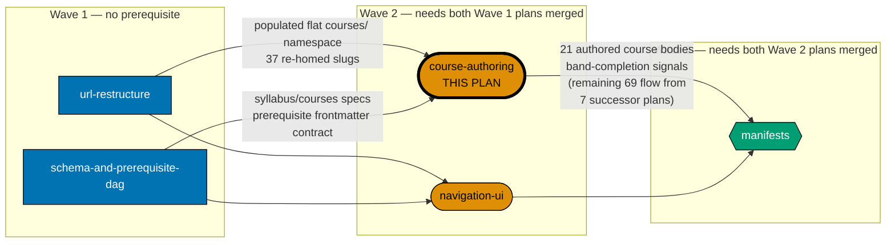
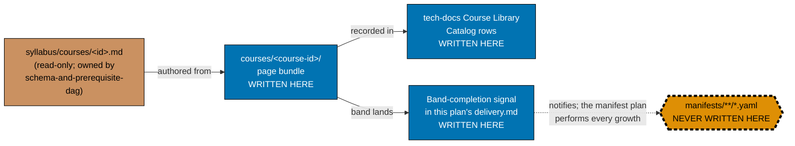

# Learning Path — Course Authoring (course bodies only)

## Delivery amendment — one remaining closeout PR

The course bodies in this plan are historical execution: the 21 bodies landed through completed
PRs before this amendment. Its remaining unchecked delivery work uses one shared closeout branch
and one final PR only: after Phases 5–8 are green, Phase 9 archives the plan in that PR and runs the
review, CI, merge, and deploy protocol. Earlier cohort-PR wording is historical evidence, not an
instruction for remaining work.

Author **21 course bodies** of the shared course library: the six net-new AI-engineering courses
(`evaluating-ai-output-essentials`, `statistics-for-evaluation`, `evaluating-ai-systems-in-depth`,
`product-patterns-for-probabilistic-systems`, `inference-serving-and-model-deployment`,
`fine-tuning-and-adaptation`), Band 1 — Data depth (`nosql-databases`, `graph-databases`,
`database-internals-and-storage-engines`, `data-engineering`, `search-and-information-retrieval`), and
Band 2 — Web, backend & platform productivity (`api-design`, `advanced-frontend`, `backend-at-scale`,
`async-python-and-fastapi-services`, `self-hosting-essentials`, `containers-and-orchestration`,
`cloud-and-iac`, `cicd-and-release-engineering`, `build-automation-and-task-runners`,
`information-architecture-and-seo`) — landing under `apps/ayokoding-www/content/en/learn/courses/`.

**Split history and terminal scope (read before anything else).** This plan originally scoped 90
course bodies across nine bands, a 6-course AI phase, and a course-surgery-contracts phase. As of this
revision, everything from Band 3 onward (Bands 3–9, 69 course bodies) plus the three course-surgery
scope contracts (0 course bodies; they target Band 5, which moved out) has been **carved out into
seven new backlog plans** — see [§Successor plans](#successor-plans) below. This plan's terminal scope
is now exactly Phase 0 (setup) + Phase 1 (6 AI courses) + Band 1 (5 courses) + Band 2 (10 courses) =
**21 course bodies**, all either already merged to `origin/main` or actively in-flight on the currently
open Band 2 cohort branch. This trim does not touch the historical status of any already-merged or
already-authored checklist item — see [delivery.md](./delivery.md) for the real PR numbers and merge
commits.

This is **Wave 2** of a five-plan split of the closed
[`shared-course-library-and-learning-paths`](../../done/2026-07-21__shared-course-library-and-learning-paths/README.md)
plan. It owns **course bodies only** — and, within course bodies, only the 21 named above. It owns no
schema, no route, no component, no redirect — and, most importantly, **no manifest**.

## Successor plans

The remaining 69 course bodies (Bands 3–9) and the 3 course-surgery scope contracts (which target Band 5) are carved out into seven new backlog plans, authored independently and in parallel by sibling
agents (do not create these folders from this plan; they are out of scope here):

| Successor plan (full folder name)                                         | Inherits                                                                                                                                                                                                     |
| ------------------------------------------------------------------------- | ------------------------------------------------------------------------------------------------------------------------------------------------------------------------------------------------------------ |
| `ayokoding-learning-path-05-course-authoring-platform-and-concurrency`    | Band 3 — Mobile & desktop platforms (10) + Band 4 — Concurrency languages (4)                                                                                                                                |
| `ayokoding-learning-path-06-course-authoring-architecture-and-ai-harness` | Band 5 — Architecture, distributed & AI/harness (15) + the three course-surgery contracts (evals forward-link, D9 naming/citation, D11 concept additions) — it authors Band 5, the band the contracts target |
| `ayokoding-learning-path-07-course-authoring-low-level-systems`           | Band 6 — Low-level systems, JVM & languages, internals builds (16)                                                                                                                                           |
| `ayokoding-learning-path-08-course-authoring-security-and-ops`            | Band 7 — Security, ops, quality & delivery (11)                                                                                                                                                              |
| `ayokoding-learning-path-09-course-authoring-interview-technique`         | Band 9 — Interview-technique courses (5)                                                                                                                                                                     |
| `ayokoding-learning-path-10-course-authoring-jvm-and-build-your-own`      | (reserved — see the sibling plan's own README for its exact scope statement)                                                                                                                                 |
| `ayokoding-learning-path-11-course-authoring-capstones`                   | Band 8 — Remaining capstones (8)                                                                                                                                                                             |

Each successor plan declares its own `blocks` edge to whichever of
[`ayokoding-learning-path-12-careers-se-manifests`](../../backlog/ayokoding-learning-path-12-careers-se-manifests/README.md)
/ [`ayokoding-learning-path-13-careers-ai-manifest`](../../backlog/ayokoding-learning-path-13-careers-ai-manifest/README.md)
owns the manifest(s) it grows, per its own README's `GROW_MANIFESTS` routing — this plan's own
`blocks` edge below covers only its own 21 courses.

> **Naming note (updated — the collision this note originally flagged is resolved).** The
> manifest-composition plan this note originally described — then named `ayokoding-learning-path-05-manifests`
> (Wave 3 of the original five-way split) — has since been renamed and split into two successor plans:
> [`ayokoding-learning-path-12-careers-se-manifests`](../../backlog/ayokoding-learning-path-12-careers-se-manifests/README.md)
> (the three `software-engineer`-role manifests) and
> [`ayokoding-learning-path-13-careers-ai-manifest`](../../backlog/ayokoding-learning-path-13-careers-ai-manifest/README.md)
> (the `ai-engineer` manifest). Neither new number collides with the course-authoring successor plan
> above, `ayokoding-learning-path-05-course-authoring-platform-and-concurrency` — the numbering
> collision this note originally flagged (two different `05`s under two co-existing schemes) no
> longer exists now that the manifest plan carries numbers `12`/`13` instead of `05`.

## Documented exception to the 5-15-course delivery-unit-sizing rule

This plan's 21-course terminal scope exceeds the repo's 5-15-course delivery-unit sizing guidance for
new backlog plans. That is deliberate, not an oversight, and applies only to this plan among the
course-authoring family. The 5-15 rule binds **new** backlog delivery-unit sizing, to prevent the
pattern that caused three redundant plans to accumulate scope on one page before this split. It does
not require retroactively fragmenting an **in-progress** plan's already-merged and already-in-flight
execution history into smaller pieces: Phase 0, Phase 1, and Band 1 are fully merged to `origin/main`
with real PR numbers and merge commits, and Band 2 is five-of-ten merged with the remaining five
authored and committed on the active cohort branch awaiting its single cohort PR. Splitting this
already-executing 21-course unit across two or more plan folders would require either un-merging real
history or reassigning already-landed PRs to a different plan folder after the fact — both falsify the
delivery record for no benefit, since the point of the sizing rule (bounding a single plan's blast
radius before work starts) has already been satisfied by the band-by-band phase structure this plan
used throughout its execution. The seven new successor plans (05–11 above), each newly authored and
each sized within the 5-15-course band, are the vehicle for applying the rule going forward; this
plan's 21-course exception is scoped to its own already-in-flight history and does not set precedent
for any future plan.

> **Programme decisions** — this plan cites the shared `R*`/`A*` decision ids (`R9`, `A6`, `A8`,
> `A9`, `A12`) throughout; their definitions (folded from the retired shared programme file so this
> plan is self-contained) live in
> [tech-docs.md §Programme decisions](./tech-docs.md#programme-decisions). The wave DAG is stated
> locally in this file (see the diagram below and §Implementation Sequence and Prerequisites): this
> plan is **Wave 2** — it needs Wave 1 plans `01` and `02` merged, and is a sibling of plan `03`
> (same wave, no dependency edge in either direction).
>
> **Cross-plan source of truth** — the authoritative per-course and per-path specs live in
> `plans/done/2026-07-24__ayokoding-learning-path-02-schema-and-prerequisite-dag/syllabus/`. Do not copy
> them; do not author from any other source. Every course body in this plan is authored **from** its
> [`syllabus/courses/<course-id>.md`](../../done/2026-07-24__ayokoding-learning-path-02-schema-and-prerequisite-dag/syllabus/courses/README.md)
> spec file — never from a fresh judgment call.

## The manifest ownership invariant (binding — read before anything else)

> **This plan never edits a manifest file.** Every file under
> `apps/ayokoding-www/src/features/course-paths/manifests/` is owned by
> [`ayokoding-learning-path-12-careers-se-manifests`](../../backlog/ayokoding-learning-path-12-careers-se-manifests/README.md)
> (the three `software-engineer`-role manifests) and its sibling
> [`ayokoding-learning-path-13-careers-ai-manifest`](../../backlog/ayokoding-learning-path-13-careers-ai-manifest/README.md)
> (the `ai-engineer` manifest).
> A step in this plan that creates, appends to, reorders, or re-verifies a `.yaml` manifest is a
> **boundary violation**, not a convenience.

When a band lands here, this plan records a **band-completion signal** in its own
[`delivery.md`](./delivery.md) and the manifest plan performs the growth. The signal is the entire
handoff contract; see [Band-completion signal contract](#band-completion-signal-contract) below.

This invariant is what breaks an otherwise-genuine dependency cycle between the two plans, and it is
the reason the manifest plan's hard prerequisite is **both** Wave-2 plans rather than the navigation
plan alone.

**Concretely, these steps left this plan and went to the manifest plan** (do not reintroduce them):

| Step                                                                                   | Why it left                                                                        |
| -------------------------------------------------------------------------------------- | ---------------------------------------------------------------------------------- |
| Bands 1–8 growth of the three `software-engineer` manifests                            | genuine manifest mutation                                                          |
| Band 9 growth (`interview-ready` + `fundamentally-strong` only)                        | genuine manifest mutation                                                          |
| Interview-ready refresh-register smoothness re-audit                                   | mutation-adjacent; closes the manifest plan's own earlier deferral                 |
| AI-path manifest growth from the 6-course spine to its full DD-35-governed composition | genuine manifest mutation                                                          |
| The course-surgery phase's manifest re-verification                                    | read-only, but it inverts the wave order (this plan is Wave 2, that one is Wave 3) |
| The terminal **127-catalog** assertion                                                 | that is the catalog total; this plan asserts only its own **21** authored bodies   |

## Position in the split

**Accessibility note.** Wave membership is carried by node **shape** (rectangle / stadium / hexagon)
**and** by the three labelled subgraph containers, never by fill colour alone. This plan is marked by
a **thicker border** and by the literal text `THIS PLAN` in its label. Fills use the verified
accessible palette (`#0173B2` blue, `#DE8F05` orange, `#029E73` teal) with black borders and
WCAG-AA-contrasting text, per the
[Color Accessibility Convention](../../../repo-governance/conventions/formatting/color-accessibility.md).

## Manifest-ownership boundary

**Accessibility note.** Write permission is carried by node **shape** and by explicit label text
(`WRITTEN HERE` / `NEVER WRITTEN HERE` / `read-only`), and edge kind by **line style** plus edge
labels — never by fill colour alone. The forbidden node additionally carries a dashed thick border.

## Band-completion signal contract

The manifest plan cannot act on a vague signal. Every band-completion signal recorded in this plan's
`delivery.md` MUST carry all five fields below, verbatim, in a fenced `text` block directly under the
band's gate. This plan now records exactly **three** such signals — Phase 1 (the six AI-engineering
courses), Band 1 (Phase 3, Data depth), and Band 2 (Phase 4, Web/backend/platform productivity). The
signal contract's shape below is otherwise unchanged and is reused verbatim by every successor plan
(05–11) for the bands each of them lands:

| Field               | Content                                                                          |
| ------------------- | -------------------------------------------------------------------------------- |
| `BAND`              | the band number and title, e.g. `Band 1 — Data depth`                            |
| `PLAN`              | `ayokoding-learning-path-04-course-authoring`                                    |
| `LANDED_COURSE_IDS` | every course ID the band authored, one per line, in the band's own listing order |
| `GROW_MANIFESTS`    | every manifest the manifest plan must grow, by **full path** under `<MANIFESTS>` |
| `MERGED_COMMIT`     | the `origin/main` merge commit SHA of that band's PR                             |

`GROW_MANIFESTS` is the load-bearing field. For this plan's own three signals it is **not** "all four
manifests" by default:

- **Phase 1 (AI-engineering courses)** → `<MANIFESTS>careers/immediately-effective/ai-engineer.yaml`
  only.
- **Band 1 and Band 2** → `<MANIFESTS>careers/interview-ready/software-engineer.yaml`,
  `<MANIFESTS>careers/immediately-effective/software-engineer.yaml`,
  `<MANIFESTS>careers/fundamentally-strong/software-engineer.yaml`

The routing for Bands 3–9 (including the Band 5/Band 8 fourth-path-manifest additions and the Band 9
two-manifest carve-out) is no longer this plan's concern — each successor plan states its own
`GROW_MANIFESTS` routing for the band(s) it lands, in its own README.

A signal that names manifests loosely, or omits `MERGED_COMMIT`, is incomplete and the receiving plan
must reject it rather than guess.

## Delivery Mode: worktree-to-pr

This plan has exactly one dedicated worktree, one persistent final-delivery branch, and one PR.
All authoring, verification, and Knowledge Capture phases commit on that branch without a push, PR,
review cycle, merge, or deployment. In Phase 9, the executor commits the archival move and
any index updates, opens the sole draft PR, completes the PR-Review Maker→Fixer Cycle and CI gates,
marks it ready, and performs the normal AI merge/deploy after the hardened preconditions hold.
No per-course, cohort, stage, or phase worktree/branch/PR is permitted.

## Depends-on

| Direction     | Plan (full folder name)                                  | Nature                                                                                                                    |
| ------------- | -------------------------------------------------------- | ------------------------------------------------------------------------------------------------------------------------- |
| **blockedBy** | `ayokoding-learning-path-01-url-restructure`             | hard — populated flat `courses/` namespace + `courses/_index.md`                                                          |
| **blockedBy** | `ayokoding-learning-path-02-schema-and-prerequisite-dag` | hard — `syllabus/courses/` specs + the `prerequisites` contract                                                           |
| **blockedBy** | `vercel-function-cost-reduction`                         | hard — see [§`vercel-function-cost-reduction` precondition](#vercel-function-cost-reduction-precondition) below           |
| **blocks**    | `ayokoding-learning-path-12-careers-se-manifests`        | hard — this plan's Band 1 + Band 2 bodies and their band-completion signals (the successor plans 05–11 declare their own) |
| **blocks**    | `ayokoding-learning-path-13-careers-ai-manifest`         | hard — this plan's Phase 1 (six AI-engineering courses) and its band-completion signal                                    |
| _(sibling)_   | `ayokoding-learning-path-03-navigation-ui`               | none — same wave, independent surface, no shared file                                                                     |

### `vercel-function-cost-reduction` precondition

[`vercel-function-cost-reduction`](../done/2026-08-02__vercel-function-cost-reduction/README.md) (folder:
`plans/done/2026-08-02__vercel-function-cost-reduction/`) is a **new hard `blockedBy` dependency**, added
because that plan's Phases 1–3 change the same app and route tree this plan authors **~21 course
bundles (~150 rendered pages)** into: it promotes `apps/ayokoding-www/src/app/[locale]/layout.tsx` to the app's root layout
(deleting `apps/ayokoding-www/src/app/layout.tsx` outright, to fix dynamic rendering caused by a
`headers()` read in the root layout), removes the server-side `?path=` `searchParams` read on the
`[...slug]` content catch-all route, and deletes `apps/ayokoding-www/src/middleware.ts` once nothing
reads the `x-pathname` header it existed to set.

**Per explicit instruction, `vercel-function-cost-reduction` is treated as already merged/done** for
planning purposes in this plan's documents — i.e. this is stated as a precondition that must hold
before this plan's remaining Band-2 cohort PR merges, not as a claim already verified true on disk
today. **Start-precondition (checkable):**
`test ! -f apps/ayokoding-www/src/app/layout.tsx` returns 0 once that plan's Phase 1 has merged (the
root layout it deletes). At the time this README was last edited, that file still exists on disk
(`vercel-function-cost-reduction` has not yet executed its Phases 1–4 in this checkout) — the
precondition is forward-looking, not yet satisfied, and the remaining Band-2 cohort PR must not merge
until it is.

**No dependency on any plan outside this split.** The prior "FS-SE must be DONE first" hard dependency
is **REMOVED** — the sibling FS-SE plan is closed
([`plans/done/2026-07-19__fundamentally-strong-software-engineer/`](../../done/2026-07-19__fundamentally-strong-software-engineer/README.md))
and its Passes 3–5 scope (topics 34–94 plus the associated capstones) is **absorbed into this plan**
as the native-authored backfill (DD-17 / DL-12).

## Implementation Sequence and Prerequisites

This plan is **Wave 2** of a five-plan split of the closed
`shared-course-library-and-learning-paths` plan. It owns **course bodies only**, and, as of this
plan's own split into successors 05–11, only **21** of them: the six net-new AI courses, Band 1 —
Data depth (5), and Band 2 — Web, backend & platform productivity (10). The 61 transferred topics
beyond Bands 1–2, the 10 remaining new courses beyond Band 2, the 8 remaining capstones, the 5
deferred interview-technique bodies, and the course-surgery scope contracts are carried by the seven
successor plans named in [README §Successor plans](./README.md#successor-plans).

### The manifest ownership invariant (binding)

**This plan never edits a manifest file.** Every file under
`apps/ayokoding-www/src/features/course-paths/manifests/` is owned by
`ayokoding-learning-path-12-careers-se-manifests` (the three `software-engineer`-role manifests) and
its sibling `ayokoding-learning-path-13-careers-ai-manifest` (the `ai-engineer` manifest). When a
band lands, this plan records a **band-completion signal** in its own `delivery.md` and the owning
manifest plan performs the growth. A
step here that appends a course ID to a `.yaml` is a boundary violation, not a convenience.

### Upstream — what must exist before this plan starts

| Upstream plan                                            | Artefact needed                                                    | Why this plan cannot start without it                                                                                                                      |
| -------------------------------------------------------- | ------------------------------------------------------------------ | ---------------------------------------------------------------------------------------------------------------------------------------------------------- |
| `ayokoding-learning-path-01-url-restructure`             | 37 re-homed course bundles occupying the flat `courses/` namespace | the 29-new-slug collision check is vacuous against an empty namespace, and a native-authored slug could silently collide with a not-yet-moved re-home slug |
| `ayokoding-learning-path-01-url-restructure`             | `apps/ayokoding-www/content/en/learn/courses/_index.md`            | every authored course is listed in this catalog landing                                                                                                    |
| `ayokoding-learning-path-02-schema-and-prerequisite-dag` | `syllabus/courses/<course-id>.md` — 120 settled spec files         | each body is authored **from** its spec (`co-NN` concepts, `ex-NN` examples, prerequisite chain, capstone spec), never from a fresh judgment call          |
| `ayokoding-learning-path-02-schema-and-prerequisite-dag` | the `prerequisites: [course-id, ...]` frontmatter contract         | every net-new `_index.md` declares it                                                                                                                      |

**Start precondition (checkable — all four must hold):**

1. PR for `ayokoding-learning-path-01-url-restructure` is **merged to `origin/main`**.
2. PR for `ayokoding-learning-path-02-schema-and-prerequisite-dag` is **merged to `origin/main`**.
3. `test -d apps/ayokoding-www/content/en/learn/courses` returns 0 and the directory holds the
   **37** re-homed bundles.
4. `test -f plans/done/2026-07-24__ayokoding-learning-path-02-schema-and-prerequisite-dag/syllabus/courses/README.md`
   returns 0 (substitute the schema plan's current stage folder).

**Additional precondition on the remaining Band-2 cohort PR (added by this revision):**

**5.** `vercel-function-cost-reduction` is merged to `origin/main` — checkable via
`test ! -f apps/ayokoding-www/src/app/layout.tsx` (see [§`vercel-function-cost-reduction`
precondition](#vercel-function-cost-reduction-precondition) above). This precondition binds only
the still-open Band-2 cohort PR, not Phase 0/1/Band-1, which are already merged and unaffected.

### Downstream — what this plan hands off, and to whom

| Downstream plan                                   | Artefact handed over                                                                     | Consumed by                                                               |
| ------------------------------------------------- | ---------------------------------------------------------------------------------------- | ------------------------------------------------------------------------- |
| `ayokoding-learning-path-12-careers-se-manifests` | 15 authored course bundles under `<COURSES>` (Band 1 + Band 2)                           | manifest integrity fails on any `courseOrder` ID with no resolving bundle |
| `ayokoding-learning-path-13-careers-ai-manifest`  | the six net-new AI course bodies (Phase 1)                                               | the fourth path's spine references exactly these six                      |
| `ayokoding-learning-path-12-careers-se-manifests` | the Band 1 and Band 2 **band-completion signals**, recorded in this plan's `delivery.md` | triggers the corresponding manifest-growth step there                     |
| `ayokoding-learning-path-13-careers-ai-manifest`  | the Phase 1 **band-completion signal**, recorded in this plan's `delivery.md`            | triggers the corresponding manifest-growth step there                     |

> The locked evals forward-link / D9 citation / D11 concept contracts are no longer handed off from
> this plan — they target Band 5, which moved to
> `ayokoding-learning-path-06-course-authoring-architecture-and-ai-harness`, and that plan hands them
> off to the manifest plan instead.

### Cross-plan `syllabus/` reference rule

Every step that names a syllabus spec file carries the **full cross-plan relative path** to the
schema plan's folder — never the source plan's `./syllabus/...` form, which resolves to nothing
after the split. Do not copy `syllabus/` into this folder.

### Handoff signal

This plan is done for downstream purposes when its final PR is **merged to `origin/main`** AND every
one of its own **21** named course bodies exists as a directory under
`apps/ayokoding-www/content/en/learn/courses/` (see
[delivery.md](./delivery.md#phase-5-section-and-authored-tree-verification) for the exact
`evidence/authored-body-slugs.txt`-driven check).

> **Scope note on the handoff-signal count.** The full programme's **127-course catalog** total is
> the **manifest plan's** eventual assertion, once this plan and all seven successor plans (05–11)
> have landed their own shares. **This plan's own terminal assertion is its 21 authored bodies**, not
> 127 and not 90 — the 90-body figure described this plan's scope before the Band-3-onward carve-out.
> 37 re-homed bundles (from `ayokoding-learning-path-01-url-restructure`) + this plan's 21 + the seven
> successor plans' 69 = 127. See [delivery.md](./delivery.md) for the authored-body-only check and its
> `evidence/authored-body-slugs.txt` manifest.

## Build order (inherited)

Reproduced **verbatim** from the source plan. Do not paraphrase — the amendment annotations are the
point. The canonical owners for citation purposes are `ayokoding-learning-path-12-careers-se-manifests`
and `ayokoding-learning-path-13-careers-ai-manifest` (their combined phase ordering is what DD-27
most directly constrains).

- **DD-15 · Build order (locked; amended 2026-07-20 by DD-27 — see below).** Group A (architecture +
  `course-paths` UI — hard prerequisite) → `interview-ready` MVP ships first (re-home 1–33, author the
  4 interview courses + `capstone-interview-loop`, one manifest, deploy) → `immediately-effective`
  manifest → `fundamentally-strong` manifest → backfill topics 34–94 native into `courses/` as the
  library fills. **DD-27 amends steps 2 onward**: the MVP is narrowed to an architecture smoke test
  only (interview-course authoring is no longer bundled into it), and the fourth path is inserted as
  authoring priority #1 immediately after the MVP.
- **DD-27 · Build order amended: the fourth path is authoring priority #1, behind an
  architecture-smoke-test-only MVP (D7, amends DD-15).** Locked order: **Group A** (architecture + UI,
  unchanged hard prerequisite) → **`interview-ready` MVP, narrowed to an architecture smoke test only**
  (ships against topics 1–33, already live on disk; proves routing, manifest loading, `?path` context,
  prev/next, breadcrumb, and prerequisite display against real content, in days not months —
  authoring the 4 NEW interview courses + `capstone-interview-loop` is **no longer bundled into this
  MVP gate**) → **`careers/immediately-effective/ai-engineer`** (authoring priority #1 for all authoring effort)
  → **`careers/immediately-effective/software-engineer`** manifest → **`careers/fundamentally-strong/software-engineer`**
  manifest → **backfill topics 34–94**. Rationale (preserved from the original build-order decision):
  nothing in the AI path exists on disk (~17 courses); making it literally first — ahead of even the
  MVP — would mean nothing ships until all 17 are authored, with the UI architecture unvalidated the
  entire time. Ordering it immediately after an architecture-smoke-test MVP gives the AI path first
  claim on every unit of real authoring effort while keeping the architecture proven early against
  content that already exists.

**How the split's waves realize that order.** Group A is Wave 1 + the navigation plan; the
`interview-ready` MVP is the manifest plan's first manifest phase; **this plan's Phase 1 is DD-27's
"authoring priority #1"** (the six net-new AI courses); the remaining manifests are the manifest
plan's; the backfill is this plan's Phases 3–11. The wave order does not reorder DD-27 — it
distributes it. Do not "optimize" the sequence: DD-27's rationale paragraph exists specifically to
prevent that.

## Decisions Locked (inherited)

Two entries are **cross-cutting** and are reproduced verbatim in all five split plans:

- **DL-7 · Build order — amended 2026-07-20, see DL-15 / tech-docs DD-27.** Deliver Group A
  (architecture + UI) first as a hard prerequisite; then an **interview-ready MVP that is an
  architecture smoke test only** (shipped against already-live topics 1–33, not the full interview
  cluster); then `careers/immediately-effective/ai-engineer` (authoring priority #1); then
  the `careers/immediately-effective/software-engineer` manifest; then the `careers/fundamentally-strong/software-engineer`
  manifest; then backfill topics 34–94 native as the library fills. **Decided; amended 2026-07-20.**
- **DN-11 DECIDED — `[AI]` auto-merge (now the repo default).** `[AI]` merges this plan's sole final
  PR (see [delivery.md's `### Delivery Boundaries` table](./delivery.md#delivery-boundaries))
  automatically once the 3-cycle PR-Review Maker→Fixer Cycle and all quality gates are green — this
  plan declares no `[HUMAN]` merge gate. When DN-11 was first recorded, `pr-merge-protocol.md` still
  defaulted to a `[HUMAN]` merge, so the maintainer authorized AI-auto-merge for **this plan**
  (in-session): (a) it uses the SAME delivery methods as the now-closed sibling plan
  `fundamentally-strong-software-engineer`; and (b) no maintainer permission is needed to merge a PR
  once it has passed 3 review cycles and the PR quality gate. The protocol has since been changed so
  that `[AI]` merges by default and `[HUMAN]` is an explicit per-plan opt-in, making DN-11 a
  confirmation of the default rather than an override. Recorded here and in
  [delivery.md](./delivery.md#delivery-mode-worktree-to-pr).

> **`DL-11` does not exist.** The slot between `DL-10` and `DL-12` is occupied by `DN-11`, a Delivery
> Note. **Never renumber to close the gap** — `DN-11` is cited by ID in two places and both citations
> must survive.

The source plan's `## Decisions Locked` list holds **17** entries (`DL-1`…`DL-10`, `DN-11`,
`DL-12`…`DL-17`). This plan owns **five** of them:

- **DL-6 · Library source & catalog (baseline 121 → 127, course surgery now permitted — amended
  2026-07-20, see DL-15 / tech-docs DD-28).** 33 shipped topics (1–33) re-homed into `courses/` **with
  redirects**; 61 transferred topics (34–94) authored **NATIVE** into `courses/` (no re-home); 4
  existing capstones + 23 net-new courses (see **DL-14** for the seven DD-20 inter-topic capstones
  folded into this 121 baseline). Plus, as of 2026-07-20, 6 net-new AI-specific courses for the fourth
  path, bringing the catalog to **127**; update / merge / split / create course surgery is now
  permitted, superseding the original zero-new-bodies invariant, subject to the four-path blast-radius
  rule. **Decided; amended 2026-07-20.**
  - _Amendment split across plans_: DL-6 is amended by **DL-15**, which lands in whichever of
    [`ayokoding-learning-path-12-careers-se-manifests`](../../backlog/ayokoding-learning-path-12-careers-se-manifests/README.md)
    /
    [`ayokoding-learning-path-13-careers-ai-manifest`](../../backlog/ayokoding-learning-path-13-careers-ai-manifest/README.md)
    reproduces it (the manifest-composition plan this decision targets, since renamed and split into
    the two successors above).
    The re-home half of DL-6 is executed by
    [`ayokoding-learning-path-01-url-restructure`](../../done/2026-07-23__ayokoding-learning-path-01-url-restructure/README.md);
    the native-authoring half is executed here.
- **DL-9 · detection-engineering kept distinct + topic-60 label fix.**
  `detection-engineering-and-siem-operations` stays distinct from `defensive-security` (60);
  `defensive-security` is re-labelled **hands-on By-Example** (the catalog's "concept-level" label was
  wrong); explicit scope lines are drawn (generalist Sigma/ELK breadth vs deep Wazuh SIEM-ops).
  **Decided.**
  - _Scope note (added by this revision)_: both courses are Band 7, which is **no longer this plan's
    scope** — Band 7 moved to `ayokoding-learning-path-08-course-authoring-security-and-ops`, which
    authors both bodies per this ruling. Text kept verbatim (not deleted) as the historical rationale
    record.
- **DL-10 · AI-band scope-guard.** `creating-ai-powered-apps` (use-an-LLM) → `agentic-ai` (survey +
  forward-link, does not re-teach at depth) → build-your-own harness cluster (build-your-own depth).
  A cross-reference contract prevents the survey and the cluster from duplicating the
  loop/tools/MCP/memory/evals explanations. **Decided.**
  - _Scope note (added by this revision)_: all named courses are Band 5, which is **no longer this
    plan's scope** — Band 5 moved to
    `ayokoding-learning-path-06-course-authoring-architecture-and-ai-harness`, which authors the
    cluster and applies this scope-guard by construction. Text kept verbatim as the historical
    rationale record.
- **DL-12 · FS-SE hard dependency REMOVED.** The sibling FS-SE plan is closed; its Passes 3–5 scope is
  absorbed here as the native-authored backfill of topics 34–94. This plan waits on no other plan.
  **Decided.**
- **DL-14 · Seven orphaned inter-topic capstones promoted to first-class library courses (baseline
  114 → 121, still 0 merges).** Audit found seven capstones fully specced but absent from the catalog
  tables and path manifests: `capstone-solid-core` (already **live on disk**, embedded in
  `syllabus/courses/engineering-management.md`), `capstone-real-world-delivery`,
  `capstone-secure-service`, `capstone-data-pipeline` (embedded in
  `syllabus/courses/defensive-security.md`), `capstone-concurrency-and-systems`,
  `capstone-concurrency-showdown` (embedded in
  `syllabus/courses/compilers-parsers-and-transpilers.md`), and `capstone-lead-at-altitude`
  (embedded in `syllabus/courses/site-reliability-engineering.md`). Ruling: promote all seven to
  first-class catalog rows (existing capstones 3 → 4, net-new 17 → 23, baseline 114 → 121, still
  0 merges); include all seven in all three path manifests at their earliest prerequisite-safe
  position (none is genuinely omitted, verified machine-checked topologically-consistent in all
  three); never fold any into a parent course's intra-course capstone or cut it. Mirrors
  [tech-docs DD-20](./tech-docs.md#design-decisions). **Decided 2026-07-19.**
  - _Split note (updated by this revision)_: six of the seven are authored natively as Band 8, which
    is **no longer this plan's scope** — Band 8 moved to
    `ayokoding-learning-path-11-course-authoring-capstones`. `capstone-solid-core` is already live on
    disk and is re-homed by `ayokoding-learning-path-01-url-restructure`, not authored by any
    course-authoring plan.

## Blocked-on: Open Question Q-A

All six open questions **Q-A … Q-F** are owned verbatim by
[`ayokoding-learning-path-01-url-restructure`](../../done/2026-07-23__ayokoding-learning-path-01-url-restructure/README.md).
This plan is blocked on exactly one of them:

> **Q-A — Is `legacy/` a staging pen or a permanent archive?** Its ruling determines whether each
> authored course whose subject is covered by a legacy page records a **"superseded by"** line in its
> own `overview.md`. Under the recommended default (**A — staging pen**) that line is **required**;
> under **B — permanent archive** it is **omitted**. See the Q-A record in the URL-restructure plan's
> `tech-docs.md`.

Until Q-A is ruled, every authoring step in this plan proceeds **without** the supersession line and
records the pending obligation. The supersession sweep is a single bounded pass, listed as an
explicit conditional step in [delivery.md](./delivery.md), not a per-course rewrite.

## Rule-15 three-tester retest — exemption recorded

**Exempt, with reasons stated (not silently omitted).** The
[User-Facing Delivery Hardening Convention](../../../repo-governance/development/quality/user-facing-delivery-hardening.md)
Rule 15 mandates a near-end `web-exploratory-tester` + `web-usability-tester` + `web-design-tester`
round for **web-UI feature-change** plans. This plan is not one:

1. **It ships no screen and no component.** Every artefact is a markdown page bundle under
   `apps/ayokoding-www/content/en/learn/courses/`. The screens that render those pages
   (`PathRail`, `PathLanding`, `PathCard`, the paths hub) are owned by
   `ayokoding-learning-path-03-navigation-ui`, which carries the mandatory retest.
2. **Its output surface is already covered by dedicated checkers.** Every authored body passes
   `apps-ayokoding-www-{by-example,annotated-concept,primer,general}-checker`,
   `apps-ayokoding-www-facts-checker`, and `apps-ayokoding-www-link-checker` — content-domain
   checkers strictly stronger, for prose correctness, than a generalist live-site UX triad.
3. **The retest would test the other plan's surface.** Pointing the triad at a course page exercises
   the navigation plan's rendering layer, producing findings this plan cannot act on.

**This is an exemption, not an omission**, and it is **narrow**: manual behavioural verification via
Playwright MCP is **still mandatory and still performed** (see `delivery.md` Phase 6) — a sample of
authored course pages is opened at all three breakpoints in the `en` content locale, with committed
screenshot evidence. Only the three-tester triad is waived.

## Locale scope

This plan's content is authored **`en`-only**. Per the source plan's Business-Scope Non-Goals, an
Indonesian mirror of the section content is explicitly **deferred**, and the deferral is a recorded
decision rather than an omission. Every manual-verification step in this plan therefore exercises `en`
and states the deferral inline; fabricating an `id` walk-through for content that does not exist is
forbidden.

## Navigation

- [Business Requirements (brd.md)](./brd.md) — WHY these 21 bodies exist, who they serve, the
  business risks of authoring them, and what "done" means in business terms.
- [Product Requirements (prd.md)](./prd.md) — personas, user stories, the four Gherkin acceptance
  criteria this plan owns (three routed from the source plan, plus one newly authored scoped
  build-green scenario — the other seven inherited scenarios moved with their bands to the successor
  plans), the NEW-course specifications this plan still authors, and product scope.
- [Technical Docs (tech-docs.md)](./tech-docs.md) — the authoring architecture, the design
  decisions this plan owns (several re-scoped to point at the successor plan that now authors their
  target band), the Course Library Catalog (21 rows), the proof-of-transfer outcome-anchor, the
  cross-plan `syllabus/` reference rule, and the UI-design-funnel exemption.
- [Delivery Checklist (delivery.md)](./delivery.md) — the phased, executable checklist.
- [Learnings (learnings.md)](./learnings.md) — knowledge-capture running log.
- **Cross-plan**:
  [`syllabus/` source of truth](../../done/2026-07-24__ayokoding-learning-path-02-schema-and-prerequisite-dag/syllabus/README.md)
  ·
  [`syllabus/courses/` catalog](../../done/2026-07-24__ayokoding-learning-path-02-schema-and-prerequisite-dag/syllabus/courses/README.md)
  ·
  [`syllabus/paths/` manifests](../../done/2026-07-24__ayokoding-learning-path-02-schema-and-prerequisite-dag/syllabus/paths/README.md)
  · [SE manifests plan](../../backlog/ayokoding-learning-path-12-careers-se-manifests/README.md)
  · [AI manifest plan](../../backlog/ayokoding-learning-path-13-careers-ai-manifest/README.md)
  · [URL-restructure plan](../../done/2026-07-23__ayokoding-learning-path-01-url-restructure/README.md)
  · [navigation-UI plan](../../done/2026-07-25__ayokoding-learning-path-03-navigation-ui/README.md)
  · [schema plan](../../done/2026-07-24__ayokoding-learning-path-02-schema-and-prerequisite-dag/README.md)

## Provenance

This plan is one of five folders produced by splitting
`plans/done/2026-07-21__shared-course-library-and-learning-paths/`. Two provenance notes are required reading:

- **The composite build-green scenario was decomposed, not moved.** The source plan's
  `Scenario: The app builds and validates green` conjoined the navigation feature **and** the
  interview-ready path in its `Given`, spanning two plans by construction, and bound no delivery step.
  Each of the five split plans instead writes its own scoped build-green scenario naming its own
  surface. This plan's is
  [`Scenario: The authored course library builds and validates green`](./prd.md#acceptance-criteria-gherkin).
- **The `DD-34` / `DD-35` / `DD-39` tokens are not this split's decisions.** They appear throughout
  `syllabus/courses/**` carrying **FS-SE-inherited** meanings (concept enumeration, primary-source
  citation policy, typed-Python policy) and travel with `syllabus/` into the schema plan. `DD-36`,
  `DD-37`, and `DD-38` are unused. **Do not renumber to close the apparent gap.**
