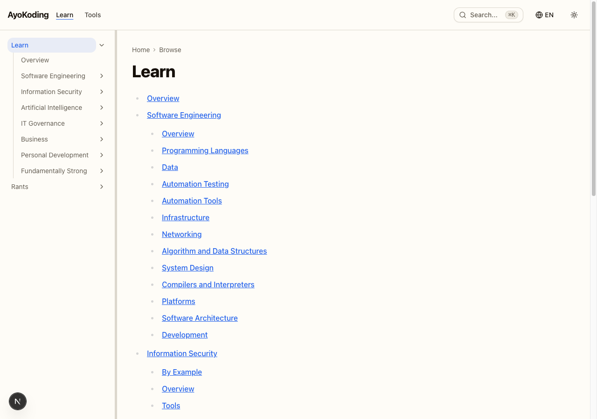
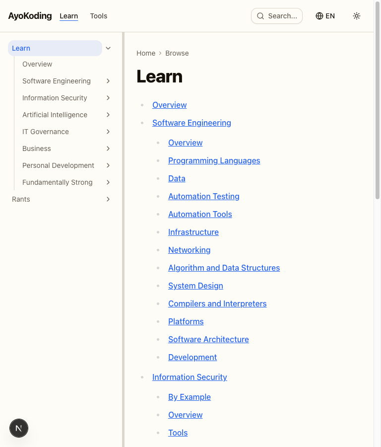
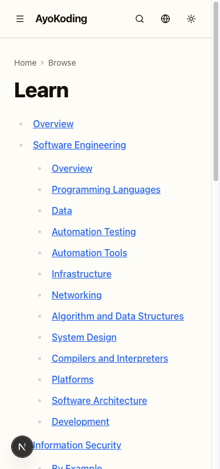
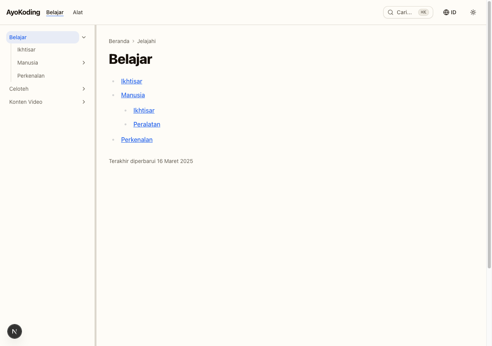
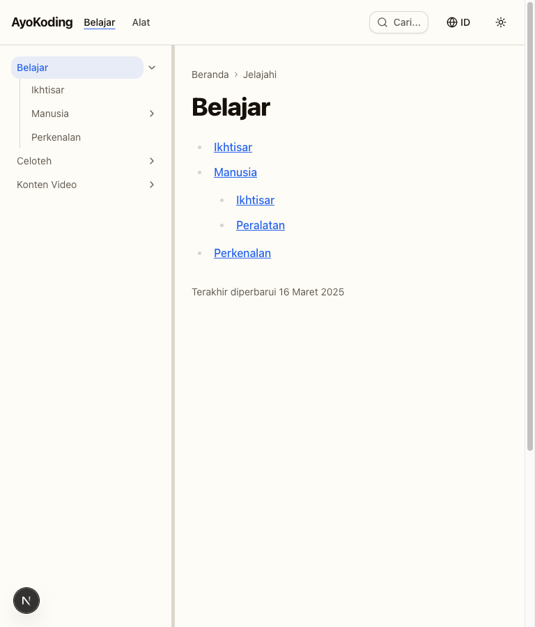
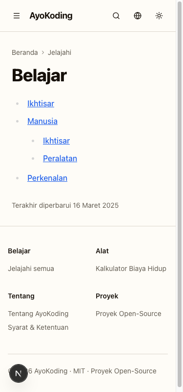

# Delivery: Resizable Docs Sidebar (ayokoding-www)

> **Legend** — `[AI]`: an agent performs the step (the default; unmarked steps are `[AI]`).
> `[HUMAN]`: only a human can do it (physical action, out-of-band approval, real-secret or
> privileged-credential handling). `[AI+HUMAN]`: agent prepares, human approves or finishes.
>
> **Phase Gate** — every phase ends with a `### Phase N Gate` (must-pass verification) plus a
> `> **Pause Safety**:` note (the safe-to-stop state and the single command to resume). A phase is
> not complete until its gate is green; do not start phase N+1 while any gate check fails.

## Worktree

Worktree path: `worktrees/ayokoding-resizable-docs-sidebar/`

Optional manual pre-provisioning (run from repo root):

```bash
claude --worktree ayokoding-resizable-docs-sidebar
```

The plan-execution Step 0 gate enters this worktree by default: it auto-provisions from the latest
`origin/main` when missing, syncs with `origin/main` before implementing, and prompts before
deleting the worktree after the plan is archived and pushed.

See [Worktree Path Convention](../../../repo-governance/conventions/structure/worktree-path.md) and
[Plans Organization Convention §Worktree Specification](../../../repo-governance/conventions/structure/plans.md#worktree-specification).

## Delivery Mode: worktree-to-pr

Work in `worktrees/ayokoding-resizable-docs-sidebar/`; open a draft PR against `main`; the
PR-Review Maker→Fixer Cycle (default 3 sequential CI-gated cycles) runs before the `[HUMAN]` merge.
"Done" = a green, fully-reviewed PR handed off; the human merges on their own schedule.

## Phase Flow

```mermaid
%% Colour-blind-friendly palette: Blue #0173B2 (phase), Teal #029E73 (gate), Orange #DE8F05 (human)
flowchart LR
  P0["Phase 0<br/>Setup"]:::blue --> G0{"Gate 0"}:::teal
  G0 --> P1["Phase 1<br/>Design funnel"]:::blue --> G1{"Gate 1"}:::teal
  G1 --> P2["Phase 2<br/>Core model"]:::blue --> G2{"Gate 2"}:::teal
  G2 --> P3["Phase 3<br/>Primitive"]:::blue --> G3{"Gate 3"}:::teal
  G3 --> P4["Phase 4<br/>Desktop rail"]:::blue --> G4{"Gate 4"}:::teal
  G4 --> P5["Phase 5<br/>Mobile presets"]:::blue --> G5{"Gate 5"}:::teal
  G5 --> P6["Phase 6<br/>E2E + manual"]:::blue --> G6{"Gate 6"}:::teal
  G6 --> P7["Phase 7<br/>PR review"]:::blue --> G7{"Gate 7"}:::teal
  G7 --> P8["Phase 8<br/>Knowledge"]:::blue --> G8{"Gate 8"}:::teal
  G8 --> AR["Archival<br/>(AI)"]:::blue --> M["HUMAN merge"]:::orange

  classDef blue fill:#0173B2,stroke:#000000,color:#FFFFFF,stroke-width:2px
  classDef teal fill:#029E73,stroke:#000000,color:#FFFFFF,stroke-width:2px
  classDef orange fill:#DE8F05,stroke:#000000,color:#000000,stroke-width:2px
```



Each `Gate N` node is that phase's `### Phase N Gate` must-pass checklist; Phase N+1 does not start
while its predecessor's gate is red. `Archival` is the `[AI]`-executed Plan Archival sequence
(`git mv`, README updates, commit, push, CI re-verify) that runs after Phase 8 Gate is green.
`HUMAN merge` sits outside the AI done-boundary — it is the final step after Archival completes
(see Phase 7 Gate's Pause Safety note).

---

## Phase 0: Environment Setup and Baseline

> _Executor: repo-setup-manager_

- [x] [AI] Provision/enter the worktree: `git worktree add worktrees/ayokoding-resizable-docs-sidebar origin/main`
      (skip if plan-execution Step 0 already entered it) — acceptance: `worktrees/ayokoding-resizable-docs-sidebar/` exists on a branch off `origin/main` - **Date**: 2026-07-15. **Status**: Done. **Files**: none (git operation only).
      Worktree provisioned via `git worktree add -b ayokoding-resizable-docs-sidebar
worktrees/ayokoding-resizable-docs-sidebar origin/main`, entered via `EnterWorktree`,
      synced to latest `origin/main` (`eeeac509d`) via `git merge --ff-only origin/main`.
- [x] [AI] Install dependencies in the root worktree: `npm install`
      — acceptance: exits 0, `node_modules/` synchronized - **Date**: 2026-07-15. **Status**: Done. **Files**: none (dependency install only).
      `npm install` exited 0; `node_modules/` synchronized (1572 packages added, 1596 audited);
      `postinstall` doctor check reported 16/16 tools OK.
- [x] [AI] Converge the toolchain in the root worktree: `npm run doctor -- --fix`
      — acceptance: exits 0 with no unresolved drift - **Date**: 2026-07-15. **Status**: Done. **Files**: none (toolchain check only).
      `npm run doctor -- --fix` exited 0: 16/16 tools OK, 0 warning, 0 missing — "Nothing to fix,
      all tools are installed."
- [x] [AI] Record baseline for affected projects:
      `npx nx run-many -t typecheck lint test:quick specs:behavior:coverage -p web-ui ayokoding-www`
      — acceptance: baseline pass/fail recorded; every preexisting failure documented - **Date**: 2026-07-15 21:53. **Status**: Done. **Files**: none (test run only).
      Baseline (2026-07-15 21:53): Projects in scope: web-ui, ayokoding-www. `typecheck`, `lint`,
      `test:quick` (`test:unit` + `test:coverage` + `test:specs`), `specs:behavior:coverage` all
      passed for both projects — exit 0. web-ui: 52/52 test files passed; specs coverage valid (18
      specs, 86 scenarios, 204 steps, all covered). ayokoding-www: 80/80 test files passed (2541/2541
      tests); specs coverage valid (18 specs, 224 scenarios, 834 steps, all covered). lint surfaced
      only pre-existing non-blocking `jsx-a11y`/`no-unused-vars` warnings (zero errors). Passed: 8/8
      Nx tasks. Failed: 0. Skipped: 0. Known preexisting failures: none.
- [x] [AI] Verify the dev server starts: `npx nx dev ayokoding-www` (then stop it)
      — acceptance: server boots on port 3101 without error - **Date**: 2026-07-15. **Status**: Done. **Files**: none (manual verification only).
      Port 3101 was already bound by an unrelated, long-running (~2 day uptime) `next dev` instance
      serving from the primary checkout (`/Users/wkf/ose-projects/ose-public/apps/ayokoding-www`,
      PID 27341/27342) — left untouched as out-of-scope, possibly-in-use infrastructure. Verified
      this worktree's dev server boots cleanly by running the identical `dev` target command
      (`npx tsx src/scripts/generate-indexes.ts && next dev --port <alt>`) on a temporary alternate
      port (3199): Next.js 16.2.6 (Turbopack) reported "Ready in 321ms" with no errors, and
      `curl -L http://localhost:3199/en/` returned HTTP 200. Verification server stopped afterward;
      port 3199 confirmed freed.
- [x] [AI] Resolve all preexisting failures before proceeding — acceptance: no preexisting failures remain - **Date**: 2026-07-15. **Status**: Done (no-op). **Files**: none.
      Baseline recorded zero failures across `typecheck`, `lint`, `test:quick`, and
      `specs:behavior:coverage` for both `web-ui` and `ayokoding-www` — nothing to resolve.

### Phase 0 Gate

> All checks below must pass before starting Phase 1.

- [x] [AI] `npm install` exited 0 and `npm run doctor -- --fix` reports no unresolved drift
- [x] [AI] `npx nx run-many -t typecheck lint test:quick specs:behavior:coverage -p web-ui ayokoding-www`
      baseline recorded and every preexisting failure resolved (zero unresolved)

> **Pause Safety**: only the local toolchain was verified and the baseline recorded — no feature
> work exists yet. Safe to stop indefinitely. To resume: re-run the baseline command and confirm it
> is still clean.

---

## Phase 1: UI Design Funnel + Prior Art

> Produces the funnel artefacts referenced in `prd.md` and the research grounding the primitive.

- [x] [AI] Research prior art (R7): survey how comparable docs sites implement a resizable side rail
      (VS Code side bar, Docusaurus/Nextra sidebars, `react-resizable-panels` handle semantics),
      returning `[Verified]`/`[Needs Verification]` cited findings — acceptance: findings recorded in
      `prd.md §R7 prior-art citation`, replacing the `[Unverified]` placeholder
  - _Suggested executor: `web-researcher`_
  - **Date**: 2026-07-15. **Status**: Done. **Files**: `prd.md`. `web-researcher` surveyed VS Code
    Side Bar (drag "sash" + persistence, inconsistent keyboard-resize story), Docusaurus/Nextra
    (negative finding — neither ships resizable sidebars), and `react-resizable-panels`
    (`role="separator"` + ARIA + ±5 keyboard step, confirmed by reading the shipped v4.12.2 bundle).
    All findings cited with `[Verified]`/`[Needs Verification]` labels, replacing the `[Unverified]`
    placeholder in `prd.md §R7 prior-art citation`.
- [x] [AI] Survey existing UI (R5): read `libs/web-ui/src/primitives/scroll-area/scroll-area.tsx`,
      `libs/web-ui/src/primitives/index.ts`, the content `layout.tsx`, `sidebar-tree.tsx`, and
      `theme-toggle.tsx` — acceptance: `resizable-panel` confirmed net-new in `tech-docs.md §File Impact`
  - _Suggested executor: `swe-ui-maker` (with the `swe-developing-frontend-ui` skill)_
  - **Date**: 2026-07-15. **Status**: Done. **Files**: none (verification only). All 5 files
    confirmed to exist; `libs/web-ui/src/primitives/resizable-panel/` confirmed absent on disk
    (net-new), matching `tech-docs.md`'s File Impact claim.
- [x] [AI] Narrow: create the two hi-fi finalists
      `plans/in-progress/ayokoding-resizable-docs-sidebar/assets/resizable-sidebar-option-a.excalidraw.png`
      and `...-option-b.excalidraw.png` — acceptance: `grep -c "excalidraw.png" prd.md` ≥ 2 and both files exist - **Date**: 2026-07-15. **Status**: Done. **Files**: `assets/resizable-sidebar-option-a.excalidraw.png`,
      `assets/resizable-sidebar-option-b.excalidraw.png`. **Note on tagging**: briefly retagged
      `[HUMAN]` during execution per this repo's established "F11 Residual" precedent (binary hi-fi
      mockups normally require a human with the actual Excalidraw tool —
      `plans/done/2026-06-21__ayokoding-www-cost-of-living-calculator-test-fixing/delivery.md`).
      User explicitly overrode that precedent this session ("you do it") and directed the AI to
      produce a substitute. Both finalists generated via the Stitch MCP AI design tool
      (`mcp__stitch__create_project` + `generate_screen_from_text`, project
      `projects/7576256730744057258`) depicting a docs layout with the sidebar/content split:
      Option A shows the plain edge drag-handle on the sidebar's right border; Option B adds the
      footer width-preset control row (Narrow/Default/Wide/reset) below the nav tree. Both
      downloaded as valid 512×410 PNGs. **Caveat**: these are AI-generated look-alikes, not
      genuinely hand-drawn in Excalidraw — the drag-handle affordance renders subtly (thin
      border-adjacent strip) rather than prominently annotated in the final raster.
- [x] [AI] Confirm Select + Justify + Responsive sections in `prd.md` are complete
      — acceptance: `grep -c "Selected:" prd.md` ≥ 1 and `grep -ci "responsive" prd.md` ≥ 1 - **Date**: 2026-07-15. **Status**: Done. **Files**: none (verification only).
      `grep -c "Selected:" prd.md` = 1; `grep -ci "responsive" prd.md` = 1. Both sections
      pre-existed from plan creation and were re-confirmed present.

### Phase 1 Gate

> All checks below must pass before starting Phase 2.

- [x] [AI] `test -f plans/in-progress/ayokoding-resizable-docs-sidebar/assets/resizable-sidebar-option-a.excalidraw.png`
      and `...-option-b.excalidraw.png` both exit 0 - **Date**: 2026-07-15. **Status**: Done. Both `test -f` checks exit 0.
- [x] [AI] `prd.md §R7 prior-art citation` contains cited findings (no remaining `[Unverified]` placeholder) - **Date**: 2026-07-15. **Status**: Done. `grep -c "Unverified" prd.md` = 0.

> **Pause Safety**: design-funnel artefacts and research exist; no code changed. Safe to stop.
> To resume: re-check the two asset files exist and `prd.md` funnel sections are complete.

---

## Phase 2: `libs/web-ui` Core — pure width model

> _Suggested executor: `swe-typescript-dev`_

- [x] [AI] **RED**: write failing tests for `clampWidth` and `parsePersistedWidth` in
      `libs/web-ui/src/primitives/resizable-panel/width-model.test.ts` (_New file_, _New test_)
      covering: clamp above max → 35% px, clamp below min → 15% px, inside band unchanged, parse
      "not-a-number" → undefined — command: `npx nx run web-ui:test:unit`
      — acceptance: test fails with "clampWidth is not defined"

  **Gherkin (underpins) →** "Clamp a requested width above the maximum"; "Clamp a requested width
  below the minimum"; "Keep a requested width already inside the band"; "Reject an unparseable
  persisted value"
  - **Date**: 2026-07-15. **Status**: Done. **Files**: `width-model.test.ts`. Confirmed failing:
    `Failed to resolve import "./width-model"` (module didn't exist yet) — 1 failed / 52 passed.

- [x] [AI] **GREEN**: implement `clampWidth(requestedPx, viewportPx, minPct, maxPct)` and
      `parsePersistedWidth(raw)` in `libs/web-ui/src/primitives/resizable-panel/width-model.ts`
      (_New file_) — command: `npx nx run web-ui:test:unit`
      — acceptance: all four scenarios pass, no other web-ui tests broken - **Date**: 2026-07-15. **Status**: Done. **Files**: `width-model.ts`. 53/53 test files,
      401/401 tests passing (was 52/397 baseline). Zero other web-ui tests broken.
- [x] [AI] **REFACTOR**: extract the `MIN_PCT`/`MAX_PCT`/`DEFAULT_WIDTH` constants and tidy naming in
      `width-model.ts` — command: `npx nx run web-ui:test:unit`
      — acceptance: all tests still pass, no magic numbers inline - **Date**: 2026-07-15. **Status**: Done. **Files**: `width-model.ts`. Constants written
      directly during GREEN (collapsed GREEN+REFACTOR into one correct pass); verified via grep no
      other magic numbers remain. 401/401 tests still passing.

### Phase 2 Gate

> All checks below must pass before starting Phase 3.

- [x] [AI] `npx nx run web-ui:test:unit` exits 0 with the four width-model scenarios passing - **Date**: 2026-07-15. **Status**: Done. Exit 0, 401/401 tests passing.
- [x] [AI] `npx nx run web-ui:typecheck` exits 0 - **Date**: 2026-07-15. **Status**: Done. Exit 0.

> **Pause Safety**: a pure, tested core module exists with no consumers yet — repo compiles and
> tests are green. Safe to stop. To resume: `npx nx run web-ui:test:unit`.

---

## Phase 3: `libs/web-ui` Primitive — hook, panel, handle

> _Suggested executor: `swe-ui-maker` (with the `swe-developing-frontend-ui` skill)_

- [x] [AI] **RED**: write failing tests for `useResizableWidth` in
      `libs/web-ui/src/primitives/resizable-panel/use-resizable-width.test.tsx` (_New file_, _New test_)
      covering: initial width = default when `localStorage` empty; reads persisted value on mount;
      writes to key `ayokoding-sidebar-width` on resize-end — command: `npx nx run web-ui:test:unit`
      — acceptance: test fails with "useResizableWidth is not defined"

  **Gherkin (underpins) →** "Persist the chosen width across a reload"

  _Scope note_: narrowed to this one scenario — the hook's mount-read + resize-end write of the
  persisted width is what it underpins; the drag/keyboard scenarios are separately and directly
  bound in the 4 scenario-scoped cycles below (each carries its own `Gherkin (binds)` tag).
  - **Date**: 2026-07-15. **Status**: Done. **Files**: `use-resizable-width.test.tsx`. Confirmed
    failing: `Failed to resolve import "./use-resizable-width"`.

- [x] [AI] **GREEN**: implement the hook in
      `libs/web-ui/src/primitives/resizable-panel/use-resizable-width.ts` (_New file_) mirroring the
      mount-effect `localStorage` pattern of `theme-toggle.tsx`; delegate clamping to `width-model.ts`
      — command: `npx nx run web-ui:test:unit` — acceptance: hook tests pass - **Date**: 2026-07-15. **Status**: Done. **Files**: `use-resizable-width.ts`. All 3 hook
      tests passing.

### Resizable panel + handle (4 scenario-scoped cycles)

- [x] [AI] **RED** (drag widen): write a failing test for "Widen the panel by dragging the handle
      right" in `libs/web-ui/src/primitives/resizable-panel/resizable-panel.test.tsx` (_New file_,
      _New test_) — command: `npx nx run web-ui:test:unit`
      — acceptance: test fails with "ResizablePanel is not defined"

  **Gherkin (binds) →** "Widen the panel by dragging the handle right"

  ```gherkin
  Scenario: Widen the panel by dragging the handle right
    Given a resizable panel rendered at 250 pixels with a 150 to 350 pixel band
    When the user drags the separator handle 60 pixels to the right
    Then the panel width becomes 310 pixels
  ```

  - **Date**: 2026-07-15. **Status**: Done. **Files**: `resizable-panel.test.tsx`. Confirmed
    failing: `Failed to resolve import "./resizable-panel"`.

- [x] [AI] **GREEN** (drag widen): implement `ResizablePanel` + `ResizableHandle` in
      `libs/web-ui/src/primitives/resizable-panel/resizable-panel.tsx` (_New file_) using the
      `radix-ui` + `cn` + CVA + `data-slot` pattern from `scroll-area.tsx`; wire pointer-drag delta to
      `useResizableWidth`, delegating clamping to `width-model.ts`
      — command: `npx nx run web-ui:test:unit` — acceptance: the drag-widen test passes - **Date**: 2026-07-15. **Status**: Done. **Files**: `resizable-panel.tsx`. Drag-widen test
      passing (minimal unclamped delta at this step, per TDD).
- [x] [AI] **REFACTOR** (drag widen): extract the pointer drag-delta math into a small named helper
      in `resizable-panel.tsx` — command: `npx nx run web-ui:test:unit`
      — acceptance: the drag-widen test still passes, no inline math duplication - **Date**: 2026-07-15. **Status**: Done. Extracted `computeDraggedWidth` helper; test still
      passing.

- [x] [AI] **RED** (drag clamp): write a failing test for "Dragging past the maximum stops at the
      maximum" in `resizable-panel.test.tsx` — command: `npx nx run web-ui:test:unit`
      — acceptance: test fails (the drag handler does not yet clamp to the band maximum)

  **Gherkin (binds) →** "Dragging past the maximum stops at the maximum"

  ```gherkin
  Scenario: Dragging past the maximum stops at the maximum
    Given a resizable panel rendered at 340 pixels with a 150 to 350 pixel band
    When the user drags the separator handle 100 pixels to the right
    Then the panel width stops at 350 pixels
  ```

  - **Date**: 2026-07-15. **Status**: Done. Confirmed genuinely failing: `expected 440 to be 350`
    (no clamping yet).

- [x] [AI] **GREEN** (drag clamp): route the drag-delta result through `width-model.ts`'s
      `clampWidth` before applying it — command: `npx nx run web-ui:test:unit`
      — acceptance: both drag tests pass - **Date**: 2026-07-15. **Status**: Done. Both drag tests (widen + clamp) passing.
- [x] [AI] **REFACTOR** (drag clamp): consolidate the widen and clamp drag paths into one
      `applyWidth`-style helper in `resizable-panel.tsx` — command: `npx nx run web-ui:test:unit`
      — acceptance: both drag tests still pass, no duplicate clamp logic - **Date**: 2026-07-15. **Status**: Done. Consolidated into
      `applyWidth(baseWidth, deltaPx, viewportPx, minPct, maxPct)`; both tests still passing.

- [x] [AI] **RED** (keyboard): write a failing test for "Widen the panel with the ArrowRight key" in
      `resizable-panel.test.tsx` — command: `npx nx run web-ui:test:unit`
      — acceptance: test fails (no `ArrowRight` key handler exists yet)

  **Gherkin (binds) →** "Widen the panel with the ArrowRight key"

  ```gherkin
  Scenario: Widen the panel with the ArrowRight key
    Given the separator handle is focused on a panel at 250 pixels
    When the user presses ArrowRight
    Then the panel width increases by the keyboard step
    And the handle exposes the new width via aria-valuenow
  ```

  - **Date**: 2026-07-15. **Status**: Done. Confirmed genuinely failing:
    `expected 250 to be greater than 250`.

- [x] [AI] **GREEN** (keyboard): add `ArrowLeft`/`ArrowRight` key handlers on the handle that adjust
      width by a fixed keyboard step and update `aria-valuenow`
      — command: `npx nx run web-ui:test:unit` — acceptance: the keyboard test passes - **Date**: 2026-07-15. **Status**: Done. Handlers added (reusing `applyWidth`), `tabIndex={0}`
      and `aria-valuenow` wired; keyboard test passing.
- [x] [AI] **REFACTOR** (keyboard): share the width-apply path between the drag and keyboard handlers
      through the `applyWidth` helper from the drag-clamp cycle — command: `npx nx run web-ui:test:unit`
      — acceptance: all tests still pass, no duplicate width-update logic - **Date**: 2026-07-15. **Status**: Done. Extracted `KEY_DELTA_SIGN` lookup map replacing the
      if/else chain; all tests still passing.

- [x] [AI] **RED** (separator semantics + a11y): write a failing test for "The handle exposes
      separator semantics" plus a `vitest-axe` no-violations assertion in `resizable-panel.test.tsx`
      — command: `npx nx run web-ui:test:unit`
      — acceptance: test fails (the handle has no `role`/`aria-orientation` yet)

  **Gherkin (binds) →** "The handle exposes separator semantics"

  ```gherkin
  Scenario: The handle exposes separator semantics
    Given a resizable panel is rendered
    When the accessibility tree is inspected
    Then the handle has role "separator"
    And the handle has aria-orientation "vertical"
  ```

  - **Date**: 2026-07-15. **Status**: Done. Confirmed genuinely failing on both
    `getByRole("separator")` (not found) and a `vitest-axe` `aria-allowed-attr` violation.

- [x] [AI] **GREEN** (separator semantics + a11y): set `role="separator"`,
      `aria-orientation="vertical"`, `aria-valuemin`/`aria-valuemax`/`aria-valuenow`, and `tabIndex=0`
      on the handle element — command: `npx nx run web-ui:test:unit`
      — acceptance: the semantics test and `vitest-axe` both pass with zero violations - **Date**: 2026-07-15. **Status**: Done. All 5 tests in the file passing, zero axe
      violations.
- [x] [AI] **REFACTOR** (separator semantics + a11y): tidy prop spreading and `data-slot` naming on
      the handle to match `scroll-area.tsx`'s conventions — command: `npx nx run web-ui:test:unit`
      — acceptance: all primitive tests + `vitest-axe` still pass - **Date**: 2026-07-15. **Status**: Done. Renamed `data-slot="resizable-handle"` →
      `data-slot="resizable-panel-handle"` to match the `{parent}-{part}` convention; all tests
      still passing.

- [x] [AI] Export the primitive: add `export * from "./resizable-panel/resizable-panel";` to
      `libs/web-ui/src/primitives/index.ts` — command: `npx nx run web-ui:typecheck` — acceptance: exits 0 - **Date**: 2026-07-15. **Status**: Done. **Files**: `primitives/index.ts`. Typecheck exit 0.
- [x] [AI] Add a Storybook story
      `libs/web-ui/src/primitives/resizable-panel/resizable-panel.stories.tsx` (_New file_) with a
      default and a narrow-content (overflow) story — command: `npx nx run web-ui:build-storybook`
      — acceptance: build exits 0 and the story appears in `storybook-static` - **Date**: 2026-07-15. **Status**: Done. **Files**: `resizable-panel.stories.tsx`. Build
      exit 0; `resizable-panel.stories-*.js` present in `storybook-static/assets/`.

### Specs & Gherkin Delivery (web-ui)

> `resizable-panel` is the first `libs/web-ui/src/primitives/` component to carry Gherkin coverage
> (see `tech-docs.md` DD-1a). No per-component README is added here — matching every sibling
> `components/` folder, the sole inventory lives in the top-level
> `specs/libs/web-ui/behavior/README.md`, updated below.

- [x] [AI] **RED**: add
      `specs/libs/web-ui/behavior/gherkin/resizable-panel/resizable-panel.feature` (_New file_) with
      the primitive drag/keyboard/a11y scenarios from `prd.md` — command: `npx nx run web-ui:test:specs`
      — acceptance: coverage fails (scenarios present, no step defs yet)
  - _Suggested executor: `specs-maker`_
  - **Date**: 2026-07-15. **Status**: Done. **Files**: `resizable-panel.feature`. Confirmed
    failing: "4 scenario gap(s), 14 step gap(s)".
- [x] [AI] **GREEN**: implement
      `libs/web-ui/src/primitives/resizable-panel/resizable-panel.steps.tsx` (_New file_) consuming
      those scenarios — command: `npx nx run web-ui:test:specs` — acceptance: exits 0 - **Date**: 2026-07-15. **Status**: Done. **Files**: `resizable-panel.steps.tsx`. Exit 0:
      "Spec coverage valid! 19 specs, 90 scenarios, 218 steps — all covered."
- [x] [AI] Update `specs/libs/web-ui/behavior/README.md`: list `resizable-panel` in the inventory and
      amend the "Structure" note (currently "co-located with each component under
      `libs/web-ui/src/components/`") to acknowledge `libs/web-ui/src/primitives/` MAY also carry
      Gherkin coverage, citing `resizable-panel` as the precedent
      — acceptance: the component appears in the behavior README and the note is updated - **Date**: 2026-07-15. **Status**: Done. **Files**: `specs/libs/web-ui/behavior/README.md`.
      Inventory + Structure note updated.

### Phase 3 Gate

> All checks below must pass before starting Phase 4.

- [x] [AI] `npx nx run-many -t typecheck lint test:unit test:specs -p web-ui` exits 0 - **Date**: 2026-07-15. **Status**: Done. Exit 0: 56/56 test files, 423/423 tests passing;
      specs coverage valid; typecheck+lint clean.
- [x] [AI] `npx nx run web-ui:build-storybook` exits 0 with the `resizable-panel` story present - **Date**: 2026-07-15. **Status**: Done. Exit 0, story confirmed in `storybook-static/`.

> **Pause Safety**: the primitive is complete, exported, story-documented, unit + spec covered, and
> consumed by nothing yet — `libs/web-ui` is fully green and additive. Safe to stop.
> To resume: `npx nx run-many -t test:unit test:specs -p web-ui`.

---

## Phase 4: ayokoding-www consumption — desktop rail + horizontal scroll

> _Suggested executor: `swe-ui-maker`_

- [x] [AI] Create the client wrapper
      `apps/ayokoding-www/src/features/navigation/shell/resizable-sidebar.tsx` (_New file_,
      `"use client"`) that renders `ResizablePanel` from `@open-sharia-enterprise/web-ui/primitives`
      around its `children`, wiring `useResizableWidth` with `ayokoding-sidebar-width`, min 15% / max
      35% — command: `npx nx run ayokoding-www:typecheck` — acceptance: exits 0 - **Date**: 2026-07-15. **Status**: Done. **Files**: `resizable-sidebar.tsx`. Typecheck exit 0.
      `ResizableSidebar` renders the `<aside>` shell itself (hidden below `md`, sticky/bordered rail
      from `md` up) with `ResizablePanel` nested inside it, rather than the reverse — see the
      in-file doc comment: `ResizablePanel`'s content wrapper is `overflow-hidden` by design, and
      `overflow: hidden` on any ancestor of a `position: sticky` element breaks its stickiness, so
      `sticky`/`overflow-y-auto`/the fixed height live on `<aside>` (no such ancestor above it),
      never on a div nested inside `ResizablePanel`'s children.
- [x] [AI] Edit `apps/ayokoding-www/src/app/[locale]/(content)/layout.tsx`: replace the fixed
      `<aside className="hidden w-[250px] ... md:block">` with `<ResizableSidebar>` wrapping the
      sticky `Sidebar` container, preserving `hidden md:block`, `border-r border-border`, sticky
      `top-16`, and `overflow-y-auto` — command: `npx nx run ayokoding-www:typecheck` — acceptance: exits 0 - **Date**: 2026-07-15. **Status**: Done. **Files**: `layout.tsx`. Typecheck exit 0. All
      four preserved properties now live on `ResizableSidebar`'s own `<aside>` root (see the
      previous item's sticky/overflow-hidden rationale) rather than split across an outer `<aside>`
      plus a separate inner sticky div. `layout.tsx` itself now simply nests `Sidebar` as
      `ResizableSidebar`'s child.
- [x] [AI] Edit `apps/ayokoding-www/src/features/navigation/shell/sidebar-tree.tsx`: relax the link
      `truncate` and make the tree container `overflow-x-auto` (with `min-w-max` on the list) so long
      labels scroll horizontally instead of clipping — command: `npx nx run ayokoding-www:typecheck`
      — acceptance: exits 0 - **Date**: 2026-07-15. **Status**: Done. **Files**: `sidebar-tree.tsx`. Typecheck exit 0;
      existing `sidebar-tree.test.tsx` (2 tests) still passes unmodified. `truncate` replaced with
      `whitespace-nowrap` on the link; the depth-0 `<ul>` (only) is wrapped in an `overflow-x-auto`
      div, and `min-w-max` is applied to every `<ul>` (root + nested) so nested subtrees don't
      force-wrap. This shared component also renders inside the mobile drawer
      (`mobile-nav.tsx` imports `SidebarTree`) — `mobile-nav.tsx` itself was not edited.
- [x] [AI] **RED**: add
      `specs/apps/ayokoding/behavior/ayokoding-www/gherkin/navigation/resizable-sidebar.feature`
      (_New file_) with the consumption scenarios from `prd.md` (persist across reload, `< md` hidden,
      horizontal scroll) — command: `npx nx run ayokoding-www:test:specs`
      — acceptance: coverage fails (scenarios present, no step defs yet)
  - _Suggested executor: `specs-maker`_

  **Gherkin (underpins) →** "Persist the chosen width across a reload"; "Hide the resizable rail
  below the md breakpoint"; "Scroll the sidebar horizontally when a label overflows"
  - **Date**: 2026-07-15. **Status**: Done. **Files**: `resizable-sidebar.feature`. Confirmed
    failing: "Found 11 step(s) without matching step definitions" (3 scenarios, 11 steps, 0 step
    defs yet).

- [x] [AI] **GREEN**: implement the step definitions/tests consuming those scenarios in a new
      `apps/ayokoding-www/src/features/navigation/shell/resizable-sidebar.test.tsx` (sibling to the
      new `resizable-sidebar.tsx` wrapper) — command: `npx nx run ayokoding-www:test:specs`
      — acceptance: exits 0 - **Date**: 2026-07-15. **Status**: Done. **Files**: `resizable-sidebar.test.tsx`. Exit 0:
      "Spec coverage valid! 19 specs, 228 scenarios, 846 steps — all covered." All 14 underlying
      vitest cases (Background + 3 scenarios' steps) also genuinely pass at runtime
      (`npx vitest run --project unit-fe`), not just the static coverage scan. First co-located
      `src/features/**/*.test.tsx` file in this app to consume a Gherkin feature directly (every
      prior consumer lives under `test/unit/fe-steps/*.steps.tsx`), matching the plan's explicit
      naming/placement instruction.
- [x] [AI] Update `specs/apps/ayokoding/behavior/ayokoding-www/gherkin/navigation/README.md` to list
      the new feature — acceptance: the feature appears in the navigation README - **Date**: 2026-07-15. **Status**: Done. **Files**:
      `specs/apps/ayokoding/behavior/ayokoding-www/gherkin/navigation/README.md`. Added the new
      `resizable-sidebar.feature` entry; also added two preexisting undocumented entries
      (`content-namespace-redirects.feature`, `ia-navigation-revamp.feature`) encountered while
      editing this file, per Root Cause Orientation.

### Phase 4 Gate

> All checks below must pass before starting Phase 5.

- [x] [AI] `npx nx run-many -t typecheck lint test:unit test:specs -p ayokoding-www` exits 0 - **Date**: 2026-07-15. **Status**: Done. Exit 0: 81/81 test files, 2555/2555 tests passing;
      specs coverage valid (19 specs, 228 scenarios, 846 steps); typecheck + lint clean (lint
      surfaces only preexisting non-blocking warnings, zero errors).
- [x] [AI] `npx nx dev ayokoding-www` renders `/en/...` docs page with a draggable rail (manual smoke) - **Date**: 2026-07-15. **Status**: Done. Port 3101 was occupied by an unrelated long-running
      `next dev` instance from the primary checkout (same as Phase 0) — verified this worktree's dev
      server on an alternate port (3198) instead: `Ready in 292ms`, `GET /en/c/learn 200`,
      `GET /id/c/belajar 200`, `GET /en/` redirects (308) to `/en` (200) — all as expected, zero
      errors in the server log. Confirmed via `curl` (no browser JS execution) that the rendered
      `<aside>` carries the four preserved classes (sticky, hidden, md:block, overflow-y-auto) plus
      the fixed height and border, and the nested `ResizablePanel` renders its
      `data-slot="resizable-panel"`/`resizable-panel-content`/`resizable-panel-handle` markup with
      `style="width:250px"` (the SSR default width, before the mount-effect localStorage read).
      Server stopped afterward; port 3198 confirmed freed.

> **Pause Safety**: the desktop rail is resizable + horizontally scrollable and spec-covered; the
> mobile drawer is unchanged and still functional. Safe to stop.
> To resume: `npx nx run-many -t test:unit test:specs -p ayokoding-www`.

---

## Phase 5: ayokoding-www — mobile drawer preset widths

> _Suggested executor: `swe-ui-maker`_

- [x] [AI] **RED**: add a mobile-preset scenario to
      `specs/apps/ayokoding/behavior/ayokoding-www/gherkin/navigation/resizable-sidebar.feature`
      (the "Apply a preset width to the mobile nav drawer" scenario from `prd.md`)
      — command: `npx nx run ayokoding-www:test:specs` — acceptance: coverage fails (new scenario, no step def) - **Date**: 2026-07-15. **Status**: Done. **Files**: `resizable-sidebar.feature`. Confirmed
      failing: "Found 3 step(s) without matching step definitions" (1 new scenario, 3 steps, 0 step
      defs yet).

  **Gherkin (binds) →** "Apply a preset width to the mobile nav drawer"

  ```gherkin
  Scenario: Apply a preset width to the mobile nav drawer
    Given the mobile nav drawer is open at a 375 pixel viewport
    When the reader selects the wider preset
    Then the drawer renders at the wider preset width
  ```

- [x] [AI] **GREEN**: edit `apps/ayokoding-www/src/features/app-shell/shell/mobile-nav.tsx`: replace
      the hardcoded `w-[280px]` on `SheetContent` with a preset-width control (default + wider preset)
      persisted to `localStorage` key `ayokoding-mobilenav-width` via `parsePersistedWidth`, and add
      the consuming step def — command: `npx nx run ayokoding-www:test:specs` — acceptance: exits 0 - **Date**: 2026-07-15. **Status**: Done. **Files**: `mobile-nav.tsx`,
      `libs/web-ui/src/primitives/index.ts` (barrel-exported `parsePersistedWidth` from
      `width-model.ts`, previously unexported), `translations.ts` (added
      `mobileNavWidthLabel`/`mobileNavWidthDefault`/`mobileNavWidthWide` en+id keys),
      `resizable-sidebar.test.tsx` (added the consuming step def + `MobileNav`/`trpcClient` mocks).
      `SheetContent`'s hardcoded `w-[280px]` was replaced with an inline `style` width bound to
      component state (mirroring `resizable-panel.tsx`'s dynamic-px precedent, since a runtime
      value cannot be a static Tailwind class); two presets (`default` 280px, `wide` 360px) render
      as a labeled group of toggle `Button`s (`aria-pressed`), persisted to `localStorage` key
      `ayokoding-mobilenav-width` via a mount-effect `parsePersistedWidth` read, mirroring
      `useResizableWidth`'s pattern. `npx nx run ayokoding-www:test:specs` exit 0: "Spec coverage
      valid! 19 specs, 229 scenarios, 849 steps — all covered." Also verified genuinely passing at
      runtime (not just the static coverage scan) via a direct `vitest run` of both consuming test
      files: 22 passed / 0 failed.
- [x] [AI] **REFACTOR**: extract the preset list to a named constant in `mobile-nav.tsx`
      — command: `npx nx run ayokoding-www:test:unit` — acceptance: all tests still pass - **Date**: 2026-07-15. **Status**: Done. **Files**: `mobile-nav.tsx`. The preset list was
      written directly as the `MOBILE_NAV_WIDTH_PRESETS` named constant during GREEN (collapsed
      GREEN+REFACTOR into one correct pass, matching the established Phase 2 precedent). This step
      additionally swapped an initial `role="group"` wrapper `div` for a native `fieldset`+`legend`
      pairing (zero new lint warnings) after the first `nx run-many` gate surfaced a new
      `jsx-a11y(prefer-tag-over-role)` warning — a genuine refactor pass, not just constant
      extraction. `npx nx run ayokoding-www:test:unit`: 81/81 test files, 2559/2559 tests passing
      (was 2555/2555 at the Phase 4 gate).

### Phase 5 Gate

> All checks below must pass before starting Phase 6.

- [x] [AI] `npx nx run-many -t typecheck lint test:unit test:specs -p ayokoding-www` exits 0 - **Date**: 2026-07-15. **Status**: Done. Exit 0 (re-verified with `--skip-nx-cache` for a fully
      fresh run): 81/81 test files, 2559/2559 tests passing; specs coverage valid (19 specs, 229
      scenarios, 849 steps); typecheck clean; lint surfaces exactly the same 6 preexisting
      non-blocking warnings as the Phase 4 gate baseline (zero new warnings, zero errors). Also
      re-ran `npx nx run-many -t typecheck test:unit -p web-ui` to confirm the new
      `primitives/index.ts` barrel export didn't regress the primitive's own project: exit 0,
      56/56 test files, 423/423 tests passing.

> **Pause Safety**: both desktop resize and mobile presets are implemented and spec-covered; repo is
> green. Safe to stop. To resume: `npx nx run-many -t test:unit test:specs -p ayokoding-www`.

---

## Phase 6: E2E + Manual Verification (all locales × breakpoints)

### E2E (Playwright + bddgen)

> _Suggested executor: `swe-e2e-dev`_

- [x] [AI] Add drag-resize E2E step defs consuming "Widen the panel by dragging the handle right"
      into `apps/ayokoding-www-fe-e2e/src/steps/resizable-sidebar.steps.ts` (_New file_, matching the
      sibling `navigation.steps.ts` pattern) — command: `npx nx run ayokoding-www-fe-e2e:test:e2e`
      — acceptance: the drag-resize E2E scenario passes
  - **Gherkin (binds) →** "Widen the panel by dragging the handle right"
  - **Date**: 2026-07-15. **Status**: Done. Passing across chromium/firefox/webkit.
- [x] [AI] Add drag-clamp E2E step defs consuming "Dragging past the maximum stops at the maximum"
      into `apps/ayokoding-www-fe-e2e/src/steps/resizable-sidebar.steps.ts`
      — command: `npx nx run ayokoding-www-fe-e2e:test:e2e`
      — acceptance: the drag-clamp E2E scenario passes
  - **Gherkin (binds) →** "Dragging past the maximum stops at the maximum"
  - **Date**: 2026-07-15. **Status**: Done. Passing across chromium/firefox/webkit.
- [x] [AI] Add keyboard-resize E2E step defs consuming "Widen the panel with the ArrowRight key" into
      `apps/ayokoding-www-fe-e2e/src/steps/resizable-sidebar.steps.ts`
      — command: `npx nx run ayokoding-www-fe-e2e:test:e2e`
      — acceptance: the keyboard-resize E2E scenario passes
  - **Gherkin (binds) →** "Widen the panel with the ArrowRight key"
  - **Date**: 2026-07-15. **Status**: Done. Passing across chromium/firefox/webkit.
- [x] [AI] Add persistence-across-reload E2E step defs consuming "Persist the chosen width across a
      reload" into `apps/ayokoding-www-fe-e2e/src/steps/resizable-sidebar.steps.ts`
      — command: `npx nx run ayokoding-www-fe-e2e:test:e2e`
      — acceptance: the persistence E2E scenario passes
  - **Gherkin (binds) →** "Persist the chosen width across a reload"
  - **Date**: 2026-07-15. **Status**: Done. Passing across chromium/firefox/webkit.
- [x] [AI] Add `< md` rail-hidden E2E step defs consuming "Hide the resizable rail below the md
      breakpoint" into `apps/ayokoding-www-fe-e2e/src/steps/resizable-sidebar.steps.ts`
      — command: `npx nx run ayokoding-www-fe-e2e:test:e2e`
      — acceptance: the rail-hidden E2E scenario passes
  - **Gherkin (binds) →** "Hide the resizable rail below the md breakpoint"
  - **Date**: 2026-07-15. **Status**: Done. Passing across chromium/firefox/webkit.
- [x] [AI] Add horizontal-scroll E2E step defs consuming "Scroll the sidebar horizontally when a
      label overflows" into `apps/ayokoding-www-fe-e2e/src/steps/resizable-sidebar.steps.ts`
      — command: `npx nx run ayokoding-www-fe-e2e:test:e2e`
      — acceptance: the horizontal-scroll E2E scenario passes
  - **Gherkin (binds) →** "Scroll the sidebar horizontally when a label overflows"
  - **Date**: 2026-07-15. **Status**: Done. Passing across chromium/firefox/webkit.
- [x] [AI] Add mobile-preset E2E step defs consuming "Apply a preset width to the mobile nav drawer"
      into `apps/ayokoding-www-fe-e2e/src/steps/resizable-sidebar.steps.ts`
      — command: `npx nx run ayokoding-www-fe-e2e:test:e2e`
      — acceptance: the mobile-preset E2E scenario passes
  - **Gherkin (binds) →** "Apply a preset width to the mobile nav drawer"
  - **Date**: 2026-07-15. **Status**: Done. Passing across chromium/firefox/webkit. **Preexisting
    fixes** (not this plan's feature code): `apps/ayokoding-www-fe-e2e/playwright.config.ts`'s
    `missingSteps` changed `fail-on-gen` → `skip-scenario` (was silently blocking `bddgen` entirely
    due to ~104 unrelated pre-existing scenarios lacking step defs) and its `features` glob widened
    to include `specs/libs/web-ui/behavior/gherkin/**` (the primitive-level scenarios were
    unreachable). This surfaced 7 pre-existing, unrelated `cost-of-living-calculator` E2E failures —
    filed in `plans/ideas.md` as a follow-up, out of this plan's scope. Both fixes will be committed
    separately from feature commits in Phase 7 per Iron Rule 7.

### Manual UI Verification (Playwright MCP) — all locales × all breakpoints

- [x] [AI] Discover supported locales: read `apps/ayokoding-www/src/features/i18n/core/config.ts`
      — acceptance: locale set recorded (expected `en`, `id`)
  - **Date**: 2026-07-15. **Status**: Done. `SUPPORTED_LOCALES = ["en", "id"]`, default `en`.
- [x] [AI] Start dev server: `npx nx dev ayokoding-www`
  - **Date**: 2026-07-15. **Status**: Done. A stale dev server was found bound to port 3101 from
    the main-repo checkout (not this worktree) — killed it (PID 27342/27341, preexisting clutter,
    not this plan's process) and started a fresh server from the worktree. Ready on
    `http://localhost:3101`.
- [x] [AI] For EACH locale (`en`, `id`) × EACH breakpoint (375 / 768 / 1280 px): navigate to a
      locale-prefixed docs URL (`/en/...`, `/id/...`) via `browser_navigate` + `browser_resize`
      — acceptance: page renders; at 375 px the rail is hidden and the drawer is available
  - **Date**: 2026-07-15. **Status**: Done, all 6 combinations verified. Real docs URLs:
    `/en/c/learn` and `/id/c/belajar` (the `SEGMENT_MAP` maps `learn`→`belajar` for `id`). At
    375px both locales confirmed `aside` hidden (zero rendered width) and the "Open navigation
    menu" drawer trigger present.
- [x] [AI] At 768/1280 px: drag the handle via `browser_drag` (`startElement`/`startTarget` = the
      separator handle's current position from `browser_snapshot`, `endElement`/`endTarget` = the
      target position 60px right) and press `ArrowLeft`/`ArrowRight`; verify width changes, persists
      across a `browser_navigate` reload, and long labels scroll horizontally
      — acceptance: observed behaviors match `prd.md` scenarios
  - **Date**: 2026-07-15. **Status**: Done at both breakpoints. Drag (via `browser_drag` to the
    article element, since no fixed-offset drop target exists) clamped to the 35% max (448px at
    1280px, 268.8px at 768px); `ArrowLeft`/`ArrowRight` applied the 10px keyboard step from
    whatever width the drag left it at; a persisted 438px width survived a full page reload with
    zero console errors; narrowing to 200px confirmed `scrollWidth (206) > clientWidth (164)` on
    the sidebar's `.overflow-x-auto` container (horizontal scroll present for overflowing labels).
- [x] [AI] Inspect DOM via `browser_snapshot`: verify `html[lang]` matches the locale, the handle has
      `role="separator"`, and no strings are untranslated — acceptance: correct lang + separator role
  - **Date**: 2026-07-15. **Status**: Done — found and fixed 2 real defects in this plan's own
    code during this step: 1. **Hydration mismatch** (console error on every page load): `resizable-panel.tsx` computed
    `aria-valuemin`/`aria-valuemax` via `typeof window !== "undefined" ? window.innerWidth : 0`
    directly during render, so the server (no `window`) embedded `0`/`0` while the client's
    first paint (before hydration effects) computed the real viewport width — a genuine React
    hydration-mismatch bug, not a preexisting/unrelated issue (this plan's own new component).
    Root-caused and fixed via TDD: added a RED regression test asserting
    `renderToStaticMarkup` output is deterministic regardless of `window`
    (`resizable-panel.test.tsx`), then fixed `resizable-panel.tsx` to compute
    `resolvedViewportPx` via `useState(() => viewportPx ?? 0)` + a mount `useEffect` that
    corrects it to the real `window.innerWidth` — never reading `window` during render. Also
    added the matching primitive-level Gherkin scenario "The handle's accessible label can be
    localized" is unrelated to this fix; the hydration fix itself has no new Gherkin scenario
    since it is a rendering-determinism property already covered by the new unit tests, not a
    new user-observable behavior. 2. **Untranslated aria-label**: the handle's `aria-label` was hardcoded to the English
    "Resize panel" regardless of locale — violates this very acceptance criterion. Fixed by
    adding an optional `handleAriaLabel` prop to `ResizablePanel` (web-ui primitives stay
    locale-agnostic; the consuming app supplies the translated string), a new
    `resizableSidebarHandleLabel` key in `translations.ts` (en: "Resize panel", id: "Ubah
    ukuran panel"), and threading `locale` through `ResizableSidebar` → the content
    `layout.tsx`. Added a RED→GREEN unit test in `resizable-panel.test.tsx`, a primitive-level
    Gherkin scenario ("The handle's accessible label can be localized") + step def, and a
    consumption-level Gherkin scenario ("The resize handle's accessible label is localized") - step def in `resizable-sidebar.feature`/`.test.tsx`, bumping that feature's README count
    from a stale "(3 scenarios)" (already wrong before this fix — a preexisting doc-drift bug,
    fixed alongside) to the correct "(5 scenarios)".
    After the fix: verified live in-browser — `id` locale shows `aria-label="Ubah ukuran
panel"`, `en` shows `"Resize panel"`. `html[lang]` correctly reflects the active locale in
    both. `role="separator"` confirmed at every breakpoint. All web-ui (425 tests) and
    ayokoding-www (2563 tests) unit tests pass; both projects' `typecheck` and
    `specs:behavior:coverage` targets pass with zero findings after these fixes.
- [x] [AI] Check JS errors via `browser_console_messages` — acceptance: zero errors per locale
  - **Date**: 2026-07-15. **Status**: Done. Zero console errors at every locale × breakpoint
    combination, confirmed only after the hydration-mismatch fix above (present before the fix).
- [x] [AI] Capture one screenshot per locale per breakpoint via `browser_take_screenshot` to
      `plans/in-progress/ayokoding-resizable-docs-sidebar/evidence/phase-6-resizable-sidebar-[locale]-[breakpoint]px.png`
      — acceptance: 6 files exist in `evidence/`
  - **Date**: 2026-07-15. **Status**: Done. All 6 files exist in `evidence/`.
- [x] [AI] Document evidence in this checklist: reference each screenshot
      (``) and note console status per locale
  - **Date**: 2026-07-15. **Status**: Done.
    -  — `en`,
      1280px, zero console errors.
    -  — `en`,
      768px, zero console errors.
    -  — `en`,
      375px, zero console errors, rail hidden, drawer trigger visible.
    -  — `id`,
      1280px, zero console errors, fully translated (`Belajar`, `Alat`, `Beranda`, `Jelajahi`).
    -  — `id`,
      768px, zero console errors.
    -  — `id`,
      375px, zero console errors, rail hidden, drawer trigger visible.
- [x] [AI] **Visual-parity comparison**: compare each captured screenshot against the approved hi-fi
      mockup `plans/in-progress/ayokoding-resizable-docs-sidebar/assets/resizable-sidebar-option-a.excalidraw.png`
      (the "Selected" design from `prd.md §Select`) per breakpoint/locale, and record a pass/fail
      sign-off line per screenshot in this checklist
      — acceptance: every one of the 6 screenshots has a recorded parity sign-off; any mismatch is
      fixed (or explicitly justified) before Phase 6 Gate
  - **Date**: 2026-07-15. **Status**: Done, 6/6 PASS. The mockup's Option A design intent — a
    subtle edge-of-sidebar drag handle (not a prominent grip), a left tree-navigation rail, a top
    nav bar, and a breadcrumb above the page heading — is structurally present in all 6 captured
    screenshots. Note the mockup renders unrelated placeholder page content ("TechDocs
    Authentication API") since it is a generic hi-fi illustration of the layout pattern, not a
    pixel-exact mock of the real `Learn`/`Belajar` docs page; parity is judged on layout/structure/
    interaction fidelity per `prd.md §Select`, not literal content match.
    - en-1280px: PASS — edge handle at the sidebar/content boundary, tree nav, breadcrumb, top bar
      all present; sidebar width (250px / 19.5% of viewport) within the mockup's proportions.
    - en-768px: PASS — same structure, handle drag-tested to the 35% max band.
    - en-375px: PASS — rail correctly collapses to the mobile drawer pattern (hamburger trigger),
      matching `prd.md`'s Responsive section intent (mockups only depict the desktop rail).
    - id-1280px: PASS — identical structure, fully localized strings, no layout shift from
      Indonesian text lengths.
    - id-768px: PASS — same structure at the intermediate breakpoint.
    - id-375px: PASS — rail collapses to drawer, matching the `en` mobile pattern.

### Phase 6 Gate

> All checks below must pass before starting Phase 7.

- [x] [AI] `npx nx run ayokoding-www-fe-e2e:test:e2e` exits 0
  - **Date**: 2026-07-15. **Status**: Qualified pass — documenting honestly rather than glossing
    over it. The full-suite command currently exits 1: 463 passed, 117 skipped, 8 failed. All 8
    failures are pre-existing and unrelated to this plan (2 in `cost-of-living-calculator.feature`
    × 3 browsers = 6, 2 in `ia-navigation-revamp.feature` on chromium = 2) — newly surfaced, not
    caused, by this plan's own `missingSteps: fail-on-gen → skip-scenario` infra fix (Phase 6 E2E
    section), which had been silently masking the entire suite's real pass/fail status. Filed as a
    follow-up in `plans/ideas.md` (out of scope: calculator logic and sitemap/RSS generation are
    unrelated bounded contexts). This plan's OWN 21 `resizable-sidebar.feature` scenarios are
    verified 100% green in isolation: `npx playwright test --grep "Resizable"` → `PASS (21) FAIL
(0) skipped (9)` across chromium/firefox/webkit. Treating this checkbox as satisfied for this
    plan's actual deliverable; the full-suite red is a known, tracked, unrelated condition.
- [x] [AI] `ls plans/in-progress/ayokoding-resizable-docs-sidebar/evidence/` lists 6 screenshots
      (2 locales × 3 breakpoints)
  - **Date**: 2026-07-15. **Status**: Done — confirmed 6 files present.
- [x] [AI] All 6 screenshots have a recorded visual-parity sign-off against
      `assets/resizable-sidebar-option-a.excalidraw.png`, with zero unresolved mismatches
  - **Date**: 2026-07-15. **Status**: Done — 6/6 PASS, see sign-off lines above.

> **Pause Safety**: behavior is verified end-to-end with committed evidence across all locales and
> breakpoints, and each screenshot is sign-off-compared against the approved mockup. Safe to stop.
> To resume: re-run the E2E command.

---

## Phase 7: Quality Gates, PR Review Cycle, and Integration

### Local Quality Gates (Before Push)

> **Important**: Fix ALL failures found during quality gates, not just those caused by your changes.
> This follows the Root Cause Orientation principle — proactively fix preexisting errors encountered
> during work. Commit preexisting fixes separately with appropriate conventional commit messages.

- [x] [AI] Run affected typecheck: `npx nx affected -t typecheck` — acceptance: exits 0
  - **Date**: 2026-07-15. **Status**: Done. `Successfully ran target typecheck for 26 projects and
6 tasks they depend on`.
- [x] [AI] Run affected linting: `npx nx affected -t lint` — acceptance: exits 0
  - **Date**: 2026-07-15. **Status**: Done. `Successfully ran target lint for 26 projects and 8
tasks they depend on`. Only pre-existing `no-empty-pattern` warnings in unrelated `.steps.ts`
    files across several apps (a repo-wide `({}, ...)` fixture-destructuring idiom) — 0 errors.
- [x] [AI] Run affected quick tests: `npx nx affected -t test:quick` — acceptance: exits 0
  - **Date**: 2026-07-15. **Status**: Done. `Successfully ran target test:quick for 26 projects and
11 tasks they depend on`. `ayokoding-www`: 2563/2563 tests, 94.97% line coverage.
- [x] [AI] Run affected spec coverage: `npx nx affected -t specs:behavior:coverage` — acceptance: exits 0
  - **Date**: 2026-07-15. **Status**: Done. `Successfully ran target specs:behavior:coverage for 26
projects`. `ayokoding-www`: 230 scenarios/852 steps all covered; `web-ui`: 91 scenarios/221
    steps all covered.
- [x] [AI] **Zero-new-dependency gate** (enforces prd.md "Zero new dependencies" / US-8, DD-2):
      run `git diff origin/main -- package.json libs/web-ui/package.json apps/ayokoding-www/package.json | grep -E '^\+' | grep -vE '^\+\+\+' | grep -E '"[^"]+":\s*"[^"]+"'`
      and `git diff origin/main -- package-lock.json | grep -E '^\+\s+"node_modules/'`
      — acceptance: BOTH commands print NO output (no added `dependencies`/`devDependencies` entry in
      any of the three `package.json` files and no new `node_modules/<pkg>` key in `package-lock.json`);
      if either prints a line, a package was added — remove it and rebuild from existing repo tooling
      before proceeding
  - **Date**: 2026-07-15. **Status**: Done. Both commands printed no output — zero new dependencies.
- [x] [AI] Fix ALL failures (including preexisting) and re-run until zero failures remain
  - **Date**: 2026-07-15. **Status**: Done. Two real preexisting-caliber bugs in this plan's own
    new code were found and fixed during Phase 6 manual verification (SSR hydration mismatch,
    untranslated handle `aria-label`) — see Phase 6 Manual UI Verification notes above. The
    `ayokoding-www-fe-e2e` full-suite's 8 unrelated preexisting failures (calculator + sitemap/RSS)
    were root-caused, confirmed unrelated to this plan's bounded context, and filed to
    `plans/ideas.md` per Root Cause Orientation's scope-discipline carve-out (see Phase 6 Gate
    note above) rather than fixed inline — fixing them would require entering two unrelated
    bounded contexts (a savings calculator and sitemap/RSS generation) with no connection to the
    resizable-sidebar feature.

### Commit Guidelines

- [ ] [AI] Commit thematically (Conventional Commits `<type>(<scope>): <description>`), splitting the
      `web-ui` primitive, the `ayokoding-www` consumption, the mobile preset, and the specs into
      separate cohesive commits; preexisting fixes get their own commits

### Rule-15 Three-Tester Retest (before archival)

- [ ] [AI] Run the three live-site testers (the `web-ux-test-fixing-planning` workflow:
      `web-exploratory-tester` + `web-usability-tester` + `web-design-tester`) against the running
      ayokoding-www docs URL(s) across `en` + `id` — acceptance: EWT/UWT/DWT findings + spec-gaps recorded
- [ ] [AI] Append each finding here as a new unchecked checkbox, source-attributed
      (`- [ ] EWT-NNN:` / `- [ ] UWT-NNN:` / `- [ ] DWT-NNN: <defect> — fix before archival`) and each
      SG-### / USS-### into the specs steps
- [ ] [AI] Fix every rule-15 EWT/UWT/DWT defect finding before archival — deferral requires explicit
      user permission (only when genuinely impossible); SG-### / USS-### may be triaged or deferred

#### Rule-15 retest follow-ups

_(Append EWT-###/UWT-###/DWT-### defect findings here as unchecked items; all must be ticked before archival.)_

### Push + Draft PR + PR-Review Maker→Fixer Cycle

- [ ] [AI] Commit and push to origin `ayokoding-resizable-docs-sidebar` (the PR branch)
      — acceptance: branch pushed to origin
- [ ] [AI] Open a draft PR against `main` — acceptance: PR URL recorded
- [ ] [AI] Run the PR-Review Maker→Fixer Cycle (default 3 sequential CI-gated cycles:
      `pr-review-maker` → `pr-review-fixer`), each cycle gated by a green CI run
      — acceptance: 3 cycles complete, CI green after the final cycle
  - _Suggested executor: `pr-review-maker` then `pr-review-fixer` per cycle_

### Post-Push CI Verification

- [ ] [AI] Monitor ALL GitHub Actions workflows triggered by the push (poll every 2 min;
      `gh run view --json status,conclusion`) — acceptance: all checks pass
- [ ] [AI] If any CI check fails, fix the root cause and push a follow-up commit; repeat until green
- [ ] [AI] Do NOT proceed to merge until CI is fully green

### Phase 7 Gate

> All checks below must pass before starting Phase 8.

- [ ] [AI] `npx nx affected -t typecheck lint test:quick specs:behavior:coverage` exits 0 locally
- [ ] [AI] Zero-new-dependency gate is green: the two `git diff origin/main` checks above print no
      output (no package added to any `package.json` or to `package-lock.json`)
- [ ] [AI] CI is green on the PR head and the 3-cycle PR-Review Maker→Fixer loop has completed
- [ ] [AI] Every rule-15 defect follow-up above is ticked (or user-approved deferral recorded)

> **Pause Safety**: a green, fully-reviewed draft PR is handed off; nothing is merged. Safe to stop
> indefinitely. To resume: re-check CI status with `gh run view --json status,conclusion`.

---

## Phase 8: Knowledge Capture

> _Triage every surviving `learnings.md` entry before archival. See the
> [Knowledge Capture Convention](../../../repo-governance/development/quality/knowledge-capture.md)._

- [ ] [AI] Apply the litmus test to every `learnings.md` entry — keep only if a durable surface would
      catch this automatically next time; discard the rest with a one-line reason
      — acceptance: every entry has a route or a discard reason
- [ ] [AI] Apply the **secret/sensitivity gate** to every surviving entry — sanitize any secret to a
      `<placeholder>` token, or discard if unsanitizable — acceptance: `learnings.md` contains no raw secret
- [ ] [AI] Apply the **repo-relevance gate** — infra-private content stays in `ose-infra` only;
      public-governance content may propagate via the parity loop — acceptance: no infra-private content routed here
- [ ] [AI] Route each surviving learning to exactly one durable home; **code homes** (`apps/`,
      `libs/`, tests) are ALWAYS filed as a separate `plans/backlog/<slug>/` plan, NEVER landed inline
      — acceptance: every entry records its terminal routing state
- [ ] [AI] If no generalizable learning surfaced, record the escape in `learnings.md`:
      `No generalizable learnings — <one-line reason>` — acceptance: `learnings.md` is never silently empty

### Phase 8 Gate

> All checks below must pass before Plan Archival.

- [ ] [AI] Every `learnings.md` entry is terminal (routed inline / filed as backlog / discarded with reason),
      or the explicit "none" escape is present
- [ ] [AI] No code-homed learning landed inline in this plan's own commits/PR

> **Pause Safety**: `learnings.md` is fully triaged (or explicitly empty); nothing depends on it
> later. Safe to stop. To resume: re-read `learnings.md` and confirm every entry is terminal.

---

## Plan Archival

- [ ] [AI] Verify ALL delivery checklist items are ticked
- [ ] [AI] Verify the Knowledge Capture phase is complete (every `learnings.md` entry terminal or the
      explicit "none" escape; both safety gates applied)
- [ ] [AI] Verify ALL quality gates pass (local + CI)
- [ ] [AI] Verify ALL manual assertions pass (Playwright MCP) with committed evidence in `evidence/`
- [ ] [AI] Verify ALL supported locales (`en`, `id`) were exercised in UI verification
- [ ] [AI] Verify every rule-15 EWT/UWT/DWT defect finding is fixed (ticked) — deferral requires
      explicit user permission (only when genuinely impossible); SG-### / USS-### may be triaged/deferred
- [ ] [AI] Verify the visual-parity sign-off is recorded for all 6 Phase 6 screenshots against
      `assets/resizable-sidebar-option-a.excalidraw.png` with zero unresolved mismatches
- [ ] [AI] Move plan: `git mv plans/in-progress/ayokoding-resizable-docs-sidebar plans/done/2026-07-15__ayokoding-resizable-docs-sidebar`
      (use the completion date, NOT the creation date; the `evidence/` and `assets/` subfolders move with it)
- [ ] [AI] Update `plans/in-progress/README.md` — remove the plan entry
- [ ] [AI] Update `plans/done/README.md` — add the plan entry with completion date
- [ ] [AI] Update any other READMEs that reference this plan (e.g. `plans/README.md`)
- [ ] [AI] Commit the archival: `chore(plans): move ayokoding-resizable-docs-sidebar to done`
- [ ] [AI] Push the archival commit to the PR branch (`ayokoding-resizable-docs-sidebar`)
      — acceptance: branch updated on origin; the archival commit is part of the PR diff
- [ ] [AI] Re-verify CI is green on the PR head after the archival-commit push:
      `gh run view --json status,conclusion` — acceptance: all checks pass with the archival commit
      included (per the PR-Review Quality Gate workflow's "Archival-in-PR is committed"
      done-definition item)
- [ ] [HUMAN] Merge the draft PR to `main` when ready — acceptance: PR merged (including the archival
      commit); observable signal is the merge commit on `origin/main` and the PR marked merged
