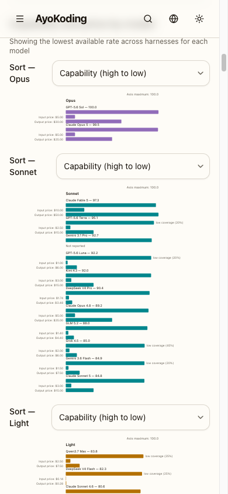
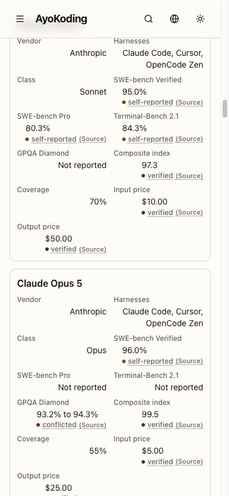
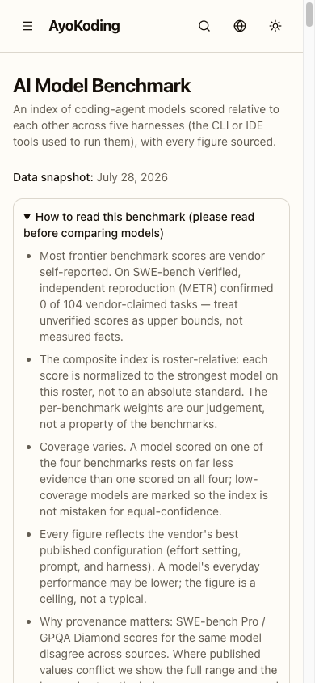
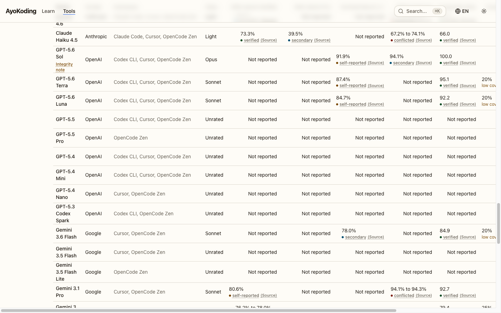

# Business Requirements — AI Benchmark Responsive Overhaul

## Business goal

Make the AI Model Benchmark page usable on the device most of its readers actually hold, and stop
it misbehaving on the device its author reviews it from. The page's whole value proposition is
"compare model capability against model price at a glance"; today that glance costs 2.5 screens of
scrolling before the first chart pixel, then lands on labels rendering at 4-5 CSS px.

## Business rationale

The AI benchmark tool is AyoKoding's most externally-linkable artefact — a standalone comparison
surface that a reader reaches directly rather than through the course navigation. Two prior plans
invested heavily in its **data honesty** (evidence grades, source links, conflicted-figure ranges,
integrity notes, an explicit coverage ratio). None of that honesty reaches a reader who cannot read
the numbers.

The defect that prompted this plan was reported in one sentence by the user:

> "the chart view is too small, and it looks like a wall of text"

The user then chose a **full responsive re-look** across all breakpoints rather than a mobile-only
patch, because live diagnosis showed the same single root cause producing an _opposite_ defect on
desktop, and a second, previously unreported desktop bug alongside it.

### Why the capability taxonomy is renamed at the same time

A second, smaller correction rides along: the third rated capability class is renamed from `light`
to `haiku`, so the rated set reads **opus / sonnet / haiku**.

The page's capability classes are defined against two **anchor models** — Claude Opus 5 and Claude
Sonnet 5 — and two of the three rated class names are simply those models' tier names
`[Repo-grounded]` (`core/bands.ts:7-10`). The third was `light`, which is not a tier name at all
but a weight adjective. That inconsistency costs the reader real interpretive work at the exact
moment the page is asking them to compare: "Light" reads as a claim about a model's _size_ or
_speed_, when the class actually means nothing more than "rated, but below the Sonnet anchor". Two
of three names say "here is the tier"; the third says "here is a size", and a reader has no way to
know the two are the same kind of statement without reading the legend.

Renaming it to `haiku` completes the vocabulary from the family the anchors already come from. The
class list becomes self-explaining, the legend gloss stops carrying the whole burden of the
distinction, and the page's honesty surface reads as one deliberate taxonomy rather than two names
plus an improvisation. Nothing about which models fall in which class changes — this is a naming
correction, not a re-rating. See
[`tech-docs.md` §DD-35](./tech-docs.md#dd-35--the-capability-class-rename-light-to-haiku).

## Measured evidence (live, 2026-07-31, Playwright, `en` locale)

All figures below are `[Repo-grounded]` where they cite a source line, and measured-live otherwise.
The four screenshots are committed under [`assets/`](./assets/).

### R1 — scale-coupled SVG typography

`apps/ayokoding-www/src/features/ai-benchmark/shell/benchmark-chart.tsx` renders each band as
`<svg viewBox="0 0 640 {plotHeight}" className="w-full">` with `const SVG_WIDTH = 640` (line 46)
`[Repo-grounded]`. Rendered width varies with viewport, so the entire SVG — including every
`<text>` — scales uniformly:

| viewport | chart px | scale | 10px label renders | 9px price renders | 12u bar renders |
| -------- | -------- | ----- | ------------------ | ----------------- | --------------- |
| 320      | 273      | 0.427 | 4.27px             | 3.84px            | 5.12px          |
| 390      | 343      | 0.536 | 5.36px             | 4.82px            | 6.43px          |
| 768      | 721      | 1.127 | 11.27px            | 10.14px           | 13.52px         |
| 1280     | 1120     | 1.750 | 17.50px            | 15.75px           | 21.00px         |
| 1440     | 1120     | 1.750 | 17.50px            | 15.75px           | 21.00px         |

**One root cause, two opposite defects.** Below `md` the chart is illegible. At `lg` and above the
chart labels render at 17.5px — **larger than the page's own body text** (`text-sm` = 14px on the
subtitle, `text-base` = 16px on the card headings) — inverting the type hierarchy so the least
important text on the page is the largest. The declared Tailwind `text-[10px]` / `text-[9px]`
classes are effectively meaningless: rendered size is a function of viewport width, not of the
class.

### R2 — fixed left gutter eats mobile plot width

`PLOT_X = 180` (line 47) of `SVG_WIDTH = 640` reserves **28%** of chart width for right-anchored
price labels (`x={PLOT_X - 8}`, `textAnchor="end"`, lines 206-232) `[Repo-grounded]`. At a 320px
viewport that is a 77px gutter, leaving 137px of actual plot.

### R3 — mobile roster has no progressive disclosure (the "wall of text")

`shell/model-table.tsx` lines 332-365 `[Repo-grounded]`: the `md:hidden` mobile branch renders
**all 11 fields** (vendor, harnesses, class, four benchmark columns, index, coverage, input price,
output price) for **all 38 models**, unconditionally, each with an evidence badge and a `(Source)`
link. Measured at 390px: ~415px per card x 38 = **~15,800px of a 19,707px page — 80% of the whole
document**.

The card's own internal layout compounds it: `<dt>` is left-aligned while `<dd className="text-right">`
is right-aligned inside a two-column grid, producing a zig-zag scan pattern down every card.

#### R3b — the density of the card's own field content

R3 has **two independent dimensions**, and collapsing the card addresses only the first:

1. **Length and scan axis** — how tall the card is and how the eye travels down it. Addressed by
   [DD-28](./tech-docs.md#dd-28--roster-summary-card-plus-per-card-disclosure): a summary card plus a
   per-card `
`, with both `<dt>` and `<dd>` left-aligned.
2. **Density and typographic rhythm of the content itself** — how the fields read _once revealed_.
   **Not** addressed by DD-28: collapsing changes what is visible by default, and changes nothing
   about the block a reader lands on the moment they open the disclosure. Addressed by
   [DD-34](./tech-docs.md#dd-34--the-expanded-cards-field-density).

The user reported this second dimension directly, on the live card: **"too cramped"** and **"hard to
read"**. Four defects produce it, each verified against the current source `[Repo-grounded]`:

| #    | Defect                                                                                                                                                                                                                                                                                                                                                                                |
| ---- | ------------------------------------------------------------------------------------------------------------------------------------------------------------------------------------------------------------------------------------------------------------------------------------------------------------------------------------------------------------------------------------- |
| DN-1 | **The label out-weights its own value.** `<dt>` is `text-xs font-medium text-muted-foreground` — 12px at weight 500 (line 356) — while `<dd>` is `text-sm` at the inherited weight 400 (line 357). A 2px size gain against a weight loss is not separation; label and value compete.                                                                                                  |
| DN-2 | **Three lines per graded field.** `figure-cell.tsx` line 36 is `inline-flex flex-col`, so every graded figure stacks value over evidence badge, under its own label line. The badge line carries a coloured dot, an underlined link, and a parenthesised `(Source)` — as visually loud as the number it qualifies.                                                                    |
| DN-3 | **No field grouping.** Lines 338-344 build one flat 11-entry array. Those eleven fields are four distinct semantic groups — metadata (vendor, harnesses, class), measured data (the four benchmark columns), derived figures (composite index, coverage), and commercial figures (input price, output price) — rendered as one equal-weight run with nothing for the eye to chunk on. |
| DN-4 | **Absent figures at full weight.** An unpublished figure renders as a full field slot carrying `aiBenchNoFigure` (lines 85, 104, 190), identical in weight to a real figure. The user's own screenshot shows three such slots across two cards.                                                                                                                                       |

Under DD-28's single-column card the eleven fields stack as up to **30 text line boxes** (three
plain fields at two lines each, eight graded fields at three) — arithmetic derived from the markup
shape above, not a live measurement. BS-8 is the measured signal that closes it.

### R4 — ~1,800px of prose above the chart

`shell/how-to-read.tsx` renders a `
` (774px measured) plus an always-expanded legend
(four classes + five grades + the coverage formula, ~1,000px) plus a Sources list, and
`benchmark-content.tsx` line 94 places all of it **above** the chart `[Repo-grounded]`. The first
chart pixel lands at **y=2127** on a 390px viewport — about 2.5 full screens of scrolling before
any chart is visible.

### R5 — desktop horizontal page overflow (previously unreported, fix-caused)

`shell/model-table.tsx` line 269 `[Repo-grounded]`: `wrapperClassName="lg:overflow-visible"`, added
by the PR #122 sticky-`<thead>` fix (see the explanatory comment at lines 262-267). The table's
intrinsic width is **1625px at `lg`** — it is not a single constant, because column text wraps
differently by available width: the same table measures **1700px at `md`** (see the `md` paragraph
below). At `lg` the wrapper computes `overflow-x: visible`, so the table does not
scroll inside its wrapper — it bleeds past the viewport and **makes the entire document scroll
horizontally**:

- 1280px viewport → `document.documentElement.scrollWidth` = **1698**
- 1440px viewport → `scrollWidth` = **1778**

At `md` (768) the wrapper is still `overflow-x: auto`, so it scrolls internally instead — a 1700px
table inside a 721px wrapper, with roughly 58% of the table's width hidden behind a horizontal
scroll — `(1700 - 721) / 1700 ≈ 57.6%`, derived from the `md` figure, not the `lg` one.

This is a **fix-caused regression** and therefore lands with a reproducing test per the
[Regression Test Mandate](../../../repo-governance/development/quality/regression-test-mandate.md).

### Additional accessibility finding

The `(Source)` links inside `shell/evidence-badge.tsx` render **17px tall**, below WCAG 2.5.8
Target Size (Minimum)'s 24x24 CSS px `[Web-cited]`. Every figure cell on the page carries one, so
the finding repeats across hundreds of targets.

> WCAG 2.2 Success Criterion 2.5.8 Target Size (Minimum), Level AA: "The size of the target for
> pointer inputs is at least 24 by 24 CSS pixels" — <https://www.w3.org/WAI/WCAG22/Understanding/target-size-minimum.html>
> (accessed 2026-07-31).

## Business impact

### Pain points this removes

| #    | Pain                                                                                                                                                                                                                                |
| ---- | ----------------------------------------------------------------------------------------------------------------------------------------------------------------------------------------------------------------------------------- |
| BP-1 | A mobile reader cannot read the chart at all — the page's primary artefact is functionally absent below `md`                                                                                                                        |
| BP-2 | A mobile reader must scroll ~2.5 screens of prose before reaching anything comparative                                                                                                                                              |
| BP-3 | A mobile reader scrolls ~15,800px of undifferentiated field cards to find one model                                                                                                                                                 |
| BP-4 | A desktop reader gets an unexpected horizontally-scrolling document, which reads as a broken page                                                                                                                                   |
| BP-5 | A desktop reader sees the page's least important text rendered as its largest text                                                                                                                                                  |
| BP-6 | A touch reader cannot reliably hit the `(Source)` links that carry the page's entire evidence-honesty proposition                                                                                                                   |
| BP-7 | A mobile reader who expands a model gets the same cramped, ungrouped, three-lines-per-field block back — so the disclosure control buys length, not readability (R3b)                                                               |
| BP-8 | Any reader meets a three-name class list in which two names are model tiers and the third, "Light", is a size adjective — so the class column reads as two kinds of claim at once and the legend has to carry the whole distinction |

### Expected benefits

- The chart becomes readable on the device class where it is currently unreadable, restoring the
  page's stated value proposition below `md`.
- The roster becomes scannable: a reader compares 38 models by name, class, index, and price
  without expanding anything, and expands only the model they care about.
- Expanding a model is worth doing: its figures read as two labelled groups on a shared label rail,
  with each value out-ranking its own label and unpublished figures folded into one trailing line —
  so the disclosure reveals a readable panel rather than the same cramped block (R3b).
- The desktop page stops exhibiting a defect that reads as "this site is broken".
- The page's evidence links become operable by touch, which is what makes the honesty surface
  actually usable rather than merely present.
- The capability classes read as one consistent set of tier names (opus / sonnet / haiku), so the
  class column is self-explaining rather than needing the legend to reconcile two kinds of name.

## Affected roles

Solo-maintainer repository — these are hats the maintainer wears and agents that consume the files,
not sign-off parties.

| Role                       | Interest                                                                                      |
| -------------------------- | --------------------------------------------------------------------------------------------- |
| AyoKoding reader (mobile)  | The primary beneficiary — every one of R1-R4 is a mobile defect                               |
| AyoKoding reader (desktop) | R1's upper half and R5                                                                        |
| Maintainer as frontend dev | Owns `features/ai-benchmark/shell/`; inherits a simpler single-rendering-path chart           |
| Maintainer as reviewer     | Reviews two PRs; the first is deliberately small so the live defect leaves production quickly |
| `swe-ui-checker` agent     | Consumes the resulting components for WCAG and design-system conformance                      |
| `web-design-tester` agent  | Runs the Rule-15 retest against the live result across both locales                           |
| `plan-checker` agent       | Validates this plan's structure before execution                                              |

## Business-level success signals

These are the observable signals that this plan achieved its goal. Where a target is a judgment
rather than a measurement, it is labelled as such.

| #    | Signal                                                                                                                                                                 | How it is observed                                                                                                                                                                                                                                                                             |
| ---- | ---------------------------------------------------------------------------------------------------------------------------------------------------------------------- | ---------------------------------------------------------------------------------------------------------------------------------------------------------------------------------------------------------------------------------------------------------------------------------------------- |
| BS-1 | No chart text renders below the page's own smallest body-text size at any breakpoint                                                                                   | Observable fact — computed `font-size` read live via Playwright at 320/390/768/1280/1440                                                                                                                                                                                                       |
| BS-2 | No chart text renders above the page's own body-text size at any breakpoint                                                                                            | Observable fact — same measurement                                                                                                                                                                                                                                                             |
| BS-3 | `document.documentElement.scrollWidth <= clientWidth` at every named breakpoint, both locales                                                                          | Observable fact — asserted in an e2e test and re-verified live                                                                                                                                                                                                                                 |
| BS-4 | The first chart pixel is above the fold at 390px                                                                                                                       | Observable fact — element bounding box read live, compared against viewport height                                                                                                                                                                                                             |
| BS-5 | Collapsed mobile roster height is a small fraction of today's ~15,800px                                                                                                | Observable fact — measured live; _Judgment call_: "small fraction" is deliberately not a fabricated percentage target, since the honest measurement is taken after the change, not predicted before it                                                                                         |
| BS-6 | Every interactive target on the page measures at least 24x24 CSS px                                                                                                    | Observable fact — bounding boxes read live across both locales                                                                                                                                                                                                                                 |
| BS-7 | Zero rule-15 EWT/UWT/DWT defect findings remain unfixed at archival                                                                                                    | Observable fact — the retest checklist in `delivery.md`                                                                                                                                                                                                                                        |
| BS-8 | An **expanded** roster card at 390px renders shorter than today's always-expanded card, and its field values out-rank their labels on size, weight, and colour at once | Observable fact — the expanded card's bounding-box height read live against R3's measured ~415px per-card baseline, plus the computed `font-size` and `font-weight` of a `<dt>` and its `<dd>` read live in both locales (AC-61, AC-62)                                                        |
| BS-9 | The class filter's visible options read Opus / Sonnet / Haiku / Unrated in **both** locales, and the word "Light" or "Ringan" appears nowhere on the rendered page     | Observable fact — the class selector's option labels read live via Playwright at 390px and 1280px in `en` and `id` (Phase 10's DD-35 taxonomy verification), plus the delivery sweeps that assert zero surviving band-sense `light` in source while the light-**theme** references still stand |

## Business-scope non-goals

| #    | Non-goal                                                                                                                                                                                                                                                                         |
| ---- | -------------------------------------------------------------------------------------------------------------------------------------------------------------------------------------------------------------------------------------------------------------------------------- |
| BN-1 | Growing the dataset — no new model, benchmark, price, or operator                                                                                                                                                                                                                |
| BN-2 | Changing what the page _claims_ about evidence quality — the honesty content is preserved verbatim, only its placement and disclosure state change                                                                                                                               |
| BN-3 | A design-system-wide responsive overhaul — this plan changes one feature, not `libs/web-ui`. Its one library edit is confined to `libs/web-ui-token/src/ayokoding.css`, where DD-35 renames three `--chart-band-light*` custom properties without changing a single colour value |
| BN-4 | Analytics, telemetry, or any measurement of real reader behaviour                                                                                                                                                                                                                |

## Business risks and mitigations

| #    | Risk                                                                                                                                                                                                                                                          | Mitigation                                                                                                                                                                                                                                                                                                                                                                                                                                                                                                   |
| ---- | ------------------------------------------------------------------------------------------------------------------------------------------------------------------------------------------------------------------------------------------------------------- | ------------------------------------------------------------------------------------------------------------------------------------------------------------------------------------------------------------------------------------------------------------------------------------------------------------------------------------------------------------------------------------------------------------------------------------------------------------------------------------------------------------ |
| BR-1 | Collapsing the honesty prose reduces how prominently the page discloses that most scores are vendor-self-reported                                                                                                                                             | D3 keeps one always-visible honesty line; AC-32 is reworded to bind to that exact line rather than being weakened to a vaguer claim                                                                                                                                                                                                                                                                                                                                                                          |
| BR-2 | Collapsing roster fields hides figures a reader previously saw without interaction                                                                                                                                                                            | W-30 extends the existing W-26 parity invariant: the collapsed summary plus its expanded details render the identical figure set                                                                                                                                                                                                                                                                                                                                                                             |
| BR-3 | Replacing the SVG chart discards regression guards (DWT-001, DWT-004) that document real past defects                                                                                                                                                         | DD-31 retires them explicitly as SVG-geometry concerns and names the replacement guards, rather than silently dropping them                                                                                                                                                                                                                                                                                                                                                                                  |
| BR-4 | Reversing a signed-off prior decision may repeat itself if only the code changes                                                                                                                                                                              | DD-26 records the reversal and the _verification gap_ that let it pass — evidence checked content PRESENCE, not rendered LEGIBILITY                                                                                                                                                                                                                                                                                                                                                                          |
| BR-5 | Temporarily losing the sticky `<thead>` at `lg` between Unit 1 and Unit 2                                                                                                                                                                                     | Unit 1 documents the trade explicitly and Unit 2 restores it once the table genuinely fits; the loss is strictly better than a horizontally scrolling document                                                                                                                                                                                                                                                                                                                                               |
| BR-6 | Two PRs touching `model-table.tsx` in sequence create a rebase                                                                                                                                                                                                | The delivery boundaries are declared up front and Unit 2 rebases on Unit 1 as an explicit gate step                                                                                                                                                                                                                                                                                                                                                                                                          |
| BR-7 | Folding unpublished figures into one shared line could be read as _removing_ them, weakening the page's honesty claim                                                                                                                                         | DD-34 keeps every absent field's label as a real `<dt>` and the "Not reported" phrase as a real `<dd>` they share — a regrouping, not a deletion. AC-64 asserts the shape and AC-54's existing parity test is untouched                                                                                                                                                                                                                                                                                      |
| BR-8 | Renaming the class also renames the `class` and `sortHaiku` URL parameters with **no** back-compatibility alias, so any link already shared with `class=light` or `sortLight` resolves to the unfiltered default rather than the view it captured             | Accepted deliberately and recorded as reversible in DD-35: the page shipped 2026-07-30, one day before this plan, so the URL space has no meaningful install base; `sanitizeState` already degrades an unknown value to the default rather than erroring (AC-26), so a stale link renders a working page; and AC-67 asserts that degradation directly instead of leaving it implied. If a stale link ever matters, the alias is a localized addition to `classAsBand`/`decodeState` plus one round-trip test |
| BR-9 | The word `light` also names the **light theme**, so a careless global substitution would rename a theme reference — most damagingly the `\| light \|` row of the feature file's `\| theme \|` Examples table, silently dropping light-theme contrast coverage | The delivery sweeps assert **both** directions: three band-sense sweeps must print `0` and two theme-sense checks must still print their expected non-zero counts, so over-renaming fails as loudly as under-renaming. DD-35 enumerates the three protected sites by name                                                                                                                                                                                                                                    |

## Related

- [`prd.md`](./prd.md) — the testable scenarios these business claims map to.
- [`tech-docs.md`](./tech-docs.md) — the design decisions and the prior-decision reversal record.
