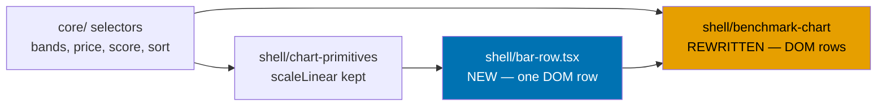
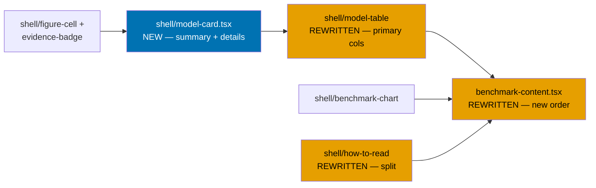
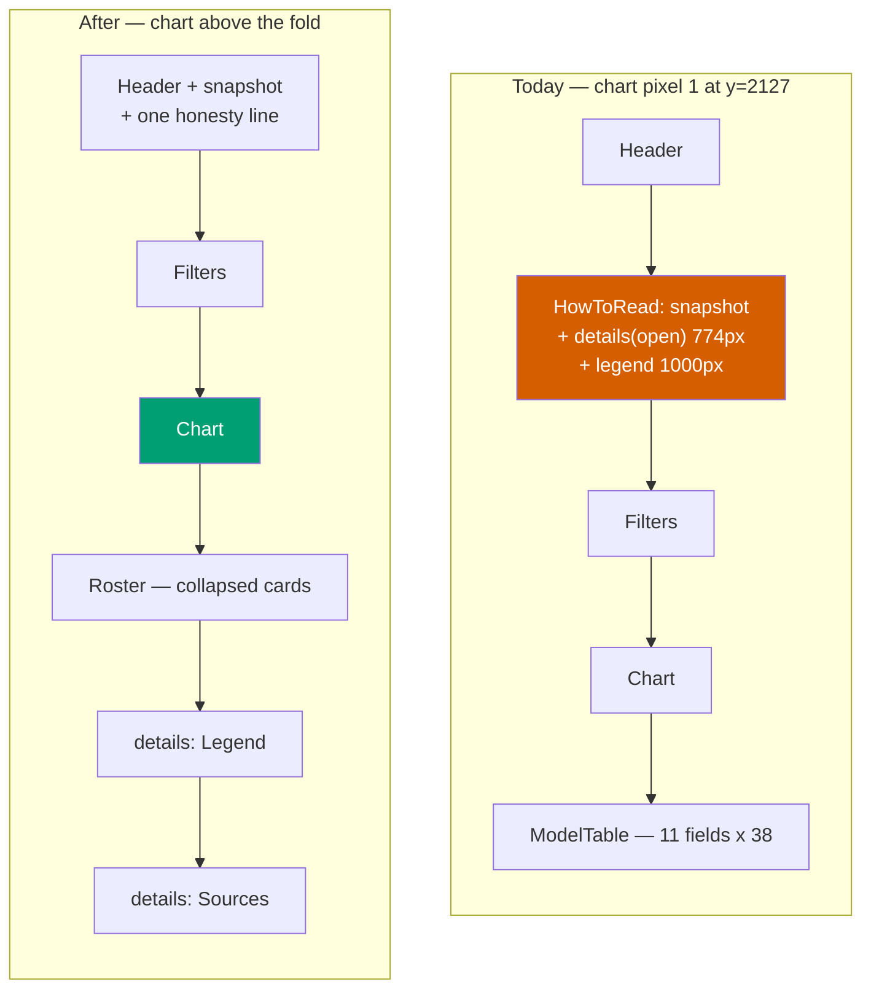
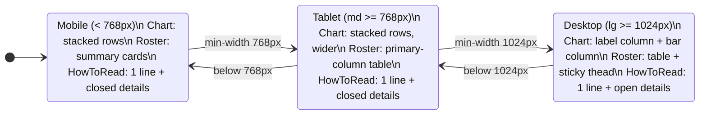
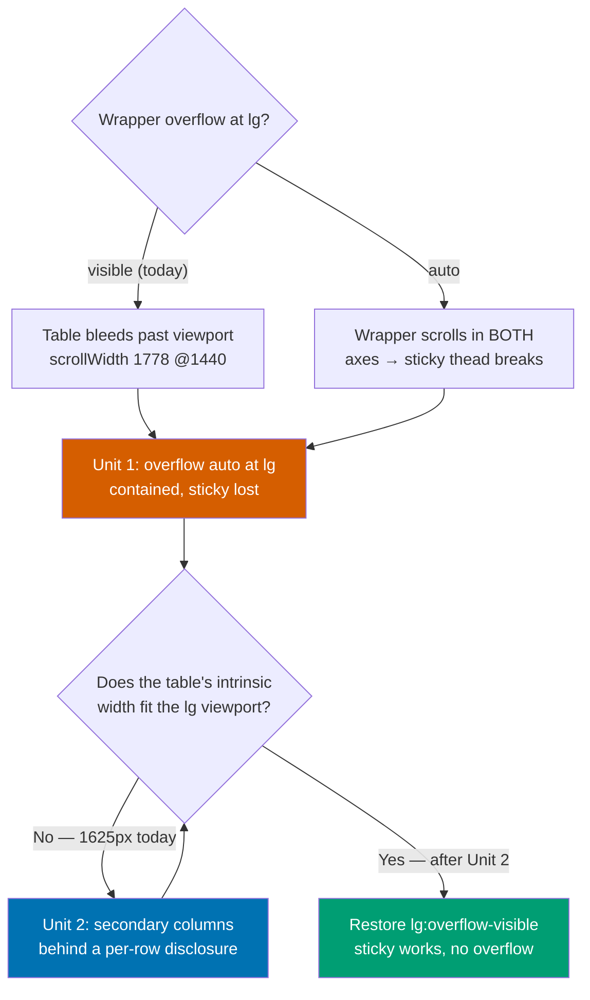
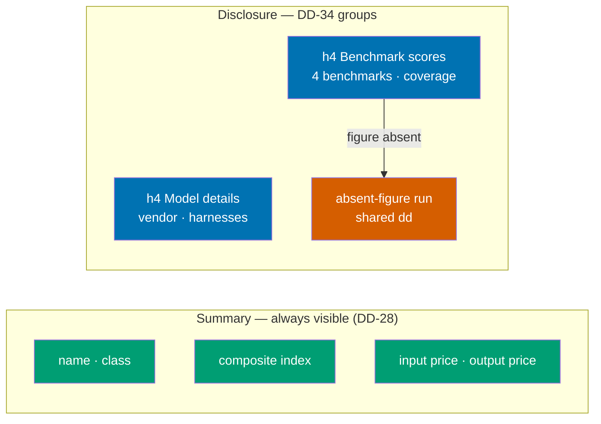

# Technical Documentation — AI Benchmark Responsive Overhaul

## Architecture

The `ai-benchmark` feature keeps its **functional core / imperative shell** split unchanged. This
plan touches only `shell/` plus the page composition, and adds nothing to `core/` beyond a reuse of
the existing `scaleLinear`.

### Component interactions — chart pipeline



### Component interactions — roster and page



### Page composition — before and after



### Responsive reflow — breakpoint state machine



### R5 fix — the two-step sequence



### Delivery-unit dependency DAG

```mermaid
%% Dependency position of each phase; boundary phases marked. Independent nodes could fan out, but
%% every node here shares model-table.tsx or benchmark-content.tsx, so the chain is serial.
flowchart TB
  P0["Phase 0<br/>setup + baseline<br/>NO PR"] --> P1["Phase 1<br/>R5 fix + regression test<br/>UNIT 1 BOUNDARY — PR #1"]
  P1 --> P2["Phase 2<br/>design funnel completion"]
  P2 --> P3["Phase 3<br/>capability-class rename<br/>light to haiku (DD-35)"]
  P3 --> P4["Phase 4<br/>chart primitives migration"]
  P4 --> P5["Phase 5<br/>DOM bar row + chart rewrite"]
  P5 --> P6["Phase 6<br/>roster card + column reduction<br/>+ card density (DD-34)<br/>+ restore sticky"]
  P6 --> P7["Phase 7<br/>composition reorder + AC-32"]
  P7 --> P8["Phase 8<br/>a11y + live criteria"]
  P8 --> P9["Phase 9<br/>spec coverage audit"]
  P9 --> P10["Phase 10<br/>live Playwright verification"]
  P10 --> P11["Phase 11<br/>rule-15 three-tester retest"]
  P11 --> P12["Phase 12<br/>PR finalization + review cycle"]
  P12 --> P13["Phase 13<br/>Knowledge Capture"]
  P13 --> P14["Phase 14<br/>archival + merge<br/>UNIT 2 BOUNDARY — PR #2"]

  style P1 fill:#D55E00,color:#FFFFFF
  style P3 fill:#0072B2,color:#FFFFFF
  style P14 fill:#009E73,color:#FFFFFF
  style P0 fill:#CC79A7,color:#000000
```



---

## Which gates are real

**HARD constraint for every acceptance criterion in `delivery.md`.** `apps/ayokoding-www` declares
two targets that are `echo` no-ops `[Repo-grounded]`, verified in
`apps/ayokoding-www/project.json`:

| Target                           | Reality                                                                                   |
| -------------------------------- | ----------------------------------------------------------------------------------------- |
| `ayokoding-www:test:e2e`         | **NO-OP** — `echo 'no-op: target not applicable for this project'`. Never cite as a gate. |
| `ayokoding-www:test:integration` | **NO-OP** — `echo 'no-op: integration tier not used for this content app'`. Never cite.   |

The real gates are:

| Target                                    | Reality                                                                                                                                        |
| ----------------------------------------- | ---------------------------------------------------------------------------------------------------------------------------------------------- |
| `ayokoding-www:typecheck`                 | `tsc --noEmit`                                                                                                                                 |
| `ayokoding-www:lint`                      | `npx oxlint@latest --jsx-a11y-plugin .`                                                                                                        |
| `ayokoding-www:test:unit`                 | Vitest, `unit` + `unit-fe` projects                                                                                                            |
| `ayokoding-www:test:coverage`             | Vitest with `--coverage.thresholds.lines=82`                                                                                                   |
| `ayokoding-www:test:quick`                | typecheck + lint + test:unit + test:coverage + test:specs (which itself runs specs:structure-validation + specs:behavior:coverage), sequential |
| `ayokoding-www:specs:behavior:coverage`   | `rhino-cli specs behavior-coverage validate` — every scenario needs a `@covers` binding                                                        |
| **`ayokoding-www-fe-e2e:test:e2e`**       | **REAL Playwright** via `playwright-bdd` (`npx bddgen && npx playwright test`)                                                                 |
| `ayokoding-www-fe-e2e:specs:e2e:coverage` | `rhino-cli specs e2e-coverage validate --project ayokoding-www-fe-e2e`                                                                         |

Every `@e2e`-tagged scenario in this plan therefore binds in
`apps/ayokoding-www-fe-e2e/src/steps/ai-benchmark.steps.ts`, which already exists (323 lines)
`[Repo-grounded]`, and runs under the **`ayokoding-www-fe-e2e`** project — never under
`ayokoding-www`'s own stub.

**The e2e project boots the standalone build, not the dev server.**
`apps/ayokoding-www-fe-e2e/playwright.config.ts` declares a `webServer` whose command copies
`.next/static` and `public` into `.next/standalone/` and then runs
`node apps/ayokoding-www/.next/standalone/apps/ayokoding-www/server.js`, against
`baseURL: http://localhost:3101` with `reuseExistingServer: true` `[Repo-grounded]`. Consequently
**`npx nx run ayokoding-www:build` must succeed before any e2e run**, and every e2e acceptance
command in `delivery.md` is written as
`npx nx run ayokoding-www:build && npx nx run ayokoding-www-fe-e2e:test:e2e`. Locally the config
also runs firefox and webkit projects in addition to chromium (CI runs chromium only), so a
locally-green e2e run is a stricter signal than CI's.

**Precedent for the R5 assertion**: `apps/ayokoding-www-fe-e2e/src/steps/cost-of-living-calculator.steps.ts`
lines 2064-2065 already do exactly this `[Repo-grounded]`:

```ts
const scrollWidth = await page.evaluate(() => document.documentElement.scrollWidth);
expect(scrollWidth).toBeLessThanOrEqual(320);
```

AC-52 reuses this pattern at 320/390/768/1280/1440 across both locales.

---

## Design decisions

### DD-25 — HTML/CSS bars replace the SVG chart at every breakpoint

**Decision**: `shell/benchmark-chart.tsx` stops emitting `<svg>`. Each rated model row becomes DOM:
a text label, then one track `div` per bar containing a fill `div` whose `style.width` is a
percentage.

**Rationale**: the root cause of R1 is that a `viewBox` establishes a user-coordinate system which
CSS then scales uniformly to the element's rendered width. Every `<text>` inside it scales with it,
so a declared `text-[10px]` is a _ratio_, not a size. The only way to have text that honours its
declared size is for the text not to live inside a scaled coordinate system. Once the text is out,
the bars have no reason to stay in — a `<div>` with `width: 62%` is strictly simpler than a `<rect>`
with a computed `width` attribute.

**Reuse, not replacement, of the scale**: `scaleLinear` in `shell/chart-primitives.tsx` is called
with `pixelWidth = 100`, so it returns a percentage directly. Its existing contract (monotonic,
degenerates to always-zero for a non-positive `domainMax`) is unchanged and its existing unit tests
still apply.

**FCIS compliance**: the percentage is a pure function of dataset values and `COMPOSITE_INDEX_MAX`
(from `core/score.ts`). No literal score, price, model name, or class threshold enters `shell/`.
The only inline `style` is the computed width, which Tailwind cannot express dynamically — this is
the standard escape and is documented at the call site.

**Consequences**:

- `SVG_WIDTH`, `PLOT_X`, `PLOT_WIDTH`, `MARKER_FONT_SIZE`, `MARKER_GAP`, `MARKER_CHAR_WIDTH_RATIO`,
  `MARKER_SAFETY_BUFFER`, `WORST_CASE_MARKER_LENGTH`, `MARKER_MIN_MARGIN`, `ROW_HEIGHT`,
  `BAR_HEIGHT`, `BAR_GAP`, `HEADER_LABEL_Y_OFFSET`, `BAND_HEADER_HEIGHT`, and `TOP_MARGIN` are all
  deleted from `benchmark-chart.tsx`.
- `computeLayout`'s `headerY` / `rowTop` / `plotHeight` arithmetic is deleted; ordinary CSS flow
  replaces it.
- `Bar`, `Axis`, `BandGroup`, `TickRow` in `chart-primitives.tsx` lose their only consumer. See
  DD-32 for their disposition.
- AC-36, AC-46, AC-47 are reworded (AC-47 inverted) — see `prd.md`.

### DD-26 — reversing the identical-DOM responsive strategy

**This decision reverses a signed-off prior decision head-on.**

`plans/done/2026-07-30__ayokoding-www-ai-benchmark-merged-chart/prd.md` §"Responsive strategy —
mobile-first, per breakpoint" (lines 206-225) `[Repo-grounded]` states:

> the selected design uses **the identical DOM structure at every breakpoint** — mobile, tablet,
> and desktop all render the same stacked-bar row; only the `viewBox`-scaled bar length changes

and

> **Neither the merged chart, nor its per-band sort dropdown, ever becomes horizontally scrollable
> or switches to a different layout at any breakpoint.** This is the responsive strategy itself,
> not a finishing touch

That plan also recorded (lines 212-214) that this was "a deliberate simplification versus those two
charts and `model-table.tsx`, all three of which currently render two parallel DOM blocks (mobile
vs. desktop/tablet) toggled by CSS."

**Why it is reversed**: the identical-DOM property is not a neutral simplification. Combined with a
`viewBox`, it _is_ the mechanism that couples typography to viewport width. A single DOM tree whose
only responsive lever is a uniform scale factor cannot have breakpoint-independent typography —
those two properties are mutually exclusive by construction. The prior plan chose the first; this
plan chooses the second, because a chart whose text is unreadable at 320px and oversized at 1440px
does not serve any reader at either end.

**What replaces it**: a single DOM tree that reflows via CSS grid at `lg` and never scales. Note
this is _not_ a return to "two parallel DOM blocks" — the selected Option A2 renders one tree whose
grid template changes, so there is still exactly one rendering path to maintain, just not one
whose only variable is scale.

**The verification gap — the lesson worth recording.** The prior decision was signed off on
evidence recorded at `plans/done/2026-07-30__ayokoding-www-ai-benchmark-merged-chart/delivery.md`
line 1392 `[Repo-grounded]`:

> pass at 320/375/768/1280/1440px for both locales — no content/... issue

That verification checked content **PRESENCE** at each breakpoint. It did not check rendered
**LEGIBILITY** — no computed `font-size` was read, no bounding box measured. Every element was
genuinely present at 320px; several were rendering at 4.3 CSS px. A screenshot at 320px scaled into
a review pane looks plausible when the defect is a factor-of-two type-size error.

This is why AC-49, AC-50, and AC-58 are written as computed-style and bounding-box assertions read
from the live page, not as presence assertions. It is also the primary candidate for this plan's
Knowledge Capture routing.

### DD-27 — R5 is fixed in two steps: contain, then shrink

**Decision**: Unit 1 changes `wrapperClassName="lg:overflow-visible"` so the wrapper contains its
own overflow at every breakpoint, accepting the loss of the sticky `<thead>` at `lg`. Unit 2 reduces
the table's intrinsic width below the `lg` viewport by moving secondary columns behind a per-row
disclosure, at which point `lg:overflow-visible` is restored — now safe, because a table that fits
cannot bleed.

**Why not one step**: R5 is live on production right now, causing a horizontally scrolling document
at every desktop width. The containment fix is a one-line change plus a regression test and can be
reviewed in minutes. The column reduction is a substantial redesign of `model-table.tsx` that has to
land with the roster card work to preserve W-26/W-30 parity. Coupling them keeps a visible
production defect alive for the whole plan.

**Why not just revert permanently**: reverting alone reintroduces exactly the defect PR #122 fixed
(the sticky `<thead>` never sticks, because `overflow-x: auto` forces `overflow-y` to compute to
`auto`, making the wrapper a scroll container in both axes and the sticky reference frame —
documented in `libs/web-ui/src/primitives/table/table.tsx` lines 6-14 `[Repo-grounded]`, per
[MDN `overflow-x`](https://developer.mozilla.org/en-US/docs/Web/CSS/overflow-x), accessed
2026-07-31 `[Web-cited]`). It also leaves ~58% of columns behind a horizontal scrollbar, which is
the tablet experience today and is not a target state.

**Why not `overflow-x: clip`**: `overflow: clip` does not create a scroll container, so sticky would
resolve against the viewport and work — but the clipped columns become genuinely unreachable, with
no scrollbar and no bleed. That trades a visible defect for silent data loss.

**The trade in Unit 1 is stated, not hidden**: between Unit 1 and Unit 2, the desktop table header
does not stick. That is strictly better than a horizontally scrolling document, and AC-59 exists so
the restoration in Unit 2 is a tested requirement rather than a hope.

### DD-28 — roster summary card plus per-card disclosure

**Decision**: below `md`, each model renders as a card whose always-visible summary carries name,
class, composite index, and price; the remaining figures live in a native `<details>`. At `md` and
above, the same split appears as a primary-column table row with an expandable detail row.

**Native `<details>`, not a JS accordion**: the page is server-rendered and works without client JS
today for everything except URL-state updates. `<details>`/`<summary>` gives correct
`aria-expanded` semantics, keyboard operation, and find-in-page expansion for free. `<summary>` also
gets the 24x24 tap-target treatment from DD-30.

**W-26/W-30 parity**: the existing `renderBenchmarkFigures` / `renderStaticFigures` helpers in
`model-table.tsx` `[Repo-grounded]` already produce one shared per-model figure list consumed by
both representations. That pattern is preserved and extended: the card's summary and its expanded
content are two slices of the same list, so parity is structural rather than asserted by
duplication.

**Alignment**: `<dt>`/`<dd>` both left-align. Today's right-aligned `<dd>` inside a two-column grid
produces the zig-zag scan the user described as a "wall of text".

**DD-28 decides the split; [DD-34](#dd-34--the-expanded-cards-field-density) decides the density of
what the split reveals.** Collapsing the card fixes its _collapsed_ height and its scan axis, and
nothing else — the moment a reader opens the `<details>`, the same undifferentiated block returns,
single-column now but otherwise byte-identical in typography, per-field line count, and ordering.
The two decisions are a pair and must be read together: DD-28 without DD-34 hides the density defect
behind a disclosure control rather than removing it.

### DD-29 — page composition and the AC-32 rewording

**Decision**: `benchmark-content.tsx` renders header (with snapshot date and one honesty line) →
filters → chart → roster → legend `<details>` → sources `<details>`.

**`how-to-read.tsx` carries three exports**: `HowToRead` (the always-visible snapshot date plus
AC-32's one always-visible honesty line, with the remaining how-to-read points behind their own
collapsible `<details>` — both regions live inside this one function, not two separate components),
and the `AiBenchLegend`/`AiBenchSources` disclosures that move below the roster. The component's
existing i18n keys are reused verbatim — **zero new translation strings** are needed for
the honesty line, because `aiBenchHowToVendorReported` already carries exactly the claim AC-32
names `[Repo-grounded]`.

**AC-32's rewording is a narrowing, not a weakening.** The old scenario asserted the whole
disclosure was visible without interaction. The new one asserts the specific claim — "most frontier
benchmark scores are vendor self-reported" — is visible without interaction, and adds a second step
requiring the rest to be reachable from that line's control. The claim under test is identical; the
guarantee is now precise about which element carries it.

**`lg`-only open state**: `HowToRead`'s collapsible remainder `<details>` renders `open` at `lg` and
above via a CSS-driven approach (`group-open:` plus an `lg:block` override) rather than a JS width
check, so there is no hydration mismatch. Desktop has the vertical budget; mobile does not.

> **2026-08-01 — Phase 12 PR review correction (finding F4)**: this section previously named two
> components, `HonestyLine` and `HowToReadDetails`, that were never implemented — the honesty line
> and the collapsible remainder both ended up as two regions inside one `HowToRead` function rather
> than as separate components, and this prose was never updated to match. Corrected above to name
> the actual shipped exports (`HowToRead`, `AiBenchLegend`, `AiBenchSources`).

### DD-30 — tap targets reach 24x24 CSS px

**Decision**: `evidence-badge.tsx`'s anchor gains vertical padding and a minimum block size so its
bounding box measures at least 24x24 CSS px, without changing its inline-flow appearance
disruptively. Every `<summary>` introduced by DD-28 gets the same treatment.

**Why not rely on the WCAG spacing exception**: SC 2.5.8 offers an exception when targets are
spaced such that a 24px circle centred on each does not intersect another. Adjacent figure cells in
a dense table cannot be relied on to satisfy that, and the exception is fragile under locale
changes (Indonesian grade words are longer). Sizing the target directly is the durable fix.

### DD-31 — retiring DWT-001 and DWT-004 as SVG-geometry concerns

Both are real, already-fixed defects documented in `benchmark-chart.tsx`'s own comments
`[Repo-grounded]`. Neither is being dismissed; both are being **superseded**, because the geometry
they guard ceases to exist.

| Defect      | What it was                                                                                                                                                          | Disposition under DD-25                                                                                                                                                                                                                                                                                                                                |
| ----------- | -------------------------------------------------------------------------------------------------------------------------------------------------------------------- | ------------------------------------------------------------------------------------------------------------------------------------------------------------------------------------------------------------------------------------------------------------------------------------------------------------------------------------------------------ |
| **DWT-001** | `PLOT_WIDTH` hardcoded, leaving too small a right margin, clipping the low-coverage marker text off the SVG's right edge                                             | **Retired as an SVG-geometry concern.** DOM text wraps or overflows visibly; it cannot be clipped by a `viewBox` edge because there is no `viewBox`. Replaced by AC-51 (the plot spans the full container) and a unit test asserting the low-coverage marker renders as a sibling element, not inside the bar track.                                   |
| **DWT-004** | Band-header baseline and first-row baseline derived from the same constant, so their gap could not exceed either text run's own ascent+descent, fusing the two lines | **Retired as an SVG-geometry concern.** Ordinary CSS block flow gives each element its own line box; two adjacent block elements cannot overlap without explicit negative margin or absolute positioning, neither of which the new markup uses. Replaced by a unit test asserting the band header and the first row are separate block-level siblings. |

Every other tagged defect is **preserved**, and each has an explicit guard step in `delivery.md`:

| Defect      | Concern                                                      | Preservation                                                                                                                |
| ----------- | ------------------------------------------------------------ | --------------------------------------------------------------------------------------------------------------------------- |
| **DWT-002** | Evidence colour routes through `--evidence-*` tokens         | `evidence-badge.tsx` and the coverage cell keep their token classes; DD-30 changes size, not colour                         |
| **DWT-003** | Table uses `libs/web-ui` primitives, not a bespoke `<table>` | The reduced-column table still composes `Table`/`TableHeader`/`TableBody`/`TableRow`/`TableHead`/`TableCell`/`TableCaption` |
| **UWT-001** | Unrated metered models show price as text                    | The unrated text list is carried over verbatim                                                                              |
| **UWT-002** | Each band's sort control sits directly above its own rows    | Each band's DOM region keeps its own adjacent sort control                                                                  |
| **UWT-005** | Coverage formula is stated                                   | Moves into the collapsed legend disclosure, content unchanged (AC-57)                                                       |
| **UWT-006** | Empty state hides the table                                  | Empty-state branch in `benchmark-content.tsx` is untouched                                                                  |
| **EWT-001** | No nested `<main>`                                           | The page root stays a `<div>`; no new landmark is introduced                                                                |
| **EWT-003** | Filter/sort race guarded by refs                             | `benchmark-content.tsx`'s ref guards are moved, not rewritten                                                               |
| **EWT-004** | `role="status"` on the empty state                           | Untouched                                                                                                                   |

### DD-32 — disposition of the now-unused SVG primitives

`chart-primitives.tsx` exports `bandSwatchClass`, `bandBarBgClass`, `bandInkTextClass`, `bandLabel`,
`scaleLinear`, `Legend` `[Repo-grounded]`.

| Export                                             | Disposition                                                                                                                                  |
| -------------------------------------------------- | -------------------------------------------------------------------------------------------------------------------------------------------- |
| `scaleLinear`, `bandLabel`, `bandSwatchClass`      | **Kept, reused** by the DOM chart                                                                                                            |
| `barFillClass`                                     | **Deleted** — the SVG `fill-` variant has no DOM equivalent; superseded by the DOM `bandBarBgClass` (`bg-[var(--chart-band-*)]`) sibling map |
| `bandInkFillClass`                                 | **Deleted** — superseded by the DOM `bandInkTextClass` (`text-[var(--chart-band-*-ink)]`) sibling map for the same reason                    |
| `Legend`                                           | **Kept** — consumed by `how-to-read.tsx`, unaffected                                                                                         |
| `Axis`, `Bar`, `BandGroup`, `TickRow`, `evenTicks` | **Deleted** — zero consumers after DD-25; their unit tests are deleted with them                                                             |

Deleting dead exports rather than leaving them is deliberate: `chart-primitives.test.tsx` and
`band-tokens.unit.test.ts` would otherwise keep them green forever with no production consumer,
which is exactly the shape of drift the module's own docstring warns about. `barFillClass` and
`bandInkFillClass` were initially left in place after the DOM rewrite deleted their only callers
(`delivery.md`'s Phase 5 REFACTOR note explicitly deferred that cleanup to a later maintainer
decision) — this table originally read "Replaced" for both while the code still carried them
unreferenced; the Phase 12 PR review (finding F1) flagged that mismatch, and both are now actually
deleted, bringing the table back in sync with the code.

### DD-33 — no new i18n keys unless genuinely new copy is introduced

Every string the overhaul needs already exists: `aiBenchHowToVendorReported` (the honesty line),
`aiBenchLegendHeading` and `aiBenchSourcesHeading` (the new disclosure summaries), the band and
grade labels, and the column labels for the card `<dt>`s `[Repo-grounded]`.

Three strings are genuinely new and MUST land in **both** `en` and `id`:

1. A `<summary>` label for the per-model roster disclosure (e.g. "All figures").
2. `aiBenchCardGroupModel` — the group heading over the card's vendor/harness fields (DD-34).
3. `aiBenchCardGroupScores` — the group heading over the card's benchmark figures and coverage
   (DD-34).

**Phase 7 resolution of the how-to-read remainder's `<summary>` label**: no new key was needed.
`aiBenchHowToSummary` — `"How to read this benchmark (please read before comparing models)"` (en)
/ `"Cara membaca tolok ukur ini (harap dibaca sebelum membandingkan model)"` (id) — was read live in
its new position (cycle 7.1's remainder `<details>`, after the always-visible honesty line moved
out) in both locales. It still reads correctly as a "click for more" affordance in both: the
sentence names exactly what expanding it does (read the rest of the how-to guidance before
comparing models), and nothing about its wording assumes it is the label for the WHOLE disclosure
rather than just the remainder — the honesty line it now sits beside states the one guaranteed
fact, and this label still accurately invites the reader into the rest of the how-to-read content.
The key is reused verbatim, unchanged, on the remainder `<details>`'s `<summary>`. What were keys 3
and 4 above (now keys 2 and 3) are unconditional and landed in Phase 6, in the key-before-consumer
order cycle 6.1 established.

**DD-34 adds no key for its absent-figure run**: the shared `<dd>` reuses the existing
`aiBenchNoFigure` verbatim (`"Not reported"` / `"Tidak dilaporkan"`, the `aiBenchNoFigure` key in
`translations.ts` — lines 68 and 477 as of this correction; cite the key name rather than these line
numbers for anything longer-lived, since insertions elsewhere in the file shift them)
`[Repo-grounded]`, and each collapsed field's `<dt>` reuses the column label key it already had.

### DD-34 — the expanded card's field density

**Paired with [DD-28](#dd-28--roster-summary-card-plus-per-card-disclosure).** DD-28 decides _what
is hidden_; DD-34 decides _how what is revealed reads_. DD-28 alone leaves the expanded content
byte-identical to today's card body, so a reader who opens a disclosure lands back on the block the
plan exists to fix.

#### The four density defects, each grounded

| #    | Defect                        | Grounding (`[Repo-grounded]`, current commit)                                                                                                                                                                                                            |
| ---- | ----------------------------- | -------------------------------------------------------------------------------------------------------------------------------------------------------------------------------------------------------------------------------------------------------- |
| DN-1 | Inverted label/value rank     | `model-table.tsx:356` `<dt className="text-xs font-medium text-muted-foreground">` vs `:357` `<dd className="text-right">`. The label is 12px at weight **500**; the value is 14px at the inherited weight **400**. The label out-weights its own value. |
| DN-2 | Three lines per field         | `figure-cell.tsx:36` `className="inline-flex flex-col items-start gap-0.5"` stacks value over badge, so `<dt>` + value + badge = three line boxes per graded field.                                                                                      |
| DN-3 | No field grouping             | `model-table.tsx:338-344` builds one flat 11-entry array (vendor, harnesses, class, four benchmark columns, index, coverage, input price, output price) rendered as one equal-weight run with no chunking affordance.                                    |
| DN-4 | Absent figures at full weight | `model-table.tsx:85`, `:104`, `:190` each render an absent figure as `<span data-slot="figure-cell-value">{t(locale, "aiBenchNoFigure")}</span>` — a full field slot, indistinguishable in weight from a real one.                                       |

Under DD-28's single-column, left-aligned card the eleven fields stack as up to **30 text line
boxes** (three plain fields at two lines each, eight graded fields at three) — arithmetic derived
from the markup shape above, not a measurement. The measured signal is `brd.md` §BS-8.

**Decision**: four concrete treatments, all confined to `shell/`.

#### Treatment 1 — typographic rank inversion is corrected (DN-1)

The value outranks its label on **three simultaneous encodings**, not one:

| Element              | Today                                          | DD-34                                                                 |
| -------------------- | ---------------------------------------------- | --------------------------------------------------------------------- |
| Field label `<dt>`   | `text-xs font-medium text-muted-foreground`    | `text-xs font-normal text-muted-foreground` (12px, 400)               |
| Field value `<dd>`   | `text-sm` (14px, inherited 400), right-aligned | `text-sm font-semibold text-foreground` (14px, 600)                   |
| Group heading `<h4>` | —                                              | `text-xs font-semibold uppercase tracking-wide text-muted-foreground` |
| Evidence badge       | unchanged classes                              | unchanged classes (see DWT-002 note below)                            |

Size 12→14, weight 400→600, and colour muted→foreground all move in the same direction, so the
label recedes into a scannable rhythm instead of competing. **The badge is not demoted** — reducing
its size or contrast would risk both WCAG AA text contrast and DD-30's 24x24 target; the separation
is produced entirely by promoting the value.

`text-xs` at 12px stays at or above the 12 CSS px floor AC-49 sets for chart labels, so no text on
the page drops below it.

#### Treatment 2 — a label rail, with the evidence badge inline (DN-2)

Each field becomes one grid row: `grid-cols-[6.5rem_1fr]` below `md`, widening to
`md:grid-cols-[9rem_1fr]` in the table's per-row detail region. `<dt>` occupies the rail, `<dd>` the
value column — **both left-aligned**, so the values share one left edge and the eye follows a single
vertical rule (this is the same anti-zig-zag property DD-28 already establishes for alignment; DD-34
adds the shared rail that makes it a rhythm rather than a ragged stack).

`figure-cell.tsx` gains a `layout` prop:

- `layout="stacked"` (**default**, unchanged) — `inline-flex flex-col`, kept for the desktop table,
  where stacking keeps column widths narrow and therefore keeps DD-27's "the table must fit"
  precondition true.
- `layout="inline"` — `inline-flex flex-row flex-wrap items-baseline gap-x-1.5`, used by the card
  and by the table's detail region, so value and badge flow on one baseline row and wrap together
  only when the run genuinely exceeds the column.

`flex-row` is written **explicitly** rather than relying on the flex default, so both the grep guard
in `delivery.md` and AC-62's computed-style assertion have an unambiguous falsifier. The coverage
cell (`model-table.tsx:131`, the same `inline-flex flex-col` shape) takes the same prop.

A field is therefore **one line** where it fits and two where the value+badge run wraps — never the
guaranteed three of today.

#### Treatment 3 — semantic grouping (DN-3)

The four semantic groups the flat list conflates map onto the DD-28 split as follows:



Each group is a `<section>` carrying an `<h4>` group heading followed by its own `<dl>`. Two
separate `<dl>`s rather than one, because a heading is **not** valid `<dl>` content: the element's
content model is groups of `<dt>` followed by `<dd>`, optionally wrapped in `<div>`, and nothing
else. `<h4>` is the correct level — the card's model name is already an `<h3>`
(`model-table.tsx:348`) `[Repo-grounded]` — so heading hierarchy stays unskipped, and because a
closed `<details>` hides its content from the accessibility tree, 38 collapsed cards add no heading
noise.

Coverage sits at the foot of **Benchmark scores** rather than in a group of its own, because
coverage is literally derived from those four figures (`core/score.ts`) — grouping it elsewhere
would assert a relationship the data does not have.

#### Treatment 4 — absent figures collapse into one shared-value run (DN-4)

Every benchmark figure the model did not publish is pulled out of the Benchmark-scores group and
emitted as a **single trailing name-value group with many terms and one shared value**:

```html
<dl>
  <div>
    <dt>SWE-bench Pro</dt>
    <dt>GPQA Diamond</dt>
    <dd>Not reported</dd>
  </div>
</dl>
```

This is the spec's own "multiple terms, single description" shape — MDN's `<dl>` reference gives
`Permitted content: … one or more <dt> elements followed by one or more <dd> elements` and an
example section titled "Multiple terms, single description" —
<https://developer.mozilla.org/en-US/docs/Web/HTML/Reference/Elements/dl> (accessed 2026-07-31)
`[Web-cited]`. Every `<dt>` and the shared `<dd>` are **direct children** of the `dl > div` wrapper
shown above — MDN's permitted-content rule requires exactly that, and a nested element wrapping only
the `<dt>`s (which an earlier revision of this fix used, to get them to visually run together) is
NOT permitted content, since it stops the `<dt>`s being direct children. The visual "one run" effect
is achieved without that wrapper: the `dl > div` is a two-column CSS grid (the same
`grid-cols-[6.5rem_1fr]` rail template Treatment 2 already applies to every reported figure's own
row); each `<dt>` is pinned to the label column (`col-start-1`, comma-separated, stacking one per
row), and the shared `<dd>` is pinned to the value column with an explicit `grid-row` span covering
exactly as many rows as there are absent labels, so it stays vertically centred beside the whole
stacked run. N absent figures still cost far less vertical space than N full field slots — one
shared row-height per label rather than one label-plus-value pair per label.

> **2026-08-01 — Phase 12 PR review correction (finding F3)**: the DWT-006 rail-alignment fix that
> introduced this collapsed run originally wrapped the `<dt>` run in its own `<div>` (inside the
> `dl > div` shown above) to get `flex flex-wrap` behaviour — which is exactly the "nested element
> wrapping only the `<dt>`s" case the permitted-content rule forbids, a defect this illustration
> never caught because it never showed that wrapper. `model-detail-disclosure.tsx` is fixed to the
> flattened grid structure described above; this illustration and prose now match what ships.

**Why parity survives (W-26 / W-30).** Nothing is removed from the DOM:

- every absent field's label is still a real `<dt>` node, so AC-54's label-set comparison against
  the desktop table row is unchanged;
- the `"Not reported"` value is still a real `<dd>` node, announced by assistive tech for each of
  the `<dt>`s that share it — this is exactly what a shared description means;
- the desktop table renders the identical set through the identical shared helper.

The change is one of **grouping**, not of presence: N identical values become one value shared by N
terms. A model with zero absent figures emits no such group at all.

**Scope**: the collapsed run covers the disclosure's benchmark figures only. An absent composite
index in the summary is DD-28's territory and is untouched here.

#### FCIS compliance

No literal score, price, model name, or threshold enters `shell/`. Group membership is a composition
over the existing shared figure list — vendor and harnesses in one group, `BENCHMARK_COLUMNS`
(already exported from `core/data/benchmarks.ts`) plus coverage in the other. The shared helper's
entries gain one boolean, `reported`, computed as `model.figures.some((f) => f.benchmark === id)`,
a pure predicate over data the shell already receives. Group headings are i18n keys (labels), not
data.

**The shared helper takes the layout as a parameter, not the caller.** `renderBenchmarkFigures` /
`renderStaticFigures` (hoisted in cycle 6.1's REFACTOR) accept `layout: "stacked" | "inline"` and
render accordingly. The **label set the helper produces is layout-independent**, which is the reason
AC-54's parity assertion cannot be weakened by this change: the parameter can only alter how a
figure is laid out, never whether it exists.

#### Preserved Rule-15 fixes

- **DWT-002** — the evidence dot and the low-coverage marker keep routing through
  `--evidence-verified` / `--evidence-self-reported` / `--evidence-secondary` /
  `--evidence-conflicted` (`evidence-badge.tsx:57-71`, `model-table.tsx:134`) `[Repo-grounded]`.
  DD-34 changes the badge's **position in flow**, never its colour, and colour is still never the
  sole encoding — the grade word remains visible text.
- **UWT-004** — the visible `({sourceLabel})` span (`evidence-badge.tsx:43-45`) survives the move
  to inline flow; it is carried, not dropped, because it is part of the badge's own markup rather
  than of the cell's layout.
- **DWT-003** — the desktop table still composes the `libs/web-ui` primitives; the detail region is
  a `TableRow`/`TableCell` pair, not a bespoke element.

#### Consequences

- `figure-cell.tsx` moves from unchanged to **MODIFIED** in §File impact.
- Two unconditional i18n keys land in Phase 6 (DD-33 items 3 and 4).
- AC-61..AC-64 are added; no existing scenario is reworded, inverted, or deleted by DD-34.
- Phase 9's scenario-count arithmetic moves from "+12" to "+16".

#### Alternatives considered

Recorded in full, with the decision table, in
[`prd.md` §Screen B (continued)](./prd.md#screen-b-continued--the-expanded-cards-field-density-dd-34).
The runner-up (Option B5, contrast-only) is the strict subset of this decision that applies
Treatments 1 and 2 and stops there; it was rejected because it leaves a 7-field flat run with
absent figures at full weight, which is DN-3 and DN-4 untouched.

---

### DD-35 — the capability-class rename, `light` to `haiku`

**Decision**: the third rated capability class is renamed from `light` to `haiku`, everywhere it is
named — the `Band` union in `core/bands.ts`, the `BANDS` list in `core/filter.ts`, the
`BAND_LABEL_KEYS` entry in `core/data/benchmarks.ts`, the per-band sort state and URL parameter in
`core/url-state.ts`, the three band class maps in `shell/chart-primitives.tsx`, the
`--chart-band-*` design tokens in `libs/web-ui-token/src/ayokoding.css`, the per-band testids, the
two i18n keys, the Gherkin step text, and both step-binding layers. The rated vocabulary becomes
**opus / sonnet / haiku**. `unrated` is untouched.

**Rationale**: two of the three rated classes already carry Anthropic model-tier names taken from
the two anchor models the bands are defined against (Claude Opus 5 and Claude Sonnet 5,
`core/bands.ts:7-10` `[Repo-grounded]`). `light` was the odd one out — a weight/brightness adjective
sitting in a list of proper nouns, which reads as a size descriptor ("lightweight model") rather
than as the tier below Sonnet. `haiku` completes the vocabulary from the same family the anchors
come from, so the class list is internally consistent and requires no gloss.

**This is a vocabulary change, not a semantic one.** The threshold logic in `assignBand` is
untouched: the third class is still "rated, but below the Sonnet anchor index". Only its name
changes. No model moves between classes, no figure changes, no ordering changes.

#### The i18n values become "Haiku" in BOTH locales

`aiBenchBandLight` renders `"Light"` in `en` and `"Ringan"` in `id` today `[Repo-grounded]`
(`translations.ts:62` and `:440`). The key becomes `aiBenchBandHaiku` and **both** values become
`"Haiku"`.

Dropping `"Ringan"` is deliberate, not an oversight, and is recorded here because a reviewer would
otherwise read it as a lost translation. `"Haiku"` is a **proper noun** — a model-tier name — exactly
like the neighbouring `aiBenchBandOpus: "Opus"` and `aiBenchBandSonnet: "Sonnet"`, which are already
byte-identical across `en` and `id` for the same reason. `"Ringan"` was the correct Indonesian
rendering of the retired **common-noun** sense of `light`; once the class is named after a model
tier, translating it would be as wrong as rendering `Opus` as `Karya`. The consequence is that
`chart-primitives.test.tsx:75-77`'s current assertion — that the third band's `id` label DIFFERS
from its `en` label — becomes false and is inverted to assert identity (delivery cycle 3.2).

The sibling key `aiBenchLegendClassLight` is renamed to `aiBenchLegendClassHaiku` in the same step.
This goes one key beyond the literal rename request, deliberately: it belongs to the same taxonomy
key family, and leaving one half of the pair named after the retired identifier is exactly the drift
this decision exists to remove. Its **values** are untouched — `"below the Sonnet anchor."` and
`"di bawah jangkar Sonnet."` are descriptions, not proper nouns, so the Indonesian translation is
preserved there.

#### No URL back-compatibility alias

`core/url-state.ts` carries the class filter as `class=<band>` and the per-band sort as
`sortOpus`/`sortSonnet`/`sortLight` `[Repo-grounded]` (`SORT_PARAM_KEYS`, line 30-34). Both rename
cleanly: `class=haiku` and `sortHaiku`. **No decode-side alias is added** for the retired
`class=light` or `sortLight` values.

Rationale: the page shipped 2026-07-30 — one day before this plan — so its URL space has no
meaningful install base to protect, and `sanitizeState` already degrades any unknown value to the
default rather than throwing (AC-26), so a stale link renders the unfiltered page instead of an
error. A permanent legacy decode path would be ongoing complexity — a second name for one concept,
carried in the type system and in every test that round-trips the query — bought for effectively
zero benefit. **Simplicity Over Complexity.**

This is stated as an explicit, **reversible** decision so a reviewer can challenge it rather than
discover it: adding the alias later is a localized change to `classAsBand` and `decodeState` plus
one round-trip test, and nothing in this plan forecloses it.

#### The design tokens rename in the same step as the identifier

`libs/web-ui-token/src/ayokoding.css` declares `--chart-band-light`, `--chart-band-light-ink`, and
`--chart-band-light-wash` in **both** the `@theme` block and the `[data-theme="dark"], .dark`
override block `[Repo-grounded]` (lines 51, 108, 112, 181, 185, 189), and
`shell/chart-primitives.tsx` references them through **literal, unbroken** Tailwind class strings
(`fill-[var(--chart-band-light)]` and siblings, lines 46/53/60) precisely because Tailwind's scanner
cannot follow a template literal.

Renaming the identifier without renaming the custom property would leave `var(--chart-band-haiku)`
unresolvable and the haiku band's bars uncoloured. This is caught rather than silent: the e2e step
at `apps/ayokoding-www-fe-e2e/src/steps/ai-benchmark.steps.ts:265` interpolates the band id into
`var(--chart-band-${band}-ink)`, so the existing "Band colours meet contrast in both themes"
scenario fails immediately if the two halves separate. Delivery cycle 3.1 therefore performs the
identifier rename, the class-literal rename, and the CSS declaration rename in **one** GREEN step,
with that scenario as its both-ways falsifier.

#### False positives that MUST survive

The token `light` also names the **light theme** in this codebase, and appears inside `lighter`,
`lightness`, and `highlight`. Three sites are theme concerns and must not be renamed:

| Site                                                                                       | Why it stays                                                           |
| ------------------------------------------------------------------------------------------ | ---------------------------------------------------------------------- |
| `libs/web-ui-token/src/ayokoding.css` — `/* … (light, default) … */`, `lightness`          | Names the default (light) theme block and an OKLCH lightness rationale |
| `shell/band-tokens.unit.test.ts` — every `light @theme block` string                       | Identifies the light-theme CSS block the token assertions read         |
| `ai-benchmark.feature` — the `\| light \|` row of the `\| theme \|` Examples table (~L437) | The light **theme** row of "Band colours meet contrast in both themes" |

Delivery's sweep verification asserts both directions: the band-sense sweeps must print `0`, and the
theme-sense checks must still print their expected non-zero counts, so a blind global substitution
fails just as loudly as a missed site.

#### FCIS compliance

Unaffected. The rename moves no literal into `shell/` — `chart-primitives.tsx` continues to hold
only class strings and a `BAND_LABEL_KEYS` lookup, and every threshold stays in `core/bands.ts`.

#### Preserved Rule-15 fixes

None are touched. DWT-002's evidence tokens (`--evidence-*`) are a separate token family and are not
renamed; UWT-002's per-band sort control keeps its adjacent position; DWT-003's `libs/web-ui`
composition is unaffected.

#### Consequences

- `libs/web-ui-token/src/ayokoding.css` enters §File impact as **MODIFIED** — the first file
  outside `apps/ayokoding-www` and `specs/` this plan touches.
- `core/bands.ts`, `core/filter.ts`, `core/url-state.ts`, `core/data/benchmarks.ts`, and their unit
  tests enter §File impact as **MODIFIED**.
- AC-65..AC-67 are added, and five existing scenarios are **reworded in place** — AC-6 (title and
  step), AC-9, AC-41, AC-44, AC-48 — bringing this plan's reworded-scenario total to nine.
- Phase 9's scenario-count arithmetic moves from "+16" to "+19".
- `prd.md`'s OOS-2 is amended: filter and sort **semantics** remain out of scope, but the class and
  sort **identifiers** are in scope by way of this decision.

#### Alternatives considered

| Option                                                             | Verdict                                                                                                                                                                 |
| ------------------------------------------------------------------ | ----------------------------------------------------------------------------------------------------------------------------------------------------------------------- |
| **Rename to `haiku` everywhere, no alias** (selected)              | Internally consistent vocabulary, one name per concept, smallest surviving surface                                                                                      |
| Rename the display label only, keep `light` as the internal id     | Rejected — the id leaks into the URL (`class=light`), the testids, and the design tokens, so a reader still meets the retired word; it trades one drift for a wider one |
| Rename with a permanent decode alias for `class=light`/`sortLight` | Rejected — see §No URL back-compatibility alias; ongoing complexity for a one-day-old URL space                                                                         |
| Defer the rename to its own follow-up plan                         | Rejected — it touches the same lines Phases 4-6 rewrite, so two plans would race on one file; folding it in as Phase 3 lets each later phase write the final name once  |

---

## File impact

| File                                                                                | Change                                                                                          |
| ----------------------------------------------------------------------------------- | ----------------------------------------------------------------------------------------------- |
| `apps/ayokoding-www/src/features/ai-benchmark/shell/bar-row.tsx`                    | **NEW** — one DOM bar row (label + track + fill)                                                |
| `apps/ayokoding-www/src/features/ai-benchmark/shell/bar-row.test.tsx`               | **NEW** — unit tests for the row                                                                |
| `apps/ayokoding-www/src/features/ai-benchmark/shell/model-card.tsx`                 | **NEW** — roster summary card + `<details>`                                                     |
| `apps/ayokoding-www/src/features/ai-benchmark/shell/model-card.test.tsx`            | **NEW** — unit tests, including W-30 parity                                                     |
| `apps/ayokoding-www/src/features/ai-benchmark/shell/benchmark-chart.tsx`            | **REWRITTEN** — DOM rows; all SVG constants and layout arithmetic removed                       |
| `apps/ayokoding-www/src/features/ai-benchmark/shell/benchmark-chart.test.tsx`       | **REWRITTEN** — SVG-geometry assertions replaced (DD-31)                                        |
| `apps/ayokoding-www/src/features/ai-benchmark/shell/chart-primitives.tsx`           | **MODIFIED** — SVG components deleted, DOM class maps added (DD-32)                             |
| `apps/ayokoding-www/src/features/ai-benchmark/shell/chart-primitives.test.tsx`      | **MODIFIED** — tests for deleted exports removed                                                |
| `apps/ayokoding-www/src/features/ai-benchmark/shell/model-table.tsx`                | **REWRITTEN** — primary columns + detail row; card branch delegates to `model-card.tsx`         |
| `apps/ayokoding-www/src/features/ai-benchmark/shell/model-table.test.tsx`           | **MODIFIED** — R5 class guard, column-set assertions, parity                                    |
| `apps/ayokoding-www/src/features/ai-benchmark/shell/how-to-read.tsx`                | **REWRITTEN** — split into honesty line + collapsible remainder + disclosures                   |
| `apps/ayokoding-www/src/features/ai-benchmark/shell/evidence-badge.tsx`             | **MODIFIED** — 24x24 minimum tap target (DD-30)                                                 |
| `apps/ayokoding-www/src/features/ai-benchmark/shell/figure-cell.tsx`                | **MODIFIED** — `layout` prop: `stacked` (default, table) / `inline` (card) (DD-34)              |
| `apps/ayokoding-www/src/features/ai-benchmark/shell/figure-cell.test.tsx`           | **NEW** — unit tests for the `layout` prop and for the default staying `stacked`                |
| `apps/ayokoding-www/src/features/ai-benchmark/shell/chart-order-parity.test.tsx`    | **MODIFIED** — selectors updated from SVG testids to DOM testids                                |
| `apps/ayokoding-www/src/app/[locale]/tools/ai-benchmark/benchmark-content.tsx`      | **REWRITTEN** — new composition order                                                           |
| `apps/ayokoding-www/src/app/[locale]/tools/ai-benchmark/benchmark-content.test.tsx` | **MODIFIED** — document-order assertions (AC-56)                                                |
| `apps/ayokoding-www/src/features/i18n/core/translations.ts`                         | **MODIFIED** — new `<summary>` labels in `en` and `id` (DD-33); band key + label rename (DD-35) |
| `specs/apps/ayokoding/behavior/ayokoding-www/gherkin/tools/ai-benchmark.feature`    | **MODIFIED** — 9 rewordings + AC-49..AC-67 (+19)                                                |
| `apps/ayokoding-www/test/unit/fe-steps/ai-benchmark.steps.tsx`                      | **MODIFIED** — `@covers` bindings for new `@unit` scenarios; band rename (DD-35)                |
| `apps/ayokoding-www-fe-e2e/src/steps/ai-benchmark.steps.ts`                         | **MODIFIED** — bindings for the new `@e2e` scenarios, including AC-52; band rename (DD-35)      |

Files entering scope through **DD-35** (the capability-class rename) alone:

| File                                                                          | Change                                                                                      |
| ----------------------------------------------------------------------------- | ------------------------------------------------------------------------------------------- |
| `apps/ayokoding-www/src/features/ai-benchmark/core/bands.ts`                  | **MODIFIED** — `Band` union, `BandGroups`, fallthrough, grouping, prose                     |
| `apps/ayokoding-www/src/features/ai-benchmark/core/bands.unit.test.ts`        | **MODIFIED** — band identifier and describe/it prose                                        |
| `apps/ayokoding-www/src/features/ai-benchmark/core/filter.ts`                 | **MODIFIED** — the `BANDS` known-value list                                                 |
| `apps/ayokoding-www/src/features/ai-benchmark/core/filter.unit.test.ts`       | **MODIFIED** — band identifier                                                              |
| `apps/ayokoding-www/src/features/ai-benchmark/core/sort.unit.test.ts`         | **MODIFIED** — fixture band identifier                                                      |
| `apps/ayokoding-www/src/features/ai-benchmark/core/url-state.ts`              | **MODIFIED** — `SORT_PARAM_KEYS`, `SortState`, defaults, sanitize/decode/encode             |
| `apps/ayokoding-www/src/features/ai-benchmark/core/url-state.unit.test.ts`    | **MODIFIED** — round-trip rows; retired-value row added (AC-67)                             |
| `apps/ayokoding-www/src/features/ai-benchmark/core/data/benchmarks.ts`        | **MODIFIED** — `BAND_LABEL_KEYS` entry and its i18n key                                     |
| `apps/ayokoding-www/src/features/ai-benchmark/shell/band-tokens.unit.test.ts` | **MODIFIED** — the pinned token-name list; every `light @theme block` string left untouched |
| `apps/ayokoding-www/src/features/ai-benchmark/shell/benchmark-filters.tsx`    | **UNCHANGED** — its options derive from `BANDS` and `bandLabel`, so it renames itself       |
| `libs/web-ui-token/src/ayokoding.css`                                         | **MODIFIED** — six `--chart-band-light*` declarations across both theme blocks              |

**Verification note**: every path above marked MODIFIED or REWRITTEN was confirmed to exist at
authoring time via `Read` / `Glob` / `test -f` / `Grep` `[Repo-grounded]` — including every DD-35
path, whose exact line numbers were read at authoring time (`ayokoding.css` lines 51/108/112 and
181/185/189; `chart-primitives.tsx` lines 46/53/60; `translations.ts` lines 62 and 440;
`url-state.ts` lines 30-34) — and including both step-binding files
(`apps/ayokoding-www/test/unit/fe-steps/ai-benchmark.steps.tsx` and
`apps/ayokoding-www-fe-e2e/src/steps/ai-benchmark.steps.ts`). Every path marked **NEW** is
explicitly flagged as such and has a creation step in `delivery.md`. Phase 0 re-confirms both
step-binding paths as a gate check, so a rename between authoring and execution is caught rather
than assumed away.

---

## Testing strategy

Per the [Test-Driven Development Convention](../../../repo-governance/development/workflow/test-driven-development.md),
every behaviour-implementing cycle in `delivery.md` binds to **exactly one** Gherkin scenario from
`prd.md`, embeds its `Given/When/Then` verbatim in the RED step, and separates RED / GREEN /
REFACTOR into three checkboxes.

| Layer                            | Runner                                            | Covers                                                                                             |
| -------------------------------- | ------------------------------------------------- | -------------------------------------------------------------------------------------------------- |
| **Unit (pure core)**             | `ayokoding-www:test:unit`                         | `scaleLinear` percentage behaviour; comparators (unchanged); AC-65, AC-67 (DD-35 taxonomy + URL)   |
| **Unit (component, jsdom)**      | `ayokoding-www:test:unit`                         | AC-47, AC-53, AC-54, AC-56, AC-57, AC-63, AC-64, AC-66; DD-31's replacement structural guards      |
| **E2E (real browser)**           | `ayokoding-www-fe-e2e:test:e2e`                   | AC-49, AC-50, AC-51, AC-52, AC-55, AC-58, AC-59, AC-60, AC-61, AC-62 — everything requiring layout |
| **Live manual (Playwright MCP)** | Agent-driven, evidence into `evidence/`           | Both locales x 320/390/768/1280/1440, screenshots + console + network                              |
| **Rule-15 retest**               | `web-exploratory` / `usability` / `design`-tester | Live-site defect discovery before archival                                                         |

**jsdom cannot assert layout.** Every criterion whose truth depends on rendered size, computed
font-size, computed font-weight, computed `flex-direction`, scroll width, or a bounding box is
`@e2e` only — which is why DD-34's typographic and flow criteria (AC-61, AC-62) are `@e2e` while its
structural criteria (AC-63, AC-64) are `@unit`. jsdom resolves no Tailwind class to a computed
style, so a jsdom test asserting `text-sm font-semibold` appears in a `className` string proves the
string, not the rendering. A unit test that asserted a class name
and claimed to prove legibility would be exactly the verification gap DD-26 records — the acceptance
criteria are written so that adding the defect back makes the test fail, and removing the fix makes
it fail too.

---

## Dependencies

No new runtime or dev dependency. Everything used is already in the workspace:
React 19 / Next.js (app router), Tailwind CSS, `@open-sharia-enterprise/web-ui`, Vitest,
`playwright-bdd`, `@playwright/test` `[Repo-grounded]`.

---

## Rollback

Each delivery unit is independently revertible.

- **Unit 1** — a single-commit revert restores `lg:overflow-visible`, reinstating the sticky
  `<thead>` and the horizontal overflow together. The regression test AC-52 would fail, which is
  the correct signal. **This clean revert holds only before Unit 2 merges.** Unit 1's cycle 1.1
  GREEN removes `wrapperClassName="lg:overflow-visible"` from
  `apps/ayokoding-www/src/features/ai-benchmark/shell/model-table.tsx`, and Unit 2's cycle 6.3 GREEN
  later restores that exact same string once the table is shrunk — both edits touch the same
  `<Table>` call's `wrapperClassName` line. Once Unit 2 has merged to `main`, reverting only Unit 1
  either conflicts with Unit 2's edit of that line or is immediately nullified by it (the string is
  already back). Reverting the R5 fix after Unit 2 has landed instead requires reverting Unit 2 as
  well, or reintroducing the containment fix as a fresh commit against the post-Unit-2 file.
- **Unit 2** — reverting the PR restores the SVG chart, the full-column table, and the original
  composition. All nine reworded scenarios revert with it because they live in the same PR.
- **Unit 2, the DD-35 rename specifically** — because Phase 3 lands as its own three commits at the
  head of Unit 2, the rename can be reverted independently of the overhaul with
  `git revert <the three Phase 3 commits>`, which restores `light`, `sortLight`,
  `--chart-band-light*`, and `"Ringan"` together. That revert is clean only **before** Phase 4
  lands, for the same reason Unit 1's is clean only before Unit 2 merges: Phase 4 rewrites the
  `chart-primitives.tsx` band maps the rename touched, so a later revert conflicts on those lines
  and must be applied as a fresh reverse-rename commit instead.

There is no data migration, no persisted state, and no external contract. The one externally
observable surface the rename changes is the **query string** (`class=haiku`, `sortHaiku`), and
DD-35 deliberately ships no alias for the retired values — a stale link degrades to the unfiltered
default view rather than erroring, which is `sanitizeState`'s existing AC-26 contract. Rollback is
therefore purely a git operation.

---

## Exemptions and applicability

- **Specs & Gherkin completeness**: NOT exempt. This plan changes observable behaviour in `apps/`,
  so companion Gherkin is mandatory and is carried by PS-10.
- **UI-design-funnel**: NOT exempt. This is a UI-bearing plan; the funnel is in `prd.md`.
- **Learning-bearing syllabus record**: **EXEMPT.** This plan authors no course, tutorial, or
  curriculum content, so the `syllabus/` folder requirement does not apply.
- **Rule-15 three-tester retest**: NOT exempt — this is a web-UI feature change.
- **Rule-16 API exploratory retest**: **EXEMPT.** This plan touches no REST or GraphQL endpoint;
  the page is statically rendered from a typed in-repo dataset.
- **Regression Test Mandate**: applies to R5, satisfied by AC-52.
