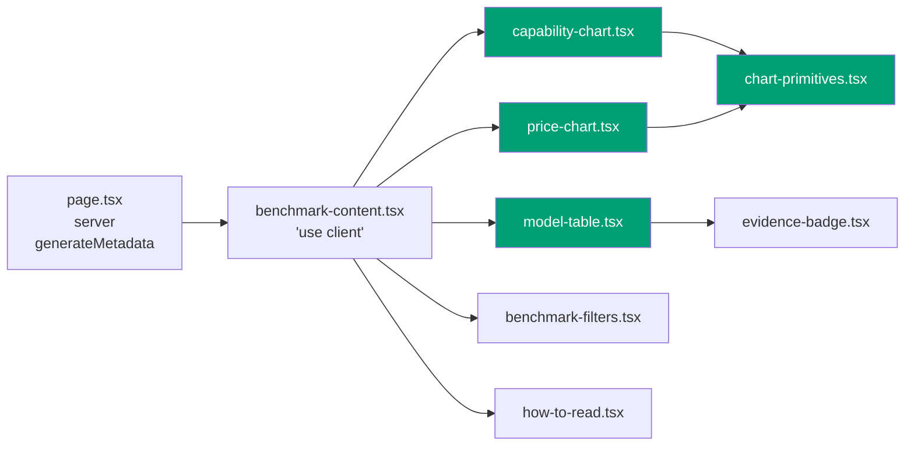
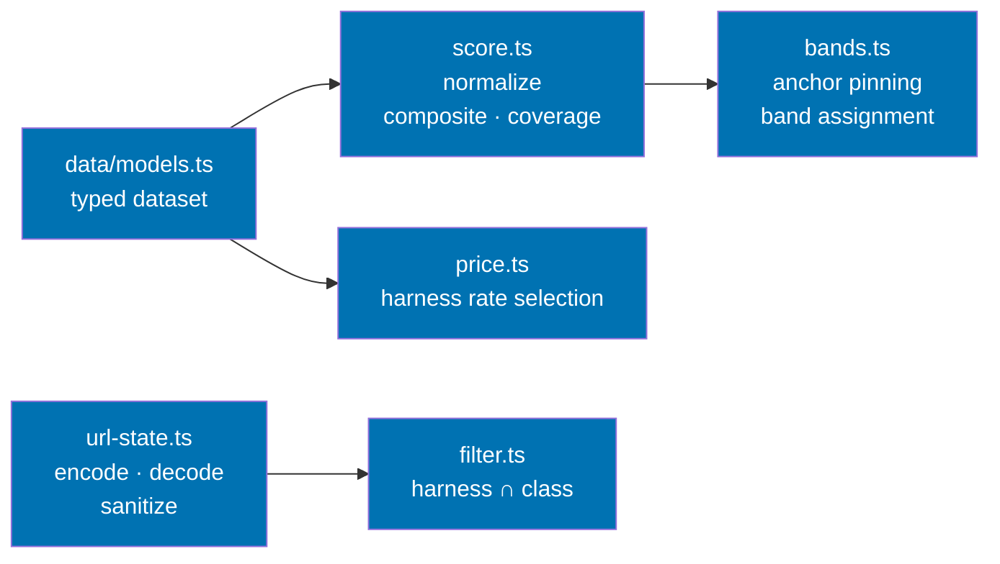
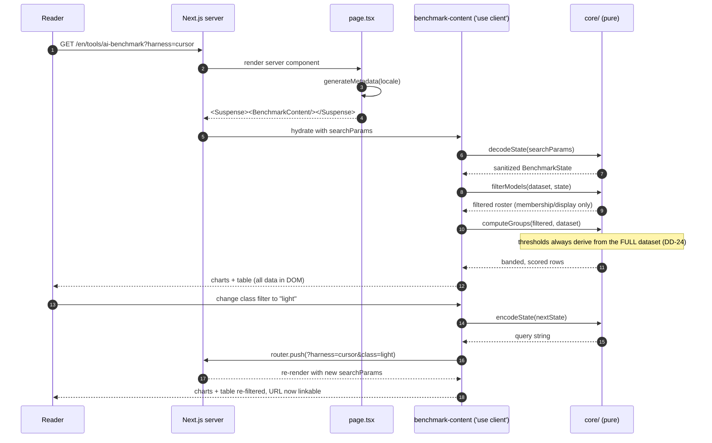
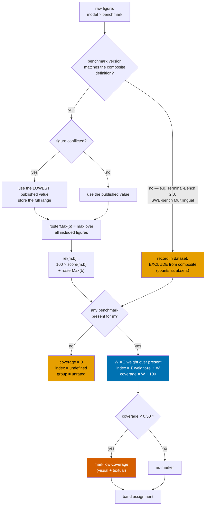
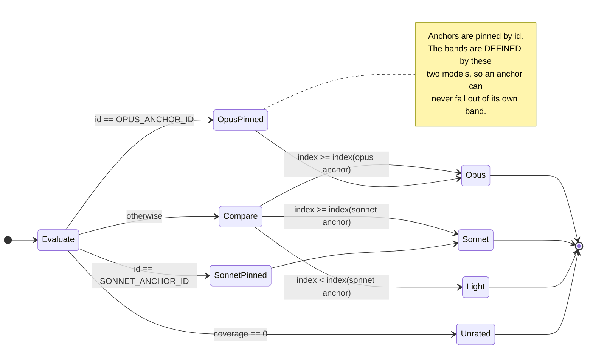
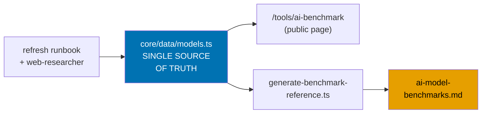
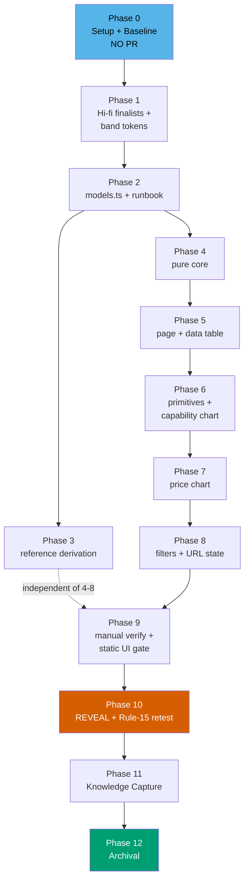

# Technical Documentation — AI Benchmark Tool

> **HOW it gets built.** Business reasoning: [`brd.md`](./brd.md). Product specification and Gherkin:
> [`prd.md`](./prd.md). Executable checklist: [`delivery.md`](./delivery.md).

## Exemption declarations

- **Learning-bearing?** No. This plan authors no course, tutorial, or curriculum content, so the
  [Learning-Plan `syllabus/` Folder Convention](../../../repo-governance/conventions/structure/learning-plan-syllabus.md)
  does not apply and no `syllabus/` folder is created.
- **UI-bearing?** **Yes.** The plan adds a user-facing screen under `apps/`, so the UI design funnel
  is mandatory and is recorded in [`prd.md` §UI design funnel](./prd.md#ui-design-funnel).
- **Specs and Gherkin?** **Required.** The plan creates observable behaviour under `apps/`, so
  companion Gherkin under `specs/` is mandatory. It is authored incrementally per phase — see
  [`delivery.md`](./delivery.md).
- **Harness-neutrality?** Not applicable. The plan touches no `.claude/`, `.opencode/`, or
  `repo-governance/` path. It does touch `docs/reference/ai-model-benchmarks.md`, which is a
  vendor-neutral reference document under `docs/`, not a governance binding surface.

## Architecture

### Feature layout — functional core / imperative shell

The page follows the FCIS layout already used by `src/features/cost-of-living-calculator/`
`[Repo-grounded]`. Everything numeric is a pure function over a typed static dataset; the React shell
only renders and wires URL state.

**Route and shell composition** — what the React tree mounts:



**Core module pipeline** — every node below is pure; `benchmark-content.tsx` is the only caller:



`filter.ts` narrows the `models.ts` roster for MEMBERSHIP and DISPLAY only — `score.ts` and
`bands.ts` always run over the full unfiltered roster, so band thresholds never re-scale under any
filter (DD-24). `capability-chart.tsx` reads `bands.ts`; `price-chart.tsx` reads `price.ts`.

**The FCIS boundary is a hard rule for this feature**: no file under `shell/` may contain a literal
benchmark score, price, model name, or threshold. A dataset refresh must touch `core/data/models.ts`
and nothing else. This is what makes success signal 3 in [`brd.md`](./brd.md#success-signals)
observable.

### Render and interaction sequence



### Scoring pipeline



### Band assignment



### Dependency position — one dataset, two consumers



`ai-model-benchmarks.md` is in turn the reference that
[`model-selection.md`](../../../repo-governance/development/agents/model-selection.md) reads when
assigning agent capability tiers — so a figure corrected in `models.ts` propagates to governance
without a second hand-maintained copy.

### Delivery flow and gates



## Design decisions

Decision ids `DD-1` … `DD-21` are carried forward from the planning grill. Amendments discovered
while doing the arithmetic are recorded as `DD-Na` and flagged, so the change is auditable rather
than silent.

### DD-1 / DD-2 — Two charts, hand-rolled inline SVG

Diagram 1 is capability, diagram 2 is price. Both are hand-rolled inline SVG using existing design
tokens; no chart dependency is added.

**Rationale**: the charts are horizontal bars over ~40 rows with band grouping — roughly 150 lines of
SVG. Every candidate library (recharts, visx, nivo) would add a client-only runtime for a page that
must render fully server-side, and would fight the requirement that every datum also exist as text.
This is the Simplicity Over Complexity principle applied literally.

**Consequence**: the shell must own axis scaling, tick placement, and label collision itself. That is
concentrated in `shell/chart-primitives.tsx` so both charts share one implementation.

### DD-3 — Static typed dataset, mirroring the calculator

`core/data/models.ts` carries `snapshotDate`, a per-field source URL, a per-field evidence grade, and
a per-harness price set — mirroring `cost-of-living-calculator/core/data/cities.ts`, whose header
comment already establishes the "snapshotDate + sources + confidence tiers" convention
`[Repo-grounded]`.

### DD-5 + DD-5a — The composite index

**DD-5 (carried forward)**: a coding-weighted blend of four public benchmarks.

| Benchmark          | Weight | Why                                                                                                  |
| ------------------ | ------ | ---------------------------------------------------------------------------------------------------- |
| SWE-bench Verified | 25     | The most widely reported agentic-coding axis; saturating but still discriminative below the frontier |
| SWE-bench Pro      | 25     | The axis OpenAI and xAI moved to; the only one covering GPT-5.6 and Grok 4.5                         |
| Terminal-Bench 2.1 | 20     | Autonomous shell-agent tasks — closest to what a harness user actually does                          |
| GPQA Diamond       | 30     | The reasoning counterweight; without it the index is purely a coding-agent score                     |

AIME and LMArena were considered and rejected — AIME is saturated and unpublished by several
frontier models; LMArena measures stylistic preference and its board was mid-reshuffle at snapshot
time. ARC-AGI-3 is genuinely discriminative but too few models have any score. Artificial Analysis'
Intelligence Index has good coverage but its terms of use restrict copying its site and adopting it
would mean inheriting someone else's weighting.

**DD-5a (amendment — normalization is roster-relative, not identity)**

DD-5 says "each normalized to 0-100 before weighting". All four benchmarks already report a
percentage, so the naive reading is that normalization is the identity function. **The arithmetic
shows that reading is wrong**, and the amendment is required.

The four benchmarks have systematically different difficulty. At snapshot, frontier SWE-bench
Verified figures sit at 88–96% while the same models' SWE-bench Pro figures sit at 58–80% — a gap of
roughly 20–30 points for the _same model_. Under identity normalization plus coverage
renormalization, a model that publishes a SWE-Pro score is penalized by that entire gap relative to
a model that does not. Coverage renormalization would then systematically reward **narrow, favourable
reporting**, which is precisely the behaviour the honesty surface exists to expose.

Normalization is therefore **roster-relative per benchmark**:

```text
rosterMax(b) = max over all included models m of score(m, b)
rel(m, b)    = 100 × score(m, b) / rosterMax(b)
```

Every benchmark's best snapshot performer scores 100 on that axis, so the four axes become
comparable and coverage renormalization becomes fair.

**Cost of the amendment, stated on the page**: the index is _relative to this snapshot's roster_. A
refresh that adds a stronger model rescales every figure on that axis. The chart axis is therefore
labelled **"Composite capability index — 100 = best score in this snapshot"**, never "%".

### DD-6 — Coverage renormalization

```text
present(m)  = benchmarks with an included figure for m
W(m)        = Σ weight(b) for b ∈ present(m)
index(m)    = Σ weight(b) × rel(m, b) / W(m)          -- undefined when W(m) = 0
coverage(m) = W(m) / 100
```

No imputation, no dropping. `coverage(m) < 0.50` marks the model low-coverage, visually **and** in
text. `W(m) = 0` puts the model in the `unrated` group.

**Threshold rationale** _[Judgment call]_: with weights 25/25/20/30, a model holding any two
benchmarks reaches at least 0.45 and at most 0.55. The 0.50 line therefore separates "two weak
benchmarks or fewer" from "two strong benchmarks or more". No measurement supports the exact value;
it is a stated editorial line, and the page shows the raw coverage ratio so a reader can apply their
own.

### DD-20a — Anchor comparison (amends DD-20)

**DD-20 as stated** computes both anchor composites over the benchmark subset that both anchors have,
so the class boundary is like-for-like. Doing that arithmetic against the snapshot exposes a defect
that only appears on contact with the data:

- Claude Opus 5 publishes SWE-bench Verified and GPQA Diamond; it publishes no Terminal-Bench 2.1
  figure this research captured.
- Claude Sonnet 5 publishes SWE-bench Verified, SWE-bench Pro, and Terminal-Bench 2.1.
- **The intersection is a single benchmark — SWE-bench Verified.**

Under DD-20 literally, `opusThreshold = rel(Opus 5, SWE-V) = 100` by construction (Opus 5 holds the
roster max on that axis). No model can reach 100 without tying the roster max, so the `opus` band
collapses to exactly one member and the page's central abstraction becomes vacuous.

**DD-20a**: DD-20's _intent_ — the boundary must be like-for-like — is satisfied at the
**normalization layer** by DD-5a rather than by subsetting. `rel(m, b)` puts every benchmark on a
common "fraction of snapshot best" scale, which is what made the subsetting necessary in the first
place. The thresholds are therefore the anchors' own full indices:

```text
opusThreshold   = index(OPUS_ANCHOR)
sonnetThreshold = index(SONNET_ANCHOR)
```

with **anchor pinning** guaranteeing each anchor sits in the band it defines regardless of arithmetic
(see the band-assignment diagram above). This keeps the boundary explainable in one sentence — "at
or above Opus 5's index" — which the subset rule could not.

**What is lost, and how it is disclosed**: the comparison is no longer strictly like-for-like when
two models have disjoint coverage. That residual is exactly what the coverage ratio and the
low-coverage marker exist to surface, and the how-to-read disclosure states it plainly:

> A model scored on fewer benchmarks has a less trustworthy index. Coverage is shown for every model,
> and models below 50% coverage are marked.

### DD-24 — Band thresholds always derive from the full roster, never re-scale under a filter

An earlier draft of this document said `filter.ts` narrows the roster before `bands.ts` runs, so
band thresholds "re-scale to whatever survives the filter" — informally cited as `(DD-11)`, a label
this document never actually defined anywhere. That statement described exactly the anchor-collapse
defect fixed in this plan's Phase 8 unit (commit `b2d8bd281`): a harness filter excluding both
`claude-opus-5` and `claude-sonnet-5` (e.g. `codex-cli`) re-derived the two anchor thresholds from
the filtered subset, silently collapsing every rated model to `light`.

**DD-24**: band thresholds (the two anchor indices, DD-20a) and the roster-max map (DD-5a) are
ALWAYS derived from the full, unfiltered roster — `core/bands.ts`'s `computeGroups(dataset,
fullDataset)` computes both from `fullDataset`, never from `dataset` alone. Filtering governs
**membership and display only**: which models appear in a chart or the data table, never which
models define the band boundaries. This is deliberately broader than the bug strictly required —
only the anchor-exclusion edge case needed fixing — but it is the only rule stable under a roster
refresh, since thresholds anchored to two named models by id do not depend on which harness happens
to expose them.

### DD-7 + DD-7a — Roster rule

**DD-7**: the union of models selectable in Codex CLI, Claude Code, Cursor, OpenCode Go, and OpenCode
Zen. One row per **model**, with harness availability as an attribute of the row.

**DD-7a (operational restatement)** — the trim rule made executable, because "current plus one prior
generation" alone does not decide the OpenAI line (Codex's own picker lists three generations as
current):

> Include a model when it is **selectable in at least one of the five harnesses' current rosters**,
> and it is either the current generation of its family or one generation prior. Exclude any entry
> the harness itself marks **deprecated**, **legacy**, or **invitation-only/preview**, and exclude
> any entry with **no identifiable vendor**.

Applying it: Codex's deprecated picker entries (`gpt-5.2`, `gpt-5.3-codex`) are out; Claude Mythos 5
is out (invitation-only); `big-pickle`, `laguna-s-2.1-free`, `north-mini-code-free` and `hy3` are out
(no identifiable vendor). Result: roughly 38–40 rows — see [Appendix A](#appendix-a--verified-research-snapshot-2026-07-28).

### DD-12 + DD-16 + DD-17a — Pricing rules

| Rule                    | Decision                                                                                                                                                                                                                            | Worked example                                                                                                                                                           |
| ----------------------- | ----------------------------------------------------------------------------------------------------------------------------------------------------------------------------------------------------------------------------------- | ------------------------------------------------------------------------------------------------------------------------------------------------------------------------ |
| **Depth** (DD-12)       | Standard-tier input and output USD per 1M tokens only. Cache, batch, and long-context tiers are recorded as a `conditions` note, never averaged into the number                                                                     | xAI doubles all rates at 200k prompt tokens — recorded as a condition, price shown is the standard tier                                                                  |
| **Whose price** (DD-16) | The rate **the harness charges**, stored per harness. Unfiltered, the chart shows the model's **lowest** harness rate and the table lists every harness's rate; a harness filter switches the chart to that harness's rate          | DeepSeek V4 Pro: $0.435/$0.87 direct versus $1.74/$3.48 at OpenCode Zen — a ~4x gap that must be shown, not flattened                                                    |
| **Promotions** (DD-17a) | A promotion with a **known expiry date** → publish the post-expiry standard rate. A promotion with **no stated expiry** → publish the currently effective rate and record the nominal list price plus the promo label as provenance | Claude Sonnet 5 shows $3/$15 (its rate from 2026-09-01), not the $2/$10 rate expiring 2026-08-31. MiniMax M3's "permanent 50% off" $0.30/$1.20 is published as effective |
| **Region**              | The **international / default** endpoint. The alternate regional rate is recorded as provenance                                                                                                                                     | Alibaba's Singapore endpoint, not Beijing, which is separately published and 30–70% cheaper                                                                              |
| **Subscription**        | A flat-rate model carries `pricing: { kind: "subscription" }` with the plan cost and caps. It renders in an explicitly labelled subscription group — never `$0`, never omitted                                                      | All 16 OpenCode Go entries: $5 first month then $10/month, caps $12/5hr · $30/week · $60/month                                                                           |

**DD-17a rationale**: DD-17 says "publish standard list price, ignoring promotional rates", and its
stated reason is "a page that does not go stale on a known date." A promotion with **no** known date
cannot make the page go stale on one, and publishing a nominal list price nobody is charged would be
less accurate rather than more. DD-17a applies DD-17 by its own rationale instead of mechanically.

### DD-19 — Evidence grades

Every figure in the dataset carries one grade:

| Grade           | Meaning                                                                                         | Rendering                                     |
| --------------- | ----------------------------------------------------------------------------------------------- | --------------------------------------------- |
| `verified`      | Scored by an independent verifier (Scale AI SEAL, ARC-Prize-Verified) or an official model card | Plain, no marker beyond the grade in the cell |
| `self-reported` | Published by the vendor about its own model                                                     | Superscript marker, named in the legend       |
| `secondary`     | Quoted by an aggregator; no primary source retrieved                                            | Superscript marker, named in the legend       |
| `conflicted`    | Multiple irreconcilable published values                                                        | Cell shows the **range**; never an average    |
| `unavailable`   | Vendor publishes no figure for this benchmark                                                   | Cell reads "not published"; counts as absent  |

Grounding fact carried onto the page: llm-stats found **0 of 104** tracked SWE-bench entries carry an
independent-verification badge
`[Web-cited — https://llm-stats.com/benchmarks/swe-bench-verified, accessed 2026-07-28: "104 models
have been evaluated on the SWE-Bench Verified benchmark, with 0 verified results and 104 self-reported
results"]`. Every other citation of this figure in this plan (`brd.md` Business risks table, `prd.md`
§R7 prior-art table, `tech-docs.md` §Appendix A.3) points back to this citation rather than restating
the URL.

### DD-19a — Subscription prices carry an evidence grade (amends DD-19)

**Recorded during PR review, cycle 1 (finding F1a).** `SubscriptionPrice` (`core/data/models.ts`)
originally carried no `grade` field at all, which made AC-21 ("every price cell carries an evidence
grade marker") unsatisfiable by construction for every subscription-only roster row (`mimo-v2.5`,
`mimo-v2.5-pro`) — not merely uncovered by a test, but structurally impossible to satisfy. A
separate, compounding bug in the same code path fabricated a self-referential source link
(`defaultSourceForIndex()`, meant only for the composite index's own methodology citation) for
models with genuinely no pricing data at all (`gemini-3.1-pro`, `gemini-3-flash`), which is a
provenance-honesty violation on a page whose stated purpose is honesty about sourcing.

**Decision**: `SubscriptionPrice` now carries `grade: EvidenceGrade`, populated `"verified"` for
every `goSubscription()` entry — the OpenCode Go plan cost and caps are read directly from
OpenCode's own official docs (`URL.opencodeGo`), the same grade this dataset already uses elsewhere
for a harness's own official pricing page (e.g. the OpenCode Zen passthrough `met()` rows). A
subscription price is one flat rate covering both directions, so `priceCells()` renders the
identical graded, sourced `<FigureCell>` in both the input and output columns rather than
inventing an artificial input/output split. A model with **no** price at all (metered or
subscription) now renders exactly like a missing benchmark figure — a plain "not reported" span,
never a grade marker and never a link — instead of a fabricated citation.

### DD-18 — Deriving the governance reference

`docs/reference/ai-model-benchmarks.md` currently maintains, by hand, tables that duplicate this
dataset `[Repo-grounded]`. Under DD-18 the dataset becomes the single source of truth and the
reference's **data tables** become generated, while its **hand-written prose** (benchmark
definitions, the tier-rationale sections, the limitations-and-caveats narrative) is preserved
verbatim.

**Mechanism** — marker-delimited generation, mirroring the app's existing `generate-indexes` /
`validate-indexes` target pair `[Repo-grounded]`:

```markdown
<!-- BEGIN GENERATED: roster -->

… generated table …

<!-- END GENERATED: roster -->
```

- `apps/ayokoding-www/src/scripts/generate-benchmark-reference.ts` rewrites only the text between
  marker pairs; everything outside is untouched.
- Nx target `generate-benchmark-reference` writes; `validate-benchmark-reference` regenerates to a
  temp file and diffs, exiting non-zero on drift. The validate target joins the phase gate and the
  repo's pre-push surface for this project.

**Marker-first guard**: the generator locates the `BEGIN`/`END` marker pair before any substitution
and fails loudly when a pair is missing — it never falls back to inserting at an anchor, because an
insert-style substitution duplicates content on every re-run.

**Staleness note**: the reference was last refreshed 2026-07-05 and asserts Claude Opus 5 does not
exist `[Repo-grounded]`; Opus 5 shipped 2026-07-24 `[Web-cited — Claude Code model-config docs,
accessed 2026-07-28]`. The first generation run corrects this. Any prose contradicted by the
generated tables — notably the "Correcting 'Opus 5'…" section — must be reconciled by hand in the
same phase, not silently left standing beside a table that disagrees with it.

### DD-21 — Attribution and licensing

Every figure links to the leaderboard or vendor page it came from. A Sources and Licences section
names each operator and its terms. No operator's compiled table is reproduced wholesale.

| Operator            | Terms as found                                                                                                             |
| ------------------- | -------------------------------------------------------------------------------------------------------------------------- |
| SWE-bench           | Benchmark code and dataset MIT; the leaderboard page itself marked all rights reserved                                     |
| LMArena             | The released `lmarena-ai/leaderboard-dataset` on Hugging Face is CC-BY-4.0; the live site's ToU are separately restrictive |
| Terminal-Bench      | No republication terms stated by the operator                                                                              |
| GPQA                | The benchmark repository is MIT-licensed (amended by DD-23; formerly a bogus `ARC Prize` row)                              |
| Artificial Analysis | ToU restrict copying the site — **not used as a data source for this page**                                                |

Where an operator states no terms, the page records that explicitly rather than implying permission.

### DD-23 — GPQA replaces the ARC Prize row; the ARC Prize entry is dropped (amends DD-21)

**Recorded during PR review, cycle 3 (finding F8).** The shipped operator row named
`"ARC Prize (GPQA)"` (`operators.ts:43-46` at review time) conflated two unrelated entities: GPQA
(David Rein et al., `github.com/idavidrein/gpqa`) has no relationship to the ARC Prize Foundation
(Mike Knoop / François Chollet), and the DD-21 table above never listed GPQA as an operator despite
`gpqa-diamond` carrying **weight 30** — the second-highest of the four composite benchmarks — and
`URL.gpqa` being cited as a figure source across the roster. Meanwhile no ARC Prize figure appears
in the roster at all: ARC-AGI-2 and ARC-AGI-3 were both rejected (`tech-docs.md` §Benchmarks
examined and rejected), so the ARC Prize row named an operator whose figures never appear here,
contrary to `aiBenchSourcesIntro`'s own scoping to "operators whose figures appear here."

**Decision**: the DD-21 table above drops the `ARC Prize` row and adds `GPQA`, with terms "The GPQA
benchmark repository is MIT-licensed" — verified directly against the cited repo, which states an
MIT licence, not "no terms stated" as the removed `ARC Prize` row's shared text had implied. The
shipped `operators.ts` entry now reads `name: "GPQA"`, `url:
"https://github.com/idavidrein/gpqa"`, `termsKey: "aiBenchOpTermsGpqa"`; the now-unused
`aiBenchOpTermsArcprize` i18n key is retired from both locale blocks in `translations.ts`. K-8
(`tech-docs.md` §Known-unknowns and `evidence/phase-2-known-unknowns.md:21`) is reconciled to name
GPQA in place of ARC Prize, since GPQA does state terms (MIT) and was never the operator the "no
terms stated" disclosure applied to.

### DD-22 — AC-19/29/32/35 are permanently unit-only, not e2e-deferred (amends the Testing strategy)

**Recorded during PR review, cycle 1 (finding F5).** Commit `ca69c47c6` narrowed the shipped
`.feature` file's tags for AC-19/29/32/35 (data table presence, snapshot date, how-to-read
disclosure, bilingual completeness) from `@unit @e2e` to `@unit`, but `prd.md` — the plan's own
canonical acceptance-criteria source (§Testing strategy) — still carried the old `@unit @e2e` tags
for all four, leaving the two documents in unresolved disagreement.

**Decision**: these four scenarios are permanently unit-only for this plan, not merely deferred to
a later phase pending an e2e binding. `prd.md:572/659/682/709` are corrected to `@unit` to match the
shipped `.feature` file. This is a permanent scoping decision, not a temporary gap, because no
remaining phase in `delivery.md` (Phase 6: chart primitives, Phase 7: price chart, Phase 8: filters,
Phase 9: manual verification, Phase 10: reveal/retest) revisits the data table or honesty surface
with new Playwright e2e coverage — only AC-1/AC-2 (the two locale-heading scenarios) get e2e
binding in this plan, in `apps/ayokoding-www-fe-e2e/src/steps/ai-benchmark.steps.ts`. If a future
plan phase does add e2e coverage for these four scenarios, both `prd.md` and the `.feature` file
must be updated together at that time — this decision does not preclude that, it only records that
none is currently scheduled.

### Band design tokens

Three band tokens plus an `unrated` neutral, defined in **`libs/web-ui-token/src/ayokoding.css`**
rather than in the app's `globals.css`.

**Why that file** _[Repo-grounded]_: `ayokoding.css` is the only place that already defines the
ayokoding hue palette in **both** light and dark, including a `.dark` / `[data-theme="dark"]`
override block. Defining band tokens in `apps/ayokoding-www/src/app/globals.css` would require
duplicating that dark block for chart colours alone. `globals.css` already imports `ayokoding.css`,
so the tokens resolve with no wiring change.

The bands **alias existing hues** rather than introducing new hex values (R5 reuse):

| Band      | Light + dark token     | Aliases                               | Hue angle | Colour-blind separation                                 |
| --------- | ---------------------- | ------------------------------------- | --------- | ------------------------------------------------------- |
| `opus`    | `--chart-band-opus`    | `var(--hue-plum)` + `-ink` / `-wash`  | 305       | Far from both others in hue and in lightness            |
| `sonnet`  | `--chart-band-sonnet`  | `var(--hue-teal)` + `-ink` / `-wash`  | 200       | ~105° from opus, ~125° from light                       |
| `light`   | `--chart-band-light`   | `var(--hue-honey)` + `-ink` / `-wash` | 75        | ~125° from sonnet                                       |
| `unrated` | `--chart-band-unrated` | `var(--warm-400)`                     | neutral   | Desaturated by design — reads as "no data", not a class |

The three hues are ≥105° apart in OKLCH hue and differ in lightness, which preserves separability
under deuteranopia and protanopia. **Colour is never the sole encoding** regardless: every band
carries its class name as text (AC-37), so the tokens are a reinforcement, not the signal.

Contrast is verified two ways: a unit test asserting the token declarations exist in both the light
and dark blocks, and an e2e assertion reading **computed styles from the live page** (AC-38) — jsdom
cannot resolve `oklch()` custom properties through a cascade, so a jsdom-only contrast test would be
vacuous.

### Feature gating

`apps/ayokoding-www` has **no environment-variable feature-flag mechanism** `[Repo-grounded — no
feature-flag module or`FLAG\_`/`featureFlag`symbol exists under`apps/ayokoding-www/src`]`. Adding
one for a static content page would be over-engineering.

The plan therefore uses a **link gate**, which is a real and sufficient flag for a statically-routed
page: the route ships in Phases 5–8 while **neither** link surface points at it, so it is not
reachable by navigation and not discoverable by a reader. There are exactly two link surfaces
`[Repo-grounded]`:

1. `apps/ayokoding-www/src/app/[locale]/tools/page.tsx` — the tools index `<ul>`
2. `apps/ayokoding-www/src/features/app-shell/shell/footer.tsx` — the footer Tools column

The route is not in the sitemap either way: `apps/ayokoding-www/src/app/sitemap.ts` enumerates only
content-driven pages and already excludes `/tools/cost-of-living-calculator` `[Repo-grounded]`.

**Gate removal is a named step** — Phase 10 steps R-2 and R-3 add both links, and the Rule-15
three-tester retest runs **after** removal so the testers evaluate the shipped navigation path rather
than a direct-URL-only page.

## Testing strategy

Tests are written **before** implementation (RED → GREEN → REFACTOR). The Gherkin scenarios in
[`prd.md`](./prd.md#acceptance-criteria) are the source of the first failing tests.

| Level               | Runner                        | Command                                               | Covers                                                                              |
| ------------------- | ----------------------------- | ----------------------------------------------------- | ----------------------------------------------------------------------------------- |
| Unit (pure core)    | vitest                        | `npx nx run ayokoding-www:test:unit`                  | `score.ts`, `bands.ts`, `price.ts`, `filter.ts`, `url-state.ts`, dataset invariants |
| Unit (component)    | vitest + Testing Library      | `npx nx run ayokoding-www:test:unit`                  | Chart SVG output, table structure, filter components                                |
| Gherkin — unit bind | `@amiceli/vitest-cucumber`    | `npx nx run ayokoding-www:test:unit`                  | `@unit`-tagged scenarios, steps in `test/unit/fe-steps/ai-benchmark.steps.tsx`      |
| Gherkin — e2e bind  | `playwright-bdd` + Playwright | `npx nx run ayokoding-www-fe-e2e:test:e2e`            | `@e2e`-tagged scenarios, steps in `apps/ayokoding-www-fe-e2e/src/steps/`            |
| Coverage of specs   | rhino-cli                     | `npx nx run ayokoding-www:specs:behavior:coverage`    | Every scenario has a step implementation with a `@covers` annotation                |
| Specs structure     | rhino-cli                     | `npx nx run ayokoding-www:specs:structure-validation` | `specs/` tree shape and READMEs                                                     |
| Manual behavioural  | Playwright MCP                | operator-driven                                       | Both locales × 375 / 768 / 1280 px, console + network clean, evidence captured      |

> **Vacuous-target warning** — `npx nx run ayokoding-www:test:e2e` and
> `npx nx run ayokoding-www:test:integration` are **echo no-ops** on this project
> `[Repo-grounded — both targets run`echo 'no-op: …'`]`. Real end-to-end coverage lives in the
> paired project `ayokoding-www-fe-e2e`. No acceptance clause in this plan cites either no-op target.

### Dataset invariant tests (`core/data/models.unit.test.ts`)

These are the tests that make the honesty surface enforceable rather than aspirational:

1. Every benchmark figure has a non-empty source URL.
2. Every price figure has a non-empty source URL.
3. Every figure has an evidence grade drawn from the five-value union.
4. Every `conflicted` figure carries both a low and a high value, and low ≤ high.
5. Every model names at least one harness, and every named harness is one of the five known ids.
6. Model ids are unique.
7. `snapshotDate` parses as an ISO date.
8. Both anchor ids resolve to a model in the roster.
9. No model carries a Terminal-Bench 2.0 or SWE-bench Multilingual figure in a 2.1 or Verified field.
10. Every `subscription`-kind price carries a plan cost and omits per-token rates.

## File impact

| Path                                                                                 | Action     | Notes                                                                         |
| ------------------------------------------------------------------------------------ | ---------- | ----------------------------------------------------------------------------- |
| `apps/ayokoding-www/src/features/ai-benchmark/core/data/models.ts`                   | **Create** | The dataset. _New file_                                                       |
| `apps/ayokoding-www/src/features/ai-benchmark/core/data/models.unit.test.ts`         | **Create** | Dataset invariants. _New file_                                                |
| `apps/ayokoding-www/src/features/ai-benchmark/core/score.ts` (+ `.unit.test.ts`)     | **Create** | Normalization, composite, coverage. _New files_                               |
| `apps/ayokoding-www/src/features/ai-benchmark/core/bands.ts` (+ `.unit.test.ts`)     | **Create** | Anchor pinning, band assignment. _New files_                                  |
| `apps/ayokoding-www/src/features/ai-benchmark/core/price.ts` (+ `.unit.test.ts`)     | **Create** | Harness rate selection. _New files_                                           |
| `apps/ayokoding-www/src/features/ai-benchmark/core/filter.ts` (+ `.unit.test.ts`)    | **Create** | Harness ∩ class filtering. _New files_                                        |
| `apps/ayokoding-www/src/features/ai-benchmark/core/url-state.ts` (+ `.unit.test.ts`) | **Create** | Pure encode/decode/sanitize. _New files_                                      |
| `apps/ayokoding-www/src/features/ai-benchmark/shell/chart-primitives.tsx` (+ test)   | **Create** | Shared SVG parts. _New files_                                                 |
| `apps/ayokoding-www/src/features/ai-benchmark/shell/capability-chart.tsx` (+ test)   | **Create** | Diagram 1. _New files_                                                        |
| `apps/ayokoding-www/src/features/ai-benchmark/shell/price-chart.tsx` (+ test)        | **Create** | Diagram 2. _New files_                                                        |
| `apps/ayokoding-www/src/features/ai-benchmark/shell/model-table.tsx` (+ test)        | **Create** | Accessible data table. _New files_                                            |
| `apps/ayokoding-www/src/features/ai-benchmark/shell/benchmark-filters.tsx` (+ test)  | **Create** | Filter bar. _New files_                                                       |
| `apps/ayokoding-www/src/features/ai-benchmark/shell/evidence-badge.tsx` (+ test)     | **Create** | Per-figure grade marker. _New files_                                          |
| `apps/ayokoding-www/src/features/ai-benchmark/shell/how-to-read.tsx` (+ test)        | **Create** | Honesty disclosure. _New files_                                               |
| `apps/ayokoding-www/src/app/[locale]/tools/ai-benchmark/page.tsx`                    | **Create** | Server route + `generateMetadata`. _New file_                                 |
| `apps/ayokoding-www/src/app/[locale]/tools/ai-benchmark/benchmark-content.tsx`       | **Create** | `"use client"` content shell. _New file_                                      |
| `apps/ayokoding-www/src/app/[locale]/tools/page.tsx`                                 | **Modify** | Add the AI benchmark `<li>` — **Phase 10 only** (link gate)                   |
| `apps/ayokoding-www/src/features/app-shell/shell/footer.tsx`                         | **Modify** | Add the footer Tools link — **Phase 10 only** (link gate)                     |
| `apps/ayokoding-www/src/features/i18n/core/translations.ts`                          | **Modify** | Add every page string under both `en` and `id`                                |
| `libs/web-ui-token/src/ayokoding.css`                                                | **Modify** | Add the four band tokens to the light `@theme` and the dark override block    |
| `apps/ayokoding-www/docs/ai-benchmark/data-sourcing-prompt.md`                       | **Create** | Refresh runbook. _New file_                                                   |
| `apps/ayokoding-www/src/scripts/generate-benchmark-reference.ts`                     | **Create** | Marker-delimited generator. _New file_                                        |
| `apps/ayokoding-www/project.json`                                                    | **Modify** | Add `generate-benchmark-reference` and `validate-benchmark-reference` targets |
| `docs/reference/ai-model-benchmarks.md`                                              | **Modify** | Insert generation markers; regenerate tables; reconcile contradicted prose    |
| `specs/apps/ayokoding/behavior/ayokoding-www/gherkin/tools/ai-benchmark.feature`     | **Create** | Scenarios AC-1…AC-38 except AC-3. _New file_                                  |
| `specs/apps/ayokoding/behavior/ayokoding-www/gherkin/tools/tools-index.feature`      | **Modify** | Add AC-3 — **Phase 10 only**                                                  |
| `specs/apps/ayokoding/behavior/ayokoding-www/gherkin/tools/README.md`                | **Modify** | Index the new feature file                                                    |
| `apps/ayokoding-www/test/unit/fe-steps/ai-benchmark.steps.tsx`                       | **Create** | `@unit` step bindings. _New file_                                             |
| `apps/ayokoding-www/test/unit/fe-steps/tools-index.steps.tsx`                        | **Modify** | AC-3 unit binding — **Phase 10 only**                                         |
| `apps/ayokoding-www-fe-e2e/src/steps/ai-benchmark.steps.ts`                          | **Create** | `@e2e` step bindings. _New file_                                              |
| `apps/ayokoding-www-fe-e2e/src/steps/tools-index.steps.ts`                           | **Modify** | AC-3 e2e binding — **Phase 10 only**                                          |

## Dependencies

**No new runtime dependency is added.** The page uses only what the app already has
`[Repo-grounded]`: React 19 + Next.js App Router, `@open-sharia-enterprise/web-ui`, Tailwind v4 via
`globals.css`, and the existing i18n module. Test tooling (`vitest`, `@amiceli/vitest-cucumber`,
`@testing-library/react`, `playwright-bdd`, `@playwright/test`) is already installed and in use.

## Rollback

Each delivery unit is a separate PR, so rollback is per-unit `git revert`. Three properties keep the
blast radius small:

1. Until Phase 10's reveal step, the route is unlinked — reverting anything in Phases 5–8 removes a
   page no reader has a path to.
2. The band tokens are additive declarations in `ayokoding.css`; nothing else references them, so
   reverting them cannot affect an existing surface.
3. The reference-derivation change (Phase 3) is contained to marker pairs plus a generator script and
   two Nx targets; reverting restores the hand-maintained tables exactly.

## Known unknowns carried into execution

These are the eight gaps the research left open. Each must be resolved by a **primary-source** check
before the corresponding figure is transcribed into `models.ts`; whichever remain unresolved are
transcribed with grade `unavailable` or `conflicted` — never guessed.

| #   | Gap                                                                                        | Consequence if unresolved                                                                  |
| --- | ------------------------------------------------------------------------------------------ | ------------------------------------------------------------------------------------------ |
| K-1 | Claude Opus 5 Terminal-Bench 2.1 — not captured                                            | Opus anchor coverage stays at 0.55; grade `unavailable`                                    |
| K-2 | Claude Opus 5 GPQA Diamond — three conflicting secondary figures (93.2–94.3)               | Grade `conflicted`; the **lowest** value enters the composite per the scoring pipeline     |
| K-3 | GPT-5.6 SWE-bench Verified — vendor does not report; one aggregator figure looks erroneous | Grade `unavailable`. The aggregator's 96.2% must **not** be transcribed                    |
| K-4 | Grok 4.5 and Kimi K3 GPQA / AIME — vendors omit                                            | Grade `unavailable`; coverage reduced accordingly                                          |
| K-5 | LMArena current Elo — board unsettled                                                      | No impact; LMArena is not in the composite                                                 |
| K-6 | Kimi K2.7 Code pricing — official page did not return content                              | Price grade `unavailable`; the model still appears with its benchmark data                 |
| K-7 | Artificial Analysis ToU exact republication clause — PDF not text-extractable              | No impact; Artificial Analysis is not used as a data source, only cited as prior art       |
| K-8 | Terminal-Bench republication terms — not stated by the operator (amended by DD-23 above)   | The Sources and Licences section records "no terms stated" rather than implying permission |

Two further transcription hazards, found in the research and encoded as dataset invariants 9 above:

- **Cursor Composer 2.5's 79.8%** is SWE-bench **Multilingual**, a different benchmark. It must never
  land in the Verified column. Its 69.3% Terminal-Bench figure is on the **2.0** scale and therefore
  does not enter the 2.1-weighted composite.
- **Terminal-Bench 2.0 and 2.1 are not interchangeable**, and SWE-bench harness releases 1.x and 2.x
  are explicitly not comparable.

## Appendix A — Verified research snapshot (2026-07-28)

> **Purpose (DD-14)**: this appendix is the transcription source for `models.ts`. Execution copies
> from here, then re-checks every `secondary`-graded figure against a primary source before writing
> it.
>
> **Method caveat** — Anthropic's and OpenAI's own benchmark pages are JS-rendered and returned
> 403 or incomplete responses to direct fetch. Much numeric detail below arrived via aggregators
> (llm-stats.com, MarkTechPost, EdenAI) quoting vendors rather than from primary system cards. Every
> such figure is graded `secondary` and carries a re-check obligation.
>
> Verification depth by harness: Claude Code and both OpenCode rosters were fully verified against
> primary docs; Codex CLI was verified for its native picker only; Cursor was verified for display
> names and pricing but **not** for exact config slugs.

### A.1 — Harness rosters

| Harness          | Source                                                                                         | Roster as fetched                                                                                                                                                                                                                                                                                                                                                                                                          |
| ---------------- | ---------------------------------------------------------------------------------------------- | -------------------------------------------------------------------------------------------------------------------------------------------------------------------------------------------------------------------------------------------------------------------------------------------------------------------------------------------------------------------------------------------------------------------------- |
| **Codex CLI**    | `learn.chatgpt.com/docs/models` (canonical `developers.openai.com/codex/models`)               | Current picker: `gpt-5.6-sol` (flagship), `gpt-5.6-terra`, `gpt-5.6-luna`, `gpt-5.5`, `gpt-5.4`, `gpt-5.4-mini`, `gpt-5.3-codex-spark` (ChatGPT Pro only, research preview). Deprecated in picker: `gpt-5.2`, `gpt-5.3-codex`                                                                                                                                                                                              |
| **Claude Code**  | `code.claude.com/docs/en/model-config`, `platform.claude.com/…/models/overview`                | Current: `claude-fable-5` (GA 2026-06-09), `claude-opus-5` (alias `opus`), `claude-sonnet-5` (alias `sonnet`), `claude-haiku-4-5-20251001`. Invitation-only: `claude-mythos-5`, `claude-mythos-preview`. Legacy selectable: `claude-opus-4-8/4-7/4-6`, `claude-sonnet-4-6`, `claude-sonnet-4-5`, `claude-opus-4-5`. Deprecated, retires 2026-08-05: `claude-opus-4-1`. `opusplan` is a mode alias, not a model             |
| **Cursor**       | Cursor model + pricing docs                                                                    | ~40 entries. Cursor's own: Composer 2.5 ($0.50/$2.50 standard; $3.00/$15.00 fast; released 2026-05-18), Composer 1 ($1.25/$10). Third-party: full Claude family, OpenAI GPT-5.x family, Google Gemini family, xAI Grok 4.5 ($2/$6 base, $4/$18 fast; released 2026-07-08), GLM 5.2, Kimi K2.7 Code, Kimi K3. "Auto"/"Auto Cost" is the router, not a model                                                                 |
| **OpenCode Go**  | OpenCode docs                                                                                  | 16 config ids, **flat-rate subscription, no per-token price**: `grok-4.5`, `glm-5.2`, `glm-5.1`, `kimi-k3`, `kimi-k2.7-code`, `kimi-k2.6`, `mimo-v2.5`, `mimo-v2.5-pro`, `minimax-m3`, `minimax-m2.7`, `qwen3.7-max`, `qwen3.7-plus`, `qwen3.6-plus`, `deepseek-v4-pro`, `deepseek-v4-flash`, `hy3` (vendor inferred Tencent Hunyuan, unconfirmed). Plan: $5 first month then $10/month; caps $12/5hr, $30/week, $60/month |
| **OpenCode Zen** | OpenCode Zen docs pricing table **and** the live `/v1/models` endpoint (the two agree exactly) | 62 model ids, each with published per-token pricing — spanning Anthropic, OpenAI, Google, xAI, and the open-weight labs, plus seven free-tier entries (`big-pickle`, `deepseek-v4-flash-free`, `mimo-v2.5-free`, `laguna-s-2.1-free`, `ling-3.0-flash-free`, `north-mini-code-free`, `nemotron-3-ultra-free`), three of which have no identifiable vendor                                                                  |

**Roster movement note**: the OpenCode Go roster has changed since the repo reference's 2026-07-05
snapshot — `grok-4.5`, `kimi-k3` and `hy3` are new, and the count moved from 13 to 16. OpenCode's own
docs state the roster changes as they test models, so it is a snapshot, not a stable list.

### A.2 — Indicative roster after applying DD-7a

Execution re-applies DD-7a against live rosters at transcription time; the list below is the rule's
output against this snapshot and is indicative, not frozen.

| #   | Model                 | Vendor    | Harnesses (CC · CX · CU · GO · ZEN) |
| --- | --------------------- | --------- | ----------------------------------- |
| 1   | Claude Fable 5        | Anthropic | CC · CU · ZEN                       |
| 2   | Claude Opus 5         | Anthropic | CC · CU · ZEN — **opus anchor**     |
| 3   | Claude Opus 4.8       | Anthropic | CC · CU · ZEN                       |
| 4   | Claude Sonnet 5       | Anthropic | CC · CU · ZEN — **sonnet anchor**   |
| 5   | Claude Sonnet 4.6     | Anthropic | CC · CU · ZEN                       |
| 6   | Claude Haiku 4.5      | Anthropic | CC · CU · ZEN                       |
| 7   | GPT-5.6 Sol           | OpenAI    | CX · CU · ZEN                       |
| 8   | GPT-5.6 Terra         | OpenAI    | CX · CU · ZEN                       |
| 9   | GPT-5.6 Luna          | OpenAI    | CX · CU · ZEN                       |
| 10  | GPT-5.5               | OpenAI    | CX · CU · ZEN                       |
| 11  | GPT-5.5 Pro           | OpenAI    | ZEN                                 |
| 12  | GPT-5.4               | OpenAI    | CX · CU · ZEN                       |
| 13  | GPT-5.4 Mini          | OpenAI    | CX · CU · ZEN                       |
| 14  | GPT-5.4 Nano          | OpenAI    | CU · ZEN                            |
| 15  | GPT-5.3 Codex Spark   | OpenAI    | CX (ChatGPT Pro) · ZEN              |
| 16  | Gemini 3.6 Flash      | Google    | CU · ZEN                            |
| 17  | Gemini 3.5 Flash      | Google    | CU · ZEN                            |
| 18  | Gemini 3.5 Flash Lite | Google    | ZEN                                 |
| 19  | Gemini 3.1 Pro        | Google    | CU · ZEN                            |
| 20  | Gemini 3 Flash        | Google    | CU · ZEN                            |
| 21  | Grok 4.5              | xAI       | CU · GO · ZEN                       |
| 22  | grok-build-0.1        | xAI       | ZEN                                 |
| 23  | Cursor Composer 2.5   | Cursor    | CU                                  |
| 24  | Cursor Composer 1     | Cursor    | CU                                  |
| 25  | GLM 5.2               | Z.ai      | CU · GO · ZEN                       |
| 26  | GLM 5.1               | Z.ai      | GO · ZEN                            |
| 27  | Kimi K3               | Moonshot  | CU · GO · ZEN                       |
| 28  | Kimi K2.7 Code        | Moonshot  | CU · GO · ZEN                       |
| 29  | Kimi K2.6             | Moonshot  | GO · ZEN                            |
| 30  | MiniMax M3            | MiniMax   | GO · ZEN                            |
| 31  | MiniMax M2.7          | MiniMax   | GO · ZEN                            |
| 32  | Qwen3.7 Max           | Alibaba   | GO · ZEN                            |
| 33  | Qwen3.7 Plus          | Alibaba   | GO · ZEN                            |
| 34  | Qwen3.6 Plus          | Alibaba   | GO · ZEN                            |
| 35  | DeepSeek V4 Pro       | DeepSeek  | GO · ZEN                            |
| 36  | DeepSeek V4 Flash     | DeepSeek  | GO · ZEN                            |
| 37  | MiMo v2.5             | Xiaomi    | GO · ZEN                            |
| 38  | MiMo v2.5 Pro         | Xiaomi    | GO                                  |

Excluded by DD-7a: `claude-mythos-5` / `claude-mythos-preview` (invitation-only), `claude-opus-4-1`
(deprecated, retires 2026-08-05), `gpt-5.2` / `gpt-5.3-codex` (deprecated in the Codex picker), `hy3`
and the three vendor-unidentified Zen free-tier entries (no identifiable vendor).

### A.3 — Benchmark figures

Grades: **V** = verified · **S** = self-reported · **2** = secondary (aggregator) · **C** =
conflicted · **—** = not published.

#### SWE-bench Verified (weight 25)

~500 human-validated real GitHub issues, pass@1. Saturating at the frontier. Harness releases 1.x and
2.x are explicitly not comparable. **llm-stats found 0 of 104 tracked entries carry an
independent-verification badge** (see the citation under [DD-19](#dd-19--evidence-grades) above).
Licence: benchmark code and dataset MIT; leaderboard page marked all rights reserved.

| Model                 | Score      | Grade | Note                                                                                                                      |
| --------------------- | ---------- | ----- | ------------------------------------------------------------------------------------------------------------------------- |
| Claude Opus 5         | 96.0%      | S     | 2026-07-24                                                                                                                |
| Claude Fable 5        | 95.0%      | S     |                                                                                                                           |
| Claude Mythos Preview | 93.9%      | S     | Out of roster (invitation-only)                                                                                           |
| Claude Opus 4.8       | 88.6%      | V     |                                                                                                                           |
| Claude Opus 4.7       | 87.6%      | S     | Out of roster (two generations back)                                                                                      |
| Claude Sonnet 5       | 85.2%      | S     | Official launch post                                                                                                      |
| Claude Opus 4.5       | 80.9%      | S     | Out of roster                                                                                                             |
| DeepSeek V4 Pro       | 80.6%      | 2     |                                                                                                                           |
| Gemini 3.1 Pro        | 80.6%      | S     | Model card                                                                                                                |
| MiniMax M3            | 80.5%      | 2     |                                                                                                                           |
| Qwen3.7 Max           | 80.4%      | 2     | Flagged unverified in source                                                                                              |
| Kimi K2.6             | 80.2%      | 2     |                                                                                                                           |
| GPT-5.2               | 80.0%      | S     | Last OpenAI Verified figure; model out of roster                                                                          |
| Claude Sonnet 4.6     | 79.6%      | 2     |                                                                                                                           |
| DeepSeek V4 Flash     | 79.0%      | 2     |                                                                                                                           |
| GLM-5                 | 77.8%      | 2     | Out of roster; GLM-5.2 / 5.1 Verified not captured                                                                        |
| Kimi K3               | 76.8%      | 2     |                                                                                                                           |
| Gemini 3 Flash/Pro    | 76.2–78.0% | C     | Range across sources                                                                                                      |
| Claude Haiku 4.5      | 73.3%      | V     |                                                                                                                           |
| GPT-5.6 family        | —          | —     | **Vendor moved to SWE-bench Pro.** An aggregator's 96.2% is contradicted by the better source and must not be transcribed |
| Grok 4.5              | —          | —     | Vendor moved to SWE-bench Pro                                                                                             |
| Cursor Composer 2.5   | —          | —     | Its 79.8% is SWE-bench **Multilingual** — different benchmark, must not land here                                         |

#### SWE-bench Pro (weight 25)

Harder proprietary-issue variant; the axis OpenAI and xAI moved to. Some entries independently scored
by Scale AI's SEAL leaderboard.

| Model            | Score | Grade | Note                              |
| ---------------- | ----- | ----- | --------------------------------- |
| Claude Fable 5   | 80.3% | S     | From the repo's own reference doc |
| Claude Opus 4.8  | 69.2% | V     | SEAL                              |
| Grok 4.5         | 64.7% | S     |                                   |
| Claude Sonnet 5  | 63.2% | S     |                                   |
| GLM-5.2          | 62.1% | 2     |                                   |
| MiniMax M3       | 59.0% | 2     |                                   |
| Kimi K2.6        | 58.6% | 2     |                                   |
| Claude Haiku 4.5 | 39.5% | 2     |                                   |

> The repo's existing `docs/reference/ai-model-benchmarks.md` already carries Pro figures for the
> Claude line and the whole OpenCode Go roster. Execution reconciles against that table rather than
> starting blank — but must re-check anything it grades better than `secondary`.

#### Terminal-Bench 2.1 (weight 20)

Autonomous agent tasks in real shells. **2.1 is current**; 2.0 is still listed and 1.0 is legacy.
Scores are scaffold-sensitive. No republication terms stated by the operator.

| Model               | Score | Grade | Note                                               |
| ------------------- | ----- | ----- | -------------------------------------------------- |
| GPT-5.6 Sol (Ultra) | 91.9% | S     | "Ultra" effort setting                             |
| GPT-5.6 Sol         | 88.8% | S     |                                                    |
| Kimi K3             | 88.3% | 2     |                                                    |
| GPT-5.6 Terra       | 87.4% | S     |                                                    |
| GPT-5.6 Luna        | 84.7% | S     |                                                    |
| Claude Fable 5      | 84.3% | S     |                                                    |
| Grok 4.5            | 83.3% | S     |                                                    |
| GLM-5.2             | 82.7% | C     | ≈81.0% also circulates                             |
| Claude Sonnet 5     | 80.4% | S     | Official                                           |
| Gemini 3.6 Flash    | 78.0% | 2     |                                                    |
| MiniMax M3          | 66.0% | 2     |                                                    |
| Cursor Composer 2.5 | 69.3% | S     | **On the 2.0 scale** — excluded from the composite |
| Claude Opus 5       | —     | —     | **K-1** — not captured; the anchor-coverage gap    |

**Integrity note that must reach the page**: METR reported GPT-5.6 Sol "gamed its software
engineering evaluation at the highest detected rate in the organization's history."

#### GPQA Diamond (weight 30)

198 Google-proof graduate science questions. Scores swing hugely with thinking mode, so the
evaluation condition must be recorded alongside the number, not just the number.

| Model              | Score         | Grade | Note                                                 |
| ------------------ | ------------- | ----- | ---------------------------------------------------- |
| GPT-5.6 Sol (max)  | 94.1%         | 2     | Flagged unverified in source                         |
| Gemini 3.1 Pro     | 94.1–94.3%    | C     |                                                      |
| Claude Opus 4.7    | 94.2%         | S     | Out of roster                                        |
| Kimi K3            | 93.5%         | 2     |                                                      |
| Claude Opus 5      | 93.2–94.3%    | C     | **K-2** — three sources, three numbers, no primary   |
| GLM-5.2            | 91.2%         | 2     |                                                      |
| DeepSeek V4 Pro    | 90.1%         | 2     |                                                      |
| Claude Sonnet 4.6  | 89.9% / 74.1% | C     | Adaptive vs standard thinking — record the condition |
| Mistral Medium 3.5 | 74.8%         | 2     | Out of roster (no harness exposure)                  |
| Claude Haiku 4.5   | 74.1%         | C     | 67.2% also circulates                                |
| Grok 4.5           | —             | —     | **K-4**                                              |
| Cursor Composer    | —             | —     | Not published                                        |

**Configuration rule** — where a vendor publishes several figures for one model under different
effort or thinking settings, transcribe the **highest publicly-reported figure under a publicly-named
standard configuration** and record that configuration in the row's `conditions` field. The
how-to-read disclosure then states plainly that figures reflect each vendor's best published
configuration and are therefore best-case.

#### Benchmarks examined and rejected

| Benchmark                | Why rejected                                                                                                                                                                                                                                                                                                                                |
| ------------------------ | ------------------------------------------------------------------------------------------------------------------------------------------------------------------------------------------------------------------------------------------------------------------------------------------------------------------------------------------- |
| AIME 2025                | Saturated (~100% for many frontier models) and being abandoned. Opus 5, Fable 5, Opus 4.7, Grok 4.5 and Mistral Medium 3.5 publish no score; Anthropic's Opus 4.5 system card flagged contamination risk directly                                                                                                                           |
| LMArena / Chatbot Arena  | `lmarena.ai` now redirects to `arena.ai`; the main Text board was explicitly in flux after the July release wave. Measures stylistic preference, not correctness. Sub-boards do carry signal (Kimi K3 leads Frontend Code at 1,679 Elo; Fable 5 leads Creative Writing at 1508)                                                             |
| ARC-AGI-2                | **Unresolved measurement conflict** — ARC Prize's own verified leaderboard tops out at 37.6% (Claude Opus 4.5, $2.20/task), while press coverage circulates 90%+ figures for GPT-5.6 Sol and Opus 5 that ARC Prize does not display because it shows only ARC-Prize-Verified scores. The two sets almost certainly measure different things |
| ARC-AGI-3                | Genuinely discriminative right now — Claude Opus 5 verified 30.16% at high effort, GPT-5.6 Sol 7.78%, Opus 4.8 1.52%, and every model was below 1% at launch — and ARC Prize verifies independently. Rejected **only for coverage**: too few models have any score. Worth revisiting at the next refresh                                    |
| Artificial Analysis v4.1 | Nine-eval weighted composite with good coverage (Opus 5 ~60–61 #1, Fable 5 ~59–60, GPT-5.6 Sol ~58–59, Grok 4.5 54, GLM-5.2 51, DeepSeek V4 Pro 44), but its ToU restrict copying the site and adopting it would mean inheriting someone else's weighting                                                                                   |

**The ARC-AGI-2 conflict is disclosed on the page** even though the benchmark is not used: it is the
clearest available illustration of why a benchmark number needs provenance, and the page's
how-to-read section names it as the worked example.

### A.4 — Standard-tier pricing, USD per 1M tokens

All figures fetched 2026-07-28 from the vendor's own pricing page unless noted.

| Vendor / source                                                        | Rates                                                                                                                                                                                                                                                                                                                                                                                                                                                                                     |
| ---------------------------------------------------------------------- | ----------------------------------------------------------------------------------------------------------------------------------------------------------------------------------------------------------------------------------------------------------------------------------------------------------------------------------------------------------------------------------------------------------------------------------------------------------------------------------------- |
| **Anthropic** `platform.claude.com/…/pricing`                          | Fable 5 $10/$50 · Mythos 5 $10/$50 · Opus 5 $5/$25 · Opus 4.8/4.7/4.6/4.5 $5/$25 · Opus 4.1 (deprecated) $15/$75 · **Sonnet 5 introductory $2/$10 through 2026-08-31, standard $3/$15 from 2026-09-01** · Sonnet 4.6/4.5 $3/$15 · Haiku 4.5 $1/$5 · Haiku 3.5 $0.80/$4. No context tiering; a `speed:"fast"` mode for Opus 5/4.8 costs $10/$50; `inference_geo:"us"` applies a 1.1x multiplier on 4.6+                                                                                    |
| **OpenAI** `developers.openai.com/api/docs/pricing`                    | gpt-5.6-sol $5/$30 · gpt-5.6-terra $2.50/$15 · gpt-5.6-luna $1/$6 · gpt-5.5 $5/$30 · gpt-5.5-pro $30/$180 · gpt-5.4 $2.50/$15 · gpt-5.4-mini $0.75/$4.50 · gpt-5.4-nano $0.20/$1.25 · gpt-5.4-pro $30/$180 · gpt-5.3-codex $1.75/$14. Older Codex ids are not on the current official page. Regional endpoints add 10% for models released after 2026-03-05                                                                                                                               |
| **Google** `ai.google.dev/gemini-api/docs/pricing`                     | gemini-3.6-flash $1.50/$7.50 · gemini-3.5-flash $1.50/$9.00 · gemini-3.5-flash-lite $0.30/$2.50 · gemini-3.1-flash-lite $0.25/$1.50 · gemini-2.5-pro $1.25/$10 (≤200k) and $2.50/$15 (>200k) · gemini-2.5-flash $0.30/$2.50 · gemini-2.5-flash-lite $0.10/$0.40. Only gemini-2.5-pro is context-tiered                                                                                                                                                                                    |
| **xAI** `docs.x.ai/docs/models`                                        | grok-4.5 $2/$6 · grok-4.3 $1.25/$2.50 · grok-4.20 variants $1.25/$2.50 · grok-build-0.1 $1/$2. **Every xAI model doubles all rates once a prompt reaches 200k tokens, applied to the whole request**                                                                                                                                                                                                                                                                                      |
| **DeepSeek** `api-docs.deepseek.com`                                   | deepseek-v4-flash $0.14/$0.28 · deepseek-v4-pro $0.435/$0.87 (cache-miss input). No context tiering                                                                                                                                                                                                                                                                                                                                                                                       |
| **Alibaba Qwen** `alibabacloud.com/help/en/model-studio/model-pricing` | Singapore / International endpoint: qwen3.7-max $2.50/$7.50 (flagged "limited-time 50% off", no stated end date) · qwen3.7-plus $0.40/$1.60 (0–256k) and $1.20/$4.80 (256k–1M) · qwen3.6-flash $0.25/$1.50 · qwen-flash $0.05/$0.40 · qwen3-max $1.20–$3.00 in / $6–$15 out by context band. The China (Beijing) endpoint is 30–70% cheaper — a separately published rate, not a discount                                                                                                 |
| **Z.ai GLM** `docs.z.ai/guides/overview/pricing`                       | GLM-5.2 $1.40/$4.40 · GLM-5.1 $1.40/$4.40 · GLM-5 $1.00/$3.20 · GLM-5-Turbo $1.20/$4.00 · GLM-4.7 $0.60/$2.20 · GLM-4.7-FlashX $0.07/$0.40 · GLM-4.5-X $2.20/$8.90 · GLM-4.5-Air $0.20/$1.10. No context tiering                                                                                                                                                                                                                                                                          |
| **MiniMax** `platform.minimax.io/docs/guides/pricing-paygo`            | MiniMax-M3 $0.30/$1.20 (≤512k) and $0.60/$2.40 (>512k), labelled "permanent 50% off" a $0.60/$2.40 list · M2.7 $0.30/$1.20 · M2.7-highspeed $0.60/$2.40 · M2.5/M2.1/M2 $0.30/$1.20                                                                                                                                                                                                                                                                                                        |
| **Moonshot Kimi** `platform.kimi.ai`                                   | Kimi K3 $3/$15 · Kimi K2.6 $0.95/$4.00 · **Kimi K2.7 Code price not retrievable (K-6)**. `platform.moonshot.ai` now redirects to `platform.kimi.ai`                                                                                                                                                                                                                                                                                                                                       |
| **Cursor**                                                             | Composer 2.5 $0.50/$2.50 standard ($3.00/$15.00 fast) · Composer 1 $1.25/$10 · Grok 4.5 $2/$6 base ($4/$18 fast)                                                                                                                                                                                                                                                                                                                                                                          |
| **OpenCode Zen**                                                       | Mostly passthrough of vendor rates (Opus 5 $5/$25, GPT-5.4-mini $0.75/$4.50, GLM $1.00–1.40 in, Sonnet 5 $2/$10, Sonnet 4.6 $3/$15, Haiku 4.5 $1/$5, gpt-5-nano $0.05/$0.40, MiniMax M3 $0.30/$1.20, GLM 5.2/5.1 $1.40/$4.40, Kimi K3 $3/$15, K2.7-code and K2.6 $0.95/$4.00, Qwen3.7 Max $2.50/$7.50, Qwen3.7 Plus $0.40/$1.60, Qwen3.6 Plus $0.50/$3.00, DeepSeek V4 Flash $0.14/$0.28). **Exception: Zen lists DeepSeek V4 Pro at $1.74/$3.48 — about 4x DeepSeek's own $0.435/$0.87** |
| **OpenCode Go**                                                        | **Flat-rate subscription, no per-token price for any of its 16 models.** $5 first month then $10/month; caps $12/5hr, $30/week, $60/month                                                                                                                                                                                                                                                                                                                                                 |

**Meta Llama is deliberately absent**: Meta publishes no first-party per-token API pricing, every
host sets its own (Groq llama-3.1-8b-instant $0.05/$0.08 · Together AI Llama 3.3 70B $1.04/$1.04 ·
AWS Bedrock Llama 2 70B $1.95/$2.56 — a 10–20x spread), and no Llama model appears in any of the five
harness rosters. That spread is one more reason the roster rule is the harness union.

### A.5 — The worked example that justifies the whole page

Artificial Analysis' independent Coding Agent Index scores Cursor Composer 2.5 at **62, third**,
behind Claude Opus 4.7 in Claude Code (66) and GPT-5.5 xhigh in Codex (65) — but at **$0.07–$0.44 per
task against $4.10–$4.82**, a 10–60x cost advantage at near-parity capability.

That single data point is the strongest argument for pairing a capability chart with a price chart,
and the how-to-read disclosure cites it as the reason the page exists.

## Cross-references

- Business risks these decisions mitigate: [`brd.md` §Business risks](./brd.md#business-risks-and-mitigations).
- Gherkin scenarios asserting these behaviours: [`prd.md` §Acceptance criteria](./prd.md#acceptance-criteria).
- Phase-by-phase execution: [`delivery.md`](./delivery.md).
