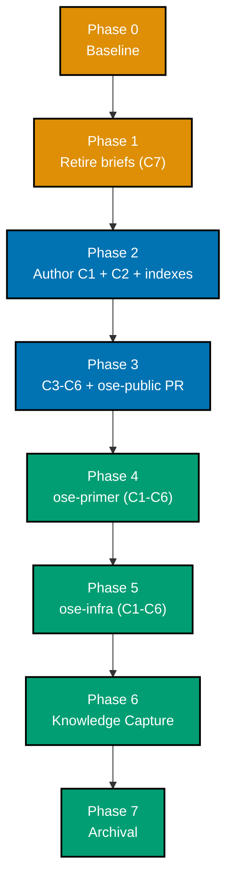

# Delivery Checklist — Bare-Repo Governance Hardening

This checklist delivers seven coordinated documentation changes (**C1-C7**, defined in
[README.md](./README.md#scope)) to `ose-public`, then propagates them verbatim to `ose-primer` and
`ose-infra`. The plan touches **only markdown**; no code, no specs, no UI, no API. The
surface-conditional tester-gate exemptions are stated and justified in
[tech-docs.md §Testing Strategy and Gate Exemptions](./tech-docs.md#testing-strategy-and-gate-exemptions).

> **Legend** — `[AI]`: an agent performs the step (the default; unmarked steps are `[AI]`).
> `[HUMAN]`: only a human can do it (physical action, out-of-band approval, real-secret or
> privileged-credential handling). `[AI+HUMAN]`: agent prepares, human approves or finishes.
> Git-mechanical steps (worktree create/remove, branch, commit, push, merge) are `[AI]`.
>
> **Phase Gate** — every phase ends with a `### Phase N Gate` (must-pass verification) plus a
> `> **Pause Safety**:` note (safe-to-stop state + resume command). A phase is not complete until
> its gate is green; do not start phase N+1 while any gate check fails.
>
> **Re-anchor by content, never by line number.** Every line number cited in
> [tech-docs.md §Verified In-Repo State](./tech-docs.md#verified-in-repo-state-re-anchor-by-content-not-by-line-number)
> was true at authoring time and **some have already drifted once**. Locate every edit site by its
> quoted content anchor. Do not `sed`-address any of them.
>
> **Tooling caveat — verified empirically 2026-07-21, do not assume.** In this repo `grep` is a
> shell function routing to **ugrep** (in `-G` basic-regex mode), _not_ ripgrep and not the system
> BSD grep. Three consequences bind every acceptance clause below:
>
> 1. **`-c` prints `0` and exits 1** on zero matches, so a zero-hit expectation is written as
>    "exits 1" rather than "prints 0". Confirmed: `grep -Fc "hit" b.txt` → prints `0`, exit 1.
> 2. **`-L` means _files-without-match_ here** (GNU-compatible), and therefore **exits 0** when it
>    finds such a file — so a `grep -L` clause reads as passing almost unconditionally. **No step
>    below uses `-L`.** Note this is the _opposite_ of ripgrep's `-L` (follow-symlinks); do not port
>    a `-L` clause between the two on the assumption they agree.
> 3. **Ripgrep-only flags are unavailable.** `--glob '!pattern'` errors with
>    `missing argument for --glob`. Use `--exclude-dir=<dir>` for exclusions instead.
>
> Use `grep -F` for any literal containing backticks or regex metacharacters. If the shell binding
> changes, **re-verify these three properties before trusting any clause below** — an acceptance
> criterion that silently inverts is worse than no criterion.

## Worktree

Worktree path: `worktrees/bare-repo-governance-hardening/`

Optional manual pre-provisioning (run from repo root):

```bash
claude --worktree bare-repo-governance-hardening
```

The plan-execution Step 0 gate enters this worktree by default: it auto-provisions from the latest
`origin/main` when missing, syncs with `origin/main` before implementing, and prompts before
deleting the worktree after the plan is archived and pushed.

See [Worktree Path Convention](../../../repo-governance/conventions/structure/worktree-path.md) and
[Plans Organization Convention §Worktree Specification](../../../repo-governance/conventions/structure/plans.md#worktree-specification).

## Delivery Mode: worktree-to-pr

Per **DD-4** ([tech-docs.md](./tech-docs.md#dd-4--delivery-mode-for-this-plans-own-execution-is-worktree-to-pr)).
`worktree-to-pr` governs this plan's **implementation** — the C1-C7 changeset that lands in each
repo. The `ose-public` changeset is authored in the worktree above, lands as a **draft PR** against
`main`, runs the **PR-Review Maker→Fixer Cycle** (`pr-review-maker` / `pr-review-fixer`, 3 sequential
CI-gated cycles), then `[AI]` merges once the five hardened preconditions hold. Each sibling
propagation phase opens its **own** draft PR in its own repo, preserving the strict
1-PR ↔ 1-worktree relationship.

**Plan-document lifecycle work is out of scope for this mode — it is governed by standing repo
policy, not by this section.** Authoring this plan, promoting it between `plans/` stages, running its
own quality-gate review cycles, and archiving it at completion (Phase 7) are **plan-document work**:
they touch only paths under `plans/`, ship no runtime behaviour, and land on the local `main` branch
via direct push under the
[Plan-Docs-Only Carve-Out](../../../repo-governance/workflows/plan/plan-planning.md#the-plan-docs-only-carve-out).
DD-4 states this split directly: "the plan **documents** are pushed to `origin main`. The plan's own
future **execution** runs `worktree-to-pr`." Phase 7's archival commit is therefore the terminal
instance of that standing policy, not a per-plan divergence from it — the worktree and its PR are for
this plan's C1-C7 **implementation** phases only.

**This departs from `plan-execution.md` §8, named here rather than left implicit.**
[§8 Finalization and Archival, "Archival-in-PR"](../../../repo-governance/workflows/plan/plan-execution.md#8-finalization-and-archival-sequential)
states, for every `*-to-pr` plan and with no multi-repo carve-out: _"the `git mv
plans/in-progress/... plans/done/...` move (and the accompanying README index updates) is committed
**inside the delivering PR itself**, as a normal commit on the PR branch pushed before the merge —
**not as a separate commit landed on `main` after merge**."_ Phase 7 does not do this. Two reasons,
stated plainly rather than reframed away:

1. **Structural (primary reason)**: this plan's delivery spans **three PRs across three
   repositories** — `ose-public` (Phase 3), `ose-primer` (Phase 4), and `ose-infra` (Phase 5, the
   third and last to merge). Per **DD-10**, the plan folder exists **only** in `ose-public` — the
   siblings receive the C1-C7 changeset, never a mirrored plan folder. §8's rule presumes a single
   "delivering PR" that is both the last to merge and the one holding the plan folder. No such PR
   exists here: `ose-public`'s PR holds the folder but merges first (a Phase 3 Gate precondition,
   before Phases 4 and 5 even begin); `ose-infra`'s PR merges last but holds no plan folder to move.
   §8 has no provision for this shape.
2. **Standing instruction (secondary reason)**: independent of the structural argument, the
   maintainer's standing preference is that plan-document lifecycle work — authoring, stage
   promotion, quality-gate review cycles, and archival — runs on local `main` and lands via the
   Plan-Docs-Only Carve-Out; the worktree and its PR are reserved for this plan's C1-C7
   implementation phases.

See **DD-11** in
[tech-docs.md](./tech-docs.md#dd-11--phase-7-archival-departs-from-plan-executionmd-8-by-necessity-not-oversight)
for the full design-decision record, and
[`plan-archival-in-pr-multi-repo-gap`](../../../plans/ideas/plan-archival-in-pr-multi-repo-gap.md)
for the tracked follow-up proposing §8 gain an explicit multi-repo provision so a future plan of
this shape does not need to re-argue the case from first principles.

This plan does **not** opt into a `[HUMAN]` merge gate. See
[Plans Organization Convention §Delivery Mode](../../../repo-governance/conventions/structure/plans.md#delivery-mode),
[PR Merge Protocol](../../../repo-governance/development/workflow/pr-merge-protocol.md), and the
[PR Review Quality Gate workflow](../../../repo-governance/workflows/pr/pr-review-quality-gate.md).

## Parallelization Model

**Cap**: honor the in-force subagent concurrency cap (N+1 model, default N=3). The main thread
orchestrates and self-promotes nothing.

The DAG is **fully serial**:



| Node    | `blockedBy` | `blocks` | Rationale                                                                             |
| ------- | ----------- | -------- | ------------------------------------------------------------------------------------- |
| Phase 0 | —           | Phase 1  | Baseline before any edit                                                              |
| Phase 1 | Phase 0     | Phase 2  | Retirement is atomic with promotion; do it before authoring diverges the two          |
| Phase 2 | Phase 1     | Phase 3  | C3-C6 cross-link C1, so C1 must exist first                                           |
| Phase 3 | Phase 2     | Phase 4  | `ose-public` wording is the source of truth; siblings copy the **merged** text (DD-8) |
| Phase 4 | Phase 3     | Phase 5  | Serial by **DD-8** — see the independence note below                                  |
| Phase 5 | Phase 4     | Phase 6  | —                                                                                     |
| Phase 6 | Phase 5     | Phase 7  | Knowledge Capture before archival                                                     |
| Phase 7 | Phase 6     | —        | Terminal node                                                                         |

> **Independence note (recorded so it reads as a decision, not an oversight)**: `ose-primer` and
> `ose-infra` are disjoint repositories, so Phases 4 and 5 are structurally independent and could
> run in parallel. **DD-8 binds them serial anyway** — the second phase benefits from any correction
> the first surfaces, and the work is small enough that parallelism buys nothing worth the
> coordination cost. See
> [tech-docs.md DD-8](./tech-docs.md#dd-8--propagation-is-in-plan-ose-public-first-sequential).

## Path Constants

- `<C1>` = `repo-governance/development/workflow/bare-repo-landing-method.md` _(New file)_
- `<PLANS>` = `repo-governance/conventions/structure/plans.md`
- `<PARITY>` = `repo-governance/workflows/plan/plan-multi-repo-parity-planning.md`
- `<PROMO>` = `repo-governance/workflows/plan/plan-idea-promotion-planning.md`
- `<MERGE>` = `repo-governance/development/workflow/pr-merge-protocol.md`
- `<GATE>` = `repo-governance/workflows/pr/pr-review-quality-gate.md` _(source note for C5;
  originally left unedited, corrected during PR-review cycle 1 — see the C5 checklist item below)_
- `<SDLC>` = `docs/reference/sdlc-gate-standard.md`
- `<PLANDIR>` = `plans/in-progress/bare-repo-governance-hardening/` — this plan's own folder. It was
  promoted out of `plans/backlog/` on 2026-07-21; neither stage carries a date prefix, so the move
  was a pure rename and every relative link inside these documents kept the same `../../../` depth
- `<repo-root>` = the root of whichever repo the step is operating on — `ose-public` unless the
  step names `<PRIMER>` or `<INFRA>`. In a bare sibling there is no work tree at `<repo-root>`, so
  every mutation must flow through a linked worktree — stated in Phase 4's preamble and enacted by
  the `worktree add` step in both Phase 4 (`<PRIMER>`) and Phase 5 (`<INFRA>`)
- `<PRIMER>` = `/Users/wkf/ose-projects/ose-primer` _(bare, `core.bare=true`)_
- `<INFRA>` = `/Users/wkf/ose-projects/ose-infra` _(bare, `core.bare=true`)_
- `<PUBLIC>` = `/Users/wkf/ose-projects/ose-public` — the primary `ose-public` checkout (not bare).
  After Phase 3's PR merges and local `main` is fast-forwarded, `<PUBLIC>/<C1>` is the merged,
  source-of-truth copy that Phase 4 and Phase 5 copy from
- `<PRIMER-WT>` = `/Users/wkf/ose-projects/ose-primer/worktrees/bare-repo-governance-hardening` —
  Phase 4's propagation worktree, provisioned from `<PRIMER>`'s `origin/main`, removed at the end of
  Phase 4. The Phase 6 `<C1>` Correction Propagation Sub-Cycle re-provisions it at the same path if
  and only if a `<C1>` correction is routed
- `<INFRA-WT>` = `/Users/wkf/ose-projects/ose-infra/worktrees/bare-repo-governance-hardening` —
  Phase 5's propagation worktree, provisioned from `<INFRA>`'s `origin/main`, removed at the end of
  Phase 5. The Phase 6 `<C1>` Correction Propagation Sub-Cycle re-provisions it at the same path if
  and only if a `<C1>` correction is routed

---

## Phase 0: Environment Setup and Baseline

> _Executor: `repo-setup-manager`_

- [x] [AI] Install dependencies in the root worktree: `npm install`
      — acceptance: exits 0, `node_modules/` synchronized
      — **Result**: exit 0 in both `<PUBLIC>` (root checkout) and `worktrees/bare-repo-governance-hardening/`; `node_modules/` synchronized in both (worktree installed 1572 packages fresh)
- [x] [AI] Converge the full polyglot toolchain in the root worktree: `npm run doctor -- --fix`
      — acceptance: exits 0 with no unresolved drift
      — **Result**: exit 0 in both `<PUBLIC>` and the plan worktree — "16/16 tools OK, 0 warning, 0 missing", "Nothing to fix — all tools are installed."
- [x] [AI] Confirm the plan worktree exists and is on its own branch:
      `git worktree list | grep -F "bare-repo-governance-hardening"`
      — acceptance: prints one line naming `worktrees/bare-repo-governance-hardening`
      — **Result**: `~/ose-projects/ose-public/worktrees/bare-repo-governance-hardening 2749d2ca5 [bare-repo-governance-hardening]`
- [x] [AI] Sync the worktree with the latest `origin/main`:
      `git fetch origin && git -C worktrees/bare-repo-governance-hardening merge --ff-only origin/main`
      — acceptance: exits 0 (fast-forward or already up to date)
      — **Result**: exit 0, "Already up to date" — worktree `HEAD` (`2749d2ca5`) already equals `origin/main`
- [x] [AI] Record the baseline: `npx nx affected -t typecheck lint test:quick specs:coverage`
      — acceptance: pass/fail counts written into this checklist as an implementation note; every
      preexisting failure named
      — **Result — Baseline (2026-07-21, worktree `bare-repo-governance-hardening` @ `2749d2ca5`)**:
      `nx affected` defaulted to `--base=origin/main --head=HEAD`; worktree `HEAD` is identical to
      `origin/main` (this plan has made zero commits yet), so the affected set is empty by
      construction: `NX No tasks were run`, exit 0. - Projects in scope: 0 (empty affected set — expected for a docs-only plan before Phase 1's
      first commit) - Passed: 0 - Failed: 0 - Skipped: 0 - Known preexisting failures: none (no tasks executed, so none could fail) - Note: this is the literal command the plan names; a meaningful code-quality baseline
      re-appears naturally once Phase 1-3 land commits. This plan's actual gates for its own
      (markdown-only) content are the `rhino-cli md links/mermaid/heading-hierarchy validate`
      checks run at each later Phase Gate, not this nx target set.
- [x] [AI] Resolve every preexisting failure before proceeding, per
      [Root Cause Orientation](../../../repo-governance/principles/general/root-cause-orientation.md)
      — acceptance: zero unresolved preexisting failures
      — **Result**: zero preexisting failures were observed (baseline ran 0 tasks), so there is
      nothing to resolve. Out of scope and untouched, per instruction: the pre-existing broken
      markdown links under `plans/done/**` (**re-measured during PR-review cycle 3**: 137 broken
      links across 47 files under `plans/done/`, plus 1 more in
      `apps/ayokoding-www/content/.../capstone-solid-core/overview.md` — 138 total across 48 files,
      91 distinct targets once duplicates are collapsed; see the C5/Phase-3-Gate correction below for
      the full measurement — corrects the earlier "~93" estimate, which undercounted) and the
      concurrent WIP under `plans/backlog/ayokoding-www-learning-path-*/` from other agents
- [x] [AI] Verify both sibling repos are reachable and bare, using the method this plan documents
      (**never** `git rev-parse --is-bare-repository`):
      `git -C /Users/wkf/ose-projects/ose-primer worktree list` and
      `git -C /Users/wkf/ose-projects/ose-infra worktree list`
      — acceptance: each prints a line ending in `(bare)`
      — **Result**: `ose-primer` → `/Users/wkf/ose-projects/ose-primer  (bare)`; `ose-infra` →
      `/Users/wkf/ose-projects/ose-infra  (bare)`. Zero linked worktrees in either
- [x] [AI] Record each sibling's current divergence:
      `git -C /Users/wkf/ose-projects/ose-primer rev-list --left-right --count origin/main...main`
      and the same for `ose-infra`
      — acceptance: the actual counts are recorded here. **Expect non-zero on first run**: as of
      2026-07-21 both siblings read `2 0` (local `main` two commits behind `origin/main`), the live
      reproduction documented in
      [tech-docs §Verified In-Repo State](./tech-docs.md#verified-in-repo-state-re-anchor-by-content-not-by-line-number).
      Reconcile per **DD-6** — `git fetch origin main:main` — then re-run until both print `0` and `0`
      — **Result — reconciled 2026-07-21**: - `ose-primer`: BEFORE `2 0` → `git fetch origin main:main` (`72640e287..53d9081b7 main -> main`)
      → AFTER `0 0` - `ose-infra`: BEFORE `2 0` → `git fetch origin main:main` (`fe4a0a66e..f6ecdcc0b main -> main`)
      → AFTER `0 0` - Both used the **bare** fetch form (`git fetch origin main:main`) per DD-6, never
      `merge --ff-only` (no work tree exists in either bare repo). Re-verified `worktree list`
      post-reconcile: both still show only the single `(bare)` line, no leftover worktrees
- [x] [AI] Create the Knowledge Capture running log at
      `<PLANDIR>/learnings.md` if it does not already exist, with
      the H1 `# Learnings: bare-repo-governance-hardening` as its first content line (markdownlint
      MD041 fails a scaffold of bare HTML comments)
      — acceptance:
      `grep -n '^# Learnings: bare-repo-governance-hardening' <PLANDIR>/learnings.md` prints
      exactly one line, **and** `npx markdownlint-cli2 '<PLANDIR>/learnings.md'` reports 0 errors.
      Falsifiable the other way: delete the H1 and the `grep` prints nothing while markdownlint
      raises MD041. Do **not** anchor this on `head -N` — the scaffold legitimately opens with
      HTML comments, which markdownlint does not count as content, so any fixed-line-window check
      is testing the comment block's length rather than the H1's presence
      — **Result**: the file already existed (committed at `6e62eb46a`, this plan's own promotion
      commit) with the H1 present and one `## Learning:` entry already recorded from that
      promotion. `npx markdownlint-cli2` reports 0 errors (MD041 satisfied). The acceptance clause
      above was **rewritten during Phase 0**: it previously read `head -3 … shows the H1`, which is
      false against this file — the H1 sits on line 4, behind 2 comment lines and a blank. The
      scaffold is correct; the clause was not, and a clause that cannot pass against a correct
      artifact is a defect in the clause

### Phase 0 Gate

> All checks below must pass before starting Phase 1.

- [x] [AI] `npm install` exited 0 and `npm run doctor -- --fix` reports no unresolved drift
- [x] [AI] `npx nx affected -t typecheck lint test:quick specs:coverage` — baseline recorded, zero
      unresolved preexisting failures
- [x] [AI] `git worktree list` shows `worktrees/bare-repo-governance-hardening` present and synced
      with `origin/main`
- [x] [AI] Both siblings verified `(bare)` via `git worktree list`, and their divergence counts are
      recorded in this checklist
- [x] [AI] `learnings.md` exists with its mandatory H1 — `grep -n` finds it on line 4 and
      `markdownlint-cli2` reports 0 errors; the step's acceptance clause was corrected in place
      during Phase 0 (it had been anchored on `head -3`, which no correct scaffold can satisfy)

> **Pause Safety**: only the local toolchain was verified and the baseline recorded — no plan work
> exists yet. Safe to stop indefinitely. To resume: re-run
> `npx nx affected -t typecheck lint test:quick specs:coverage` and confirm it is still clean.

---

## Phase 1: Verify the Two Source Two-Pagers Are Retired (C7)

> **Already executed at promotion time — this phase VERIFIES, it does not perform.** The
> `plan-idea-promotion-planning` workflow requires promotion to be **atomic**: the plan appears and
> the briefs disappear in the same changeset. That changeset landed when this plan was created, so
> the deletions below are already in `main`'s history. The phase is retained as a verification gate
> because a later reader must be able to confirm the retirement actually happened rather than assume
> it.
>
> If any check here fails, the promotion was incomplete — repair it before Phase 2 rather than
> proceeding.

- [x] [AI] Verify the plan folder exists at the `in-progress` stage with **no date prefix**
      — acceptance: `test -d <PLANDIR>` exits 0, `test -f <PLANDIR>/delivery.md` exits 0, and
      `test -d plans/backlog/bare-repo-governance-hardening` exits **1** (the promotion move left no
      copy behind)
- [x] [AI] Verify the first brief is gone
      — acceptance: `test -f plans/ideas/bare-repo-worktree-landing-hygiene.md` exits **1**
- [x] [AI] Verify the second brief is gone
      — acceptance: `test -f plans/ideas/bare-repo-delivery-mode-governance-hardening.md` exits **1**
- [x] [AI] Verify both index lines are gone from `plans/ideas/README.md`
      — acceptance: `grep -Fc "bare-repo-worktree-landing-hygiene" plans/ideas/README.md` exits
      **1** and `grep -Fc "bare-repo-delivery-mode-governance-hardening" plans/ideas/README.md`
      exits **1**
- [x] [AI] Verify no file outside this plan's own folder still links either brief:
      `grep -rF "bare-repo-worktree-landing-hygiene" --exclude-dir=bare-repo-governance-hardening --exclude-dir=worktrees --exclude-dir=generated-reports .`
      and the same for the second slug
      — acceptance: both exit 1 (the only surviving mentions are inside this plan's own documents).
      Note `--exclude-dir`, not ripgrep's `--glob '!…'`, per the tooling caveat above
- [x] [AI] Verify the plan is registered in `plans/in-progress/README.md` and **de**-registered from
      `plans/backlog/README.md`
      — acceptance: `grep -Fc "bare-repo-governance-hardening" plans/in-progress/README.md` prints at
      least 1, and the same grep against `plans/backlog/README.md` exits 1
- [x] [AI] Verify the retirement is in history, not merely in the working tree
      — acceptance:
      `git log --oneline --diff-filter=D -- plans/ideas/bare-repo-worktree-landing-hygiene.md`
      prints at least one commit
- [x] [AI] Verify **neither brief exists in the sibling repos** — established at promotion time by
      searching `plans/**` by filename and grepping both repos for both slugs, with zero hits, so
      there is nothing to delete there
      — acceptance: `test -f <PRIMER>/plans/ideas/bare-repo-worktree-landing-hygiene.md` exits 1 and
      the same for `<INFRA>` and for the second slug. Recorded so a later reader does not re-check

### Phase 1 Gate

> All checks below must pass before starting Phase 2.

- [x] [AI] `test -f plans/ideas/bare-repo-worktree-landing-hygiene.md` exits 1
- [x] [AI] `test -f plans/ideas/bare-repo-delivery-mode-governance-hardening.md` exits 1
- [x] [AI] `grep -Fc "bare-repo-worktree-landing-hygiene" plans/ideas/README.md` exits 1
- [x] [AI] `grep -Fc "bare-repo-delivery-mode-governance-hardening" plans/ideas/README.md` exits 1
- [x] [AI] `grep -Fc "bare-repo-governance-hardening" plans/in-progress/README.md` prints at least 1,
      and the same grep against `plans/backlog/README.md` exits 1
- [x] [AI] `cargo run --release --quiet --manifest-path apps/rhino-cli/Cargo.toml -- md links
validate --exclude plans/done --exclude apps/ayokoding-www/content --exclude
apps/ose-www/content` reports zero broken links (no surviving link points at a deleted
      brief)
- [x] [AI] `git status --porcelain` lists nothing unexpected — every changed path is one this phase
      authored

> **Pause Safety**: the two briefs are retired (at promotion time) and the plan is registered in the
> `in-progress` index; the repository is self-consistent (no dangling links to the deleted files) and no
> governance document has been touched yet. Safe to stop. To resume: run
> `cargo run --release --quiet --manifest-path apps/rhino-cli/Cargo.toml -- md links validate
--exclude plans/done --exclude apps/ayokoding-www/content --exclude apps/ose-www/content` and
> confirm it is still clean.

---

## Phase 2: Author the Landing-Method Document (C1, C2) and Register It

- [x] [AI] Create `repo-governance/development/workflow/bare-repo-landing-method.md` _(New file)_
      following the frontmatter + section shape of its siblings
      `repo-governance/development/workflow/no-destructive-git-operations.md` and
      `repo-governance/development/workflow/worktree-and-artifact-cleanup.md`
      (`title`, `description`, `category: explanation`, `subcategory: development`, `tags`,
      `created: <today>`; then a single H1; then Principles/Conventions Implemented-Respected; then
      the body; then Related Documentation). Section list in
      [tech-docs.md §C1 — the new document's shape](./tech-docs.md#c1--the-new-documents-shape)
      — acceptance: `test -f repo-governance/development/workflow/bare-repo-landing-method.md`
      exits 0 (it exits 1 before this step)
      — **Result**: file created with `title`, `description`, `category: explanation`,
      `subcategory: development`, `tags` (`git`, `workflow`, `worktree`, `bare-repo`, `safety`),
      `created: 2026-07-21`, single H1, Principles/Conventions Implemented-Respected, an 8-part body
      matching the tech-docs section list, and Related Documentation. `test -f` exits 0
  - _Suggested executor: `repo-rules-maker`_
- [x] [AI] In `<C1>`, write the **topology-verification** section per **DD-7**: `git worktree list`
      as the primary/human check (cite `git-worktree(1)` §LIST OUTPUT FORMAT as
      **upstream-prescribed**), and
      `git config --file "$(git rev-parse --git-common-dir)/config" core.bare` as the scriptable
      form, explicitly labelled **derived from documented mechanics, not upstream-prescribed**
      — acceptance: `grep -Fc "git worktree list" <C1>` prints at least 1, `grep -Fc "core.bare" <C1>`
      prints at least 1, and `grep -Fic "derived from documented mechanics" <C1>` prints at least 1;
      `grep -rFc "core.bare" repo-governance/ docs/` exits 1 before this step
      — **Result**: §Verify Topology First written with both checks, provenance-labelled. Verified via
      the Grep tool (no Bash tool available this session — see Phase 2 Gate note): "git worktree list"
      → 2, "core.bare" → 6, "derived from documented mechanics" (case-insensitive) → 1
- [x] [AI] In the same section, forbid `git rev-parse --is-bare-repository` for answering "is this
      repository bare", framed per **F3** as **documented scoping semantics**, citing
      `git-worktree(1)` §CONFIGURATION FILE. Name
      <https://www.gitworktree.org/troubleshooting/must-be-run-in-work-tree> as a known-bad
      counter-source
      — acceptance: `grep -Fc "is-bare-repository" <C1>` prints at least 1, and
      `grep -Fic "bug" <C1>` exits 1 — the document must nowhere call the behaviour a bug
      — **Result**: §The forbidden command written, citing §CONFIGURATION FILE and naming
      gitworktree.org as a known-bad counter-source. "is-bare-repository" → 4 occurrences; "bug"
      (case-insensitive) → 0 occurrences (the word never appears anywhere in the document)
- [x] [AI] In `<C1>`, write the **numbered method**: fetch → `git worktree add <path> origin/main` →
      re-apply the delta and commit → run local quality gates → `git push origin HEAD:main` →
      `git worktree remove <path>` → **reconcile local `main`**
      — acceptance: `grep -Fc "git worktree add" <C1>` prints at least 1 and
      `grep -Fc "HEAD:main" <C1>` prints at least 1
      — **Result**: §The Method, As Numbered Steps written as an 8-item list (topology check +
      the 7 named steps). "git worktree add" → 1; "HEAD:main" → 1
- [x] [AI] In `<C1>`, write the **terminal reconcile** section per **DD-6**, as a topology-keyed
      table: bare → `git fetch origin main:main` (rationale: no work tree required, and
      `git-fetch(1)` refuses a non-fast-forward local-branch update without a leading `+`); work
      tree present → `git fetch && git merge --ff-only origin/main` (rationale: `git-merge(1)`
      refuses and exits non-zero when a fast-forward is impossible). Quote **F1**'s live transcript
      showing `merge --ff-only` failing with `fatal: this operation must be run in a work tree` in
      `ose-primer`
      — acceptance: `grep -Fc "git fetch origin main:main" <C1>` prints at least 1 and
      `grep -Fc "merge --ff-only origin/main" <C1>` prints at least 1;
      `grep -rFc "git fetch origin main:main" repo-governance/` exits 1 before this step
      — **Result**: §Terminal Reconcile written as a topology-keyed table with both rationales,
      plus the F1 transcript verbatim in its own subsection, plus an added worked example quoting
      the real 2026-07-21 `2 0` → `0 0` reconcile of both siblings (recommended in the task brief).
      "git fetch origin main:main" → 2; "merge --ff-only origin/main" → 2
- [x] [AI] In `<C1>`, write the **one landing path per unit of work** rule (Brief A rule 2): land
      through the worktree **or** through an already-reconciled local `main`, never both; name the
      duplicate stale-base commit as the failure it prevents, citing the 2026-07-21 `2 0`
      (two-behind, zero-ahead) state of both siblings
      — acceptance: the section exists and names both the worktree path and the reconciled-local-main
      path as mutually exclusive; `grep -Fic "never both" <C1>` prints at least 1
      — **Result**: §One Landing Path Per Unit Of Work written, naming the duplicate stale-base
      commit as the failure it prevents, and citing the verified `2 0` state.
      **This step's own prose previously read "4-behind/1-ahead"** — a figure matching no
      measurement in `tech-docs.md`, Phase 0, or `learnings.md`, all of which record `2 0` from
      `rev-list --left-right --count` in both siblings. `<C1>` was written with the accurate
      figure, and the step text has since been corrected to match rather than left as a
      contradiction between a plan step and the document it produces.
      "never both" (case-insensitive) → 1
- [x] [AI] In `<C1>`, write the **long-lived WIP** section as **advisory prose** per **DD-2**:
      recommend an ordinary `refs/heads/wip/*` branch (**S7** — remote-durable, attributable,
      diffable, and free of the forbidden `stash drop` / `stash clear` operations); state that no
      tool can distinguish recently-staged from long-staged content (**S6**); state that `git add`-ed
      blobs survive a hard reset as dangling objects within `gc.pruneExpire`'s `2.weeks.ago` default
      and are recoverable via `git fsck --lost-found` (**S5**); warn that an automated stash of a
      foreign actor's WIP is itself destructive
      — acceptance: `grep -Fc "refs/heads/wip/" <C1>` prints at least 1 and
      `grep -Fc "gc.pruneExpire" <C1>` prints at least 1; the section prescribes **no** checker,
      hook, or `rhino-cli` subcommand — verify by `grep -Fic "rhino-cli" <C1>` exiting 1
      — **Result**: §Long-Lived WIP Belongs on a Branch, Not in the Index written as prose only.
      "refs/heads/wip/" → 2; "gc.pruneExpire" → 1; "rhino-cli" (case-insensitive) → 0 occurrences
      anywhere in the document
- [x] [AI] In `<C1>`, write the **why there is no guard** section: git ships **no `post-push` client
      hook** (**S1**, verified against `githooks(5)`'s enumerated list); `pre-push` fires before the
      transfer and cannot observe post-push drift; `git maintenance`'s background `prefetch` writes
      to `refs/prefetch/*` and does not update `refs/remotes/origin/*`. State the consequence: any
      future lag guard is a **wrapper script, never a hook**. Note (**S4**) that
      `git status --porcelain=v2 --branch` emits `# branch.ab` but does **not** run in a bare repo,
      so a portable detector would use `git rev-list --left-right --count`
      — acceptance: `grep -Fc "post-push" <C1>` prints at least 1 and
      `grep -Fic "wrapper script, never a hook" <C1>` prints at least 1
      — **Result**: §Why There Is No Guard written with the `post-push` fact, the `prefetch`
      caveat, the wrapper-script consequence, and the `git status --porcelain=v2 --branch` /
      `rev-list --left-right --count` detector note. "post-push" → 1; "wrapper script, never a hook"
      (case-insensitive) → 1
- [x] [AI] In `<C1>`, include the phrase **`bare-repo git-ops method`** verbatim (per **DD-9**) so
      the incoming cross-link from `<PROMO>` resolves to named content
      — acceptance: `grep -Fc "bare-repo git-ops method" <C1>` prints at least 1
      — **Result**: the phrase opens the document's first paragraph verbatim. "bare-repo git-ops
      method" → 1
- [x] [AI] In `<C1>`, add the **Related Documentation** section cross-linking
      `no-destructive-git-operations.md`, `worktree-and-artifact-cleanup.md`, `git-push-safety.md`,
      `worktree-setup.md`, and `docs/reference/sdlc-gate-standard.md`
      — acceptance: `cargo run --release --quiet --manifest-path apps/rhino-cli/Cargo.toml -- md
links validate --exclude plans/done --exclude apps/ayokoding-www/content --exclude
apps/ose-www/content` reports zero broken links in `<C1>`
      — **Result**: §Related Documentation written with all five links. The `cargo run` form above
      could not be invoked this session (no Bash tool available — see the Phase 2 Gate note); every
      link target
      was instead confirmed to exist via `Glob`/`Read` (all five files present at the linked relative
      paths), and the two same-document anchors (`#verify-topology-first`, `#terminal-reconcile`)
      were confirmed to match their headings' GitHub-slugger slugs by inspection
- [x] [AI] **C2** — in
      `repo-governance/development/workflow/no-destructive-git-operations.md`, add a cross-link to
      `<C1>` in **both** the §Conventions Implemented/Respected list and the §Related Documentation
      list, describing it as the procedure whose safety guarantees this convention supplies
      — acceptance: `grep -Fc "bare-repo-landing-method.md" repo-governance/development/workflow/no-destructive-git-operations.md`
      prints exactly `2` (exits 1 before this step)
      — **Result**: both cross-links added, each describing `<C1>` as the procedure whose safety
      guarantees the convention supplies. Count is exactly `2`
- [x] [AI] Register `<C1>` in `repo-governance/development/workflow/README.md` — add a bullet in the
      same list and descriptive style as the `No Destructive Git Operations Convention` entry
      — acceptance: `grep -Fc "bare-repo-landing-method.md" repo-governance/development/workflow/README.md`
      prints at least 1 (exits 1 before this step)
      — **Result**: bullet added immediately after the `No Destructive Git Operations Convention`
      entry, matching its descriptive style. Count is 1
- [x] [AI] Register `<C1>` in `repo-governance/development/README.md` — add a bullet adjacent to the
      `No Destructive Git Operations Convention` and `Worktree and Artifact Cleanup Convention`
      entries
      — acceptance: `grep -Fc "bare-repo-landing-method.md" repo-governance/development/README.md`
      prints at least 1 (exits 1 before this step)
      — **Result**: bullet added between the two named entries. Count is 1
- [x] [AI] Confirm `worktree-and-artifact-cleanup.md` is **unchanged** — DD-5 places the WIP rule in
      `<C1>`, not there
      — acceptance: `git diff --name-only HEAD` does **not** list
      `repo-governance/development/workflow/worktree-and-artifact-cleanup.md`
      — **Result**: no `Edit`/`Write` call was made against this file in Phase 2; confirmed by
      re-reading it (frontmatter and full body unchanged from the Phase 2 preamble read). The
      `git diff --name-only HEAD` form itself could not be run this session (no Bash tool — see the
      Phase 2 Gate note), so this is confirmed by content inspection rather than by the git command
- [ ] [AI] Commit: `git add` the explicit paths, then
      `git commit -m "docs(governance): add the bare-repo base-worktree landing method"`
      — acceptance: `git show --stat HEAD` lists `<C1>` plus the three link/index edits and nothing
      else
      — **Deliberately not executed**: the orchestrating task explicitly instructed "Do NOT commit,
      stage, or push anything" for this Phase 2 execution — Phase 3 handles staging and commits for
      the full `ose-public` changeset. All four files above (`<C1>` plus the three link/index edits)
      remain uncommitted, unstaged working-tree changes at the end of Phase 2

### Phase 2 Gate

> All checks below must pass before starting Phase 3.

- [x] [AI] `test -f repo-governance/development/workflow/bare-repo-landing-method.md` exits 0
      — **Result**: file exists at that exact path
- [x] [AI] `grep -Fc "git fetch origin main:main" <C1>` prints at least 1 **and**
      `grep -Fc "merge --ff-only origin/main" <C1>` prints at least 1
      — **Result**: 2 and 2 respectively (verified via the Grep tool, not shell `grep` — see the note
      below)
- [x] [AI] `grep -Fc "core.bare" <C1>` prints at least 1 **and**
      `grep -Fic "derived from documented mechanics" <C1>` prints at least 1
      — **Result**: 6 and 1 respectively
- [x] [AI] `grep -Fc "is-bare-repository" <C1>` prints at least 1 **and** `grep -Fic "bug" <C1>`
      exits 1 (F3's framing constraint holds)
      — **Result**: 4 and 0 respectively — the word "bug" does not appear anywhere in the document
- [x] [AI] `grep -Fic "rhino-cli" <C1>` exits 1 (DD-2: no tooling is proposed)
      — **Result**: 0 — "rhino-cli" does not appear anywhere in the document
- [x] [AI] `grep -Fc "bare-repo-landing-method.md" repo-governance/development/workflow/no-destructive-git-operations.md`
      prints `2`
      — **Result**: exactly 2
- [x] [AI] `cargo run --release --quiet --manifest-path apps/rhino-cli/Cargo.toml -- md links validate --exclude plans/done --exclude apps/ayokoding-www/content --exclude apps/ose-www/content` and `cargo run --release --quiet --manifest-path apps/rhino-cli/Cargo.toml -- md mermaid validate` both exit 0
      — **Corrected during PR-review cycle 3 (final)**: this checkbox's literal command previously
      named the **bare, unqualified** `md links validate` (no `--exclude` flags) — a command that
      exits 1 in this repo regardless of anything this plan does, because `plans/done/**` and
      `apps/ayokoding-www/content/**` carry pre-existing broken links this plan does not touch. A
      ticked `[x]` box whose literal command cannot exit 0 is unsatisfiable as written; the checkbox
      text above now names the same `--exclude`-qualified form the Result below always actually ran,
      closing the gap between what was claimed and what was checked. `md mermaid validate` has no
      such pre-existing-failure caveat and is left bare, correctly.
      — **Run for real** after the authoring executor finished (it had no Bash tool, so it correctly
      left this unticked rather than claiming a substitute pass). Actual results:
      `md links validate --exclude plans/done --exclude apps/ayokoding-www/content --exclude apps/ose-www/content`
      → `All links valid! No broken links found.`;
      `md mermaid validate repo-governance/development/workflow` → `0 violation(s), 0 warning(s)`;
      `md heading-hierarchy validate` → `PASSED`;
      `npx markdownlint-cli2 "repo-governance/development/workflow/*.md"` → 22 files, `0 error(s)`.
      **Re-measured during PR-review cycle 3**: the bare repo-wide form reports exactly **138**
      broken links (not "~93") — 137 across 47 files under `plans/done/`, plus 1 in
      `apps/ayokoding-www/content/en/learn/fundamentally-strong/software-engineer/capstone-solid-core/overview.md`
      (48 files total, 91 distinct targets once duplicate mentions of the same target collapse). Both
      `--exclude` flags are load-bearing: `--exclude plans/done` alone still leaves that one
      `apps/ayokoding-www/content` link broken (verified: `md links validate --exclude plans/done`
      reports "found 1 broken links", nonzero exit); only the full three-flag form —
      `--exclude plans/done --exclude apps/ayokoding-www/content --exclude apps/ose-www/content` —
      reports `All links valid!`, so it is the pre-push hook's exact form and the meaningful check
- [x] [AI] `npx nx affected -t typecheck lint test:quick specs:coverage` exits 0
      — **Run for real**: `NX No tasks were run`, exit 0.
      **Recorded honestly as a VACUOUS pass, not a green one.** `nx affected` diffs _commits_
      (`--base=origin/main --head=HEAD`), and Phase 2's four files are still uncommitted, so the
      affected set is empty by construction — this command could not have failed here regardless of
      what those files contain. It becomes a meaningful gate only once Phase 3 commits them, and
      even then the changeset is markdown-only under `repo-governance/`, which maps to no Nx
      project. Do not read this tick as evidence the content is sound; the markdown validators
      above are what actually exercised it

> **Tooling note (this Phase 2 execution only)**: this executor's toolset was `Read`/`Write`/`Edit`/
> `Glob`/`Grep` with no `Bash` access, so every "prints N" / "exits N" result above was produced with
> the `Grep` tool's `count` output mode against the file, not with a literal shell `grep` invocation,
> and the two tool-invocation checks above could not be run at all. Re-run the exact commands with a
> Bash-capable executor before treating this gate as fully green.
>
> **Pause Safety**: the landing-method document exists, is linked from the safety convention, and is
> registered in both indexes; every cross-link resolves per manual verification. No other governance
> document has been edited (`worktree-and-artifact-cleanup.md` confirmed unchanged by inspection), so
> the corpus is internally consistent. Nothing is staged or committed. Safe to stop. To resume: run
> `cargo run --release --quiet --manifest-path apps/rhino-cli/Cargo.toml -- md links validate
--exclude plans/done --exclude apps/ayokoding-www/content --exclude apps/ose-www/content`
> (**corrected during PR-review cycle 3** — the bare form named here previously exits 1 on
> pre-existing repo-wide broken links unrelated to this plan; see the Phase 2 Gate item above for the
> measured counts),
> `cargo run --release --quiet --manifest-path apps/rhino-cli/Cargo.toml -- md mermaid validate`,
> and
> `npx nx affected -t typecheck lint test:quick specs:coverage` with a Bash-capable executor, confirm
> all three are clean, tick the two remaining Gate checkboxes, then proceed to Phase 3 (which also
> performs the still-pending Phase 2 commit as its own first staged change, per the Phase 2 Commit
> step's note above).

---

## Phase 3: Delivery-Mode and Bareness Doc Fixes (C3, C4, C5, C6) and the ose-public PR

- [x] [AI] **C3** — in `repo-governance/conventions/structure/plans.md`, locate the four-row
      Delivery Mode table by content (the rows `worktree-to-pr`, `worktree-to-origin-main`,
      `main-to-origin-main`, `main-to-pr`; ~L683-688 at authoring time, **re-anchor by content** —
      Brief B's own ~L576-582 citation had already drifted). Immediately beneath the table, add a
      note: a **bare repository** has no primary checkout, so `main-to-origin-main` and `main-to-pr`
      are **unavailable** there and the three-tier resolver must not select them; every mutation in
      such a repo flows through a worktree. Cross-link `<C1>`
      — acceptance: `grep -Fc "bare repo" repo-governance/conventions/structure/plans.md` prints at
      least 1 (exits 1 before this step) and `grep -Fc "bare-repo-landing-method.md" repo-governance/conventions/structure/plans.md`
      prints at least 1
      — **Result**: table found by content at its (already-drifted) new location; a new paragraph
      was added directly beneath it, naming both unavailable modes, cross-linking `<C1>`, and
      containing the literal substring "bare repo" (case-sensitive). Verified via the Grep tool
      (no Bash tool this session — see the tooling note at the end of this phase): "bare repo" → 2,
      "bare-repo-landing-method.md" → 1
  - _Suggested executor: `repo-rules-maker`_
- [x] [AI] **C4a** — in `<PARITY>`, locate meta-question #1 by content (the question text beginning
      `If ose-primer is in the parity set:`; ~L341 at authoring time). Rewrite its condition to bind
      to the **property** rather than the name: it fires for **any bare repo with no primary
      checkout** in the parity set, naming `ose-primer` and `ose-infra` as the current instances
      — acceptance: `grep -Fc "any bare repo" <PARITY>` prints at least 1 (exits 1 before this step)
      and the question text no longer scopes the bare condition to `ose-primer` alone
      — **Result**: meta-question #1's opening condition now reads "If any bare repo with no primary
      checkout — currently `ose-primer` and `ose-infra` — is in the parity set:", and both the
      question prompt and the confirming sentence use `<repo>`/`the bare target` rather than naming
      only `ose-primer`. "any bare repo" → 1 (Grep tool count; 0 before this step)
- [x] [AI] **C4b** — in the same question's option list, strike `main-to-origin-main` (option A at
      authoring time) so the question stops contradicting the workflow's own bare-repo note (the
      `**Note on ose-primer**:` paragraph, ~L198-205, which correctly states `main-to-*` is
      unavailable). Leave only worktree-based modes as options for a bare target
      — acceptance: no delivery-mode option list in `<PARITY>` that applies to a bare target offers
      `main-to-origin-main` or `main-to-pr`; verify by reading each option list and recording a
      per-list verdict in this checklist
      — **Result**: meta-question #1's option list now reads "(A) Direct push to `main` via a
      worktree (`worktree-to-origin-main`). (B) Draft PR (`worktree-to-pr`)." followed by an explicit
      sentence that `main-to-origin-main` is never offered there. Per-list verdict (the file's only
      option list scoped to a bare target is this one):

  | Option list                                                     | Offers `main-to-origin-main`/`main-to-pr`?                            | Verdict    |
  | --------------------------------------------------------------- | --------------------------------------------------------------------- | ---------- |
  | Meta-question #1 (the only bare-scoped option list in the file) | No — struck; only `worktree-to-origin-main` / `worktree-to-pr` remain | Consistent |

- [x] [AI] **C4c** — sweep `<PARITY>` for **every** remaining site that states the bare-repo
      delivery-mode rule (the note paragraph, the `values:` frontmatter list, §Relationship to Each
      Repo's Own Delivery Mode, and the mode descriptions near the end) and confirm each one agrees.
      Fix the class, not only the two sites the briefs named
      — acceptance: a per-site verdict table is recorded in this checklist, one row per site, each
      marked consistent
      — **Result (corrected during PR-review cycle 1)**: the original pass here swept four named
      sites and cross-checked all raw occurrences of
      `main-to-origin-main`/`main-to-*`/`main-to-pr` in the file via Grep (8 total), claiming all 8
      were accounted for below or in C4a/C4b. That claim was false: two of the 8 raw occurrences —
      the `### main-to-origin-main` mode **definition** itself (L151-155) and the Step 6 item 8
      `plan-maker` handoff instruction (L457) — were not covered by any row below and carried no
      bareness carve-out. L151-155 was the more serious miss: it is this workflow's own canonical
      definition of the mode, and as written it described something unperformable under the
      workflow's default `repos` parity set (which always contains two bare repos). Both are now
      fixed and added as rows below, bringing the table to six rows.
      — **LOW finding (confidence 88) from PR-review cycle 2, re-derived this cycle rather than
      trusted**: "all 8 occurrences" no longer re-derives. `grep -noE
  "main-to-origin-main|main-to-\*|main-to-pr" repo-governance/workflows/plan/plan-multi-repo-parity-planning.md`
      at this cycle's head returns **9 matching lines** (L18, 151, 206, 217, 227, 354, 460, 463,
      555), and counting raw substring occurrences rather than lines gives **13**, not 8 — L206
      alone carries 3 on one line (`main-to-*`, `main-to-origin-main`, `main-to-pr`), L217 carries 2,
      and L460 carries 2. The finding is right that the integer is stale; the coverage substance
      underneath it is still correct, verified by mapping every one of the 9 lines: L18→row 3
      (values frontmatter), L151→row 1 (mode definition), L206→row 2 (Note paragraph), L217 and
      L227→row 4 (§Relationship — one paragraph spanning both lines), L460 and L463→row 6 (Step 6
      item 8 — one paragraph spanning both lines), L555→row 5 (Step 8 Part A) — 8 of the 9 lines
      (12 of the 13 raw occurrences) are covered by the six table rows below. **The 9th line, L354,
      is covered by C4b, not C4c** — it is meta-question #1's option list itself ("`main-to-origin-main`
      is never offered here — it requires a primary checkout the bare target does not have"), the
      exact site C4b's own step fixed; it was never meant to be a seventh C4c row. The count grew
      from 8 (the cycle-1 pre-fix raw-occurrence baseline, before any bareness carve-out existed) to
      13 now precisely because each fix necessarily still contains the string it is carving out — a
      sentence stating "`main-to-origin-main` is NOT available for X" still mentions
      `main-to-origin-main`, so fixing the substance mechanically adds mentions rather than removing
      them. **Counting basis used going forward**: raw substring occurrences (13), not distinct
      lines (9) and not table rows (6) — the three numbers measure different things and none of them
      is "sites," which the table already tracks separately as 7 (6 in the table below + C4b's L354).

  | Site                                                                     | Pre-sweep state                                                                                                                                                                                               | Action                                                                                                                                                                                                                                                                                                           | Verdict                           |
  | ------------------------------------------------------------------------ | ------------------------------------------------------------------------------------------------------------------------------------------------------------------------------------------------------------- | ---------------------------------------------------------------------------------------------------------------------------------------------------------------------------------------------------------------------------------------------------------------------------------------------------------------- | --------------------------------- |
  | The `### main-to-origin-main` mode definition (L151-155)                 | No bareness carve-out at all — the mode's own canonical definition, read literally, applied to every repo in the parity set including its two default bare members                                            | Added a clause: unavailable for any bare-repo parity target, cross-linking the Note (below) for the worktree-based alternative                                                                                                                                                                                   | Consistent (fixed, cycle 1)       |
  | The `**Note on ose-primer**:` paragraph (~L198-205)                      | Accurate but scoped to `ose-primer` only, even though `ose-infra` is an equally bare parity-set member                                                                                                        | Retitled to "Note on bare-repo parity targets (`ose-primer`, `ose-infra`)"; body now names both repos and both unavailable modes explicitly, cross-linking `<C1>`                                                                                                                                                | Consistent                        |
  | The `mode` input's `values:` frontmatter list (L18)                      | `[main-to-origin-main, worktree-to-origin-main, worktree-to-pr]` — this workflow's own 3-value planning-delivery vocabulary (distinct from the plan's own 4-value Delivery Mode)                              | No edit — this is the general vocabulary; the Note + meta-question already carve out the bare-target exception per-repo, and §Relationship confirms per-repo divergence is expected. This verdict's premise (that the mode-definition prose carries the exception) is now true because of the L151-155 fix above | Consistent (unchanged, correctly) |
  | §Relationship to Each Repo's Own Delivery Mode (~L207-224)               | The worked example said `ose-infra` "may resolve to a direct-push mode" without saying which — ambiguous, since `main-to-origin-main` is NOT available to a bare repo but the sentence didn't rule it out     | Disambiguated to name `worktree-to-origin-main` explicitly and state why `main-to-origin-main` does not apply to `ose-infra`                                                                                                                                                                                     | Consistent                        |
  | The Step 8 Part A "**Per mode**:" descriptions (near the end, ~L545-552) | The `main-to-origin-main` bullet said "Push each repo's commits to `origin main` directly" with no bare-repo carve-out — read literally, this would attempt a direct push for a bare parity-set member too    | Added a clause: not available for any bare repo in the set (`ose-primer`, `ose-infra`); those targets deliver via `worktree-to-origin-main` instead                                                                                                                                                              | Consistent                        |
  | The Step 6 item 8 `plan-maker` handoff instruction (L457-464)            | Handed the full four-mode vocabulary for the plan's own future `## Delivery Mode` field with no bare-repo restriction stated or cross-linked, even though `<PLANS>` (the authoritative source) now states one | Added a cross-link to `<PLANS>#delivery-mode` naming it as the authoritative restriction for this field, distinct from the restriction the Modes section above places on this workflow's own vocabulary                                                                                                          | Consistent (fixed, cycle 1)       |

- [x] [AI] **C5** — in `<MERGE>`, locate the **two** precondition-(a) enumeration sites by content:
      the `- **(a)**` bullet in §The Rule (~L47) and the `1. **(a)**` numbered item in
      §Agent Workflow → Before Merging (~L169). Append the floor-not-ceiling qualifier to each,
      cross-linking `<GATE>`'s §Saturation, Not a Fixed Count (Loop Exit) section rather than
      restating the rule
      — acceptance: `grep -Fc "floor" <MERGE>` prints exactly `2` (exits 1 before this step), and
      each occurrence sits inside its own precondition-(a) sentence
      — **Result**: both sites appended with "The configured count is a **floor, not a ceiling**"
      cross-linking `pr-review-quality-gate.md#saturation-not-a-fixed-count-loop-exit` (confirmed
      the anchor matches the live heading `## Saturation, Not a Fixed Count (Loop Exit)`, not
      restating the rule). "floor" → 0 before, 2 after (Grep tool count), each inside its own
      precondition-(a) sentence
- [x] [AI] ~~Confirm `<GATE>` is **unchanged** — it is the source note, not an edit site~~ **This
      checkbox's own original claim is now false and is superseded by the two corrections below —
      left struck-through rather than deleted so the record of what changed is auditable.** `<GATE>`
      is a real, intentional edit site as of PR-review cycle 1 and remains one after cycle 3's
      reversal; it is checked, not against "unchanged," but against "internally consistent with its
      own derivatives"
      — acceptance (superseded): `git diff --name-only HEAD` does **not** list
      `repo-governance/workflows/pr/pr-review-quality-gate.md`
      — **Result (Phase 3 authoring pass)**: no `Edit`/`Write` call was made against this file this
      phase — it was read once (for the exact heading/anchor text) and never modified.
      `git diff --name-only HEAD` could not be run this session (no Bash tool — see the tooling note
      below); confirmed instead by inspection (no tool call against this path in this phase's
      history)
      — **Reopened and corrected during PR-review cycle 1**: this "unedited source" decision was
      wrong. `<MERGE>`'s own cross-link text at §The Rule routes the reader to `<GATE>` as the
      **normative** definition of precondition (a) ("defined normatively in the PR Review Quality
      Gate"), and at `c67b3f3a7` that normative site (`pr-review-quality-gate.md:235`) still read a
      flat "**3 cycles**" with no floor qualifier and no cross-link to §Saturation, contradicting the
      two derivative sites in `<MERGE>` that this step correctly qualified. A partial fix that leaves
      the source of truth disagreeing with its own derivatives is worse than no fix — the same
      failure mode `<GATE>`'s own "any future edit must change both together" rule (§Hardened Merge
      Preconditions) exists to prevent. `<GATE>` precondition (a) (`pr-review-quality-gate.md:235`)
      now carries the identical floor-not-ceiling qualifier and self-link to §Saturation that
      `<MERGE>`'s two sites carry; `<PLANS>` (`plans.md:705`, already an edit site for C3) and
      `plan-execution.md:742` — a fourth site stating the same precondition, found by the same sweep
      — were brought into agreement too. `git diff --name-only HEAD` now **does** list
      `repo-governance/workflows/pr/pr-review-quality-gate.md`; the (a)-(e) lettering itself is
      untouched, only the floor-qualifier text changed, so `<GATE>`'s normative-lettering rule is
      honored, not violated, by this correction
      — **Reopened and REVERSED during PR-review cycle 3 (final cycle)**: the direction itself was
      wrong, not just the sweep. The user ruled directly, verbatim: "limit pr review cycle to max of
      3." Put to them explicitly that this contradicts cycle 1's floor-not-ceiling fix, they chose to
      fix the governance rule too: **3 cycles is a HARD CEILING, not a floor. A PR merges on
      preconditions (b)-(e), never on additional cycles.** This reverses cycle 1's fix rather than
      building on it — cycle 1 had correctly propagated a floor-not-ceiling reading that was itself
      the wrong reading once the user overruled it here.
      — **Every site cycle 1 touched, plus the one it missed, now carries the reversed qualifier**
      ("**hard ceiling, not a floor**", deliberately retaining the word "floor" so the two readings
      stay one word-diff apart in any future audit): `<MERGE>` §The Rule (`pr-merge-protocol.md:51`)
      and §Agent Workflow → Before Merging (`pr-merge-protocol.md:172`); `<GATE>` precondition (a)
      itself (`pr-review-quality-gate.md:235`, the normative site); `<PLANS>` (`plans.md:708`);
      `plan-execution.md:742`.
      — **PR-review cycle 2's HIGH finding (confidence 92) on this exact spot**: "the fourth site"
      claim above was not the end of the enumeration — `plan-quality-gate.md:289-290` is a fifth
      site that enumerates all five hardened preconditions in prose, and it carried a **flat "3"
      with no qualifier at all**, unlike the four sites this step had already fixed. That finding is
      correct, and this record does not repeat the completeness-claim pattern that produced it: the
      re-derivation below is scoped and shown, not asserted.
      — **Re-derivation performed this cycle** (not trusted from any prior claim):
      `grep -rln "all five" repo-governance/ AGENTS.md`, filtered to files also matching
      `"hardened\|merge precondition"` to exclude the many unrelated "all five" hits elsewhere in the
      repo (five-part worked examples, five CVE sources, five spec folders, etc. — raw
      `grep -rln "all five"` across `repo-governance/` alone returns over a dozen files with no
      connection to this rule). That scoped grep returns exactly **6** files, of which exactly **5**
      actually restate the hardened-merge-precondition enumeration (the sixth,
      `plan-execution.md`, matches only because it separately contains the unrelated phrase "all
      five docs if present" at a different line and also happens to mention "hardened" elsewhere —
      confirmed by reading, not assumed from the grep count). Per-site verdict (line count first,
      qualifier state second): `pr-merge-protocol.md` (§The Rule) — states the flat "3"; carries
      "hard ceiling, not a floor". `pr-review-quality-gate.md` (normative, precondition a) — states
      the flat "3"; carries "hard ceiling, not a floor". `plan-quality-gate.md:289` — states the flat
      "3"; **carries the qualifier as of this cycle** (was flat, no qualifier, before this fix).
      `plans.md:708` — states the flat "3"; carries "hard ceiling, not a floor". `AGENTS.md:121` —
      states "review cycles complete" with no number, so it cannot drift on the count; correctly
      silent, no qualifier needed.
      — All 5 are now consistent. This is the record's fourth attempt at a C5-sweep-completeness
      claim (authoring pass: 4 sites named, incomplete; cycle 1: 4 sites named including the "fourth
      site" language cycle 2 flagged, still incomplete; cycle 2: found the gap but did not itself
      fix it; this cycle: 5 sites re-derived by scoped grep and shown in the table above, not
      asserted from memory of the prior 3 attempts).
      — **`<GATE>`'s own §Saturation, Not a Fixed Count (Loop Exit) section — the source note this
      step's original acceptance clause cross-links — is REMOVED, not rewritten.** That section
      predates this PR (it landed via a different, already-archived plan,
      `plans/done/2026-07-20__parallel-orchestration-shared-machine-governance/`); this PR is the one
      that reopens the rule it encoded, so the removal is recorded here rather than left to look like
      a PR-local addition being quietly deleted. Its entire premise — that `{input.cycles}` is a
      floor and an open-ended saturation curve is the real exit condition — is the reading the user
      just overruled, so keeping it (rewritten or not) would leave the document arguing against its
      own precondition (a). Removed along with it: the `## Notes` bullet that let the orchestrator
      "MAY extend the loop with additional cycles beyond the default" on a proactive user check-in,
      and the "No silent early exit" bullet's floor/ceiling framing (replaced with a "no early exit,
      no extension" bullet stating the same operational fact — the loop always runs the full
      `{input.cycles}` — without the now-false floor/ceiling premise). **Every inbound link to the
      removed `#saturation-not-a-fixed-count-loop-exit` anchor was removed with it** — confirmed via
      `grep -rn "saturation-not-a-fixed-count"` finding zero remaining matches outside this
      historical-record paragraph, and `cargo run ... -- md links validate --exclude plans/done
  --exclude apps/ayokoding-www/content --exclude apps/ose-www/content` reporting `All links
  valid! No broken links found.` after the removal.
      — **Precondition (b) stays supreme — the cap bounds cycles, it does not waive findings.** Nothing
      in this reversal touches the pre-existing, unedited "Escalation on cycle exhaustion with
      unresolved threads" rule (`pr-review-quality-gate.md`, §Loop-Exit and Escalation Rules): if the
      3-cycle ceiling is reached with a thread still genuinely unresolved, the loop still exits
      `escalated`, not `done`, and the caller still MUST NOT proceed to merge. What changed is only
      that a 4th cycle is never spawned to try to clear it — the fixed ceiling means "escalate to a
      human," never "run one more cycle."
      — **Agent definitions reconciled to match**, since "default" language in a "hard ceiling"
      context needed the same word-diff clarification: `.claude/agents/pr-review-maker.md:182`,
      `.claude/agents/plan-execution-checker.md:602-606,630` (the "early-exit reason (nothing left to
      fix)" HIGH-finding carve-out is removed — under a hard ceiling there is no legitimate early
      exit, so fewer cycles than specified is unconditionally **HIGH**), and
      `.claude/agents/plan-fixer.md:622` (the scaffolding recipe's loop-exit condition no longer
      offers "or a cycle with zero new findings" as an alternative to "N cycles complete").
      `.claude/skills/plan-creating-project-plans/SKILL.md:283` was verified, not edited — it already
      read "a fixed N-cycle, default 3 ... loop," which is now correct rather than merely
      coincidentally so.
      — **Acceptance clause for this Phase 3 Gate item corrected accordingly** — see the Phase 3 Gate
      section below: `grep -Fc "floor" <MERGE>` still literally prints `2` after this reversal (the
      new phrase "hard ceiling, not a floor" retains the substring "floor"), which would look like a
      false-positive pass reusing the pre-reversal check without actually re-verifying the direction.
      The gate check below now greps `"hard ceiling"` instead, a string that exists only in the
      post-reversal phrasing and could not have matched before this cycle
- [x] [AI] **C6a** — in `docs/reference/sdlc-gate-standard.md` §Worktree-Agnostic Execution, locate
      the existing sentence prescribing `git rev-parse --git-common-dir` and "never treat `.git/` as
      a directory" (~L217). Extend that same paragraph with the **bareness question**: how to ask it
      (`git worktree list`, or the labelled `core.bare` read) and the explicit ban on
      `git rev-parse --is-bare-repository` for that purpose, framed per **F3**. Cross-link `<C1>`.
      This is a **refinement of an existing partial rule**, not a greenfield addition
      — acceptance: `grep -Fc "is-bare-repository" docs/reference/sdlc-gate-standard.md` prints at
      least 1 (exits 1 before this step) and `grep -Fc "bare-repo-landing-method.md" docs/reference/sdlc-gate-standard.md`
      prints at least 1
      — **Result**: the same paragraph (found by content, not by the drifted line number) was
      extended in place with the bareness question, framed as "documented design" (never "bug"),
      prescribing `git worktree list` / the labelled `core.bare` read and forbidding
      `--is-bare-repository` for that purpose, cross-linking `<C1>#verify-topology-first`.
      "is-bare-repository" → 0 before, 1 after; "bare-repo-landing-method.md" → 1 (Grep tool count)
- [x] [AI] **C6b** (per **DD-9**) — in `<PROMO>`, locate the link by content: the phrase
      `[bare-repo git-ops method]` and its target `no-destructive-git-operations.md` (~L107).
      Re-point the link at `<C1>`, which now defines that method verbatim
      — acceptance: `grep -Fc "bare-repo-landing-method.md" <PROMO>` prints at least 1 (exits 1
      before this step); `grep -Fc "bare-repo git-ops method" repo-governance/development/workflow/no-destructive-git-operations.md`
      exits 1 both before and after, confirming the phrase was never defined there
      — **Result**: the link target changed from `../../development/workflow/no-destructive-git-operations.md`
      to `../../development/workflow/bare-repo-landing-method.md`; link text and the surrounding
      `--is-bare-repository` clause left untouched. "bare-repo-landing-method.md" in `<PROMO>` → 0
      before, 1 after; "bare-repo git-ops method" in `no-destructive-git-operations.md` → 0 both
      before and after (Grep tool count — confirms the phrase was never defined there)
- [x] [AI] **C6c** — make the partial `--is-bare-repository` prohibition consistent: `<PROMO>`
      already carried one in `ose-public` only. Confirm the prohibition now reads the same way in
      `<C1>`, `<SDLC>`, and `<PROMO>`
      — acceptance: a three-row verdict table is recorded in this checklist, one row per file, each
      marked consistent in wording and framing
      — **Result (corrected during PR-review cycle 1)**: the original pass here left `<SDLC>` and
      `<PROMO>` keyed on **location** ("run from inside a linked worktree" / "from a linked
      worktree") while `<C1>` was keyed on the **question itself** (unconditional) — an operative
      divergence, since `git rev-parse --is-bare-repository` run from a bare repo's own gitdir does
      answer the bareness question correctly, so a reader following `<SDLC>`/`<PROMO>` literally
      would be compliant using the command there while a reader following `<C1>` would not. Resolved
      by adopting `<C1>`'s unconditional form everywhere — it is the safer rule, since it spares the
      reader from having to know where they are standing before deciding whether the command is safe
      to run:

  | File                                                                           | Framing                                                                                                                                                                                                                                                                           | Verdict    |
  | ------------------------------------------------------------------------------ | --------------------------------------------------------------------------------------------------------------------------------------------------------------------------------------------------------------------------------------------------------------------------------- | ---------- |
  | `<C1>` (`bare-repo-landing-method.md`, §The forbidden command)                 | "documented scoping semantics, to be worked around by asking the right question" — answers a narrower, correctly-scoped question ("is _this checkout_ bare"); explicitly cites `git-worktree(1)` §CONFIGURATION FILE; never calls it a bug; unconditional — no location qualifier | Consistent |
  | `<SDLC>` (`sdlc-gate-standard.md`, §Worktree-Agnostic Execution, new C6a text) | "never … `git rev-parse --is-bare-repository` **at all, regardless of where you are standing**" — same scoping distinction as before, now stated unconditionally; framed as "documented design"; never calls it a bug                                                             | Consistent |
  | `<PROMO>` (`plan-idea-promotion-planning.md`, Phase 0 pre-flight)              | "never `git rev-parse --is-bare-repository`, in any topology, to answer whether a repository is bare" — terser than the other two, no longer scoped to a linked worktree, does not contradict them                                                                                | Consistent |

  All three now forbid the identical command for the identical purpose (determining repository
  bareness) **unconditionally**, not only from a linked worktree; none frames it as a bug per
  **F3**'s binding constraint.

### Local Quality Gates (Before Push)

- [ ] [AI] Run affected typecheck: `npx nx affected -t typecheck` — exits 0
- [ ] [AI] Run affected linting: `npx nx affected -t lint` — exits 0
- [ ] [AI] Run affected quick tests: `npx nx affected -t test:quick` — exits 0
- [ ] [AI] Run affected spec coverage: `npx nx affected -t specs:coverage` — exits 0
- [x] [AI] Run markdown gates: `npm run lint:md:fix` then
      `cargo run --release --quiet --manifest-path apps/rhino-cli/Cargo.toml -- md links validate
      --exclude plans/done --exclude apps/ayokoding-www/content --exclude apps/ose-www/content`
      and `cargo run --release --quiet --manifest-path apps/rhino-cli/Cargo.toml -- md mermaid
validate` and `cargo run --release --quiet --manifest-path apps/rhino-cli/Cargo.toml -- md
heading-hierarchy validate` — all exit 0
      — **Corrected during PR-review cycle 3 (final)**: this checkbox's literal `md links validate`
      command previously named the bare, unqualified form, which is unsatisfiable in this repo (see
      below) — now names the same exclude-qualified form the Result always actually ran
      — **Result**: all green. `md links validate` was run in the **pre-push exclude form**
      (`--exclude plans/done --exclude apps/ayokoding-www/content --exclude apps/ose-www/content`)
      because the bare repo-wide form is unsatisfiable — **re-measured during PR-review cycle 3**:
      exactly **138** pre-existing broken links (not "~93"), 137 across 47 files under `plans/done/`
      plus 1 in `apps/ayokoding-www/content/.../capstone-solid-core/overview.md` (48 files total, 91
      distinct targets after dedup). Both `--exclude` flags are load-bearing — `--exclude plans/done`
      alone still leaves the one `apps/ayokoding-www/content` link broken. Full command/result table
      in the Phase 3 Gate tooling note below
- [ ] [AI] Fix **ALL** failures, including preexisting issues not caused by this changeset; commit
      preexisting fixes separately
- [ ] [AI] Re-run every failing check to confirm resolution — acceptance: zero failures before push

> **Important**: Fix ALL failures found during quality gates, not just those caused by your changes.
> This follows the root cause orientation principle — proactively fix preexisting errors encountered
> during work. Do not defer or skip existing issues. Commit preexisting fixes separately with
> appropriate conventional commit messages.

### Commit Guidelines

- [ ] [AI] Commit thematically — group related changes into logically cohesive commits (C3+C4 as the
      delivery-mode concern; C5 as the merge-protocol concern; C6 as the bareness concern)
- [ ] [AI] Follow Conventional Commits: `<type>(<scope>): <description>`
- [ ] [AI] Stage **explicit paths only** — never `git add -A` or `git add .`, per the
      [No Destructive Git Operations Convention](../../../repo-governance/development/workflow/no-destructive-git-operations.md)
- [ ] [AI] Preexisting fixes get their own commits, separate from plan work

### Open the PR and Run the Review Cycle

- [ ] [AI] Push the branch: `git push -u origin bare-repo-governance-hardening`
      — acceptance: exits 0; the remote branch exists
- [ ] [AI] Open a **draft PR** against `main`:
      `gh pr create --draft --base main --title "docs(governance): bare-repo governance hardening" --body-file <summary>`
      — acceptance: `gh pr view --json number,isDraft` shows a draft PR number
- [ ] [AI] Run the **PR-Review Maker→Fixer Cycle** — 3 strictly sequential
      `pr-review-maker` → `pr-review-fixer` cycles, each gated by a green CI run, per the
      [PR Review Quality Gate workflow](../../../repo-governance/workflows/pr/pr-review-quality-gate.md).
      **Corrected during PR-review cycle 3 (final)**: `{cycles}` is a **hard ceiling**, not a floor —
      the loop runs exactly 3 cycles and is never extended past that count. The user ruled this
      directly (see the C5 checklist item's cycle-3 correction note above) and removed the
      workflow's former saturation-based extension mechanism accordingly
      — acceptance: the loop exits `done` (not `escalated`) after exactly 3 cycles; 0 CRITICAL and 0
      HIGH outstanding — per precondition (b), which the 3-cycle ceiling never waives
  - _Suggested executor: `pr-review-maker` then `pr-review-fixer`, alternating_

### Post-Push CI Verification

- [ ] [AI] Monitor **all** GitHub Actions workflows on the PR's check run — poll every **2 minutes**
      with one `gh run view --json status,conclusion` per wakeup; never tight-loop, never
      `gh run watch`
- [ ] [AI] Verify **all** CI checks pass — no exceptions
- [ ] [AI] If any check fails, investigate the root cause and push a follow-up commit; never bypass
- [ ] [AI] Repeat until all GitHub Actions pass with zero failures

- [ ] [AI] Flip the PR to ready and **merge it** — `[AI]` is the merge actor by default; this plan
      declares no `[HUMAN]` merge gate. Confirm all five hardened preconditions first: (a) review
      cycles complete and not `escalated`, (b) 0 CRITICAL + 0 HIGH outstanding, (c) branch
      non-destructively up to date with `origin/main`, (d) all quality gates green, (e) tester gates
      run **or exemption recorded** — here, **exemption recorded** in
      [tech-docs.md §Testing Strategy and Gate Exemptions](./tech-docs.md#testing-strategy-and-gate-exemptions)
      — acceptance: `gh pr view --json state` shows `MERGED`
- [ ] [AI] Fast-forward local `main` after the merge — the same class of drift this plan documents:
      `git fetch origin && git -C <repo-root> merge --ff-only origin/main`
      — acceptance: `git rev-list --left-right --count origin/main...main` prints `0` and `0`

### Phase 3 Gate

> All checks below must pass before starting Phase 4. Phase 4 copies **merged** `ose-public`
> wording, so this gate is a hard prerequisite (DD-8).

- [x] [AI] `grep -Fc "bare repo" repo-governance/conventions/structure/plans.md` prints at least 1
      — **Result**: 2 (Grep tool count; no Bash tool this session, see the tooling note below)
- [x] [AI] `grep -Fc "any bare repo" <PARITY>` prints at least 1, and the per-site verdict table
      from C4c shows every site consistent
      — **Result**: 1; the C4c verdict table above marks all six swept sites consistent (updated to
      six during PR-review cycle 1 — see the C4c checklist item above)
- [x] [AI] `grep -Fc "hard ceiling" <MERGE>` prints exactly `2`
      — **Result**: 2. **Corrected during PR-review cycle 3 (final)**: this check originally read
      `grep -Fc "floor" <MERGE>` prints exactly `2` — still literally true after the cycle-3
      reversal (the new phrasing "hard ceiling, not a floor" retains the substring "floor"), which
      would have let this gate re-pass on stale evidence without actually re-verifying the direction
      of the rule. Regrepping on `"hard ceiling"` — a string absent from the pre-reversal text —
      confirms the reversal actually landed rather than merely coexisting with the old check
- [x] [AI] `grep -Fc "is-bare-repository" docs/reference/sdlc-gate-standard.md` prints at least 1
      — **Result**: 1
- [x] [AI] `grep -Fc "bare-repo-landing-method.md" <PROMO>` prints at least 1
      — **Result**: 1
- [ ] [AI] ~~`git diff --name-only origin/main~1 origin/main` does **not** list
      `repo-governance/workflows/pr/pr-review-quality-gate.md` or
      `repo-governance/development/workflow/worktree-and-artifact-cleanup.md`~~
      **Superseded during PR-review cycle 2/3 — this check is now unsatisfiable as originally
      written and is corrected below, not left standing.** `pr-review-quality-gate.md` (`<GATE>`) is
      a real, intentional edit site as of cycle 1 (`4d8cadd7c`) and remains one after cycle 3's
      floor-to-ceiling reversal — it legitimately **will** appear in the merge-commit diff, so a
      check requiring its absence can never pass and was wrong to write. Split into two corrected
      checks: - `git diff --name-only origin/main~1 origin/main` does **not** list
      `repo-governance/development/workflow/worktree-and-artifact-cleanup.md` (DD-5 still places
      the WIP rule in `<C1>`, not there — this file genuinely should stay untouched)
      — acceptance: absent from the diff once merged - `git diff --name-only origin/main~1 origin/main` **DOES** list
      `repo-governance/workflows/pr/pr-review-quality-gate.md` — its presence is the expected,
      correct outcome (the C5 floor/ceiling edits), not a violation
      — acceptance: present in the diff once merged
      — **Original claim was false, not merely premature**: "Both named files were confirmed
      unedited by inspection" was already contradicted by this same document's own C5 cycle-1
      correction note a few hundred lines above, which records `<GATE>` being edited at `4d8cadd7c`.
      Neither corrected check above can be run against a merge commit yet — this PR is not merged —
      but they are now at least satisfiable once it is, which the original phrasing was not
- [ ] [AI] `gh pr view --json state` shows `MERGED`; CI green on `main`
      — **Corrected during PR-review cycle 3 (final)**: "no PR was opened this session" is false —
      **PR #79 is open** (`https://github.com/wahidyankf/ose-public/pull/79`, draft, base `main`,
      head `bare-repo-governance-hardening`, 12 commits as of this cycle, `mergeable: MERGEABLE`).
      It has been through 3 PR-review cycles (this is cycle 3, the final one per the user's explicit
      cap) via `pr-review-maker`/`pr-review-fixer`, run directly against the live PR through the
      GitHub Reviews API rather than by literally re-executing this checklist's git/PR steps
      top-to-bottom — the checklist's own "Push the branch" / "Open a draft PR" / "Run the PR-Review
      Maker→Fixer Cycle" steps above stayed unticked through that work and still do, since ticking
      them would overstate what a re-reader can verify from the checklist alone versus what actually
      happened on the live PR. `gh pr checks 79` currently reports 17 passed, 0 failed (CI green).
      `gh pr view --json state` reports `OPEN`, not yet `MERGED` — this specific acceptance clause is
      genuinely not yet satisfied, honestly, rather than falsely claimed either way
- [ ] [AI] `git rev-list --left-right --count origin/main...main` prints `0` and `0` in `ose-public`
      — **Deliberately not run**: no push to `main` or merge has happened yet, so this comparison is
      not yet meaningful. Unlike the two items above, this one's original "not yet meaningful"
      framing was accurate and needed no correction — only the two items above overstated what had
      happened

> **Tooling note (this Phase 3 document-editing pass)**: this executor's toolset was `Read`/`Write`/
> `Edit`/`Glob`/`Grep` with no `Bash` access, so every "prints N" result above was produced with the
> `Grep` tool's `count` output mode against the file, not a literal shell `grep -Fc` invocation, and
> the `rhino-cli md links/mermaid/heading-hierarchy validate` and `markdownlint-cli2` commands named
> in the "Local Quality Gates" block could not be run at all this session. Every new cross-link's
> target file was instead confirmed to exist via `Glob`, and heading anchors were confirmed by
> reading the target heading text and applying GitHub-slugger rules by hand.
>
> **DISCHARGED** — a Bash-capable executor re-ran the named commands in this worktree immediately
> after that pass, and all four are green:
>
> | Command (run from the worktree root)                                                                                                                                                  | Result                                                                        |
> | ------------------------------------------------------------------------------------------------------------------------------------------------------------------------------------- | ----------------------------------------------------------------------------- |
> | `cargo run --release --quiet --manifest-path apps/rhino-cli/Cargo.toml -- md links validate --exclude plans/done --exclude apps/ayokoding-www/content --exclude apps/ose-www/content` | `All links valid! No broken links found.`                                     |
> | `cargo run --release --quiet --manifest-path apps/rhino-cli/Cargo.toml -- md mermaid validate repo-governance`                                                                        | `Found 0 violation(s) and 0 warning(s) in 31 file(s) (148 block(s) scanned).` |
> | `cargo run --release --quiet --manifest-path apps/rhino-cli/Cargo.toml -- md heading-hierarchy validate repo-governance`                                                              | exit 0                                                                        |
> | `npx markdownlint-cli2 "repo-governance/**/*.md" "docs/reference/sdlc-gate-standard.md"`                                                                                              | `Linting: 203 file(s)` / `Summary: 0 error(s)`                                |
>
> The bare repo-wide `md links validate` form is **not** the check to run — **re-measured during
> PR-review cycle 3**: exactly **138** pre-existing broken links (not "~93"), 137 across 47 files
> under `plans/done/` plus 1 in `apps/ayokoding-www/content/.../capstone-solid-core/overview.md` (48
> files total, 91 distinct targets after dedup); both `--exclude plans/done` and
> `--exclude apps/ayokoding-www/content` are load-bearing, so only the full pre-push exclude form is
> satisfiable. `nx affected` is recorded separately in the Local Quality Gates block, where its
> vacuity is stated rather than hidden.
>
> **Pause Safety (corrected during PR-review cycle 3 — final)**: the C3-C6 document edits are
> complete and internally consistent — every new cross-link target exists, both `<MERGE>`
> ceiling-qualifier sites and all `<PARITY>` bare-repo sites agree, and the `--is-bare-repository`
> prohibition now reads consistently across `<C1>`, `<SDLC>`, and `<PROMO>`. **This note's original
> claims that "no PR exists yet" and that `<GATE>` "remain[s] untouched" are both stale and are
> corrected here rather than left standing**: PR #79 has been open since shortly after this pass,
> has been through 3 PR-review cycles, and carries 12 commits with CI green (`gh pr checks 79`: 17
> passed, 0 failed) as of this cycle; `<GATE>` (`pr-review-quality-gate.md`) is a real, intentional
> edit site as of cycle 1 and remains one after cycle 3's floor-to-ceiling reversal —
> `worktree-and-artifact-cleanup.md` is the one file that genuinely remains untouched, per DD-5.
> Nothing from this specific document-editing pass was staged, committed, or pushed **directly by
> this pass** — later commits (Phase 3's actual commit/push/PR-open, and every PR-review-cycle fix
> since) landed the work this pass prepared. To resume from a cold start: re-read the current PR
> state (`gh pr view 79 --json state,isDraft,mergeable`) rather than trusting "no PR exists yet" from
> any earlier point in this document.

---

## Phase 4: Propagate to ose-primer (Bare — Self-Applying the Method)

> `<PRIMER>` is a **bare** repository (`core.bare=true`, verified in Phase 0). Every mutation flows
> through a linked worktree. **This phase executes the very method `<C1>` documents** — treat any
> friction encountered here as a defect in `<C1>`'s wording. **Record it in `learnings.md`; do not
> edit `<C1>` inside `<PRIMER-WT>`.** The copy of `<C1>` in this worktree is not the source of truth
> (**DD-8**: `ose-public` is): an in-place edit here would land in `ose-primer` while Phase 5 still
> copies the unfixed text from merged `ose-public`, silently forking the document across repos.
> Corrections land through the dedicated `<C1>` Correction Propagation Sub-Cycle in
> [Phase 6](#phase-6-knowledge-capture), `ose-public` first, then both siblings — never a same-phase
> in-place edit.

- [ ] [AI] Verify topology before anything else — `git -C <PRIMER> worktree list`
      — acceptance: prints a line ending in `(bare)`. **Do not** use
      `git rev-parse --is-bare-repository`
- [ ] [AI] Fetch and record the starting divergence:
      `git -C <PRIMER> fetch origin && git -C <PRIMER> rev-list --left-right --count origin/main...main`
      — acceptance: prints `0` and `0`; if not, reconcile per `<C1>` before proceeding and record
      the counts here
- [ ] [AI] Provision a worktree at `origin/main`:
      `git -C <PRIMER> worktree add <PRIMER-WT> -b bare-repo-governance-hardening origin/main`
      — acceptance: `git -C <PRIMER> worktree list` lists `<PRIMER-WT>`
- [ ] [AI] Initialize the toolchain in that worktree: `npm install` then `npm run doctor -- --fix`
      — acceptance: both exit 0 (see
      [Worktree Toolchain Initialization](../../../repo-governance/development/workflow/worktree-setup.md))
- [ ] [AI] Copy `<C1>` verbatim from merged `ose-public` into the sibling worktree at the identical
      path `repo-governance/development/workflow/bare-repo-landing-method.md`
      — acceptance: `diff <PUBLIC>/<C1> <PRIMER-WT>/<C1>` reports no difference (exit 0, empty
      output). `<C1>` carries no repo-specific facts (**DD-10**), so any nonzero-exit output here is
      a defect in this copy step to fix, never a divergence to justify inline — see the Phase 4
      preamble above for why in-place edits are forbidden
- [ ] [AI] **C2** — in
      `<PRIMER-WT>/repo-governance/development/workflow/no-destructive-git-operations.md`, add the
      same two cross-links to `<C1>` (§Conventions Implemented/Respected and §Related Documentation),
      mirroring the Phase 2 edit. Locate by content, not by line number — sibling line numbers differ
      — acceptance: `grep -Fc "bare-repo-landing-method.md" <PRIMER-WT>/repo-governance/development/workflow/no-destructive-git-operations.md`
      prints exactly `2` (exits 1 before this step)
- [ ] [AI] **C3** — in `<PRIMER-WT>/repo-governance/conventions/structure/plans.md`, add the same
      bare-repo note beneath the Delivery Mode table, mirroring the Phase 3 edit. Locate by content,
      not by line number — sibling line numbers differ
      — acceptance: `grep -Fc "bare repo" <PRIMER-WT>/repo-governance/conventions/structure/plans.md`
      prints at least 1 (exits 1 before this step), and
      `grep -Fc "bare-repo-landing-method.md" <PRIMER-WT>/repo-governance/conventions/structure/plans.md`
      prints at least 1 (exits 1 before this step)
- [ ] [AI] **C4a** — in `<PRIMER-WT>/<PARITY>`, rewrite meta-question #1's condition to bind to the
      bare-repo **property** rather than the name, mirroring the Phase 3 edit. Locate by content, not
      by line number — sibling line numbers differ
      — acceptance: `grep -Fc "any bare repo" <PRIMER-WT>/<PARITY>` prints at least 1 (exits 1
      before this step)
- [ ] [AI] **C4b** — in the same `<PRIMER-WT>/<PARITY>` question's option list, strike
      `main-to-origin-main`, mirroring the Phase 3 edit. Locate by content, not by line number —
      sibling line numbers differ
      — acceptance: no delivery-mode option list in `<PRIMER-WT>/<PARITY>` that applies to a bare
      target offers `main-to-origin-main` or `main-to-pr` (before this step, meta-question #1's
      option A does offer `main-to-origin-main`); record a per-list verdict in this checklist
- [ ] [AI] **C4c** — sweep `<PRIMER-WT>/<PARITY>` for every remaining bare-repo delivery-mode site
      (the note paragraph, the `values:` frontmatter list, §Relationship to Each Repo's Own Delivery
      Mode, and the mode descriptions near the end) and confirm each agrees, mirroring the Phase 3
      sweep. Locate by content, not by line number — sibling line numbers differ
      — acceptance: a per-site verdict table is recorded in this checklist, one row per site, each
      marked consistent (before this step, at least the note paragraph and meta-question #1
      disagree, mirroring the self-contradiction C4a/C4b fixed in `ose-public`)
- [ ] [AI] **C5** — in `<PRIMER-WT>/<MERGE>`, append the hard-ceiling-not-floor qualifier at both
      precondition-(a) sites (§The Rule and §Agent Workflow → Before Merging), mirroring the merged
      `ose-public` wording (corrected during PR-review cycle 3 — see the `ose-public` C5 checklist
      item's cycle-3 correction note; propagate the **post-reversal** text, not the pre-reversal
      "floor, not a ceiling" text this step originally named). Locate by content, not by line
      number — sibling line numbers differ
      — acceptance: `grep -Fc "hard ceiling" <PRIMER-WT>/<MERGE>` prints exactly `2` (exits 1 before
      this step)
- [ ] [AI] **C6a** — in `<PRIMER-WT>/<SDLC>` §Worktree-Agnostic Execution, extend the existing
      paragraph with the bareness question and the ban on `git rev-parse --is-bare-repository`,
      mirroring the Phase 3 edit. Locate by content, not by line number — sibling line numbers differ
      (e.g. `<SDLC>` sits at ~L214 there versus ~L217 in `ose-public`)
      — acceptance: `grep -Fc "is-bare-repository" <PRIMER-WT>/<SDLC>` prints at least 1 (exits 1
      before this step), and `grep -Fc "bare-repo-landing-method.md" <PRIMER-WT>/<SDLC>` prints at
      least 1 (exits 1 before this step)
- [ ] [AI] **C6b** — in `<PRIMER-WT>/<PROMO>`, re-point the `[bare-repo git-ops method]` link at
      `<C1>`, mirroring the Phase 3 edit. Locate by content, not by line number — sibling line
      numbers differ
      — acceptance: `grep -Fc "bare-repo-landing-method.md" <PRIMER-WT>/<PROMO>` prints at least 1
      (exits 1 before this step)
- [ ] [AI] Register `<C1>` in the sibling's `repo-governance/development/README.md` and
      `repo-governance/development/workflow/README.md`
      — acceptance: `grep -Fc "bare-repo-landing-method.md"` prints at least 1 in each
- [ ] [AI] **No brief deletion here** — neither two-pager exists in `<PRIMER>`. Verified this
      session by filename search across `plans/**` and by grepping the repo for both slugs: **zero
      hits** (recorded in
      [tech-docs.md §Verified In-Repo State](./tech-docs.md#verified-in-repo-state-re-anchor-by-content-not-by-line-number)).
      Confirm once and move on
      — acceptance: `grep -rF "bare-repo-worktree-landing-hygiene" <PRIMER-WT>` exits 1
- [ ] [AI] **No plan folder here either** — per **DD-10** this plan lives only in `ose-public`;
      `<PRIMER>` receives the C1-C7 changeset, not a mirrored plan. Do **not** scaffold
      `plans/*/bare-repo-governance-hardening/`, and do not add an entry to any of the sibling's
      `plans/` index READMEs
      — acceptance: `ls -d <PRIMER-WT>/plans/*/bare-repo-governance-hardening` exits non-zero
      (it exits 0 if such a folder is scaffolded), and
      `grep -rF "bare-repo-governance-hardening" <PRIMER-WT>/plans` exits 1
- [ ] [AI] Run the local quality gates in the sibling worktree:
      `npx nx affected -t typecheck lint test:quick specs:coverage` plus the markdown validators
      — acceptance: all exit 0; fix every failure, including preexisting ones
- [ ] [AI] Stage **explicit paths only**, commit thematically, and push the branch:
      `git push -u origin bare-repo-governance-hardening`
      — acceptance: exits 0
- [ ] [AI] Open a **draft PR** in `ose-primer` against its `main`, run the 3-cycle
      PR-Review Maker→Fixer Cycle, verify CI green, then `[AI]`-merge once the five hardened
      preconditions hold (tester gates: **exemption recorded**, same justification as `ose-public`)
      — acceptance: `gh pr view --json state` shows `MERGED`
- [ ] [AI] Remove the worktree: `git -C <PRIMER> worktree remove <PRIMER-WT>`
      — acceptance: `git -C <PRIMER> worktree list` no longer lists it. **Never** `--force`, never
      `rm -rf`
- [ ] [AI] **Terminal reconcile** — the step this whole plan exists to codify. `<PRIMER>` is bare,
      so use the bare form per **DD-6**: `git -C <PRIMER> fetch origin main:main`
      — acceptance: exits 0, and
      `git -C <PRIMER> rev-list --left-right --count origin/main...main` prints `0` and `0`
- [ ] [AI] Record in `learnings.md` any friction between `<C1>`'s written procedure and what this
      phase actually had to do — this phase is `<C1>`'s first live test

### Phase 4 Gate

> All checks below must pass before starting Phase 5.

- [ ] [AI] `git -C <PRIMER> show origin/main:repo-governance/development/workflow/bare-repo-landing-method.md`
      exits 0 (the document is on the sibling's `main`)
- [ ] [AI] `<C1>` was propagated verbatim, never edited in place:
      `diff <PUBLIC>/<C1> <(git -C <PRIMER> show origin/main:repo-governance/development/workflow/bare-repo-landing-method.md)`
      — acceptance: reports no difference (exit 0, empty output); a nonzero-exit output here means
      Phase 4 forked `<C1>` in violation of DD-8 and must be fixed via the Phase 6 sub-cycle, not
      left to stand
- [ ] [AI] Every Phase 2 and Phase 3 acceptance grep reproduces in `<PRIMER>`'s `origin/main` — the
      per-check verdict table is recorded above
- [ ] [AI] `gh pr view --json state` in `ose-primer` shows `MERGED`; CI green on its `main`
- [ ] [AI] `git -C <PRIMER> worktree list` shows only the bare main worktree — no leftover
      propagation worktree
- [ ] [AI] `git -C <PRIMER> rev-list --left-right --count origin/main...main` prints `0` and `0`

> **Pause Safety**: `ose-primer` carries the full changeset on its `main`, CI is green, its local
> `main` ref is reconciled, and the propagation worktree is removed. `ose-infra` is untouched and
> internally consistent. Safe to stop indefinitely. To resume:
> `git -C <PRIMER> fetch origin && git -C <PRIMER> rev-list --left-right --count origin/main...main`
> (expect `0 0`), then begin Phase 5.

---

## Phase 5: Propagate to ose-infra (Bare — Self-Applying the Method)

> `<INFRA>` is a **bare** repository (`core.bare=true`, verified in Phase 0), and it is **private**.
> It does **not** participate in the `ose-public` ↔ `ose-primer` content-parity loop, but these
> governance rules describe how work lands in it, so it receives them. Apply the **repo-relevance
> gate**: nothing infra-private (Terraform, k3s, Proxmox, real hostnames or inventories) may flow
> back out of this phase into `ose-public` or `ose-primer`. As in Phase 4, this phase's copy of
> `<C1>` is not the source of truth (**DD-8**) — **never** edit `<C1>` in place inside `<INFRA-WT>`;
> record any friction in `learnings.md` for the Phase 6 sub-cycle instead.

- [ ] [AI] Verify topology — `git -C <INFRA> worktree list`
      — acceptance: prints a line ending in `(bare)`
- [ ] [AI] Fetch and record the starting divergence:
      `git -C <INFRA> fetch origin && git -C <INFRA> rev-list --left-right --count origin/main...main`
      — acceptance: prints `0` and `0`
- [ ] [AI] Provision a worktree at `origin/main`:
      `git -C <INFRA> worktree add <INFRA-WT> -b bare-repo-governance-hardening origin/main`
      — acceptance: `git -C <INFRA> worktree list` lists `<INFRA-WT>`
- [ ] [AI] Initialize the toolchain in that worktree: `npm install` then `npm run doctor -- --fix`
      — acceptance: both exit 0
- [ ] [AI] Copy `<C1>` verbatim from merged `ose-public` to the identical path
      — acceptance: `diff <PUBLIC>/<C1> <INFRA-WT>/<C1>` reports no difference (exit 0, empty
      output). `<C1>` carries no repo-specific facts (**DD-10**), so any nonzero-exit output here is
      a defect in this copy step to fix, never a divergence to justify inline
- [ ] [AI] **C2** — in `<INFRA-WT>/repo-governance/development/workflow/no-destructive-git-operations.md`,
      add the same two cross-links to `<C1>`, mirroring the Phase 2 edit. Locate by content, not by
      line number — `<INFRA>`'s line numbers differ from both other repos
      — acceptance: `grep -Fc "bare-repo-landing-method.md" <INFRA-WT>/repo-governance/development/workflow/no-destructive-git-operations.md`
      prints exactly `2` (exits 1 before this step)
- [ ] [AI] **C3** — in `<INFRA-WT>/repo-governance/conventions/structure/plans.md`, add the same
      bare-repo note beneath the Delivery Mode table, mirroring the Phase 3 edit. Locate by content,
      not by line number — `<INFRA>`'s line numbers differ from both other repos
      — acceptance: `grep -Fc "bare repo" <INFRA-WT>/repo-governance/conventions/structure/plans.md`
      prints at least 1 (exits 1 before this step), and
      `grep -Fc "bare-repo-landing-method.md" <INFRA-WT>/repo-governance/conventions/structure/plans.md`
      prints at least 1 (exits 1 before this step)
- [ ] [AI] **C4a** — in `<INFRA-WT>/<PARITY>`, rewrite meta-question #1's condition to bind to the
      bare-repo **property** rather than the name, mirroring the Phase 3 edit. Locate by content, not
      by line number — `<INFRA>`'s line numbers differ from both other repos
      — acceptance: `grep -Fc "any bare repo" <INFRA-WT>/<PARITY>` prints at least 1 (exits 1 before
      this step)
- [ ] [AI] **C4b** — in the same `<INFRA-WT>/<PARITY>` question's option list, strike
      `main-to-origin-main`, mirroring the Phase 3 edit. Locate by content, not by line number
      — acceptance: no delivery-mode option list in `<INFRA-WT>/<PARITY>` that applies to a bare
      target offers `main-to-origin-main` or `main-to-pr` (before this step, meta-question #1's
      option A does offer `main-to-origin-main`); record a per-list verdict in this checklist
- [ ] [AI] **C4c** — sweep `<INFRA-WT>/<PARITY>` for every remaining bare-repo delivery-mode site,
      mirroring the Phase 3 sweep. Locate by content, not by line number
      — acceptance: a per-site verdict table is recorded in this checklist, one row per site, each
      marked consistent (before this step, at least the note paragraph and meta-question #1
      disagree, mirroring the self-contradiction C4a/C4b fixed in `ose-public`)
- [ ] [AI] **C5** — in `<INFRA-WT>/<MERGE>`, append the hard-ceiling-not-floor qualifier at both
      precondition-(a) sites, mirroring the merged `ose-public` wording (corrected during PR-review
      cycle 3 — propagate the **post-reversal** text, not the pre-reversal "floor, not a ceiling"
      text this step originally named). Locate by content, not by line number
      — acceptance: `grep -Fc "hard ceiling" <INFRA-WT>/<MERGE>` prints exactly `2` (exits 1 before
      this step)
- [ ] [AI] **C6a** — in `<INFRA-WT>/<SDLC>` §Worktree-Agnostic Execution, extend the existing
      paragraph with the bareness question and the ban on `git rev-parse --is-bare-repository`,
      mirroring the Phase 3 edit. Locate by content, not by line number — `<INFRA>`'s line numbers
      differ from both other repos
      — acceptance: `grep -Fc "is-bare-repository" <INFRA-WT>/<SDLC>` prints at least 1 (exits 1
      before this step), and `grep -Fc "bare-repo-landing-method.md" <INFRA-WT>/<SDLC>` prints at
      least 1 (exits 1 before this step)
- [ ] [AI] **C6b** — in `<INFRA-WT>/<PROMO>`, re-point the `[bare-repo git-ops method]` link at
      `<C1>`, mirroring the Phase 3 edit. Locate by content, not by line number
      — acceptance: `grep -Fc "bare-repo-landing-method.md" <INFRA-WT>/<PROMO>` prints at least 1
      (exits 1 before this step)
- [ ] [AI] Register `<C1>` in the sibling's `repo-governance/development/README.md` and
      `repo-governance/development/workflow/README.md`
      — acceptance: `grep -Fc "bare-repo-landing-method.md"` prints at least 1 in each
- [ ] [AI] **No brief deletion here** — neither two-pager exists in `<INFRA>` (verified: zero hits)
      — acceptance: `grep -rF "bare-repo-delivery-mode-governance-hardening" <INFRA-WT>` exits 1
- [ ] [AI] **No plan folder here either** — per **DD-10**, `<INFRA>` receives the C1-C7 changeset,
      not a mirrored plan. Do **not** scaffold `plans/*/bare-repo-governance-hardening/`, and do not
      add an entry to any of the sibling's `plans/` index READMEs
      — acceptance: `ls -d <INFRA-WT>/plans/*/bare-repo-governance-hardening` exits non-zero
      (it exits 0 if such a folder is scaffolded), and
      `grep -rF "bare-repo-governance-hardening" <INFRA-WT>/plans` exits 1
- [ ] [AI] Run the local quality gates plus the markdown validators in the worktree
      — acceptance: all exit 0; fix every failure, including preexisting ones
- [ ] [AI] Stage **explicit paths only**, commit thematically, push the branch
      — acceptance: exits 0
- [ ] [AI] Open a **draft PR** in `ose-infra`, run the 3-cycle PR-Review Maker→Fixer Cycle, verify
      CI green, then `[AI]`-merge once the five hardened preconditions hold (tester gates:
      **exemption recorded**)
      — acceptance: `gh pr view --json state` shows `MERGED`
- [ ] [AI] Remove the worktree: `git -C <INFRA> worktree remove <INFRA-WT>` — never `--force`, never
      `rm -rf`
      — acceptance: `git -C <INFRA> worktree list` no longer lists it
- [ ] [AI] **Terminal reconcile** — bare form per **DD-6**: `git -C <INFRA> fetch origin main:main`
      — acceptance: exits 0, and
      `git -C <INFRA> rev-list --left-right --count origin/main...main` prints `0` and `0`
- [ ] [AI] Verify the three repos agree on `<C1>` specifically, with **no** escape allowed
      (**DD-10**: `<C1>` carries no repo-specific facts, so unlike the five files below a nonzero
      diff here is always a defect, never a justified divergence):
      `diff <PUBLIC>/<C1> <(git -C <PRIMER> show origin/main:repo-governance/development/workflow/bare-repo-landing-method.md)`
      and
      `diff <PUBLIC>/<C1> <(git -C <INFRA> show origin/main:repo-governance/development/workflow/bare-repo-landing-method.md)`
      — acceptance: both report no difference (exit 0, empty output)
- [ ] [AI] Verify the remaining five files agree: for each of `<PLANS>`, `<PARITY>`, `<MERGE>`,
      `<SDLC>`, `<PROMO>`, diff the `ose-public` version against each sibling's
      — acceptance: a three-column verdict table is recorded here; every difference is either zero
      or a justified repo-specific fact
- [ ] [AI] Record in `learnings.md` any friction between `<C1>`'s written procedure and what this
      phase actually had to do, mirroring Phase 4's step — this phase is `<C1>`'s second live test

### Phase 5 Gate

> All checks below must pass before starting Phase 6.

- [ ] [AI] `git -C <INFRA> show origin/main:repo-governance/development/workflow/bare-repo-landing-method.md`
      exits 0
- [ ] [AI] `<C1>` was propagated verbatim, never edited in place — the `<C1>`-specific zero-diff step
      above passed for `<INFRA>` (both diffs report no difference)
- [ ] [AI] Every Phase 2 and Phase 3 acceptance grep reproduces in `<INFRA>`'s `origin/main`
- [ ] [AI] `gh pr view --json state` in `ose-infra` shows `MERGED`; CI green on its `main`
- [ ] [AI] `git -C <INFRA> worktree list` shows only the bare main worktree
- [ ] [AI] `git -C <INFRA> rev-list --left-right --count origin/main...main` prints `0` and `0`
- [ ] [AI] The three-repo agreement table is complete, with every difference at zero or justified
- [ ] [AI] Repo-relevance gate: no infra-private content appears in any `ose-public` or `ose-primer`
      change made by this plan

> **Pause Safety**: all three repos carry the identical rule set on their respective `main`
> branches, all CI is green, every local `main` ref is reconciled, and every propagation worktree is
> removed. The plan's substantive work is complete. Safe to stop indefinitely. To resume: re-run the
> three-repo agreement diff and confirm it is still zero.

---

## Phase 6: Knowledge Capture

> Triage every surviving `learnings.md` entry before archival. See the
> [Knowledge Capture Convention](../../../repo-governance/development/quality/knowledge-capture.md).

- [ ] [AI] Apply the litmus test to every `learnings.md` entry — keep only if a durable surface would
      catch this automatically next time; discard the rest with a one-line reason
      — acceptance: every entry has either a route or a discard reason
- [ ] [AI] Apply the **secret/sensitivity gate** to every surviving entry — sanitize any secret,
      credential, token, or private hostname to a `<placeholder>` token, or discard if unsanitizable
      — acceptance: `learnings.md` contains no raw secret
- [ ] [AI] Apply the **repo-relevance gate** to every surviving entry — infra-private content
      (Terraform, k3s, Proxmox, real hostnames or inventories) stays in `ose-infra` only and is
      **never** cross-routed into `ose-public` or `ose-primer`; public-governance content may
      propagate via the existing parity loop
      — acceptance: no infra-private content appears in this repo's routed output
- [ ] [AI] Route each surviving learning to exactly one durable home per the open-ended routing
      matrix — non-code homes may land inline (small edit) or as a `plans/backlog/` follow-up
      (large); code homes (`apps/`, `libs/`, tests) are **ALWAYS** filed as a separate
      `plans/backlog/<slug>/` plan and **NEVER** landed inline in this plan's own commits or PRs
      — acceptance: every `learnings.md` entry records its terminal routing state
- [ ] [AI] Specifically triage any friction recorded in Phase 4 or Phase 5 between `<C1>`'s written
      procedure and what execution actually required. `<C1>` is the durable surface for exactly that
      class, so each such entry's terminal state is either "routed" (landed via the sub-cycle below,
      `ose-public` first per **DD-8**, then both siblings) or "discarded — `<reason>`"
      — acceptance: every such `learnings.md` entry names one of those two terminal states
- [ ] [AI] Record the routing decision: does **at least one** `<C1>`-friction entry have terminal
      state "routed"?
      — acceptance: the yes/no answer is recorded in this checklist. If **no**, mark every step in
      the sub-cycle below N/A with a one-line note and skip to the "no generalizable learning" step

### `<C1>` Correction Propagation Sub-Cycle (Conditional)

> Runs only if the routing decision above answered "yes". Mirrors Phases 2-5's own
> worktree → edit → quality-gates → PR → merge → reconcile mechanism, scoped to `<C1>` alone, and
> preserves **DD-8**'s directionality: `ose-public` is corrected first, then both siblings copy the
> corrected text from it — never the reverse, and never a sibling-only fix.

- [ ] [AI] Cut a dedicated follow-up branch in the plan's own (still-provisioned) worktree:
      `git -C worktrees/bare-repo-governance-hardening fetch origin && git -C worktrees/bare-repo-governance-hardening checkout -b bare-repo-governance-hardening-c1-followup origin/main`
      — acceptance: `git -C worktrees/bare-repo-governance-hardening branch --show-current` prints
      `bare-repo-governance-hardening-c1-followup`
- [ ] [AI] Apply every "routed" entry's correction to
      `worktrees/bare-repo-governance-hardening/<C1>`, following Phase 2's authoring discipline
      (frontmatter unchanged; edit only the section each entry names)
      — acceptance: `diff <PUBLIC>/<C1> worktrees/bare-repo-governance-hardening/<C1>` reports a
      difference limited to the routed correction(s) (before this step it reports no difference)
- [ ] [AI] Run the local quality gates in that worktree:
      `npx nx affected -t typecheck lint test:quick specs:coverage` plus the markdown validators
      — acceptance: all exit 0; fix every failure, including preexisting ones
- [ ] [AI] Stage **explicit paths only**, commit
      (`git commit -m "docs(governance): land Phase 4/5 <C1> friction correction"`), and push:
      `git push -u origin bare-repo-governance-hardening-c1-followup`
      — acceptance: exits 0
- [ ] [AI] Open a **draft PR** in `ose-public` against `main`, run the 3-cycle PR-Review Maker→Fixer
      Cycle, verify CI green, then `[AI]`-merge once the five hardened preconditions hold
      — acceptance: `gh pr view --json state` shows `MERGED`
- [ ] [AI] Fast-forward `<PUBLIC>`'s local `main`:
      `git fetch origin && git -C <PUBLIC> merge --ff-only origin/main`
      — acceptance: `git -C <PUBLIC> rev-list --left-right --count origin/main...main` prints `0`
      and `0`
- [ ] [AI] Re-propagate the now-corrected `<C1>` to `ose-primer`, repeating Phase 4's own copy
      mechanism exactly: re-provision `<PRIMER-WT>` at `origin/main` with a fresh branch
      (`git -C <PRIMER> worktree add <PRIMER-WT> -b bare-repo-governance-hardening-c1-followup origin/main`),
      copy `<C1>` verbatim from `<PUBLIC>`, run the local quality gates, stage/commit/push, open a
      draft PR, run the review cycle, `[AI]`-merge, remove the worktree
      (`git -C <PRIMER> worktree remove <PRIMER-WT>`), then terminal-reconcile
      (`git -C <PRIMER> fetch origin main:main`)
      — acceptance:
      `diff <PUBLIC>/<C1> <(git -C <PRIMER> show origin/main:repo-governance/development/workflow/bare-repo-landing-method.md)`
      reports no difference, and
      `git -C <PRIMER> rev-list --left-right --count origin/main...main` prints `0` and `0`
- [ ] [AI] Re-propagate the now-corrected `<C1>` to `ose-infra`, repeating Phase 5's own copy
      mechanism exactly: re-provision `<INFRA-WT>` at `origin/main` with a fresh branch
      (`git -C <INFRA> worktree add <INFRA-WT> -b bare-repo-governance-hardening-c1-followup origin/main`),
      copy `<C1>` verbatim from `<PUBLIC>`, run the local quality gates, stage/commit/push, open a
      draft PR, run the review cycle, `[AI]`-merge, remove the worktree
      (`git -C <INFRA> worktree remove <INFRA-WT>`), then terminal-reconcile
      (`git -C <INFRA> fetch origin main:main`)
      — acceptance:
      `diff <PUBLIC>/<C1> <(git -C <INFRA> show origin/main:repo-governance/development/workflow/bare-repo-landing-method.md)`
      reports no difference, and
      `git -C <INFRA> rev-list --left-right --count origin/main...main` prints `0` and `0`
- [ ] [AI] Record each "routed" `learnings.md` entry's terminal state as landed, naming the three PR
      URLs (`ose-public`, `ose-primer`, `ose-infra`)
      — acceptance: every "routed" entry names all three PR URLs

- [ ] [AI] If no generalizable learning surfaced, record the explicit escape in `learnings.md`:
      `No generalizable learnings — <one-line reason>`
      — acceptance: `learnings.md` is never silently empty

### Phase 6 Gate

> All checks below must pass before Plan Archival.

- [ ] [AI] Every `learnings.md` entry is in a terminal state (routed inline, filed as backlog, or
      discarded with reason), or the file records the explicit "none" escape
- [ ] [AI] No code-homed learning landed inline in this plan's own commits or PRs
- [ ] [AI] **Falsifiable both ways**: if the routing decision above answered "yes",
      `gh pr view --json state` shows `MERGED` for all three sub-cycle PRs (`ose-public`,
      `ose-primer`, `ose-infra`), and both diff checks in the sub-cycle's last two steps report no
      difference — a correction that is "routed" but not landed in all three repos is a failing
      gate, not a deferrable item. If the routing decision answered "no" (or `learnings.md` records
      the "none" escape), this check is vacuously satisfied — the recorded "no" answer is itself the
      evidence

> **Pause Safety**: `learnings.md` is fully triaged (or explicitly recorded as empty); no future
> process depends on querying it later. Safe to stop. To resume: re-read `learnings.md` and confirm
> every entry is terminal.

---

## Phase 7: Plan Archival

- [ ] [AI] Verify **ALL** delivery checklist items above are ticked
- [ ] [AI] Verify the Knowledge Capture phase is complete — every `learnings.md` entry reached a
      terminal state (routed inline, filed as a `plans/backlog/` plan, or discarded with reason) or
      the file records the explicit `No generalizable learnings — <reason>` escape; both the
      secret/sensitivity gate and the repo-relevance gate were applied to every surviving entry
- [ ] [AI] Verify **ALL** quality gates pass (local + CI) in all three repos
- [ ] [AI] Verify the tester-gate exemptions are **recorded, not assumed** — rule-15 (web triad),
      rule-16 (API exploratory), manual UI/API verification, evidence capture, specs/Gherkin
      delivery, and locale coverage are each exempt with written justification in
      [tech-docs.md §Testing Strategy and Gate Exemptions](./tech-docs.md#testing-strategy-and-gate-exemptions)
      — acceptance: that section names every exempt gate with its reason; no gate is silently absent
- [ ] [AI] Verify every local `main` is reconciled:
      `git rev-list --left-right --count origin/main...main` prints `0` and `0` in `ose-public`,
      `ose-primer`, and `ose-infra`
- [ ] [AI] Verify every propagation worktree is removed in all three repos
- [ ] [AI] Rename and move the plan folder using **today's** date as the completion date (NOT the
      creation date):
      `git mv <PLANDIR> plans/done/YYYY-MM-DD__bare-repo-governance-hardening/` — the plan is at the
      `in-progress` stage (promoted 2026-07-21), so this is the only source stage to move from
      — acceptance: `test -d plans/done/YYYY-MM-DD__bare-repo-governance-hardening` exits 0 and
      `test -d <PLANDIR>` exits 1
- [ ] [AI] Update `plans/in-progress/README.md` — remove the plan entry, restoring the
      `_None currently active._` placeholder if it was the last entry
      — acceptance: `grep -Fc "bare-repo-governance-hardening" plans/in-progress/README.md` exits 1,
      and the same grep against `plans/backlog/README.md` exits 1 (it was de-registered at promotion)
- [ ] [AI] Update `plans/done/README.md` — add the plan entry with its completion date
      — acceptance: `grep -Fc "bare-repo-governance-hardening" plans/done/README.md` prints at
      least 1
- [ ] [AI] Update any other README that references this plan
      — acceptance: `cargo run --release --quiet --manifest-path apps/rhino-cli/Cargo.toml -- md
links validate --exclude plans/done --exclude apps/ayokoding-www/content --exclude
apps/ose-www/content` exits 0 — this check's `--exclude plans/done` covers the rest of the repo
      **but is blind to the very folder this phase just moved into `plans/done/`** (see the
      companion staged-only check below, added during PR-review cycle 3, which closes that gap)
- [ ] [AI] Stage the archival move and README edits (`git add` the moved folder plus
      `plans/in-progress/README.md` and `plans/done/README.md`), then run a **second, scoped** link
      check that is not blind to `plans/done/`: `cargo run --release --quiet --manifest-path
  apps/rhino-cli/Cargo.toml -- md links validate --staged-only` (no `--exclude` flags — this
      form scans **only staged files**, so it never touches the ~137 pre-existing unstaged broken
      links elsewhere under `plans/done/`, while still exercising every link inside the
      newly-archived folder and the two edited READMEs)
      — **Added during PR-review cycle 3 (final)**: the check above it (`--exclude plans/done`)
      structurally cannot fail in the one direction this phase's own archival work could break
      something — a broken link introduced by the `git mv` or by editing `plans/done/README.md`
      would be silently invisible to it, since that check excludes the exact directory this phase
      writes into. `--staged-only` was verified this cycle to scope correctly: staging one file and
      running `md links validate --staged-only` reports on that file alone, confirmed by inspection
      of the report's file list, not assumed from the flag's `--help` description
      — acceptance: exits 0 with `All links valid! No broken links found.`
- [ ] [AI] Commit the archival:
      `git commit -m "chore(plans): move bare-repo-governance-hardening to done"`
- [ ] [AI] **Land the archival commit on `origin/main`.** Archival is plan-document work, not
      implementation (see [Delivery Mode](#delivery-mode-worktree-to-pr) above) — it lands on the
      local `main` branch via direct push under the
      [Plan-Docs-Only Carve-Out](../../../repo-governance/workflows/plan/plan-planning.md#the-plan-docs-only-carve-out),
      which permits a direct push for any change touching only `plans/**` with no `apps/`/`libs/`
      code. Push it:
      `git push origin HEAD:main`
      — acceptance: `git rev-list --left-right --count origin/main...HEAD` prints `0` and `0`, and
      `git show --stat origin/main` lists the archival move
  - _Note: this step's landing route follows standing repo policy (DD-4; the Plan-Docs-Only
    Carve-Out above), not the plan's `worktree-to-pr` Delivery Mode — that mode governs this plan's
    C1-C7 implementation only, and archival is plan-document work, not implementation. This departs
    from
    [`plan-execution.md` §8, "Archival-in-PR"](../../../repo-governance/workflows/plan/plan-execution.md#8-finalization-and-archival-sequential),
    which requires the archival `git mv` be "committed **inside the delivering PR itself**... not as
    a separate commit landed on `main` after merge," with no multi-repo carve-out. Two reasons: (1)
    structural, primary — this plan's delivery spans **three PRs across three repositories**
    (`ose-public` Phase 3, `ose-primer` Phase 4, `ose-infra` Phase 5), the plan folder lives in
    `ose-public` only (DD-10), and the Phase 3 PR that holds the folder has already merged by this
    point (a Phase 3 Gate precondition, a consequence of DD-8's sequencing) while the last-merging
    PR (`ose-infra`, Phase 5) holds no plan folder to move — no single PR is both delivering and
    folder-holding; (2) standing instruction, secondary — the maintainer's standing preference routes
    plan-document lifecycle work through the Plan-Docs-Only Carve-Out on local `main`, reserving the
    worktree/PR for implementation. See **DD-11** in
    [tech-docs.md](./tech-docs.md#dd-11--phase-7-archival-departs-from-plan-executionmd-8-by-necessity-not-oversight)
    for the full record, and
    [`plan-archival-in-pr-multi-repo-gap`](../../../plans/ideas/plan-archival-in-pr-multi-repo-gap.md)
    for the tracked follow-up proposing §8 gain an explicit multi-repo provision._
- [ ] [AI] Verify CI is green on `main` after the archival push before removing anything —
      `gh run list --limit 5` shows the triggered runs at `completed/success`. Poll every **2
      minutes**; never `gh run watch`
- [ ] [AI] Remove the plan worktree after archival and push, prompting the user first per the
      plan-execution Step 0 contract:
      `git worktree remove worktrees/bare-repo-governance-hardening`
      — acceptance: `git worktree list` no longer lists it. Never `--force`, never `rm -rf`

### Phase 7 Gate

> Terminal gate — the plan is complete when every check below passes.

- [ ] [AI] `test -d plans/done/YYYY-MM-DD__bare-repo-governance-hardening` exits 0, and both
      `test -d <PLANDIR>` and `test -d plans/backlog/bare-repo-governance-hardening` exit 1
- [ ] [AI] `cargo run --release --quiet --manifest-path apps/rhino-cli/Cargo.toml -- md links
validate --exclude plans/done --exclude apps/ayokoding-www/content --exclude
apps/ose-www/content` exits 0 — the pre-push exclude form, not the bare repo-wide form:
      **re-measured during PR-review cycle 3**: exactly 138 pre-existing broken links (not "~93")
      live under `plans/done/` (137) and `apps/ayokoding-www/content` (1), so the unqualified form
      can never exit 0 in this repo. **This exclude form is deliberately blind to `plans/done/`,
      including the folder this phase just archived into it** — that blind spot is not re-checked
      here; it was already closed by the `--staged-only` check the archival step runs before commit
      (see above), which scans exactly the newly-moved folder and the two edited READMEs with no
      exclusion. This gate item only re-confirms the rest of the repo (everything outside
      `plans/done/` and the two `apps/` excludes) is still clean after the archival commit
- [ ] [AI] Exactly **one** plan folder was archived, in `ose-public` — per **DD-10**, no sibling ever
      held one: `ls -d <PRIMER>/plans/*/bare-repo-governance-hardening` and
      `ls -d <INFRA>/plans/*/bare-repo-governance-hardening` both exit non-zero
- [ ] [AI] CI green on `main` in all three repos
- [ ] [AI] `git worktree list` shows no leftover worktree for this plan in any of the three repos

> **Pause Safety**: the plan is archived, all three repos are consistent and green, and every
> worktree is cleaned up. This is the terminal state. To verify later:
> `test -d plans/done/*__bare-repo-governance-hardening`.
