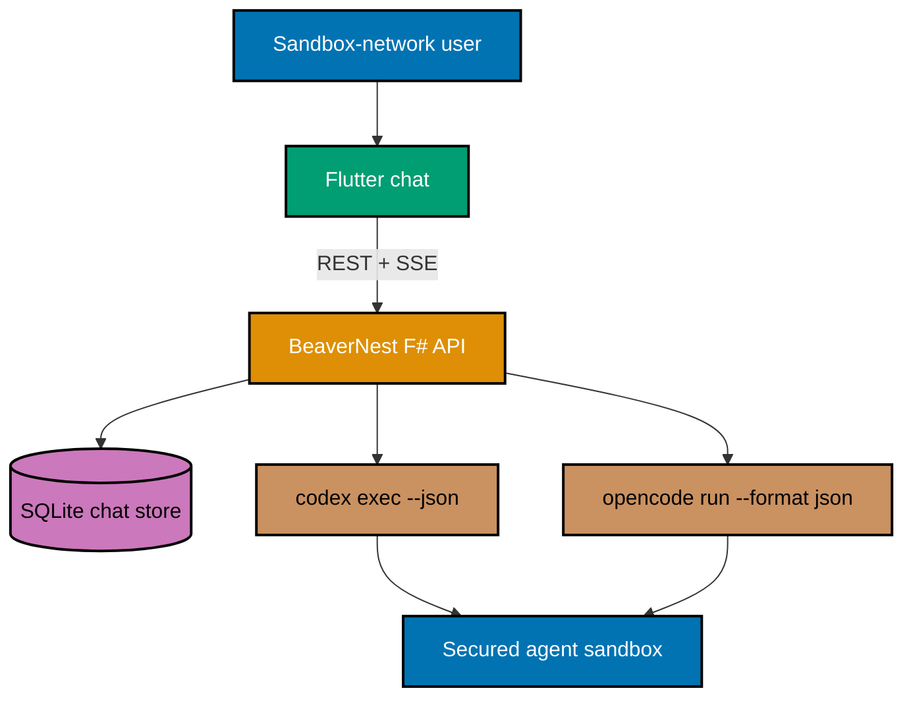

# BeaverNest CLI Chat

**Status**: In Progress — plan ready for execution; delivery has not started.

## Context

BeaverNest currently provides a same-origin Flutter Web foundation dashboard and an F# backend
with SQLite storage. Developers must leave that workspace and use a terminal to converse with an
authenticated Codex or OpenCode CLI. This plan adds a normal, shared, durable browser chat while
preserving the requested CLI boundary: BeaverNest runs the installed command-line tools rather than
putting provider credentials in the browser or replacing them with a direct model API.

## Scope

### In scope

- Text prompts and streamed Markdown/code replies through the existing combined BeaverNest runtime.
- Codex and OpenCode selected for each message, with the installed CLI owning authentication.
- Durable, shared SQLite threads and messages; a thread remains until a sandbox-network user deletes it.
- Full CLI authority with automatic tool approval, explicitly relying on the externally secured
  sandbox chosen by the user.
- A mobile-first Flutter chat with a desktop thread rail and small-screen thread sheet.
- OpenAPI, Gherkin, unit, integration, browser E2E, accessibility, and manual browser proof.

### Out of scope

- Application login, per-user privacy, tenancy, audit export, billing, quotas, rate limiting, or
  provider credential management.
- Attachments, image/file upload, voice, terminal emulation, tool-approval UI, or a separate
  autonomous-agent control console.
- A persistent OpenCode/Codex service, compatibility guarantees across arbitrary CLI updates, or
  direct calls from the browser to any model provider.

## Resolved Decisions

| Concern              | Decision                                                                                                                      |
| -------------------- | ----------------------------------------------------------------------------------------------------------------------------- |
| Execution boundary   | The F# backend manages direct CLI subprocesses; browser code has no CLI credentials or filesystem authority.                  |
| Authority            | Full sandbox authority and automatic approvals; the external sandbox is the security boundary.                                |
| Access and privacy   | Trusted sandbox-network users share one workspace and all persisted threads.                                                  |
| Conversation history | SQLite retains full threads until deletion.                                                                                   |
| Provider choice      | User selects Codex or OpenCode per message. A provider switch replays a bounded normalized transcript.                        |
| Models               | OpenCode discovers models live; Codex exposes its configured default because its CLI has `--model` but no model-list command. |
| Streaming            | Backend translates CLI JSON events to same-origin SSE, with one active turn per thread and cancellation.                      |
| Failure behavior     | Preserve partial content, report a safe actionable error, and never silently switch providers.                                |
| CLI topology         | One managed direct subprocess per turn, not long-lived provider services.                                                     |
| Compatibility        | Best-effort parsing of installed CLI output; incompatibility is an explicitly accepted risk.                                  |
| Worktree             | All execution uses the existing `worktrees/beaver-chat/` checkout on branch `worktree/beaver-chat`.                           |

## Approach Summary

The backend first makes the thread/message contract durable and testable, then adds provider-neutral
application ports and CLI adapters. Each adapter launches arguments without a shell, forwards only
the configured sandbox workspace and a controlled environment, parses JSON events, records a
provider session reference, and emits a normalized SSE stream. The Flutter application consumes
that stream into a responsive transcript and composer. A provider's native session is resumed only
when its saved transcript revision is current; otherwise the backend starts a new provider session
with bounded replayed history, preventing a mixed-provider thread from silently losing context.

## Plan Documents

- [Business requirements](./brd.md)
- [Product requirements and UI design funnel](./prd.md)
- [Technical design](./tech-docs.md)
- [Delivery checklist](./delivery.md)
- [Learnings log](./learnings.md)
- [Visual-asset inventory](./assets/README.md)

## Definition of Done

The combined runtime lets a trusted sandbox-network user create, continue, and delete shared text
threads; select Codex or OpenCode per turn; select a discovered OpenCode model or the Codex default;
see streamed Markdown/code, activity, cancellation, and safe failures; and continue a coherent
mixed-provider conversation. The implementation and all changed specs pass their quality gates and
the full browser flow is manually verified in `worktrees/beaver-chat/`.
