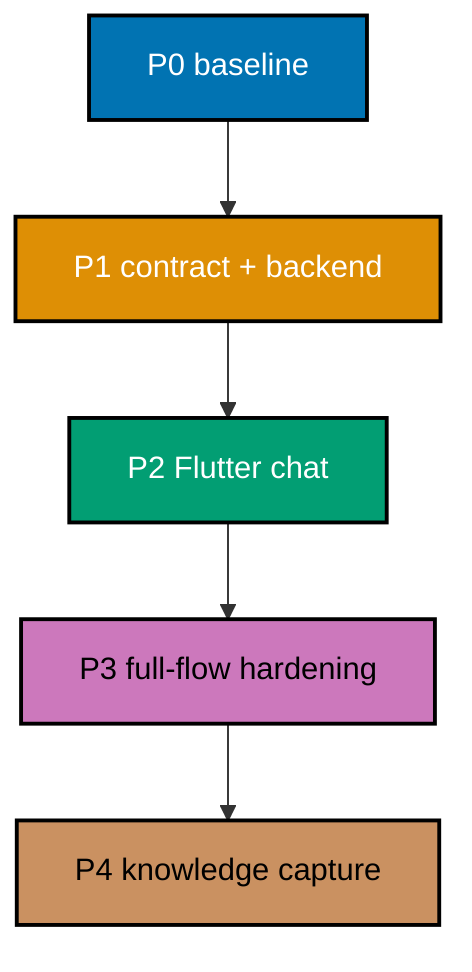

# Delivery Checklist — BeaverNest CLI Chat

## Executor Legend

- `[AI]` performs repository, test, browser, evidence, PR, and merge work authorized by this plan.
- `[HUMAN]` performs only the external-sandbox installation/authentication and confirms that full
  authority is acceptable there; no secret value is copied to a tracked file or report.

## Worktree

Worktree path: `worktrees/beaver-chat/`

This plan must execute in the existing `worktrees/beaver-chat/` checkout on branch
`worktree/beaver-chat`. It is the sole worktree for this repository and is reused for every delivery
unit. Do not provision any second worktree for this plan.

If `worktrees/beaver-chat/` is missing, pause execution and ask the user to restore that required
checkout. Do not create a replacement worktree or change this plan's worktree identity. From the
existing checkout, run `npm install` and `npm run doctor -- --fix`; the execution gate then
synchronizes it with `origin/main` and preserves it until the user authorizes removal.

## Delivery Mode: worktree-to-pr

This repository is branch-protected. Each delivery boundary uses a fresh branch in this one
worktree, opens a PR against `main`, completes the PR Review Maker→Fixer cycle, passes CI, and is
merged by `[AI]` only after the hardened merge preconditions hold.

## Quality, Commit, and CI Protocol

- [ ] [AI] Before each delivery-boundary push from `worktrees/beaver-chat/`, run `apps/rhino-cli/scripts/rhino-bin.sh gate run --surface=pre-push` and `npm exec nx affected -t build,test:quick,lint`; write the exact commands/results to `plans/in-progress/beaver-chat/evidence/quality-<branch>.md` — acceptance: every affected gate passes, every pre-existing failure encountered is root-caused and fixed, and the evidence contains no secret, prompt, transcript, or real sandbox path.
- [ ] [AI] Before each commit, reconcile the append-only file-touch ledger in `plans/in-progress/beaver-chat/evidence/file-touch-ledger.md` against `git status --short`, stage only ledger-owned paths, and run `git diff --cached --check` — acceptance: each Conventional Commit is one concern, has no whitespace failure, and contains no concurrent actor's file.
- [ ] [AI] After each PR push, record its URL/run IDs in `plans/in-progress/beaver-chat/evidence/ci-<branch>.md` and poll `gh run view <run-id> --json status,conclusion` every two minutes — acceptance: every applicable run reaches `success`; a failed run is fixed at root cause and rerun, never bypassed.

## Parallelization Model

Dependency DAG: `P0 -> P1 -> P2 -> P3 -> P4`. The selected direct-subprocess adapter and durable
SSE contract are one dependency chain: frontend work cannot safely invent their data shape. Within
P2, pure Flutter domain/widget tests may proceed after P1's generated contract lands, but the final
browser flow waits for the backend endpoint.



### Delivery Boundaries

| Delivery unit                   | Phases | Branch in `worktrees/beaver-chat/` | Boundary reason                                                                               |
| ------------------------------- | ------ | ---------------------------------- | --------------------------------------------------------------------------------------------- |
| Chat contract and backend       | P1     | `beaver-chat-p1`                   | The durable API/process slice is independently reviewable and testable before UI integration. |
| Flutter workspace and full flow | P2–P3  | `beaver-chat-p2`                   | UI, browser behavior, and final runtime verification are one user-facing delivery.            |
| Closure                         | P4     | `beaver-chat-p3`                   | Evidence, learnings, archive/cleanup are separate from executable feature behavior.           |

### Delivery-Boundary Integration Protocol

At each boundary, create the listed branch from current `origin/main`, read the incoming diff after
any integration, run the quality protocol, push the branch, open a draft PR, classify behavior, run
the PR Review Maker→Fixer cycle for eligible executable work (up to seven cycles), manually verify
the user flow, wait for CI success, and merge only when all hardened preconditions pass. Phase 0
opens no branch or PR.

## Phase 0: Environment Setup and Baseline

_No PR, push, review, merge, or CI monitoring occurs in this phase._

- [ ] [AI] In `worktrees/beaver-chat/`, create `plans/in-progress/beaver-chat/evidence/file-touch-ledger.md`; run `git status --short`, `git worktree list --porcelain`, `npm run doctor -- --fix`, `npm exec nx run beavernest-contracts:test:quick`, `APP_ENV=test npm exec nx run beavernest-be:test:quick`, and `npm exec nx run beavernest-app:test:quick` — acceptance: the ledger records only owned plan/evidence paths, `worktrees/beaver-chat/` is the sole declared plan worktree, and every baseline result is captured before feature code changes.
- [ ] [HUMAN] In the external secured sandbox only, confirm Codex and OpenCode are installed/authenticated and that automatic full-authority execution is intended; record only command availability/version and the confirmation outcome in `plans/in-progress/beaver-chat/evidence/phase-0-cli-baseline.md` — acceptance: no credential, configuration content, prompt, transcript, or real sandbox path is written, and unavailable tooling stops delivery before a backend route is added.
- [ ] [AI] In `plans/in-progress/beaver-chat/evidence/phase-0-cli-baseline.md`, run harmless fixture prompts through `codex exec --json` and `opencode run --format json` from a disposable sandbox directory, capture sanitized event-shape samples, and run each command's `--help` — acceptance: the evidence distinguishes stdout JSON events, stderr diagnostics, exit code, session identifier location, cancellation behavior, and exact command syntax without preserving response content.

### Phase 0 Gate

- [ ] [AI] Run `git status --short` and review `plans/in-progress/beaver-chat/evidence/{file-touch-ledger.md,phase-0-cli-baseline.md}` — acceptance: tool availability and current JSON shapes are evidenced, no secret-like string or actual workspace path is present, and no feature branch/PR has been opened.

**Pause Safety:** Safe to stop after baseline. Resume with `cd worktrees/beaver-chat && npm exec nx run beavernest-be:test:quick`.

## Phase 1 Branch Handoff

- [ ] [AI] From `worktrees/beaver-chat/`, run `git fetch origin --prune && git switch -c beaver-chat-p1 origin/main` — acceptance: the only plan worktree is on a fresh `beaver-chat-p1` branch based on latest `origin/main`.

## Phase 1: Contract, Persistence, and Direct CLI Backend

- [ ] [AI] RED: add failing chat-operation/schema assertions to `specs/apps/beavernest/containers/contracts/tests/chat-contract.sh` and `specs/apps/beavernest/behavior/beavernest-be/gherkin/chat/threads.feature`; run `npm exec nx run beavernest-contracts:test:unit` and `npm exec nx run beavernest-be:test:specs` — acceptance: tests fail because the closed thread/message/model/SSE contract and implementation bindings do not exist. **Gherkin (binds) →** "Create a durable thread"

  ```gherkin
  Scenario: Create a durable thread
    Given the combined BeaverNest runtime has an empty chat store
    When I create a thread and send a text prompt
    Then the thread and prompt appear in the shared thread list
    And they remain available after the browser refreshes
  ```

- [ ] [AI] GREEN: update `specs/apps/beavernest/containers/contracts/openapi.yaml` with thread CRUD, model catalog, turn SSE, cancellation, no-store headers, and safe closed error states; run `npm exec nx run beavernest-contracts:bundle && npm exec nx run beavernest-contracts:test:quick` — acceptance: the source and bundled contract are valid and contract tests pass without a provider credential.
- [ ] [AI] REFACTOR: remove duplicate schema descriptions in `openapi.yaml` and keep provider-specific fields isolated to the model/session schemas; run `npm exec nx run beavernest-contracts:lint` — acceptance: generated clients can distinguish Codex default from OpenCode discovered models without an open-ended payload.
- [ ] [AI] RED: add failing pure domain/store tests in `apps/beavernest-be/tests/unit/Tests/ChatDomainTests.fs` and `ChatStoreTests.fs` for ordered thread persistence, deletion cascade, bounded transcript replay, current-revision resume, and one active turn; run `npm exec nx run beavernest-be:test:unit` — acceptance: tests fail before domain/store implementation. **Gherkin (underpins) →** "Delete a shared thread"; "Switch providers in a thread"
- [ ] [AI] GREEN: add `Domain/Chat.fs`, `Application/ChatPort.fs`, `Application/ChatService.fs`, `Infrastructure/Sqlite/ChatStore.fs`, and `Migrations/002-chat.sql`; update `BeaverNestBe.fsproj` compile order and `Program.fs` composition; run `APP_ENV=test npm exec nx run beavernest-be:test:unit` — acceptance: durable ordered storage, cascade deletion, bounded replay, and per-thread run exclusion pass at the existing 90% coverage threshold.
- [ ] [AI] REFACTOR: extract pure replay/revision/lifecycle functions from SQLite/process effects in the new chat modules; run `npm exec nx run beavernest-be:lint` — acceptance: domain logic is immutable/testable and F# strict lint passes.
- [ ] [AI] RED: add failing fake-process tests in `apps/beavernest-be/tests/unit/Tests/ChatCliAdapterTests.fs` for Codex argument-list invocation, stdin prompt transport, ordered JSON event normalization, and default-only catalog; run `npm exec nx run beavernest-be:test:unit` — acceptance: tests prove no Codex adapter implements the closed application port. **Gherkin (binds) →** "Stream a Codex reply"

  ```gherkin
  Scenario: Stream a Codex reply
    Given a thread is open and Codex is available
    When I submit a text prompt with Codex selected
    Then the browser receives ordered streamed progress and Markdown reply events
    And the completed assistant message records Codex and its configured default model
  ```

- [ ] [AI] GREEN: add the Codex adapter under `apps/beavernest-be/src/BeaverNestBe/Infrastructure/Cli/` using a direct `codex exec --json` child process, no shell, controlled environment, automatic approvals, and current-session resume/replay; run `APP_ENV=test npm exec nx run beavernest-be:test:unit` — acceptance: fixture streams persist safe ordered events and no test log contains a prompt or credential.
- [ ] [AI] REFACTOR: centralize Codex process disposal, JSONL parsing, and safe error mapping behind provider-neutral functions; run `npm exec nx run beavernest-be:test:coverage` — acceptance: the Codex adapter shares lifecycle safety without imposing OpenCode command semantics.
- [ ] [AI] RED: add failing fake-process tests in `apps/beavernest-be/tests/unit/Tests/OpenCodeCliAdapterTests.fs` for live model discovery, selected-model argument transport, JSON event normalization, and safe failure classification; run `npm exec nx run beavernest-be:test:unit` — acceptance: tests prove no OpenCode adapter implements the closed application port. **Gherkin (binds) →** "Stream an OpenCode reply with a discovered model"

  ```gherkin
  Scenario: Stream an OpenCode reply with a discovered model
    Given OpenCode reports an available model through its installed CLI
    When I select that model and submit a text prompt with OpenCode selected
    Then the backend invokes OpenCode with that model and streams the normalized reply
  ```

- [ ] [AI] GREEN: extend `apps/beavernest-be/src/BeaverNestBe/Infrastructure/Cli/` with the tested OpenCode discovery/model path; run `APP_ENV=test npm exec nx run beavernest-be:test:unit` — acceptance: fixture streams persist safe ordered events, unknown events fail visibly, and no test log contains a prompt or credential.
- [ ] [AI] REFACTOR: keep provider-specific model/discovery semantics in the OpenCode adapter while reusing only lifecycle/error helpers; run `npm exec nx run beavernest-be:test:coverage` — acceptance: the provider-neutral port remains closed and testable.
- [ ] [AI] RED: add failing handler/host tests in `apps/beavernest-be/tests/unit/Tests/ChatHandlerTests.fs` and `apps/beavernest-be/tests/integration/ChatHostTests.fs`; run `npm exec nx run beavernest-be:test:integration` — acceptance: REST/SSE/cancellation routes are absent or fail their closed response expectations. **Gherkin (binds) →** "Cancel an active turn"

  ```gherkin
  Scenario: Cancel an active turn
    Given a thread has one active streamed turn
    When I activate Cancel
    Then the backend terminates only that managed child process
    And the thread accepts another prompt after the cancellation completes
  ```

- [ ] [AI] GREEN: add `Api/ChatHandlers.fs`, route it in `WebApp.fs`, and wire dependencies in `Program.fs`; run `APP_ENV=test npm exec nx run beavernest-be:test:quick && npm exec nx run beavernest-be:test:integration` — acceptance: API routes precede SPA fallback, all chat responses use no-store, an SSE turn streams ordered events, and cancellation targets only the active managed process.
- [ ] [AI] REFACTOR: align handler error/envelope behavior with existing `errorBody`/security headers, then run `npm exec nx run beavernest-be:lint` — acceptance: no route reveals command, environment, filesystem, authentication, or provider diagnostic details.

### Phase 1 Gate

- [ ] [AI] Run `npm exec nx run beavernest-contracts:test:quick`, `npm exec nx run beavernest-contracts:specs:behavior:coverage`, `APP_ENV=test npm exec nx run beavernest-be:test:quick`, `APP_ENV=test npm exec nx run beavernest-be:specs:behavior:coverage`, and `APP_ENV=test npm exec nx run beavernest-be:test:integration`; save results in `plans/in-progress/beaver-chat/evidence/phase-1-backend.md` — acceptance: source contract, database migration, direct process fakes, REST/SSE, cancellation, and Gherkin coverage pass before client integration.

**Pause Safety:** Safe to stop with a tested backend contract. Resume with `cd worktrees/beaver-chat && APP_ENV=test npm exec nx run beavernest-be:test:quick`.

## Phase 2 Branch Handoff

- [ ] [AI] From `worktrees/beaver-chat/`, run `git fetch origin --prune && git switch -c beaver-chat-p2 origin/main` — acceptance: the only plan worktree is on a fresh `beaver-chat-p2` branch that contains the merged Phase 1 contract/backend work and is based on latest `origin/main`.

## Phase 2: Responsive Flutter Chat Workspace

- [ ] [AI] RED: add failing generated-contract assertions to `apps/beavernest-app/test/chat_contract_test.dart`, then run `npm exec nx run beavernest-app:test:unit` — acceptance: the generated bundle cannot yet represent the planned chat operations before code generation. **Gherkin (underpins) →** "Create a durable thread"; "Stream a Codex reply"; "Stream an OpenCode reply with a discovered model"; "Cancel an active turn"
- [ ] [AI] GREEN: run `npm exec nx run beavernest-app:codegen` and implement typed Web boundary validation in new `apps/beavernest-app/lib/platform/web/chat_client.dart`; run `npm exec nx run beavernest-app:test:unit` — acceptance: generated types stay outer-layer details and invalid/non-closed REST/SSE payloads are rejected.
- [ ] [AI] REFACTOR: consolidate generated-to-domain conversions in `apps/beavernest-app/lib/platform/web/chat_repository.dart`; run `npm exec nx run beavernest-app:analyze` — acceptance: domain/application imports remain independent of generated transport types.
- [ ] [AI] RED: add failing pure domain/use-case tests under `apps/beavernest-app/test/chat_*.dart` for pending/delta/completed/failed/cancelled turn state, provider labels, model selection, and thread deletion; run `npm exec nx run beavernest-app:test:unit` — acceptance: tests fail until the pure chat models and use cases exist. **Gherkin (underpins) →** "Delete a shared thread"; "Switch providers in a thread"; "Preserve a failed provider turn"
- [ ] [AI] GREEN: add `lib/domain/chat.dart`, `lib/application/ports/chat_repository.dart`, and `lib/application/use_cases/chat/`; update `lib/main.dart` composition; run `npm exec nx run beavernest-app:test:unit` — acceptance: in-memory fakes prove a provider switch retains replayed context and one active turn disables a duplicate submit.
- [ ] [AI] REFACTOR: keep asynchronous Web/SSE effects in the repository adapter and pure state transitions in domain/use cases; run `npm exec nx run beavernest-app:test:coverage` — acceptance: coverage remains at or above the configured threshold.
- [ ] [AI] RED: add failing widget/accessibility tests in `apps/beavernest-app/test/chat_workspace_test.dart` for the desktop rail, mobile sheet, focus restoration, live activity, authority notice, Markdown/code copy control, provider/model selectors, cancellation, safe failures, and 44 px actions; run `npm exec nx run beavernest-app:test:unit` — acceptance: the selected Option A layout is not yet rendered. **Gherkin (binds) →** "Reflow chat from phone to desktop"

  ```gherkin
  Scenario: Reflow chat from phone to desktop
    Given a shared thread has a streamed transcript
    When I view it at mobile, tablet, and desktop widths
    Then every message, provider control, composer, and cancellation control remains usable without horizontal scrolling
    And thread navigation is a small-screen sheet and a desktop rail
  ```

- [ ] [AI] GREEN: add `lib/presentation/chat/` widgets and integrate the Chat destination into `lib/presentation/workspace_shell.dart`; run `npm exec nx run beavernest-app:test:unit` — acceptance: the UI matches selected thread-rail behavior, preserves visible provider attribution, uses the existing theme in light/dark modes, and never hides shared/full-authority semantics.
- [ ] [AI] REFACTOR: share existing responsive/navigation/theme primitives where possible and remove duplicated spacing/focus code; run `npm exec nx run beavernest-app:lint` — acceptance: widgets are small, keyboard focus is visible, and no interaction relies on color alone.

### Phase 2 Gate

- [ ] [AI] Run `npm exec nx run beavernest-app:test:quick`, `npm exec nx run beavernest-app:specs:behavior:coverage`, and `npm exec nx run beavernest-app:build`; record output in `plans/in-progress/beaver-chat/evidence/phase-2-flutter.md` — acceptance: code generation, Dart analysis, unit/coverage/spec gates, and CSP/Wasm Web build pass with the responsive chat destination integrated.

**Pause Safety:** Safe to stop after the client is fully tested against fake streams. Resume with `cd worktrees/beaver-chat && npm exec nx run beavernest-app:test:quick`.

## Phase 3: End-to-End Hardening and User-Facing Verification

- [ ] [AI] RED: add failing aggregate BDD binders in `apps/beavernest-app-e2e/steps/chat.steps.ts`, `apps/beavernest-be-e2e/steps/chat.steps.ts`, and their matching `specs/apps/beavernest/behavior/**/gherkin/chat/*.feature`; run `npm exec nx run beavernest-app-e2e:test:e2e` and `APP_ENV=test npm exec nx run beavernest-be-e2e:test:e2e` — acceptance: the binders fail before hosted runtime wiring proves every planned chat scenario. **Gherkin (underpins) →** "Create a durable thread"; "Delete a shared thread"; "Stream a Codex reply"; "Stream an OpenCode reply with a discovered model"; "Switch providers in a thread"; "Preserve a failed provider turn"; "Cancel an active turn"; "Reflow chat from phone to desktop"
- [ ] [AI] GREEN: update only the required E2E host/runtime utilities and steps to use deterministic fake CLI executables under existing test fixtures; run `npm exec nx run beavernest-app-e2e:test:e2e` and `APP_ENV=test npm exec nx run beavernest-be-e2e:test:e2e` — acceptance: browser proof covers create/reload/delete, Codex default, OpenCode discovered model, provider-switch replay, ordered deltas, cancellation, unavailable failure, mobile sheet, desktop rail, and no horizontal scroll without calling real agents.
- [ ] [AI] REFACTOR: remove fixture duplication and keep fake CLI events versioned/test-local; rerun `npm exec nx run beavernest-app-e2e:test:e2e` — acceptance: tests cannot read a real CLI config, token, prompt history, or sandbox filesystem.
- [ ] [AI] Start the combined runtime in the externally secured sandbox with only operator-provided local configuration, then manually exercise Codex and OpenCode in a disposable shared thread using browser tooling; save redacted screenshots for mobile/tablet/desktop and a behavior log in `plans/in-progress/beaver-chat/evidence/phase-3-manual-verification.md` — acceptance: a real user can stream, cancel, retry, switch provider, reload history, and delete a thread; evidence contains no prompt content, transcript, secret, real path, or provider session ID.
- [ ] [AI] With the combined runtime healthy, use `curl --fail --include http://127.0.0.1:19320/api/v1/health` and save the response to `plans/in-progress/beaver-chat/evidence/phase-3-health.txt` — acceptance: the response is `200`, has no `Server` header, and proves the same host used for chat verification is live.
- [ ] [AI] Use `curl --fail --include http://127.0.0.1:19320/api/v1/chat/threads` and save only headers plus a redacted empty/list shape to `plans/in-progress/beaver-chat/evidence/phase-3-chat-list.txt` — acceptance: the response is `200`, contains `Cache-Control: no-store`, and has the contract's closed thread-summary shape without recording a user message.
- [ ] [AI] Create an empty disposable thread with `beavernest_chat_thread_id=$(curl --fail --silent --show-error --request POST --header 'Content-Type: application/json' --data '{}' http://127.0.0.1:19320/api/v1/chat/threads | jq -r '.id')`, then run `curl --no-buffer --include --request POST --header 'Content-Type: application/json' --data '{"provider":"codex","text":"Return only the word ready."}' "http://127.0.0.1:19320/api/v1/chat/threads/$beavernest_chat_thread_id/turns"` and save a redacted event-type/sequence transcript to `plans/in-progress/beaver-chat/evidence/phase-3-codex-sse.txt` — acceptance: the created identifier is nonempty, ordered `started`, `activity` or `delta`, and terminal `completed`/`failed` events are observed, all SSE headers are no-store, and neither ID nor text is persisted in evidence.
- [ ] [AI] Run `curl --include http://127.0.0.1:19320/api/v1/chat/threads/not-a-thread` and save only headers plus the stable error classification to `plans/in-progress/beaver-chat/evidence/phase-3-chat-404.txt` — acceptance: the response is `404`, contains `Cache-Control: no-store`, and does not disclose a command, environment value, filesystem path, provider diagnostic, or credential.
- [ ] [AI] Use Playwright MCP `browser_navigate`, `browser_snapshot`, `browser_click`, `browser_fill_form`, `browser_console_messages`, and `browser_take_screenshot` against the same-origin Chat destination in the combined runtime; save screenshots as `plans/in-progress/beaver-chat/evidence/phase-3-chat-en-375px.png`, `phase-3-chat-en-768px.png`, and `phase-3-chat-en-1280px.png` — acceptance: the mobile thread sheet, tablet transcript/composer, desktop rail, keyboard focus order, authority notice, provider/model controls, stream activity, cancellation, and safe error state are visible without horizontal overflow or browser-console errors.
- [ ] [AI] Run `web-exploratory-tester`, `web-usability-tester`, and `web-design-tester` in delivery mode after the first full browser pass; write their reports to `plans/in-progress/beaver-chat/evidence/phase-3-{exploratory,usability,design}.md` — acceptance: every reproducible EWT/UWT/DWT defect is fixed and the affected browser/API/E2E tests plus all three retests pass before the feature PR is ready.
- [ ] [AI] Enable `BEAVERNEST_BE_CHAT_ENABLED` only for the manual verification environment, test disabled-route/UI behavior, then retain the configured rollout state required by the deployment; run `APP_ENV=test npm exec nx run beavernest-be:test:quick` — acceptance: disabling chat removes entry points without deleting stored history and enabling it never exposes a credential.

### Phase 3 Gate

- [ ] [AI] Run `npm exec nx affected -t build,test:quick,lint`, `APP_ENV=test npm exec nx run beavernest-be:specs:behavior:coverage`, `npm exec nx run beavernest-app:specs:behavior:coverage`, `APP_ENV=test npm exec nx run beavernest-be-e2e:test:e2e`, `npm exec nx run beavernest-app-e2e:test:e2e`, and `apps/rhino-cli/scripts/rhino-bin.sh gate run --surface=pre-push`; record results in `plans/in-progress/beaver-chat/evidence/phase-3-full-flow.md` — acceptance: full API/browser/manual verification passes, UI accessibility and responsive proof are attached, and all user-facing rule follow-ups are resolved before the feature PR is ready.

**Pause Safety:** Safe to stop after a complete verified user flow. Resume with `cd worktrees/beaver-chat && npm exec nx run beavernest-app-e2e:test:e2e`.

## Phase 4 Branch Handoff

- [ ] [AI] From `worktrees/beaver-chat/`, run `git fetch origin --prune && git switch -c beaver-chat-p3 origin/main` — acceptance: the only plan worktree is on a fresh `beaver-chat-p3` branch based on latest `origin/main` after the Phase 2–3 PR is merged.

## Phase 4: Knowledge Capture and Plan Closure

- [ ] [AI] Triage every row in `plans/in-progress/beaver-chat/learnings.md` into durable documentation, a separately named follow-up plan, or discard with rationale; run `git diff --check` — acceptance: no pending learning remains and no secret/transcript/sandbox detail is retained.
- [ ] [AI] Update `apps/beavernest-app/README.md` and `apps/beavernest-be/README.md` with safe user/operator commands, shared-workspace/full-authority boundary, and disabled-feature behavior; run `npm run lint:md` — acceptance: documentation explains capabilities without provider credentials, real paths, or unsupported privacy/security claims.
- [ ] [AI] After all delivery PRs merge and `origin/main` contains their commits, move this plan to `plans/done/YYYY-MM-DD__beaver-chat/`, update plan index entries if required, and ask the user whether to remove `worktrees/beaver-chat/` — acceptance: archival is reached only after verified merge; the existing worktree is never removed without explicit user approval.

### Phase 4 Gate

- [ ] [AI] Run `git status --short`, verify the final file-touch ledger against the archival diff, and record the user’s worktree-retention decision in `plans/done/YYYY-MM-DD__beaver-chat/learnings.md` — acceptance: no unowned file is staged, the plan has a terminal record, and `worktrees/beaver-chat/` is retained or removed only by explicit user choice.

**Pause Safety:** Safe to stop after archival evidence. Resume only for an explicitly authorized follow-up.
