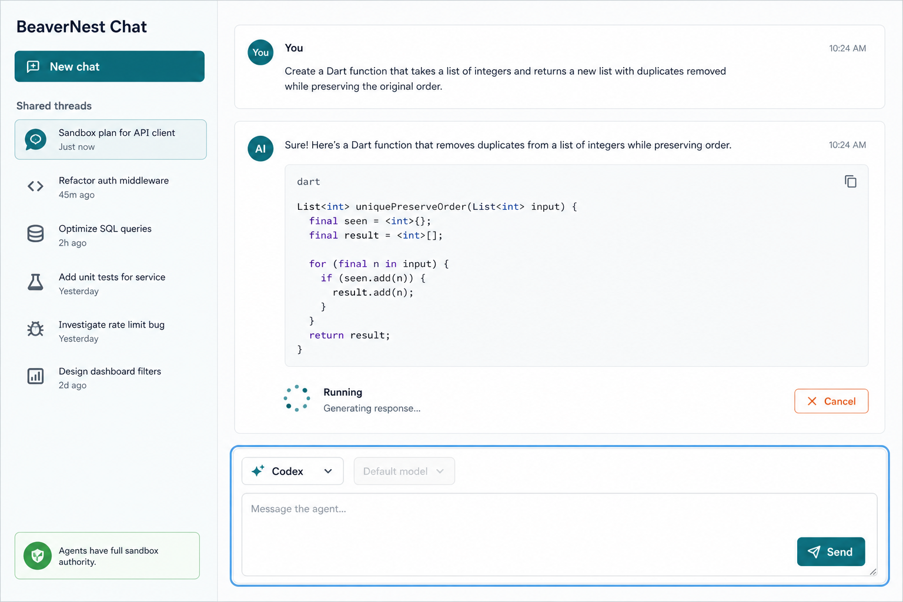
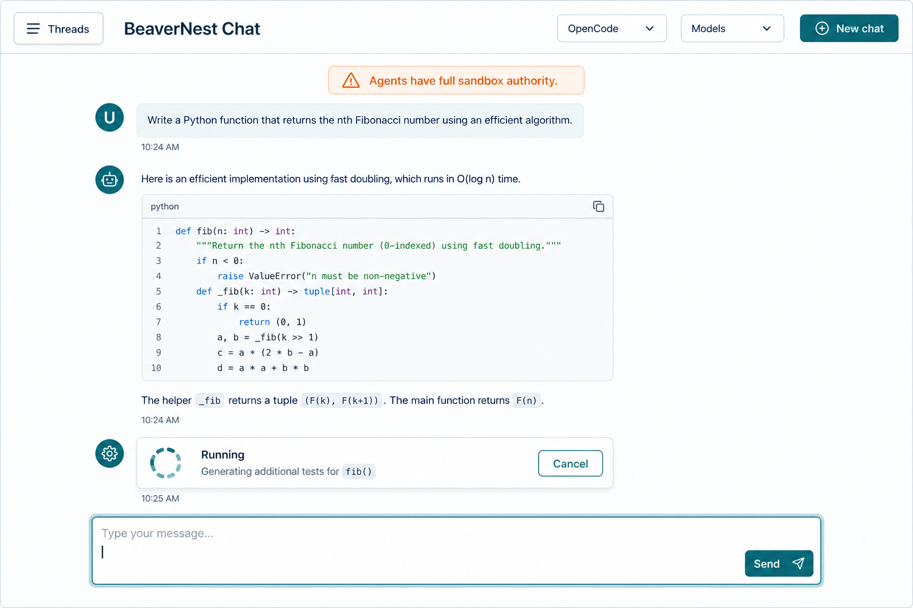

# Product Requirements Document — BeaverNest CLI Chat

## Product Overview

BeaverNest Chat is a text-only shared workspace inside the existing same-origin Flutter Web client.
It offers durable threads, streamed Markdown/code replies, and a clear per-message provider control.
Codex uses its configured default model; OpenCode's model list is discovered from the installed CLI.
The chat is deliberately not an approval console: its persistent authority notice makes the
external-sandbox assumption visible while selected agents execute automatically.

## Personas

| Persona              | Need                                                  | Product response                                                              |
| -------------------- | ----------------------------------------------------- | ----------------------------------------------------------------------------- |
| Trusted sandbox user | Converse with installed agents without a terminal UI. | Thread history, provider picker, readable streaming transcript, and composer. |
| Returning user       | Find and continue work after refresh/restart.         | Shared durable thread rail and SQLite history.                                |
| Operator             | Understand why a provider cannot answer.              | Safe unavailable/error state and retry without provider substitution.         |

## User Stories and Acceptance Criteria

### US1 — Start and retain a shared chat

**As a** trusted sandbox-network user, **I want** to create and return to shared threads, **so that**
my work survives browser refreshes and backend restarts.

```gherkin
Feature: Shared durable chat threads

  Scenario: Create a durable thread
    Given the combined BeaverNest runtime has an empty chat store
    When I create a thread and send a text prompt
    Then the thread and prompt appear in the shared thread list
    And they remain available after the browser refreshes

  Scenario: Delete a shared thread
    Given a shared thread has messages and provider session references
    When I delete that thread
    Then its transcript and provider session references are absent from the chat store
```

### US2 — Select and stream an agent reply

**As a** trusted sandbox-network user, **I want** to select Codex or OpenCode for a message,
**so that** I can use the CLI account and agent I intend.

```gherkin
Feature: Provider-selected streamed reply

  Scenario: Stream a Codex reply
    Given a thread is open and Codex is available
    When I submit a text prompt with Codex selected
    Then the browser receives ordered streamed progress and Markdown reply events
    And the completed assistant message records Codex and its configured default model

  Scenario: Stream an OpenCode reply with a discovered model
    Given OpenCode reports an available model through its installed CLI
    When I select that model and submit a text prompt with OpenCode selected
    Then the backend invokes OpenCode with that model and streams the normalized reply
```

### US3 — Keep context when providers change

**As a** user, **I want** a provider change to keep the relevant conversation context,
**so that** choosing another agent does not feel like beginning again.

```gherkin
Feature: Mixed-provider continuity

  Scenario: Switch providers in a thread
    Given a thread contains completed turns from one provider
    When I submit the next prompt with the other provider selected
    Then the selected provider receives bounded normalized transcript context
    And the transcript identifies the provider used for each assistant turn
```

### US4 — Recover safely from an unavailable or long-running CLI

**As an** operator, **I want** clear failures and cancellation,
**so that** a failed or long-running CLI turn does not make the chat unusable.

```gherkin
Feature: CLI turn recovery

  Scenario: Preserve a failed provider turn
    Given the selected provider exits unsuccessfully after emitting partial output
    When the turn ends
    Then the partial message remains visible with a safe actionable error
    And BeaverNest does not substitute the other provider

  Scenario: Cancel an active turn
    Given a thread has one active streamed turn
    When I activate Cancel
    Then the backend terminates only that managed child process
    And the thread accepts another prompt after the cancellation completes
```

### US5 — Use the chat at every supported browser width

**As a** browser user, **I want** chat controls to reflow accessibly,
**so that** I can read, switch threads, and compose without horizontal scrolling.

```gherkin
Feature: Responsive accessible chat workspace

  Scenario: Reflow chat from phone to desktop
    Given a shared thread has a streamed transcript
    When I view it at mobile, tablet, and desktop widths
    Then every message, provider control, composer, and cancellation control remains usable without horizontal scrolling
    And thread navigation is a small-screen sheet and a desktop rail
```

## UI Design Funnel

### R5 grounding and R7 prior art

[Repo-grounded] The existing Flutter `WorkspaceShell` already changes from a one-column workspace
to a desktop navigation rail at 1024 px and the `workspace_theme.dart` semantic palette provides
44 px action controls, light/dark themes, and text-plus-icon status affordances. The chat reuses
those foundations and introduces net-new Dart widgets: `ChatWorkspace`, `ThreadRail`,
`ThreadSheet`, `ChatTranscript`, `ChatComposer`, and `TurnActivityCard`.

[Web-cited] OpenCode documents a browser interface with a session homepage and explicitly warns
that an unsecured server is suitable only for local access; its CLI documents JSON event output,
session continuation, model selection, and an auto-approval flag. The research supports visible
session navigation, provider attribution, streamed status, and an explicit authority boundary.
Sources: [OpenCode Web](https://dev.opencode.ai/docs/web/),
[OpenCode CLI](https://dev.opencode.ai/docs/cli/), and
[ChatGPT release notes](https://help.openai.com/en/articles/6825453-chatgpt-release-notes)
(accessed 2026-08-14). Local `codex exec --help` confirms `--json`, `resume`, `--model`, and
full-authority flags, but no installed model-list command.

### Diverge — low-fidelity alternatives

#### Option A — Thread rail workspace

```text
Phone (< 768 px)                         Desktop (>= 1024 px)
┌─────────────────────────────┐          ┌───────────────┬────────────────────────────┐
│ BeaverNest Chat  [Threads]  │          │ New chat      │ BeaverNest Chat             │
│ authority notice            │          │ shared thread │ authority notice            │
│ user / agent transcript     │          │ • active      │ user / agent transcript     │
│ [Codex v] [model v]         │          │ • previous    │ running · Cancel            │
│ [message................]   │          │ authority     │ [provider] [model]          │
│                       Send  │          │ notice        │ [message.............] Send │
└─────────────────────────────┘          └───────────────┴────────────────────────────┘
```

Mobile hides the rail behind an accessible sheet. Tablet keeps a single transcript column and a
top-level Threads control. Desktop exposes the persistent rail without changing the composer flow.

#### Option B — Single conversation toolbar

```text
Phone (< 768 px)                         Desktop (>= 1024 px)
┌─────────────────────────────┐          ┌────────────────────────────────────────────┐
│ [Threads] BeaverNest Chat   │          │ Threads | BeaverNest Chat | provider model  │
│ [provider] [model]          │          │ authority notice                            │
│ authority notice            │          │ full-width transcript                       │
│ full-width transcript       │          │ running · Cancel                            │
│ [message................]   │          │ [message..............................] Send│
│                       Send  │          └────────────────────────────────────────────┘
└─────────────────────────────┘
```

This concentrates on the active conversation but moves durable-history discovery into a picker.

### Narrow — high-fidelity finalists





### Select and justify

**Selected: Option A — Thread rail workspace.**

| Candidate | Decision | Rationale                                                                                                               |
| --------- | -------- | ----------------------------------------------------------------------------------------------------------------------- |
| Option A  | Selected | Durable shared history, provider state, and authority notice stay discoverable on desktop while mobile remains focused. |
| Option B  | Dropped  | It prioritizes the immediate prompt but hides the primary durable-thread task behind another action.                    |

Responsive strategy: start mobile with one transcript column, a 44 px Threads action that opens a
focus-managed sheet, and a full-width composer. At tablet (`md`, >=768 px), preserve that flow with
more reading width. At desktop (`lg`, >=1024 px), show the persistent rail using the existing
`WorkspaceShell` breakpoint convention. The implementation must provide semantic transcript labels,
visible focus, keyboard submit/cancel behavior, Escape sheet dismissal with focus restoration,
live announcements for turn status, copyable code blocks, text/icons in addition to color, and no
horizontal scroll.

## Product Scope Details

The first release accepts plain text only and renders assistant Markdown/code safely; it does not
accept attachments or raw HTML. The product intentionally says “shared workspace” and “full sandbox
authority” wherever their implications matter. OpenCode models are refreshed on demand from its CLI;
Codex's UI exposes only the configured default, rather than inventing an incomplete live model list.
