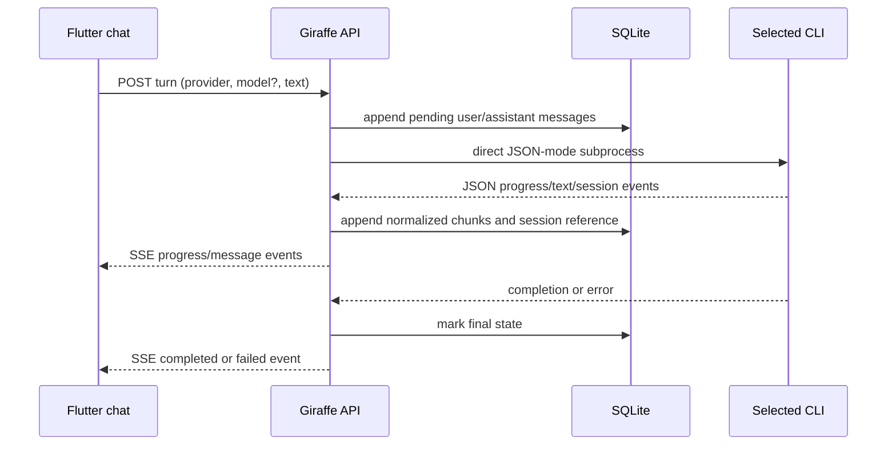
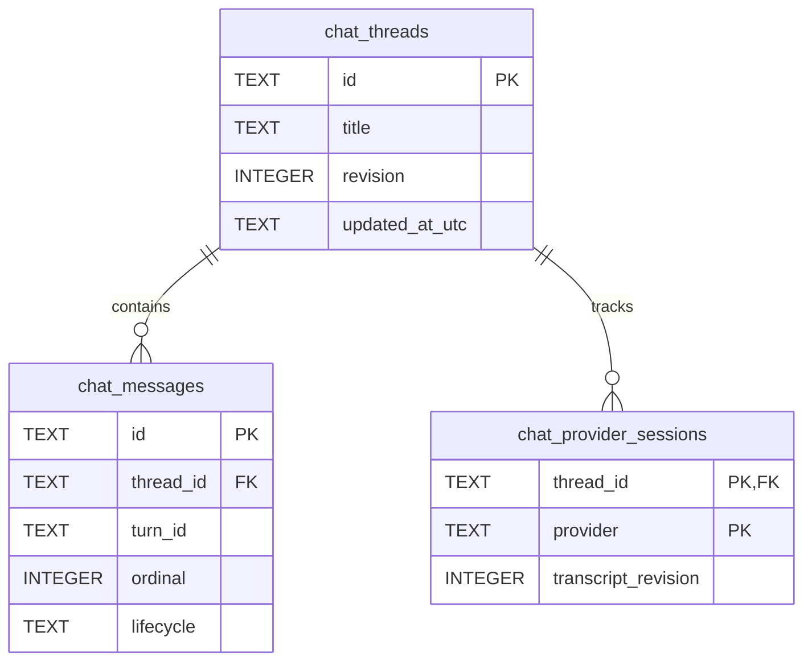

# Technical Design — BeaverNest CLI Chat

## Architecture

The backend owns all process execution and serializes provider-specific events into a stable chat
protocol. It never interpolates prompts into a shell command: each adapter uses `ProcessStartInfo`
argument lists and stdin where supported. The configured sandbox working directory and a minimal
environment are operator-owned configuration; no credential value is read into an HTTP response,
database row, evidence file, or application log.



## API and Stream Contract

The contract update under `specs/apps/beavernest/containers/contracts/openapi.yaml` defines:

| Operation                                             | Purpose                                                                      |
| ----------------------------------------------------- | ---------------------------------------------------------------------------- |
| `GET /api/v1/chat/threads`                            | List shared thread summaries.                                                |
| `POST /api/v1/chat/threads`                           | Create a shared thread.                                                      |
| `GET /api/v1/chat/threads/{threadId}`                 | Get one thread and ordered messages.                                         |
| `DELETE /api/v1/chat/threads/{threadId}`              | Delete its messages and provider-session references.                         |
| `GET /api/v1/chat/providers/{provider}/models`        | Return OpenCode's live model list or Codex's single configured-default item. |
| `POST /api/v1/chat/threads/{threadId}/turns`          | Start exactly one turn and return `text/event-stream`.                       |
| `DELETE /api/v1/chat/threads/{threadId}/turns/active` | Cancel the active managed subprocess.                                        |

SSE emits closed event types: `started`, `activity`, `delta`, `completed`, `cancelled`, and `failed`.
Each includes the thread/turn identity, monotonically increasing sequence number, and only safe
display data. `failed` reports a stable user-facing classification (`unavailable`, `unauthenticated`,
`exited`, `cancelled`) rather than command line, environment, filesystem, or provider internals.
Responses and streams use `Cache-Control: no-store`.

## Persistence and Continuity

Migration `002-chat.sql` adds `chat_threads`, `chat_messages`, and `chat_provider_sessions` with
foreign keys and indexes by thread/ordinal. A message stores author, provider, selected model,
Markdown body, lifecycle state, timestamps, and sequence; a provider-session row stores only a
provider-native session ID and the transcript revision it reflects.

For a turn, the application transaction appends the user message and a pending assistant message.
If the selected provider's stored revision equals the current thread revision, its adapter resumes
that native CLI session. Otherwise, it starts a provider session with a normalized, bounded replay
of stored user/assistant messages plus an explicit truncation marker if needed. This preserves
mixed-provider continuity without pretending provider session IDs are interoperable.

### Proposed SQLite Schema

[Judgment call] `002-chat.sql` is the authoritative migration. Identifiers are application-generated
opaque text IDs (not an exposed provider identifier); all timestamps are UTC RFC 3339 text. The host
enables `PRAGMA foreign_keys = ON` for every SQLite connection, because SQLite does not enforce
foreign keys otherwise.



#### `chat_threads`

| Column           | SQLite type | Constraint / index                  | Purpose                                                       |
| ---------------- | ----------- | ----------------------------------- | ------------------------------------------------------------- |
| `id`             | `TEXT`      | Primary key                         | Opaque shared-thread identifier.                              |
| `title`          | `TEXT`      | Required; default empty string      | User-visible thread title.                                    |
| `revision`       | `INTEGER`   | Required; non-negative; default `0` | Transcript version used to decide safe native-session resume. |
| `created_at_utc` | `TEXT`      | Required                            | UTC RFC 3339 creation timestamp.                              |
| `updated_at_utc` | `TEXT`      | Required; descending index          | UTC RFC 3339 timestamp used to order the thread rail.         |

#### `chat_messages`

| Column                | SQLite type | Constraint / index                                                                                                       | Purpose                                                                                        |
| --------------------- | ----------- | ------------------------------------------------------------------------------------------------------------------------ | ---------------------------------------------------------------------------------------------- |
| `id`                  | `TEXT`      | Primary key                                                                                                              | Opaque message identifier.                                                                     |
| `thread_id`           | `TEXT`      | Required foreign key to `chat_threads`; cascade delete; part of unique `(thread_id, ordinal)` and thread/ordinal index   | Owning shared thread.                                                                          |
| `turn_id`             | `TEXT`      | Required                                                                                                                 | Correlates the user message, assistant message, and SSE event sequence for one submitted turn. |
| `ordinal`             | `INTEGER`   | Required, non-negative; unique within its thread                                                                         | Stable transcript order.                                                                       |
| `author`              | `TEXT`      | Required; `user` or `assistant`                                                                                          | Speaker identity.                                                                              |
| `provider`            | `TEXT`      | Nullable; `codex` or `opencode` when present                                                                             | Provider used for an assistant reply; `NULL` for a user message.                               |
| `model_id`            | `TEXT`      | Nullable                                                                                                                 | Selected provider model; `NULL` for a user message or Codex default without a reported ID.     |
| `markdown_body`       | `TEXT`      | Required; default empty string                                                                                           | Persisted text/Markdown, including safe partial assistant output.                              |
| `lifecycle`           | `TEXT`      | Required; `pending`, `streaming`, `completed`, `failed`, or `cancelled`; contributes to active-turn partial unique index | Current message/turn state.                                                                    |
| `failure_kind`        | `TEXT`      | Nullable; closed safe failure classification                                                                             | Safe display reason: `unavailable`, `unauthenticated`, `exited`, or `cancelled`.               |
| `last_event_sequence` | `INTEGER`   | Required, non-negative; default `0`                                                                                      | Last persisted normalized stream sequence.                                                     |
| `created_at_utc`      | `TEXT`      | Required                                                                                                                 | UTC RFC 3339 creation timestamp.                                                               |
| `updated_at_utc`      | `TEXT`      | Required                                                                                                                 | UTC RFC 3339 latest-change timestamp.                                                          |

The partial unique index on `thread_id` permits only one `assistant` row whose lifecycle is
`pending` or `streaming` in a thread. It is durable race protection for the one-active-turn rule.

#### `chat_provider_sessions`

| Column                | SQLite type | Constraint / index                                                                    | Purpose                                                     |
| --------------------- | ----------- | ------------------------------------------------------------------------------------- | ----------------------------------------------------------- |
| `thread_id`           | `TEXT`      | Required foreign key to `chat_threads`; cascade delete; part of composite primary key | Owning shared thread.                                       |
| `provider`            | `TEXT`      | Required; `codex` or `opencode`; part of composite primary key                        | Provider whose latest session is recorded.                  |
| `native_session_id`   | `TEXT`      | Required; never returned, logged, or included in evidence                             | Provider-native session handle used only for safe resume.   |
| `transcript_revision` | `INTEGER`   | Required; non-negative                                                                | Thread revision represented by the provider-native session. |
| `selected_model_id`   | `TEXT`      | Nullable                                                                              | Model used when that provider session was started.          |
| `updated_at_utc`      | `TEXT`      | Required                                                                              | UTC RFC 3339 last-session-update timestamp.                 |

The same migration is available as [002-chat.sql](./002-chat.sql) directly in this plan folder.
Phase 1 copies it to `apps/beavernest-be/src/BeaverNestBe/Migrations/002-chat.sql` only after the
RED migration/integration tests prove any required correction; it never edits `001-initialize.sql`.

```sql
CREATE TABLE chat_threads (
  id TEXT PRIMARY KEY,
  title TEXT NOT NULL DEFAULT '',
  revision INTEGER NOT NULL DEFAULT 0 CHECK (revision >= 0),
  created_at_utc TEXT NOT NULL,
  updated_at_utc TEXT NOT NULL
);

CREATE TABLE chat_messages (
  id TEXT PRIMARY KEY,
  thread_id TEXT NOT NULL REFERENCES chat_threads (id) ON DELETE CASCADE,
  turn_id TEXT NOT NULL,
  ordinal INTEGER NOT NULL CHECK (ordinal >= 0),
  author TEXT NOT NULL CHECK (author IN ('user', 'assistant')),
  provider TEXT CHECK (provider IN ('codex', 'opencode')),
  model_id TEXT,
  markdown_body TEXT NOT NULL DEFAULT '',
  lifecycle TEXT NOT NULL CHECK (
    lifecycle IN (
      'pending',
      'streaming',
      'completed',
      'failed',
      'cancelled'
    )
  ),
  failure_kind TEXT CHECK (
    failure_kind IS NULL
    OR failure_kind IN (
      'unavailable',
      'unauthenticated',
      'exited',
      'cancelled'
    )
  ),
  last_event_sequence INTEGER NOT NULL DEFAULT 0 CHECK (last_event_sequence >= 0),
  created_at_utc TEXT NOT NULL,
  updated_at_utc TEXT NOT NULL,
  UNIQUE (thread_id, ordinal)
);

CREATE TABLE chat_provider_sessions (
  thread_id TEXT NOT NULL REFERENCES chat_threads (id) ON DELETE CASCADE,
  provider TEXT NOT NULL CHECK (provider IN ('codex', 'opencode')),
  native_session_id TEXT NOT NULL,
  transcript_revision INTEGER NOT NULL CHECK (transcript_revision >= 0),
  selected_model_id TEXT,
  updated_at_utc TEXT NOT NULL,
  PRIMARY KEY (thread_id, provider)
);

CREATE INDEX chat_messages_thread_ordinal_idx ON chat_messages (thread_id, ordinal);

CREATE INDEX chat_threads_updated_idx ON chat_threads (updated_at_utc DESC);

CREATE UNIQUE INDEX chat_messages_one_active_turn_idx ON chat_messages (thread_id)
WHERE
  author = 'assistant'
  AND lifecycle IN ('pending', 'streaming');
```

The application increments `chat_threads.revision` in the same transaction that creates a turn or
settles its assistant message. The partial unique index is durable race protection for the product
rule of one active turn per thread; the in-memory cancellation registry remains responsible for the
actual managed process. A user message has `provider`, `model_id`, and `failure_kind` as `NULL`, and
uses `completed` lifecycle immediately. An assistant message records the selected provider/model
and moves from `pending` through `streaming` to a terminal lifecycle. `native_session_id` is never
returned by the API, written to evidence, or logged.

## Provider Adapters

| Provider | Direct invocation shape                                                                           | Model behavior                                                     | Session behavior                                                                     |
| -------- | ------------------------------------------------------------------------------------------------- | ------------------------------------------------------------------ | ------------------------------------------------------------------------------------ |
| Codex    | `codex exec --json` / `codex exec resume <id> --json` with automatic full-authority configuration | Send no model flag; expose configured default.                     | Parse/store the current exec session ID; resume only at current transcript revision. |
| OpenCode | `opencode run --format json --auto` and `--session <id>` as applicable                            | Run live discovery for selectable models and pass the selected ID. | Parse/store session ID; resume only at current transcript revision.                  |

The Phase 0/1 execution spike records the exact flags and captured JSONL fixtures from the installed
versions before production adapter code is written. The selected best-effort compatibility policy
means it does not impose a minimum-version gate; unknown output becomes a safe failed turn instead
of being guessed at or converted to another provider.

## Security and Operations Boundary

The user explicitly chose trusted sandbox-network access, shared threads, full authority, and
automatic approvals. The implementation must therefore neither add browser approval prompts nor
claim that it contains the provider. It must still avoid avoidable application-layer hazards:

- no shell command construction; arguments and stdin are separate from user prompt text;
- no CLI credentials/config contents in transport, persistence, errors, or logs;
- a per-thread cancellation registry owns only subprocesses started by this host;
- one active run per thread avoids races in native provider-session lineage;
- deletion kills an active turn first or refuses deterministically, then removes all local thread rows;
- the visible authority notice and shared-workspace label cannot be dismissed permanently.

## File-Impact Analysis

```text
beavernest-cli-chat/
├── specs/
│   └── apps/beavernest/
│       ├── containers/contracts/openapi.yaml [E]             # chat REST/SSE schemas and operations
│       └── behavior/
│           ├── beavernest-be/gherkin/chat/** [E]             # durable CLI-chat backend behavior
│           └── beavernest-app/gherkin/chat/** [E]            # Flutter chat behavior
└── apps/
    ├── beavernest-be/
    │   ├── src/BeaverNestBe/
    │   │   ├── Domain/Chat.fs [N]                             # closed domain types and invariants
    │   │   ├── Application/{ChatPort,ChatService}.fs [N]      # provider-neutral turn/session orchestration
    │   │   ├── Infrastructure/
    │   │   │   ├── Sqlite/ChatStore.fs [N]                    # SQLite adapter
    │   │   │   └── Cli/*.fs [N]                               # Codex/OpenCode process adapters
    │   │   ├── Api/ChatHandlers.fs [N]                        # REST/SSE/cancellation handlers
    │   │   ├── Migrations/002-chat.sql [E]                    # durable thread schema
    │   │   ├── WebApp.fs [E]                                  # route composition
    │   │   ├── Program.fs [E]                                 # dependency composition
    │   │   └── BeaverNestBe.fsproj [E]                        # F# compile order
    │   ├── tests/unit/Tests/Chat*.fs [N]                      # domain, replay, process, handler tests
    │   ├── tests/integration/Chat*.fs [N]                     # migration/host/SSE integration tests
    │   └── README.md [E]                                      # operator boundary documentation
    ├── beavernest-app/
    │   ├── lib/
    │   │   ├── domain/chat.dart [N]                           # pure chat models
    │   │   ├── application/
    │   │   │   ├── ports/chat_repository.dart [N]             # application port
    │   │   │   └── use_cases/chat/*.dart [N]                  # thread/turn use cases
    │   │   ├── platform/web/chat_*.dart [N]                   # REST/SSE adapter
    │   │   ├── presentation/
    │   │   │   ├── chat/*.dart [N]                            # responsive accessible UI
    │   │   │   └── workspace_shell.dart [E]                   # chat destination integration
    │   │   └── main.dart [E]                                  # composition root injection
    │   ├── test/chat_*.dart [N]                               # domain, adapter, widget tests
    │   └── README.md [E]                                      # user-facing boundary documentation
    ├── beavernest-app-e2e/steps/chat.steps.ts [E]             # browser flow proof
    └── beavernest-be-e2e/steps/chat.steps.ts [E]              # API/runtime proof
```

### More Detail

The generated OpenAPI Dart types remain outer transport details. The Flutter domain/use-case layer
does not import HTTP/SSE/generated types; the web adapter maps a validated closed stream to the
application port. F# compile order places domain before application, infrastructure before API, and
API before `WebApp.fs`/`Program.fs`. Exact source names are validated against current app conventions
in Phase 0 before creation.

## Rollback

[Judgment call] The delivery introduces `BEAVERNEST_BE_CHAT_ENABLED`, defaulting disabled until the
final full-flow gate. Disabling it removes chat routes/UI navigation without deleting SQLite history.
A later migration rollback is not automatic: delete chat rows only through the thread API or an
operator-approved maintenance procedure after a backup. If a provider adapter misparses an installed
CLI, disable chat, retain the transcript, and fix the adapter in a follow-up PR; never route the
request to another provider silently.
