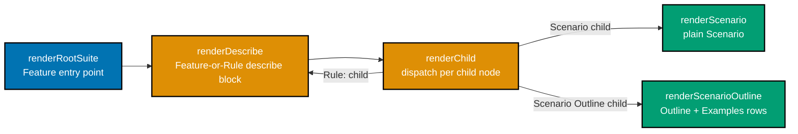

# Technical Documentation: E2E Coverage Rule/Feature Skip/Fixme Gap

## Architecture

`scan_skip_or_fixme_describe_titles` (`apps/rhino-cli/src/application/e2e_coverage/parser.rs`)
currently matches a `test.describe.skip(...)`/`.fixme(...)` block by its wrapping title, scoped (per
its own doc comment) to the `Scenario Outline` case. playwright-bdd's `renderDescribe`
(`node_modules/playwright-bdd/dist/generate/file.js:153-160`) is the shared rendering path for
`Feature:`, `Rule:`, AND `Scenario Outline:` wrapping `describe` blocks alike — `renderChild` calls it
for a `Rule`, `renderRootSuite` calls it for the `Feature`. A first-class `@skip`/`@fixme` tag at any
of these three levels produces the same shape: a `.skip`/`.fixme`-suffixed `describe` wrapping plain,
unsuffixed nested `test(...)` calls (verified via
`node_modules/playwright-bdd/dist/generate/test/index.js:35`'s `SpecialTags` construction, built from
each scenario's own AST tags only — inheritance from a Rule/Feature tag is a Playwright-runtime
behavior, not something playwright-bdd's generator encodes into the child's own call).

The call graph below shows why `scan_skip_or_fixme_describe_titles` must generalize rather than gain
a parallel function per node type: `renderDescribe` is directly recursive on itself (via
`renderChild`) for `Rule:` children, so a `Rule:` block and the top-level `Feature:` block are
rendered by the exact same code path.

A first-class `@skip`/`@fixme` tag on the `Feature:` node or a `Rule:` node is rendered by the same
`renderDescribe` call that already produces the `Scenario Outline` shape today — only the leaf
renderers (`renderScenario`, `renderScenarioOutline`) differ. This is why DD-1 below generalizes the
existing scan function instead of adding `scan_rule_skip_fixme`/`scan_feature_skip_fixme` siblings.

## Design Decisions

### DD-1 — Generalize `scan_skip_or_fixme_describe_titles` rather than adding parallel functions

Rewrite the existing Outline-scoped function to match the wrapping `describe` block's structural shape
(a `.skip`/`.fixme`-suffixed block with plain unsuffixed `test(...)` calls nested inside) regardless of
whether that block came from a `Scenario Outline`, `Rule`, or `Feature` — rather than adding two more
near-duplicate scan functions. This follows the same generalization precedent set inside the
originating plan (the zero-row-Outline absence-detection redesign, `tech-docs.md` DD-6 in
`plans/done/2026-07-18__e2e-scenario-coverage-gap-detector`).

**Alternative considered**: three separate functions (`scan_outline_skip_fixme`,
`scan_rule_skip_fixme`, `scan_feature_skip_fixme`). Rejected — the underlying playwright-bdd rendering
mechanism is identical at all three levels (confirmed via `renderDescribe`'s single shared
implementation), so three functions would triplicate logic for a distinction that doesn't exist in the
generated output's shape.

### DD-2 — Locate and refresh the design-decision doc that documents this mechanism

The originating plan's `tech-docs.md` DD-6 lives in `plans/done/2026-07-18__e2e-scenario-coverage-gap-detector/`
(archived, historical record — not meant to be edited post-archival per the
[Knowledge Capture Convention](../../../repo-governance/development/quality/knowledge-capture.md)'s
transient-log caveat, which is a distinct but analogous "done folders are historical" principle). This
plan's own `tech-docs.md` (this file) is the new durable home for the current design decision; if a
durable non-plan doc for the shipped `e2e-coverage` architecture exists by the time this plan executes
(e.g., promoted to `docs/reference/` or `apps/rhino-cli/README.md`), update that instead and
cross-reference it here.

## File-Impact Analysis

- `apps/rhino-cli/src/application/e2e_coverage/parser.rs` — `scan_skip_or_fixme_describe_titles`
  generalization, plus 3 new Rust unit-test fixtures (AC-1, AC-2, AC-3) in the existing
  `#[cfg(test)] mod tests` block, mirroring the sibling Outline-level regression tests.
- `specs/apps/rhino/behavior/rhino-cli/gherkin/specs/e2e-coverage.feature` — 2 new `@unit`-tagged
  `Scenario:` blocks (Rule-level `@skip`, Feature-level `@fixme`), linked via `// @covers` comments
  on the corresponding new Rust tests, per the existing linkage convention used throughout this file
  (e.g. `apps/rhino-cli/src/application/e2e_coverage/parser.rs:764`).
- The design-decision doc identified during Phase 0 of `delivery.md` (an existing durable doc under
  `docs/reference/`, or this plan's own `tech-docs.md` if none is found) — refreshed to describe the
  generalized Feature/Rule/Outline detection.

## Testing Strategy

TDD: RED (AC-1/AC-2 fixtures fail against current code) → GREEN (generalized function) → REFACTOR.
AC-3/AC-4 are guard fixtures proving no regression on `.only` exclusion or existing Outline detection.

## Dependencies

None new — pure extension of existing `parser.rs` logic.

## Risks and Rollback

Low risk, scoped to one function. Rollback is a straightforward `git revert`.
