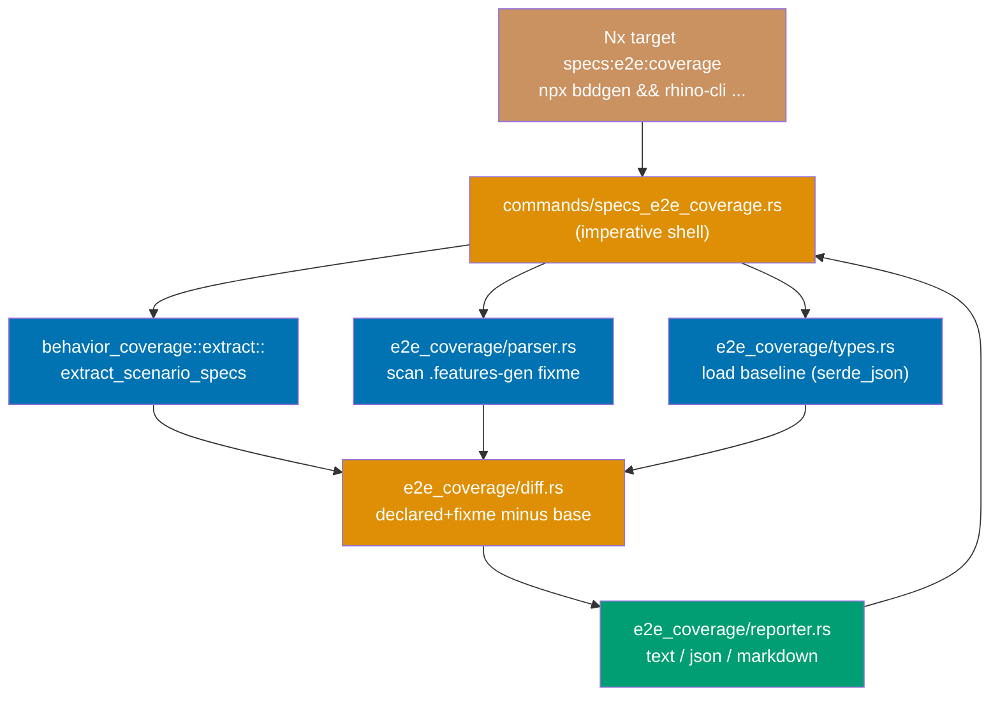
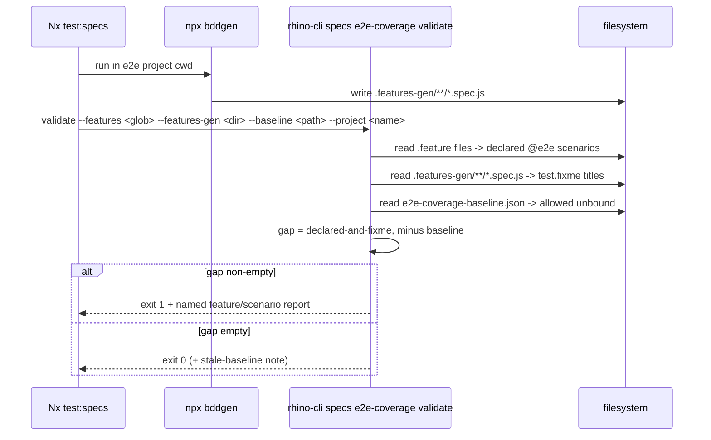
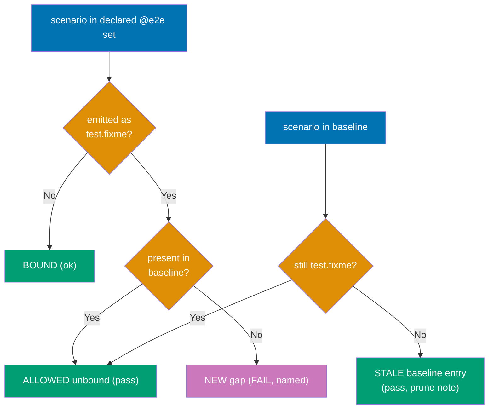

# Technical Documentation: E2E Scenario Coverage Gap Detector

## Architecture

The validator is a new `rhino-cli` subcommand implemented in the established functional-core /
imperative-shell layout used by every other `rhino-cli` command `[Repo-grounded:
apps/rhino-cli/src/{commands,application,internal}]`:

- **Command wrapper** (imperative shell): `apps/rhino-cli/src/commands/specs_e2e_coverage.rs` — parses
  args (Clap `Args`), reads files, calls the pure core, formats output, returns exit code. Models
  after the sibling `apps/rhino-cli/src/commands/specs_coverage.rs` `[Repo-grounded]`.
- **Application core** (pure): `apps/rhino-cli/src/application/e2e_coverage/` — new module
  (`mod.rs`, `types.rs`, `parser.rs`, `diff.rs`, `reporter.rs`) with pure functions that take
  in-memory inputs (declared scenarios, generated-output text, baseline) and return a diff result.
  Models after `apps/rhino-cli/src/application/behavior_coverage/` `[Repo-grounded]`.
- **Reuse**: the declared-scenario extraction reuses
  `crate::application::behavior_coverage::extract::extract_scenario_specs`, which already parses
  `Scenario:` / `Scenario Outline:` blocks and their `@unit`/`@integration`/`@e2e` level tags into
  `ScenarioSpec` values `[Repo-grounded: apps/rhino-cli/src/application/behavior_coverage/extract.rs]`.

### Component interactions



### Validation sequence



### Gap-classification decision branches



## Design Decisions

### DD-1 — Home: a new `rhino-cli specs e2e-coverage validate` subcommand

Chosen over a `ci-checker` agent enhancement because a Rust subcommand is deterministic, unit-testable
with fixtures, reusable across every repo and every playwright-bdd project, and wireable into Nx
gates the same way `specs:behavior:coverage` already is `[Repo-grounded: nx-targets.md]`. The command
name follows the established **verb-last** grammar: `specs behavior-coverage validate` and
`specs domain-coverage validate` already exist, so `specs e2e-coverage validate` is the consistent
sibling `[Repo-grounded: cli.rs §SpecsCommands]`.

### DD-2 — Detection: scan playwright-bdd's own generated output (ground truth)

The validator runs `bddgen`, then scans the generated `.features-gen/**/*.spec.js` for `test.fixme(`
markers. It does **not** re-implement playwright-bdd's step-matching — playwright-bdd itself decides
bound vs. unbound, and `test.fixme` is its literal signal for a skipped-because-unmatched scenario
under `missingSteps: "skip-scenario"` `[Repo-grounded: playwright.config.ts comment]`. Declared set =
`@e2e`-tagged `Scenario:`/`Scenario Outline:` in the project's consumed `.feature` files.
`.features-gen/` is gitignored `[Repo-grounded: apps/ayokoding-www-fe-e2e/.gitignore]`, so the Nx
target regenerates it every run; the validator never reads stale output.

### DD-3 — Baseline storage: per-project checked-in JSON manifest

The baseline lives at `apps/<project>-e2e/e2e-coverage-baseline.json` — colocated with the project it
governs, checked in, and reviewable in PRs. This matches the maintainer's documented preference for
explicit config over convention. **JSON** (not TOML/YAML) because it matches the project's existing
per-project machine-config format (`project.json`) and `serde_json` is already a `rhino-cli`
dependency `[Repo-grounded: rhino-cli uses serde_json in commands, e.g. specs_gherkin_cardinality.rs]`.

The manifest is **not** placed in `repo-config.yml`: that file is under a cross-repo schema-parity gate
requiring an identical key set across `ose-public`/`ose-primer`/`ose-infra` `[Repo-grounded:
nx-targets.md §Cross-Repo rhino-cli Byte-Identity Standard rule 4]`, and per-project e2e baselines
differ per repo. A standalone per-project file keeps the byte-identity boundary clean.

**Format** (entries key on `{feature, scenario}` pairs so titles need not be globally unique):

```json
{
  "project": "ayokoding-www-fe-e2e",
  "allowedUnbound": [
    {
      "feature": "specs/apps/ayokoding/behavior/ayokoding-www/gherkin/navigation/navigation.feature",
      "scenario": "Navigate to a nested docs page from the sidebar"
    }
  ]
}
```

### DD-4 — Pipeline gate: a dedicated `specs:e2e:coverage` Nx target, folded into `test:specs`

A new per-project target `specs:e2e:coverage` (colon-namespaced, consistent with the sibling
`specs:behavior:coverage` / `specs:domain:coverage` coverage targets `[Repo-grounded: nx-targets.md
§Target Naming Standards]`) runs `npx bddgen && cargo run … -- specs e2e-coverage validate …`. It is
added to each playwright-bdd e2e project's `test:specs` aggregate, which runs inside `test:quick` and
is therefore enforced identically at pre-push, PR gate, and main gate `[Repo-grounded: nx-targets.md
§All-Four-Gates Rule]`.

**Why fold `bddgen` into a pre-push-reachable target** even though `test:e2e` (which also runs
`bddgen`) is CRON-only: `bddgen` is codegen-only — it parses feature files and step defs and writes
`.spec.js`; it starts no browser and no web server, so it is sub-second `[Judgment call]`. The
expensive part of `test:e2e` (Playwright browser execution) stays CRON-only. Running `bddgen` at
pre-push for affected e2e projects is cheap and gives the fast, local signal the contributor persona
needs.

**Cacheability**: `specs:e2e:coverage` declares `cache: true` with `inputs` = the project's consumed
`.feature` globs, its `src/steps/**` step-definition dir, and its `e2e-coverage-baseline.json`. The
validator result is deterministic given those inputs, so caching is safe `[Repo-grounded: nx-targets.md
§Caching Rules — pure analysis targets cache]`.

### DD-5 — Scope: every playwright-bdd project, not just `skip-scenario` ones

All 11 e2e projects use `defineBddConfig` `[Repo-grounded: grep defineBddConfig apps/*/playwright.config.ts]`;
only `ayokoding-www-fe-e2e` sets `missingSteps: "skip-scenario"` today `[Repo-grounded]`. Wiring the
target to every playwright-bdd project (each with its own baseline) is belt-and-suspenders: on a
`fail-on-gen` project `bddgen` either succeeds (zero `test.fixme` → empty gap, trivial pass) or
hard-fails (an even stronger signal, caught before the validator runs). This prevents a future switch
to `"skip-scenario"` on any suite from silently reintroducing the gap.

### DD-6 — `Scenario Outline` handling

A `Scenario Outline` is counted once in the declared set by its title. playwright-bdd emits one
generated test per `Examples` row, titled with the outline title plus the example data; the scan
treats the outline as unbound if **any** emitted variant is `test.fixme`, matching on the outline
title prefix. Documented here so the parser's matching rule is explicit.

## File Impact

| Path                                                                              | Change | Notes                                                   |
| --------------------------------------------------------------------------------- | ------ | ------------------------------------------------------- |
| `apps/rhino-cli/src/commands/specs_e2e_coverage.rs`                               | New    | Command wrapper (Clap `Args`, `run`)                    |
| `apps/rhino-cli/src/commands/mod.rs`                                              | Edit   | Register the new command module                         |
| `apps/rhino-cli/src/application/e2e_coverage/{mod,types,parser,diff,reporter}.rs` | New    | Pure core                                               |
| `apps/rhino-cli/src/application/mod.rs`                                           | Edit   | Register the new application module                     |
| `apps/rhino-cli/src/cli.rs`                                                       | Edit   | Add `SpecsCommands::E2eCoverage` + `dispatch_specs` arm |
| `specs/apps/rhino/behavior/rhino-cli/gherkin/specs/e2e-coverage.feature`          | New    | Companion Gherkin for the subcommand                    |
| `specs/apps/rhino/behavior/rhino-cli/gherkin/README.md`                           | Edit   | Add the new feature to the `specs` domain table         |
| `apps/<project>-e2e/e2e-coverage-baseline.json` (×11 playwright-bdd projects)     | New    | Per-project baseline manifest                           |
| `apps/<project>-e2e/project.json` (×11)                                           | Edit   | Add `specs:e2e:coverage` target; add it to `test:specs` |
| `apps/rhino-cli/README.md`                                                        | Edit   | Document the new subcommand                             |

**Cross-repo (byte-identity)**: `apps/rhino-cli/src/**`, its `Cargo.toml`/`Cargo.lock` (if deps
change), `project.json`, and the new `specs/apps/rhino/behavior/rhino-cli/gherkin/**` files must be
propagated byte-identically to `ose-primer` and `ose-infra` `[Repo-grounded:
docs/reference/sdlc-gate-standard.md#rhino-cli-byte-identity-boundary]`. The per-project baseline
manifests and `project.json` target wiring are repo-specific (different e2e projects per repo) and are
**not** part of the byte-identical boundary.

## Dependencies

- `serde` / `serde_json` — already a `rhino-cli` dependency `[Repo-grounded]`.
- `regex` — already a `rhino-cli` dependency (used by `behavior_coverage::extract`) `[Repo-grounded]`.
- `playwright-bdd` `bddgen` — invoked by the Nx target, not by the Rust binary (keeps the binary pure
  and node-free) `[Repo-grounded: apps/ayokoding-www-fe-e2e/project.json runs`npx bddgen`]`.

No new third-party crate is anticipated; if one is required it follows the
[Dependency Bump Stability & Safety Policy](../../../repo-governance/development/workflow/dependency-bump-policy.md)
and both `Cargo.toml` and `Cargo.lock` propagate under byte-identity.

## Rollback

The change is purely additive — no data migration, no schema change, no destructive operation — so
rollback is a straightforward revert at three independent granularities:

- **Disable the gate for one project without a full revert**: remove the `specs:e2e:coverage` entry
  from that project's `test:specs` `commands` array in `apps/<project>/project.json` (leave the
  `specs:e2e:coverage` target definition and the `e2e-coverage-baseline.json` file in place). This is
  the fastest mitigation if the gate misbehaves for a single project — it stops blocking `test:quick`
  for that project only, with a one-line diff.
- **Fully revert the `rhino-cli` subcommand + CLI wiring**: `git revert` (or drop) the commits that add
  `apps/rhino-cli/src/commands/specs_e2e_coverage.rs`,
  `apps/rhino-cli/src/application/e2e_coverage/**`, the `cli.rs` `SpecsCommands::E2eCoverage` +
  `dispatch_specs` wiring, and the companion
  `specs/apps/rhino/behavior/rhino-cli/gherkin/specs/e2e-coverage.feature` +
  `specs/apps/rhino/behavior/rhino-cli/gherkin/README.md` entry. Then remove every
  `specs:e2e:coverage` target and `test:specs` reference added across the 11 e2e projects'
  `project.json` files, and delete the 11 `e2e-coverage-baseline.json` manifests. No other command's
  behavior depends on this module, so the revert is self-contained.
- **Propagation across the byte-identity boundary**: because `apps/rhino-cli/src/**`, its
  `Cargo.toml`/`Cargo.lock`, `project.json`, and the new `specs/apps/rhino/behavior/rhino-cli/gherkin/**`
  files are byte-identical across `ose-public`/`ose-primer`/`ose-infra`
  `[Repo-grounded: docs/reference/sdlc-gate-standard.md#rhino-cli-byte-identity-boundary]`, a full
  revert of the `rhino-cli` source must land in all three repos to keep byte-identity intact — reverting
  only in `ose-public` would reintroduce drift identical in kind to the drift this plan's predecessor
  ([`rhino-cli-source-drift-reconciliation`](../rhino-cli-source-drift-reconciliation/README.md))
  exists to fix. The per-project baseline manifests and `project.json` e2e wiring are repo-specific
  (not part of the byte-identical set), so each sibling repo's own e2e wiring is reverted independently
  in that repo.

## Testing Strategy

Per the [Test-Driven Development Convention](../../../repo-governance/development/workflow/test-driven-development.md),
tests precede implementation. The `prd.md` Gherkin scenarios are the source of the first failing
tests. The `rhino-cli` cucumber-rs harness is deferred repo-wide; behavior is covered by Rust
`#[cfg(test)]` unit tests plus the shadow-diff, matching every other `rhino-cli` command
`[Repo-grounded: memory — rhino-cli cucumber gap; commands/*.rs inline`mod tests`]`.

| Acceptance criterion (prd.md) | Test level | Where                                                             |
| ----------------------------- | ---------- | ----------------------------------------------------------------- |
| AC-1 baseline-aware pass      | Unit       | `application/e2e_coverage/diff.rs` `#[cfg(test)]`                 |
| AC-2 new gap fails            | Unit       | `application/e2e_coverage/diff.rs`                                |
| AC-3 shrinkage passes         | Unit       | `application/e2e_coverage/diff.rs`                                |
| AC-4 named reporting          | Unit       | `application/e2e_coverage/reporter.rs`                            |
| AC-5 only @e2e declared       | Unit       | `application/e2e_coverage/parser.rs` (declared extraction filter) |
| AC-6 `--update-baseline`      | Unit       | `commands/specs_e2e_coverage.rs` (serialize round-trip)           |
| AC-7 missing output errors    | Unit       | `commands/specs_e2e_coverage.rs` (fs error path)                  |
| AC-8 stale-entry note         | Unit       | `application/e2e_coverage/diff.rs`                                |

Coverage stays ≥ 90% line via the existing `test:coverage` gate `[Repo-grounded: rhino-cli project.json
`--fail-under-lines 90`]`. Each new command feature scenario gets a companion `@unit`-tagged scenario
in `e2e-coverage.feature`, satisfying the specs/Gherkin completeness rule.

## Specs & Gherkin Completeness

This plan changes observable behavior under `apps/` (a new `rhino-cli` command) and `specs/`, so per
the [Feature Change Completeness Convention](../../../repo-governance/development/quality/feature-change-completeness.md)
it carries companion Gherkin (`e2e-coverage.feature`) and a `specs:coverage`/`specs:behavior:coverage`
gate in the delivery checklist. Not exempt.

## UI-Design-Funnel Exemption

This plan is **not UI-bearing** — it adds a CLI subcommand and Nx wiring; it touches no user-facing
screen or component under `apps/*/src` (web) or `libs/web-ui`. Per the plan-maker UI-design-funnel
rule, the funnel is therefore **not required**. Manual verification is CLI-level (run the command,
observe exit code + output), not Playwright/curl.

## Relevant Prior Art

- `apps/ayokoding-www-fe-e2e/playwright.config.ts` — the `missingSteps: "skip-scenario"` config this
  validator backstops `[Repo-grounded]`.
- `apps/rhino-cli/src/application/behavior_coverage/` + `commands/specs_coverage.rs` — the structural
  template (pure core + shell) and the reused `extract_scenario_specs` parser `[Repo-grounded]`.
- `repo-governance/development/infra/nx-targets.md` — canonical target names, caching rules, gate model.
- `repo-governance/development/infra/bdd-spec-test-mapping.md` — spec-to-test terminology alignment.
- `.claude/agents/ci-checker.md`, `.claude/agents/pr-review-maker.md` — downstream consumers.
- `plans/ideas.md` — the ~104-scenario baseline source `[Repo-grounded]`.
