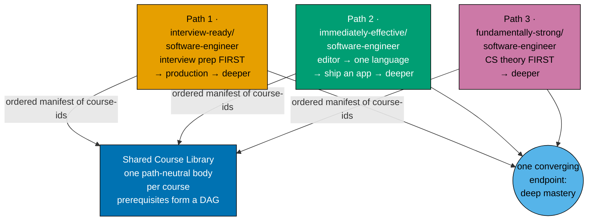
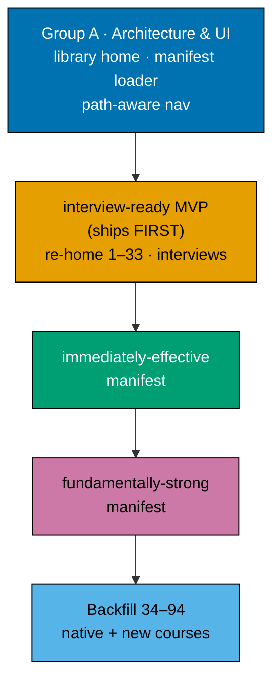

# Fundamentally Strong — Shared Course Library, Three Learning Paths

Turn the "Fundamentally Strong" curriculum into a **shared course library** composed by **three
learning paths**. One canonical body per course (a path-neutral "building block"); each path is an
**ordered, prerequisite-consistent manifest** that composes a **curated subset** of course IDs in a
chosen order. Zero body duplication, single source of truth per course. This plan also builds the
**real ayokoding-www UI change** that makes path-aware navigation work — one canonical course URL
plus client-side path context — under the `/en/c/learn` URL model.

## Three paths, one library, one converging endpoint

All three paths end at the **same deep mastery**; only the **entry point**, the **journey ordering**,
and the **teaching emphasis** differ. Each is a fresh, bespoke ordering authored over the one library
and over the one prerequisite DAG the library forms.

- **Course = standalone, path-neutral building block.** Each self-contained topic module is a
  **course** with a stable **course ID** (its kebab-case slug, e.g. `coding-interview`). Its canonical
  body is authored **once**, lives at
  `apps/ayokoding-www/content/en/.../courses/<course-id>/`, and is served at
  **`/en/c/learn/courses/<course-id>`** via the existing `/c/[...slug]` content route. Rendered with
  no path context, a course shows its canonical standalone view. A body is **never** forked per path.
- **Path = ordered manifest composing a curated subset.** A "path" is a data manifest that lists
  course IDs in a chosen order. It references a **curated subset** of the library — **not every course
  is in every path**. A path freely **omits** courses that do not fit its arc (omit-or-create) and
  every manifest must be **prerequisite-consistent** (a valid topological entry into the DAG).
- **`fundamentally-strong` is both the library/section brand and path #3's id.** The three path
  landings live at **`/en/c/learn/paths/<path-id>`**:
  1. `interview-ready/software-engineer` — an experienced SWE re-entering the market: interview/job
     prep FIRST → production-effective → deeper. (renamed from `job-seeking`)
  2. `immediately-effective/software-engineer` — the immediately-effective principle: editor → one
     language → **build a real app FIRST** → then deepen. (renamed from the old shipping-first
     `fundamentally-strong` path)
  3. `fundamentally-strong/software-engineer` — university-style: fundamentals / CS-theory FIRST →
     deeper. (**NEW** path)
- **All three are FRESH manifests.** None maps cleanly to the existing built spiral order; each is a
  bespoke ordering authored over the library. The three paths are **three different entry points and
  orderings into the one DAG** that converges on the same endpoint.

## Course-block & manifest model (summary)

- **Canonical course home**: `apps/ayokoding-www/content/en/.../courses/<course-id>/` — one
  page-bundle per course, served at **`/en/c/learn/courses/<course-id>`** via the existing
  `/c/[...slug]` content route. One URL per course, path-independent.
- **Path landing**: **`/en/c/learn/paths/<path-id>`** renders a path's manifest as an ordered,
  prerequisite-consistent syllabus over the courses.
- **Path manifest**: a standalone data file under
  `apps/ayokoding-www/src/features/course-paths/manifests/**/*.yaml` (nested to mirror each slash path
  ID — the machine-consumed source of truth), carrying `pathId`, display `title`, `description`, and
  an ordered `courseOrder` list of course IDs. It is NOT frontmatter on a content `_index.md`; the
  path landing page renders from the loaded manifest. The human-readable mirror is
  [`syllabus/paths/`](./syllabus/paths/README.md).
- **Path context**: a course page reads `?path=<path-id>`; its prev/next and breadcrumb then follow
  **that path's manifest ordering**. With no path context (or an unknown path) the course renders its
  **canonical standalone view** — a graceful fallback, never an error.
- **Prerequisites (EVERY course)**: each course declares `prerequisites: [course-id, ...]` in its
  canonical metadata, so the library forms a **prerequisite DAG**. The canonical course page
  **surfaces its prerequisites**. Full design in
  [tech-docs.md §Path-Aware Navigation UI](./tech-docs.md#path-aware-navigation-ui-ayokoding-www).
- **Variant allowance**: the default is one shared, path-neutral block. Only when a path needs a
  genuinely different **teaching approach** for a topic (e.g. interview-drilled vs university-rigorous
  vs build-fast) is a **separate course variant** authored — same topic, distinct course ID, distinct
  pedagogy — and paths pick the fitting variant. Variants are added on demand, never enumerated
  speculatively.

## Course library source (baseline 121, 0 merges)

The library retains **all 121** courses (see the reconciled catalog in
[`syllabus/courses/`](./syllabus/courses/README.md)):

1. **33 shipped topics (1–33)** — live today at legacy
   `content/en/learn/fundamentally-strong/software-engineer/<slug>/`. These are **re-homed** into
   `courses/<course-id>/` **with redirects**.
2. **61 transferred topics (34–94)** — carried from the now-closed FS-SE plan. These are authored
   **NATIVE** into `courses/<course-id>/` (no legacy home, so no re-home, no redirect).
3. **4 existing capstones + 23 net-new courses** — the interview cluster (interview ×4 +
   `capstone-interview-loop`), the build-your-own coding-agent / harness cluster, browser/CDP,
   async-Python/FastAPI, light self-hosting, C++, detection-engineering, the
   build-your-own-pentest-engine capstone, and (per **DL-14**) `capstone-solid-core` (existing, already
   live on disk) plus six new inter-topic capstones (`capstone-real-world-delivery`,
   `capstone-secure-service`, `capstone-data-pipeline`, `capstone-concurrency-and-systems`,
   `capstone-concurrency-showdown`, `capstone-lead-at-altitude`).

**Reconciliation rulings (locked)** — the rulings below are themselves authoritative and are
reproduced against the tracked [Course Library Catalog](./tech-docs.md#course-library-catalog)
(121 baseline, 0 merges). They were originally derived in a gitignored `local-temp/` scratch file,
which is not tracked and must not be consulted during execution:

- **detection-engineering kept distinct.** `detection-engineering-and-siem-operations` (deep,
  Wazuh-specific decoder/rule/dashboard ops) stays distinct from topic 60 `defensive-security`
  (generalist Sigma/ELK/OpenSearch blue-team breadth + IR + hardening). **The catalog's "concept-level"
  label on topic 60 is WRONG and is FIXED** — `defensive-security` is hands-on By-Example. Explicit
  scope lines are drawn between the two.
- **AI-band scope-guard.** `creating-ai-powered-apps` (56, _use_ an LLM in an app) → `agentic-ai`
  (57, a single **survey** that previews and **forward-links** each primitive, and does NOT re-teach
  at build-your-own depth) → the build-your-own harness cluster (build a production harness, one
  subsystem at a time). The scope-guard cross-reference contract is baked into the cluster authoring.

The full per-course detail (every course + ID, format, language, one-line scope) is the
[`syllabus/courses/` catalog](./syllabus/courses/README.md); the three path orderings are the
[`syllabus/paths/` manifests](./syllabus/paths/README.md).

## Build order (locked)

1. **Group A — architecture + UI (hard prerequisite).** Build the `courses/` library home; the
   `/en/c/learn/courses/<id>` + `/en/c/learn/paths/<path-id>` routing; `?path` context; the manifest
   loader (`apps/ayokoding-www/src/features/course-paths/manifests/**/*.yaml`, nested to mirror slash
   path IDs); manifest-driven prev/next + breadcrumb; **prerequisite display** on the course page;
   graceful canonical fallback; path landing pages; accessibility. Unit + integration + e2e +
   `specs/` Gherkin.
2. **interview-ready MVP (ships first).** Re-home topics 1–33 into `courses/`; author the 4 interview
   courses + `capstone-interview-loop`; write `manifests/interview-ready/software-engineer.yaml`; ship
   end-to-end (landing page, path-aware nav, deploy).
3. **immediately-effective manifest.** Compose the editor → one-language → build-a-real-app-first arc
   over the courses that have landed.
4. **fundamentally-strong manifest.** Compose the university-style fundamentals/CS-theory-first arc.
5. **Backfill topics 34–94** native into `courses/` (+ the remaining new courses) as the library
   fills; each path's manifest grows as its courses land.

Full phase list in [delivery.md](./delivery.md).

## Depends-on

**No hard plan dependency.** The prior "FS-SE must be DONE first" hard dependency is **REMOVED** —
the sibling FS-SE plan is **closed**
([`plans/done/2026-07-19__fundamentally-strong-software-engineer/`](../../done/2026-07-19__fundamentally-strong-software-engineer/README.md)),
and its Passes 3–5 scope (topics 34–94 + the associated capstones) is **absorbed into this plan** as
the native-authored backfill. This plan therefore owns both the re-homing of the 33 shipped topics
and the native authoring of the 61 transferred topics — it does not wait on any other plan.

## Primary personas (one per path)

- **`interview-ready/software-engineer` — experienced SWE re-entering the market.** Recently laid off,
  returning from a gap/sabbatical, or a senior switching. Wants to refresh breadth fast, relearn
  interview technique at mid/senior/staff level, and handle a layoff/gap narrative — without walking a
  from-scratch curriculum. Interview/job prep FIRST.
- **`immediately-effective/software-engineer` — a productive-fast builder.** Wants "immediately
  effective" SWE: set up the editor, learn one language end-to-end, **build a real app first**, and
  only then deepen into CS fundamentals, DS&A, algorithms, and systems. Serves a from-scratch learner
  and a mid-career switcher alike.
- **`fundamentally-strong/software-engineer` — a university-style, fundamentals-first learner.** Wants
  the theory foundation first: CS foundations, computer architecture, paradigms, data structures and
  algorithms **before** building apps at scale — the rigorous, bottom-up route to the same mastery.

## Navigation

- [Business Requirements (brd.md)](./brd.md) — WHY the three-path shared-library model, who it serves.
- [Product Requirements (prd.md)](./prd.md) — the model as product spec, the three personas, user
  stories, Gherkin acceptance criteria (path-aware nav, `?path` context, prerequisite display,
  canonical fallback), the NEW-course specs, and the **UI-design-funnel** for the path-aware
  navigation screens against the `/en/c/learn` URL model.
- [Technical Docs (tech-docs.md)](./tech-docs.md) — the shared-course-library architecture, the
  course-ID + manifest schema, the prerequisite DAG, the ayokoding-www path-aware-navigation UI
  design, the course library catalog, and the three path manifests.
- [Delivery Checklist (delivery.md)](./delivery.md) — phased executable checklist.
- [Syllabus](./syllabus/README.md) — the per-course detail layer: the
  [`courses/` catalog](./syllabus/courses/README.md) (the 121 courses) and the
  [`paths/` manifests](./syllabus/paths/README.md) (the three orderings over it).
- [Learnings (learnings.md)](./learnings.md) — knowledge-capture running log.

## Delivery Mode: worktree-to-pr

`worktree-to-pr` (the repo default): work in `worktrees/fundamentally-strong-shared-course-tracks/`,
open a draft PR per phase against `main`, run the PR-Review Maker→Fixer Cycle (3 sequential CI-gated
cycles), then `[AI]` merges automatically once the review and all quality gates are green — a
plan-scoped confirmation of the repo-default `[AI]` merge, which this plan does not opt out of (see
**DN-11 DECIDED** below). `ayokoding-www` is deployed to `prod-ayokoding-www` after every merge. See
[delivery.md](./delivery.md) for the `## Worktree` and `## Delivery Mode` declarations and the
PR-review-cycle steps.

## Decisions Locked (from grilling the maintainer)

The following are **decided** and drive the plan. Residual per-path ordering judgment calls (which
courses each path curates, exact orderings) are resolved in the manifests (tech-docs +
[`syllabus/paths/`](./syllabus/paths/README.md)) rather than re-grilled.

- **DL-1 · Three paths, one shared library, one converging endpoint.**
  `interview-ready/software-engineer` (interview-first), `immediately-effective/software-engineer`
  (build-app-first), and `fundamentally-strong/software-engineer` (theory-first) compose one canonical
  course library. All three end at the same deep mastery; only entry point, journey ordering, and
  teaching emphasis differ. **Decided.**
- **DL-2 · Course = path-neutral building block; path = ordered manifest over a curated subset.**
  1 topic = 1 course with a stable ID; a path references a curated subset of course IDs in order and
  freely omits courses that do not fit; zero body duplication, single source of truth. **Decided.**
- **DL-3 · All three manifests are FRESH.** None maps to the existing built spiral order; each is a
  bespoke ordering authored over the library. **Decided.**
- **DL-4 · Prerequisite DAG.** Every course declares `prerequisites: [course-id, ...]` in its
  canonical metadata; the library forms one prerequisite DAG; the canonical course page surfaces its
  prerequisites; every path manifest MUST be a valid topological entry into the DAG. The three paths
  are three different entry points into the one DAG. **Decided.**
- **DL-5 · Omit-or-create + variant policy.** A path omits a shared course that does not fit, or a new
  course is created (added to the library, available to all paths). The default is one shared,
  path-neutral block; a **separate course variant** (same topic, distinct course ID, distinct
  pedagogy) is authored **only** when a path needs a genuinely different teaching approach. Optional
  per-path lightweight framing (intro/outro callout) only; never a body fork. Variants added on
  demand, not enumerated speculatively. **Decided.**
- **DL-6 · Library source & catalog (baseline 121, 0 merges).** 33 shipped topics (1–33) re-homed
  into `courses/` **with redirects**; 61 transferred topics (34–94) authored **NATIVE** into
  `courses/` (no re-home); 4 existing capstones + 23 net-new courses. The library retains all 121
  (see **DL-14** for the seven DD-20 inter-topic capstones folded into this baseline). **Decided.**
- **DL-7 · Build order — interview-ready ships first.** Deliver Group A (architecture + UI) first as a
  hard prerequisite; then the `interview-ready/software-engineer` path end-to-end (re-homing topics
  1–33, authoring the interview cluster); then the `immediately-effective` manifest; then the
  `fundamentally-strong` manifest; then backfill topics 34–94 native as the library fills. **Decided.**
- **DL-8 · URL model.** Courses at `/en/c/learn/courses/<course-id>` and path landings at
  `/en/c/learn/paths/<path-id>`, both via the existing `/c/[...slug]` content route; `?path=<path-id>`
  carries path context. (Renamed from the prior `/en/courses/<id>` + `/en/path/...` forms.) **Decided.**
- **DL-9 · detection-engineering kept distinct + topic-60 label fix.**
  `detection-engineering-and-siem-operations` stays distinct from `defensive-security` (60);
  `defensive-security` is re-labelled **hands-on By-Example** (the catalog's "concept-level" label was
  wrong); explicit scope lines are drawn (generalist Sigma/ELK breadth vs deep Wazuh SIEM-ops).
  **Decided.**
- **DL-10 · AI-band scope-guard.** `creating-ai-powered-apps` (use-an-LLM) → `agentic-ai` (survey +
  forward-link, does not re-teach at depth) → build-your-own harness cluster (build-your-own depth).
  A cross-reference contract prevents the survey and the cluster from duplicating the
  loop/tools/MCP/memory/evals explanations. **Decided.**
- **DN-11 DECIDED — `[AI]` auto-merge (now the repo default).** `[AI]` merges each phase's PR
  automatically once the 3-cycle PR-Review Maker→Fixer Cycle and all quality gates are green — this
  plan declares no `[HUMAN]` merge gate. When DN-11 was first recorded, `pr-merge-protocol.md` still
  defaulted to a `[HUMAN]` merge, so the maintainer authorized AI-auto-merge for **this plan**
  (in-session): (a) it uses the SAME delivery methods as the now-closed sibling plan
  `fundamentally-strong-software-engineer`; and (b) no maintainer permission is needed to merge a PR
  once it has passed 3 review cycles and the PR quality gate. The protocol has since been changed so
  that `[AI]` merges by default and `[HUMAN]` is an explicit per-plan opt-in, making DN-11 a
  confirmation of the default rather than an override. Recorded here and in
  [delivery.md](./delivery.md#delivery-mode-worktree-to-pr).
- **DL-12 · FS-SE hard dependency REMOVED.** The sibling FS-SE plan is closed; its Passes 3–5 scope is
  absorbed here as the native-authored backfill of topics 34–94. This plan waits on no other plan.
  **Decided.**
- **DL-13 · Path composition = "curated + converge" (not all-comprehensive).** Not every course is in
  every path. `fundamentally-strong` = the complete-mastery path (all 121, theory-first);
  `interview-ready` = interview + core + production spine that OMITS deep-systems/OS/kernel/niche
  courses from its spine (offered as an optional "go deeper" tail); `immediately-effective` = build-first
  spine that DEFERS heavy theory into a later deepening band. All three still converge on the same deep
  endpoint; each manifest is prerequisite-consistent. Supersedes the earlier all-comprehensive draft.
  **Decided 2026-07-19.**
- **DL-14 · Seven orphaned inter-topic capstones promoted to first-class library courses (baseline
  114 → 121, still 0 merges).** Audit found seven capstones fully specced but absent from the catalog
  tables and path manifests: `capstone-solid-core` (already **live on disk**, embedded in
  `syllabus/courses/engineering-management.md`), `capstone-real-world-delivery`,
  `capstone-secure-service`, `capstone-data-pipeline` (embedded in
  `syllabus/courses/defensive-security.md`), `capstone-concurrency-and-systems`,
  `capstone-concurrency-showdown` (embedded in
  `syllabus/courses/compilers-parsers-and-transpilers.md`), and `capstone-lead-at-altitude`
  (embedded in `syllabus/courses/site-reliability-engineering.md`). Ruling: promote all seven to
  first-class catalog rows (existing capstones 3 → 4, net-new 17 → 23, baseline 114 → 121, still
  0 merges); include all seven in all three path manifests at their earliest prerequisite-safe
  position (none is genuinely omitted, verified machine-checked topologically-consistent in all
  three); never fold any into a parent course's intra-course capstone or cut it. Mirrors
  [tech-docs DD-20](./tech-docs.md#design-decisions). **Decided 2026-07-19.**
