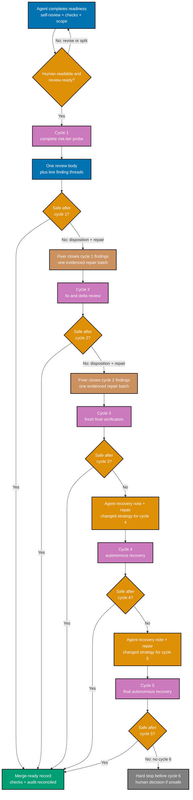
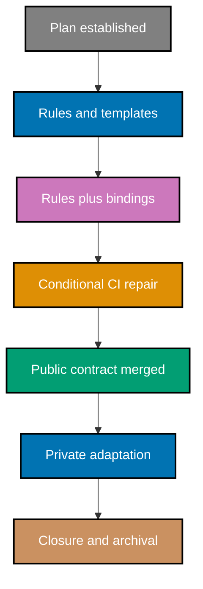
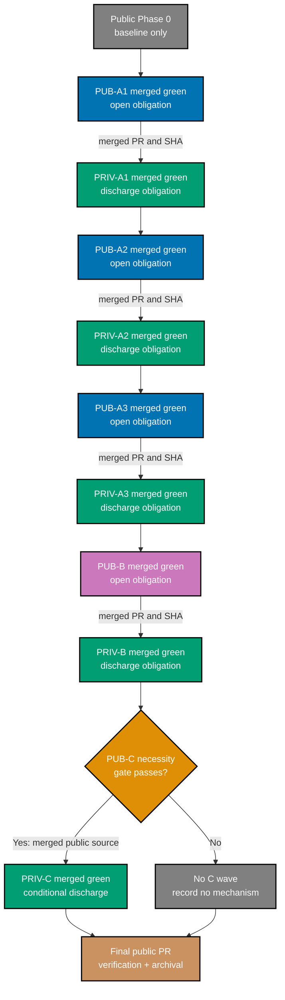

# Technical Design: Optimize the Pull Request Process

## Design Summary

This plan changes process contracts, not application architecture. It consolidates existing PR and
planning rules into one human-first lifecycle, updates agent bindings to implement that lifecycle,
and propagates the semantics from `ose-public` to `ose-private`. Native GitHub PR content remains
the record. No new PR-process service or validator is designed.

The implementation order is:

1. establish the control plan;
2. run one interleaved semantic-propagation wave at a time:
   `PUB-A1 -> PRIV-A1 -> PUB-A2 -> PRIV-A2 -> PUB-A3 -> PRIV-A3 -> PUB-B -> PRIV-B`;
3. run `PUB-C -> PRIV-C` only if the existing-CI necessity gate passes;
4. in every wave, merge the canonical public source green, pin its PR/SHA in the PR-native sibling
   obligation, then adapt and discharge that obligation privately before opening the next wave; and
5. archive this public control plan inside the final public PR.

Wave completion establishes semantic **sync**, not byte identity by default. The public source
defines portable meaning; private may adapt structure and policy only with an explicit reason. This
paired short-lived-PR flow follows Google's small, self-contained change guidance and Trunk Based
Development's merged-trunk directionality; the exact one-wave and oscillation limits are OSE
judgment calls. `[Web-cited]` `[Judgment call]`

## Design Principles

### Human interface before agent protocol

The PR body, consolidated review, line threads, replies, recovery notes, checks, and merge note are
the primary API. An agent contract is correct only when its output makes that interface clearer to a
human.

### Native artifacts before new machinery

GitHub already supports review bodies, line comments, replies, thread resolution, issue links,
checks, and merge notes. `[Web-cited]` The design composes those primitives. It does not create a
parallel database or require a parser to understand the review.

### Canonical source without correction ping-pong

Public is the canonical portable source, but downstream discovery may reveal a source defect. The
design permits one upstream public correction, then resumes the same private obligation from the
superseding merged-green source SHA. A second attempted reversal is oscillation and stops for plan
amendment and human judgment. No hidden registry, bot, or validator coordinates this state; the
public obligation record and private discharge are the state. `[Judgment call]`

### Semantic exit plus a hard safety bound

A clean current head is still the quality condition. The numeric cap bounds automation, not
correctness. Anthropic supports evaluator-optimizer loops with clear evaluation criteria and a
maximum iteration stop, but supplies no universal review-cycle number. `[Web-cited]` The cycle-1–3
target and hard stop before cycle 6 are therefore explicit OSE judgment calls grounded in the two
local long-running cases and the diminishing-return evidence, not presented as industry law.

### Prose-first enforcement

Every new line of code brings maintenance, test, security, and failure-mode obligations. Existing
governance already states this in Code as Liability. `[Repo-grounded]` The default implementation
therefore edits prose, templates, and agent instructions. Conditional CI work may only repair
existing machinery after reproduction.

## Human-First PR Description Contract

The PR description is a progressive-disclosure reading interface, not an execution transcript or
research paper. Its ordered layers are:

1. **Problem and outcome** — why the change exists and what becomes better.
2. **Brief scope and reasoned non-goals** — the boundary a reviewer should enforce.
3. **Conceptual summary** — behavior and relationships, never a file-by-file inventory.
4. **Ordered reading guide** — entry point, supporting paths, and generated/mechanical paths safe
   to skip.
5. **Review focus** — a compact statement of the decisions, risks, or uncertainties on which the
   author most needs feedback.
6. **Current-head verification** — exact commands/checks, reproduction where relevant, and reviewed
   head.
7. **Related work** — linked plan, issue, canonical governance rationale, and follow-up without
   copying their contents.
8. **Cost and benefit** — present when code is added.

`Risk and Rollout` is conditional on compatibility, migration, breaking change, feature-flag, or
rollback facts. `Visual Evidence` is conditional on a diagram or screenshot materially reducing
prose; Mermaid is a rendering capability, never a mandate. Empty conditional sections are removed.

The body has no numeric length target: it stays proportionate to the change and favors scannable
headings, short paragraphs, and bullets. Tables are used only for repeated-field comparisons. Deep evidence, research, measurement
recipes, and governance rationale remain in this plan or their canonical rule and are linked from
the PR. A methodology dump, copied citation catalog, hidden-schema-first body, or long list of
changed files fails this contract even if technically complete.

## Target PR Lifecycle



**Prose equivalent**: the agent completes readiness before cycle 1, then performs the whole selected
review and posts findings as native threads. The process exits after any cycle whose current head is
safe. Otherwise the fixer answers and repairs the findings, cycle 2 reviews fixes and delta, and
cycle 3 performs fresh final verification. If the target path does not converge, the agent posts a
changed-strategy recovery note and may run cycle 4, then does the same before cycle 5 if necessary;
neither note is a human gate. An unsafe result after cycle 5 stops automation before cycle 6 and
waits for a human decision.

## Comment-and-Reply Contract

### Consolidated review body

One review body per cycle contains:

- `Cycle N of 5`, with target safe exit at or before cycle 3;
- head SHA reviewed;
- scope anchor summary and whether it still matches the diff;
- risk tier and specialist/probe set actually used;
- count by severity and disposition state;
- current-head verification status;
- links to any prior recovery note or terminal escalation; and
- the exact AI footer.

The body summarizes; it does not replace line-anchored actionable findings.

### Finding thread

Each actionable finding is anchored to the most relevant diff line and uses this human-readable
shape:

```text
[SEVERITY] Short consequence-first title

Observation: what the diff currently does.
Observable consequence: what a person, check, runtime, or maintained artifact will experience.
Relevant concept/principle: the applicable rule in plain language; define only what this finding needs.
Reproduce or inspect: the shortest command or path a reader can follow.
Evidence: line, command result, or authoritative source connected to that consequence.
Requested disposition: fix | reject | defer | clarify.
Bounded remedy/question: the smallest in-scope action or exact missing fact.

---

Generated by AI
```

The target reader has completed a coding bootcamp, has practical coding experience, and has not
completed a university/CS bachelor curriculum. Comments assume the reader can work with code, but
do not assume coursework in algorithms, operating systems, compilers, distributed systems,
security, or architecture. They define only concepts necessary for the particular defect, remain
concise, and do not become lectures. This is an accessibility baseline, not a judgment about the
reader's capability.

`Teaching/FYI` uses the same respectful explanatory style but is explicitly nonblocking and does
not request a fixer disposition.

### Fixer reply

The fixer replies in the original thread:

```text
Disposition: fix | reject | defer | clarify

Reasoning: why this disposition is correct.
Observable result: what changed or what the current evidence proves a reader will observe.
Reproduce or inspect: the shortest command, path, check, or linked artifact that verifies it.
Evidence: changed paths and checks, disproving facts, follow-up link, or missing information.
Scope: why the action stays within the stated problem or why it is routed out.

---

Generated by AI
```

Resolution is permitted after a pushed `fix`, an evidence-backed `reject`, a `defer` with a linked
follow-up, or a completed clarification that leads to one of the first three states. A bare verdict
does not resolve a thread. Replies use the same practical-reader baseline and explain only the
concepts required to understand the disposition.

## Five-Cycle Convergence Protocol

A **cycle** is one complete scout, selected-specialist, and synthesis review of one recorded head
SHA, ending in one consolidated review artifact. Specialist fan-out within that run is not multiple
cycles. Fixer work, discussion, pushes, and CI runs are not cycles; the next cycle begins only when
the prior findings have dispositions and the next stable head is ready for review.

### Entry readiness — before cycle 1

The agent must not spend a counted cycle discovering that the PR was still a draft. Before cycle 1,
it records that the current head is complete, cohesive, self-reviewed, free of accidental changes,
mapped to acceptance criteria, accurately described, locally checked, and assigned the complete
risk-tier probe. Known failures or limitations are explicit. CI runs are evidence, not review
cycles.

### Finding admission — during cycle 1

All selected specialists inspect the same head. Synthesis deduplicates across disciplines and
admits a blocking finding only when it has an observable consequence, supporting evidence, an
in-scope relationship, and a bounded disposition path. Preference, teaching, adjacent cleanup, and
duplicate symptoms do not become separate blockers. Nothing known is deliberately held back for a
later cycle. Synthesis groups findings by causal family so multiple symptoms of one invariant do not
masquerade as unrelated work.

### Repair batch — between cycles

The fixer first resolves clarification dependencies, then appraises every finding as `fix`,
`reject`, `defer`, or `clarify`. It pushes one cohesive repair batch, runs relevant checks, updates
the body and scope accounting, and replies in each original thread with evidence. It does not use
partial pushes to trigger repeated full reviews. A safety-critical correction may still be pushed
immediately and is recorded as such.

When a finding requires class-complete remediation, the reply names the invariant and the bounded
discovery basis. As applicable, that basis covers definitions, producers, consumers, validators,
root instruction files, normative copies, legitimate exclusions, and the full enclosing block
around each edit. Every discovered match receives a change/no-change verdict. This is a human
review/fixer obligation, not authorization for a registry or discovery tool.

### Narrowing and exit — cycles 2–3

Cycle 2 checks dispositions, repair-induced risks, unresolved threads, and current-head delta.
Cycle 3 freshly verifies the full current head and audit record. A settled point is reopened only
when new evidence invalidates its disposition. Either cycle exits immediately when there is no
blocking defect, the audit reconciles, and current-head checks pass; cycle 3 is not ceremonial.

If the same causal family appears in two cycles, the next pass—within the target cycles when
possible—becomes a bounded root-cause review. It states the invariant that failed and seeks the
smallest design or rule change that restores it; it does not waive scope guards or authorize broad
rearchitecture. A third recurrence without a new causal explanation triggers split, rework, or
human escalation instead of another shape-by-shape patch.

### Autonomous recovery — cycles 4–5

Before each recovery cycle, the agent posts a human-readable recovery note containing the cause of
non-convergence, remaining blockers, scope status, and a different bounded strategy. No human
pre-approval is required. Repeating the same probe/fix strategy is not a recovery strategy.
Material scope movement, the same finding recurring without a new causal explanation, a repair that
breaks the cohesion/size boundary, or a decision requiring product/architecture authority triggers
split, rework, or human escalation. An unsafe state after cycle 5 always stops automation before
cycle 6.

### Human durability

The whole protocol is written for retrospective as well as live review. A human must be able to
read the PR after merge and reconstruct readiness, every reviewed head, why findings were admitted
or rejected, what changed between cycles, why recovery was attempted, and why the terminal state
was safe. Agent merge authority never relaxes this record. The durable record lives in concise
GitHub-native artifacts pinned to reviewed heads; a branch-side correction ledger or mandatory
hidden schema must not grow into a self-referential surface that each fixer pass rewrites and the
next cycle reviews again.

## Cycle State Model

| State                     | Entry                                                             | Exit                                        | Blocking behavior                             |
| ------------------------- | ----------------------------------------------------------------- | ------------------------------------------- | --------------------------------------------- |
| `authoring`               | PR branch exists                                                  | Body and scope are reviewable               | No review begins until scope is usable        |
| `cycle-1-full-probe`      | Reviewable PR                                                     | Every finding posted and dispositioned      | Full tier-selected probe is mandatory         |
| `cycle-2-delta`           | Cycle 1 replies and push complete                                 | Fix-induced and current-head delta reviewed | Unresolved blocking findings hold             |
| `cycle-3-final`           | Cycle 2 complete and CI current                                   | Clean current head or recovery note         | Target automation exit                        |
| `recovery-note`           | Unsafe state after cycle 3 or 4                                   | Changed strategy recorded                   | Agent may continue without human pre-approval |
| `cycle-4-or-5-recovery`   | Recovery note says another cycle is useful                        | Clean current head or hard stop before 6    | Strategy must change; no repeat for count     |
| `human-terminal-decision` | Cycle 5 unsafe or earlier human escalation                        | Split, rework, close, or manual review      | PR remains blocked until chosen path is safe  |
| `merge-ready`             | No blocking findings, audit reconciled, current-head checks green | Merge under repo authority                  | Cap never substitutes for these conditions    |

## Scope Decision Matrix

| Observation                                               | In current PR?   | Required treatment                                 |
| --------------------------------------------------------- | ---------------- | -------------------------------------------------- |
| Defect introduced by the diff                             | Yes              | Fix or evidence-backed reject                      |
| Same defect class at another site needed for completeness | Yes              | Fix all sites and explain class completeness       |
| Security defect exposed by the diff                       | Yes              | Cannot be suppressed by a non-goal                 |
| Missing or contradictory scope/body                       | Yes              | `clarify`; edit the body                           |
| Adjacent improvement not caused by the diff               | No               | `defer` with linked follow-up from original thread |
| Teaching context with no defect                           | No blocking work | Mark `Teaching/FYI`; retain as education           |
| General cleanup made convenient by touched file           | No               | Do not edit; follow-up only if valuable            |

## Mechanism Necessity Gate

No new mechanism proceeds unless all answers are “yes” and the evidence is posted in the relevant
delivery PR:

1. **Reproduced**: Is there a current, repeatable failure in existing behavior?
2. **Unsolvable by simpler means**: Can clearer prose, agent instruction, template wording, or
   native GitHub configuration not address it safely?
3. **Smallest repair**: Is the proposal a surgical change to existing machinery rather than a new
   subsystem?
4. **Owned**: Are tests, owner, failure mode, rollback, and deletion trigger explicit?
5. **Worth its liability**: Does the PR state why the benefit exceeds ongoing maintenance cost?
6. **In scope**: Is it necessary for PR/planning correctness rather than general CI optimization?

If any answer is “no” or unknown, record “no mechanism” and continue with prose/native artifacts.

### Conditional existing-CI assessment

Execution revalidates three suspected defects on each repo's current
`.github/workflows/pr-quality-gate.yml`:

- **aggregate fail-open semantics**: the final job must treat failed, cancelled, or unexpectedly
  skipped required dependencies correctly rather than checking only literal `failure`;
- **self-mutating formatter**: a validation workflow should not push formatting commits to the PR
  branch while reviewers are pinning a head SHA; and
- **duplicate work**: overlapping jobs should not repeat expensive work without a correctness
  reason.

The current workflow contains dependency-result aggregation, a formatter push to the PR branch, and
overlapping jobs. `[Repo-grounded]` Whether any shape constitutes an unsafe or wasteful defect is a
Phase 4 decision, not a fact asserted by this plan. If a defect is reproduced, the delivery
checklist requires RED/GREEN/REFACTOR and Gherkin-backed behavior tests. If not, no workflow edit is
made. No new PR-process validator is permitted.

## Planning Lifecycle Contract

| Stage                  | Owner                                                              | Artifact/decision                                  | Required next consumer                  |
| ---------------------- | ------------------------------------------------------------------ | -------------------------------------------------- | --------------------------------------- |
| Discover and grill     | Root orchestrator                                                  | Resolved decision envelope                         | Plan maker                              |
| Author                 | Plan maker                                                         | Five docs plus `learnings.md`, plan paths only     | User-directed plan iteration            |
| Optional formal review | Plan checker, only when explicitly authorized                      | Findings report or recorded not-authorized state   | Plan-only fixer/review or delivery wait |
| Plan delivery          | Root orchestrator, only when explicitly authorized                 | Plan-only PR from the existing public worktree     | Merge and synchronized wait             |
| Execute                | Plan executor and domain agents, under separate explicit authority | One fixed implementation unit plus evidence        | PR review/merge, then synchronized wait |
| Verify                 | Plan execution checker                                             | Completion findings or pass                        | Fix/resume or archival                  |
| Knowledge capture      | Plan executor                                                      | Every learning terminally routed                   | Archival                                |
| Archive                | Plan executor on final PR branch                                   | `plans/done/...` and indexes                       | PR review/merge                         |
| Cleanup                | Plan executor after merge and safety checks                        | Removed owned worktree or explicit retain decision | Terminal report                         |

This model removes stale direct-push language from mandatory-PR paths, separates plan delivery from
implementation authority, treats the formal plan checker as user-authorized rather than implicit
for this iteration, and makes archival precede merge while cleanup follows merge.

When a formal plan or repo-rules checker is authorized in future work, its first pass uses the
complete set of independently scoped lenses against a fixed artifact surface. The fixer supplies
re-executable evidence, repairs the named class rather than only cited sites, and does not expand a
temporary correction ledger into the next checker surface. A zero-result search is credible only
when the command succeeded and, where absence is load-bearing, a known-positive control proves the
search can observe its subject. These are prose/workflow obligations by default; the retired ideas'
proposed registries and validators remain behind the mechanism-necessity gate.

For a single-control multi-repository plan, archival occurs in a dedicated final PR in the
plan-folder-owning repository only after all sibling delivery evidence is complete. This makes the
archival PR both reviewable and temporally correct without a direct-push carve-out or a duplicated
private plan folder.

## Large-Plan Operator Lifecycle Contract

The lifecycle is a state machine controlled by explicit user authority. Approval of content does
not advance state, and a later state never grants retroactive authority for an earlier action.

| State                   | Allowed work and invariant                                                                                                                                  | Exit evidence                                                                   |
| ----------------------- | ----------------------------------------------------------------------------------------------------------------------------------------------------------- | ------------------------------------------------------------------------------- |
| `PLAN_MAKING`           | Edit the six plan files plus the explicitly authorized idea/index/link retirement in the one repo-scoped worktree per repository; no rule implementation    | Explicit user command naming formal validation or a plan-document delivery      |
| `PLAN_DELIVERY`         | In each repo worktree, perform only the explicitly named PLAN or PRIV-IDEAS validation/stage/commit/push/PR actions; no rule implementation                 | Named plan-document PR merged, evidence recorded, same worktree synchronized    |
| `WAITING_FOR_EXECUTION` | No implementation; merged PLAN does not imply execution authority                                                                                           | Explicit user command to begin/execute the plan                                 |
| `PUBLIC_UNIT`           | Exactly one fixed unit from current public `origin/main`; ledger-only edits; dependency, integration safety, rollback, cohesion/size, and validation proved | PR reviewed/fixed/merged, evidence recorded, same worktree synchronized         |
| `PRIVATE_WAIT`          | Existing private worktree contains only authorized idea cleanup; do not implement rules or consume draft public semantics                                   | Explicit authority reaches private work and matching public source is merged    |
| `PRIVATE_UNIT`          | Reuse the existing private plan worktree for one sequential private unit at a time from private `origin/main`                                               | PR reviewed/fixed/merged, evidence recorded, same private worktree synchronized |
| `CLOSURE`               | Both tracks terminal; knowledge, audit, archival, and cleanup follow their recorded authority                                                               | Final merged evidence and safe worktree disposition                             |

Before any unit PR, the executor measures review-relevant size and rereads conceptual cohesion. An
oversized or multi-problem unit returns to `PLAN_MAKING`: amend and re-review the plan without a
formal plan-quality gate unless separately authorized, then split at a stable-main boundary. Do not
improvise overflow or stack a dependent PR. Adjacent feedback becomes a linked follow-up; a same-
defect-class expansion forces a fresh boundary, size, integration-safety, and rollback assessment.
Every pause preserves a coherent green merged state, a bounded and recoverable active state, and a
PR-native explanation of residue and next authorization.

## Large-Plan Decomposition Architecture



**Prose equivalent**: the explicitly authorized control plan lands before implementation. Human-facing rules
and templates land in a self-contained unit. Any rule whose meaning is executable lands atomically
with the affected agent/skill binding and generated mirrors. Existing CI code is optional and comes
only after a passed necessity gate. Private work adapts already-merged public semantics. Closure and
plan archival happen only after both repos have terminal evidence.

This order is a dependency contract, not a suggestion. A later surface cannot be pulled into an
earlier PR merely because a file is already open. A rule and its executable binding are the one
intentional cross-surface pairing: separating them would leave `main` stating and executing
different policies.

## Integration-Safety Strategy — Feature Flag

For this plan, **feature flag** is the umbrella name for the reversible mechanism that keeps each
intermediate `main` safe. The executor chooses the lightest fitting option in this order:

1. an existing feature/config flag when one already controls the behavior;
2. a dormant or default-off path when activation can be separated safely;
3. a compatibility bridge that accepts old and new representations during transition;
4. ordered activation when prose, rules, or independently coherent artifacts can land sequentially;
5. another small reversible mechanism, documented with its rollback.

No new feature-flag framework, registry, service, or validator is introduced by default. Prose and
rules normally use ordered activation or compatibility wording. Agent/rule changes land together
when compatibility cannot bridge them. An approved CI repair is atomic with its regression test and
is reverted as one PR.

### Delivery-unit dependency and safety matrix

| Unit                 | Depends on                        | Scope boundary                                   | Feature-flag strategy                                                                                                        | Stable `main` between units                                            | Rollback                                                        |
| -------------------- | --------------------------------- | ------------------------------------------------ | ---------------------------------------------------------------------------------------------------------------------------- | ---------------------------------------------------------------------- | --------------------------------------------------------------- |
| Plan establishment   | Resolved grill                    | Six plan files only                              | Dormant, non-executable plan                                                                                                 | Documents intent; changes no runtime/process binding                   | Revert plan PR                                                  |
| PUB-A1               | Established plan                  | PR body, size, template                          | Ordered activation with compatible wording                                                                                   | Existing PR bodies remain reviewable; new template guides new PRs      | Revert PUB-A1                                                   |
| PRIV-A1              | PUB-A1 merged green               | Private A1 adaptation and obligation discharge   | Same strategy as PUB-A1, adapted semantically to private state                                                               | Wave A1 reaches sync; no byte identity implied                         | Revert PRIV-A1; keep wave open                                  |
| PUB-A2               | PRIV-A1 merged green              | Teaching, replies, audit, affected bindings      | Compatibility bridge; legacy replies remain readable while four dispositions become preferred                                | Rule and executable binding land atomically                            | Revert PUB-A2 as one unit                                       |
| PRIV-A2              | PUB-A2 merged green               | Private A2 adaptation and obligation discharge   | Same strategy as PUB-A2, adapted semantically to private state                                                               | Wave A2 reaches sync before A3 opens                                   | Revert PRIV-A2; keep wave open                                  |
| PUB-A3               | PRIV-A2 merged green              | Scope, cycles, recovery notes, affected bindings | Versioned ordered activation: in-flight PRs retain the policy recorded at cycle start; new PRs use the merged policy         | No PR changes cycle contract silently mid-loop                         | Revert PUB-A3; finish an in-flight PR under its recorded policy |
| PRIV-A3              | PUB-A3 merged green               | Private A3 adaptation and obligation discharge   | Same strategy as PUB-A3, adapted semantically to private state                                                               | Wave A3 reaches sync before B opens                                    | Revert PRIV-A3; keep wave open                                  |
| PUB-B                | PRIV-A3 merged green              | Planning lifecycle and plan-agent bindings       | Ordered activation: existing in-progress plans retain their declared contract; newly established plans use the new lifecycle | No active plan is retroactively rewritten                              | Revert PUB-B                                                    |
| PRIV-B               | PUB-B merged green                | Separate private planning-rule discharge         | Ordered activation for new private plans                                                                                     | Wave B reaches sync before conditional C                               | Revert PRIV-B; keep wave open                                   |
| PUB-C                | PRIV-B plus passed necessity gate | Existing CI workflow/test only                   | Atomic tested-and-revertible change; existing flag only if already present                                                   | Test and workflow repair merge together or no code PR exists           | Revert PUB-C with its test                                      |
| PRIV-C               | PUB-C merged-green source pin     | Existing private CI workflow/test only           | Atomic tested-and-revertible change                                                                                          | Public proof never substitutes for private proof                       | Revert PRIV-C; keep conditional wave open                       |
| Final public closure | All tracks terminal               | Evidence, learnings, plan archival               | Ordered activation of archival state                                                                                         | Implementation is already merged; this PR changes status/evidence only | Revert closure PR to restore in-progress plan state             |

## Reusable Worktree Invariant

The public worktree exists from plan making onward. The private worktree must not exist until the
user explicitly authorizes the private track; from that point, exactly one exists:

- public: `/Users/wkf/ose-projects/ose-public/worktrees/optimize-pr-process`;
- private: `/Users/wkf/ose-projects/ose-private/worktrees/optimize-pr-process`.

PRs are delivery units; worktrees are repo-scoped execution containers. They are not one-to-one.
After every merge, the executor uses the same worktree to run `git status --porcelain`, fetch
`origin`, read the landed diff, and `git switch -C <next-fixed-branch> origin/main`. A second
`optimize-pr-process` worktree in the same repo is a hard stop. Cleanup occurs once per repository,
after its last delivery unit is merged and ancestry/cleanliness checks pass.

## Optional PR-Description Diagram Contract

The PR template permits Mermaid under the conditional `Visual Evidence` section. Use it only when a
human would otherwise reconstruct a material architecture, dependency, state, or sequence
relationship from prose. Every used diagram:

- uses the approved accessible palette with black borders and readable foreground text;
- carries descriptive text and shape/edge cues so color is not the only signal;
- prefers a mobile-readable top-down layout;
- has an adjacent prose equivalent and legend where needed;
- passes the repository Mermaid validator; and
- is removed when it merely repeats a short list or decorates the PR.

## Canonical Rule-Propagation Run Contract

Rule implementation does not use manual cross-repository copying. Each rule-bearing boundary runs
[`repo-rules-propagation`](../../../repo-governance/workflows/repo/repo-rules-propagation.md) with
`isolation=current` in that repository's sole plan worktree. The run follows the canonical order:

| Canonical step | Required evidence for this plan                                                                                                                                                          |
| -------------- | ---------------------------------------------------------------------------------------------------------------------------------------------------------------------------------------- |
| Step 0         | One imperative rule per obligation, separate `Why`, passing observation, violating observation; unfalsifiable input halts                                                                |
| Steps 2–4      | Subject/audience/neutrality/layer classification, three-pass pre-write conflict scan, precedence result, and narrowest placement before any edit                                         |
| Step 5         | Any instruction-surface eviction and destination recorded; no word-budget increase or exemption                                                                                          |
| Step 6         | Subject-scoped surface inventory with change/no-change verdicts, deduplication/supersession, indexes, ledger, and generated bindings from `.claude/` sources                             |
| Step 7         | Explicit `covered`, `gated`, or `unenforced by decision` disposition; human-judgment PR rules are expected to be unenforced with a reason unless an existing gate proves both directions |
| Step 8         | Derived surfaces regenerated, deterministic gates and composed quality gate pass with asserted exit codes, baseline separated, and ledger reconciled                                     |
| Step 9         | Ledger-only commit/PR plus human-readable manifest summary and sibling obligation or explicit none                                                                                       |

This plan does not create a new validator. A `covered` disposition names an existing gate and proves
that a violating observation fails while a conforming one passes. A `gated` disposition that needs
new behavior is outside these rule units and must pass the separate mechanism-necessity gate and
application planning; it is not smuggled into propagation.

For each portable public rule batch, Step 9 records `sibling-obligation: ose-private` in the public
PR along with normalized rule, destination, enforcement disposition, supersession/eviction, tidy
result, verification result, and the public PR/SHA that becomes the source pin after merge-green.
Only then does a separate `isolation=current` run begin in the private plan worktree from private
`origin/main`; its PR links the source pin, records adaptations, and explicitly discharges the named
obligation. One run reads its sibling for source evidence but writes, stages, commits, and opens a
PR in only one repository. The generated manifest may support the run, but the concise PR-native
summary is the audit record.

### Portable-obligation wave contract

Only one portable obligation wave may be open. Its PR-native record contains:

- wave ID and normalized portable obligation;
- canonical public PR and merged-green source SHA;
- semantic acceptance statement and explicitly allowed private adaptations;
- enforcement and verification evidence on each side;
- status: `open`, `source-correction`, `discharged`, or `oscillation-stop`; and
- the private discharge PR/SHA or the blocking reason.

This is a human-readable record, not a hidden schema or registry. A new public wave cannot open
until the prior private discharge is merged green. Draft public content is never copied downstream,
and the private PR is never stacked on the public branch. `[Judgment call]`

A portable defect found before private push is checkpointed locally and resumes from
`optimize-pr-process-private-<wave>-resume-1` after the single public
`optimize-pr-process-public-<wave>-source-correction-1` PR merges. A defect found in an open private
PR stays in its native thread: the PR is marked blocked, its head/check/source pins are recorded,
and it closes as superseded before exactly one linked replacement opens from the resume branch.
Both conditional units repeat the ordinary branch/edit/size/gate/Step-9/review/CI/merge/resync
transaction; they inherit the affected wave's paths and never reopen unrelated terminal waves.
`[Judgment call]`

### Downstream discovery classification

| Class                                 | Meaning                                                                       | Required path                                                                                                                               |
| ------------------------------------- | ----------------------------------------------------------------------------- | ------------------------------------------------------------------------------------------------------------------------------------------- |
| Private implementation/private-only   | Private placement, binding, infrastructure, or policy is defective            | Repair and revalidate privately; do not edit the portable public source                                                                     |
| Deliberate repo-specific deviation    | Private must express the rule differently while preserving portable intent    | Record the reason, semantic equivalence, and private evidence; discharge the obligation                                                     |
| Portable public-source defect         | The canonical normalized rule or public implementation is wrong or incomplete | Stop private merge; repair public first; supersede the source pin; revalidate only the affected class in public and private; then resume    |
| Explicit byte-identity-surface defect | An existing contract names files or content that must be byte-identical       | Follow that surface's existing parity repair and evidence rules; byte identity is never inferred from the general semantic-sync requirement |

Each wave allows initial propagation plus at most one portable public-source correction. A second
attempt to reverse correction direction is **oscillation**: do not open another reciprocal PR;
amend and re-review the plan and obtain human judgment. This bounds correction without hiding a
defect or revalidating unrelated waves. `[Judgment call]`

## Cross-Repository Delivery DAG



**Prose equivalent**: public baseline creates no PR. Each public unit merges green and opens exactly
one PR-native private obligation; the matching private unit pins that public PR/SHA, adapts and
merges green, and discharges it before the next public unit opens. The paired order is A1, A2, A3,
B, then conditional C. The final public PR verifies all discharged waves and archives this plan.
Colors identify groups only; labels and arrows define the order.

## Delivery Boundary Contracts

Each boundary is a separate branch/PR delivery unit created sequentially from the same per-repo
worktree. Before opening a boundary, execution inventories review-relevant lines/files. If a
boundary exceeds the local ceiling, it is split by the named sub-concern unless doing so would leave
the repository self-contradictory; an atomicity exception must be declared in the PR body.

### PUB-A1 / PRIV-A1: PR authoring and size

Owns PR body, template, preferred size, local ceiling, atomicity rationale, and reading guide.

### PUB-A2 / PRIV-A2: Finding, reply, teaching, and audit

Owns findings and replies that meet the defined bootcamp-trained practical-reader baseline,
four-way same-thread dispositions, critical appraisal, AI marker, and native GitHub audit.
It also owns meaningful PR-review index annotations, resolvable agent/catalog references, and the
applicability/disposition placement promise. PRIV-A2 specifically owns the retired private idea's
truncated workflow/skill index annotations and stale `participants-part-2.md` /
`rollback-trigger-d6.md` agent references. Normative prose and affected bindings land together.

### PUB-A3 / PRIV-A3: Scope and bounded loop

Owns readiness, scope guard/deferral, complete first-cycle probe, evidence-backed repair batching,
class-complete remediation, causal-family escalation, target cycles 2–3, changed-strategy autonomous
cycles 4–5, one human-readable definition of classifier evidence, terminal human escalation, and
merge preconditions. PRIV-A3 owns the private `classifier evidence` definition and every listed
workflow/merge-protocol consumer. Normative prose and affected bindings land together.

### PUB-B / PRIV-B: Planning lifecycle and bindings

Owns scout/specialist/synthesizer/fixer responsibilities plus maker/checker/fixer/executor lifecycle
and PR-compatible archival/cleanup. It also updates the canonical `repo-rules-propagation` entry,
Step 9, scope/related-workflow shards, index, and Gherkin success criteria with source-pin,
discharge, one-open-wave, pre/post-open correction, and oscillation semantics. PRIV-B owns the
private archival-nuance reference repair. Generated harness mirrors accompany their `.claude/`
source in the same commit but are excluded from hand-authored review-size counts.

### PUB-C / PRIV-C: Conditional existing CI repair

Exists only if the mechanism necessity gate passes. It repairs already-existing workflow behavior
and corresponding tests; otherwise the delivery record says “no workflow change—necessity not
demonstrated.” It never creates a new validator.

### Final public archival boundary

Verifies private closure, completes knowledge capture, updates this plan's checklist/evidence, moves
the folder to `plans/done/YYYY-MM-DD__optimize-pr-process/`, updates plan indexes, runs the new review
process on the complete archival state, and merges only when current-head checks and audit agree.

## Cross-Repository Deviation Matrix

| Concern             | `ose-public`                                                                                          | `ose-private`                                                                      | Resolution and justification                                                                                                             |
| ------------------- | ----------------------------------------------------------------------------------------------------- | ---------------------------------------------------------------------------------- | ---------------------------------------------------------------------------------------------------------------------------------------- |
| Plan folder         | This control plan in `plans/in-progress/optimize-pr-process/`                                         | No duplicate plan folder                                                           | `[Judgment call]` User selected recent single-control-plan precedent; this explicitly deviates from current one-plan-per-repo governance |
| Normative source    | Canonical process authored and merged green first                                                     | Semantics adapted only from the pinned public PR/SHA                               | Completed-wave sync is semantic; byte identity applies only to explicitly named parity surfaces                                          |
| Propagation run     | Canonical workflow with `isolation=current`; Step 9 opens one sibling obligation                      | Separate post-merge canonical run; Step 9 records discharge                        | Interleave A1, A2, A3, B, conditional C; only one obligation wave is open                                                                |
| Worktree            | Existing `worktrees/optimize-pr-process/`                                                             | Existing `worktrees/optimize-pr-process/`, provisioned for authorized idea cleanup | Exactly one owned worktree per repo, reused and synchronized across every sequential PR; never one per PR                                |
| Delivery mode       | `worktree-to-pr` mandatory                                                                            | `worktree-to-pr` selected despite narrow IaC exception                             | Process governance is not an IaC-only change                                                                                             |
| PRs and checks      | Separate public PRs/checks/reviews                                                                    | Separate private PRs/checks/reviews                                                | No cross-repo PR or shared merge state                                                                                                   |
| Governance sharding | Current public shard names and indexes                                                                | Current private shard names and indexes                                            | Preserve repo-local progressive-disclosure structure; propagate meaning, not filenames                                                   |
| Agent source        | `.claude/` hand-authored                                                                              | `.claude/` hand-authored                                                           | Same role semantics adapted to current repo content                                                                                      |
| Generated bindings  | `.agents/`, `.opencode/`, `.codex/` from registry                                                     | Same registry-driven generation                                                    | Generate from source; never hand-edit mirrors                                                                                            |
| PR size             | 200/10 preferred; 400/20 local ceiling                                                                | Same                                                                               | Human reviewability policy is shared; numeric values are local judgment, not universal standard                                          |
| Integration safety  | Every multi-PR sequence names the lightest-fit feature-flag strategy, stable-main proof, and rollback | Same, adapted to private state                                                     | Ordered activation/compatibility is normally sufficient for prose; no new flag framework by default                                      |
| Optional PR diagram | Accessible Mermaid only when materially useful, with adjacent prose                                   | Same                                                                               | Diagram policy is semantic and accessibility-equivalent; decorative diagrams are omitted                                                 |
| Review cycles       | Cycles 1–3 target; hard stop before cycle 6                                                           | Same                                                                               | Shared bounded-loop safety contract                                                                                                      |
| Audit               | Native PR artifact primary                                                                            | Native PR artifact primary                                                         | Each repo remains independently reconstructable                                                                                          |
| AI marker           | Exact `Generated by AI` footer                                                                        | Same                                                                               | Shared OSE convention; overt origin disclosure                                                                                           |
| CI changes          | Conditional surgical repair only                                                                      | Revalidate independently before analogous repair                                   | Workflow content may differ; public reproduction is not proof of private defect                                                          |
| Licensing           | MIT public content                                                                                    | Proprietary content remains private                                                | No private infrastructure detail or proprietary-only content crosses into public                                                         |
| Archival            | This control plan moves inside final public PR                                                        | Private PR has closure evidence but no plan move                                   | Consequence of deliberate single-control-plan shape                                                                                      |
| Rationale record    | Archived plan plus public PR artifacts                                                                | Private PR body/threads/recovery-note/merge-note link back to public plan          | Avoid a duplicate private plan while retaining repo-local traceability                                                                   |

**Deviation count**: 6 deliberate structural deviations (plan location, source direction, sharding,
CI proof isolation, licensing, archival); 0 silent deviations permitted.

## File-Impact Analysis

Markers: `[E]` edit existing, `[N]` add new only if the named shard is required by word budgets,
`[D]` delete after replacement, `[G]` regenerate from source. Paths are root-relative to the repo
named above each tree. Final execution may touch fewer files after live discovery, but may not add a
new surface without updating this plan and re-running plan review.

### `ose-public`

```text
.
├── [E] AGENTS.md
├── [E] plans/ideas/README.md
├── [E] plans/ideas/q2-not-urgent-important/
│   ├── bare-repo-landing-method-step-count-drift.md
│   ├── merge-queue-adoption.md
│   └── sdlc-gate-standard-property-bound-lag.md
├── [D] plans/ideas/q2-not-urgent-important/
│   ├── class-sweep-completeness.md
│   ├── plan-archival-in-pr-multi-repo-gap.md
│   ├── plan-quality-gate-convergence.md
│   ├── pr-review-bot-identity.md
│   ├── pr-review-disciplines-applicability-shard-empty.md
│   ├── recurring-defect-family-escalation.md
│   ├── repo-rules-quality-gate-convergence.md
│   └── review-loop-reviews-its-own-record.md
├── [E] .github/pull_request_template.md
├── [E] .github/workflows/pr-quality-gate.yml                         # conditional necessity gate only
├── [E] repo-config.yml                                               # conditional PUB-C duplicate-work only
├── [E] apps/rhino-cli/src/commands/gate/run.rs                       # conditional PUB-C duplicate-work only
├── [E] apps/rhino-cli/src/commands/gate/validate.rs                  # conditional PUB-C only
├── [E] apps/rhino-cli/tests/gate_specs.rs                            # conditional PUB-C only
├── [E] specs/apps/rhino/behavior/rhino-cli/gherkin/gate/gate-execution.feature # conditional PUB-C duplicate-work only
├── [E] specs/apps/rhino/behavior/rhino-cli/gherkin/gate/gate-validation.feature # conditional PUB-C only
├── [E] repo-governance/conventions/structure/plans/
│   ├── delivery-mode-merge-authority-and-precedence.md          # PUB-A3 active merge consumer
│   ├── phase-0-opens-no-pr-rationale-and-enforcement.md        # PUB-A3 active cycle-cost rationale
│   ├── prs-open-at-delivery-boundaries-boundary-test.md        # PUB-A3 active cycle-cost rationale
│   ├── prs-open-at-delivery-boundaries-pr-body.md
│   ├── prs-open-at-delivery-boundaries-pr-size.md
│   └── prs-open-at-delivery-boundaries-pr-size-atomicity.md
├── [E] repo-governance/development/practice/code-as-liability/
│   ├── README.md
│   └── the-obligation.md
├── [E] repo-governance/development/quality/pr-review-disciplines.md  # PUB-A3 active root consumer
├── [E] repo-governance/development/quality/pr-review-disciplines/
│   ├── README.md
│   ├── review-as-teaching.md
│   ├── applicability-and-finding-disposition.md
│   ├── cost-control-noise-control-mechanics-risk-tier-fan-out.md
│   ├── future-work-cost-and-latency-budgeting.md                # PUB-A3 active ceiling calculation
│   ├── future-work-bot-identity.md
│   └── quality-gate-enhancements-critical-reproduction-and-seven-cycle-maximum.md
├── [E] repo-governance/development/workflow/pr-merge-protocol/     # PUB-A3 active merge consumers
│   ├── examples.md
│   ├── precondition-summary-and-when-gates-fail.md
│   └── the-worktree-to-pr-terminal-step.md
├── [E] repo-governance/workflows/pr/README.md                      # PUB-A3 active workflow index
├── [E] repo-governance/workflows/pr/pr-review-quality-gate.md
├── [E] repo-governance/workflows/pr/pr-review-quality-gate/
│   ├── README.md
│   ├── notes.md
│   ├── purpose-execution-mode-and-classifier.md
│   ├── route-specific-done-definition.md
│   ├── steps-0-1-classify-and-scout.md
│   ├── loop-algorithm.md
│   ├── loop-exit-and-block-rules.md
│   ├── convergence-measurement.md
│   ├── probe-variation-and-exit.md
│   ├── review-state-is-never-the-gate.md
│   ├── scope-guard-no-scope-creep.md
│   ├── scope-deferral-exit.md
│   ├── step-2-fan-out-and-synthesis.md
│   ├── steps-3-5-fixer-ci-gate-done-check.md
│   └── hardened-merge-preconditions-a-e.md
├── [E] repo-governance/workflows/repo/repo-rules-propagation.md       # PUB-B wave protocol
├── [E] repo-governance/workflows/repo/repo-rules-propagation/        # PUB-B wave protocol
│   ├── README.md
│   ├── purpose-and-scope.md
│   ├── related-workflows.md
│   ├── step-9-delivery-and-sibling-obligation.md
│   └── success-criteria.md
├── [E] repo-governance/workflows/plan/
│   ├── plan-planning.md
│   ├── plan-planning/step-4-plan-creation.md
│   ├── plan-planning/step-5-plan-review.md
│   ├── plan-planning/step-6-quality-gate.md
│   ├── plan-planning/step-7-push-and-verify.md
│   ├── plan-quality-gate/steps-2-3-check-and-apply-fixes.md
│   ├── plan-quality-gate/termination-criteria-and-delivery-mode-relationship.md # PUB-B PR-route consumer; preserve plan-gate double-zero rule
│   ├── plan-execution/how-to-execute.md
│   ├── plan-execution/finalization-pr-review-gate.md
│   ├── plan-execution/finalization-worktree-cleanup-and-pr-archival.md
│   ├── plan-multi-repo-parity-planning/step-6-plan-authoring.md
│   └── plan-multi-repo-parity-planning/step-7-and-8-quality-gate-and-delivery.md
├── [E] .claude/agents/plan/
│   ├── README.md
│   ├── plan-maker.md
│   ├── plan-checker.md
│   ├── plan-fixer.md
│   └── plan-execution-checker.md
├── [E] .claude/agents/pr-review/
│   ├── README.md
│   ├── pr-review-scout-maker.md
│   ├── pr-review-synthesis-maker.md
│   └── pr-review-fixer.md
├── [E] .claude/skills/pr-review-specialist-protocol/reference/
│   ├── finding-requirements-hard-rules.md
│   └── findings-handoff-cross-cycle-external-facts.md
├── [E] .claude/skills/pr-review-synthesis-coordination/reference/
│   ├── README.md
│   ├── consolidated-review-header.md
│   ├── finding-requirements.md
│   ├── machine-readable-audit-record.md
│   └── scope-guard.md
├── [E] .claude/skills/pr-review-synthesis-coordination/SKILL.md
├── [E] .claude/skills/pr-review-fixer-resolution/reference/
│   ├── README.md
│   ├── four-way-triage.md
│   ├── critical-appraisal-and-untrusted-threads.md
│   ├── fix-completeness-scope.md
│   ├── identity-and-quality-gates.md
│   └── reply-resolve-discipline.md
├── [E] .claude/skills/plan-applying-fixes/reference/
│   └── pr-review-cycle-and-merge-tag-fixes.md                  # PUB-B active plan-fixer consumer
├── [E] .claude/skills/plan-verifying-execution/reference/          # PUB-B active plan-verifier consumers
│   ├── delivery-mode-phase0-and-boundaries.md
│   └── delivery-mode-pr-review-cycle.md
├── [G] .agents/                                                   # generated harness mirrors
├── [G] .opencode/                                                 # generated harness mirrors
├── [G] .codex/                                                    # generated harness mirrors
├── [E] plans/in-progress/README.md
├── [E] plans/done/README.md
└── [E] plans/in-progress/optimize-pr-process/                     # checklist/evidence, then archival move
```

### `ose-private`

```text
.
├── [E] AGENTS.md
├── [E] plans/ideas/README.md
├── [D] plans/ideas/q2-not-urgent-important/pr-review-governance-reference-defects.md
├── [E] .github/pull_request_template.md
├── [E] .github/workflows/pr-quality-gate.yml                         # conditional necessity gate only
├── [E] repo-config.yml                                               # conditional PRIV-C duplicate-work only
├── [E] apps/rhino-cli/src/commands/gate/run.rs                       # conditional PRIV-C duplicate-work only
├── [E] apps/rhino-cli/src/commands/gate/validate.rs                  # conditional PRIV-C only
├── [E] apps/rhino-cli/tests/gate_specs.rs                            # conditional PRIV-C only
├── [E] specs/apps/rhino/behavior/rhino-cli/gherkin/gate/gate-execution.feature # conditional PRIV-C duplicate-work only
├── [E] specs/apps/rhino/behavior/rhino-cli/gherkin/gate/gate-validation.feature # conditional PRIV-C only
├── [E] repo-governance/conventions/structure/plans/
│   ├── phase-0-opens-no-pr-part2.md                            # PRIV-A3 active cycle-cost rationale
│   ├── prs-open-at-delivery-boundaries-test.md                # PRIV-A3 active cycle-cost rationale
│   ├── prs-open-at-delivery-boundaries-pr-body.md
│   ├── prs-open-at-delivery-boundaries-pr-size.md
│   └── prs-open-at-delivery-boundaries-pr-size-atomicity.md
├── [E] repo-governance/development/practice/code-as-liability/
│   ├── README.md
│   └── the-obligation.md
├── [E] repo-governance/development/quality/pr-review-disciplines.md # PRIV-A3 active root consumer
├── [E] repo-governance/development/quality/pr-review-disciplines/
│   ├── README.md
│   ├── review-as-teaching.md
│   ├── applicability-and-finding-disposition.md
│   ├── cost-control-noise-control-mechanics.md
│   ├── cost-and-latency-budgeting.md                           # PRIV-A3 active ceiling calculation
│   ├── quality-gate-enhancements.md
│   ├── rollback-trigger-d6.md
│   └── seven-cycle-maximum-with-clean-exit.md
├── [E] repo-governance/workflows/pr/pr-review-quality-gate.md
├── [E] repo-governance/workflows/pr/pr-review-quality-gate/
│   ├── README.md
│   ├── notes-part-2.md
│   ├── done-definition-for-to-pr-modes.md
│   ├── participants-part-2.md
│   ├── hardened-merge-preconditions-part-2.md
│   ├── execution-mode.md
│   ├── steps.md
│   ├── what-code-related-means.md
│   ├── success-metrics.md
│   ├── loop-algorithm.md
│   ├── loop-algorithm-part-2.md
│   ├── loop-exit-and-block-rules.md
│   ├── convergence-measurement.md
│   ├── probe-variation-and-exit.md
│   ├── scope-guard-no-scope-creep.md
│   ├── scope-deferral-exit.md
│   ├── 2-per-cycle-fan-out-synthesis-pass-sequential-repeats-for-cy.md
│   ├── 3-per-cycle-fixer-pass-sequential-after-each-fan-out-synthes.md
│   └── hardened-merge-preconditions.md
├── [E] repo-governance/workflows/repo/repo-rules-propagation.md       # PRIV-B wave protocol
├── [E] repo-governance/workflows/repo/repo-rules-propagation/        # PRIV-B wave protocol
│   ├── README.md
│   ├── purpose-and-scope.md
│   ├── related-workflows.md
│   ├── step-9-delivery-and-sibling-obligation.md
│   └── success-criteria.md
├── [E] repo-governance/development/workflow/pr-merge-protocol/
│   ├── agent-workflow.md                                              # PRIV-A3 classifier-evidence definition
│   ├── examples.md                                                    # PRIV-A3 active merge example
│   ├── resolving-merge-conflicts-in-generated-files.md                # PRIV-A3 active merge summary
│   ├── the-rule.md                                                    # PRIV-A3 classifier-evidence definition
│   └── the-worktree-to-pr-terminal-step.md                            # PRIV-A3 classifier-evidence definition
├── [E] .claude/skills/plan-validating-quality/reference/rule19-delivery-mode-validation-part1.md # PRIV-B archival nuance
├── [E] repo-governance/workflows/plan/plan-planning/
│   ├── README.md
│   ├── execution-mode.md
│   ├── 4-plan-creation-sequential.md
│   ├── 5-plan-review-sequential.md
│   ├── 6-quality-gate-sequential.md
│   ├── how-the-worktree-to-pr-default-binds-at-each-plan-path.md
│   └── the-plan-docs-only-carve-out.md
├── [E] repo-governance/workflows/plan/plan-execution/
│   ├── README.md
│   ├── execution-mode/README.md
│   ├── step8-finalization/README.md
│   ├── step8-finalization/8-finalization-and-archival-sequential-part-5.md # PRIV-B active finalization consumer
│   └── task-management-rules.md
├── [E] .claude/agents/plan/
│   ├── README.md
│   ├── plan-maker.md
│   ├── plan-checker.md
│   ├── plan-fixer.md
│   └── plan-execution-checker.md
├── [E] .claude/agents/pr-review/
│   ├── README.md
│   ├── pr-review-scout-maker.md
│   ├── pr-review-synthesis-maker.md
│   └── pr-review-fixer.md
├── [E] .claude/skills/pr-review-specialist-protocol/reference/
│   ├── finding-requirements-hard-rules.md
│   └── findings-handoff-cross-cycle-external-facts.md
├── [E] .claude/skills/pr-review-synthesis-coordination/reference/
│   ├── README.md
│   ├── consolidated-review-header.md
│   ├── finding-requirements.md
│   ├── machine-readable-audit-record.md
│   └── scope-guard.md
├── [E] .claude/skills/pr-review-synthesis-coordination/SKILL.md       # PRIV-A2 index annotation repair
├── [E] .claude/skills/pr-review-fixer-resolution/reference/
│   ├── README.md
│   ├── four-way-triage.md
│   ├── critical-appraisal-and-untrusted-threads.md
│   ├── fix-completeness-scope.md
│   ├── identity-and-quality-gates.md
│   └── reply-resolve-discipline.md
├── [E] .claude/skills/plan-applying-fixes/reference/
│   └── pr-review-cycle-and-merge-tag-fixes.md                  # PRIV-B active plan-fixer consumer
├── [E] .claude/skills/plan-verifying-execution/reference/
│   └── delivery-mode-pr-review-cycle.md                       # PRIV-B active plan-verifier consumer
├── [G] .agents/                                                   # generated harness mirrors
├── [G] .opencode/                                                 # generated harness mirrors
└── [G] .codex/                                                    # generated harness mirrors
```

### More Detail

The trees are maximum bounded surfaces, not permission to touch every listed file. Phase discovery
must prove which files actually carry the conflicting statement. README indexes are edited whenever
shard membership changes. Word-budget pressure may require a new shard under an already-listed
directory; before creating it, execution must name the path in this section, update the directory
README, amend and re-review these plan documents, and follow the authorization ledger. No other
application, library, spec, or infrastructure path is in scope. The three listed existing Rhino CLI
gate-validation paths and the three listed duplicate-work registry/runner/spec paths are conditional
PUB-C/PRIV-C surfaces only: they are reserved for inspection but may be edited only when the
applicable necessity gate passes; otherwise leave them untouched.

### Bounded-loop class inventory

The A3/B maximum scope was re-inventoried in both worktrees with a known-positive control before
the tree was expanded. The scan is invalid unless it finds
`repo-governance/workflows/pr/pr-review-quality-gate/loop-algorithm.md` in each repository. Use this
class query, then read every match in context; never replace a bare number:

```bash
rg -n -i --glob '*.md' --glob '!plans/done/**' --glob '!generated-reports/**' \
  '(up to seven|of 7|default seven|default maximum is seven|default maximum 7|maximum_cycles *= *7|ceiling N *= *7|seven-cycle|seven cycles|two consecutive clean|first clean cycle)' \
  .claude repo-governance AGENTS.md .github plans
```

| Match class                                                                                                                                               | Verdict              | Boundary and reason                                                                                                                         |
| --------------------------------------------------------------------------------------------------------------------------------------------------------- | -------------------- | ------------------------------------------------------------------------------------------------------------------------------------------- |
| PR-review workflow, review-discipline, review-fixer, plan-boundary rationale, and merge-protocol statements that repeat the old ceiling or exit rule      | Change               | PUB-A3/PRIV-A3. These are active review/merge consumers; every confirmed path is enumerated in the trees above.                             |
| Plan-fixer scaffolding, plan-execution verifier/finalization, and plan-quality-gate PR-route statements that generate or validate the old review contract | Change               | PUB-B/PRIV-B. Preserve any neighboring plan-check/fix double-zero rule; only its PR-route consumer changes.                                 |
| A link whose filename contains `seven-cycle` but whose visible text makes no numeric or exit claim                                                        | No change by default | Name-only link. Keep it if the canonical shard is not renamed; change it only when its surrounding annotation repeats the retired contract. |
| `plans/ideas/**`, completed-plan/PR evidence, release/update history, and source comments recording a past numbered cycle                                 | No change            | Historical evidence remains truthful and auditable; it is not executable guidance.                                                          |
| Plan, repo-rules, specs, API, content, PDF, or harness-compatibility checker/fixer iteration ceilings and consecutive-zero validation rules               | No change            | These are quality-gate convergence contracts, not PR-review cycles. The plan does not generalize its five-cycle policy to them.             |
| Tutorial counts, WCAG `7:1`, versions, data values, and other non-PR numeric matches                                                                      | No change            | Same token, different concept.                                                                                                              |

The known-positive controls and explicit negative classes make the inventory fail closed without
turning it into a blind numeric replacement. A newly discovered active PR-review consumer is added
to this tree and the applicable A3/B boundary before it is edited.

## Audit Measurement Recipes

These commands measure a PR without adding repository code. Substitute repository, PR number, and
head branch explicitly; store concise results in the PR body or recovery note.

```bash
rtk proxy gh pr view <PR> --repo wahidyankf/<REPO> \
  --json number,state,additions,deletions,changedFiles,commits,reviews,comments,headRefName,headRefOid

rtk proxy gh api --paginate "repos/wahidyankf/<REPO>/pulls/<PR>/files?per_page=100"

rtk proxy gh api graphql --paginate \
  -f query='query($owner:String!,$name:String!,$number:Int!,$cursor:String){repository(owner:$owner,name:$name){pullRequest(number:$number){reviewThreads(first:100,after:$cursor){nodes{isResolved comments(first:100){nodes{url body author{login}}}} pageInfo{hasNextPage endCursor}}}}}' \
  -F owner=wahidyankf -F name=<REPO> -F number=<PR>

rtk proxy gh run list --repo wahidyankf/<REPO> --branch <HEAD_BRANCH> --limit 100
```

For PR size, count review-relevant hand-authored paths separately from generated mirrors and record
both raw totals and exclusions. For cycle counts, identify consolidated review headers by their
human-readable `Cycle N` field; do not infer a cycle only from timestamps. For audit consistency,
compare recovery-note and merge-note cycle claims to actual review artifacts and thread states.

## Source Verification Record

### Supporting excerpt cache

These short passages were re-opened on 2026-08-23 and are the evidence cache for recurring
execution-relevant claims. Repeated plan claims link this cache instead of duplicating quotations.

| Cache key          | Short supporting excerpt                                                                                     | Source                                                                                                                                         | Accessed   |
| ------------------ | ------------------------------------------------------------------------------------------------------------ | ---------------------------------------------------------------------------------------------------------------------------------------------- | ---------- |
| `GOOGLE-SMALL`     | “the right size for a CL is one self-contained change”                                                       | [Google Small CLs](https://google.github.io/eng-practices/review/developer/small-cls.html)                                                     | 2026-08-23 |
| `GOOGLE-DESC`      | “A CL description is a public record of change”                                                              | [Google CL descriptions](https://google.github.io/eng-practices/review/developer/cl-descriptions.html)                                         | 2026-08-23 |
| `GOOGLE-NAV`       | “Look at the most important part of the change first.”                                                       | [Google navigation](https://google.github.io/eng-practices/review/reviewer/navigate.html)                                                      | 2026-08-23 |
| `GOOGLE-COMMENT`   | “Explain your reasoning.”                                                                                    | [Google comments](https://google.github.io/eng-practices/review/reviewer/comments.html)                                                        | 2026-08-23 |
| `GITHUB-AUTHOR`    | “Small, focused pull requests are easier to review and safer to merge.”                                      | [GitHub author guidance](https://docs.github.com/en/pull-requests/concepts/helping-others-review-your-changes)                                 | 2026-08-23 |
| `GITHUB-DIAGRAM`   | “Diagram rendering is available in GitHub Issues, GitHub Discussions, pull requests”                         | [GitHub diagrams](https://docs.github.com/en/get-started/writing-on-github/working-with-advanced-formatting/creating-diagrams)                 | 2026-08-23 |
| `MICROSOFT-AUTHOR` | “Every PR should have a proper description”                                                                  | [Microsoft author guidance](https://microsoft.github.io/code-with-engineering-playbook/code-reviews/process-guidance/author-guidance/)         | 2026-08-23 |
| `TBD-BRANCH`       | “These branches are destined to come back as ‘pull requests’ into the main/trunk.”                           | [Trunk Based Development](https://trunkbaseddevelopment.com/short-lived-feature-branches/)                                                     | 2026-08-23 |
| `ANTHROPIC-LOOP`   | “particularly effective when we have clear evaluation criteria”                                              | [Anthropic](https://www.anthropic.com/engineering/building-effective-agents)                                                                   | 2026-08-23 |
| `ANTHROPIC-STOP`   | “include stopping conditions (such as a maximum number of iterations)”                                       | [Anthropic](https://www.anthropic.com/engineering/building-effective-agents)                                                                   | 2026-08-23 |
| `MSR-DESC`         | “derived a taxonomy of eight recommended elements”; “effect sizes were generally negligible”                 | [MSR 2026 author version](https://arxiv.org/pdf/2602.14611)                                                                                    | 2026-08-23 |
| `TSE-TEMPLATE`     | “Templates’ text is too verbose”; “Duplicate information requests”                                           | [IEEE TSE author manuscript](https://whystar.github.io/res/paper/template-TSE2022.pdf)                                                         | 2026-08-23 |
| `BAC-BIRD`         | “additional benefits such as knowledge transfer, increased team awareness”                                   | [Bacchelli and Bird](https://repository.tudelft.nl/record/uuid%3Ad629803b-bbec-4593-a7f2-6f4b2266ff5a)                                         | 2026-08-23 |
| `STRIPE-CI`        | “we only have at most two rounds of CI”                                                                      | [Stripe Minions](https://stripe.dev/blog/minions-stripes-one-shot-end-to-end-coding-agents)                                                    | 2026-08-23 |
| `NIST-PROVENANCE`  | “Consider disclosing use of GAI to end users”; “trace negative outcomes back to their source”                | [NIST AI 600-1](https://nvlpubs.nist.gov/nistpubs/ai/NIST.AI.600-1.pdf)                                                                        | 2026-08-23 |
| `SMARTBEAR-SIZE`   | “LOC under review should be under 200, not to exceed 400.”                                                   | [SmartBear/Cisco case study](https://static0.smartbear.co/support/media/resources/cc/book/code-review-cisco-case-study.pdf)                    | 2026-08-23 |
| `GOOGLE-STUDY`     | “about 90% modify fewer than 10 files”; “an hour for small changes and about 5 hours for very large changes” | [Google observational study](https://storage.googleapis.com/gweb-research2023-media/pubtools/pdf/80735342aebcbfc8af4878373f842c25323cb985.pdf) | 2026-08-23 |

The paper/case-study rows below are non-normative context. Each previously excerpt-free claim now
names its cache key; the conservative claim, source, access date, and limitation remain together.
Phase 3 reopens them before policy work; if a current source no longer supports its row, the row and
every dependent paraphrase are corrected before implementation.

| Claim                                                                                                     | Source                                                                                                                                                                                                                                                                                           | Accessed   | Classification                                                            |
| --------------------------------------------------------------------------------------------------------- | ------------------------------------------------------------------------------------------------------------------------------------------------------------------------------------------------------------------------------------------------------------------------------------------------ | ---------- | ------------------------------------------------------------------------- |
| Small, self-contained changes are easier to review; no universal maximum                                  | [Google Small CLs](https://google.github.io/eng-practices/review/developer/small-cls.html)                                                                                                                                                                                                       | 2026-08-23 | `[Web-cited]`                                                             |
| Descriptions explain what/why and serve future readers                                                    | [Google CL descriptions](https://google.github.io/eng-practices/review/developer/cl-descriptions.html)                                                                                                                                                                                           | 2026-08-23 | `[Web-cited]`                                                             |
| Review should navigate main and consequential files in logical order                                      | [Google navigation](https://google.github.io/eng-practices/review/reviewer/navigate.html)                                                                                                                                                                                                        | 2026-08-23 | `[Web-cited]`                                                             |
| Authors should explain problem/approach/result/why, review focus, and tests                               | [GitHub author guidance](https://docs.github.com/en/pull-requests/concepts/helping-others-review-your-changes)                                                                                                                                                                                   | 2026-08-23 | `[Web-cited]`                                                             |
| Author self-review and prompt, complete rounds reduce avoidable review churn                              | [GitHub author guidance](https://docs.github.com/en/pull-requests/concepts/helping-others-review-your-changes), [Google review speed](https://google.github.io/eng-practices/review/reviewer/speed.html)                                                                                         | 2026-08-23 | `[Web-cited]`; no fixed-cycle guarantee                                   |
| GitHub descriptions can render Mermaid diagrams                                                           | [GitHub diagrams](https://docs.github.com/en/get-started/writing-on-github/working-with-advanced-formatting/creating-diagrams)                                                                                                                                                                   | 2026-08-23 | `[Web-cited]`; capability, not mandate                                    |
| Concise what/why/impact/solution, validation, sequence, and rollout aid review                            | [Microsoft author guidance](https://microsoft.github.io/code-with-engineering-playbook/code-reviews/process-guidance/author-guidance/)                                                                                                                                                           | 2026-08-23 | `[Web-cited]`                                                             |
| Common description elements form a useful taxonomy, not proven causal effects                             | [MSR 2026 study](https://doi.org/10.1145/3793302.3793368)                                                                                                                                                                                                                                        | 2026-08-23 | `[Web-cited]`; observational, effects mostly negligible; cache `MSR-DESC` |
| Irrelevant/duplicated prompts and verbose instructions can harm templates                                 | [IEEE TSE template study](https://doi.org/10.1109/TSE.2022.3224053)                                                                                                                                                                                                                              | 2026-08-23 | `[Web-cited]`; cache `TSE-TEMPLATE`                                       |
| Review comments explain reasoning and improve skill                                                       | [Google comments](https://google.github.io/eng-practices/review/reviewer/comments.html)                                                                                                                                                                                                          | 2026-08-23 | `[Web-cited]`                                                             |
| Technical facts outrank preference and sound pushback should be reconsidered                              | [Google standard](https://google.github.io/eng-practices/review/reviewer/standard.html), [pushback](https://google.github.io/eng-practices/review/reviewer/pushback.html)                                                                                                                        | 2026-08-23 | `[Web-cited]`                                                             |
| Native reviews, comments, replies, and resolution form the PR conversation                                | [GitHub review docs](https://docs.github.com/en/pull-requests/reference/pull-request-reviews), [comments](https://docs.github.com/en/pull-requests/how-tos/review-pull-requests/commenting-on-a-pull-request), [resolution](https://docs.github.com/en/pull-requests/concepts/resolving-reviews) | 2026-08-23 | `[Web-cited]`                                                             |
| Review transfers knowledge and team awareness                                                             | [Bacchelli and Bird](https://doi.org/10.1109/ICSE.2013.6606617)                                                                                                                                                                                                                                  | 2026-08-23 | `[Web-cited]`; cache `BAC-BIRD`                                           |
| One or two full CI rounds used to control agent cost/time                                                 | [Stripe part 1](https://stripe.dev/blog/minions-stripes-one-shot-end-to-end-coding-agents), [part 2](https://stripe.dev/blog/minions-stripes-one-shot-end-to-end-coding-agents-part-2)                                                                                                           | 2026-08-23 | `[Web-cited]`; CI analogy only; cache `STRIPE-CI`                         |
| Agent loops benefit from clear evaluation and maximum iterations                                          | [Anthropic](https://www.anthropic.com/engineering/building-effective-agents)                                                                                                                                                                                                                     | 2026-08-23 | `[Web-cited]`; no numeric PR maximum                                      |
| Overt provenance/disclosure helps distinguish origin and trace outcomes                                   | [NIST AI 600-1](https://nvlpubs.nist.gov/nistpubs/ai/NIST.AI.600-1.pdf)                                                                                                                                                                                                                          | 2026-08-23 | `[Web-cited]`; exact footer is local; cache `NIST-PROVENANCE`             |
| Under-200 preference and 400 practical ceiling appeared in one case study                                 | [SmartBear/Cisco](https://static0.smartbear.co/support/media/resources/cc/book/code-review-cisco-case-study.pdf)                                                                                                                                                                                 | 2026-08-23 | `[Web-cited]`; not universal; cache `SMARTBEAR-SIZE`                      |
| Large reviews are slower and most observed changes were small in file count                               | [Google study](https://storage.googleapis.com/gweb-research2023-media/pubtools/pdf/80735342aebcbfc8af4878373f842c25323cb985.pdf)                                                                                                                                                                 | 2026-08-23 | `[Web-cited]`; observational; cache `GOOGLE-STUDY`                        |
| Short-lived PR branches return to trunk and must not merge part-complete work into another feature branch | [Trunk Based Development](https://trunkbaseddevelopment.com/short-lived-feature-branches/)                                                                                                                                                                                                       | 2026-08-23 | `[Web-cited]`; exact OSE wave protocol is a judgment call                 |

## Validation Strategy

### Prose and binding validation

- Search both repos for obsolete cycle counts (`7`, `12`, unbounded extension language), clean-cycle
  contradictions, direct-push defaults, and unused machine-schema mandates.
- Run markdown lint, Mermaid validation, heading hierarchy, frontmatter, naming, and link gates.
- Generate bindings from `.claude/`, run sync validation, and confirm no mirror was hand-edited.
- Use `git diff --check` and a file-touch ledger per delivery boundary.
- Exercise the contracts manually on each delivery PR: verify body sections, line finding, all four
  disposition paths, footer placement, recovery note, and terminal escalation where applicable.

### Conditional CI TDD

If and only if a workflow defect passes the necessity gate:

1. **RED**: add or update the existing workflow test/fixture that demonstrates the reproduced
   fail-open, self-mutation, or duplicate-work behavior; record the expected failure.
2. **GREEN**: make the smallest edit to `.github/workflows/pr-quality-gate.yml` or its existing
   supporting test surface so the behavior passes.
3. **REFACTOR**: remove duplication or simplify only within the proven repair boundary while all
   tests remain green.

The implementation PR must map the test to PRD US-13 and include a specific Gherkin scenario in the
existing behavior-spec location discovered at execution. If no current test surface exists, stop
and re-grill whether creating one is worth the code liability; do not invent a framework silently.

## Rollback

- Prose/agent changes roll back by reverting the affected delivery boundary; prior behavior remains
  available in git history.
- Generated mirrors are regenerated from the reverted `.claude/` source.
- A conditional CI repair rolls back with its tests in the same boundary.
- No database, service, migration, feature flag, or persistent external state is introduced.
- If the five-cycle policy causes premature human escalation, change the policy only through a new
  evidence-backed PR; never silently extend an individual AI loop.
