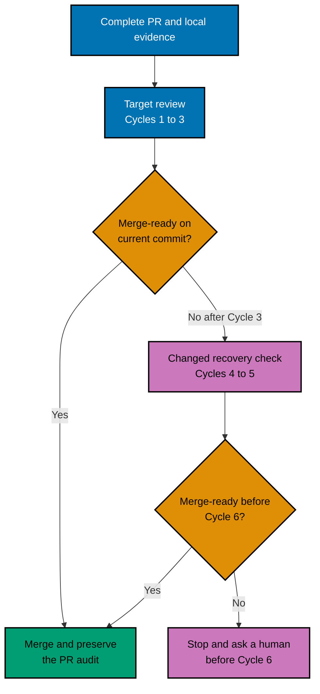
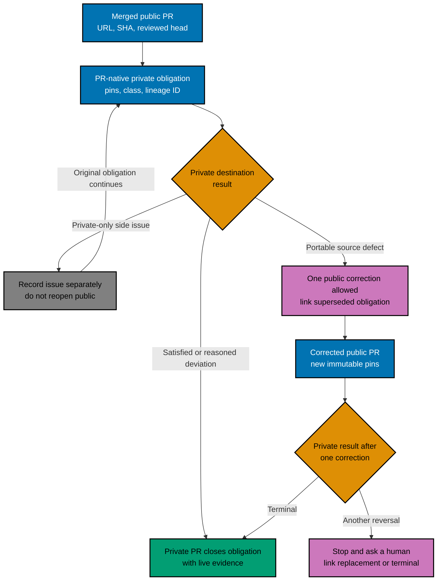
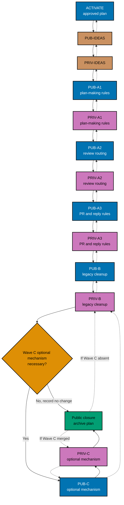

# Technical Design: Optimize the Pull Request Process

## Design Decisions

[Judgment call] GitHub remains the system of record. Repository prose defines the durable contract;
no bot, parser, database, registry, or new CI gate is the default. A mechanism may enter optional
Wave C only after repeated measurable failure, no adequate existing gate, a reversible tested
design, clear ownership, and benefit greater than maintenance cost. Evidence labels follow
[README.md](./README.md#evidence-labels-and-sources).

The plan changes sources before consumers. A public source PR merges before its private adaptation;
hand-authored `.claude/**` content changes before generated bindings; rules change before code; and
each PR starts from then-current `origin/main` in the one owned worktree for that repository.

## Review State Model



Equivalent prose: prepare a complete PR once, aim to converge in Cycles 1–3, and merge as soon as
the exact current commit is green, scope is stable, no blocking thread remains, and the PR audit is
complete. If Cycle 3 misses, Cycles 4–5 name the remaining defect family and use a materially
different focused check. Stop before Cycle 6; no extra clean cycle or earlier human checkpoint is
required.

## Human PR Artifact Contract

The PR body is a short reading aid, not an academic paper. It leads with outcome and motivation,
then gives scope/non-goals, a path-ordered reading guide, verification, review focus, dependencies,
integration safety, stable-main proof, and rollback. Deep evidence is linked. Mermaid is optional
and appears only when it makes a multi-step relationship easier to understand; equivalent prose is
mandatory.

The synthesizer posts one concise consolidated review. Each blocking finding uses the narrowest
relevant line and teaches the claim, severity, evidence, impact, bounded remedy, and safe refutation.
The fixer independently revalidates it and replies in the same native thread with `fix`,
`reject-with-reason`, `defer-with-reason`, or `clarify`. A fixed reply links the pushed commit;
a rejection cites contrary evidence; a deferral links a real follow-up; clarification remains open
until answered. Every AI-authored body, review, reply, and summary ends with `Generated by AI`.

## Root-Relative File-Impact Tree

This tree bounds the known source, mirror, idea, and optional-mechanism surfaces. A directory label
does not authorize every file below it: each delivery unit records its exact before/after file
ledger and stays within the 400-line/20-file ceiling.

```text
ose-public/
├── plans/in-progress/optimize-pr-process/       # control plan; closure moves it to plans/done/
├── plans/ideas/{q1-urgent-important,q2-not-urgent-important}/
│                                                # 9 mapped briefs retired; 10 remain in PUB-IDEAS
├── repo-governance/workflows/{plan,pr,repo}/    # durable workflow sources
├── repo-governance/conventions/structure/plans/ # human PR and delivery rules
├── repo-governance/development/quality/         # review-discipline guidance
├── .claude/agents/{plan,pr-review}/              # hand-authored agent sources
├── .claude/skills/{plan-*,pr-review-*}/          # hand-authored skill sources
├── .agents/skills/{plan-*,pr-review-*}/          # generated skill mirrors
├── .opencode/agents/{plan-*,pr-review-*}.md      # generated agent mirrors
├── .codex/agents/{plan-*,pr-review-*}.toml       # generated agent mirrors
├── AGENTS.md and CLAUDE.md                       # fixed-size instruction cache; only if admitted
└── optional Wave C path                          # none unless the necessity gate passes

ose-private/
├── plans/ideas/q2-not-urgent-important/pr-review-governance-reference-defects.md
│                                                # PRIV-IDEAS retirement source
├── repo-governance/workflows/{plan,pr,repo}/    # semantic adaptation sources
├── repo-governance/conventions/structure/plans/ # repository-local human PR rules
├── .claude/agents/{plan,pr-review}/              # hand-authored agent sources
├── .claude/skills/{plan-*,pr-review-*}/          # hand-authored skill sources
├── .agents/skills/{plan-*,pr-review-*}/          # generated skill mirrors
├── .opencode/agents/{plan-*,pr-review-*}.md      # generated agent mirrors
├── .codex/agents/{plan-*,pr-review-*}.toml       # generated agent mirrors
├── AGENTS.md and CLAUDE.md                       # fixed-size instruction cache; only if admitted
└── optional Wave C path                          # none unless the necessity gate passes
```

### Bounded Delivery Ledger

| Unit                   | Hand-authored source boundary                                                                                     | Generated or retirement boundary                                                                             | Done state                                                                           |
| ---------------------- | ----------------------------------------------------------------------------------------------------------------- | ------------------------------------------------------------------------------------------------------------ | ------------------------------------------------------------------------------------ |
| PUB-IDEAS / PRIV-IDEAS | Only paths pinned in the [idea map](./idea-disposition-map.md) and each repository's `plans/ideas/README.md`      | No bindings                                                                                                  | Mapped briefs absent, indexes reconciled, historical links preserved                 |
| A1 public/private      | `repo-governance/workflows/plan/{plan-planning,plan-quality-gate}/**`, plan agents, and directly used plan skills | Matching `.agents/skills/plan-*/**`, `.opencode/agents/plan-*.md`, and `.codex/agents/plan-*.toml`           | Plan making and its gate use the same human-first, bounded delivery vocabulary       |
| A2 public/private      | `repo-governance/workflows/pr/pr-review-quality-gate/**`, scout/specialist agents, and scout/specialist skills    | Matching PR-review skill mirrors plus `.opencode/agents/pr-review-*.md` and `.codex/agents/pr-review-*.toml` | One authority selects the smallest risk-justified review set and explains every skip |
| A3 public/private      | Human PR-body convention, synthesis/fixer agents, and synthesis/fixer skills                                      | Matching synthesis/fixer skill, OpenCode-agent, and Codex-agent mirrors                                      | PR body, consolidated review, native replies, four dispositions, and AI marker agree |
| B public/private       | Exact legacy-cycle and scope-guard occurrences found after A1–A3 merge                                            | Mirrors only where their hand-authored sources change                                                        | No active seven-cycle/two-clean residue; target 1–3, recovery 4–5, stop before 6     |
| C public/private       | No path by default; a later proposal must name exact files                                                        | Only mirrors generated from an approved source                                                               | Recorded no-change decision, or necessity evidence plus reversible implementation    |
| Closure                | Public plan folder/index and private obligation thread                                                            | No bindings                                                                                                  | Both mains green on recorded pins; final public PR archives the control plan         |

If a row forecasts more than 400 changed hand-authored lines or 20 hand-authored files, split it into
named cohesive sub-units before opening the first PR. The table's owned subtrees are discovery
boundaries, not blanket permission; the PR body publishes the exact file ledger.

### Propagation and Generated-Parity Contract

Every rule wave invokes
[`repo-rules-propagation.md`](../../../repo-governance/workflows/repo/repo-rules-propagation.md)
with `isolation=current` in the already-owned worktree. Its placement manifest records surface,
layer, disposition, and supersessions; its sibling obligation remains a separate output. The
PR-native unit ledger records each normalized rule, authoritative source, consumer, enforcement
disposition, and the two output references.

Hand-authored `.claude/**` sources are edited directly. Run `npm run generate:bindings` once after
source edits; never hand-edit paths that the destination `repo-config.yml` classifies as generated,
including `.agents/skills/**`, `.opencode/agents/**`, and `.codex/agents/**`. Source and vendored
paths remain with their registered owners. Record the source and generated path sets plus tracked
content before staging, run `npm run validate:sync`, then rerun generation and prove both the file
ledger and tracked bytes are unchanged. Generated parity is done only when the checked-in mirrors
match the hand-authored sources in the same commit and the destination repository independently
passes the same checks.

## Cross-Repository Transaction



Equivalent prose: a portable public rule merges first and creates one native private obligation
containing its URL, merge SHA, reviewed commit, checks, rule class, defect-lineage ID, and expected destination. Private
adapts from that immutable source and records satisfaction, a reasoned deviation, or N/A with owner
and remaining action. A private-only issue is recorded separately and the original obligation still
ends as satisfaction, reasoned deviation, or N/A. A genuine portable source defect permits one
public correction and links the superseded record. A late or relabeled occurrence of the same root
cause keeps the lineage ID and correction count; it cannot reset the budget by opening a nominally
new pair. A second reversal stops automation, asks a human, and links the replacement or terminal
decision. Byte-identical surfaces follow their
existing authority rather than a blanket public-first rule.

## Delivery and Rollback DAG



Equivalent prose: after ACTIVATE, retire public then private ideas; deliver A1 plan-making rules, A2
review routing, A3 PR-and-reply rules, and B legacy cleanup, with each public wave before its private
adaptation. Make C an explicit no-change or approved optional-mechanism decision, and archive only
after both repositories are terminal. Rollback starts with the last merged dependent and moves
backward. A unit may revert alone only when nothing merged depends on it. During a paired unwind,
leave a native obligation naming the pins, temporary incoherence, owner, and next action.

The lightest-fit “feature flag” is recorded per unit: dormant plan or idea text, ordered rule
activation, a compatibility bridge, a tested runtime flag, or an atomic change. This plan expects
dormant text and ordered activation; a runtime flag is not justified unless later code introduces
independently observable behavior. Rollback never depends on unpublished local state.

## Validation

The formal plan-quality gate precedes execution but follows complete assembly. Every later delivery
uses exact-path staged gates, file-ledger reconciliation, post-commit pre-push gates, native
review/fix conversations, current-head CI, merge proof, and full landed-diff resync. Formal-gate
validation is read-only; any tracked correction becomes a separately gated `PLAN-AMENDMENT` PR and
cannot ride inside a rule wave.
