# Plan Decision-Integrity Hardening — all three `ose-*` repos

Four new authoring-time rules plus one mechanical `plan-checker` step that together stop a plan from
shipping **pre-loaded with its own successor** — the failure mode that turned one AI Model Benchmark
page into three consecutive plans. Landed in `ose-public` first, then propagated to `ose-primer` and
`ose-private`, and applied retroactively to every plan currently open in all three repos.

## Context

Three archived plans in `plans/done/` built and rebuilt the same page:

| Plan                                                                                                                                            | What it did                                                     |
| ----------------------------------------------------------------------------------------------------------------------------------------------- | --------------------------------------------------------------- |
| [`2026-07-30__ayokoding-www-tools-ai-benchmark`](../../done/2026-07-30__ayokoding-www-tools-ai-benchmark/README.md)                             | Built the page with two stacked charts (funnel Option A)        |
| [`2026-07-30__ayokoding-www-ai-benchmark-merged-chart`](../../done/2026-07-30__ayokoding-www-ai-benchmark-merged-chart/README.md)               | Replaced them with one merged chart — the first plan's Option C |
| [`2026-08-01__ayokoding-www-ai-benchmark-responsive-overhaul`](../../done/2026-08-01__ayokoding-www-ai-benchmark-responsive-overhaul/README.md) | Deleted the second plan's SVG for DOM bars; renamed a class     |

The second and third plans exist to walk back decisions the **first** plan had already recorded as
suspect in its own documents. That is the defect this plan closes. The three contributing causes and
their line-level evidence are in [`brd.md` §Measured evidence](./brd.md#measured-evidence).

This plan is **not** a re-litigation of the benchmark page — that work is finished and deployed. It
is a governance change so the next multi-plan chain does not happen.

## Scope

**In scope**

- **R-A — Primary Job Criterion.** The design funnel's Justify table must mark exactly one criterion
  as the job the page exists to do, and fidelity to the requester's phrasing of a solution stops
  being an admissible criterion. Home:
  `repo-governance/conventions/formatting/diagrams.md` §Design Funnel (R6).
- **R-B — Elimination-Grade Evidence.** An option may not be dropped on a responsive, legibility, or
  density claim that was never rendered at the width the claim names. Home: same file,
  §Responsive Design and §Design Funnel.
- **R-C — Prior-Decision Reversal Record.** A plan whose selection resurrects a predecessor's
  rejected option, or reverses a predecessor's recorded design decision, must say so in
  `tech-docs.md` and dispose of the original reason. Home:
  `repo-governance/conventions/structure/plans.md`.
- **R-D — Enumerated-Vocabulary Consistency.** A closed set of user-visible identifiers reaching more
  than one binding surface must state its naming rule and prove every member satisfies it. Home:
  `repo-governance/development/quality/user-facing-delivery-hardening.md`, new Rule 17.
- **R-E — Successor-Plan Debt Scan.** A new `plan-checker` Step 5o that mechanically detects
  violations of R-A through R-D, with matching `plan-maker` emission and `plan-fixer` scaffolding,
  and the `plan-creating-project-plans` skill updated to match.
- **R-F — Parity backfill.** The five Knowledge Capture routings from the responsive-overhaul plan
  landed in `ose-public` only; both sibling repos are at zero. This plan ports them.
- **R-G — Post-mortem.** A blameless post-mortem at
  `docs/explanation/post-mortems/2026-08-01-ai-benchmark-three-plan-split.md`, sibling to the
  existing [`2026-06-19-ui-design-parity-shipped-past-green-gates.md`](../../../docs/explanation/post-mortems/2026-06-19-ui-design-parity-shipped-past-green-gates.md).
- **R-H — Retroactive application.** Every plan currently in `plans/in-progress/` and
  `plans/backlog/` across all three repos is audited against R-A through R-D and **fixed**, not
  merely reported.

**Out of scope**

- Any change to the AI Model Benchmark page itself. It is shipped, deployed, and archived.
- Binding R-A and R-B to non-UI option tables (architecture-choice or tooling-choice tables in
  `tech-docs.md`). The three-plan evidence covers the UI design funnel only, so the rules bind where
  the evidence is; see [`tech-docs.md` §DD-3](./tech-docs.md#dd-3--why-r-a-and-r-b-bind-ui-bearing-plans-only).
- Any deterministic validator in `apps/rhino-cli` or a CI markdown gate. Enforcement is the
  `plan-checker` step; see [`tech-docs.md` §DD-4](./tech-docs.md#dd-4--why-enforcement-stops-at-plan-checker).
- Re-opening or amending any plan already in `plans/done/`. The archive is immutable.
- Any change to how the funnel's **artefacts** are produced (both-tiers rule, Excalidraw tooling,
  asset placement). This plan changes only how options are **scored and eliminated**.

## Approach summary

```mermaid
%% Root cause → rule → enforcer. Each cause traces to exactly one new rule and one checker clause.
flowchart TB
  C1["C1 requester phrasing<br/>scored as a criterion"] --> RA["R-A Primary<br/>Job Criterion"]
  C2["C2 option dropped on an<br/>unrendered responsive claim"] --> RB["R-B Elimination-<br/>Grade Evidence"]
  C3["C3 taxonomy set mixed<br/>proper nouns + adjective"] --> RD["R-D Enumerated-Vocabulary<br/>Consistency"]
  RA --> RC["R-C Prior-Decision<br/>Reversal Record"]
  RB --> RC

  RA --> E["R-E plan-checker<br/>Step 5o"]
  RB --> E
  RC --> E
  RD --> E

  E --> P1["ose-public"]
  P1 --> P2["ose-primer"]
  P1 --> P3["ose-private"]

  style RA fill:#0072B2,color:#FFFFFF
  style RB fill:#009E73,color:#FFFFFF
  style RC fill:#D55E00,color:#FFFFFF
  style RD fill:#CC79A7,color:#000000
  style E fill:#E69F00,color:#000000
```

R-C sits downstream of R-A and R-B because a reversal record is the _symptom_ the other two rules
prevent: a plan that must reverse a predecessor is, in the common case, reversing a decision the
predecessor made without a job criterion or without evidence. R-C makes that visible even when R-A
and R-B were satisfied and the reversal is legitimate.

## Documents

| Document                         | Contains                                                                                    |
| -------------------------------- | ------------------------------------------------------------------------------------------- |
| [`brd.md`](./brd.md)             | Why this exists, the line-level evidence from the three plans, affected roles, risks        |
| [`prd.md`](./prd.md)             | Personas, user stories, Gherkin acceptance criteria, product scope, funnel-exemption record |
| [`tech-docs.md`](./tech-docs.md) | Verbatim rule texts, the deviation matrix, Step 5o specification, file impact, rollback     |
| [`delivery.md`](./delivery.md)   | Phased, gated delivery checklist with the parallelization model and delivery boundaries     |
| [`learnings.md`](./learnings.md) | Knowledge Capture running log, triaged before archival                                      |

## Delivery at a glance

- **Delivery Mode**: `worktree-to-pr` — see [`delivery.md`](./delivery.md#delivery-mode-worktree-to-pr).
- **Worktree**: `worktrees/plan-decision-integrity-hardening/` in each repo — see
  [`delivery.md` §Worktree](./delivery.md#worktree).
- **Phases**: ten (0-9). Phase 0 sets up and opens no PR; Phases 6 and 7 are the two sibling-repo
  propagation nodes and run in parallel.
- **Delivery units**: six — see
  [`delivery.md` §Delivery Boundaries](./delivery.md#delivery-boundaries).
- **Target surfaces**: `repo-governance/`, `.claude/agents/`, `.claude/skills/`, `docs/explanation/`,
  and the open plan folders — in `ose-public`, `ose-primer`, and `ose-private`. No `apps/` or
  `libs/` source changes.

## Sibling repos

This plan is authored once in `ose-public` (the governance source of truth) and propagated by its own
Phases 6 and 7. No sibling plan folder is created; the propagation phases carry the identical diff
plus each repo's binding re-sync. The rationale for a single plan rather than three is recorded in
[`tech-docs.md` §Deviation matrix row 1](./tech-docs.md#deviation-matrix).

## Related

- [UI Mockups in Plan Docs](../../../repo-governance/conventions/formatting/diagrams.md#ui-mockups-in-plan-docs) —
  the convention R-A and R-B amend.
- [User-Facing Delivery Hardening](../../../repo-governance/development/quality/user-facing-delivery-hardening.md) —
  gains Rule 17 (R-D).
- [Knowledge Capture Convention](../../../repo-governance/development/quality/knowledge-capture.md) —
  the routing matrix whose `ose-public`-only application R-F repairs.
- [Post-Mortems Convention](../../../repo-governance/conventions/structure/post-mortems.md) —
  governs the R-G document.
