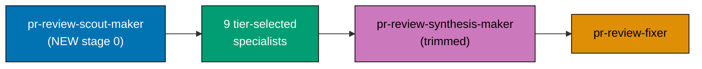

# Plan: Scout-First Tiering, Cycle-Number Visibility, and a Type-Soundness Discipline for the PR Review Cycle

## Context

The [PR Review Quality Gate workflow](../../../repo-governance/workflows/pr/pr-review-quality-gate.md)
and the [PR Reviewer-Discipline Convention](../../../repo-governance/development/quality/pr-review-disciplines.md)
already run a nine-agent pipeline (eight sonnet-tier discipline specialists plus the opus-tier
`pr-review-synthesis-maker` coordinator) across a fixed 3-cycle loop, feeding the unchanged
`pr-review-fixer`. The maintainer identified three concrete gaps in that live pipeline:

1. **No cycle number in the posted review.** The Consolidated Review Header already records risk
   tier, specialist set, diff coverage, and human-dismissal count — but not which of the 3 cycles
   produced it. A reviewer scanning a PR's review history cannot tell cycle 1's findings from cycle
   3's without cross-referencing timestamps, which blocks tracking whether later cycles find fewer
   issues (the "healthy trend" the workflow's own Success Metrics section already wants to observe).
2. **Risk-tier classification is a buried sub-duty, not a first-class step.** `pr-review-synthesis-maker`
   already classifies each PR into `trivial`/`lite`/`full` and selects the specialist set (D12) —
   but it does this as one of several pre-fan-out duties squeezed into the same opus-tier agent that
   then ALSO does the highest-risk post-fan-out job (owning the architecture-vs-correctness
   re-categorization boundary). Nothing separates "decide what this PR needs" from "consolidate what
   the specialists found."
3. **No discipline owns type-system soundness.** The eight-discipline table
   ([pr-review-disciplines.md §The Eight Reviewer Disciplines](../../../repo-governance/development/quality/pr-review-disciplines.md#the-eight-reviewer-disciplines))
   covers architecture, correctness, governance, security, CI-gaming, performance, docs, and
   instruction-decay — none of which owns whether a change's **types** are sound. A compiler already
   blocks a change that does not type-check; nothing in the pipeline flags a change that type-checks
   but is unsound (an unjustified `any`, a non-exhaustive match, a panic-prone `unwrap()` on a
   fallible path) across this repo's four production languages (TypeScript, Rust, F#, C#).

> Requested 2026-08-05. Grilled via `AskUserQuestion` before authoring — see
> [Resolved Design Decisions](#resolved-design-decisions-from-grilling) below.

## Scope

**In scope**:

- Add a `**Cycle**: N of {total}` field to the Consolidated Review Header
  ([pr-review-synthesis-maker.md](../../../.claude/agents/pr-review-synthesis-maker.md)'s header
  block and [pr-review-quality-gate.md](../../../repo-governance/workflows/pr/pr-review-quality-gate.md)'s
  documentation of it).
- A new `pr-review-scout-maker` agent that becomes pipeline stage 0 each cycle: it owns risk-tier
  classification (D12), specialist-set selection, shared-context-brief assembly (D13), and the
  prior-cycle human-dismissal read — duties `pr-review-synthesis-maker` currently performs itself.
  `pr-review-synthesis-maker` is trimmed to its post-fan-out job only: dedup, re-categorize,
  reasonableness-filter, tool-verify, post.
- A new ninth discipline, **type-soundness**, owned by a new `pr-review-types-maker` specialist,
  scoped across TypeScript, Rust, F#, and C# — the repo's four production languages.
- Every doc/agent file this ripples into: `pr-review-disciplines.md`, `pr-review-quality-gate.md`,
  `pr-review-synthesis-maker.md`, the two new agent files, `.claude/agents/README.md`, `AGENTS.md`'s
  one-line PR Review Cycle summary, and the `.opencode/`/`.cursor/`/`.amazonq/` mirrors regenerated
  from them.
- Dogfooding: this plan's own delivering PR runs the **new** pipeline shape against itself (see
  [Worktree and Delivery Mode](#worktree-and-delivery-mode) below).

**Out of scope (for now)**:

- A persistent, queryable metrics log across cycles/PRs (e.g. a `generated-reports/` running file).
  The maintainer chose header-fields-only for this plan — see
  [Resolved Design Decisions](#resolved-design-decisions-from-grilling). Deferred to a future idea if
  the header proves insufficient for tracking efficiency trends over time.
- Provisioning a dedicated bot/GitHub App identity to unblock `REQUEST_CHANGES` — tracked separately
  by [`plans/ideas/pr-review-bot-identity.md`](../../ideas/pr-review-bot-identity.md), unaffected by
  this plan.
- A merge queue for precondition (c) — tracked separately by
  [`plans/ideas/merge-queue-adoption.md`](../../ideas/merge-queue-adoption.md), unaffected by this
  plan.
- Promoting the type-soundness discipline into the four-specialist `lite` tier. It launches
  `full`-tier-only, per the same "new disciplines start conservative, earn their tier via
  post-cutover acceptance-rate data" posture the convention already applies to `performance` and
  `docs` (its own two most-recently-added disciplines). Revisit once
  [Post-Cutover Monitoring](../../../repo-governance/development/quality/pr-review-disciplines.md#post-cutover-monitoring-plan)
  has data on it.
- Propagating any of this to `ose-primer` / `ose-private` / `beaver-nest`. The PR Review Cycle is not
  part of the tri-repo `apps/rhino-cli` byte-identity boundary or the `ose-public` ↔ `ose-primer`
  content-parity boundary — it is `ose-public`-only governance infrastructure. The user explicitly
  scoped this request to `ose-public` ("focus back to ose-public").

## Approach Summary

Three independent-but-related enhancements, landed together because they touch the same small set of
files and the same nine-(soon-eleven)-agent pipeline:

Full design rationale, the updated Loop Algorithm, and both new agents' complete charters live in
[tech-docs.md](./tech-docs.md).

## Resolved Design Decisions (from grilling)

Four decisions were grilled with the maintainer via `AskUserQuestion` before any file was touched;
all four selected the recommended option:

1. **Execution Delivery Mode**: `worktree-to-pr` (the repo default) — this plan's own PR runs the PR
   Review Quality Gate workflow against itself, dogfooding the new scout+types pipeline shape before
   it becomes the standing shape for every future `*-to-pr` PR in this repo.
2. **Scout placement**: `pr-review-scout-maker` **replaces** `pr-review-synthesis-maker`'s D12/D13
   pre-fan-out duties outright (not an advisory-only first opinion `pr-review-synthesis-maker` can
   override) — a clean stage split, not a second opinion layered on the same duties.
3. **Type-soundness scope**: cross-language from day one — TypeScript, Rust, F#, and C# — mirroring
   how `governance`/`security`/`logic` are already cross-language generalists rather than
   per-language specialists.
4. **Metrics tracking**: header-fields-only for now (`**Cycle**: N of {total}` plus the tier/rationale
   fields scout already produces) — no new persistent log artifact. The existing
   [Post-Cutover Monitoring Plan](../../../repo-governance/development/quality/pr-review-disciplines.md#post-cutover-monitoring-plan)
   stays the periodic, manually-run measurement process it already is.

One additional decision was **not** grilled (judged low-stakes enough to decide directly, recorded
here for auditability rather than re-litigated):

- **`pr-review-scout-maker`'s model tier is `opus`, matching `pr-review-synthesis-maker`, not
  `sonnet`.** `pr-review-synthesis-maker.md`'s own existing justification for its opus tier names
  the D12/D13 pre-fan-out duties explicitly as one of the reasons opus is required ("errors here are
  not correctable downstream the way a single specialist's miss is... nobody catches a bad risk-tier
  or context-assembly call except this agent"). Moving those duties to a new agent does not change
  their risk profile — the same justification now applies to `pr-review-scout-maker` directly. See
  [tech-docs.md Design Decision DD-1](./tech-docs.md#design-decisions) for the full cost/rationale
  tradeoff this introduces (a second opus-tier call per cycle instead of one).

## Worktree and Delivery Mode

**Delivery Mode**: `worktree-to-pr` (see
[Plans Organization Convention §Delivery Mode](../../../repo-governance/conventions/structure/plans.md#delivery-mode)).
Execution happens in a dedicated worktree (`worktrees/pr-review-cycle-scout-and-typesafety/`), opens
a PR against `ose-public`'s `main`, and runs the (pre-this-plan, unmodified) PR Review Quality Gate
workflow for 3 cycles before an `[AI]` merge under the five hardened preconditions.

**This plan-authoring itself** (the five documents in this folder) is written directly on local `main`
in the primary checkout, per the established plan-docs-on-main practice — only the plan's own
_execution_ phases (Phase 1 onward, see [delivery.md](./delivery.md)) happen in the worktree.

## Related Documentation

- [brd.md](./brd.md) — business rationale, current-state baseline, success metrics
- [prd.md](./prd.md) — product scope, personas, Gherkin acceptance criteria
- [tech-docs.md](./tech-docs.md) — architecture, design decisions, full new-agent charters
- [delivery.md](./delivery.md) — phased execution checklist
- [PR Review Quality Gate workflow](../../../repo-governance/workflows/pr/pr-review-quality-gate.md)
- [PR Reviewer-Discipline Convention](../../../repo-governance/development/quality/pr-review-disciplines.md)
- [pr-review-synthesis-maker.md](../../../.claude/agents/pr-review-synthesis-maker.md)
