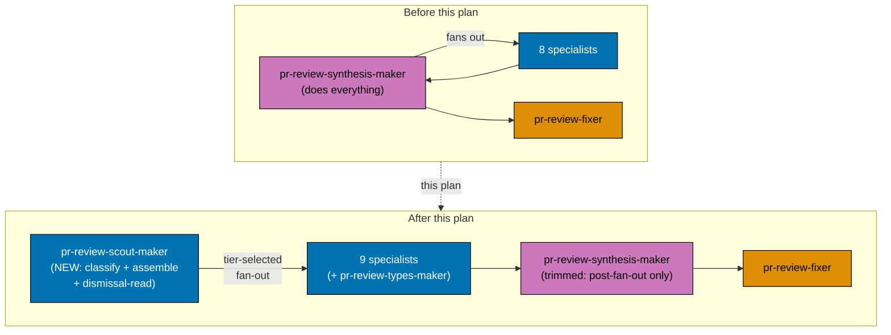
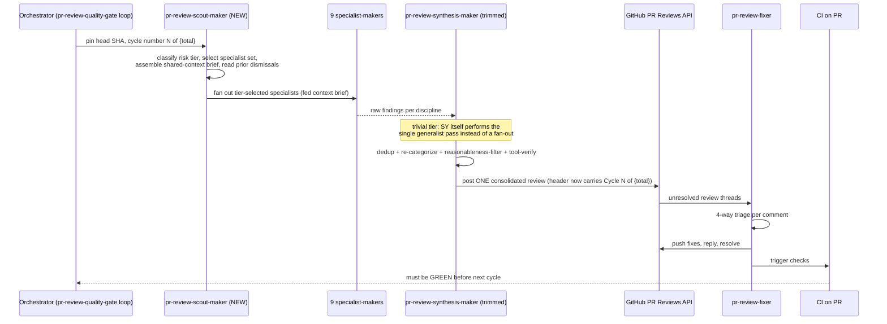
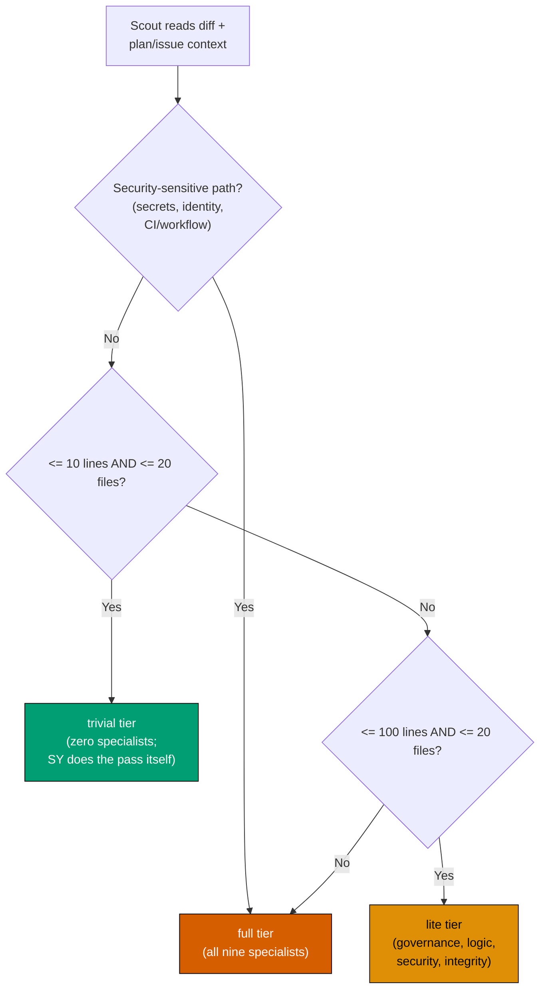

# Technical Documentation: PR Review Cycle Scout + Cycle-Number + Type-Soundness

## Architecture Overview

The PR Review Quality Gate pipeline moves from a 10-agent shape (8 discipline specialists +
`pr-review-synthesis-maker` + `pr-review-fixer`) to a 12-agent shape (9 discipline specialists +
`pr-review-scout-maker` + `pr-review-synthesis-maker` + `pr-review-fixer`). The orchestrator (the
workflow's own Step 1/2/3 loop, called from `plan-execution.md` Step 8 or invoked directly against a
PR) gains one call per cycle — to scout — inserted before the specialist fan-out; every other
orchestration boundary (fan-out is concurrent, cross-cycle is sequential, CI-green is a hard gate)
stays exactly as documented today.

### Diagram 1 — Component Interactions (Before → After)



### Diagram 2 — Updated Per-Cycle Sequence



### Diagram 3 — Scout's Tier-Classification Decision (unchanged thresholds, new owner)



Thresholds and tier semantics are **unchanged** from the pre-plan D12 — only the owning agent moves.
`pr-review-types-maker` is **not** added to the `lite` set (see [DD-3](#design-decisions)).

## Design Decisions

- **DD-1: `pr-review-scout-maker` runs at `model: opus`, not `sonnet`.**
  `pr-review-synthesis-maker.md`'s pre-existing Model Selection Justification names "owning
  pre-fan-out judgment calls no specialist makes" as one of its explicit reasons for its own opus
  tier: _"errors here are not correctable downstream the way a single specialist's miss is... nobody
  catches a bad risk-tier or context-assembly call except this agent."_ Relocating those exact
  duties to a new agent does not shrink their blast radius — a scout misclassification (e.g. calling
  a security-sensitive PR `lite` and never fanning out `pr-review-security-maker` at all) is just as
  uncorrectable downstream as it was when synthesis-maker made the same call. Tradeoff accepted
  explicitly: **this doubles the opus-tier call count per cycle** (scout + synthesis-maker, both
  opus, versus one opus call before). The nine sonnet-tier specialists are unaffected. This is
  recorded here, not silently absorbed, so the
  [Cost and Latency Budgeting](../../../repo-governance/development/quality/pr-review-disciplines.md#cost-and-latency-budgeting)
  future-work section has the real shape to react to next time it is revisited.
- **DD-2: New grey-zone ruling (g) — "Compiles vs. is sound."** Added to
  `pr-review-disciplines.md`'s Six Grey-Zone Rulings (becoming seven), it reads: a change that fails
  to build/type-check is not any specialist's finding at all — CI's build step already gates it red,
  and reporting a compile failure as a PR-review finding would be redundant with a signal the
  reviewer already has independently. A change that **compiles but is unsoundly typed** (a broad
  `any`, a non-exhaustive match defaulting silently, an unjustified `unsafe` block, a
  null-forgiving-operator override on a path that can actually be null) is `pr-review-types-maker`'s
  finding. This is a three-way split (not-a-finding vs. types vs. architecture-for-new-boundaries),
  distinguishing it from the other six rulings, which all route between exactly two disciplines.
- **DD-3: Type-soundness launches `full`-tier-only, not in the `lite` four-set.** The `lite` set
  (governance, logic, security, integrity) was chosen at the original eight-discipline cutover as
  "the four highest-yield lenses for this repo" — a judgment call made without live data for a
  discipline that did not yet exist. Following the same posture the convention already applies to
  its two most-recently-added disciplines (performance, docs — both `full`-tier-only, watched via
  per-discipline acceptance-rate monitoring before any tier promotion is considered), type-soundness
  starts `full`-tier-only. Promotion to `lite` is a future decision gated on real acceptance-rate
  data, not this plan's call to make.
- **DD-4: Header field format is `**Cycle**: N of {total}`**, inserted as the first line of the
  Consolidated Review Header (before `**Risk tier**`), because cycle number is the coarsest-grained,
  most-orienting fact a reader needs before the tier/specialist/coverage detail underneath it.
- **DD-5: Scout's tool list is `Read, Bash, Grep, Glob`** — no `Write`/`Edit` (scout never modifies
  files, mirroring synthesis-maker's own no-Write/Edit posture), and no `WebFetch`/`WebSearch` (D12
  classification and D13 context assembly are purely internal to the PR's own diff/metadata/plan
  files; external fact-verification is synthesis-maker's tool-verify job, not scout's).
- **DD-6: The `AGENTS.md` edit is the single word `eight` → `nine` in the existing PR Review Cycle
  bullet, net `-1` byte, with `pr-review-scout-maker` and `pr-review-types-maker` deliberately NOT
  named there.** `AGENTS.md` sits at 28,714 B against a 27,000 B warn / 30,000 B hard-fail budget
  (see [brd.md's baseline](./brd.md#current-state-baseline-mechanically-verified-2026-08-05)) — any
  net-positive edit risks tripping the warn threshold further, and the file's own existing
  `agents-md-progressive-disclosure` idea already names this exact tightness as a live problem this
  plan should not make worse. The catalog (`.claude/agents/README.md`) and the convention
  (`pr-review-disciplines.md`) remain the authoritative, budget-unconstrained sources for the two new
  agents' names and charters.
- **DD-7: Trivial-tier handoff — scout classifies and assembles context; `pr-review-synthesis-maker`
  still performs the actual single generalist review pass itself when the tier is `trivial`.** Scout
  never reviews code — its charter is purely classification, selection, and context assembly.
  Keeping the "who actually looks at trivial-tier diffs" duty with synthesis-maker (which already had
  it pre-plan) avoids handing scout a second, unrelated responsibility (reviewing) on top of its
  first (classifying), which would blur exactly the separation this plan exists to introduce.
- **DD-8: `pr-review-types-maker`'s `SUPPRESS` block** explicitly excludes: (1) any compile/build
  failure (per DD-2, not a finding at all — CI already reds it); (2) a style nit a project's own
  linter already enforces (e.g. a configured `no-explicit-any` ESLint rule already catching the same
  case mechanically); (3) speculative "consider a stricter type here" when the specialist has not
  fully traced the control-flow narrowing that already makes the looser type sound at that point;
  (4) type laxity inside test-only fixture/mock files where the project's own testing convention
  already accepts it. This mirrors the SUPPRESS-block shape every other specialist already carries.
- **DD-9: Naming.** `pr-review-scout-maker` (scope `pr`, qualifier `review-scout`, role `maker`) and
  `pr-review-types-maker` (scope `pr`, qualifier `review-types`, role `maker`) both conform to the
  [Agent Naming Convention](../../../repo-governance/conventions/structure/agent-naming.md)'s
  `<scope>(-<qualifier>)*-<role>` structure, matching the existing `pr-review-<discipline>-maker`
  family shape exactly. "Scout" is chosen over "triage" because it is the maintainer's own word for
  the role (see the original request) and reads unambiguously as "goes first, reports back" rather
  than "triage" (which could be misread as bug-severity triage, a different concept already covered
  by the Criticality Levels Convention).

## File-Impact Analysis

| File                                                           | Change                                                                                                                                                                                                                             |
| -------------------------------------------------------------- | ---------------------------------------------------------------------------------------------------------------------------------------------------------------------------------------------------------------------------------- |
| `repo-governance/development/quality/pr-review-disciplines.md` | Add 9th discipline row (type-soundness), 7th grey-zone ruling (DD-2), sweep applicable "eight" occurrences to "nine" (26 occurrences individually judged, not blind sed), update D12/D13 attribution from synthesis-maker to scout |
| `repo-governance/workflows/pr/pr-review-quality-gate.md`       | Update Participants list (add scout), both mermaid diagrams (flowchart + sequenceDiagram), Loop Algorithm pseudocode, add Cycle-number header field documentation, sweep applicable "eight" occurrences (6) to "nine"              |
| `.claude/agents/pr-review-synthesis-maker.md`                  | Remove `## Pre-Fan-Out Duties (D12 / D13)` section (moved to scout), add `**Cycle**: N of {total}` to Consolidated Review Header template, update "ninth pipeline agent" self-description to reflect new agent count               |
| `.claude/agents/pr-review-scout-maker.md`                      | **NEW** — full charter per [Detailed Design](#detailed-design-of-pr-review-scout-makermd) below                                                                                                                                    |
| `.claude/agents/pr-review-types-maker.md`                      | **NEW** — full charter per [Detailed Design](#detailed-design-of-pr-review-types-makermd) below                                                                                                                                    |
| `.claude/agents/README.md`                                     | Add catalog entries for both new agents in the PR Review Cycle family list                                                                                                                                                         |
| `AGENTS.md`                                                    | Single-word edit `eight` → `nine` in the PR Review Cycle bullet (DD-6) — no new agent names added                                                                                                                                  |
| `.opencode/agents/pr-review-scout-maker.md`                    | **Generated** by `npm run generate:bindings` — never hand-authored                                                                                                                                                                 |
| `.opencode/agents/pr-review-types-maker.md`                    | **Generated** by `npm run generate:bindings` — never hand-authored                                                                                                                                                                 |
| `.opencode/agents/pr-review-synthesis-maker.md`                | **Regenerated** to match the trimmed `.claude/` source                                                                                                                                                                             |
| `.cursor/agents/*` / `.amazonq/**`                             | **Regenerated** mirrors of the same three files, per the multi-harness sync pipeline                                                                                                                                               |

## Dependencies

- No new runtime dependencies (`package.json`, `Cargo.toml`, etc.) — this plan edits Markdown
  governance docs and agent-definition Markdown files only.
- Depends on `npm run generate:bindings` / `npm run validate:sync` (existing tooling, unchanged) to
  keep `.opencode/`/`.cursor/`/`.amazonq/` mirrors in sync with the two new `.claude/agents/` files
  and the trimmed `pr-review-synthesis-maker.md`.
- Depends on the (pre-existing, unmodified-by-this-plan) `pr-review-quality-gate` workflow actually
  running against this plan's own delivering PR — the dogfood verification in Phase 5 of
  [delivery.md](./delivery.md) is the functional test for the new agent shape, since there is no
  automated unit-test harness for agent-prompt behavior in this repo.

## Testing / Verification Strategy

Agent-definition and governance-doc changes are **not** `apps/`/`libs/` application code, so the
[Specs & Gherkin Completeness Convention](../../../repo-governance/development/quality/feature-change-completeness.md)'s
`specs/` companion-artifact requirement does not apply (docs-only / prompt-only changes are exempt,
consistent with how the original eight-discipline split and every subsequent `pr-review-*-maker.md`
addition were delivered). Verification instead relies on:

1. **Mechanical grep-based acceptance criteria** — every `prd.md` Gherkin scenario above pairs a
   positive check (the new text/field/file exists) with a negative control (the old absence is
   confirmed first, so the positive check is falsifiable in both directions, per this repo's
   acceptance-clause discipline).
2. **`repo-rules-checker`** — already audits every `pr-review-*-maker.md` agent definition against
   the discipline table's owned/routed-to scope and flags a specialist charter missing its
   `SUPPRESS` block (per `pr-review-disciplines.md`'s own Enforcement section); Phase 3's delivery
   item runs it explicitly against both new agent files before they are considered complete.
3. **Live dogfooding** — this plan's own `worktree-to-pr` delivery mode means the very first PR to
   exercise the new scout-first, nine-specialist, cycle-numbered pipeline is this plan's own
   delivering PR (Phase 5). A design defect in the new shape (e.g. scout mis-selecting specialists,
   or the header field rendering wrong) surfaces immediately against a real PR rather than waiting
   for the next unrelated PR to discover it.
4. **`npm run validate:sync`** — confirms the generated mirrors match their `.claude/` source
   byte-for-byte, the same gate every other `.claude/agents/` change already passes through.

## Detailed Design of `pr-review-scout-maker.md`

Frontmatter:

```yaml
---
name: pr-review-scout-maker
description: Planning-grade PR-review pipeline stage 0 — the tenth pr-review-*-maker agent, running before every cycle's specialist fan-out. Owns risk-tier classification (trivial/lite/full) and specialist-set selection, assembles the shared PR/plan/full-diff context brief once per cycle, and reads prior-cycle thread-resolution status (including human dismissals) so no specialist re-litigates a settled thread. Never discovers or posts findings itself — its sole output is the cycle's tier decision, specialist set, and shared-context brief handed to the fan-out and to pr-review-synthesis-maker.
tools: Read, Bash, Grep, Glob
model: opus
color: blue
skills: []
---
```

Section shape (mirrors `pr-review-synthesis-maker.md`'s own structure for its now-removed D12/D13
sections, adapted into a standalone charter):

- `# PR Review Scout Maker Agent`
- `## Agent Metadata` — Role: Maker (blue); Model Selection Justification citing DD-1 verbatim
  (opus tier, uncorrectable-downstream-error rationale, explicit cost tradeoff acknowledged)
- `## Core Responsibility` — pin head SHA (`gh pr view <PR> --json headRefOid`), read the full diff,
  read the PR's originating plan/issue context — same ordering `pr-review-synthesis-maker` already
  uses for its own Core Responsibility, since scout now runs this step first in the pipeline
- `## Risk-Tier Classification + Specialist-Set Selection (D12)` — moved verbatim in substance from
  `pr-review-synthesis-maker.md`'s current section of the same name, re-attributed to this agent; the
  thresholds and the security-sensitive-path override are unchanged (see [Diagram 3](#diagram-3--scouts-tier-classification-decision-unchanged-thresholds-new-owner))
- `## Shared-Context Assembly, Once (D13)` — moved verbatim in substance, including the D13
  no-generated-file-exclusion posture and the coordinator-discretion large-diff-slicing note (now
  scout's discretion, recorded for `pr-review-synthesis-maker` to read from the brief)
- `## Prior-Cycle Thread-Resolution Read (Human-Dismissal Read)` — moved verbatim in substance
- `## Trivial-Tier Handoff (DD-7)` — new section stating explicitly that scout does NOT perform the
  trivial-tier generalist review pass itself; it hands the assembled context brief to
  `pr-review-synthesis-maker`, which performs that pass, exactly as pre-plan
- `## Output Contract` — new section stating scout's output is exactly three things per cycle: the
  risk tier, the selected specialist set (or the empty set for trivial), and the shared-context brief
  (including the dismissal-read state) — handed to both the fan-out and to
  `pr-review-synthesis-maker`; scout never originates a review finding and never calls the GitHub
  Reviews API
- `## When to Use This Agent` — mirrors the existing family's Use/Do-NOT-Use structure
- `## Tools Usage` — justifies the DD-5 tool list
- `## Reference Documentation` — links to `pr-review-disciplines.md`, `pr-review-quality-gate.md`,
  `pr-review-synthesis-maker.md`, this plan's `README.md`

## Detailed Design of `pr-review-types-maker.md`

Frontmatter:

```yaml
---
name: pr-review-types-maker
description: Execution-grade PR reviewer scoped to the type-soundness discipline only — type-system soundness beyond what the compiler already enforces, across TypeScript, Rust, F#, and C#. Flags unsound type escapes (unjustified any/unknown, unexplained unsafe blocks, panic-prone unwrap/expect on fallible paths, null-forgiving-operator misuse, non-exhaustive match/switch), never a compile/build failure (already CI-gated) and never whether a well-typed function's behavior is correct (pr-review-logic-maker's charter). One of nine discipline-scoped specialists feeding the pr-review-synthesis-maker coordinator; inherits pr-review-maker's hard rules verbatim, scoped to its own charter and SUPPRESS block.
tools: Read, Bash, Grep, Glob, WebFetch, WebSearch
model: sonnet
color: blue
skills: []
---
```

Section shape (mirrors the eight existing discipline specialists' common shape, e.g.
`pr-review-architecture-maker.md`, adapted to this discipline's charter):

- `# PR Review Types Maker Agent`
- `## Agent Metadata` — Role: Maker (blue); Model Selection Justification: `sonnet`, matching the
  other eight discipline specialists per the D5 decision (specialists stay standard-tier; opus is
  reserved for the coordinator-tier agents per DD-1)
- `## Core Responsibility` — same pin-SHA / read-diff / read-plan-context ordering every specialist
  already follows
- `## Charter: Owns Type-Soundness, Cross-Language` — the owned-scope table row from
  `pr-review-disciplines.md`'s updated Eight[now Nine] Reviewer Disciplines table, expanded per
  language:
  - **TypeScript**: unjustified `any`/`unknown` without narrowing, type assertions (`as`) bypassing a
    real type mismatch, overly-broad union widening
  - **Rust**: `unsafe` blocks with no comment justifying the invariant upheld, `unwrap()`/`expect()`
    on a fallible `Result`/`Option` in a production (non-test) path where a documented error type
    already exists, unsound generic variance
  - **F#**: non-exhaustive `match` expressions relying on a silent default/exception instead of a
    full discriminated-union match, `Option`/`null` interop misuse at F#/.NET boundaries
  - **C#**: nullable-reference-annotation violations, null-forgiving-operator (`!`) overuse on a path
    that can genuinely be null, stringly-typed APIs where a documented enum/record type already
    exists
- `## NOT Its Job (Routes Elsewhere)` — per DD-2 and the discipline table's routing column: a
  compile/build failure is not a finding at all (CI already gates it); whether a new
  type/module boundary should exist → `pr-review-architecture-maker`; whether a well-typed
  function's behavior is correct → `pr-review-logic-maker`
- `## SUPPRESS Block` — the four items from [DD-8](#design-decisions), written in the same
  imperative "must not raise" style every existing specialist's own SUPPRESS block already uses
- `## Finding Requirements (Hard Rules)` — inherited verbatim from the retired monolith, identical to
  every other specialist: numeric confidence 0-100 with a hard drop below 80, CRITICAL/HIGH/MEDIUM/LOW
  severity, concrete `file:line` evidence, anti-sycophantic framing
- `## Scope Guard` / `## Untrusted-Input Handling` — inherited verbatim, identical boilerplate every
  specialist already carries
- `## When to Use This Agent` / `## Tools Usage` / `## Reference Documentation` — mirrors the family
  shape; `WebFetch`/`WebSearch` justified for spot-checking a language's current type-system
  semantics (e.g. confirming current TypeScript `strict` flag behavior) when the specialist is
  uncertain, mirroring how the other specialists justify the same two tools

## Rollback

No destructive step is required to roll back: this plan only adds two new agent files, edits three
existing files, and regenerates mirrors. A rollback is a forward `git revert` of the delivering PR's
merge commit (never a history rewrite), which:

1. Deletes `pr-review-scout-maker.md` and `pr-review-types-maker.md` (and their mirrors).
2. Restores `pr-review-synthesis-maker.md`'s D12/D13 sections and the un-cycle-numbered header.
3. Restores `pr-review-disciplines.md` and `pr-review-quality-gate.md` to their eight-discipline
   text.
4. Restores `AGENTS.md`'s `eight` wording.

Run `npm run generate:bindings && npm run validate:sync` after the revert, identical to the forward
delivery's own Phase 4 step, to resynchronize the mirrors.

## Related Documentation

- [README.md](./README.md), [brd.md](./brd.md), [prd.md](./prd.md), [delivery.md](./delivery.md)
- [PR Reviewer-Discipline Convention](../../../repo-governance/development/quality/pr-review-disciplines.md)
- [PR Review Quality Gate workflow](../../../repo-governance/workflows/pr/pr-review-quality-gate.md)
- [Agent Naming Convention](../../../repo-governance/conventions/structure/agent-naming.md)
- [Model Selection](../../../repo-governance/development/agents/model-selection.md)
