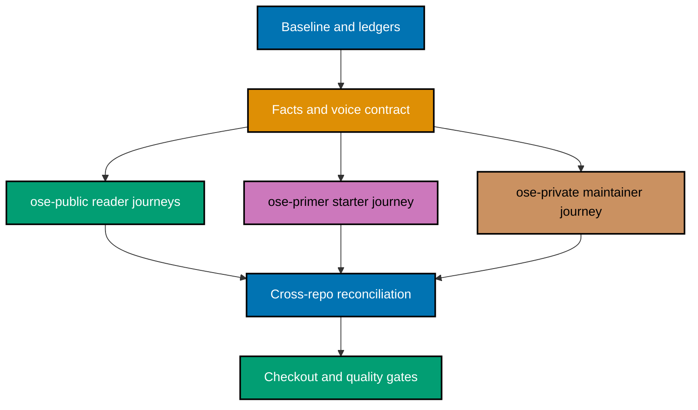

# 🌱 Two-Repository README and Onboarding Refresh

> **Scope Amendment (2026-08-16)** — `ose-primer` left this repository's parity set and carries no
> sync obligation; see
> [Related Repositories §Repositories outside the parity set](../../../docs/reference/related-repositories.md#repositories-outside-the-parity-set).
> Its already-merged units stay as historical record; every unexecuted `ose-primer` unit is
> **descoped**, not deferred. References to `ose-primer` below are historical context, not
> outstanding scope. See `delivery.md` §Scope Amendment for the item-level disposition.

## Context

The Open Sharia Enterprise repository family has rich product, engineering, and governance
documentation, but a newcomer must currently reconcile contradictory setup commands, outdated
project inventories, dead-end tutorial routes, and repository-specific terminology before they can
understand the product or run it. [Repo-grounded] The pre-write audit found 524 tracked README files
in `ose-public` and 233 in `ose-primer`; the private corpus size remains private. Many files are
historical or mechanical, so a trustworthy refresh needs an explicit disposition for every file
rather than a blind rewrite.

This megaplan coordinates three independent repositories from one control plan in `ose-public`:

- `ose-public` — the public platform and upstream source of truth.
- `ose-primer` — the reusable repository starter and downstream template.
- `ose-private` — the proprietary product-operations and infrastructure surface for authorized
  maintainers.

The outcome is a welcoming reader journey, not a mass-produced documentation template. Product
people should understand what the ecosystem is and where product truth lives. Early-level engineers
should be able to set up a clean checkout, see a representative product run, understand the expected
result, and recover from common failures without guessing.

> 🔐 **Sensitivity boundary**: This plan and every artifact it produces must remain safe to commit
> publicly in `ose-public`. Never copy a real hostname, username, IP address, credential, token,
> certificate, connection string, private architecture detail, or real `.env*` value from any
> repository. Use named environment variables and `<placeholder>` values only. Read `.env.example`
> when needed; never read or edit a real `.env*` file.

## Scope

### In scope

- Exhaustively inventory every tracked `README.md` plus every tracked Markdown document that is
  related to current onboarding, setup, architecture, navigation, security, contribution, or
  repository relationships in both parity repositories. Record one terminal disposition for every
  resolved document; treat `follow-up-required` as a blocking non-terminal state.
- Refresh living reader-facing READMEs and directly related onboarding, contribution, setup,
  architecture, repository-relationship, and navigation documentation when the audit finds a
  concrete need.
- Create a dedicated onboarding tutorial in each repository.
- Give each repository distinct reader paths after a shared orientation: **Understand the product**
  and **Run OSE locally** in `ose-public`; **Understand the starter** and **Run a reference app** in
  `ose-primer`; **Understand CoralPolyp**, **Run the local sandbox**, and **Operate infrastructure**
  in `ose-private`.
- Provide an authorized-maintainer path in `ose-private`, including a credential-safe local
  CoralPolyp sandbox.
- Keep external contributions closed while making maintainer and invited-contributor guidance
  accurate, kind, and consistent with `worktree-to-pr`.
- Add narrow per-repository staged-Markdown exemptions for the conventional `CONTRIBUTING.md`
  filename, with negative controls proving other invalid uppercase names remain rejected.
- Validate macOS and Ubuntu Linux onboarding paths. Mention Windows through WSL2 as potentially
  workable but unsupported and unverified.
- Update the GitHub description, homepage, and safe topics for both parity repositories with distinct
  positioning.
- Preserve byte identity for `apps/rhino-cli/**` and its bound Gherkin tree across `ose-public`
  and `ose-private` whenever a file in that boundary changes.
- Use purposeful emojis for wayfinding in allowed Markdown surfaces without replacing clear labels.
- Apply a human voice contract: product purpose first, second person, plain verbs, explained terms,
  short paragraphs, concrete outcomes, and varied prose that sounds like a welcoming teammate.

### Out of scope

- `beaver-nest`; it remains outside both content parity and the two-repository byte-identity set.
- Rewriting completed plans under `plans/done/**` or changing historical claims merely to match the
  present.
- Hand-editing generated harness bindings or other generated READMEs.
- Opening external contributions or promising response/review times.
- Native Windows support or a verified WSL2 support commitment.
- Production infrastructure changes, live deployments, real-secret handling, or changes to private
  operational state.
- UI redesign of any application. This is a documentation and repository-metadata program.

## Status

**In Progress — the shared contract has merged and the `ose-public` delivery unit is underway.**

## Approach Summary

The plan first establishes a shared fact map, reader-journey contract, and secrets-safe disposition
ledger. It then fans out into three cohesive repository delivery units, converges for
cross-repository truth and byte-identity reconciliation, and finishes with clean-checkout persona
walkthroughs.

## Resolved Design Decisions

The user resolved these decisions through the mandatory one-question-at-a-time pre-write grill:

1. Review every living reader-facing README; edit only where evidence requires it.
2. Coordinate all work from one megaplan in `ose-public`.
3. Deliver the full documentation refresh in `ose-public`, `ose-primer`, and `ose-private`.
4. Give each repository distinct product/understanding and local-run paths after a shared orientation.
5. Lead with product purpose; present technology as an enabling capability.
6. Add dedicated onboarding tutorials instead of turning root READMEs into manuals.
7. Keep external contributions closed.
8. Use per-repository `CONTRIBUTING.md` lint exemptions instead of changing `rhino-cli` for that
   filename alone.
9. Verify onboarding from fresh checkouts on macOS and Ubuntu Linux; label WSL2 as unsupported.
10. Use `ose-www`, `crud-fe-ts-nextjs`, and a local CoralPolyp sandbox as first-success milestones.
11. Update complete GitHub About metadata for both parity repositories with distinct positioning.
12. Use purposeful emojis and enforce a natural, non-robotic editorial voice.
13. Expand shared-file changes to all three byte-identity repositories whenever required.
14. Keep all plan content and evidence free of secrets, private paths, and sensitive
    private-repository facts.

## Worktree and Delivery Mode

**Delivery mode**: `worktree-to-pr`. After the shared contract merges, each repository refresh is one
cohesive delivery unit because its entry points, link graph, contribution posture, related docs, and
corpus ledger must agree at merge. Conditional Rhino and verification-correction units remain
separate. The plan itself lives only in `ose-public`; the other repositories carry delivery diffs
but no companion plan folder.

Each delivery unit uses one worktree, one branch, and one PR. Cross-repository tasks never write
directly into a sibling repository from another repository's session. Shared `rhino-cli` changes
serialize across both parity repositories so each new merge is forwarded before the next sibling PR
runs its final review cycle.

See [delivery.md](./delivery.md#parallelization-model) for the complete DAG, worktree paths, and
delivery boundaries.

## Plan Documents

- [Business requirements](./brd.md) — why this matters, evidence, outcomes, and risks.
- [Product requirements](./prd.md) — personas, reader journeys, voice contract, and Gherkin.
- [Technical design](./tech-docs.md) — corpus rules, information architecture, security, and file
  impact.
- [Delivery checklist](./delivery.md) — granular phases, commands, gates, and PR boundaries.
- [Learnings](./learnings.md) — transient, sensitivity-gated execution log.

## Related Documentation

- [README Quality Convention](../../../repo-governance/conventions/writing/readme-quality.md)
- [Content Quality Principles](../../../repo-governance/conventions/writing/quality.md)
- [Diátaxis Framework](../../../repo-governance/conventions/structure/diataxis-framework.md)
- [Plans Organization Convention](../../../repo-governance/conventions/structure/plans.md)
- [Related Repositories](../../../docs/reference/related-repositories.md)
- [Secrets and Environment Standards](../../../repo-governance/conventions/security/secrets-and-env-standards.md)
