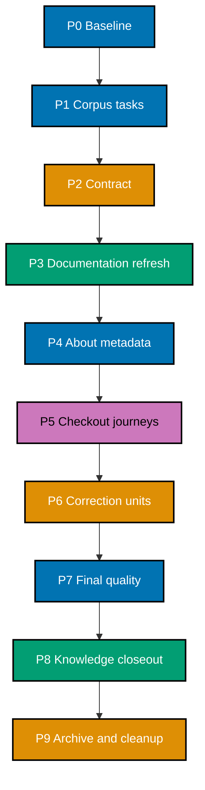

# 🚚 Delivery Checklist: README and Onboarding Refresh

> **Legend** — `[AI]`: an agent performs the step. Every executable checklist item in this plan is
> marked `[AI]`; there are no human approval, intervention, or merge gates. If execution discovers a
> task that genuinely requires a person or real-secret handling, stop that task as out of scope
> instead of adding a human participant.
> 🔐 **Hard safety rule**: Never read, write, quote, or commit real `.env*` files or secret values.
> Never copy credentials, hostnames, usernames, IP addresses, or account details into this plan,
> docs, evidence, metadata, commits, or PRs. Use `.env.example`, variable names, and `<placeholder>`
> tokens only.
> 🚧 **Scope rule**: this plan delivers into `ose-public` only. No branch, PR, metadata change, or
> file edit lands in `ose-private`, `ose-primer`, or `beaver-nest`, and no delivery unit changes a
> path inside `apps/rhino-cli/` or `specs/apps/rhino/behavior/rhino-cli/`.

## Worktree

The plan uses one worktree for the whole program: `worktrees/repository-onboarding-readme-refresh/`.
Before the first change-producing phase, create it with
`claude --worktree repository-onboarding-readme-refresh` from the repository root, verify the
resulting path with `git worktree list`, and record the exact branch in the Phase 0 execution record.
Every later delivery unit reuses this same worktree and switches branches, per the
[Worktree Cap](../../../repo-governance/conventions/structure/plans/worktree-cap.md#worktree-cap--one-worktree-per-repository-per-plan-hard-rule).
Follow the
[Plans Organization Convention](../../../repo-governance/conventions/structure/plans/worktree-specification.md#worktree-specification)
for provisioning and reconciliation.

## Delivery Mode and Worktrees

**Delivery mode: `worktree-to-pr`.** Every change-producing unit uses the plan worktree, one branch,
and one draft PR against `main`. AI first applies the canonical behavior classifier: eligible PRs run
up to seven sequential review cycles and stop at the first clean code M/H/C result; noneligible PRs
require only a green `pr-quality-gate.yml` run before AI merges. Phase 0 opens no PR and pushes no
branch.

## Execution Records

Every task ID receives a durable row in the owning unit's execution record before its checkbox is
checked. Each row uses these fields:

```text
Task ID | Date | Status | Files Changed | Commands/Evidence | Notes
```

`Files Changed` lists every touched path or `None`. `Commands/Evidence` records commands and
pass/fail outcomes without raw secrets or sensitive output. The execution record is append-only
across agents, compaction, and handoff. The corpus ledger also expands every exact document into its
own `[AI]` task row; a family-level orchestration checkbox never substitutes for the per-document
result.

Exact record ownership:

- Phase 0 writes only to the gitignored
  `local-tmp/repository-onboarding-readme-refresh/execution-record-phase-0.md`; Phase 1 copies its
  sanitized outcomes into the contract record.
- Contract, refresh, correction, and closeout units use
  `artifacts/execution-record-{contract,public,fixes,closeout}.md` inside this plan.
- Metadata, fresh-checkout, and final read-only verification use the gitignored
  `local-tmp/repository-onboarding-readme-refresh/execution-record-verification-program.md`; it
  stores only safe status/evidence summaries and is created before Phase 4.

## AI-Only Integration Rules

At each delivery boundary, the phase carries separate checkboxes for worktree reconciliation,
formatting, Markdown/Rhino validation, generated-binding sync, secret gates, the identity-boundary
guard, commit, push, draft PR, the canonical behavior-routed review requirement, forward-update, CI,
and merge. Commit messages use Conventional Commits, generated mirrors stay with their canonical
source, and no commit message contains sensitive facts.

“Full unit gates” means running the repository's own declared gate commands. Phase 0 reads them from
the registry with
`cargo run --release --quiet --manifest-path apps/rhino-cli/Cargo.toml -- gate list --surface=<surface> --format=text`;
the list below is the expected result and is corrected in this document if the registry disagrees.

Staged-file surface (`pre-commit`), plus the repo-wide equivalents this plan runs over its whole
branch set:

```bash
git diff --check
npm run format:md:check
npm run lint:md
cargo run --release --quiet --manifest-path apps/rhino-cli/Cargo.toml -- md mermaid validate --exclude "apps/rhino-cli/tests/fixtures" --exclude "plans/done" --exclude "apps/ayokoding-www/content"
cargo run --release --quiet --manifest-path apps/rhino-cli/Cargo.toml -- md heading-hierarchy validate
cargo run --release --quiet --manifest-path apps/rhino-cli/Cargo.toml -- md naming validate --exempt "*__linkedin__*.md" --exempt "CONTRIBUTING.md"
cargo run --release --quiet --manifest-path apps/rhino-cli/Cargo.toml -- md frontmatter validate
cargo run --release --quiet --manifest-path apps/rhino-cli/Cargo.toml -- env staged-guard validate
```

Repository-wide surface (`pre-push`):

```bash
cargo run --release --quiet --manifest-path apps/rhino-cli/Cargo.toml -- md links validate --exclude plans/done
cargo run --release --quiet --manifest-path apps/rhino-cli/Cargo.toml -- governance readme-index validate
cargo run --release --quiet --manifest-path apps/rhino-cli/Cargo.toml -- parity manifest validate
npm run validate:sync
npm exec nx -- affected -t typecheck,lint,test:quick,specs:behavior:coverage
npm exec nx -- affected -t build,test:quick,lint
```

The `md mermaid`, `md naming`, `md frontmatter`, and Prettier gates are **affected-file-type scoped**:
they inspect only the files a given commit stages, so a branch can accumulate an unformatted or
non-conforming file and still show green. Every delivery unit therefore also sweeps its own complete
branch set explicitly — `git diff --name-only origin/main...HEAD -- '*.md'` piped into the
repo-pinned binaries under `node_modules/.bin/`, never `npx` — before its final gate run.

Every target name above is resolved from live project configuration in Phase 0 before first use; a
target that no longer exists is corrected in this list rather than executed blindly.

For an unscoped repository-wide validator that reports pre-existing violations outside this program's
ledgered paths, record its baseline result and verify zero violations in every changed or ledgered
path instead. The merged PR's required affected-file checks are the final authoritative gate for that
validator. This is scope control, not a waiver: every violation in a changed, generated, or ledgered
path is fixed before the unit proceeds, and no failing required PR check may merge.

The exact staged environment-file gate is:

```bash
cargo run --release --quiet --manifest-path apps/rhino-cli/Cargo.toml -- env staged-guard validate
```

The exact silent staged-credential pattern gate is below. `rg --quiet` prevents a match from echoing
the possible secret into logs:

```bash
if git diff --cached --no-ext-diff --unified=0 -- . | rg --quiet --pcre2 -e '-----BEGIN (RSA |EC |OPENSSH |DSA )?PRIVATE KEY-----|gh[pousr]_[A-Za-z0-9]{20,}|AKIA[0-9A-Z]{16}|xox[baprs]-[A-Za-z0-9-]{10,}|AIza[0-9A-Za-z_-]{30,}|sk_live_[0-9A-Za-z]{16,}|glpat-[0-9A-Za-z_-]{20,}'; then exit 1; fi
```

The exact identity-boundary guard is:

```bash
git diff --cached --name-only -- apps/rhino-cli specs/apps/rhino/behavior/rhino-cli
```

An empty result is the acceptance criterion; any listed path stops the unit. This is the cheap
staged tripwire that fires before a commit exists. The repository's own registered gate,
`parity manifest validate` (pre-push and CI), remains the authority on the boundary's actual byte
state and runs in every full-gate pass above.

These deterministic gates are necessary but not sufficient. An independent AI reviewer must also
inspect the staged diff semantically for credentials, connection strings, or unsafe examples without
copying the diff into evidence. Metadata, commit messages, and PR text receive the same AI semantic
review because they are outside the staged file scan.

Every “full unit gates” task executes all three gates above.

> **Important — fix all failures, not just those caused by your changes.** Every failure a quality
> gate reports in a changed, generated, or ledgered path is fixed before the unit proceeds, including
> a preexisting one this plan did not introduce. Regenerate swept build artifacts and continue. Never
> bypass a required PR check. If a failure requires code, API, UI, or infrastructure behavior work,
> create and complete its separate blocking plan before resuming this documentation program.

**Commit thematically.** Each commit is one logically cohesive group of changes using
[Conventional Commits](../../../repo-governance/development/workflow/commit-messages.md): plan-control
changes, the documentation refresh, and any correction are separate commits, and an unrelated fix is
never bundled into a commit that already carries another concern. Generated mirrors stay in the same
commit as the canonical source that produced them.

For every PR unit, Phase 0 records every workflow name and required check-run name triggered by this
repository. After each push, enumerate all matching workflow runs with
`gh run list --branch <exact-branch> --limit 20 --json databaseId,name,status,conclusion`; select the
newest run for each recorded workflow, then poll every selected run every two minutes with
`gh run view <databaseId> --json status,conclusion`. Also query the PR's complete check set with
`gh pr checks <pr-number> --required`. Record each workflow name, run ID, check name, and sanitized
result in the unit record. A failed, cancelled, missing, or still-pending run/check is investigated,
fixed in the owning unit, pushed, and polled again; merge is forbidden until every named run and
required PR check succeeds.

## Parallelization Model

**Parallel delivery nodes: 1.** This program delivers into one repository, and its document families
share a single link graph, reader journey, and corpus ledger, so delivery units serialize. The DAG
below is therefore a chain, and the plan declares a single boundary per delivery unit rather than
independent parallel nodes. Parallelism inside a unit
is limited to independent read-only audits of separate document families; anything that writes a file
or a ledger row runs in sequence. Cleanup is the terminal node.



### DAG Registry

| Node | Work                                                           | blockedBy | blocks |
| ---- | -------------------------------------------------------------- | --------- | ------ |
| P0   | Safe baseline                                                  | —         | P1     |
| P1   | Corpus ledger and exact task rows                              | P0        | P2     |
| P2   | Fact, voice, journey, metadata, and sensitivity contract       | P1        | PUB    |
| PUB  | Complete `ose-public` documentation refresh                    | P2        | META   |
| META | Exact About and package metadata                               | PUB       | WALK   |
| WALK | Two fresh-checkout journeys                                    | META      | FIX    |
| FIX  | Conditional correction PRs                                     | WALK      | Q      |
| Q    | Full corpus, voice, mechanical, and sensitivity reconciliation | FIX       | K      |
| K    | Sanitized evidence and knowledge capture                       | Q         | C      |
| C    | Archival, post-move inventory, and cleanup                     | K         | —      |

### Delivery Boundaries

| Phase(s) | Delivery unit                     | Worktree                                          | Branch                                  | PR opens                          |
| -------- | --------------------------------- | ------------------------------------------------- | --------------------------------------- | --------------------------------- |
| 0        | — (setup and baseline)            | primary checkout, tracked state read-only         | —                                       | no                                |
| 1–2      | Documentation contract            | `worktrees/repository-onboarding-readme-refresh/` | `docs/repository-onboarding-contract`   | yes — at Phase 2                  |
| 3        | Documentation refresh             | `worktrees/repository-onboarding-readme-refresh/` | `docs/repository-onboarding-public`     | yes — at Phase 3                  |
| 4        | — (metadata only, no repo change) | authenticated repository session                  | —                                       | no                                |
| 5        | — (verification only)             | disposable temporary clones                       | —                                       | no                                |
| 6        | Corrections, if defects exist     | `worktrees/repository-onboarding-readme-refresh/` | `docs/repository-onboarding-fixes-<nn>` | yes — at Phase 6, once per `<nn>` |
| 7        | — (read-only reconciliation)      | merged `main`, read-only                          | —                                       | no                                |
| 8–9      | Closeout and archival             | `worktrees/repository-onboarding-readme-refresh/` | `docs/repository-onboarding-closeout`   | yes — at Phase 9                  |

Every change-producing phase appears in exactly one row, and the last change-producing phase
(Phase 9) is a delivery boundary. Phases 4, 5, and 7 produce no repository change and therefore open
no PR.

## Phase 0: Environment, Safety, and Baseline

- [ ] [AI] [P0-000] Create the exact gitignored Phase 0 execution record with the required schema —
      acceptance: `git status --short` does not list the record and it contains no secret value.
- [ ] [AI] [P0-001] Run `git status --short` in the repository root and record only path-level
      dirty-state facts in the gitignored Phase 0 execution record — acceptance: no existing change
      is claimed, edited, staged, or copied into plan evidence.
- [ ] [AI] [P0-002] Run `git fetch origin`, `git rev-parse main`, and `git rev-parse origin/main` —
      acceptance: every future unit is based on current `origin/main`, with any divergence resolved
      non-destructively before provisioning.
- [ ] [AI] [P0-003] Run
      `cargo run --release --quiet --manifest-path apps/rhino-cli/Cargo.toml -- gate list --surface=pre-commit --format=text`
      — acceptance: the exact Markdown, generated-binding, and environment guard commands are
      recorded in the execution record.
- [ ] [AI] [P0-003A] Resolve every command named in the “full unit gates” block: each Nx target with
      `npm exec nx show project <project> -- --json`, and each `rhino-cli` subcommand against
      `rhino-cli <group> --help` — acceptance: every target and subcommand exists, and any missing one
      is corrected in this document before first execution.
- [ ] [AI] [P0-004] Run the exact staged environment-file gate without staging anything —
      acceptance: the baseline exits 0.
- [ ] [AI] [P0-004A] Run the silent staged-credential pattern gate without staging anything —
      acceptance: the baseline exits 0 and emits no candidate value.
- [ ] [AI] [P0-005] Run `npm run format:md:check` and `npm run lint:md` in the primary checkout —
      acceptance: baseline outcomes are recorded without modifying unrelated work.
- [ ] [AI] [P0-006] Run
      `gh repo view --json nameWithOwner,description,homepageUrl,repositoryTopics,url,visibility` —
      acceptance: only these safe fields are retained for rollback.
- [ ] [AI] [P0-006A] Inspect the workflows and required PR checks this repository triggers and record
      their names — acceptance: every future PR unit has named CI checks and the exact run-polling
      procedure.
- [ ] [AI] [P0-007] Provision the plan worktree and the contract branch from `origin/main` —
      acceptance: `git worktree list` shows the declared path, and the branch matches the Delivery
      Boundaries table.
- [ ] [AI] [P0-008] Run `npm install` and then `npm run doctor -- --fix` in the plan worktree —
      acceptance: both exit 0 and no real `.env*` is accessed.
- [ ] [AI] [P0-009] Run the baseline gates in the plan worktree and classify each repository-wide
      result as ledgered-path or unrelated-baseline evidence — acceptance: every ledgered path is
      clean and any unrelated baseline result is recorded without expanding scope.

### Phase 0 Gate

- [ ] [AI] [P0-G01] Verify every P0 execution-record row is complete and Phase 0 opened no PR, pushed
      no branch, and mutated no metadata — acceptance: all baseline evidence is local and secret-free.

> **Pause Safety**: reader documentation and metadata remain unchanged. To resume, inspect the P0
> execution record and rerun only failed baselines.

## Phase 1: Corpus Inventory and Per-Document Task Register

- [ ] [AI] [P1-000] Create `artifacts/execution-record-contract.md` and copy only sanitized Phase 0
      outcomes from the local record — acceptance: every copied row uses the required schema and no
      local path, dirty filename, or raw output enters the tracked artifact.
- [ ] [AI] [P1-001] Create `artifacts/reader-doc-disposition-ose-public.md` with repository revision,
      document kind, exact path, audience, purpose, disposition, owning unit, task ID, Date, Status,
      Files Changed, Commands/Evidence, and Notes — acceptance: the schema supports one executable row
      per tracked Markdown file without quoting document bodies.
- [ ] [AI] [P1-002] Populate the ledger from
      `git ls-tree -r --name-only <recorded-origin-main-sha> -- '*.md'` — acceptance: every committed
      README is audit-required and each other path is classified reader-related, historical,
      generated, identity-bound, or `not-reader-doc` with a reason.
- [ ] [AI] [P1-003] Mark `plans/done/` and archived trees historical, generated mirrors generated, and
      every path under `apps/rhino-cli/` or `specs/apps/rhino/behavior/rhino-cli/` `identity-bound` —
      acceptance: none is scheduled for hand-editing.
- [ ] [AI] [P1-004] Re-verify each 2026-08-06 audit finding recorded in `brd.md` against the recorded
      revision — acceptance: every finding is marked reproduced or not-reproduced with evidence, and a
      non-reproducing finding creates no edit row.
- [ ] [AI] [P1-005] Expand each audit-required or reader-related document into one exact `[AI]` task
      row — acceptance: each row names one path, one direct action, its source of truth, the exact
      applicable command, a concrete acceptance criterion, and implementation fields.
- [ ] [AI] [P1-006] Add explicit `planned-new` task rows for this plan's execution artifacts and any
      new document before evaluating inventory drift — acceptance: future known Markdown paths are not
      mistaken for unexplained extras.
- [ ] [AI] [P1-007] Reconcile the ledger with its recorded `origin/main` tree plus `planned-new` rows
      — acceptance: zero missing, duplicate, or unexplained extra paths and zero blank task fields.

### Phase 1 Gate

- [ ] [AI] [P1-G01] Have an independent AI plan reviewer sample task rows from every document class —
      acceptance: exact per-document execution is ready and every row is individually executable.

> **Pause Safety**: the corpus is enumerated and task-shaped, but reader docs remain unchanged. To
> resume, reconcile the ledger against current `origin/main` before editing anything.

## Phase 2: Documentation Contract

- [ ] [AI] [P2-001] Record the source-of-truth matrix from `tech-docs.md` in the ledger — acceptance:
      the ledger names one authority for versions, projects, ports, product facts, relationships,
      contribution policy, and metadata.
- [ ] [AI] [P2-002] Record the Human Voice Contract and reader paths from `prd.md` in the audit rubric
      — acceptance: product purpose leads, jargon is explained, emoji is purposeful, and openings are
      not templated clones.
- [ ] [AI] [P2-003] Record macOS and Ubuntu as supported and WSL2 as possibly workable but unsupported
      and unverified — acceptance: every platform task uses the same wording contract.
- [ ] [AI] [P2-004] Record closed external contribution intake and authorized `worktree-to-pr`
      guidance — acceptance: no task introduces an invitation, response-time promise, or
      direct-`main` workflow.
- [ ] [AI] [P2-005] Record the exact GitHub description, homepage URL, and topic array from `prd.md` —
      acceptance: metadata execution cannot improvise values.
- [ ] [AI] [P2-006] Record the read, write, staged-diff, identity-boundary, and knowledge-capture
      gates — acceptance: no execution record can contain a secret and no unit can edit an
      identity-bound path.
- [ ] [AI] [P2-007] Reconcile the contract unit file-touch ledger with `git status --short` and run
      `git diff --check` — acceptance: only declared plan files and artifacts are changed.
- [ ] [AI] [P2-007A] Stage only contract-ledger paths and inspect `git diff --cached --name-only` —
      acceptance: the staged set equals the contract file-touch ledger and the identity-boundary guard
      returns empty.
- [ ] [AI] [P2-008] Run `npm run format:md:check`, `npm run lint:md`, the repository-authoritative
      Rhino Markdown validators, `npm run validate:sync`, and the exact staged environment-file gate —
      acceptance: every command exits 0.
- [ ] [AI] [P2-009] Have an independent AI review the staged contract diff for secrets, plan
      structure, and robotic prose — acceptance: zero CRITICAL, HIGH, or MEDIUM findings.
- [ ] [AI] [P2-010] Commit the contract unit with a Conventional Commit — acceptance: the commit
      contains one cohesive plan/control-plane change and no unrelated file.
- [ ] [AI] [P2-011] Push the exact contract branch and open its draft PR against `main` — acceptance:
      the PR links this plan and declares its file set.
- [ ] [AI] [P2-012] Classify the PR with the canonical behavior classifier, then run only its
      applicable route — acceptance: eligible work reaches the earliest clean code M/H/C cycle within
      seven; noneligible work has a green `pr-quality-gate.yml` run.
- [ ] [AI] [P2-013] Forward-update from current `origin/main`, rerun all unit gates, and verify PR CI
      — acceptance: the head is current and green without destructive history edits.
- [ ] [AI] [P2-014] Merge the contract PR as AI after all hardened preconditions hold — acceptance:
      `main` contains the contract and task registers.

### Phase 2 Gate

- [ ] [AI] [P2-G01] Read the merged contract from `origin/main` — acceptance: downstream work begins
      from one immutable contract revision.

> **Pause Safety**: the control contract is merged and independently useful. To resume, read the
> merged ledger and start the refresh unit from current `origin/main`.

## Phase 3: Complete Documentation Refresh

- [ ] [AI] [P3-001] Switch the plan worktree to the refresh branch, created from current
      `origin/main` — acceptance: the declared pair appears in `git worktree list` and
      `git status --short` is clean before edits.
- [ ] [AI] [P3-001A] Create `artifacts/execution-record-public.md` with the required schema —
      acceptance: all Phase 3 task IDs have rows before their checkboxes are checked.
- [ ] [AI] [P3-002] Run `npm install`, `npm run doctor -- --fix`, and baseline gates in the refresh
      unit — acceptance: setup and baseline checks pass before edits.
- [ ] [AI] [P3-003] Audit and, where evidence requires, revise root `README.md` around product
      purpose, repository role, maturity, sibling-repository lines, **Understand the product**, and
      **Run OSE locally** — acceptance: an early engineer or product person can select a path without
      reading build internals first, and an already-passing section is recorded `verified-unchanged`.
- [ ] [AI] [P3-003A] Verify the root package description with `jq -r '.description' package.json`,
      applying
      `npm pkg set description='Open source platform for researching and building trustworthy, Sharia-compliant enterprise products.'`
      only if it differs — acceptance: exact equality with the package metadata contract.
- [ ] [AI] [P3-004] Align `CONTRIBUTING.md` with closed external intake and authorized
      `worktree-to-pr` delivery — acceptance: no public invitation, direct-`main` advice, or response
      promise remains.
- [ ] [AI] [P3-005] Verify the narrow `CONTRIBUTING.md` staged-naming exemption in both places that
      already declare it — the `lint-staged` Markdown command in `package.json` and the gate registry
      entry in `repo-config.yml` — and add it only where it is missing — acceptance: `CONTRIBUTING.md`
      passes `md naming validate`, a plan-owned `local-tmp/.../BAD-NAME.md` negative control still
      produces the expected invalid-filename rule and is then removed, and the two declarations agree.
- [ ] [AI] [P3-006] Close or supersede any live idea file that duplicates this plan's contribution or
      naming-exemption work through the repository's idea lifecycle — acceptance: no duplicate live
      proposal remains.
- [ ] [AI] [P3-007] Audit and, where evidence requires, revise
      `docs/tutorials/getting-started-with-ose-public.md` and the root/docs/tutorial navigation —
      acceptance: the macOS/Ubuntu journey reaches the verified `ose-www` dev target, expected page,
      recovery guidance, and next step, with every command resolved from live configuration.
- [ ] [AI] [P3-008] Execute every exact document task row one at a time, including root, `apps/`,
      `libs/`, `specs/`, `infra/`, governance indexes, setup, architecture, relationship, security,
      plans, social-media, and other catch-all living surfaces — acceptance: every row has its own
      result and no cosmetic edit is manufactured.
- [ ] [AI] [P3-009] Regenerate harness mirrors only from canonical `.claude/` changes and run
      `npm run generate:bindings` followed by `npm run validate:sync` — acceptance: no generated
      mirror is hand-edited and mirrors land in the same commit as their source.
- [ ] [AI] [P3-010] Reconcile the task register and append-only file-touch ledger — acceptance: every
      task is terminal and every touched path belongs to this unit.
- [ ] [AI] [P3-010A] Compare the ledger with sorted
      `git ls-files --cached --others --exclude-standard -- '*.md'`, adding one exact row for every
      generated or newly created Markdown path — acceptance: zero unexplained missing or extra paths.
- [ ] [AI] [P3-010B] Stage only ledger-owned paths, inspect `git diff --cached --name-only`, and run
      the identity-boundary guard — acceptance: the staged set equals the file-touch ledger and the
      guard returns empty.
- [ ] [AI] [P3-011] Run `git diff --check`, formatting, Markdown lint, all Rhino Markdown validators,
      README-index validation, sync validation, affected gates, and the staged environment-file gate —
      acceptance: every applicable command exits 0.
- [ ] [AI] [P3-012] Run the README maker→checker→fixer cycle and an independent AI sensitivity/voice
      review over every changed living reader-facing file — acceptance: zero CRITICAL, HIGH, or MEDIUM
      findings and no secret or robotic passage.
- [ ] [AI] [P3-013] Commit the refresh unit with a Conventional Commit — acceptance: the commit
      contains only the cohesive documentation refresh.
- [ ] [AI] [P3-014] Push the exact refresh branch — acceptance: `origin` contains the unit head.
- [ ] [AI] [P3-015] Open the draft PR against `main` — acceptance: its declared file set and plan link
      are correct.
- [ ] [AI] [P3-016] Run the canonical behavior-routed review cycles — acceptance: all accepted
      findings are fixed and each cycle's CI is green.
- [ ] [AI] [P3-017] Forward-update from `origin/main` without destructive history edits — acceptance:
      the branch contains current `origin/main`.
- [ ] [AI] [P3-018] Rerun full unit gates and verify final PR CI — acceptance: every gate is green.
- [ ] [AI] [P3-019] Merge the refresh PR as AI — acceptance: `main` contains the refresh.

### Phase 3 Gate

- [ ] [AI] [P3-G01] Verify the merged README, onboarding tutorial, contribution posture, task
      register, and package description agree — acceptance: no `follow-up-required` row remains and
      the documented full-inventory reconciliation equals the recursive `origin/main` Markdown count.

> **Pause Safety**: the refresh is merged as one internally coherent reader journey. To resume, read
> the merged ledger and continue with metadata.

## Phase 4: Exact GitHub About Metadata

- [ ] [AI] [P4-000] Create the exact gitignored verification-program execution record with the
      required schema — acceptance: every Phase 4, 5, and 7 task ID has a row before execution and
      `git status --short` does not list the record.
- [ ] [AI] [P4-001] Validate the exact PRD description against GitHub field limits, the homepage as
      HTTPS, and every topic as a lowercase hyphenated slug — acceptance: the value set is
      mutation-ready without edits.
- [ ] [AI] [P4-002] Re-read the six approved safe prior fields — acceptance: values match the Phase 0
      rollback record or drift is investigated before mutation.
- [ ] [AI] [P4-003] Compare live values with the contract; if they already match, record verified
      equality and skip mutation — acceptance: no unnecessary metadata write occurs.
- [ ] [AI] [P4-004] If any value differs, run `gh repo edit wahidyankf/ose-public` with the exact
      description and homepage from `prd.md`, then replace topics through the GitHub topics API
      replace operation — acceptance: the commands exit 0 and no topic accumulates.
- [ ] [AI] [P4-005] Read back `description,homepageUrl,repositoryTopics` with authenticated `gh` and
      compare exact set equality — acceptance: every value matches `prd.md`.
- [ ] [AI] [P4-006] If a mutation or readback fails, restore the captured safe prior fields with
      AI-run CLI/API commands — acceptance: the repository is never left partially updated.

### Phase 4 Gate

- [ ] [AI] [P4-G01] Verify exact metadata equality — acceptance: complete, accurate About metadata is
      live and rollback evidence is sanitized.

> **Pause Safety**: metadata is verified or rolled back. To resume, re-read the About fields and
> compare them with `prd.md`.

## Phase 5: Fresh-Checkout Journeys

Each subphase uses a newly created `mktemp -d` location and removes only that exact temporary clone
after processes stop and evidence is safely recorded.

### Phase 5A: macOS

- [ ] [AI] [P5A-001] Create one exact macOS `mktemp -d` directory, clone `main` into it, and record
      the directory only in the local verification record — acceptance: the new clone has no
      checkout-local state.
- [ ] [AI] [P5A-002] Run only the documented prerequisite and bootstrap commands in that clone —
      acceptance: every command succeeds without an undocumented prerequisite.
- [ ] [AI] [P5A-003] Run `npm exec nx show project ose-www --json` and record the declared `dev`
      target's command, its port environment variable name, and its default port — acceptance: the
      start command and address are read from project configuration, not guessed or copied from this
      plan.
- [ ] [AI] [P5A-004] Start the declared `ose-www` `dev` target and retain its process ID in the local
      record — acceptance: the target stays running for inspection.
- [ ] [AI] [P5A-005] Request the recorded loopback address with `curl --fail --silent --show-error` —
      acceptance: the response succeeds and contains the documented product-purpose cue.
- [ ] [AI] [P5A-006] Inspect that same address in a browser and its console at mobile, tablet, and
      desktop viewports — acceptance: product context is visible at all three and no console error
      appears. `ose-www` serves a single locale, so no per-locale repetition applies.
- [ ] [AI] [P5A-006A] Capture evidence into the plan's `evidence/` folder: one screenshot per
      breakpoint named `phase-5a-ose-www-landing-en-<width>px.png`, plus the curl response saved as
      `phase-5a-ose-www-curl.txt` — acceptance: every file is referenced from this checklist's
      execution record and contains no credential, token, or authenticated session data.
- [ ] [AI] [P5A-007] Stop the recorded child process, verify clean status, and remove only the exact
      temporary clone — acceptance: no process or temporary checkout remains.

#### Phase 5A Gate

- [ ] [AI] [P5A-G01] Record the sanitized result, stop proof, and cleanup result; create a Phase 6
      correction row for any failure — acceptance: no mutable macOS journey state remains.

> **Pause Safety**: the macOS clone and child process are gone; resume from its sanitized row.

### Phase 5B: Ubuntu

The Ubuntu journey runs inside one disposable container built from the upstream official
`ubuntu:24.04` image. This plan authors no Dockerfile, builds no image, publishes no image, and
commits no container configuration. The container is started with `--rm`, and the base image itself is
removed afterwards unless it was already present before this phase. Nothing this phase pulls or
creates survives it.

- [ ] [AI] [P5B-000] Record the pre-phase Docker baseline with `docker image ls --format '{{.Repository}}:{{.Tag}}'`,
      `docker ps -a --format '{{.Names}}'`, `docker volume ls -q`, and `docker network ls --format '{{.Name}}'`,
      and note whether `docker image inspect ubuntu:24.04` already succeeds — acceptance: the record
      states the exact pre-existing state, and whether cleanup must remove the base image or leave a
      preexisting one alone.
- [ ] [AI] [P5B-001] Start one disposable container from the upstream official image with
      `docker run --rm --name ose-onboarding-ubuntu-check -p 127.0.0.1:<port>:<port> ubuntu:24.04` and
      record its exact name — acceptance: the container is started from the unmodified upstream image,
      no Dockerfile or build step is used, no host path is bind-mounted, and only the loopback port is
      published.
- [ ] [AI] [P5B-002] Inside the container, install only the packages the onboarding documentation
      itself names as prerequisites — acceptance: every install command comes from the documented
      prerequisite list, and any package the journey turns out to need but the docs never mention
      becomes a Phase 6 documentation-defect row rather than a silent fix.
- [ ] [AI] [P5B-003] Clone `main` into a `mktemp -d` directory inside the container and run only its
      documented bootstrap — acceptance: setup succeeds without checkout-local state and without an
      undocumented prerequisite.
- [ ] [AI] [P5B-004] Resolve and start the `ose-www` dev target with
      `npm exec nx show project ose-www --json` followed by its declared Nx command, bound so the
      published loopback port reaches it — acceptance: the process ID and loopback address are
      recorded.
- [ ] [AI] [P5B-005] Use `curl --fail --silent --show-error` on that address from inside the
      container, then inspect the published host loopback address in a browser and its console at
      mobile, tablet, and desktop viewports — acceptance: the documented product context appears at
      all three with no console error.
- [ ] [AI] [P5B-005A] Capture evidence into the plan's `evidence/` folder: one screenshot per
      breakpoint named `phase-5b-ose-www-landing-en-<width>px.png`, plus the curl response saved as
      `phase-5b-ose-www-curl.txt` — acceptance: every file is referenced from this checklist's
      execution record and contains no host path, credential, or session data.
- [ ] [AI] [P5B-006] Stop the recorded process and exit the container, then verify with
      `docker ps -a --format '{{.Names}}'` that the recorded container name is absent — acceptance:
      `--rm` removed the container and no plan-created container remains.
- [ ] [AI] [P5B-007] If P5B-000 recorded `ubuntu:24.04` as absent before this phase, remove it with
      `docker image rm ubuntu:24.04` — acceptance: `docker image inspect ubuntu:24.04` then fails; if
      the image existed beforehand it is left untouched and that decision is recorded.
- [ ] [AI] [P5B-008] Re-run the four P5B-000 baseline listings and diff them against the recorded
      baseline — acceptance: image, container, volume, and network sets are identical to the pre-phase
      state, with zero dangling image, anonymous volume, or plan-created network left behind.

#### Phase 5B Gate

- [ ] [AI] [P5B-G01] Record the sanitized result, stop proof, image-removal decision, and Phase 6
      correction row if needed — acceptance: no mutable Ubuntu journey state remains and the Docker
      baseline diff in P5B-008 is empty.

> **Pause Safety**: the Ubuntu container, its clone, and any image this phase pulled are gone; resume
> from its sanitized row and re-establish the Docker baseline first.

### Phase 5 Gate

- [ ] [AI] [P5-G01] Record a sanitized outcome for both operating-system journeys in the
      verification-program record — acceptance: each names pass/fail and safe evidence only, with no
      raw environment data.

> **Pause Safety**: all temporary journeys are stopped and removed; failures are recorded as exact
> correction rows.

## Phase 6: Conditional Correction Units

Create one exact correction row per Phase 5 or cross-document defect. If there are zero defects,
record this phase not applicable and create no branch or PR. Set `<nn>` to `01` for the first
correction unit and increment it for every Phase 7 loopback. Each iteration gets a new branch, PR,
and execution record; never reuse a merged unit. Append `@<nn>` to its Phase 6 task IDs in the
record.

- [ ] [AI] [P6-001] Switch the plan worktree to the correction branch when defects exist —
      acceptance: install, doctor, and baseline gates pass; otherwise record not applicable.
- [ ] [AI] [P6-001A] Create `artifacts/execution-record-fixes.md` when applicable — acceptance: every
      Phase 6 task ID has a row.
- [ ] [AI] [P6-002] Execute each exact correction row separately and rerun its failed journey —
      acceptance: every defect is fixed and no product behavior change is smuggled into docs.
- [ ] [AI] [P6-002A] For any defect that is a product bug rather than a documentation defect, add
      focused red coverage before the fix — acceptance: the test reproduces the defect and fails
      against current behavior.
- [ ] [AI] [P6-002B] Apply the minimum correction that turns that coverage green — acceptance: the
      focused assertion passes and no unrelated behavior changes.
- [ ] [AI] [P6-003] Reconcile and stage only correction-ledger paths, then run the identity-boundary
      guard — acceptance: every correction is owned, the staged set equals the ledger, and the guard
      returns empty.
- [ ] [AI] [P6-003A] Run full unit gates — acceptance: every command exits 0.
- [ ] [AI] [P6-003B] Run an independent AI docs/sensitivity review — acceptance: zero CRITICAL, HIGH,
      or MEDIUM findings.
- [ ] [AI] [P6-004] Commit the correction unit — acceptance: one cohesive Conventional Commit.
- [ ] [AI] [P6-005] Push the correction branch — acceptance: `origin` contains the head.
- [ ] [AI] [P6-006] Open the correction draft PR — acceptance: its scope matches the defect rows.
- [ ] [AI] [P6-007] Run the canonical behavior-routed review cycles — acceptance: findings are
      resolved.
- [ ] [AI] [P6-008] Forward-update from `origin/main` — acceptance: the head is current.
- [ ] [AI] [P6-009] Rerun gates, the failed journey, and PR CI — acceptance: all are green.
- [ ] [AI] [P6-010] Merge the correction PR as AI — acceptance: fixes are on `main`.

### Phase 6 Gate

- [ ] [AI] [P6-G01] Verify corrections are merged or explicitly not applicable — acceptance: no
      journey defect remains.

> **Pause Safety**: the correction state is terminal. To resume, rerun Phase 5 only for the journey
> that failed.

## Phase 7: Full-Corpus Quality and Safety Reconciliation

- [ ] [AI] [P7-001] Reinventory all tracked Markdown at current `main` and reconcile the ledger with
      `git ls-tree -r --name-only origin/main -- '*.md'` — acceptance: zero missing/duplicate paths
      and every reader task is terminal; any mismatch creates an exact Phase 6 correction row before
      Phase 7 restarts.
- [ ] [AI] [P7-002] Run all repository-authoritative formatting, Markdown lint, Rhino Markdown,
      README-index, generated-sync, affected, and staged-environment gates — acceptance: every
      applicable command exits 0.
- [ ] [AI] [P7-003] Run strict docs and README checkers in read-only mode — acceptance: two
      consecutive independent checks report zero CRITICAL, HIGH, or MEDIUM findings; any finding
      returns to Phase 6 before Phase 7 restarts.
- [ ] [AI] [P7-004] Have an AI reviewer distinct from each file's writer read every changed living
      reader-facing document aloud against the Human Voice Contract — acceptance: every file passes;
      any stock filler, repetitive cadence, or template-like opening becomes a Phase 6 correction row.
- [ ] [AI] [P7-005] Cross-read contribution, platform support, content parity, `rhino-cli` byte
      identity, repository purpose, package description, and About metadata — acceptance: all current
      claims agree; documentation findings return to Phase 6 and metadata mismatches return to
      Phase 4 before Phase 7 restarts.
- [ ] [AI] [P7-006] Verify no merged commit in this program touched the identity boundary with
      `git diff --name-only <plan-base-sha>..origin/main -- apps/rhino-cli specs/apps/rhino/behavior/rhino-cli`,
      then run `parity manifest validate` on merged `main` — acceptance: the diff prints nothing and
      the parity gate exits 0, so no cross-repository byte-identity obligation was opened.
- [ ] [AI] [P7-007] Run both deterministic secret gates and an independent AI semantic sensitivity
      review over plan artifacts, all diffs, evidence, metadata, commits, and PR text — acceptance:
      zero secret or credential leak; a suspected leak stops ordinary execution and invokes the
      repository security-incident route.

### Phase 7 Gate

- [ ] [AI] [P7-G01] Verify every mechanical, reader, voice, relationship, journey, boundary, and
      sensitivity result is green — acceptance: no unresolved finding of any severity blocks closeout.

> **Pause Safety**: the delivered documentation system is fully reconciled. To resume, compare the
> ledger with current `origin/main` before closing out.

## Phase 8: Sanitized Closeout and Knowledge Capture

- [ ] [AI] [P8-001] Switch the plan worktree to the closeout branch from current `origin/main` —
      acceptance: install, doctor, and baseline gates pass.
- [ ] [AI] [P8-001A] Create `artifacts/execution-record-closeout.md` with the required schema —
      acceptance: every Phase 8–9 task ID has a row before execution.
- [ ] [AI] [P8-002] Create or update `evidence/README.md` as a sanitized index of PRs, metadata
      equality, both journey outcomes, and quality gates — acceptance: it contains no raw output,
      screenshot, environment data, or authentication state.
- [ ] [AI] [P8-002A] Ingest only sanitized terminal rows from the verification-program record into
      `artifacts/execution-record-closeout.md` — acceptance: Phase 4, 5, and 7 outcomes are durable
      without local paths, raw output, or authentication state.
- [ ] [AI] [P8-003] Reconcile every execution-record row and per-document task row — acceptance: no
      blank status or `follow-up-required` state remains.
- [ ] [AI] [P8-004] Apply the generalization, sensitivity, and repository-relevance gates to every
      `learnings.md` entry — acceptance: each entry is routed to one durable home, converted to a
      separately scoped backlog item, discarded with a reason, or recorded as no generalizable
      learning.
- [ ] [AI] [P8-005] Reconcile the closeout file-touch ledger — acceptance: only sanitized plan,
      evidence, and learning paths are changed.

### Phase 8 Gate

- [ ] [AI] [P8-G01] Verify the ledger, evidence, and learnings have terminal safe states —
      acceptance: closeout is ready for archival without another repository change.

> **Pause Safety**: delivery is complete and closeout artifacts are staged only in the plan worktree.

## Phase 9: Plan Archival, Post-Move Inventory, and Cleanup

- [ ] [AI] [P9-001] Verify every phase gate, PR, metadata equality check, and journey result is
      complete — acceptance: no ambiguous conditional branch or unchecked required task remains.
- [ ] [AI] [P9-002] Move the plan with
      `git mv plans/in-progress/repository-onboarding-readme-refresh plans/done/<completion-date>__repository-onboarding-readme-refresh`
      and update the in-progress/done indexes — acceptance: the date is the actual archival date and
      all links resolve.
- [ ] [AI] [P9-003] Re-run the tracked-Markdown inventory against the staged post-move index and
      update the ledger — acceptance: moved plan/evidence READMEs and both plan indexes have correct
      final paths and terminal dispositions.
- [ ] [AI] [P9-004] Run `git diff --check`, all Markdown/Rhino/index/sync/affected gates, the staged
      environment-file guard, the silent staged-credential pattern gate, the identity-boundary guard,
      and an independent AI sensitivity review after archival — acceptance: all pass on the exact
      final diff.
- [ ] [AI] [P9-005] Commit the closeout/archive unit with a Conventional Commit — acceptance: it
      contains only sanitized closeout and archival changes.
- [ ] [AI] [P9-006] Push the exact closeout branch — acceptance: `origin` contains the unit head.
- [ ] [AI] [P9-007] Open the closeout draft PR against `main` — acceptance: its scope and
      archived-plan links are correct.
- [ ] [AI] [P9-008] Classify the PR and run the canonical route-required review — acceptance:
      eligible work reaches the earliest clean code M/H/C cycle within seven; noneligible work has
      `pr-quality-gate.yml` green; all route-required checks are green.
- [ ] [AI] [P9-009] Forward-update from `origin/main` without destructive history edits — acceptance:
      the branch contains current `origin/main`.
- [ ] [AI] [P9-010] Rerun final gates and verify PR CI — acceptance: every result is green.
- [ ] [AI] [P9-011] Merge the closeout PR as AI — acceptance: the plan exists under `plans/done/` on
      `origin/main` and no stale in-progress link remains.
- [ ] [AI] [P9-012] For the plan worktree and every plan-created branch, use
      `gh pr list --head <branch> --state merged` to prove merged status before cleanup — acceptance:
      no unmerged work is removed.
- [ ] [AI] [P9-013] Use non-force `git worktree remove <exact-validated-path>` and merged-only branch
      cleanup — acceptance: no shared cache, unrelated worktree, unmerged branch, or object store is
      touched.
- [ ] [AI] [P9-014] Stop and remove any plan-created temporary process, container, image, or
      artifact after proving exact ownership and idle state — acceptance: no container image this plan
      pulled remains, and shared caches, preexisting images, and unrelated artifacts are untouched.
- [ ] [AI] [P9-015] Run `git worktree list` and safe branch/temporary-artifact checks — acceptance:
      every plan-owned item is removed or explicitly retained because an AI safety precondition
      failed.

### Phase 9 Gate

- [ ] [AI] [P9-G01] Verify the archived plan, repository documentation, metadata, ledger, evidence,
      knowledge capture, and cleanup are complete on current `origin/main` — acceptance: the program
      has no remaining authorized work.

> **Pause Safety**: the program is merged, archived, and safely cleaned up. Reverification starts
> from the archived plan and the final sanitized execution record.
