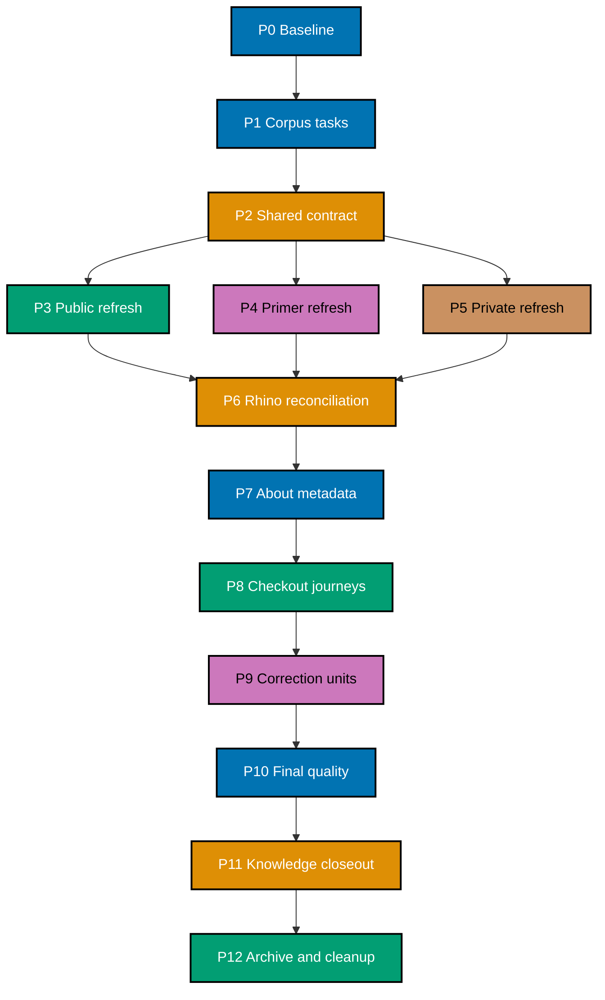

# 🚚 Delivery Checklist: Three-Repository README and Onboarding Refresh

> **Legend** — `[AI]`: an agent performs the step. Every executable checklist item in this plan is
> marked `[AI]`; there are no human approval, intervention, or merge gates. If execution discovers
> a task that genuinely requires a person or real-secret handling, stop that task as out of scope
> instead of adding a human participant.
> 🔐 **Hard safety rule**: Never read, write, quote, or commit real `.env*` files or secret values.
> Never copy private paths, hostnames, usernames, IP addresses, topology, credentials, access
> procedures, or account details into this plan, public docs, evidence, metadata, commits, or PRs.
> Use `.env.example`, variable names, `<placeholder>` tokens, path-free aggregates, and opaque
> digests only.

## Worktree

The plan-control worktree is `worktrees/repository-onboarding-readme-refresh/`. Before the first
change-producing phase, create it with `claude --worktree repository-onboarding-readme-refresh` from
the public repository root, verify the resulting path with `git worktree list`, and record the exact
branch in the Phase 0 execution record. This control worktree owns the plan artifacts; the per-unit
worktrees below own their delivery changes. Follow the
[Plans Organization Convention](../../../repo-governance/conventions/structure/plans.md#worktree-specification) for
provisioning and reconciliation.

## Delivery Mode and Worktrees

**Delivery mode: `worktree-to-pr`.** Every change-producing unit uses one exact worktree, one branch,
and one draft PR against that repository's `main`. AI runs the three-cycle PR Review Maker→Fixer
gate, verifies CI, and merges after all hardened preconditions hold. Phase 0 opens no PR and pushes
no branch.

The plan folder exists only in `ose-public`. `ose-primer` and `ose-private` never receive a companion
plan. Sessions may read approved sibling evidence but may write only inside their owning repository.

## Execution Records

Every task ID receives a durable row in the owning unit's execution record before its checkbox is
checked. Each row uses these fields:

```text
Task ID | Date | Status | Files Changed | Commands/Evidence | Notes
```

`Files Changed` lists every touched path or `None`. `Commands/Evidence` records commands and
pass/fail outcomes without raw secrets, private paths, or sensitive output. The execution record is
append-only across agents, compaction, and handoff. Each corpus ledger also expands every exact
document into its own `[AI]` task row; a family-level orchestration checkbox never substitutes for
the per-document result.

Exact record ownership:

- Phase 0 writes only to the gitignored public
  `local-temp/repository-onboarding-readme-refresh/execution-record-phase-0.md`; Phase 1 copies its
  sanitized outcomes into the contract record.
- Contract, public-refresh, and closeout units use
  `artifacts/execution-record-{contract,public,closeout}.md` inside this public plan.
- Metadata, fresh-checkout, and final read-only verification use the gitignored public
  `local-temp/repository-onboarding-readme-refresh/execution-record-verification-program.md`; it
  stores only safe status/evidence summaries and is created before Phase 7.
- Primer, private, Rhino, and correction units use
  `local-temp/repository-onboarding-readme-refresh/execution-record-<unit>.md` inside their owning
  repository. They are never committed across repository boundaries.
- Closeout publishes one path-free sibling summary per repository containing only revision,
  validation result, applicable PR identifiers, and opaque digest.

## AI-Only Integration Rules

At each delivery boundary, the phase carries separate checkboxes for worktree reconciliation,
formatting, Markdown/Rhino validation, generated-binding sync, secret gates, commit, push, draft PR,
three review cycles, forward-update, CI, and merge. Commit messages use Conventional Commits,
generated mirrors stay with their canonical source, and no commit message contains sensitive facts.

“Full unit gates” means running these exact commands from the owning repository root, plus any
additional command discovered from its pre-commit gate registry in Phase 0:

```bash
git diff --check
npm run format:md:check
npm run lint:md
cargo run --release --quiet --manifest-path apps/rhino-cli/Cargo.toml -- md mermaid validate
cargo run --release --quiet --manifest-path apps/rhino-cli/Cargo.toml -- md heading-hierarchy validate
cargo run --release --quiet --manifest-path apps/rhino-cli/Cargo.toml -- md links validate --exclude plans/done
cargo run --release --quiet --manifest-path apps/rhino-cli/Cargo.toml -- md readme-index validate
npm run validate:sync
npm exec nx -- affected -t typecheck,lint,test:quick,specs:coverage
npm exec nx -- affected -t build,test:quick,lint
cargo run --release --quiet --manifest-path apps/rhino-cli/Cargo.toml -- env staged-guard validate
```

For an unscoped repository-wide validator that reports pre-existing violations outside this
program's ledgered paths, record its baseline result and verify zero violations in every changed or
ledgered path instead. The merged PR's required affected-file checks are the final authoritative
gate for that validator. This is scope control, not a waiver: every violation in a changed,
generated, or ledgered path is fixed before the unit proceeds, and no failing required PR check may
merge.

The exact staged environment-file gate is:

```bash
cargo run --release --quiet --manifest-path apps/rhino-cli/Cargo.toml -- env staged-guard validate
```

The exact silent staged-credential pattern gate is below. `rg --quiet` prevents a match from echoing
the possible secret into logs:

```bash
if git diff --cached --no-ext-diff --unified=0 -- . | rg --quiet --pcre2 -e '-----BEGIN (RSA |EC |OPENSSH |DSA )?PRIVATE KEY-----|gh[pousr]_[A-Za-z0-9]{20,}|AKIA[0-9A-Z]{16}|xox[baprs]-[A-Za-z0-9-]{10,}|AIza[0-9A-Za-z_-]{30,}|sk_live_[0-9A-Za-z]{16,}|glpat-[0-9A-Za-z_-]{20,}'; then exit 1; fi
```

These deterministic gates are necessary but not sufficient. An independent AI reviewer must also
inspect the staged diff semantically for credentials, private context, connection strings, or
topology without copying the diff into public evidence. Metadata, commit messages, and PR text
receive the same AI semantic review because they are outside the staged file scan.

Every “full unit gates” task executes both deterministic gates above.

> **Important**: Fix every in-scope failure found by a quality gate, including a preexisting failure
> in a changed, generated, or ledgered path. Regenerate swept build artifacts and continue. Never
> bypass a required PR check. If a failure requires code, API, UI, or infrastructure behavior work,
> create and complete its separate blocking plan before resuming this documentation program.

For every PR unit, Phase 0 records every workflow name and required check-run name triggered by that
repository. After each push, enumerate all matching workflow runs with
`gh run list --branch <exact-branch> --limit 20 --json databaseId,name,status,conclusion`; select the
newest run for each recorded workflow, then poll every selected run every two minutes with
`gh run view <databaseId> --json status,conclusion`. Also query the PR's complete check set with
`gh pr checks <pr-number> --required`. Record each workflow name, run ID, check name, and sanitized
result in the unit record. A failed, cancelled, missing, or still-pending run/check is investigated,
fixed in the owning unit, pushed, and polled again; merge is forbidden until every named run and required
PR check succeeds.

## Parallelization Model

**Chosen N = 3.** After the shared contract merges, the public, primer, and private refresh units may
run in parallel. Document families within one repository serialize because they share a link graph,
reader journey, and corpus ledger. Shared Rhino paths serialize across repositories. Cleanup is the
terminal node.



### DAG Registry

| Node | Work                                                            | blockedBy     | blocks        |
| ---- | --------------------------------------------------------------- | ------------- | ------------- |
| P0   | Safe baseline                                                   | —             | P1            |
| P1   | Owning-repository corpus ledgers and exact task rows            | P0            | P2            |
| P2   | Shared fact, voice, journey, metadata, and sensitivity contract | P1            | PUB, PRI, PVT |
| PUB  | Complete `ose-public` documentation refresh                     | P2            | RH            |
| PRI  | Complete `ose-primer` documentation refresh                     | P2            | RH            |
| PVT  | Complete `ose-private` documentation refresh                    | P2            | RH            |
| RH   | Conditional documentation-only Rhino identity delivery          | PUB, PRI, PVT | META          |
| META | Exact About metadata for all three repositories                 | RH            | WALK          |
| WALK | Six fresh-checkout journeys                                     | META          | FIX           |
| FIX  | Conditional owning-repository correction PRs                    | WALK          | Q             |
| Q    | Full corpus, voice, mechanical, and sensitivity reconciliation  | FIX           | K             |
| K    | Sanitized evidence and knowledge capture                        | Q             | C             |
| C    | Archival, post-move inventory, and cleanup                      | K             | —             |

### Delivery Boundaries

| Phase / unit                 | Repository    | Exact branch                                    | Exact worktree                                                       | PR                        |
| ---------------------------- | ------------- | ----------------------------------------------- | -------------------------------------------------------------------- | ------------------------- |
| 0                            | all three     | —                                               | primary checkouts; tracked state read-only                           | none                      |
| 1–2 `contract`               | `ose-public`  | `docs/repository-onboarding-contract`           | `worktrees/repository-onboarding-readme-refresh-contract/`           | opens at Phase 2          |
| 3 `public`                   | `ose-public`  | `docs/repository-onboarding-public`             | `worktrees/repository-onboarding-readme-refresh-public/`             | opens at Phase 3          |
| 4 `primer`                   | `ose-primer`  | `docs/repository-onboarding-primer`             | `worktrees/repository-onboarding-readme-refresh-primer/`             | opens at Phase 4          |
| 5 `private`                  | `ose-private` | `docs/repository-onboarding-private`            | `worktrees/repository-onboarding-readme-refresh-private/`            | opens at Phase 5          |
| 6A `rhino-public` if needed  | `ose-public`  | `docs/rhino-readme-identity-public`             | `worktrees/rhino-readme-identity-public/`                            | conditional               |
| 6B `rhino-primer` if needed  | `ose-primer`  | `docs/rhino-readme-identity-primer`             | `worktrees/rhino-readme-identity-primer/`                            | conditional               |
| 6C `rhino-private` if needed | `ose-private` | `docs/rhino-readme-identity-private`            | `worktrees/rhino-readme-identity-private/`                           | conditional               |
| 7                            | all three     | —                                               | authenticated repository sessions                                    | none; metadata only       |
| 8                            | all three     | —                                               | explicit temporary clean clones                                      | none; verification only   |
| 9A `public-fixes-<nn>`       | `ose-public`  | `docs/repository-onboarding-public-fixes-<nn>`  | `worktrees/repository-onboarding-readme-refresh-public-fixes-<nn>/`  | conditional per iteration |
| 9B `primer-fixes-<nn>`       | `ose-primer`  | `docs/repository-onboarding-primer-fixes-<nn>`  | `worktrees/repository-onboarding-readme-refresh-primer-fixes-<nn>/`  | conditional per iteration |
| 9C `private-fixes-<nn>`      | `ose-private` | `docs/repository-onboarding-private-fixes-<nn>` | `worktrees/repository-onboarding-readme-refresh-private-fixes-<nn>/` | conditional per iteration |
| 10 verification              | all three     | —                                               | merged `main`, read-only                                             | none                      |
| 11–12 `closeout`             | `ose-public`  | `docs/repository-onboarding-closeout`           | `worktrees/repository-onboarding-readme-refresh-closeout/`           | opens at Phase 12         |

## Phase 0: Environment, Safety, and Baseline

- [ ] [AI] [P0-000] Create the exact gitignored Phase 0 execution record with the required schema —
      acceptance: `git status --short` does not list the record and it contains no repository data.
- [ ] [AI] [P0-001] Run `git status --short` in all three repository roots and record only path-level
      dirty-state facts in the exact gitignored Phase 0 execution record — acceptance: no existing
      change is claimed, edited, staged, or copied into plan evidence.
- [ ] [AI] [P0-002] Run `git fetch origin`, `git rev-parse main`, and `git rev-parse origin/main` in
      each repository — acceptance: each future unit is based on current `origin/main`, with any
      divergence resolved non-destructively before provisioning.
- [ ] [AI] [P0-003] Run
      `cargo run --release --quiet --manifest-path apps/rhino-cli/Cargo.toml -- gate list --surface=pre-commit --format=text`
      in each repository — acceptance: exact Markdown, generated-binding, and environment guard
      commands are recorded in the owning execution record.
- [ ] [AI] [P0-004] Run the exact staged environment-file gate in each repository without staging
      anything — acceptance: all three baselines exit 0.
- [ ] [AI] [P0-004A] Run the silent staged-credential pattern gate in each repository without staging
      anything — acceptance: all three baselines exit 0 and emit no candidate value.
- [ ] [AI] [P0-005] Run `npm run format:md:check` and `npm run lint:md` in each primary checkout —
      acceptance: baseline outcomes are recorded without modifying unrelated work.
- [ ] [AI] [P0-006] Run
      `gh repo view --json nameWithOwner,description,homepageUrl,repositoryTopics,url,visibility` for
      each repository — acceptance: only these safe fields are retained for rollback.
- [ ] [AI] [P0-006A] Inspect the workflows and required PR checks triggered by each repository and
      record their names without copying workflow secrets or private configuration — acceptance: each
      future PR unit has named CI checks and the exact run-polling procedure.
- [ ] [AI] [P0-007] Provision the exact plan-control worktree/branch, then provision the Phase 1–2
      contract worktree and branch from public
      `origin/main` — acceptance: `git worktree list` shows the declared path/branch pair.
- [ ] [AI] [P0-008] Run `npm install` and then `npm run doctor -- --fix` in the contract worktree —
      acceptance: both exit 0 and no real `.env*` is accessed.
- [ ] [AI] [P0-009] Run the public baseline gates in the contract worktree and classify each
      repository-wide result as ledgered-path or unrelated-baseline evidence — acceptance: every
      ledgered path is clean and any unrelated baseline result is recorded without expanding scope.

### Phase 0 Gate

- [ ] [AI] [P0-G01] Verify every P0 execution-record row is complete and Phase 0 opened no PR,
      pushed no branch, and mutated no metadata — acceptance: all baseline evidence is local and
      secret-free.

> **Pause Safety**: reader documentation and metadata remain unchanged. To resume, inspect the P0
> execution record and rerun only failed baselines.

## Phase 1: Corpus Inventories and Per-Document Task Registers

- [ ] [AI] [P1-000] Create `artifacts/execution-record-contract.md` and copy only sanitized Phase 0
      outcomes from the local record — acceptance: every copied row uses the required schema and no
      local path, dirty filename, raw output, or private fact enters the tracked artifact.
- [ ] [AI] [P1-001] Create `artifacts/reader-doc-disposition-ose-public.md` with repository revision,
      document kind, exact path, audience, purpose, sensitivity, disposition, owning unit, task ID,
      Date, Status, Files Changed, Commands/Evidence, and Notes — acceptance: the schema supports one
      executable row per tracked Markdown file without quoting document bodies.
- [ ] [AI] [P1-002] Populate the public ledger from
      `git ls-tree -r --name-only <recorded-public-origin-main-sha> -- '*.md'` — acceptance: every
      committed README is audit-required and each other path is classified reader-related,
      historical, generated, or `not-reader-doc` with a reason.
- [ ] [AI] [P1-003] In an `ose-primer` session, create
      `local-temp/repository-onboarding-readme-refresh/reader-doc-disposition-ose-primer.md` from
      `git ls-tree -r --name-only <recorded-primer-origin-main-sha> -- '*.md'` — acceptance: every
      committed primer Markdown path appears once and the live ledger never leaves `ose-primer`.
- [ ] [AI] [P1-004] In an `ose-private` session, create
      `local-temp/repository-onboarding-readme-refresh/reader-doc-disposition-ose-private.md` from
      `git ls-tree -r --name-only <recorded-private-origin-main-sha> -- '*.md'` — acceptance: the
      path-complete ledger never leaves `ose-private` and is never staged.
- [ ] [AI] [P1-005] In the private session, classify every private README as audit-required and every
      other Markdown path by reader relevance and sensitivity — acceptance: no living onboarding,
      setup, architecture, navigation, security, contribution, relationship, or directly linked
      operator document is omitted.
- [ ] [AI] [P1-006] Expand each audit-required or reader-related document into one exact `[AI]` task
      row in its owning ledger — acceptance: each row names one path, one direct action, its source
      of truth, exact applicable command, concrete acceptance criterion, and implementation fields.
- [ ] [AI] [P1-007] Mark `plans/done/**` and `archived/**` historical, generated mirrors generated,
      and shared Rhino paths identity-bound — acceptance: none is scheduled for ordinary hand-editing.
- [ ] [AI] [P1-008] Compute the primer ledger digest inside `ose-primer` and create
      `artifacts/reader-doc-disposition-ose-primer-summary.md` in the contract worktree — acceptance:
      the public summary contains only primer revision, validation result, and opaque digest.
- [ ] [AI] [P1-009] Review private path names inside the private session, compute the private ledger
      digest, and create `artifacts/reader-doc-disposition-ose-private-summary.md` — acceptance: the
      public summary contains only repository revision, validation result, and opaque digest; it
      contains no private path, count, or rationale.
- [ ] [AI] [P1-010] Add explicit `planned-new` task rows for this plan's execution artifacts and all
      three onboarding tutorials before evaluating inventory drift — acceptance: future known
      Markdown paths are not mistaken for unexplained extras.
- [ ] [AI] [P1-011] Reconcile each owning ledger with its recorded `origin/main` tree plus
      `planned-new` rows — acceptance: zero missing, duplicate, or unexplained extra paths and zero
      blank task fields.

### Phase 1 Gate

- [ ] [AI] [P1-G01] Have an independent AI plan reviewer sample task rows from every document class
      and validate the private summary boundary — acceptance: exact per-document execution is ready
      and no private path crossed into `ose-public`.

> **Pause Safety**: the complete corpus is enumerated and task-shaped, but reader docs remain
> unchanged. To resume, verify each ledger revision against its owning `main`.

## Phase 2: Shared Documentation Contract

- [ ] [AI] [P2-001] Record the source-of-truth matrix from `tech-docs.md` in the public ledger and
      both sibling-local ledgers/instructions — acceptance: all three owning ledgers name one
      authority for versions, projects, ports, product facts, relationships, contribution policy,
      and metadata.
- [ ] [AI] [P2-002] Record the Human Voice Contract and repository-specific reader paths from
      `prd.md` in every audit rubric — acceptance: product purpose leads, jargon is explained, emoji
      is purposeful, and repository openings are not templated clones.
- [ ] [AI] [P2-003] Record macOS and Ubuntu as supported and WSL2 as possibly workable but unsupported
      and unverified — acceptance: every platform task uses the same wording contract.
- [ ] [AI] [P2-004] Record closed external contribution intake and authorized
      `worktree-to-pr` guidance — acceptance: no task introduces an invitation, response-time
      promise, or direct-`main` workflow.
- [ ] [AI] [P2-005] Record exact GitHub descriptions, homepage URLs, and topic arrays from `prd.md` —
      acceptance: metadata execution cannot improvise values.
- [ ] [AI] [P2-006] Record the read, write, cross-repository, staged-diff, and knowledge-capture
      sensitivity gates — acceptance: public execution records cannot contain private paths or raw
      private outputs.
- [ ] [AI] [P2-007] Reconcile the contract unit file-touch ledger with `git status --short` and run
      `git diff --check` — acceptance: only declared plan files and artifacts are changed.
- [ ] [AI] [P2-007A] Stage only contract-ledger paths and inspect `git diff --cached --name-only` —
      acceptance: the staged set equals the contract file-touch ledger.
- [ ] [AI] [P2-008] Run `npm run format:md:check`, `npm run lint:md`, the repository-authoritative
      Rhino Markdown validators, `npm run validate:sync`, and the exact staged environment-file gate
      — acceptance: every command exits 0.
- [ ] [AI] [P2-009] Have an independent AI review the staged contract diff for secrets, private
      context, plan structure, and robotic prose — acceptance: zero CRITICAL, HIGH, or MEDIUM findings.
- [ ] [AI] [P2-010] Commit the contract unit with a Conventional Commit — acceptance: the commit
      contains one cohesive public plan/control-plane change and no unrelated file.
- [ ] [AI] [P2-011] Push the exact contract branch and open its draft PR against public `main` —
      acceptance: the PR links this megaplan and contains no raw private evidence.
- [ ] [AI] [P2-012] Run three sequential PR Review Maker→Fixer cycles — acceptance: every cycle is
      CI-gated, accepted findings are fixed, and the final synthesis has no unresolved finding.
- [ ] [AI] [P2-013] Forward-update from current public `origin/main`, rerun all unit gates, and verify
      PR CI — acceptance: the head is current and green without destructive history edits.
- [ ] [AI] [P2-014] Merge the contract PR as AI after all hardened preconditions hold — acceptance:
      public `main` contains the shared contract and task registers.

### Phase 2 Gate

- [ ] [AI] [P2-G01] Read the merged contract from public `origin/main` in all three owning sessions —
      acceptance: downstream work begins from one immutable contract revision.

> **Pause Safety**: the shared control contract is merged and independently useful. To resume,
> forward-update each repository unit from its current `origin/main`.

## Phase 3: Complete `ose-public` Documentation Refresh

- [ ] [AI] [P3-001] Provision the exact public unit worktree/branch from current public `origin/main`
      — acceptance: the declared pair appears in `git worktree list`.
- [ ] [AI] [P3-001A] Create `artifacts/execution-record-public.md` with the required schema —
      acceptance: all Phase 3 task IDs have rows before their checkboxes are checked.
- [ ] [AI] [P3-002] Run `npm install`, `npm run doctor -- --fix`, and baseline gates in the public
      unit — acceptance: setup and baseline checks pass before edits.
- [ ] [AI] [P3-003] Rewrite root `README.md` around product purpose, repository role, maturity,
      **Understand the product**, and **Run OSE locally** — acceptance: an early engineer or product
      person can select a path without reading build internals first.
- [ ] [AI] [P3-003A] Run
      `npm pkg set description='Open source platform for researching and building trustworthy, Sharia-compliant enterprise products.'`
      and read back with `jq -r '.description' package.json` — acceptance: exact equality with the
      package metadata contract.
- [ ] [AI] [P3-004] Align `CONTRIBUTING.md` with closed external intake and authorized
      `worktree-to-pr` delivery — acceptance: no public invitation, direct-`main` advice, or response
      promise remains.
- [ ] [AI] [P3-005] Add the narrow `CONTRIBUTING.md` staged-naming exemption in the authoritative
      public configuration — acceptance: `CONTRIBUTING.md` passes, while a plan-owned
      `local-temp/.../BAD-NAME.md` negative control produces the expected invalid-filename rule and
      is then removed.
- [ ] [AI] [P3-006] Close or supersede
      `plans/ideas/q2-not-urgent-important/contributing-md-trunk-guidance-and-naming-exemption.md`
      through the repository's idea lifecycle — acceptance: no duplicate live proposal remains.
- [ ] [AI] [P3-007] Create `docs/tutorials/getting-started-with-ose-public.md` and repair the
      root/docs/tutorial navigation — acceptance: the macOS/Ubuntu journey reaches the verified
      `ose-www:dev` target, expected page, recovery guidance, and next step.
- [ ] [AI] [P3-008] Execute every exact public document task row one at a time, including root,
      `apps/`, `libs/`, `specs/`, `infra/`, governance indexes, setup, architecture, relationship,
      security, plans, social-media, and other catch-all living surfaces — acceptance: every row has
      its own result and no cosmetic edit is manufactured.
- [ ] [AI] [P3-009] Regenerate harness mirrors only from canonical `.claude/` changes and run
      `npm run validate:sync` — acceptance: no generated mirror is hand-edited.
- [ ] [AI] [P3-010] Reconcile the public task register and append-only file-touch ledger —
      acceptance: every public task is terminal and every touched path belongs to this unit.
- [ ] [AI] [P3-010A] Compare the public ledger with sorted
      `git ls-files --cached --others --exclude-standard -- '*.md'`, adding one exact row for every
      generated or newly created Markdown path — acceptance: zero unexplained missing or extra paths.
- [ ] [AI] [P3-010B] Stage only ledger-owned public unit paths and inspect
      `git diff --cached --name-only` — acceptance: the staged set equals the file-touch ledger.
- [ ] [AI] [P3-011] Run `git diff --check`, formatting, Markdown lint, all Rhino Markdown validators,
      README-index validation, sync validation, affected gates, and the staged environment-file gate
      — acceptance: every applicable command exits 0.
- [ ] [AI] [P3-012] Run the README maker→checker→fixer cycle and an independent AI sensitivity/voice
      review over every changed living reader-facing file — acceptance: zero CRITICAL, HIGH, or
      MEDIUM findings and no secret or robotic passage.
- [ ] [AI] [P3-013] Commit the public unit with a Conventional Commit — acceptance: the commit
      contains only the cohesive public documentation refresh.
- [ ] [AI] [P3-014] Push the exact public unit branch — acceptance: `origin` contains the unit head.
- [ ] [AI] [P3-015] Open the public draft PR against `main` — acceptance: its declared file set and
      megaplan link are correct.
- [ ] [AI] [P3-016] Run three sequential PR Review Maker→Fixer cycles — acceptance: all accepted
      findings are fixed and each cycle's CI is green.
- [ ] [AI] [P3-017] Forward-update from public `origin/main` without destructive history edits —
      acceptance: the branch contains current `origin/main`.
- [ ] [AI] [P3-018] Rerun full unit gates and verify final PR CI — acceptance: every gate is green.
- [ ] [AI] [P3-019] Merge the public PR as AI — acceptance: public `main` contains the refresh.

### Phase 3 Gate

- [ ] [AI] [P3-G01] Verify the merged public README, onboarding tutorial, contribution posture,
      related-doc task register, and package description agree — acceptance: no public
      `follow-up-required` row remains and `git ls-tree -r --name-only origin/main -- '*.md'`
      matches the final ledger.

> **Pause Safety**: the public refresh is merged as one internally coherent reader journey. To
> resume, read its merged ledger revision and PR evidence.

## Phase 4: Complete `ose-primer` Documentation Refresh

- [ ] [AI] [P4-001] Provision the exact primer unit worktree/branch from current primer `origin/main`
      — acceptance: the declared pair appears in `git worktree list`.
- [ ] [AI] [P4-001A] Create the exact primer-local execution record — acceptance: every Phase 4 task
      ID has a row and `git status --short` does not list the record.
- [ ] [AI] [P4-002] Run `npm install`, `npm run doctor -- --fix`, and baseline gates in the primer
      unit — acceptance: setup and baseline checks pass before edits.
- [ ] [AI] [P4-003] Rewrite root `README.md` around starter purpose, reusable/template boundaries,
      **Understand the starter**, and **Run a reference app** — acceptance: it cannot be mistaken for
      the OSE product platform.
- [ ] [AI] [P4-003A] Run
      `npm pkg set description='A polyglot Nx starter with OSE governance, testing, automation, and reference apps already wired.'`
      and read back with `jq -r '.description' package.json` — acceptance: exact equality with the
      package metadata contract.
- [ ] [AI] [P4-004] Align `CONTRIBUTING.md` with closed external intake and authorized delivery —
      acceptance: public invitation, direct-`main` guidance, and response promises are absent.
- [ ] [AI] [P4-005] Add and test the narrow primer `CONTRIBUTING.md` exemption with the same expected
      invalid-filename negative control — acceptance: only the conventional filename is exempt.
- [ ] [AI] [P4-006] Create `docs/tutorials/getting-started-with-ose-primer.md` and repair reader
      navigation — acceptance: the macOS/Ubuntu journey reaches `crud-fe-ts-nextjs:dev`, explains
      example versus reusable content, and ends with adoption choices.
- [ ] [AI] [P4-007] Execute every exact primer document task row one at a time, including app/lib/spec
      READMEs, setup, architecture, relationships, navigation, governance, CI, and catch-all living
      surfaces — acceptance: every row has its own terminal result.
- [ ] [AI] [P4-008] Regenerate canonical mirrors when required and run `npm run validate:sync` —
      acceptance: generated surfaces match their owners.
- [ ] [AI] [P4-009] Reconcile the primer task register/file-touch ledger with sorted
      `git ls-files --cached --others --exclude-standard -- '*.md'` — acceptance: every task is
      terminal and every new/generated path has its own row.
- [ ] [AI] [P4-009A] Stage only ledger-owned primer unit paths and inspect
      `git diff --cached --name-only` — acceptance: the staged set equals the file-touch ledger.
- [ ] [AI] [P4-009B] Run the full unit gate set — acceptance: every command exits 0.
- [ ] [AI] [P4-010] Run the README cycle and independent AI sensitivity/voice review over every
      changed living reader-facing file — acceptance: zero CRITICAL, HIGH, or MEDIUM findings.
- [ ] [AI] [P4-011] Commit the primer unit with a Conventional Commit — acceptance: it contains only
      the cohesive starter documentation refresh.
- [ ] [AI] [P4-012] Push the exact primer unit branch — acceptance: `origin` contains the unit head.
- [ ] [AI] [P4-013] Open the primer draft PR against `main` — acceptance: its declared file set and
      megaplan link are correct.
- [ ] [AI] [P4-014] Run three sequential PR Review Maker→Fixer cycles — acceptance: all accepted
      findings are fixed and each cycle's CI is green.
- [ ] [AI] [P4-015] Forward-update from primer `origin/main` without destructive history edits —
      acceptance: the branch contains current `origin/main`.
- [ ] [AI] [P4-016] Rerun full unit gates and verify final PR CI — acceptance: every gate is green.
- [ ] [AI] [P4-017] Merge the primer PR as AI — acceptance: primer `main` contains the refresh.
- [ ] [AI] [P4-018] Compare the primer ledger with
      `git ls-tree -r --name-only origin/main -- '*.md'`, then recompute its validation result and
      digest — acceptance: the owning ledger is current and only its path-free summary enters closeout.

### Phase 4 Gate

- [ ] [AI] [P4-G01] Verify the merged primer entry points, task register, contribution posture, and
      package description agree — acceptance: no primer `follow-up-required` row remains.

> **Pause Safety**: the primer refresh is merged as one coherent starter journey. To resume, read
> its merged revision and PR evidence.

## Phase 5: Complete `ose-private` Documentation Refresh

- [ ] [AI] [P5-001] Provision the exact private unit worktree/branch from current private
      `origin/main` inside an authorized private session — acceptance: the declared pair appears in
      private `git worktree list` and no path is copied publicly.
- [ ] [AI] [P5-001A] Create the exact private-local execution record — acceptance: every Phase 5 task
      ID has a row and `git status --short` does not list the record.
- [ ] [AI] [P5-002] Run `npm install`, `npm run doctor -- --fix`, and private baseline gates —
      acceptance: setup succeeds without reading any real `.env*`.
- [ ] [AI] [P5-003] Rewrite private root `README.md` around safe CoralPolyp purpose,
      **Understand CoralPolyp**, **Run the local sandbox**, and the separate operator route —
      acceptance: removed demos, stale repository names, and an infrastructure-only identity are absent.
- [ ] [AI] [P5-003A] Run
      `npm pkg set description='Private product operations and infrastructure for authorized Open Sharia Enterprise maintainers.'`
      and read back with `jq -r '.description' package.json` — acceptance: exact equality with the
      package metadata contract and no operational detail.
- [ ] [AI] [P5-004] Align private `CONTRIBUTING.md` with authorization-only delivery and add/test the
      narrow filename exemption with the expected invalid-filename negative control — acceptance:
      external intake stays closed and no unrelated uppercase filename passes.
- [ ] [AI] [P5-005] Create `docs/tutorials/getting-started-with-ose-private.md` — acceptance: it uses
      placeholders, starts the local CoralPolyp backend/frontend, states expected health/page
      behavior, and never requires production access.
- [ ] [AI] [P5-006] Add a sandbox preflight that derives allowed variable names only from tracked
      `.env.example` and manifests, constructs an explicit sanitized child environment, validates
      every resolved service URL as local/loopback, and blocks outbound egress — acceptance: no
      ambient credential, telemetry, production account, or external integration reaches the run.
- [ ] [AI] [P5-007] Execute every exact private document task row one at a time, including structural
      indexes, CoralPolyp surfaces, infrastructure documentation, setup, architecture, repository
      relationships, security/reporting guidance, factual agent instructions, and directly linked
      operator guides — acceptance: each exact path stays only in the private ledger, remains in its
      owning sensitivity class, and has its own terminal result.
- [ ] [AI] [P5-008] Reconcile facts against the resolved private Nx project inventory without
      recording project counts or path names publicly — acceptance: stale language/tool/demo claims
      are removed inside `ose-private` only.
- [ ] [AI] [P5-009] Regenerate mirrors from canonical sources when required and run private
      `npm run validate:sync` — acceptance: no mirror is hand-edited.
- [ ] [AI] [P5-010] Reconcile the private task register/file-touch ledger with sorted
      `git ls-files --cached --others --exclude-standard -- '*.md'` — acceptance: every task is
      terminal and every new/generated path has its own private row.
- [ ] [AI] [P5-010A] Stage only ledger-owned private unit paths and inspect
      `git diff --cached --name-only` inside `ose-private` — acceptance: the staged set equals the
      private file-touch ledger and no path list is copied publicly.
- [ ] [AI] [P5-010B] Run the full private unit gate set — acceptance: every command exits 0.
- [ ] [AI] [P5-011] Run the README cycle and independent AI sensitivity/voice review over every
      changed living reader-facing private file — acceptance: zero CRITICAL, HIGH, or MEDIUM
      findings and no protected fact crosses into public evidence.
- [ ] [AI] [P5-012] Commit the private unit with a Conventional Commit — acceptance: it contains only
      the cohesive private documentation refresh.
- [ ] [AI] [P5-013] Push the exact private unit branch — acceptance: `origin` contains the unit head.
- [ ] [AI] [P5-014] Open the private draft PR against `main` — acceptance: PR text stays purpose-level
      and contains no private path inventory or raw output.
- [ ] [AI] [P5-015] Run three sequential PR Review Maker→Fixer cycles inside the private repository —
      acceptance: all accepted findings are fixed and each cycle's CI is green.
- [ ] [AI] [P5-016] Forward-update from private `origin/main` without destructive history edits —
      acceptance: the branch contains current `origin/main`.
- [ ] [AI] [P5-017] Rerun full unit gates and verify final PR CI — acceptance: every gate is green.
- [ ] [AI] [P5-018] Merge the private PR as AI — acceptance: private `main` contains the refresh.
- [ ] [AI] [P5-019] Recompute the private ledger validation result and digest inside `ose-private` —
      acceptance: `git ls-tree -r --name-only origin/main -- '*.md'` matches the private ledger and
      only the path-free post-merge summary is sent to the public closeout record.

### Phase 5 Gate

- [ ] [AI] [P5-G01] Verify private onboarding, full related-doc refresh, contribution policy, and
      sensitivity review are merged — acceptance: no private `follow-up-required` row remains and
      no private path appears in public artifacts.

> **Pause Safety**: private documentation is merged and protected. To resume, use only the private
> execution record and path-free public summary.

## Phase 6: Conditional Rhino Documentation Identity Delivery

- [ ] [AI] [P6-001] Run the canonical three-repository byte-identity comparison for
      `apps/rhino-cli/**` and `specs/apps/rhino/behavior/rhino-cli/gherkin/**` — acceptance: the exact
      bound sets are either unchanged and identical or the changed documentation paths are listed in
      private-safe owning records.
- [ ] [AI] [P6-002] If the boundary needs no change, record Phase 6 as not applicable with comparison
      evidence — acceptance: no Rhino PR or worktree is created.
- [ ] [AI] [P6-003] If source code or observable behavior must change, create and complete a separate
      blocking three-repository TDD/spec plan — acceptance: this docs plan resumes only after that
      prerequisite merges; no combined RED/GREEN/REFACTOR task exists here.

### Phase 6A: `ose-public` Rhino Documentation, If Needed

- [ ] [AI] [P6A-001] Provision and initialize the exact `rhino-public` worktree/branch from current
      public `origin/main` — acceptance: install, doctor, and baseline gates pass.
- [ ] [AI] [P6A-001A] Create the exact owning-unit execution record — acceptance: every Phase 6A task
      ID has a row before execution.
- [ ] [AI] [P6A-002] Apply only the approved canonical documentation bytes in the complete bound path
      set — acceptance: no non-documentation code or behavior changes.
- [ ] [AI] [P6A-003] Reconcile the public Rhino file-touch ledger — acceptance: only bound
      documentation files are present.
- [ ] [AI] [P6A-003A] Stage only ledger-owned Rhino paths — acceptance: the staged set equals the ledger.
- [ ] [AI] [P6A-003B] Run full unit gates — acceptance: every gate passes.
- [ ] [AI] [P6A-003C] Run an independent AI docs/sensitivity review — acceptance: zero CRITICAL,
      HIGH, or MEDIUM findings and no protected content.
- [ ] [AI] [P6A-004] Commit the public Rhino unit — acceptance: one Conventional Commit contains the
      canonical documentation bytes.
- [ ] [AI] [P6A-005] Push the exact public Rhino branch — acceptance: `origin` contains the unit head.
- [ ] [AI] [P6A-006] Open the public Rhino draft PR — acceptance: its file set contains only declared
      identity-bound documentation.
- [ ] [AI] [P6A-007] Run three PR Review Maker→Fixer cycles — acceptance: accepted findings are fixed.
- [ ] [AI] [P6A-008] Forward-update from public `origin/main` — acceptance: the head is current.
- [ ] [AI] [P6A-009] Rerun full gates and verify PR CI — acceptance: every result is green.
- [ ] [AI] [P6A-010] Merge the public Rhino PR as AI — acceptance: canonical bytes are on `main`.

#### Phase 6A Gate

- [ ] [AI] [P6A-G01] Verify the public Rhino documentation PR is merged or Phase 6 is not applicable —
      acceptance: no partial public boundary delivery exists.

> **Pause Safety**: the public boundary state is stable. To resume, compare primer against merged
> public bytes.

### Phase 6B: `ose-primer` Rhino Documentation, If Needed

- [ ] [AI] [P6B-001] Provision and initialize the exact `rhino-primer` worktree/branch from current
      primer `origin/main` — acceptance: install, doctor, and baseline gates pass.
- [ ] [AI] [P6B-001A] Create the exact owning-unit execution record — acceptance: every Phase 6B task
      ID has a row before execution.
- [ ] [AI] [P6B-002] Apply byte-identical copies of the merged public bound paths — acceptance:
      complete public↔primer comparison reports zero differing bytes.
- [ ] [AI] [P6B-003] Reconcile the primer Rhino file-touch ledger — acceptance: only bound
      documentation files are present and public↔primer bytes are identical.
- [ ] [AI] [P6B-003A] Stage only ledger-owned Rhino paths — acceptance: the staged set equals the ledger.
- [ ] [AI] [P6B-003B] Run full unit gates and byte comparison — acceptance: every gate passes.
- [ ] [AI] [P6B-003C] Run an independent AI docs/sensitivity review — acceptance: zero CRITICAL,
      HIGH, or MEDIUM findings and no protected content.
- [ ] [AI] [P6B-004] Commit the primer Rhino unit — acceptance: one Conventional Commit contains the
      identical documentation bytes.
- [ ] [AI] [P6B-005] Push the exact primer Rhino branch — acceptance: `origin` contains the unit head.
- [ ] [AI] [P6B-006] Open the primer Rhino draft PR — acceptance: its file set contains only declared
      identity-bound documentation.
- [ ] [AI] [P6B-007] Run three PR Review Maker→Fixer cycles — acceptance: accepted findings are fixed.
- [ ] [AI] [P6B-008] Forward-update from primer `origin/main` — acceptance: the head is current.
- [ ] [AI] [P6B-009] Rerun full gates, byte comparison, and PR CI — acceptance: all are green.
- [ ] [AI] [P6B-010] Merge the primer Rhino PR as AI — acceptance: identical bytes are on `main`.

#### Phase 6B Gate

- [ ] [AI] [P6B-G01] Verify the primer Rhino documentation PR is merged or Phase 6 is not applicable —
      acceptance: public and primer bytes are identical.

> **Pause Safety**: the first two boundary members are stable. To resume, compare private against
> both merged public repositories.

### Phase 6C: `ose-private` Rhino Documentation, If Needed

- [ ] [AI] [P6C-001] Provision and initialize the exact `rhino-private` worktree/branch from current
      private `origin/main` — acceptance: install, doctor, and baseline gates pass.
- [ ] [AI] [P6C-001A] Create the exact owning-unit execution record — acceptance: every Phase 6C task
      ID has a row before execution.
- [ ] [AI] [P6C-002] Apply byte-identical copies of the merged public/primer bound paths — acceptance:
      the three-way comparison reports zero differing bytes.
- [ ] [AI] [P6C-003] Reconcile the private Rhino file-touch ledger — acceptance: only bound
      documentation files are present and all three byte sets are identical.
- [ ] [AI] [P6C-003A] Stage only ledger-owned Rhino paths — acceptance: the staged set equals the ledger.
- [ ] [AI] [P6C-003B] Run full unit gates and three-way comparison — acceptance: every gate passes.
- [ ] [AI] [P6C-003C] Run an independent AI docs/sensitivity review — acceptance: zero CRITICAL,
      HIGH, or MEDIUM findings and no protected content.
- [ ] [AI] [P6C-004] Commit the private Rhino unit — acceptance: one Conventional Commit contains the
      identical documentation bytes.
- [ ] [AI] [P6C-005] Push the exact private Rhino branch — acceptance: `origin` contains the unit head.
- [ ] [AI] [P6C-006] Open the private Rhino draft PR — acceptance: its file set contains only declared
      identity-bound documentation and PR text reveals no private context.
- [ ] [AI] [P6C-007] Run three PR Review Maker→Fixer cycles — acceptance: accepted findings are fixed.
- [ ] [AI] [P6C-008] Forward-update from private `origin/main` — acceptance: the head is current.
- [ ] [AI] [P6C-009] Rerun full gates, three-way comparison, and PR CI — acceptance: all are green.
- [ ] [AI] [P6C-010] Merge the private Rhino PR as AI — acceptance: identical bytes are on `main`.

#### Phase 6C Gate

- [ ] [AI] [P6C-G01] Run the final canonical three-way byte-identity gate — acceptance: both bound
      path sets are identical across all three repositories.

> **Pause Safety**: Rhino documentation identity is either proven unchanged or merged identically
> across all three repositories. To resume, rerun the three-way identity gate.

### Phase 6 Gate

- [ ] [AI] [P6-G01] Verify all applicable Phase 6 subphase gates are complete — acceptance: no
      conditional branch remains ambiguous.

> **Pause Safety**: the shared boundary has one proven state. To resume, inspect P6-G01.

## Phase 7: Exact GitHub About Metadata

Use these exact mutation commands after the safe rollback capture. The topics endpoints replace the
whole array, so stale topics cannot survive:

```bash
gh repo edit wahidyankf/ose-public --description 'Open source platform for researching and building trustworthy, Sharia-compliant enterprise products.' --homepage 'https://oseplatform.com/'
gh api --method PUT repos/wahidyankf/ose-public/topics -f 'names[]=enterprise-software' -f 'names[]=erp' -f 'names[]=fsharp' -f 'names[]=islamic-finance' -f 'names[]=monorepo' -f 'names[]=nx' -f 'names[]=open-source' -f 'names[]=rust' -f 'names[]=sharia-compliant' -f 'names[]=typescript'

gh repo edit wahidyankf/ose-primer --description 'A polyglot Nx starter with OSE governance, testing, automation, and reference apps already wired.' --homepage 'https://oseplatform.com/'
gh api --method PUT repos/wahidyankf/ose-primer/topics -f 'names[]=automation' -f 'names[]=bdd' -f 'names[]=fsharp' -f 'names[]=nx' -f 'names[]=nx-monorepo' -f 'names[]=polyglot' -f 'names[]=repository-template' -f 'names[]=rust' -f 'names[]=tdd' -f 'names[]=testing' -f 'names[]=typescript'

gh repo edit wahidyankf/ose-private --description 'Private product operations and infrastructure for authorized Open Sharia Enterprise maintainers.' --homepage 'https://oseplatform.com/'
gh api --method PUT repos/wahidyankf/ose-private/topics -f 'names[]=automation' -f 'names[]=infrastructure' -f 'names[]=nx' -f 'names[]=open-sharia-enterprise' -f 'names[]=private-repository' -f 'names[]=product-operations' -f 'names[]=rust' -f 'names[]=typescript'
```

- [ ] [AI] [P7-000] Create the exact gitignored verification-program execution record with the
      required schema — acceptance: every Phase 7, 8, and 10 task ID has a row before execution and
      `git status --short` does not list the record.

- [ ] [AI] [P7-001] Validate every exact PRD description against GitHub field limits, every homepage
      as HTTPS, and every topic as a lowercase hyphenated slug — acceptance: all three value sets are
      mutation-ready without edits.
- [ ] [AI] [P7-002] Re-read the six approved safe prior fields for all repositories — acceptance:
      values match the Phase 0 rollback record or drift is investigated before mutation.
- [ ] [AI] [P7-003] Run `gh repo edit wahidyankf/ose-public` with the exact public description and
      homepage from `prd.md`, then replace topics through `gh api --method PUT
repos/wahidyankf/ose-public/topics` with the exact public array — acceptance: commands exit 0.
- [ ] [AI] [P7-004] Apply the exact primer description/homepage and replace its topics through the
      matching `wahidyankf/ose-primer` commands — acceptance: commands exit 0.
- [ ] [AI] [P7-005] Apply the exact private description/homepage and replace its topics through the
      matching `wahidyankf/ose-private` commands in an authorized session — acceptance: commands
      exit 0 and contain no operational detail.
- [ ] [AI] [P7-006] Read back `description,homepageUrl,repositoryTopics` with authenticated `gh` for
      each repository and compare exact set equality — acceptance: every value matches `prd.md`.
- [ ] [AI] [P7-007] If a mutation or readback fails, restore that repository's captured safe prior
      fields with AI-run CLI/API commands — acceptance: no repository remains partially updated.

### Phase 7 Gate

- [ ] [AI] [P7-G01] Verify exact metadata equality in all three repositories — acceptance: complete,
      distinct, secret-safe About metadata is live and rollback evidence is sanitized.

> **Pause Safety**: metadata is verified or automatically rolled back per repository. To resume,
> rerun the three safe readback queries.

## Phase 8: Six Fresh-Checkout Journeys

Each subphase uses a newly created `mktemp -d` location and removes only that exact temporary clone
after processes stop and evidence is safely recorded.

### Phase 8A: `ose-public` on macOS

- [ ] [AI] [P8A-001] Create one exact macOS `mktemp -d` directory, clone public `main` into it, and
      record the directory only in the local verification record — acceptance: the new clone has no
      checkout-local state.
- [ ] [AI] [P8A-002] Run only the documented public prerequisite and bootstrap commands in that clone
      — acceptance: every command succeeds without an undocumented prerequisite.
- [ ] [AI] [P8A-003] Run `npm exec nx show project ose-www --json` and record its declared dev target
      and loopback address — acceptance: the start command is derived from the repository, not guessed.
- [ ] [AI] [P8A-004] Start `ose-www:dev` with its declared Nx command and retain its process ID in the
      local record — acceptance: the target stays running for inspection.
- [ ] [AI] [P8A-005] Request the recorded loopback address with `curl --fail --silent --show-error` —
      acceptance: the response succeeds and contains the documented product-purpose cue.
- [ ] [AI] [P8A-006] Inspect that same address in a browser and its console — acceptance: product
      context is visible and no console error appears.
- [ ] [AI] [P8A-007] Stop the recorded child process, verify clean status, and remove only the exact
      temporary clone — acceptance: no process or temporary checkout remains.

#### Phase 8A Gate

- [ ] [AI] [P8A-G01] Record the sanitized result, stop proof, and cleanup result; create a Phase 9
      correction row for any failure — acceptance: no mutable macOS public-journey state remains.

> **Pause Safety**: the public macOS clone and child process are gone; resume from its sanitized row.

### Phase 8B: `ose-public` on Ubuntu

- [ ] [AI] [P8B-001] Create one exact Ubuntu `mktemp -d` clone of public `main` and run only its
      documented bootstrap — acceptance: setup succeeds without checkout-local state.
- [ ] [AI] [P8B-002] Resolve and start `ose-www:dev` with `npm exec nx show project ose-www --json`
      followed by its declared Nx command — acceptance: the process ID and loopback address are recorded.
- [ ] [AI] [P8B-003] Use `curl --fail --silent --show-error` on that address, then inspect the page and
      browser console — acceptance: the documented product context appears with no console error.
- [ ] [AI] [P8B-004] Stop the recorded process, verify clean status, and remove only the exact clone —
      acceptance: cleanup passes.

#### Phase 8B Gate

- [ ] [AI] [P8B-G01] Record the sanitized result, stop proof, and Phase 9 correction row if needed —
      acceptance: no mutable Ubuntu public-journey state remains.

> **Pause Safety**: the public Ubuntu clone and child process are gone; resume from its sanitized row.

### Phase 8C: `ose-primer` on macOS

- [ ] [AI] [P8C-001] Create one exact macOS `mktemp -d` clone of primer `main` and follow only its
      tutorial — acceptance: bootstrap succeeds without prior OSE knowledge.
- [ ] [AI] [P8C-002] Resolve `crud-fe-ts-nextjs:dev` with `npm exec nx show project crud-fe-ts-nextjs --json`
      — acceptance: the declared start command and loopback address are recorded.
- [ ] [AI] [P8C-003] Start the declared target and request its loopback address with
      `curl --fail --silent --show-error` — acceptance: the reference app responds.
- [ ] [AI] [P8C-004] Inspect the same page and browser console — acceptance: its reusable/example
      boundary is visible and no console error appears.
- [ ] [AI] [P8C-005] Stop the recorded process, verify clean status, and remove only the exact clone —
      acceptance: cleanup passes.

#### Phase 8C Gate

- [ ] [AI] [P8C-G01] Record the sanitized result, stop proof, and Phase 9 correction row if needed —
      acceptance: no mutable macOS primer-journey state remains.

> **Pause Safety**: the primer macOS clone and child process are gone; resume from its sanitized row.

### Phase 8D: `ose-primer` on Ubuntu

- [ ] [AI] [P8D-001] Create one exact Ubuntu `mktemp -d` clone of primer `main` and run only its tutorial
      — acceptance: bootstrap succeeds without prior OSE knowledge.
- [ ] [AI] [P8D-002] Resolve/start `crud-fe-ts-nextjs:dev` from `npm exec nx show project crud-fe-ts-nextjs --json`
      — acceptance: the process ID and loopback address are recorded.
- [ ] [AI] [P8D-003] Request that address with `curl --fail --silent --show-error`, then inspect its page
      and browser console — acceptance: the reference app loads without an undocumented prerequisite.
- [ ] [AI] [P8D-004] Stop the recorded process, verify clean status, and remove only the exact clone —
      acceptance: cleanup passes.

#### Phase 8D Gate

- [ ] [AI] [P8D-G01] Record the sanitized result, stop proof, and Phase 9 correction row if needed —
      acceptance: no mutable Ubuntu primer-journey state remains.

> **Pause Safety**: the primer Ubuntu clone and child process are gone; resume from its sanitized row.

### Phase 8E: `ose-private` on macOS

- [ ] [AI] [P8E-001] Create an authorized macOS `mktemp -d` clone of private `main`; record its exact
      path only in the private local record — acceptance: checkout succeeds without reading real `.env*`.
- [ ] [AI] [P8E-002] Derive the allowlisted variable names from tracked private examples/manifests only
      and construct the sanitized child environment — acceptance: the private record proves no ambient
      secret was inherited without recording values.
- [ ] [AI] [P8E-003] Apply the tracked, OS-appropriate private sandbox command that binds services to
      loopback and blocks outbound network access — acceptance: the private record proves egress is
      blocked before either target starts.
- [ ] [AI] [P8E-004] Resolve the declared CoralPolyp backend target with `npm exec nx show project
      coralpolyp-be --json` in the private clone — acceptance: its exact declared local start command
      and health route are retained only in the private record.
- [ ] [AI] [P8E-005] Resolve the declared CoralPolyp frontend target with `npm exec nx show project
      coralpolyp-fe --json` in the private clone — acceptance: its exact declared local start command
      and loopback address are retained only in the private record.
- [ ] [AI] [P8E-006] Start the backend inside the sanitized, egress-blocked sandbox and request its
      recorded loopback health route with `curl --fail --silent --show-error` — acceptance: local
      health succeeds without a real credential.
- [ ] [AI] [P8E-007] Start the frontend in the same sandbox and request its recorded loopback address
      with `curl --fail --silent --show-error` — acceptance: the local page responds.
- [ ] [AI] [P8E-008] Inspect the frontend page and browser console — acceptance: the documented local
      experience appears with no console error.
- [ ] [AI] [P8E-009] Inspect active connections using the tracked OS-appropriate private command —
      acceptance: the private record proves loopback-only connectivity and zero external connection.
- [ ] [AI] [P8E-010] Stop recorded processes/containers, verify no child remains and clean status, then
      remove only the exact clone — acceptance: private cleanup passes without public evidence.

#### Phase 8E Gate

- [ ] [AI] [P8E-G01] Record a sanitized pass/fail, stop proof, and Phase 9 correction row; retain all
      commands, paths, and detailed evidence only in the private record — acceptance: no mutable
      macOS private-journey state remains.

> **Pause Safety**: the private macOS clone, sandbox, and child processes are gone; resume from its
> private sanitized row only.

### Phase 8F: `ose-private` on Ubuntu

- [ ] [AI] [P8F-001] Create an authorized Ubuntu `mktemp -d` clone of private `main` and run only the
      documented bootstrap — acceptance: setup succeeds without reading real `.env*`.
- [ ] [AI] [P8F-002] Derive allowed names from tracked examples/manifests and construct a sanitized
      child environment — acceptance: the private record proves no ambient secret was inherited.
- [ ] [AI] [P8F-003] Apply the tracked Ubuntu sandbox command that binds services to loopback and blocks
      egress before starting services — acceptance: external integrations are unavailable.
- [ ] [AI] [P8F-004] Resolve both declared targets with `npm exec nx show project coralpolyp-be --json`
      and `npm exec nx show project coralpolyp-fe --json` — acceptance: their private-only start and
      endpoint details are recorded.
- [ ] [AI] [P8F-005] Start the backend, then use `curl --fail --silent --show-error` on its recorded
      loopback health route — acceptance: local health succeeds without a real credential.
- [ ] [AI] [P8F-006] Start the frontend, use `curl --fail --silent --show-error` on its recorded
      loopback address, then inspect its page and browser console — acceptance: local behavior passes.
- [ ] [AI] [P8F-007] Inspect active connections with the tracked private command — acceptance: the
      private record proves loopback-only connectivity and zero external connection.
- [ ] [AI] [P8F-008] Stop recorded processes/containers, verify no child remains and clean status, then
      remove only the exact clone — acceptance: private cleanup passes without public evidence.

#### Phase 8F Gate

- [ ] [AI] [P8F-G01] Record a sanitized pass/fail, stop proof, and Phase 9 correction row; retain all
      commands, paths, and detailed evidence only in the private record — acceptance: no mutable
      Ubuntu private-journey state remains.

> **Pause Safety**: the private Ubuntu clone, sandbox, and child processes are gone; resume from its
> private sanitized row only.

### Phase 8 Gate

- [ ] [AI] [P8-G01] Record a sanitized outcome for all six repository×OS journeys in the closeout
      verification-program record — acceptance: each names pass/fail and public-safe evidence only,
      with no raw private command output, path, screenshot, or environment data.

> **Pause Safety**: all temporary journeys are stopped and removed; failures are recorded as exact
> correction tasks. To resume, inspect only the sanitized P8 outcomes and owning private record.

## Phase 9: Conditional Owning-Repository Correction Units

For each repository, create one exact correction row per Phase 8 or cross-repository defect. If a
repository has zero defects, record its subphase not applicable and create no worktree or PR. Set
`<nn>` to `01` for the first owning-repository correction unit and increment it for every Phase 10
loopback. Each iteration gets a new branch, worktree, PR, and execution record; never reuse a merged
unit. Append `@<nn>` to its Phase 9 task IDs in the owning record.

### Phase 9A: Public Corrections, If Needed

- [ ] [AI] [P9A-001] Provision/initialize the exact public-fixes worktree when public defects exist —
      acceptance: install, doctor, and baseline gates pass; otherwise record not applicable.
- [ ] [AI] [P9A-001A] Create the exact owning-unit execution record when applicable — acceptance:
      every Phase 9A task ID has a row.
- [ ] [AI] [P9A-002] Execute each exact public correction row separately and rerun its failed journey —
      acceptance: every defect is fixed and no product behavior change is smuggled into docs.
- [ ] [AI] [P9A-003] Reconcile and stage only public correction-ledger paths — acceptance: every
      correction is owned and the staged set equals the ledger.
- [ ] [AI] [P9A-003A] Run full unit gates — acceptance: every command exits 0.
- [ ] [AI] [P9A-003B] Run an independent AI docs/sensitivity review — acceptance: zero CRITICAL,
      HIGH, or MEDIUM findings.
- [ ] [AI] [P9A-004] Commit the public correction unit — acceptance: one cohesive Conventional Commit.
- [ ] [AI] [P9A-005] Push the public correction branch — acceptance: `origin` contains the head.
- [ ] [AI] [P9A-006] Open the public correction draft PR — acceptance: its scope matches defect rows.
- [ ] [AI] [P9A-007] Run three PR Review Maker→Fixer cycles — acceptance: findings are resolved.
- [ ] [AI] [P9A-008] Forward-update from public `origin/main` — acceptance: the head is current.
- [ ] [AI] [P9A-009] Rerun gates, the failed journey, and PR CI — acceptance: all are green.
- [ ] [AI] [P9A-010] Merge the public correction PR as AI — acceptance: fixes are on `main`.

#### Phase 9A Gate

- [ ] [AI] [P9A-G01] Verify public corrections are merged or explicitly not applicable — acceptance:
      no public journey defect remains.

> **Pause Safety**: the public correction state is terminal.

### Phase 9B: Primer Corrections, If Needed

- [ ] [AI] [P9B-001] Provision/initialize the exact primer-fixes worktree when primer defects exist —
      acceptance: install, doctor, and baseline gates pass; otherwise record not applicable.
- [ ] [AI] [P9B-001A] Create the exact owning-unit execution record when applicable — acceptance:
      every Phase 9B task ID has a row.
- [ ] [AI] [P9B-002] Execute each exact primer correction row and rerun its failed journey —
      acceptance: every defect is fixed.
- [ ] [AI] [P9B-003] Reconcile and stage only primer correction-ledger paths — acceptance: every
      correction is owned and the staged set equals the ledger.
- [ ] [AI] [P9B-003A] Run full unit gates — acceptance: every command exits 0.
- [ ] [AI] [P9B-003B] Run an independent AI docs/sensitivity review — acceptance: zero CRITICAL,
      HIGH, or MEDIUM findings.
- [ ] [AI] [P9B-004] Commit the primer correction unit — acceptance: one cohesive Conventional Commit.
- [ ] [AI] [P9B-005] Push the primer correction branch — acceptance: `origin` contains the head.
- [ ] [AI] [P9B-006] Open the primer correction draft PR — acceptance: its scope matches defect rows.
- [ ] [AI] [P9B-007] Run three PR Review Maker→Fixer cycles — acceptance: findings are resolved.
- [ ] [AI] [P9B-008] Forward-update from primer `origin/main` — acceptance: the head is current.
- [ ] [AI] [P9B-009] Rerun gates, the failed journey, and PR CI — acceptance: all are green.
- [ ] [AI] [P9B-010] Merge the primer correction PR as AI — acceptance: fixes are on `main`.

#### Phase 9B Gate

- [ ] [AI] [P9B-G01] Verify primer corrections are merged or explicitly not applicable — acceptance:
      no primer journey defect remains.

> **Pause Safety**: the primer correction state is terminal.

### Phase 9C: Private Corrections, If Needed

- [ ] [AI] [P9C-001] Provision/initialize the exact private-fixes worktree when private defects exist —
      acceptance: install, doctor, and baseline gates pass; otherwise record not applicable.
- [ ] [AI] [P9C-001A] Create the exact owning-unit execution record when applicable — acceptance:
      every Phase 9C task ID has a row.
- [ ] [AI] [P9C-002] Execute each exact private correction row and rerun its failed sandbox journey —
      acceptance: every defect is fixed without public evidence or real secrets.
- [ ] [AI] [P9C-003] Reconcile and stage only private correction-ledger paths — acceptance: every
      correction is owned and the staged set equals the private ledger.
- [ ] [AI] [P9C-003A] Run full private unit gates — acceptance: every command exits 0.
- [ ] [AI] [P9C-003B] Run an independent AI docs/sensitivity review — acceptance: zero CRITICAL,
      HIGH, or MEDIUM findings and no protected content crosses repositories.
- [ ] [AI] [P9C-004] Commit the private correction unit — acceptance: one cohesive Conventional Commit.
- [ ] [AI] [P9C-005] Push the private correction branch — acceptance: `origin` contains the head.
- [ ] [AI] [P9C-006] Open the private correction draft PR — acceptance: its scope matches defect rows
      and its text contains no protected detail.
- [ ] [AI] [P9C-007] Run three PR Review Maker→Fixer cycles — acceptance: findings are resolved.
- [ ] [AI] [P9C-008] Forward-update from private `origin/main` — acceptance: the head is current.
- [ ] [AI] [P9C-009] Rerun gates, the failed sandbox journey, and PR CI — acceptance: all are green.
- [ ] [AI] [P9C-010] Merge the private correction PR as AI — acceptance: fixes are on `main`.

#### Phase 9C Gate

- [ ] [AI] [P9C-G01] Verify private corrections are merged or explicitly not applicable — acceptance:
      no private journey defect remains and no protected detail crossed repositories.

> **Pause Safety**: the private correction state is terminal.

### Phase 9 Gate

- [ ] [AI] [P9-G01] Verify all three correction subphase gates — acceptance: every discovered defect
      is fixed and merged; no deferral or `follow-up-required` state remains.

> **Pause Safety**: all behavioral documentation defects are closed. To resume, rerun Phase 8 only
> if an owning repository changed afterward.

## Phase 10: Full-Corpus Quality and Safety Reconciliation

- [ ] [AI] [P10-001] Reinventory all tracked Markdown at current `main` in every repository and
      reconcile owning ledgers with `git ls-tree -r --name-only origin/main -- '*.md'` — acceptance:
      zero missing/duplicate paths and every reader task is terminal; any mismatch creates an exact
      Phase 9 correction row before Phase 10 restarts.
- [ ] [AI] [P10-002] Run all repository-authoritative formatting, Markdown lint, Rhino Markdown,
      README-index, generated-sync, affected, and staged-environment gates — acceptance: every
      applicable command exits 0.
- [ ] [AI] [P10-003] Run strict docs and README checkers in read-only mode in all three repositories —
      acceptance: two consecutive independent checks report zero CRITICAL, HIGH, or MEDIUM
      findings; any finding returns to the owning Phase 9 correction unit before Phase 10 restarts.
- [ ] [AI] [P10-004] Have an AI reviewer distinct from each file's writer read every changed living
      reader-facing document aloud against the Human Voice Contract — acceptance: every file passes;
      any stock filler, repetitive cadence, or template-like opening becomes an owning Phase 9
      correction row before Phase 10 restarts.
- [ ] [AI] [P10-005] Cross-read contribution, platform support, content parity, Rhino byte identity,
      repository purpose, package descriptions, and About metadata — acceptance: all current claims
      agree while repository positioning stays distinct; documentation findings return to Phase 9
      and metadata mismatches return to Phase 7 before Phase 10 restarts.
- [ ] [AI] [P10-006] Run both deterministic secret gates and independent AI semantic sensitivity
      review over plan artifacts, all repository diffs, evidence, metadata, commits, and PR text —
      acceptance: zero secret, private path, protected fact, or operational leak; a suspected leak
      stops ordinary execution and invokes the repository security-incident route.

### Phase 10 Gate

- [ ] [AI] [P10-G01] Verify every mechanical, reader, voice, relationship, journey, and sensitivity
      result is green — acceptance: no unresolved finding of any severity blocks closeout.

> **Pause Safety**: the delivered documentation system is fully reconciled. To resume, compare the
> recorded repository revisions with current `main` before trusting the results.

## Phase 11: Sanitized Closeout and Knowledge Capture

- [ ] [AI] [P11-001] Provision/initialize the exact public closeout worktree from current public
      `origin/main` — acceptance: install, doctor, and baseline gates pass.
- [ ] [AI] [P11-001A] Create `artifacts/execution-record-closeout.md` with the required schema —
      acceptance: every Phase 11–12 task ID has a row before execution.
- [ ] [AI] [P11-002] Create or update `evidence/README.md` as a sanitized index of contract PRs,
      repository PRs, metadata equality, six journey outcomes, and quality gates — acceptance: it
      contains no raw output, screenshot, private path, environment data, or authentication state.
- [ ] [AI] [P11-002A] Ingest only sanitized terminal rows from the verification-program record into
      `artifacts/execution-record-closeout.md` — acceptance: Phase 7, 8, and 10 outcomes are durable
      without local paths, raw output, authentication state, or private facts.
- [ ] [AI] [P11-003] Update the primer and private path-free summaries from their post-correction
      revisions, results, and opaque digests — acceptance: an independent AI confirms that neither
      summary contains sibling paths, counts, rationales, or raw output.
- [ ] [AI] [P11-003A] Create `artifacts/execution-summary-ose-primer.md` and
      `artifacts/execution-summary-ose-private.md` from owning local records — acceptance: each
      contains only revision, validation result, applicable PR identifiers, and opaque digest.
- [ ] [AI] [P11-004] Reconcile every execution-record row and per-document task row — acceptance: no
      blank status or `follow-up-required` state remains.
- [ ] [AI] [P11-005] Apply the generalization, secret/sensitivity, and repository-relevance gates to
      every `learnings.md` entry — acceptance: each entry is routed to one durable home, converted to
      a separately scoped backlog item, discarded with a reason, or recorded as no generalizable learning.
- [ ] [AI] [P11-006] Reconcile the closeout worktree file-touch ledger — acceptance: only sanitized
      plan, evidence, and learning paths are changed.

### Phase 11 Gate

- [ ] [AI] [P11-G01] Verify all ledgers, evidence, and learnings have terminal safe states —
      acceptance: closeout is ready for archival without another repository change.

> **Pause Safety**: delivery is complete and closeout artifacts are staged only in the exact public
> worktree. To resume, rerun its sensitivity review before archival.

## Phase 12: Plan Archival, Post-Move Inventory, and Cleanup

- [ ] [AI] [P12-001] Verify every phase/subphase gate, repository PR, metadata equality check, and
      journey result is complete — acceptance: no ambiguous conditional branch or unchecked required task remains.
- [ ] [AI] [P12-002] Move the plan with
      `git mv plans/in-progress/repository-onboarding-readme-refresh plans/done/<completion-date>__repository-onboarding-readme-refresh`
      and update in-progress/done indexes — acceptance: the date is the actual archival date and all
      links resolve.
- [ ] [AI] [P12-003] Re-run the public tracked-Markdown inventory against the staged post-move index
      and update the public ledger — acceptance: moved plan/evidence READMEs and both plan indexes
      have correct final paths and terminal dispositions.
- [ ] [AI] [P12-004] Run `git diff --check`, all public Markdown/Rhino/index/sync/affected gates, the
      staged environment-file guard, the silent staged-credential pattern gate, and independent AI
      sensitivity review after archival — acceptance: all pass on the exact final diff.
- [ ] [AI] [P12-005] Commit the closeout/archive unit with a Conventional Commit — acceptance: it
      contains only sanitized closeout and archival changes.
- [ ] [AI] [P12-006] Push the exact closeout branch — acceptance: `origin` contains the unit head.
- [ ] [AI] [P12-007] Open the closeout draft PR against public `main` — acceptance: its scope and
      archived-plan links are correct.
- [ ] [AI] [P12-008] Run three sequential PR Review Maker→Fixer cycles — acceptance: every accepted
      finding is fixed and all cycle CI checks are green.
- [ ] [AI] [P12-009] Forward-update from public `origin/main` without destructive history edits —
      acceptance: the branch contains current `origin/main`.
- [ ] [AI] [P12-010] Rerun final gates and verify PR CI — acceptance: every result is green.
- [ ] [AI] [P12-011] Merge the closeout PR as AI — acceptance: the plan exists under `plans/done/` on
      public `origin/main` and no stale in-progress link remains.
- [ ] [AI] [P12-012] For every exact plan-created worktree, use `gh pr list --head <branch> --state
all --json number,state,mergedAt`, `git -C <worktree> status --porcelain`, and `git -C
<worktree> log origin/<branch>..<branch>` to prove merged, clean, and fully pushed state —
      acceptance: an unsafe or uncertain worktree is left intact and recorded, never force-removed.
- [ ] [AI] [P12-013] Use non-force `git worktree remove <exact-validated-path>` and merged-only branch
      cleanup for every safe plan-owned unit — acceptance: no shared cache, unrelated worktree,
      unmerged branch, or object store is touched.
- [ ] [AI] [P12-014] Stop and remove any plan-created temporary process/container/artifact after
      proving exact ownership and idle state — acceptance: shared caches and unrelated artifacts remain untouched.
- [ ] [AI] [P12-015] Run `git worktree list` and safe branch/temporary-artifact checks in all three
      repositories — acceptance: every plan-owned item is removed or explicitly retained because an
      AI safety precondition failed.

### Phase 12 Gate

- [ ] [AI] [P12-G01] Verify the archived plan, repository documentation, metadata, ledgers, evidence,
      knowledge capture, and cleanup are complete on current `origin/main` — acceptance: the
      three-repository program has no remaining authorized work.

> **Pause Safety**: the program is merged, archived, and safely cleaned up. Reverification starts
> from the archived plan and the final sanitized execution record.
