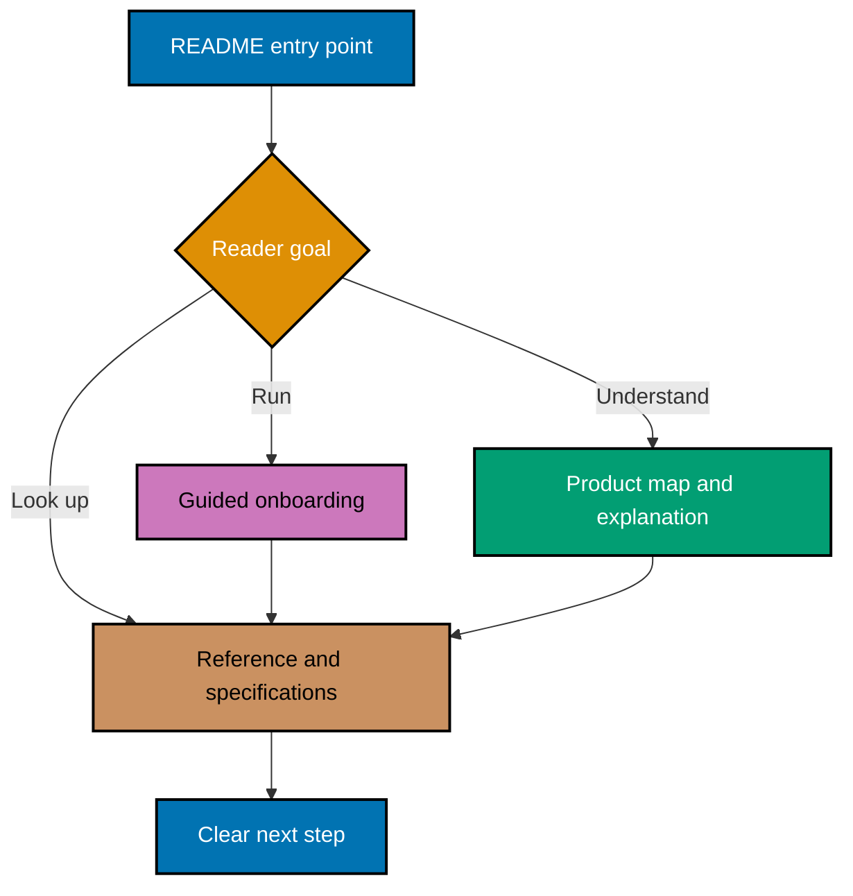
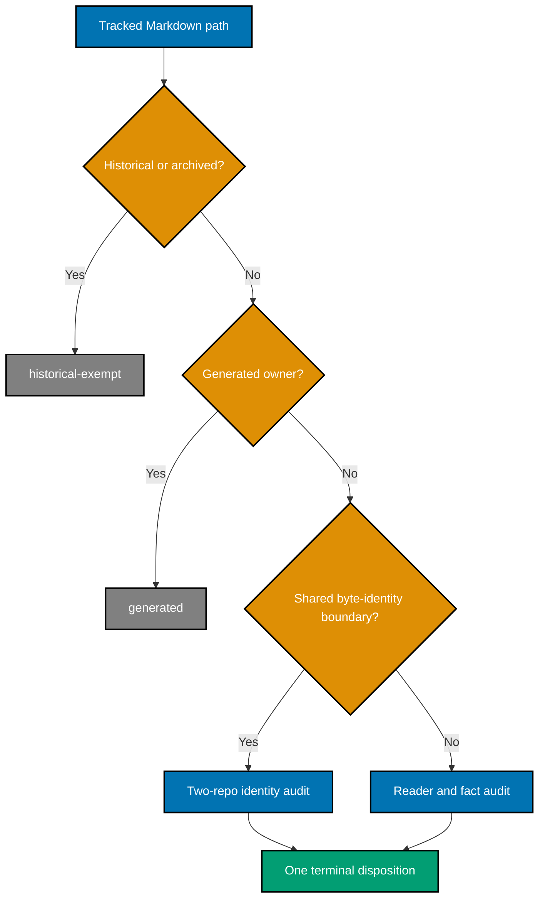
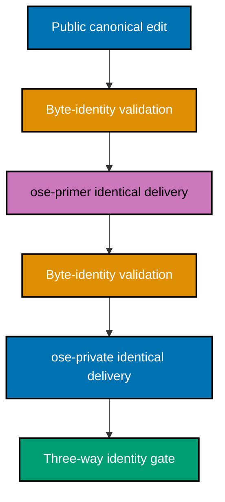

# 🏗️ Technical Design: Two-Repository Documentation System

> **Scope Amendment (2026-08-16)** — `ose-primer` left this repository's parity set and carries no
> sync obligation; see
> [Related Repositories §Repositories outside the parity set](../../../docs/reference/related-repositories.md#repositories-outside-the-parity-set).
> Its already-merged units stay as historical record; every unexecuted `ose-primer` unit is
> **descoped**, not deferred. References to `ose-primer` below are historical context, not
> outstanding scope. See `delivery.md` §Scope Amendment for the item-level disposition.

## Architecture Overview

The plan treats documentation as a routed system with four layers:

1. **Entry points** choose the reader path.
2. **Guided onboarding** produces the first meaningful outcome.
3. **Reference and specifications** own durable facts.
4. **Disposition and validation artifacts** prove coverage without becoming reader documentation.



## Source-of-Truth Matrix

| Fact class                 | Authoritative source                                | README treatment                                                                    | Validation                                                     |
| -------------------------- | --------------------------------------------------- | ----------------------------------------------------------------------------------- | -------------------------------------------------------------- |
| Node/npm versions          | Each repository's `package.json` `volta` object     | Link or show a command that reads the manifest; avoid copied pins unless essential. | `jq '.volta' package.json`                                     |
| Project inventory          | Resolved Nx workspace                               | Describe only current projects.                                                     | `npm exec nx show projects -- --json`                          |
| Project targets and ports  | `npm exec nx show project <project> -- --json`      | Use package-manager-prefixed commands and state expected behavior.                  | Parse `targets` before smoke-running.                          |
| Product status and roadmap | Repository-owned roadmap and product specifications | Summarize purpose; link for detail.                                                 | Cross-read the named canonical file.                           |
| Behavior and architecture  | `specs/**` and focused reference/explanation docs   | README links rather than duplicating design.                                        | Link and readme-index validation.                              |
| Contribution posture       | Root policy plus `CONTRIBUTING.md`                  | State closed external intake consistently.                                          | Cross-repository phrase and link audit.                        |
| Delivery mode              | Plans and trunk/worktree governance                 | Teach `worktree-to-pr` for authorized contributors.                                 | Link check plus workflow review.                               |
| Repository relationships   | Canonical ecosystem instructions                    | Distinguish public↔private content parity from two-repo Rhino byte identity.        | Two-repository text audit.                                     |
| GitHub About metadata      | GitHub repository fields                            | Root README and About panel must agree in intent.                                   | `gh repo view --json description,homepageUrl,repositoryTopics` |
| Package description        | Exact PRD package metadata contract                 | Package tooling and repository positioning must agree.                              | `jq -r '.description' package.json`                            |
| Private operational facts  | Authorized `ose-private` sources only               | Never copy to public plans/docs; summarize purpose with placeholders.               | Secret scan plus independent AI sensitivity review.            |

## Design Decisions

| Decision                                                                            | Why                                                                                                                                                                                                                                                                                                    |
| ----------------------------------------------------------------------------------- | ------------------------------------------------------------------------------------------------------------------------------------------------------------------------------------------------------------------------------------------------------------------------------------------------------ |
| Inventory all tracked Markdown, but require every README to receive a reader audit. | This catches directly related non-README docs without turning historical records or product content into rewrite targets.                                                                                                                                                                              |
| Keep path-complete private evidence inside `ose-private`.                           | Private path names can reveal operational context even when document bodies are omitted.                                                                                                                                                                                                               |
| Use repository-specific journey labels beneath a shared product-first opening.      | Readers see one ecosystem without mistaking a product platform, a starter, and a private operations repository for one another.                                                                                                                                                                        |
| Resolve versions, commands, projects, and ports from live configuration.            | Copied facts drift; commands tied to their owning manifests can be retested.                                                                                                                                                                                                                           |
| Expand the corpus ledger into one executable row per document after inventory.      | Per-file accountability stays granular without publishing hundreds of private paths in a public plan.                                                                                                                                                                                                  |
| Keep code changes outside this documentation program, unless the change blocks it.  | A required Rhino code/spec change becomes a separately planned prerequisite — unless it blocks this program, in which case it is delivered as a serialized in-plan unit under the regression-test mandate (see `prd.md:333-335`'s blocking-exception carve-out; P6-003 executed under this exception). |

## Corpus Discovery and Disposition Algorithm

`ose-public` keeps its path-complete Markdown ledger under this plan's `artifacts/` folder.
`ose-primer` and `ose-private` keep their live path-complete ledgers under plan-scoped `local-tmp/`
directories in their owning repositories; those files are never committed or copied across
repositories. The public plan stores only each sibling's source revision, validation result, and
opaque digest after an independent AI sensitivity review. No ledger quotes document bodies,
command output, configuration values, or private topology.

1. Record the repository's `origin/main` SHA, then run
   `git ls-tree -r --name-only <recorded-origin-main-sha> -- '*.md'` and sort paths bytewise. This
   prevents another actor's staged changes from contaminating the inventory.
2. Mark every `README.md` as audit-required. For every other Markdown path, record whether it is a
   living repository-facing document related to onboarding, setup, architecture, navigation,
   security, contribution, or repository relationships; otherwise assign `not-reader-doc` with a
   safe reason.
3. Classify ownership before reading prose:
   - `plans/done/**` and `archived/**` → `historical-exempt`.
   - Generated harness surfaces → `generated`.
   - Shared Rhino boundary → `verified-unchanged` or coordinated identical change.
   - Active plans → navigation/index audit; bodies remain planning records.
   - Specs navigation → product-reader and link audit; no manufactured prose.
   - Living root/app/lib/docs/infra/governance indexes → full reader/fact/voice audit.
4. For every audit-required or reader-related file, record intended audience and one-sentence
   purpose.
5. Check facts, commands, links, navigation, ownership, and voice.
6. Assign exactly one terminal disposition and a brief evidence note.
7. Reconcile the baseline against the recorded tree with `git ls-tree`; reconcile a proposed unit
   against `git ls-files --cached --others --exclude-standard -- '*.md'`; and reconcile post-merge
   state against current `origin/main` with `git ls-tree`. Reject missing, duplicate, or unexplained
   extra paths at every stage.
8. For `ose-private`, review path names for sensitivity inside the private session, calculate the
   path-complete ledger's digest, and export only the approved path-free summary fields.



## Repository-Specific Information Architecture

### `ose-public`

- Root README: product purpose, maturity, closed contribution posture, two reader paths.
- Product path: roadmap → product specifications → app/spec indexes.
- Engineering path: onboarding walkthrough → `ose-www` first run → app README → authorized
  contribution workflow.
- App and library READMEs: local run/build/test/map only; detailed behavior stays in specs.

### `ose-primer`

- Root README: starter/template value, relationship to OSE, closed contribution posture, two reader
  paths.
- Product/template path: what the starter gives a product team and what consumers customize.
- Engineering path: onboarding walkthrough → `crud-fe-ts-nextjs` first run → reference app map.
- Product-specific `ose-public` content must not propagate into primer.

### `ose-private`

- Root README: safe private-product purpose, authorization boundary, CoralPolyp, two reader paths and
  a separate operator path.
- Product path: safe internal product overview and specifications.
- Engineering path: onboarding walkthrough → local CoralPolyp sandbox → authorized workflow.
- Operator path: non-destructive validation before any privileged action; never copied publicly.

## Bootstrap Design

The audit found a circular prerequisite claim: `npm run doctor -- --fix` is invoked through the Rust
toolchain, so a clean machine cannot use that command to install Rust if Cargo is absent. The
onboarding tutorials must tell the truth about bootstrap order.

The implementation must:

1. Read the current `package.json` scripts in each repository.
2. Determine the minimum bootstrap tools required to invoke doctor on macOS and Ubuntu.
3. Document those prerequisites before `npm install` and doctor.
4. Use manifest-derived version checks rather than duplicated stale values.
5. State the expected output after each bootstrap command.
6. Provide recovery for missing Cargo, Volta, Docker, and project-specific generated artifacts.
7. Avoid empty commits, resets, force pushes, production apply commands, or real-secret steps as
   onboarding verification.

WSL2 receives a short note: the Linux path may work under WSL2, but this program does not verify or
support it.

## Command Validation Design

Every living reader-facing shell block receives one of four command classifications:

- **Executable onboarding** — run from a fresh checkout on the supported platforms.
- **Safe smoke check** — run locally without mutating external state.
- **Reference-only mutation** — validate syntax and prerequisites, but do not execute live state
  changes.
- **Remove/replace** — unsafe, obsolete, incomplete, or misleading.

Nx commands must use `npm exec nx`. For each documented project/target pair, run
`npm exec nx show project <project> -- --json` and confirm the target before execution. Never infer a
target from another repository.

## CONTRIBUTING.md Exemption Design

`CONTRIBUTING.md` is a conventional GitHub community file but fails the repository's general
lowercase Markdown naming gate when touched. This plan uses a narrow per-repository lint-staged
exemption rather than changing the shared validator:

1. Read the existing Markdown lint-staged command in each `package.json`.
2. Add an exact `CONTRIBUTING.md` exemption without widening the match.
3. Verify the naming validator accepts the real root file.
4. Verify a temporary non-exempt uppercase path such as `<temp-dir>/Some-Doc.md` still fails.
5. Remove the temporary fixture immediately after the negative check.

The config change is not a production behavior change. If validation requires changes under
`apps/rhino-cli`, those changes inherit the two-repository code/spec/TDD and byte-identity rules.

## GitHub Metadata Design

Metadata updates use authenticated `gh repo edit` commands inside each repository's own authorized
session. Before mutation, record only `nameWithOwner`, `description`, `homepageUrl`,
`repositoryTopics`, `url`, and `visibility`. Never record collaborator, security, environment,
workflow-secret, or private network data.

The executor applies the exact descriptions and homepages from
[prd.md](./prd.md#github-about-metadata-contract), then uses the GitHub topics API's replace
operation so every final topic array equals the contract instead of accumulating stale topics. The
private repository's topic set remains purpose-level and non-sensitive. Authenticated CLI/API
output is authoritative; browser inspection is supplementary and may run only in an already
authenticated, non-recorded session.

Rollback captures the prior safe field values in the plan evidence and restores them with
`gh repo edit` if verification fails.

## Cross-Repository Delivery and Byte Identity

Content parity and byte identity are different:

- Generic content parity: `ose-public` → `ose-private`, adapted rather than blindly copied.
- `apps/rhino-cli/**` and `specs/apps/rhino/behavior/rhino-cli/gherkin/**` byte identity:
  `ose-public` = `ose-private`, zero carve-outs.
- `beaver-nest`: a fork outside both sets.

Repository-specific documentation tracks may run independently. A shared Rhino change cannot: its
PRs serialize, and each newly merged sibling branch is forwarded before the next final review to
avoid reviewing a stale byte set.



## Secret and Sensitivity Architecture

The plan uses four gates:

1. **Read gate** — never read real `.env*`; use `.env.example`, manifests, project configuration,
   safe tracked docs, and sanitized command output only.
2. **Write gate** — plan files, public docs, metadata, reports, evidence, and commit messages use
   variable names or `<placeholder>` tokens, never values.
3. **Cross-repo gate** — private operational facts stay in `ose-private`; public repositories
   receive purpose-level summaries only.
4. **Pre-commit gate** — scan staged content and require an independent AI sensitivity review of
   private-to-public diffs before every delivery boundary.

Evidence must not include full environment dumps, GitHub authentication state, remote URLs with
embedded credentials, process environments, private network output, or screenshots exposing
sensitive browser/session data.

## Corpus Disposition

The new guided onboarding documents are operational setup walkthroughs, not a course or curriculum.
They remain in each repository's `docs/tutorials/` area because they guide a newcomer through a
complete first-success journey, but they do not create a syllabus, course catalog, learning path, or
reusable educational corpus. The learning-plan `syllabus/` convention therefore does not apply.

## File-Impact Analysis

The exact members are discovered by the tracked-Markdown ledger algorithm before editing. Each tree
is relative to its named repository root. Bounded families are eligible only after expansion into
one exact per-document task row in the owning ledger.

```text
.
├── README.md [E] — product-first entry and public reader paths
├── CONTRIBUTING.md [E] — closed intake and authorized delivery
├── AGENTS.md [E] — factual onboarding claims only when evidence requires
├── package.json [E] — description truth and filename exemption
├── roadmap.md [E] — product-map drift only
├── docs/**/*.md [E] — exact reader-related rows only
├── docs/tutorials/getting-started-with-ose-public.md [N] — public first success
├── {apps,libs,specs,infra}/**/README.md [E] — every README receives a row
├── repo-governance/**/README.md [E] — living navigation indexes
├── {plans,social-media-posts}/**/README.md [E] — catch-all living indexes
├── .claude/{agents,skills}/README.md [E] — canonical catalogs
├── {.opencode,.cursor,.amazonq}/** [G] — generated from canonical sources
├── apps/rhino-cli/** [E] — identical documentation-only change when needed
├── specs/apps/rhino/behavior/rhino-cli/gherkin/** [E] — bound identical docs/specs
├── local-tmp/repository-onboarding-readme-refresh/execution-record-phase-0.md [N] — gitignored baseline record
├── local-tmp/repository-onboarding-readme-refresh/execution-record-verification-program.md [N] — gitignored safe-status record
├── local-tmp/repository-onboarding-readme-refresh/execution-record-<unit>.md [N] — conditional local task records
└── plans/in-progress/repository-onboarding-readme-refresh/
    ├── {README,brd,prd,tech-docs,delivery,learnings}.md [E] — control plan
    ├── artifacts/reader-doc-disposition-ose-public.md [N] — public path ledger
    ├── artifacts/reader-doc-disposition-ose-primer-summary.md [N] — primer revision, result, and digest
    ├── artifacts/reader-doc-disposition-ose-private-summary.md [N] — revision, result, and opaque digest
    ├── artifacts/execution-record-{contract,public,closeout}.md [N] — public durable task records
    ├── artifacts/execution-summary-{ose-primer,ose-private}.md [N] — path-free sibling proof
    └── evidence/README.md [N] — sanitized evidence index
```

`ose-primer` repository root:

```text
.
├── README.md [E] — starter-first entry and primer reader paths
├── CONTRIBUTING.md [E] — closed intake and authorized delivery
├── AGENTS.md [E] — factual onboarding claims only when evidence requires
├── package.json [E] — description truth and filename exemption
├── docs/**/*.md [E] — exact reader-related rows only
├── docs/tutorials/getting-started-with-ose-primer.md [N] — reference-app first success
├── {apps,libs,specs,infra,repo-governance}/**/README.md [E] — every README receives a row
├── local-tmp/repository-onboarding-readme-refresh/reader-doc-disposition-ose-primer.md [N] — local-only live ledger
├── local-tmp/repository-onboarding-readme-refresh/execution-record-<unit>.md [N] — local-only task records
├── {.opencode,.cursor,.amazonq}/** [G] — generated from canonical sources
├── apps/rhino-cli/** [E] — identical documentation-only change when needed
└── specs/apps/rhino/behavior/rhino-cli/gherkin/** [E] — bound identical docs/specs
```

`ose-private` repository root:

```text
.
├── README.md [E] — safe CoralPolyp entry and private reader paths
├── CONTRIBUTING.md [E] — authorization-only delivery
├── package.json [E] — description truth and filename exemption
├── docs/tutorials/getting-started-with-ose-private.md [N] — local sandbox first success
├── <private-ledger-resolved-reader-paths> [E] — exact private paths stay inside ose-private
├── local-tmp/repository-onboarding-readme-refresh/reader-doc-disposition-ose-private.md [N] — local-only private ledger
├── local-tmp/repository-onboarding-readme-refresh/execution-record-<unit>.md [N] — local-only task records
├── <private-ledger-resolved-generated-paths> [G] — exact private paths stay inside ose-private
├── apps/rhino-cli/** [E] — identical documentation-only change when needed
└── specs/apps/rhino/behavior/rhino-cli/gherkin/** [E] — bound identical docs/specs
```

### More Detail

`[E]` on a bounded family means “eligible for evidence-based editing,” not “every member must
change.” The owning ledger is the exact file list. Paths assigned `verified-unchanged`, `generated`,
or `historical-exempt` remain untouched. Both sibling ledgers stay in their owning `local-tmp/`
directories; only reviewed path-free summaries and opaque digests cross into this plan.

The two placeholder families in the private tree are a deliberate sensitivity exception to the
usual public-plan path-detail rule. Phase 1 expands them to exact task rows inside `ose-private`; a
public path list would defeat the plan's no-spill requirement.

## Dependencies

- Repository access and GitHub CLI authorization for both parity repositories.
- A clean, independent worktree in each target repository and delivery unit.
- macOS and Ubuntu environments for fresh-checkout validation.
- Browser automation for the documented first-success pages.
- `readme-maker` → `readme-checker` → `readme-fixer` and the strict documentation quality gate.
- Three-cycle PR Review Maker→Fixer execution for every `worktree-to-pr` delivery unit.

## Testing and Verification Strategy

- **Inventory completeness** — compare each baseline ledger with its recorded `origin/main` tree,
  then compare proposed and merged inventories in each owning unit; require one row per path and one
  state per row, including planned-new files.
- **Per-document acceptance** — execute the command, fact, link, reader-route, voice, and sensitivity
  checks recorded in that exact ledger row; a family gate cannot substitute for a row result.
- **Mechanical quality** — run Prettier, markdownlint, Rhino Mermaid, heading, link, naming,
  frontmatter, and README-index validators through repository-authoritative commands.
- **Behavioral onboarding** — run each repository journey independently on macOS and Ubuntu, then
  inspect the expected page or health behavior with browser/API tooling.
- **Privacy** — run the discovered canonical secret gate and an independent AI semantic review;
  keep private paths and raw evidence inside `ose-private`.
- **Cross-repository truth** — compare contribution, platform-support, repository-relationship, and
  byte-identity claims after all owning PRs merge.

## Rollback

- Documentation PRs remain independently revertible by repository and document family.
- Metadata rollback restores the captured safe prior description, homepage, and topics.
- Generated bindings roll back by reverting the canonical source and regenerating.
- Shared Rhino rollback applies the same reverted bytes across all three identity-bound repositories.
- If fresh-checkout proof fails, keep the owning PR open, correct the docs or the blocking root cause,
  and rerun the journey; never weaken the acceptance criterion.
