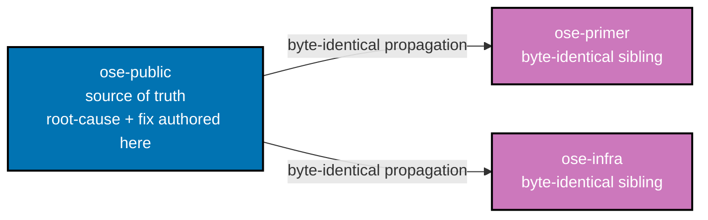

# Technical Documentation: rhino-cli Git Root Test Fixture Race

## Architecture

`apps/rhino-cli/src/infrastructure/git/root.rs` resolves the repository root from any CWD, including
from inside a linked git worktree. Its test coverage for the worktree case
(`find_root_from_worktree_returns_worktree_path`, line 76 [Repo-grounded]) needs a REAL linked
worktree to exercise the resolution logic honestly (mocking git's worktree layout would undertest the
real behavior) — the bug is not "using a real worktree," it's "creating that real worktree somewhere
that can collide with the actual repository under concurrent execution."

## Root-Cause Hypothesis (unverified — first task of this plan is to confirm)

**[Repo-grounded, contradicts hypothesis 1 below]** Direct inspection of
`apps/rhino-cli/src/infrastructure/git/root.rs:76-127` shows
`find_root_from_worktree_returns_worktree_path` already constructs both `main_repo` (line 77) and
`wt_dir` (line 109) as `tempfile::TempDir` instances and passes `.current_dir(main)` explicitly to
every `git` `Command` (lines 81-104, 113) — it never calls `CwdLock::acquire()` or
`std::env::set_current_dir()` at all, unlike the sibling test `find_root_returns_repo_root` (line 60),
which does use `CwdLock`. This means hypothesis 1 below, read against the fixture as currently
written, does not hold — Phase 1 must establish the actual mechanism before Phase 3 assumes either
hypothesis is confirmed.

The fixture likely does one of ([Unverified] — Phase 1 must confirm or refute both):

1. Runs `git init`/`git worktree add` relative to the process's actual current working directory
   instead of a dedicated `tempfile::TempDir`, so if the test's own CWD-restoration (`CwdLock` guard)
   loses a race against another concurrently-running git test in the same binary, the fixture's setup
   commands execute against the real repository instead of an isolated sandbox. **This is the
   hypothesis contradicted by the repo-grounded note above** — retained here only as a hypothesis to
   be formally ruled out in Phase 1, not assumed true.
2. Or: the fixture does use a temp dir, but the temp dir itself is created as a child path/symlink
   that resolves back into the real worktree tree under some condition, causing `git worktree add` to
   register against the real `.git/worktrees/` metadata rather than a fully separate `.git`.
3. Or: the race originates outside this specific test entirely — e.g. a concurrent interaction with
   `apps/rhino-cli/src/commands/specs_coverage.rs`'s own `CwdLock`-guarded `std::env::set_current_dir`
   tests (lines 619, 651 — see Phase 1's audit step), a `TMPDIR` resolution collision, or cross-process
   interaction under `nx affected`'s parallel fanout rather than a single-process `cargo test` race.

All three hypotheses are consistent with the observed evidence (see README.md's Symptom Evidence
section): a real linked worktree appears in `git worktree list` against the real repo, pinned to a
"init"-only commit authored by the fixture's hardcoded `Test <test@test.com>` identity. Phase 1 must
produce positive evidence for whichever hypothesis is confirmed — none is assumed true at authoring
time.

## Design Decisions

### DD-1 — Fully temp-dir-scoped fixture, no CWD dependency (hypothesis — requires Phase 1 confirmation)

**[Judgment call, provisional]** IF Phase 1 confirms hypothesis 1 or 2 in the Root-Cause Hypothesis
section above (a genuine CWD-relative or temp-dir-resolution dependency), rewrite the fixture to
construct its throwaway git repository and any linked worktree entirely via absolute paths rooted in
a fresh `tempfile::TempDir`, with every git invocation passing `-C <tempdir-path>` (or equivalent)
explicitly rather than relying on `std::env::set_current_dir` + restore.

**This DD is NOT confirmed as of plan authoring.** As documented in the Root-Cause Hypothesis section
above, direct inspection shows the target fixture already uses `tempfile::TempDir` + explicit
`.current_dir(...)` on every git invocation, with no CWD mutation — the opposite of what this DD
originally assumed needed fixing. Do not execute Phase 3 on the assumption that DD-1 is confirmed. If
Phase 1 instead confirms hypothesis 3 (a different root cause — e.g. `specs_coverage.rs` interaction,
`TMPDIR` collision, or cross-process fanout), this DD must be revised or replaced before Phase 3
begins, and Phase 3's actual fix must target the confirmed cause instead.

**Rationale (applies only if this DD is confirmed)**: `CwdLock`-based approaches only work if every
test in the process respects the lock; one CWD-mutating test elsewhere that doesn't (or a lock
implementation bug) reintroduces the race. Removing the CWD dependency entirely is the strictly safer
design — but this specific fixture already appears to avoid CWD mutation, so Phase 1 must identify
what actually causes the observed corruption before concluding this DD's rewrite is the fix.

### DD-2 — Regression test proves isolation adversarially

**[Judgment call]** A new test explicitly runs the fixture concurrently (e.g., spawn multiple threads
or processes executing the fixture's setup logic in parallel) and asserts the real repository's `git
worktree list` / `HEAD` — and, per H5's coverage of AC-3, `git config user.name`/`user.email` — are
unchanged before and after: a positive proof of isolation, not just "the existing suite still passes
serially." This test's exact implementation is finalized in Phase 2 once Phase 1 confirms the
mechanism it needs to reproduce.

## File-Impact Analysis

- `apps/rhino-cli/src/infrastructure/git/root.rs` — fixture rewrite + new regression test.
- Any sibling file in `apps/rhino-cli/src/infrastructure/git/` found by the audit step to share the
  same pattern.
- `apps/rhino-cli/src/commands/specs_coverage.rs` — investigated, not modified, by Phase 1 (see
  Root-Cause Hypothesis 3 above; ruled in or out explicitly per `delivery.md` Phase 1 and `brd.md`'s
  Business Scope Non-Goals); only edited if Phase 1 confirms it shares the root cause.

## Cross-Repo Propagation

Per the
[rhino-cli byte-identity boundary](../../../docs/reference/sdlc-gate-standard.md#rhino-cli-byte-identity-boundary),
the confirmed fix lands byte-identically in all three sibling repos. `ose-public` is the repo where
root-cause investigation, RED/GREEN/REFACTOR, and the plan folder itself live; `ose-primer` and
`ose-infra` each receive a verbatim copy of the fixed file(s) via their own worktree, PR, and review
cycle (see `delivery.md` Phase 6a/6b).

## Testing Strategy

TDD: RED (reproduce the race deterministically, e.g. via a tight concurrent-execution harness) → GREEN
(fix targeting whatever Phase 1 confirms as root cause) → REFACTOR. Per the
[Regression Test Mandate](../../../repo-governance/development/quality/regression-test-mandate.md),
the regression test must fail against the pre-fix code and pass against the fix.

## Dependencies

None beyond what `rhino-cli` already depends on. `tempfile = "3.27.0"` is already present in
`apps/rhino-cli/Cargo.toml`'s `[dev-dependencies]` [Repo-grounded] — no action needed unless Phase 1
determines a newer version or additional crate is required.

## Risks and Rollback

Low risk — test-only change, no production CLI behavior changes. Rollback is a straightforward
`git revert` of the fixture commit if the rewrite is later found to undertest the real resolution
logic.
