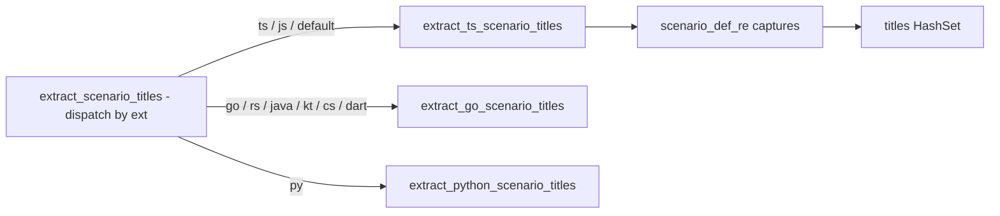
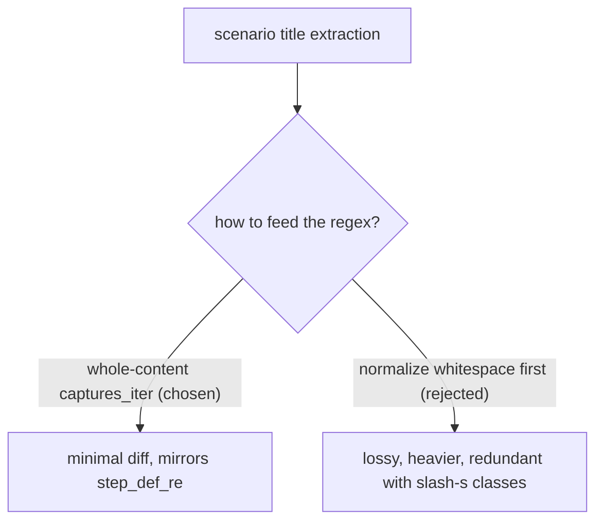

# Technical Documentation — Rhino speccoverage multi-line scenario scan

## 1. Architecture and current behavior

The relevant code lives in `apps/rhino-cli/src/application/speccoverage/checker.rs`
[Repo-grounded — file read]. Three functions matter:

- `scenario_def_re()` (`checker.rs:28-34`) — the regex that recognizes a TS/JS `Scenario(...)` call:

  ```rust
  Regex::new(r#"Scenario\s*\(\s*(?:"((?:[^"\\]|\\.)*)"|'((?:[^'\\]|\\.)*)')\s*,"#)
  ```

  The `\s` classes already match newlines, so the **pattern itself** already tolerates a title on a
  different line than the `Scenario(` token [Repo-grounded — `checker.rs:31`].

- `step_def_re()` (`checker.rs:37-42`) — the sibling regex for `Given/When/Then/And/But(...)` step
  calls. It is compiled with the `(?s)` flag and is the established whole-content-scanning pattern to
  mirror [Repo-grounded — `checker.rs:40`].

- `extract_ts_scenario_titles()` (`checker.rs:613-625`) — the defective function. It reads the file
  into `content`, then iterates **line by line** and runs the regex on each isolated line:

  ```rust
  let content = fs::read_to_string(p)?;
  let mut titles = HashSet::new();
  for line in content.lines() {
      for caps in scenario_def_re().captures_iter(line) {
          // ...
      }
  }
  ```

  Because each `line` is scanned in isolation, a `Scenario(` token on line N whose title string is on
  line N+1 never produces a match [Repo-grounded — `checker.rs:616-623`].



## 2. The fix

Change `extract_ts_scenario_titles` to run the regex once over the **whole `content` string**
instead of per line:

```rust
fn extract_ts_scenario_titles(p: &Path) -> std::result::Result<HashSet<String>, Error> {
    let content = fs::read_to_string(p)?;
    let mut titles = HashSet::new();
    for caps in scenario_def_re().captures_iter(&content) {
        let dq = caps.get(1).map_or("", |m| m.as_str());
        let sq = caps.get(2).map_or("", |m| m.as_str());
        let title = unescape_string(first_non_empty(dq, sq));
        titles.insert(normalize_ws(&title));
    }
    Ok(titles)
}
```

The single change is the iteration unit: `captures_iter(&content)` over the full file rather than
`for line in content.lines()`. This mirrors `step_def_re()`'s existing whole-content behavior
[Repo-grounded — `checker.rs:37-41`].

### On the `(?s)` flag (precise note)

`step_def_re()` carries `(?s)` (dot-matches-newline). `scenario_def_re()` does **not**, and it does
**not need it** for this fix: the pattern contains **no `.` metacharacter**, so `(?s)` would be
**functionally inert** here [Repo-grounded — pattern text at `checker.rs:31`]. The `\s` classes
already span newlines, which is all the cross-line case requires. Adding `(?s)` to
`scenario_def_re()` is therefore optional and purely for **symmetry with `step_def_re()`**; if added,
it must be documented inline as a no-op-for-this-pattern stylistic choice. This plan treats adding
`(?s)` as an optional REFACTOR-substep nicety, not a functional requirement.

## 3. Design decision — whole-content vs whitespace-normalization

Two approaches were considered; the whole-content approach is chosen.

| Approach                                                                | Verdict    | Rationale                                                                                                                                                              |
| ----------------------------------------------------------------------- | ---------- | ---------------------------------------------------------------------------------------------------------------------------------------------------------------------- |
| **Whole-content** — `captures_iter(&content)` over the full file string | **Chosen** | Minimal diff; mirrors the proven `step_def_re()` pattern; the regex already tolerates newlines via `\s`; no lossy pre-processing.                                      |
| Whitespace-normalization — collapse newlines/whitespace before matching | Rejected   | Lossy and heavier; would alter the input the regex sees, risking subtle changes to `normalize_ws`-dependent title text; unnecessary given `\s` already spans newlines. |



## 4. File impact

| File                                                                                                                                                                               | Change                                                                                                                      | Byte-identity boundary?        |
| ---------------------------------------------------------------------------------------------------------------------------------------------------------------------------------- | --------------------------------------------------------------------------------------------------------------------------- | ------------------------------ |
| `apps/rhino-cli/src/application/speccoverage/checker.rs`                                                                                                                           | Rewrite `extract_ts_scenario_titles` loop to whole-content scan; add cross-line unit fixtures                               | **Yes** (`src/`)               |
| `specs/apps/rhino/behavior/rhino-cli/gherkin/spec-coverage/spec-coverage-validate.feature`                                                                                         | Add AC-4 Gherkin scenario                                                                                                   | **Yes** (behavior tree)        |
| `specs/apps/rhino/behavior/rhino-cli/gherkin/README.md` (top-level only — the scenario-count table lives here, NOT in `.../spec-coverage/README.md`, which is a plain bullet list) | Update the spec-coverage-validate scenario-count table row to match the file (also reconciles the preexisting 6-vs-9 drift) | **Yes** (behavior tree README) |
| `apps/rhino-cli/tests/spec_coverage.rs`                                                                                                                                            | Add cucumber-rs step definitions binding AC-4 (fixture with a wrapped `Scenario(` binding)                                  | See note below                 |
| `libs/web-ui/src/primitives/code-block/code-block.steps.tsx`                                                                                                                       | Remove two `// prettier-ignore` comments (lines 155, 190); let Prettier re-wrap                                             | No (ose-public only)           |
| `libs/web-ui/src/primitives/code-block/copy-button.steps.tsx`                                                                                                                      | Remove one `// prettier-ignore` comment (line 45); let Prettier re-wrap                                                     | No (ose-public only)           |

> **Note on `tests/`**: The byte-identity boundary spec enumerates `src/`, `Cargo.toml`,
> `Cargo.lock`, `project.json`, `LICENSE`, and the Gherkin behavior tree
> [Repo-grounded — `docs/reference/sdlc-gate-standard.md:249-251`]. `tests/` is **not** explicitly
> enumerated. However, `apps/rhino-cli/tests/spec_coverage.rs` is a registered `spec_coverage` crate
> test target [Repo-grounded — `Cargo.toml:87`], and diverging it would risk the
> crate not compiling identically. This plan therefore propagates the `tests/spec_coverage.rs`
> addition alongside the `src/` change to keep the crate coherent
> [Judgment call: `tests/` inclusion is a coherence precaution, not a literal boundary requirement].

## 5. Testing strategy (TDD)

Tests are written **before** implementation (RED → GREEN → REFACTOR), per the
[Test-Driven Development Convention](../../../repo-governance/development/workflow/test-driven-development.md),
and satisfy the [Regression Test Mandate](../../../repo-governance/development/quality/regression-test-mandate.md)
(the reproducing test fails before the fix, passes after, in the same commit/PR).

| Acceptance criterion | Test level             | Location / command                                                                                                                          |
| -------------------- | ---------------------- | ------------------------------------------------------------------------------------------------------------------------------------------- |
| AC-1, AC-2, AC-3     | Unit (pure-core)       | New fixtures in `checker.rs` `#[cfg(test)]` module; `cargo test --manifest-path apps/rhino-cli/Cargo.toml --lib extract_ts_scenario_titles` |
| AC-4                 | Behavior (cucumber-rs) | New scenario + step def in `tests/spec_coverage.rs`; `cargo test --manifest-path apps/rhino-cli/Cargo.toml --test spec_coverage`            |
| AC-4 (gate)          | Integration gate       | `nx run rhino-cli:specs:behavior:coverage`                                                                                                  |
| AC-5                 | Web-ui coverage        | `nx run web-ui:specs:behavior:coverage` after hack removal                                                                                  |
| AC-6                 | Parity diff            | `diff` of `checker.rs` and the behavior feature file across the three repos                                                                 |

The unit fixtures (AC-1..AC-3) are the **reproducing regression tests**: they fail against the
current per-line scanner and pass after the whole-content change.

## 6. Exemptions (stated explicitly)

- **UI-design-funnel**: exempt — not UI-bearing. The only `libs/web-ui` edits remove
  `// prettier-ignore` comments from `*.steps.tsx` **test** files; no user-facing screen/component
  is added or changed.
- **Rule-15 three-tester web retest**: exempt — no runtime web-UI behavior change.
- **Rule-16 API exploratory retest**: exempt — no API/endpoint change.
- **Manual UI (Playwright) / API (curl) verification**: exempt — no UI or API surface is exercised;
  verification is by Rust unit/behavior tests and the coverage gates.
- **Specs & Gherkin completeness**: **NOT** exempt — the rhino-cli scanner behavior changes, so a
  companion Gherkin scenario (AC-4) + `specs:behavior:coverage` gate are included, per
  [Feature Change Completeness](../../../repo-governance/development/quality/feature-change-completeness.md).

## 7. Dependencies

No new crates or packages. The change uses the already-imported `regex::Regex`
[Repo-grounded — `checker.rs:14`], `unescape_string`, `first_non_empty`, `normalize_ws` from
`super::util` [Repo-grounded — `checker.rs:21`]. The cucumber-rs harness (`cucumber`,
`assert_cmd`, `tempfile`) is already used by `tests/spec_coverage.rs`
[Repo-grounded — `tests/spec_coverage.rs:14-18`].

## 8. Rollback

The change is a single-function edit plus additive tests and one Gherkin scenario. Rollback is a
straight revert of the rhino-cli commit(s) and re-application of the `// prettier-ignore` hacks (or
simply reverting the web-ui commit). No data migration, no config change, no schema change.

## 9. Byte-identity propagation

`apps/rhino-cli` must remain byte-identical across `ose-public`, `ose-primer`, `ose-infra`
[Repo-grounded — `docs/reference/sdlc-gate-standard.md#rhino-cli-byte-identity-boundary`]. Both
sibling repos carry the same file at the same path
[Repo-grounded — `ose-primer/apps/rhino-cli/src/application/speccoverage/checker.rs` and
`ose-infra/...` both exist]. Propagation is a **direct byte-identical application**, not the
[multi-repo parity **planning** workflow](../../../repo-governance/workflows/plan/plan-multi-repo-parity-planning.md)
— that workflow is scoped to _authoring_ one full plan-document-per-repo via a grilled deviation
matrix, and does not itself execute anything — nor the heavier
[plan-multi-repo-parity-planning-and-execution workflow](../../../repo-governance/workflows/plan/plan-multi-repo-parity-planning-and-execution.md),
which composes planning AND execution across repos behind its own three-grill contract for objectives
that need per-repo deviation grilling. Neither applies here because there is no cross-repo design
deviation to grill (the change is a single verbatim diff applied identically to all three repos, per
`delivery.md` Phase 3). `ose-infra` does not participate in the content-parity loop but **does**
carry the byte-identical rhino-cli, so the rhino-cli change is applied there too — propagated in
Phase 3, then independently reviewed (3-cycle `pr-review-maker`/`pr-review-fixer`), quality-gated,
and merged in Phase 4 — each sibling running its own `worktree-to-pr` delivery (see `delivery.md`'s
"Multi-Repo rhino-cli Delivery" note and Phase 3's Sibling Delivery Mode declaration).
See the [Related Repositories reference](../../../docs/reference/related-repositories.md).


