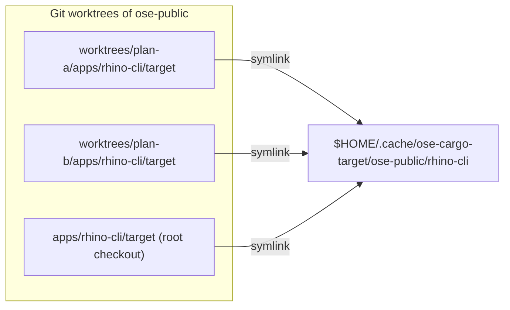
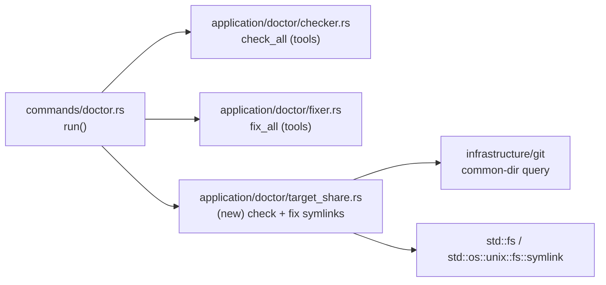
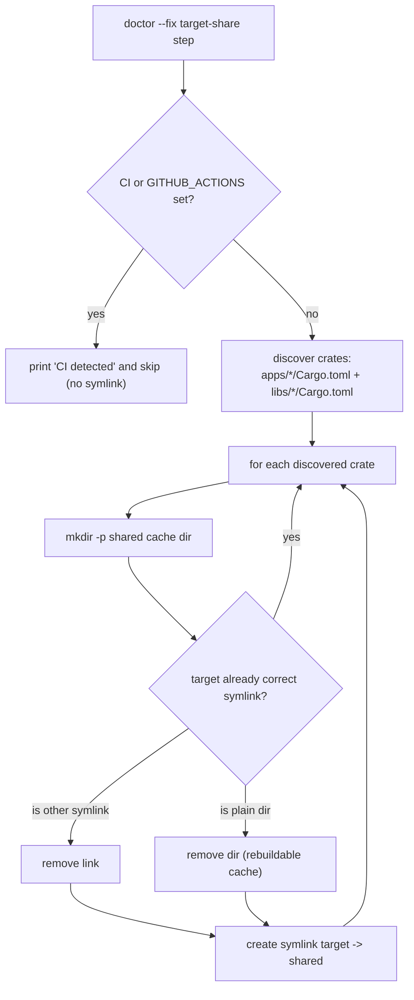
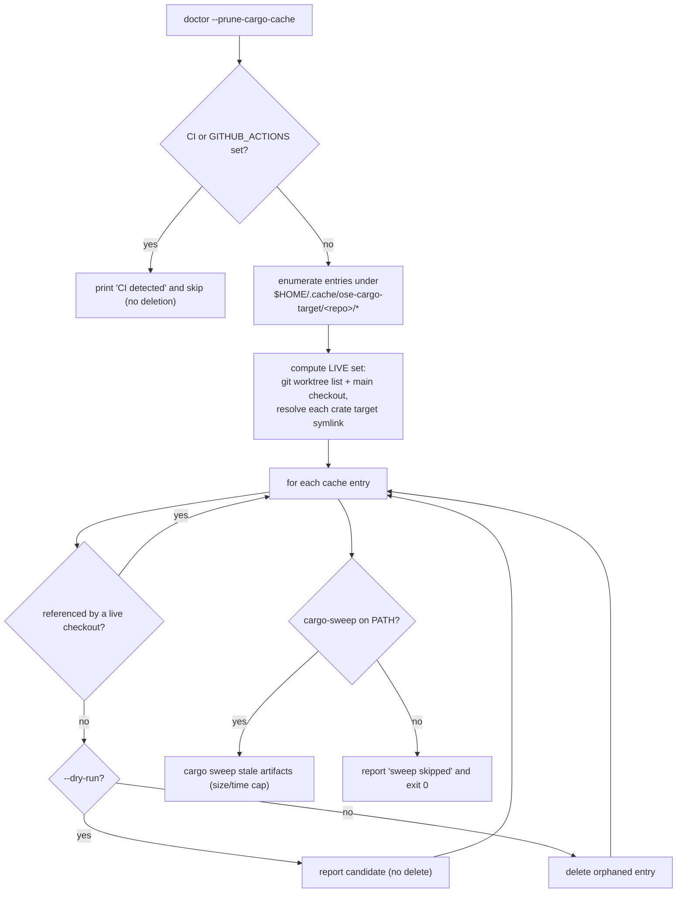
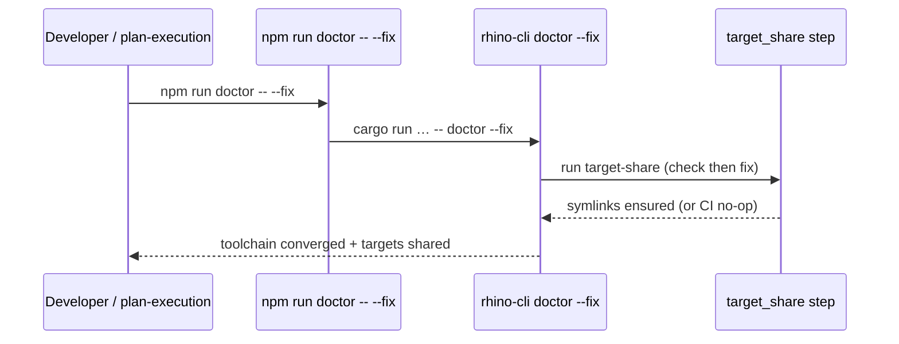

# Technical Documentation — Rust `target/` Directory Sharing

## Architecture

The mechanism is a filesystem redirection driven by `rhino-cli doctor`: each crate's `target/`
becomes a symlink into a shared, persistent cache keyed by repo name and crate leaf name. Nothing in
the build commands changes — `cargo` writes to `target/` (following the link) and the
`cp … target/release/<bin> … dist/` step reads back through the same link. [Repo-grounded — build
commands read from `project.json`; `target/` gitignored at `.gitignore:114`.]

The logic lives inside the doctor command, which already has a **check** phase (`check_all` in
`apps/rhino-cli/src/application/doctor/checker.rs`) and a **fix** phase (`fix_all` in
`apps/rhino-cli/src/application/doctor/fixer.rs`), orchestrated by
`apps/rhino-cli/src/commands/doctor.rs`. [Repo-grounded — files read.] The target-share step is added
as a sibling doctor concern: report-in-check, create-in-fix.

Repo name is derived once, robustly, so that worktrees resolve to their **main** repo (not the
worktree path): the basename of the directory containing the git **common** dir
(`git rev-parse --path-format=absolute --git-common-dir`). In a worktree, `--git-common-dir` points
at the main repo's `.git`, so all worktrees of `ose-public` resolve to the `ose-public` cache segment
and share one directory. The existing doctor uses `git rev-parse --show-toplevel` via
`apps/rhino-cli/src/infrastructure/git/root.rs` [Repo-grounded], which returns the worktree path — so
the target-share step needs a **common-dir** query rather than reusing `find_root` directly.

## Component / dependency: doctor internals gain a target-share module

## Decision flow — the CI guard and idempotency branches

## Decision flow — the worktree-aware prune GC

## Sequence — where the symlink is created at init time

Worktree provisioning already runs `npm install` + `npm run doctor -- --fix` in the root worktree
per [Worktree Toolchain Initialization](../../../repo-governance/development/workflow/worktree-setup.md)
[Repo-grounded], and `npm run doctor -- --fix` forwards `--fix` to the Rust doctor
[Repo-grounded — `package.json` `doctor` script is `cargo run … -- doctor`, so `-- --fix` appends
`--fix`]. So no wiring change is needed: the doctor's existing entry point covers both the repo-init
and worktree-provisioning paths.

## Design decisions

### DD-1: Fold target-share into `rhino-cli doctor` (CHOSEN — the pivot)

The symlink logic is implemented in Rust inside the doctor command
(`apps/rhino-cli/src/application/doctor/`), reported in **check** mode and applied in **`--fix`**
mode. This was previously rejected (see RA-1) as boundary-costly, but the maintainer chose it because
the byte-identity boundary turns the "cost" into a **guarantee**: one Rust implementation is
byte-identical across `ose-public`, `ose-primer`, and `ose-infra`, and the byte-identity guard
enforces that they never drift. That is strictly simpler and more robust than replicating a
`scripts/` shell helper into three repos and hoping they stay in sync. [Repo-grounded — boundary
defined in [SDLC Gate Standard](../../../docs/reference/sdlc-gate-standard.md#rhino-cli-byte-identity-boundary);
`doctor.rs` already byte-identical across the three repos per `diff -q`.]

Consequences (accepted): the change is **inside** the boundary, so it (a) must land byte-identically
across three repos in coordinated peer PRs, and (b) requires companion Gherkin under
`specs/apps/rhino/behavior/rhino-cli/gherkin/**` plus cucumber-rs step definitions to satisfy
`specs:behavior:coverage`. [Repo-grounded — coverage validator recognizes Rust `#[given]`/`#[when]`/
`#[then]` step defs, `apps/rhino-cli/src/application/speccoverage/extractors.rs`.]

### DD-2: Per-crate symlink of `target/`, NOT a single `CARGO_TARGET_DIR` (CHOSEN)

Each crate's `target/` is symlinked to `$HOME/.cache/ose-cargo-target/<repo>/<crate>`. A per-crate
cache isolates each crate's build state while still deduping across worktrees. A single shared
`CARGO_TARGET_DIR` across _different_ crates would cause cross-crate rebuild churn and collisions
(see RA-2).

### DD-3: Dynamic crate discovery in Rust, crate-agnostic (CHOSEN)

The doctor discovers every Rust crate itself by walking `apps/*/Cargo.toml` and `libs/*/Cargo.toml`
(depth-limited, matching the existing crate layout) rather than iterating a hardcoded candidate list.
This makes one identical implementation correct for all three repos without per-repo maintenance,
because each repo's crate inventory genuinely differs:

| Repo         | Rust crates present (verified via `find apps libs -maxdepth 2 -name Cargo.toml`) |
| ------------ | -------------------------------------------------------------------------------- |
| `ose-public` | `apps/rhino-cli`, `apps/ayokoding-cli`, `apps/ose-cli`, `libs/rust-commons`      |
| `ose-primer` | `apps/rhino-cli`, `apps/crud-be-rust-axum` [Repo-grounded — sibling listing]     |
| `ose-infra`  | `apps/rhino-cli`, `apps/coralpolyp-be` [Repo-grounded — sibling listing]         |

Dynamic discovery closes a gap a hardcoded list would leave: every Rust crate in every repo gets the
shared-target treatment automatically, with zero per-repo configuration and no risk of a newly-added
crate being silently skipped.

### DD-4: Hard CI guard inside the doctor (CHOSEN)

The target-share step no-ops when `$CI` or `$GITHUB_ACTIONS` is set — it never creates a symlink on
the self-hosted runner, where a shared target dir across concurrent CI jobs would worsen the known
rustup/cargo `.partial` concurrency race. This is a first-class acceptance criterion with a dedicated
unit test (pure `is_ci`-style guard) and a behavior scenario ("the doctor symlink step no-ops under
CI"). [Judgment call — the concurrency-race motivation is recalled from a prior session, not
documented in-repo; the guard itself is unconditional and testable.]

### DD-5: Remove `{projectRoot}/target` from Nx outputs for the three affected ose-public crates (CHOSEN)

`rhino-cli:build` outputs are `["{projectRoot}/dist"]` — target is **not** cached. [Repo-grounded —
`jq`.] But `ayokoding-cli:build` and `ose-cli:build` list
`["{projectRoot}/dist","{projectRoot}/target"]`, and `rust-commons:build` lists
`["{projectRoot}/target"]`. [Repo-grounded — `jq`.] With `target` as a symlink to a shared dir, Nx
would copy the whole symlinked tree into `.nx/cache` on every run — defeating the purpose and bloating
the Nx cache. Since the shared dir is itself cargo's persistent incremental cache, Nx caching of
`target` is redundant. Fix: drop `{projectRoot}/target` from those three crates' `build.outputs`
(`dist` stays for the two CLIs; `rust-commons` build outputs become `[]`). These three crates are
**ose-public only**, so no byte-identity or sibling-repo coupling.

The sibling repos' extra crates list only a **specific binary path** in their build outputs —
`crud-be-rust-axum` lists `["{projectRoot}/target/release/crud-be-rust-axum"]` and `coralpolyp-be`
lists `["{projectRoot}/target/release/coralpolyp-be"]` [Repo-grounded — sibling `jq`] — a single file
that resolves through the symlink, not the whole `target` tree, so no output edit is required there.
The executor re-confirms this with `jq` in each sibling repo before deciding.

### DD-6: Cleanup stays documented/manual (CHOSEN)

To keep the doctor tool list unchanged, `cargo-sweep` is **not** wired into the doctor's installable
tools. Cleanup is documented: `cargo clean` per crate, or a periodic `cargo sweep --time 30` sweep of
`$HOME/.cache/ose-cargo-target`, run manually or via the developer's own cron. [Web-cited note:
`cargo sweep --time <days>` removes artifacts not accessed in N days — cargo-sweep README,
<https://github.com/holmgr/cargo-sweep>, accessed 2026-07-18.] [Unverified — flag: confirm the exact
`--time` flag spelling with `cargo sweep --help` at execution time before writing it into a doc.]

### Accepted trade-off: concurrent local builds of the same crate across worktrees

Two worktrees building the **same** crate at the same time (e.g., `apps/rhino-cli` is open in two
worktrees and a build is kicked off in both) now contend on the shared `target/` directory — a
scenario that did not exist before this mechanism, since each worktree previously had its own
physical `target/`. This is an accepted, low-likelihood trade-off, not a defect: `cargo` places
advisory Unix `flock`-based `.lock` files inside `CARGO_TARGET_DIR` specifically to serialize
concurrent access, so the second `cargo build` blocks waiting for the lock rather than corrupting
build state. [Web-cited: rust-lang/cargo `src/cargo/util/flock.rs`,
<https://github.com/rust-lang/cargo/blob/master/src/cargo/util/flock.rs>, accessed 2026-07-18 — "on
Unix-like systems, locks are advisory using flock"; corroborated by community guidance to avoid
running concurrent `cargo build`/`update`/`fetch` against the same target directory, per
<https://users.rust-lang.org/t/is-it-supported-to-run-two-cargo-build-in-parallel-in-same-workspace/103621>,
accessed 2026-07-18.]

Accepted because: (a) it only occurs when building the identical crate in two worktrees
simultaneously — a narrow window in normal solo-dev usage — and (b) cargo's lock blocks rather than
corrupts, so the worst case is one build waiting on the other, never data loss.

### Accepted trade-off: cross-branch rebuild churn across worktrees on different branches

Distinct from the `flock`/lock case above: this is a **fingerprint** effect, not a lock effect. It
shows up not when two builds run at once, but when they run at different times against the same
shared symlinked `target/` from worktrees sitting on **different branches**. When worktree A (on
branch `x`) and worktree B (on branch `y`) each build the same crate, `cargo` re-fingerprints every
compilation unit and rebuilds any unit whose inputs changed between the branches — the leaf crate
(e.g. `rhino-cli`) plus any changed path-dependency (e.g. `rust-commons`). Third-party dependencies
whose inputs did not change (serde, clap, tokio) keep their cached `.rlib`s and are **not**
recompiled. Switching back to branch `x` and rebuilding re-fingerprints again and recompiles the
changed units once more — this back-and-forth is the cross-branch rebuild churn. [Repo-grounded —
follows from cargo's documented per-compilation-unit fingerprinting, which keys on source, profile,
features, and dependency fingerprints; see the `fingerprint` module doc comment in
`src/cargo/core/compiler/fingerprint/mod.rs`.]

**No corruption occurs.** Cargo stores intermediate artifacts under `target/<profile>/deps/` with a
hash suffix per fingerprint, so the differing-fingerprint variants for branch `x` and branch `y`
coexist side by side in the same shared directory rather than clobbering each other. Only the final
copied output binary (`target/<profile>/<bin>`) is overwritten on each build, exactly as it would be
in a non-shared `target/`. Correctness is preserved across the switch. [Repo-grounded — hash-suffixed
`deps/` artifacts are standard cargo layout.]

Accepted because: (a) the churn is **confined to the leaf crate plus any changed path-deps** — the
big win of the mechanism (each shared third-party dependency `.rlib` compiled once and reused across
every worktree and branch) still holds, so the recompilation is bounded to exactly the code that
genuinely differs between the branches [Judgment call — the "confined to leaf crate + changed
path-deps" characterization]; and (b) it is the unavoidable price of the disk dedup that is the whole
point of this plan — a single physical `target/` cannot simultaneously hold two branches' final
outputs without one rebuilding the other's changed units. Regrowth from the coexisting per-fingerprint
`deps/` variants is bounded by the same cleanup lever documented in DD-6: a periodic
`cargo sweep --time <days>` over `$HOME/.cache/ose-cargo-target` prunes stale variants and keeps the
shared directory from accumulating dead fingerprints indefinitely.

### DD-7: Worktree-aware shared-cache GC via `doctor --prune-cargo-cache` (CHOSEN)

The shared cache is keyed by `<repo>/<crate>`, **not** by worktree/branch. So each worktree's
per-crate `target/` symlink points at a cache entry **shared** by every worktree + the main checkout
of that repo. This has a critical consequence: **deleting a worktree must never delete its Rust cache
entry** — that entry is still live for every sibling worktree, and deleting it would force them all to
full-rebuild and could race a build in progress. A naive "delete worktree ⇒ delete build dir" hook,
correct for unshared build dirs, is an **anti-pattern** here (see [Non-goals](./brd.md#business-scope-non-goals)).

The correct disk-reclamation lever is a **repo-level GC** run explicitly via the doctor, gated so it
never removes a still-referenced entry. It is added to the same doctor command, reusing the same
`discover_crates` / `cache_root` / `repo_name` / `is_ci` helpers built for the target-share step
(extend, do not duplicate):

1. **Enumerate** entries under `$HOME/.cache/ose-cargo-target/<repo>/*`.
2. **Compute the live-referenced set**: walk `git worktree list --porcelain` (plus the main checkout)
   and, for each checkout, resolve each crate's `target/` symlink to the shared-cache path it points
   at [Repo-grounded — `git worktree list --porcelain` supported]. The union is the live set.
3. **Delete only the set difference** — an entry whose crate no longer exists in the repo's crate set,
   or a `<repo>` segment with no known checkout — **never** a live-referenced entry.
4. **CI-guard** the whole step exactly like the symlink step (no-op under `$CI`/`$GITHUB_ACTIONS`).
5. **Optional `cargo sweep`** stale-artifact reclamation (a size/time cap over the surviving entries)
   runs **only if `cargo-sweep` is installed**, and **degrades gracefully** — reports "skipped" and
   exits successfully when the binary is absent, never failing the doctor. [Repo-grounded — the doctor
   already treats a missing binary as a non-fatal `Missing` in `checker.rs`.]

The step honors the existing `--dry-run` flag (preview candidate deletions without removing anything),
matching the doctor's existing `--fix --dry-run` semantics. The flag is named `--prune-cargo-cache`
(explicit over a terse `--gc`, matching the maintainer's explicit-over-convention preference and the
kebab-case long-flag style of the existing `--scope`/`--fix`/`--dry-run` flags [Repo-grounded —
`apps/rhino-cli/src/commands/doctor.rs`]). Like the target-share step, this is **inside** the
byte-identity boundary and lands byte-identically across all three repos.

### Other build-artifact stacks — why Rust is the distinctive case

The shared-cache GC exists because Rust's `target/` is the one build-output tree this repo shares
across worktrees. Other stacks do not need it:

- **Node `node_modules`** — per-worktree and **unshared**; it lives inside the worktree directory and
  dies with it. The naive "delete the worktree ⇒ delete the build dir" behaviour is **correct** here
  and already happens automatically; no GC is needed. [Repo-grounded — `node_modules/` is per-tree.]
- **F#/.NET `bin`/`obj`** — small and per-worktree, so they also die with the worktree; meanwhile the
  heavy, deduplicated part (`~/.nuget/packages`) is **already global and content-addressed** by NuGet,
  so it needs no repo-level GC. [Repo-grounded — NuGet's global packages folder is machine-global.]

Rust is unique in this repo: the heavy artifact tree (`target/`) is what this plan **makes** shared,
so it is the only stack where a worktree-teardown must **not** delete the build dir and where a
live-set-gated repo-level GC is the right reclamation tool.

### DD-8 (OPTIONAL, Phase 7): `[profile.dev] debug = "line-tables-only"` (SEPARATE, MAY BE DROPPED)

Trimming dev-profile debuginfo shrinks debug + incremental bloat. This **does** edit tracked
`Cargo.toml`. For `apps/rhino-cli/Cargo.toml` the edit is **inside the byte-identity boundary**, so it
must be applied byte-identically across all three repos in the same cycle (deps unchanged →
`Cargo.lock` unaffected). Kept as a clearly-separated optional phase the maintainer can include or
drop without affecting the core mechanism.

### Rejected alternatives

- **RA-1: `scripts/cargo-target-share.sh` shell helper chained into `package.json` `doctor`
  (PREVIOUSLY CHOSEN — now REJECTED).** An earlier draft implemented the symlink logic as a POSIX
  shell script wired ahead of the doctor invocation in each repo's `package.json`, specifically to
  stay **outside** the rhino-cli byte-identity boundary and avoid the companion-Gherkin cost.
  Rejected in favor of DD-1 because the maintainer prefers a **single source of truth**: one Rust
  implementation, byte-identical across three repos and enforced by the byte-identity guard, beats
  three hand-maintained copies of a shell script that can silently drift. The boundary cost
  (byte-identical three-repo change + companion Gherkin) is exactly the discipline rhino-cli changes
  already carry, and it buys a stronger guarantee than the shell helper ever offered.
- **RA-2: `CARGO_TARGET_DIR` env var pointing all crates at one dir.** Rejected — a single shared
  target across _different_ crates causes cross-crate rebuild churn and collisions, and it would need
  to be exported into every shell/Nx invocation (implicit, fragile). The per-crate symlink isolates
  each crate's cache while still deduping across worktrees.
- **RA-3: Edit each `project.json`/`Cargo.toml` build command to build into a shared path.** Rejected
  — edits tracked build config for no benefit the symlink does not already give for free (DD-2).
- **RA-4: A dedicated Nx target / hook that runs the symlink.** Rejected — more moving parts than a
  doctor step that already runs at init and worktree provisioning; the `doctor --fix` path is the
  natural home.

## Implementation shape (reference)

New module `apps/rhino-cli/src/application/doctor/target_share.rs` (`_New file_`; siblings:
`checker.rs`, `fixer.rs`, `tools.rs`), exposing testable pure-ish functions:

- `is_ci() -> bool` — true when `CI` or `GITHUB_ACTIONS` is set (env read).
- `cache_root() -> PathBuf` — `OSE_CARGO_TARGET_CACHE` override, else `$HOME/.cache/ose-cargo-target`
  (mirrors the existing `dirs_home()` HOME-based pattern in `checker.rs`).
- `repo_name(repo_common_dir: &Path) -> String` — basename of the dir containing the git common dir.
- `discover_crates(repo_root: &Path) -> Vec<PathBuf>` — crates from `apps/*/Cargo.toml` +
  `libs/*/Cargo.toml`.
- `check_target_shares(repo_root, cache_root, repo_name) -> Vec<TargetShareStatus>` — reports each
  crate whose `target/` is missing/incorrect (no mutation; empty under CI).
- `fix_target_shares(...) -> FixOutcome` — creates/repairs symlinks idempotently; discards a plain
  `target/` dir first; no-op under CI.

The GC reuses the same module (extend, do not duplicate), adding:

- `live_referenced_entries(cache_root, repo_name) -> HashSet<PathBuf>` — walks
  `git worktree list --porcelain` + the main checkout and resolves each crate `target/` symlink to
  its shared-cache path.
- `prune_orphans(cache_root, repo_name, dry_run) -> PruneOutcome` — deletes (or, under `dry_run`,
  reports) only cache entries absent from the live set; empty/no-op under CI.
- `sweep_stale(cache_root, dry_run) -> SweepOutcome` — runs `cargo sweep` when present; returns a
  `Skipped` outcome (never an error) when `cargo-sweep` is absent from PATH.

A new `--prune-cargo-cache` flag is added to `DoctorArgs` in
`apps/rhino-cli/src/commands/doctor.rs` (`#[arg(long = "prune-cargo-cache")]`, kebab-case matching the
existing `--scope`/`--fix`/`--dry-run` flags [Repo-grounded]); it reuses the existing `--dry-run`
flag for preview.

Wired into `apps/rhino-cli/src/commands/doctor.rs run()` after the tool checks (report target-share
gaps in check mode; apply when `args.fix`; run the prune when `args.prune_cargo_cache`), and
registered in `apps/rhino-cli/src/application/doctor/mod.rs` (`mod target_share;` + re-exports).
Behavior is exercised by a cucumber-rs binder
(`apps/rhino-cli/tests/cargo_target_share.rs`, `_New file_`; sibling: `apps/rhino-cli/tests/doctor.rs`)
with a matching `[[test]] name = "cargo_target_share"` entry in `apps/rhino-cli/Cargo.toml`
[Repo-grounded — existing cucumber suites declared the same way, `Cargo.toml` lines 42-108].

Symlink creation uses `std::os::unix::fs::symlink` (the repo targets macOS/Linux; the existing doctor
already branches on `target_os` in `checker.rs`/`fixer.rs`). [Repo-grounded.]

## Per-repo doctor wiring (no change required)

| Repo         | `package.json` `doctor` script (unchanged)                                        | `-- --fix` reaches the doctor? |
| ------------ | --------------------------------------------------------------------------------- | ------------------------------ |
| `ose-public` | `cargo run --release --quiet --manifest-path apps/rhino-cli/Cargo.toml -- doctor` | Yes (`-- --fix` appends)       |
| `ose-primer` | `cargo run --release --quiet --manifest-path apps/rhino-cli/Cargo.toml -- doctor` | Yes                            |
| `ose-infra`  | `nx run rhino-cli:build && ./apps/rhino-cli/dist/rhino-cli doctor`                | Yes (`-- --fix` appends)       |

[Repo-grounded — all three `doctor` scripts read from the respective `package.json` files.] No
`package.json` edit is needed in any repo: the target-share step lives inside the doctor binary. For
ose-infra, the `nx run rhino-cli:build` runs before the doctor on first provisioning (plain target),
then `doctor --fix` discards that plain target and symlinks it; subsequent builds use the symlink.

## File impact

| Path                                                                            | Change                                                            | Boundary                                            |
| ------------------------------------------------------------------------------- | ----------------------------------------------------------------- | --------------------------------------------------- |
| `apps/rhino-cli/src/application/doctor/target_share.rs`                         | New — target-share + prune GC module + unit tests (`_New file_`)  | **Inside** boundary — byte-identical across 3 repos |
| `apps/rhino-cli/src/application/doctor/mod.rs`                                  | Register `mod target_share;` + re-exports                         | **Inside** boundary — byte-identical                |
| `apps/rhino-cli/src/commands/doctor.rs`                                         | Add `--prune-cargo-cache` flag; call check/fix + prune in `run()` | **Inside** boundary — byte-identical                |
| `apps/rhino-cli/src/internal/doctor.rs`                                         | Re-export target-share API if needed for tests                    | **Inside** boundary — byte-identical                |
| `apps/rhino-cli/tests/cargo_target_share.rs`                                    | New — cucumber-rs binder + step defs (`_New file_`)               | **Inside** boundary — byte-identical                |
| `apps/rhino-cli/Cargo.toml`                                                     | Add `[[test]] name = "cargo_target_share"` (harness = false)      | **Inside** boundary — byte-identical                |
| `specs/apps/rhino/behavior/rhino-cli/gherkin/system/cargo-target-share.feature` | New — companion scenarios (`_New file_`)                          | **Inside** boundary — byte-identical                |
| `specs/apps/rhino/behavior/rhino-cli/gherkin/README.md`                         | Add a `system` domain-table row for the new feature file          | **Inside** boundary — byte-identical                |
| `apps/ayokoding-cli/project.json`                                               | `build.outputs` → `["{projectRoot}/dist"]`                        | ose-public only                                     |
| `apps/ose-cli/project.json`                                                     | `build.outputs` → `["{projectRoot}/dist"]`                        | ose-public only                                     |
| `libs/rust-commons/project.json`                                                | `build.outputs` → `[]`                                            | ose-public only                                     |
| `repo-governance/development/workflow/worktree-setup.md`                        | Note the shared-target mechanism                                  | Docs (ose-public; parity loop propagates)           |
| `repo-governance/development/workflow/reproducible-environments.md`             | Add shared-target + cleanup section                               | Docs (ose-public; parity loop propagates)           |
| `apps/rhino-cli/Cargo.toml` `[profile.dev]` (Phase 7 OPTIONAL only)             | Add `[profile.dev] debug = "line-tables-only"`                    | **Inside** boundary — byte-identical across 3 repos |

## Specs / Gherkin — required (NOT exempt)

Unlike the earlier `scripts/`-based draft, this plan **creates observable new behavior in
`apps/rhino-cli/**` source\*\*, so the Specs & Gherkin two-path completeness rule applies
[Repo-grounded — [Feature Change Completeness](../../../repo-governance/development/quality/feature-change-completeness.md)].
The plan therefore carries:

- A new `.feature` file `specs/apps/rhino/behavior/rhino-cli/gherkin/system/cargo-target-share.feature`
  transcribing the `prd.md` acceptance-criteria scenarios (one primary `Given`/`When`/`Then` each),
  including both the target-share scenarios and the prune-GC scenarios (orphan pruned, live-referenced
  preserved, CI no-op, dry-run preview, cargo-sweep graceful degrade).
- Cucumber-rs step definitions in `apps/rhino-cli/tests/cargo_target_share.rs`, whose
  `#[given]`/`#[when]`/`#[then]` strings mirror the Gherkin verbatim so `specs:behavior:coverage`
  reports zero gaps. [Repo-grounded — coverage scanner recognizes Rust attribute-macro step defs,
  `extractors.rs`.]
- A domain-table row added under `### system` in the gherkin `README.md`.
- `specs:gherkin-cardinality-validation` and `specs:behavior:coverage` both pass. [Repo-grounded —
  targets exist in `apps/rhino-cli/project.json`.]

## Testing strategy

| Level                      | Command                                                               | Covers                                                                                                                                 |
| -------------------------- | --------------------------------------------------------------------- | -------------------------------------------------------------------------------------------------------------------------------------- |
| Unit (pure functions)      | `nx run rhino-cli:test:unit` (`cargo test --lib`)                     | CI guard, crate discovery, check/fix logic, idempotency, path derivation, prune live-set gating, dry-run, cargo-sweep graceful degrade |
| Behavior (cucumber-rs)     | `nx run rhino-cli:test:integration`                                   | the new `.feature` scenarios via the binder                                                                                            |
| Specs coverage             | `nx run rhino-cli:specs:behavior:coverage`                            | every new Gherkin step is covered by a step def                                                                                        |
| Gherkin cardinality        | `nx run rhino-cli:specs:gherkin-cardinality-validation`               | one-primary-keyword rule on the new scenarios                                                                                          |
| Build/test through symlink | `nx run rhino-cli:build`, `nx run rhino-cli:test:quick`               | dist emitted + tests pass through the symlinked target                                                                                 |
| Disk dedup                 | before/after `du -sh` across worktrees                                | the shared-physical-target metric                                                                                                      |
| Byte-identity              | pairwise `diff` of `apps/rhino-cli` + `specs/apps/rhino` across repos | `diff = 0`                                                                                                                             |

[Repo-grounded — `test:unit` runs `cargo test --lib --test repo_governance …`; the cucumber binder
runs under `test:integration` (`cargo test --tests`); target names verified in
`apps/rhino-cli/project.json`.]

## Rollback

Every change is reversible: revert the rhino-cli source/specs commits, revert the `project.json`
edits, and (if desired) `rm apps/<crate>/target && mkdir apps/<crate>/target` to return to
per-worktree directories. The shared cache under `$HOME/.cache/ose-cargo-target` is disposable and
can be `rm -rf`'d at any time — cargo rebuilds it.
