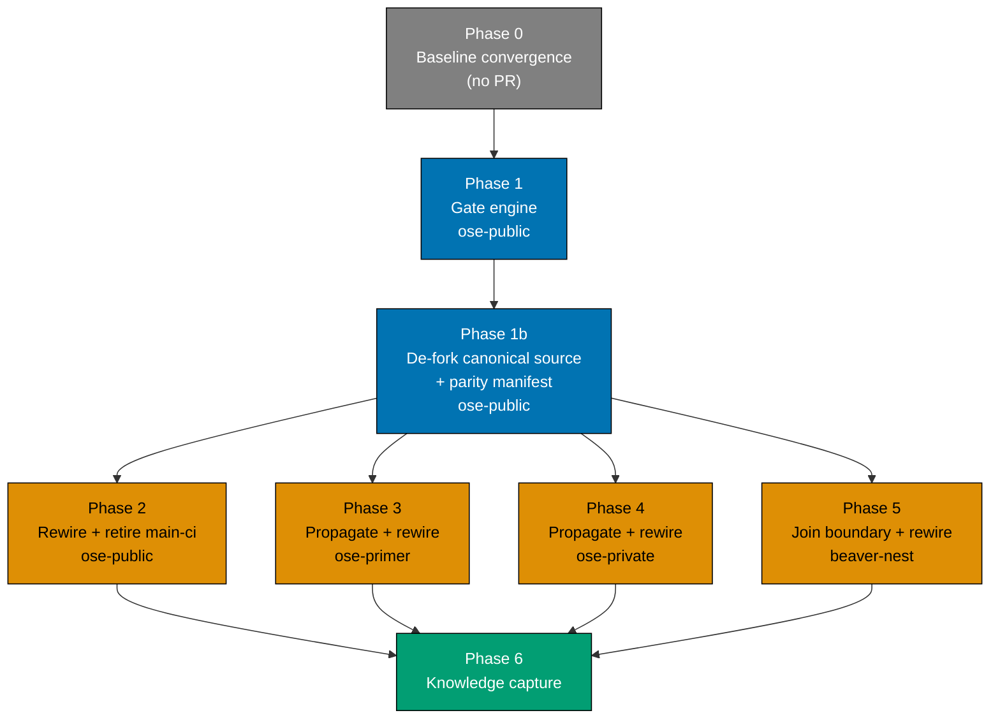

# Tech Docs — SDLC Gate Registry Enforcement

## 1. Audit Baseline — What Actually Runs Today

Captured 2026-08-02 across all four repos. This table is the conformance baseline the plan closes.
`lint-staged` is listed separately from `pre-commit` because it is the file-type dispatch mechanism
the pre-commit hook delegates to, and it is where most of the drift hides.

| Check                                                     | lint-staged     | pre-push         | PR gate                       | main-ci   | Verdict                                                                                                              |
| --------------------------------------------------------- | --------------- | ---------------- | ----------------------------- | --------- | -------------------------------------------------------------------------------------------------------------------- |
| `md naming validate`                                      | yes             | —                | —                             | —         | Violates rule — never reaches CI                                                                                     |
| `md frontmatter validate`                                 | yes             | —                | —                             | —         | Violates rule — never reaches CI                                                                                     |
| `convention emoji validate`                               | yes             | —                | —                             | —         | Violates rule — never reaches CI                                                                                     |
| `docker compose config`                                   | yes             | —                | —                             | —         | Violates rule — never reaches CI                                                                                     |
| Formatters (prettier, rustfmt, gofmt, shfmt, fantomas, …) | write           | —                | auto-commit                   | —         | Never verified anywhere                                                                                              |
| `env staged-guard validate`                               | — (hook step 1) | —                | —                             | —         | Staged-only — reads the git index; no CI counterpart can exist. Declare with `carve-out: staged-only`                |
| `harness bindings generate`                               | — (hook step 3) | —                | —                             | —         | Mutation, not a check. Declare as `type: mutation`                                                                   |
| lockfile sync                                             | — (hook step 4) | —                | —                             | —         | Mutation, inline shell. Extract to `git lockfile sync`, declare as `type: mutation`                                  |
| `commitlint`                                              | — (commit-msg)  | —                | —                             | —         | Message-text scope; no file surface. Declare on the `commit-msg` surface                                             |
| `harness bindings validate`                               | —               | path-gated       | —                             | —         | Violates rule — never reaches CI                                                                                     |
| `harness sync validate` / `validate:sync`                 | —               | —                | —                             | —         | Declared in `package.json`, invoked nowhere                                                                          |
| `md mermaid validate`                                     | yes             | —                | —                             | all files | Violates rule — absent from PR gate                                                                                  |
| `md heading-hierarchy validate`                           | yes             | —                | —                             | all files | Violates rule — absent from PR gate                                                                                  |
| `specs:structure-validation`                              | —               | via `test:quick` | pinned `--projects=rhino-cli` | `--all`   | Pinned scope, not affected scope                                                                                     |
| `markdownlint-cli2`                                       | yes             | —                | via `npm run lint:md`         | all files | Conforms                                                                                                             |
| `md links validate`                                       | —               | repo-wide        | repo-wide                     | repo-wide | Conforms                                                                                                             |
| `md readme-index validate`                                | —               | repo-wide        | repo-wide                     | repo-wide | Conforms; absent from the standard's tables                                                                          |
| `harness duplication validate`                            | —               | repo-wide        | repo-wide                     | repo-wide | Conforms; absent from the standard's tables                                                                          |
| `convention license validate`                             | —               | path-gated       | always                        | always    | Conforms; absent from the standard's tables                                                                          |
| `env validate`                                            | —               | repo-wide        | `validate-env.yml`            | repo-wide | Conforms via the standalone workflow                                                                                 |
| `deps:audit`                                              | —               | —                | —                             | —         | Correctly outside every gate (ratified rule 3). Stays out of the registry; gets its own descriptively-named workflow |

Two further structural findings:

- **The PR gate's `format` job carries `if: github.event_name == 'pull_request'`**, so on a direct
  push to `main` the entire `lint-staged` pass is skipped. Every per-file validator is therefore
  absent from the `main` path even where it is present on the PR path.
- **`main-ci.yml` has no `push` trigger** in any repo — `schedule` plus `workflow_dispatch` only. It
  cannot block a merge. The surface the ratified standard calls the "main quality gate" does not gate.

Per-repo variation on the above is small and does not change any verdict:

- `ose-private` alone already runs `markdown-per-file` (mermaid, heading-hierarchy) in its PR gate,
  and its pre-push additionally runs `specs structure validate` and `npm run lint:md`. It also adds an
  `iac-lint` gate (terraform, yamllint) the other three do not have.
- `ose-primer` adds per-language gates for its polyglot demo apps and names its audit workflow
  `Nightly Dependency Audit` where the other three use `deps-audit`.
- `beaver-nest` is near-identical to `ose-public` and today carries a **fork** of `rhino-cli`. §2.8
  shows that fork is almost entirely `ose-public`'s app names hardcoded into shared source, and this
  plan ends it.

## 2. Design

### 2.1 Why a registry rather than a linter over the existing files

The alternative considered was a validator that parses `.husky/*` shell and `pr-quality-gate.yml`
and diffs the extracted command sets. It was rejected: extracting a check set from arbitrary shell
requires understanding conditionals, variable expansion, and `lint-staged` glob dispatch. The
validator would be a shell interpreter with a permanent false-positive tail.

Declaring the check set once and _deriving_ both surfaces from it inverts the problem — there is
nothing to extract, because there is nothing hand-written to drift. This is the same shape the repo
already runs for harness bindings: one hand-authored source, generated consumers, and a validator
that fails on divergence.

### 2.2 Registry location and shape

The registry is a new `gates:` section in the existing root `repo-config.yml`, joining the sections
already there (`harness`, `coverage`, `specs`, `instruction-size`, `env-contract`, `env-injection`).
It is read by the existing strict-deserialize path, so an unknown key or a bad enum fails
`rhino-cli repo-config validate` at the schema-parity gate that already runs.

**The block below is an excerpt, not the registry.** It carries exactly one entry per distinct
_shape_ the schema must express — a repo-wide rhino-cli check, a per-file rhino-cli check, a
path-gated check, an external per-file check, a hand-wired Nx check, a staged-only carve-out, a
`commit-msg` check, a re-staging mutation, and a CI-only verify. The shipped registry is far larger:
`ose-public`'s `lint-staged` block alone holds **26 glob keys driving 14 formatter commands and 12
per-file checks**, every one of which becomes an entry. The full per-repo inventory is
[§2.2.4](#224-the-full-formatter-and-per-file-inventory); Phase 1's acceptance criterion is that the
emitted `lint-staged` block round-trips the existing one, not that it matches this excerpt.

```yaml
gates:
  - id: md-links
    command: "md links validate"
    kind: rhino-cli
    args:
      exclude:
        - plans/done
        - apps/ayokoding-www/content
        - apps/ose-www/content
    surfaces:
      pre-push: { scope: all-file-type }
      ci: { scope: all-file-type }

  - id: md-mermaid
    command: "md mermaid validate"
    kind: rhino-cli
    args:
      exclude:
        - apps/rhino-cli/tests/fixtures
        - plans/done
        - apps/ayokoding-www/content
    surfaces:
      pre-commit: { scope: affected-file-type, glob: "*.md" }
      ci: { scope: all-file-type }

  - id: harness-bindings
    type: check
    command: "harness bindings validate"
    kind: rhino-cli
    surfaces:
      pre-push:
        scope: path-gated
        trigger:
          - ".amazonq/"
          - ".claude/"
          - ".opencode/"
          - ".cursor/"
          - "AGENTS.md"
          - "CLAUDE.md"
      ci: { scope: other }

  - id: shellcheck
    type: check
    command: "shellcheck --severity=warning"
    kind: external
    surfaces:
      pre-commit: { scope: affected-file-type, glob: "*.sh" }
      ci: { scope: affected-file-type, glob: "*.sh" }

  - id: test-quick
    type: check
    command: "test:quick"
    kind: nx
    wiring: hand-wired
    surfaces:
      pre-push: { scope: affected-projects }
      ci: { scope: affected-projects }

  - id: parity-manifest
    type: check
    command: "parity manifest validate"
    kind: rhino-cli
    surfaces:
      pre-push: { scope: other }
      ci: { scope: other }

  - id: env-staged-guard
    type: check
    command: "env staged-guard validate"
    kind: rhino-cli
    carve-out: staged-only
    surfaces:
      pre-commit: { scope: other }

  - id: commitlint
    type: check
    command: 'npx --no -- commitlint --edit "$1"'
    kind: external
    surfaces:
      commit-msg: { scope: other }

  - id: format-prettier
    type: mutation
    category: formatter
    command: "prettier --write"
    kind: external
    restages: true
    surfaces:
      pre-commit: { scope: affected-file-type, glob: "*.{md,json,yml,yaml,css,scss,html,sql,ts,tsx,js,jsx,mjs,cjs}" }

  - id: format-verify-prettier
    type: check
    command: "prettier --check"
    kind: external
    verifies: format-prettier
    surfaces:
      ci: { scope: affected-file-type, glob: "*.{md,json,yml,yaml,css,scss,html,sql,ts,tsx,js,jsx,mjs,cjs}" }

  - id: format-verify-rustfmt
    type: check
    command: "rustfmt --edition 2024 --check"
    kind: external
    verifies: format-rustfmt
    surfaces:
      ci: { scope: affected-file-type, glob: "*.rs" }

  - id: harness-bindings-generate
    type: mutation
    command: "harness bindings generate"
    kind: rhino-cli
    restages: true
    surfaces:
      pre-commit: { scope: other }

  - id: lockfile-sync
    type: mutation
    command: "git lockfile sync"
    kind: rhino-cli
    restages: true
    surfaces:
      pre-commit: { scope: affected-file-type, glob: "apps/*/package.json" }
```

`deps:audit` is deliberately **absent** — see [§2.2.3](#223-what-is-deliberately-outside-the-registry).

**The complete target state for every repo is authored in this plan, not described.** Three sibling
folders hold the actual post-change files, one per repo:

| Folder                                      | Contents                                                                                          |
| ------------------------------------------- | ------------------------------------------------------------------------------------------------- |
| [`repo-configs/`](./repo-configs/README.md) | `repo-config-<repo>.yml` — the full registry plus every existing section                          |
| [`husky-hooks/`](./husky-hooks/README.md)   | `commit-msg-<repo>.sh`, `pre-commit-<repo>.sh`, `pre-push-<repo>.sh` — the post-rewire hook shims |
| [`package-json/`](./package-json/README.md) | `lint-staged-<repo>.json` — the block `gate emit --surface=pre-commit` must produce               |

Execution copies from these rather than re-deriving each surface per repo. Three things follow. The
entry sets are reviewable **as a set** before any repo is touched. The per-repo divergences in
[§2.2.4](#224-the-full-formatter-and-per-file-inventory) and
[§2.3](#23-why-gate-sets-may-differ-per-repo-but-the-schema-may-not) are visible side by side instead
of asserted in prose. And the `lint-staged` artifacts are a **falsifiable target**: Phase 1's emitter
is correct when its output is byte-identical to the committed `package-json/lint-staged-<repo>.json`,
which is a diff, not a judgement.

Field contract:

| Field            | Required       | Meaning                                                                                                                                                            |
| ---------------- | -------------- | ------------------------------------------------------------------------------------------------------------------------------------------------------------------ |
| `id`             | yes            | Stable, unique, kebab-case. The job name in CI and the label in `gate run` output.                                                                                 |
| `type`           | yes            | `check` (can fail; subject to the composition rule) or `mutation` (rewrites files; cannot fail on style; exempt from the rule).                                    |
| `command`        | yes            | Leaf command. Interpretation depends on `kind`.                                                                                                                    |
| `kind`           | yes            | `rhino-cli` (invoked through the local binary), `external` (a tool on `PATH`), or `nx` (an Nx target).                                                             |
| `wiring`         | no (checks)    | `matrix` (default — CI emits one job per gate) or `hand-wired` (the workflow declares the job itself; validation asserts presence only).                           |
| `restages`       | no (mutations) | `true` when the mutation's output must be `git add`-ed back, so generated files commit in lockstep.                                                                |
| `args`           | no             | Command-shaped data that legitimately differs per repo — chiefly `exclude` lists.                                                                                  |
| `surfaces`       | yes            | Map of surface name to scope descriptor. At least one entry.                                                                                                       |
| `glob` / `globs` | no             | On an `affected-file-type` surface: one glob, or a **list** of globs when one command must be dispatched across several `lint-staged` keys (prettier). See §2.2.2. |
| `carve-out`      | no (checks)    | `staged-only` — the check reads the git index, so no CI counterpart can exist. Exempts it from the composition rule.                                               |
| `verifies`       | no (checks)    | The id of the `type: mutation` gate this check is the read-only counterpart of. Drives the every-mutation-is-verified rule (§2.2.4).                               |
| `category`       | no (mutations) | `formatter` marks a mutation that rewrites source to a canonical form, so `gate validate` demands a `verifies`-linked check for it.                                |

Surface names are `commit-msg`, `pre-commit`, `pre-push`, and `ci` — **the four gate surfaces, and
only those**. Scope values are the five already ratified in the SDLC Gate Standard —
`affected-file-type`, `all-file-type`, `affected-projects`, `all-projects`, `other` — plus
`path-gated`, which is the qualifier the standard already applies in prose to the governance
validators. No new scope vocabulary is introduced.

**Declaration order is execution order.** `gate run` executes a surface's entries top to bottom, so
the registry preserves the ordering the hooks have today: the staged guard first, then the
per-file pass, then the mutations that regenerate and re-stage.

### 2.2.1 Why mutations are in the registry

Mutations are not checks — `prettier --write`, `harness bindings generate`, and the lockfile sync
rewrite files rather than failing. Declaring them anyway is what makes the registry a **complete**
source of truth: after this change, anything a surface does is in `gates:`, and anything absent from
`gates:` is not run by any surface. There is no third category living in prose.

Three consequences:

1. **The composition rule applies to `type: check` only.** A mutation at pre-commit does not demand
   a CI counterpart, because auto-fixing on a server that then has to commit back is a different
   operation, not the same check at a different scope.
2. **`carve-out: formatter` is no longer needed** and is removed from the schema. It existed to stop
   the rule from demanding a pre-commit `prettier --check` alongside the auto-fix. With formatters
   declared as `type: mutation`, the rule never reaches them. The `format-verify-*` gates are
   ordinary `type: check` entries declared on `ci` only — and a CI-only check was never a violation,
   since the rule runs pre-commit/pre-push ⇒ ci, not the reverse. A second rule covers the direction
   the composition rule cannot: **every formatter mutation needs a verifying check** (§2.2.4).
3. **`lockfile-sync` must become a real command.** It is inline shell in `.husky/pre-commit` today.
   To be declarable it moves into `rhino-cli` as `git lockfile sync`. This adds one command to
   Phase 1 that the original draft did not carry.

### 2.2.2 lint-staged is generated, not replaced

The per-file entries above (formatters, tool-linters, per-file validators) are exactly what
`lint-staged` dispatches today. `gate run --surface=pre-commit` does **not** reimplement that
dispatch — it invokes `npx lint-staged`, and the `lint-staged` block in `package.json` becomes a
**generated artifact** emitted from the registry by `rhino-cli gate emit --surface=pre-commit`.

This reuses the machinery the repo already trusts: hand-authored source, generated consumer,
validator that fails on divergence — the same shape as `harness bindings generate` plus
`harness bindings validate`. It also preserves `lint-staged`'s stash-and-restore safety, which a
bespoke dispatcher would have to re-earn.

The emitter writes marker-first: it checks for the already-applied marker **before** locating the
anchor, so a re-run replaces the block rather than appending a second copy.

**Why prettier declares `globs`, plural.** `lint-staged` runs the commands within one glob key
**sequentially** but runs different glob keys **concurrently**. Today `*.md` is an ordered chain —
`prettier --write`, then `markdownlint-cli2`, then the four `md * validate` commands — so markdown is
always formatted before it is linted. Collapsing prettier into a single consolidated key
(`*.{md,json,yml,...}`) would silently break that: markdownlint could then run against unformatted
markdown. So `format-prettier` declares the same list of globs the current block uses, and the
emitter writes it into each. Declaration order does the rest — `format-prettier` precedes
`markdownlint` in the registry, so it lands first in the `*.md` chain.

This was caught by diffing a generated block against the live one rather than by review, which is the
argument for authoring the target artifacts in
[`package-json/`](./package-json/README.md) at all.

### 2.2.3 What is deliberately outside the registry

The registry's completeness claim is scoped precisely: **it covers the four gate surfaces**
(`commit-msg`, `pre-commit`, `pre-push`, `ci`). Anything one of those surfaces does is declared;
anything absent from `gates:` is not run by any of them.

Scheduled, non-gating pipelines are **outside** that boundary by design. They are not gate surfaces,
they block nothing, and modelling them as one would make `gate validate` responsible for enforcing
composition rules over things the composition rule does not govern.

| Outside the registry           | Why                                                                                                                                                                                         | Where it lives                                                                                           |
| ------------------------------ | ------------------------------------------------------------------------------------------------------------------------------------------------------------------------------------------- | -------------------------------------------------------------------------------------------------------- |
| `deps:audit`                   | Non-hermetic — reads a remote advisory database that moves independently of the code, so a green commit can turn red with no repository change. Ratified rule 3 keeps it out of every gate. | Its own dedicated workflow (below)                                                                       |
| `test:integration`, `test:e2e` | Uncacheable and heavy; ratified rule 3 keeps them out of every gate.                                                                                                                        | The per-app deploy pipelines (`*-test-local-deploy-*.yml`)                                               |
| Cross-repo `rhino-cli` parity  | Non-hermetic — needs another repository's moving `HEAD` over the network. Its hermetic half, `parity manifest validate`, **is** a registry gate; only the cross-repo comparison is outside. | `rhino-cli-parity-audit.yml` — see [§2.8.4](#284-enforcement--a-hermetic-gate-plus-a-non-hermetic-audit) |

An earlier draft of this plan modelled `deps:audit` as a fifth `cron` surface inside the registry.
That was dropped: a "surface" that no composition rule applies to, that emits no CI matrix row, and
that no hook invokes is not a surface — it is a scheduled job wearing the word. Declaring it bought
visibility at the price of blurring what the registry means. It now gets visibility the honest way,
through a workflow whose name says what it does.

#### The dependency-audit workflow

`deps-audit.yml` is replaced by a new, descriptively-named workflow in all four repos:

|          | Value                                             |
| -------- | ------------------------------------------------- |
| Filename | `dependency-vulnerability-audit.yml`              |
| `name:`  | `Dependency Vulnerability Audit`                  |
| Trigger  | `schedule` (unchanged cron) + `workflow_dispatch` |
| Runs     | `nx run-many --all -t deps:audit`                 |

The name is chosen to satisfy the mechanical derivation the naming convention requires:
`Dependency Vulnerability Audit` → lowercase → spaces to hyphens → `dependency-vulnerability-audit`
→ append `.yml`. It also states what the job actually does — scan dependencies for known
vulnerabilities — rather than restating its own filename, which is what `name: deps-audit` does
today.

**This requires amending the naming convention**, and that amendment is in scope:

1. `dependency` is not in the convention's cross-cutting `{domain}` list
   (`commons`, `markdown`, `docs`, or a `{cli-name}`).
2. `audit` is not in the fixed verb-and-qualifier vocabulary.
3. The Cross-cutting workflows table lists only `pr-quality-gate.yml` and `validate-env.yml` —
   neither `deps-audit.yml` nor `main-ci.yml` was ever registered there, so the current file set is
   already out of agreement with its own convention.

Related finding surfaced while checking this: `ose-primer` ships `name: Nightly Dependency Audit`
inside a file named `deps-audit.yml`. That violates the `name:`-mirrors-filename rule outright. The
rename fixes it as a side effect.

### 2.2.4 The full formatter and per-file inventory

**`prettier` is one of fourteen formatters.** A design that verifies only prettier closes about a
fourteenth of the gap [R-7](./prd.md#r-7--formatting-is-verified-not-silently-rewritten) claims to
close, so every formatter mutation gets a `verifies`-linked check on the `ci` surface.

Two independent audits on 2026-08-02 produced the table below: what each repo's `lint-staged` block
**declares**, and — via `git ls-files` — what each repo's tracked sources **need**. They disagree
badly in both directions.

Every verify command below was checked against upstream documentation on 2026-08-02. Exit-code
behaviour is called out because a formatter that prints diagnostics and exits 0 is useless as a gate.

| Formatter (mutation)       | Verify command (check)                      | Exit on unformatted           | public   | primer  | private  | beaver-nest |
| -------------------------- | ------------------------------------------- | ----------------------------- | -------- | ------- | -------- | ----------- |
| `prettier --write`         | `prettier --check`                          | 1                             | keep     | keep    | keep     | keep        |
| `rustfmt --edition 2024`   | `rustfmt --edition 2024 --check`            | 1                             | keep     | keep    | keep     | keep        |
| `shfmt -w`                 | `shfmt -d`                                  | non-zero, prints a diff       | keep     | **add** | **add**  | keep        |
| `fantomas`                 | `fantomas --check`                          | **99** (1 = internal error)   | keep     | keep    | **drop** | keep        |
| `ruff format`              | `ruff format --check`                       | non-zero                      | keep     | keep    | **drop** | keep        |
| `gofmt -w`                 | `test -z "$(gofmt -l .)"`                   | **always 0 unwrapped**        | **drop** | keep    | **drop** | **drop**    |
| `scripts/format-elixir.sh` | `mix format --check-formatted`              | non-zero (unless `--no-exit`) | **drop** | keep    | **drop** | **drop**    |
| `dotnet csharpier format`  | `dotnet csharpier check`                    | 1                             | **drop** | keep    | **drop** | **drop**    |
| `cljfmt fix`               | `cljfmt check`                              | non-zero                      | **drop** | keep    | **drop** | **drop**    |
| `dart format`              | `dart format -o none --set-exit-if-changed` | 1                             | **drop** | keep    | **drop** | **drop**    |
| `tofu fmt`                 | `tofu fmt -check`                           | non-zero                      | keep     | —       | **add**  | **drop**    |
| `stylua`                   | `stylua --check`                            | 1                             | keep     | —       | —        | **drop**    |
| `clang-format -i`          | `clang-format --dry-run --Werror`           | non-zero                      | keep     | —       | —        | **drop**    |
| `buildifier`               | `buildifier --mode=check`                   | **4**                         | keep     | —       | —        | **drop**    |

Five of these carry a trap that a naive implementation walks into:

1. **`gofmt` cannot fail.** `-l` prints offending paths and exits 0 regardless; two upstream feature
   requests asking for a failing mode are still open. The `test -z` wrapper is mandatory, not
   stylistic.
2. **`fantomas` exits 99**, not 1 — 1 means an internal error. A gate testing `[ $? -eq 1 ]` passes
   silently on unformatted F#. Test for any non-zero.
3. **`buildifier` exits 4.** Same class. It already fails without an extra flag, correcting an earlier
   assumption in this plan that one was needed.
4. **`mix format --check-formatted` and `dotnet csharpier check` each have an opt-out flag**
   (`--no-exit`, `--unformatted-as-warnings`) that forces exit 0. Neither may appear.
5. **`dart format` rewrites files unless given `-o none`**, so a verify pass without it mutates the
   working tree before failing.

Two invocation caveats, both `ose-primer`-only after pruning: bare `fantomas` requires a **global**
dotnet tool install (a local manifest install needs `dotnet fantomas`), and bare `cljfmt` requires the
standalone binary rather than `clj -Tcljfmt` / `lein cljfmt`. Both hold today because the existing
mutation commands already rely on them, but Phase 0 confirms rather than assumes.

`keep` = declared and needed. `drop` = **declared but the repo has zero tracked files of that type**.
`add` = files exist with no formatter declared. `—` = correctly absent.

Measured tracked-file counts behind each verdict:

| Language  | public | primer | private | beaver-nest |
| --------- | ------ | ------ | ------- | ----------- |
| Rust      | 237    | 284    | 234     | 217         |
| Shell     | 377    | 8      | 13      | 10          |
| F#        | 152    | 43     | **0**   | 15          |
| Python    | 3552   | 74     | **0**   | 14          |
| Go        | **0**  | 75     | **0**   | **0**       |
| Elixir    | **0**  | 154    | **0**   | **0**       |
| C#        | **0**  | 74     | **0**   | **0**       |
| Clojure   | **0**  | 57     | **0**   | **0**       |
| Dart      | **0**  | 44     | **0**   | **0**       |
| Terraform | 17     | **0**  | 3       | **0**       |
| Lua       | 318    | **0**  | **0**   | **0**       |
| C         | 94     | **0**  | **0**   | **0**       |
| Bazel     | 2      | **0**  | **0**   | **0**       |

**Twenty declared formatter entries across the four repos run against zero files.** `beaver-nest`
alone carries nine, plus a `*.sql` prettier glob matching nothing. They are not harmless: each one is a `lint-staged` key a maintainer reads as
"this repo formats Dart", a tool `npm run doctor` may install, and — under this plan — a formatter
that would demand a `verifies`-linked CI job for a language the repo does not have.

Three `add` verdicts are the mirror-image defect: `ose-primer` and `ose-private` `shellcheck` shell
scripts they never format, and `ose-private` has 3 tracked `.tf` files handled by a hand-written
`.husky/pre-commit` block instead of `lint-staged`.

Also surfaced: `ose-primer` tracks 46 `.sql` and 3 `.html` files with no prettier glob covering
either, while `ose-public` and `beaver-nest` declare `*.sql` / `*.html` keys. The prettier globs are
themselves per-repo and get the same treatment.

#### A judgement call worth stating

`ose-public`'s Python, Lua, C, Bazel, SQL, and most HTML files are **not application source** — they
are code examples inside `apps/ayokoding-www/content/`, tutorial material for readers. Formatting
them is the current behaviour (staging one runs `ruff format` today), so keeping those four
formatters preserves what happens now rather than changing it.

The alternative — excluding the content tree so those formatters drop out of `ose-public` entirely —
is defensible if any example is deliberately mis-formatted for teaching. Nothing in the audit
suggests that, and the repo already has the mechanism if it turns out to be wanted: an
`args.exclude` on the formatter gate, the same field `md links validate` already uses for that tree.
**Recorded as an assumption**, not a silent decision: this plan keeps them.

One formatter needs work beyond a flag, and after the pruning it is **`ose-primer`-only**, which is
the whole of that work's blast radius: **`scripts/format-elixir.sh`** is a repo-local script with no
check mode at all. Phase 3 adds a `--check` flag to it, or the gate calls
`mix format --check-formatted` directly.

#### The pruning rule

A formatter is declared in a repo's `gates:` **if and only if that repo has at least one tracked file
matching its glob.** Not "if the language is plausible", not "if the canonical set has it" — tracked
files, verifiable by `git ls-files`.

This does **not** breach byte-identity. The engine that reads the registry is identical everywhere;
the entry set is data, exactly like `ose-private`'s `iac-lint` pair
([§2.3](#23-why-gate-sets-may-differ-per-repo-but-the-schema-may-not)). It also removes an unwanted
side effect of the union-surface principle: without pruning, `gate validate`'s new pairing check
would demand a `format-verify-dart` CI job in three repos that have no Dart.

The rule is deliberately not automated into a validator. A repo legitimately adds its first `.go`
file before any Go formatter exists, and a gate that failed on that would block the commit
introducing the language. Adding the formatter is a conscious step in adopting a language, and
[§2.2.4](#224-the-full-formatter-and-per-file-inventory)'s counts are how a reviewer audits it.

The twelve non-formatter per-file checks are `markdownlint-cli2`, `md mermaid validate`,
`md heading-hierarchy validate`, `md naming validate`, `md frontmatter validate`, `actionlint`,
`shellcheck --severity=warning`, `hadolint --failure-threshold warning`,
`convention emoji validate`, `specs gherkin-cardinality validate`, `repo-config validate`, and
`docker compose config`. All four repos carry all twelve.

**`gate validate` gains a sixth check**: every `type: mutation` gate carrying `category: formatter`
must be named by exactly one `type: check` gate's `verifies` field. This is what stops the
prettier-only outcome from recurring — a fifteenth formatter added to `lint-staged` without a verify
counterpart fails validation.

`category: formatter` is what makes that check mechanical. The other mutations
(`harness-bindings-generate`, `lockfile-sync`) are **not** formatters: their outputs are already
guarded by `harness bindings validate` and by the lockfile's own presence in the diff, so they carry
no `category` and the rule does not reach them.

#### Divergences the registry must accommodate

These are entry-set differences, not schema differences, and are legitimate per [§2.3](#23-why-gate-sets-may-differ-per-repo-but-the-schema-may-not):

| Divergence                                                      | Repos               | Note                                                                                |
| --------------------------------------------------------------- | ------------------- | ----------------------------------------------------------------------------------- |
| `shfmt -w` absent                                               | primer, private     | Shell is `shellcheck`-ed but never formatted — a real gap, not a deliberate carve   |
| `*.tf` → `tofu fmt` absent from `lint-staged`                   | private             | The IaC repo runs `terraform fmt` inline in `.husky/pre-commit` instead — see below |
| Polyglot formatters (go, elixir, csharp, clojure, dart) present | primer only         | Only `ose-primer` tracks those languages; the other three prune them                |
| `*.lua`, `*.{c,h}`, `{BUILD,BUILD.bazel,*.bzl}` present         | public only         | Only `ose-public` tracks those, all inside `apps/ayokoding-www/content/`            |
| `*.sql`, `*.html` prettier globs                                | varies              | `ose-primer` tracks 46 `.sql` and 3 `.html` with no glob covering them              |
| `*.go` → `gofmt -w` absent                                      | private             | No Go sources                                                                       |
| `md naming validate --exempt "*__linkedin__*.md"`               | public, beaver-nest | `args` difference                                                                   |
| `md mermaid validate --exclude apps/ayokoding-www/content`      | public              | `args` difference                                                                   |

**The `ose-private` terraform case needs explicit handling in Phase 4.** Its IaC formatting runs as a
hand-written block inside `.husky/pre-commit`, not through `lint-staged`, so `gate emit` reading the
per-file registry would not reproduce it. It must be declared as an ordinary
`scope: affected-file-type, glob: "*.tf"` mutation like every other formatter, and the inline hook
block deleted — otherwise the registry's completeness claim is false in that repo on day one.

### 2.3 Why gate sets may differ per repo but the schema may not

The `apps/rhino-cli` byte-identity boundary requires the engine to be identical across `ose-public`,
`ose-primer`, and `ose-private`. The registry is data, and the boundary explicitly permits per-repo
data divergence — the existing `repo-config.yml` already differs per repo in `specs.domain-areas`,
`env-contract` scan paths, and the harness lists.

This plan states the rule for `gates:` explicitly, because it is a list rather than a fixed key set:

- **The schema is identical** — every entry in every repo conforms to the same field contract and the
  same enums. `rhino-cli repo-config validate` enforces this and already runs at pre-commit, the PR
  gate, and the schema-parity gate.
- **The entry set may differ**, because it follows the repo's actual app and tool set. `ose-private`
  declaring an `iac-lint` gate is sanctioned divergence of the same kind as it shipping Terraform at
  all. This is recorded under
  [Allowed Divergence](../../../docs/reference/sdlc-gate-standard.md#allowed-divergence).

### 2.4 Command surface

Four new leaf commands under a `gate` domain, following the ratified verb-last naming
(`{domain} {sub-domain} {verb}`), plus one supporting command extracted from the pre-commit hook:

| Command                                                        | Purpose                                                                                                                                                                                             |
| -------------------------------------------------------------- | --------------------------------------------------------------------------------------------------------------------------------------------------------------------------------------------------- |
| `rhino-cli gate list [--surface=<name>] [--format=json\|text]` | Enumerate declared gates, optionally projected onto one surface. JSON feeds the CI matrix.                                                                                                          |
| `rhino-cli gate run --surface=<name> [--only=<id>]`            | Execute every gate on that surface in declaration order, stopping at first failure. Path-gated entries are skipped when their triggers miss the changed set.                                        |
| `rhino-cli gate emit --surface=pre-commit`                     | Regenerate the `lint-staged` block in `package.json` from the registry, marker-first. The generate half of the generate-and-validate pair.                                                          |
| `rhino-cli gate validate`                                      | The conformance gate. Fails on composition-rule violations and on surface files that no longer agree with the registry.                                                                             |
| `rhino-cli git lockfile sync`                                  | The lockfile-sync step, extracted from inline shell so it can be declared as a `type: mutation` gate.                                                                                               |
| `rhino-cli parity manifest generate`                           | Write `apps/rhino-cli/parity-manifest.sha256` from the boundary file set. **Explicit only** — never auto-run at pre-commit ([§2.8.4](#284-enforcement--a-hermetic-gate-plus-a-non-hermetic-audit)). |
| `rhino-cli parity manifest validate`                           | Recompute the boundary hashes and compare against the committed manifest. Declared as an ordinary `type: check` gate on `pre-push` and `ci`.                                                        |

`gate validate` performs six checks:

1. **Composition rule** — every gate with `type: check` declaring `pre-commit` or `pre-push` must
   also declare `ci`, unless it carries `carve-out: staged-only`. Gates with `type: mutation` are
   not subject to this check.
2. **Surface-shim integrity** — `.husky/pre-commit` and `.husky/pre-push` invoke
   `gate run --surface=…` for every surface with declared gates.
3. **CI derivation** — for gates with `wiring: matrix` (the default), `pr-quality-gate.yml` builds
   its job matrix from `gate list` and runs no check command the registry does not declare. Gates
   with `wiring: hand-wired` are exempt from matrix derivation; the check asserts only that a job
   invoking them **exists** in the workflow. This is what lets the per-language `test:quick` jobs
   keep their own `setup-dotnet` / `setup-rust` steps while remaining declared and validated.
4. **No orphan surfaces** — no surface file invokes a gate id the registry does not carry.
5. **Emitted-artifact freshness** — the `lint-staged` block in `package.json` matches what
   `gate emit --surface=pre-commit` would write. Fails if someone hand-edits the generated block.
6. **Formatter verification pairing** — every `type: mutation` gate carrying `category: formatter`
   is named by exactly one `type: check` gate's `verifies` field
   ([§2.2.4](#224-the-full-formatter-and-per-file-inventory)).

Checks 2 through 5 are deliberately narrow: they assert _that the surface derives from the registry_,
not _what the surface runs_. That is what makes them robust — there is no shell to interpret.

Note the division of labour with `parity manifest validate`: `gate validate` asserts the registry and
the surfaces agree **within** a repo; the parity manifest asserts `apps/rhino-cli` itself is identical
**across** repos. Neither substitutes for the other, and both are hermetic.

### 2.5 CI wiring — matrix, not a single job

`gate run --surface=ci` is **not** used by CI. Running every check inside one job would serialize
work that is currently parallel and would lose the per-language toolchain setup actions. Instead the
workflow derives a matrix:

```yaml
jobs:
  enumerate:
    outputs:
      gates: ${{ steps.list.outputs.gates }}
    steps:
      - id: list
        run: echo "gates=$(rhino-cli gate list --surface=ci --format=json)" >> "$GITHUB_OUTPUT"

  gate:
    needs: enumerate
    strategy:
      fail-fast: false
      matrix:
        gate: ${{ fromJson(needs.enumerate.outputs.gates) }}
    name: ${{ matrix.gate.id }}
    steps:
      - run: rhino-cli gate run --surface=ci --only=${{ matrix.gate.id }}
```

The matrix carries only `wiring: matrix` gates — `gate list` filters `hand-wired` entries out of the
`--format=json` projection used above, so they never produce a matrix row. One gate, one job, same
parallelism as today, and the job list can no longer drift from the registry because it is computed
from it.

The per-language `test:quick` jobs stay hand-written for their toolchain setup. They are declared as
`wiring: hand-wired` gates, so `gate validate` check 3 asserts a job invoking them exists without
demanding it be matrix-emitted. That is the reconciliation the first draft of this document was
missing: it claimed CI "runs no check command the registry does not declare" while simultaneously
leaving those jobs undeclared.

### 2.6 Formatting verification

Ratified rule 2 exempts formatters from being pass/fail checks at pre-commit, where they rewrite in
place. This plan keeps that exactly, expressed structurally: the formatters are declared
`type: mutation`, and the composition rule applies only to `type: check`. No carve-out is needed —
`carve-out: formatter` is removed from the schema, since with formatters modelled as mutations the
rule never reaches them.

The `format-verify-*` gates are ordinary `type: check` entries declared on `ci` only. A CI-only check
was never a composition-rule violation, because the rule runs pre-commit/pre-push ⇒ ci, not the
reverse.

**There is one verify gate per formatter, not one overall.** The four repos run up to fourteen
formatters; a single `prettier --check` would leave the other thirteen languages unverified and
would satisfy R-7 only for prettier-owned file types. Each verify gate names its mutation through
`verifies`, and `gate validate` fails when a formatter mutation has no verifying check — see
[§2.2.4](#224-the-full-formatter-and-per-file-inventory) for the full table and the two formatters
(`gofmt`, the Elixir script) whose check mode needs building rather than a flag.

Net effect: unformatted code is still silently normalized when you commit locally, and can no longer
reach `main` through a hook-bypassed or web-UI push — in any of the fourteen languages, not just the
prettier-owned ones.

### 2.7 `main-ci.yml` retirement sequence

Order matters and is enforced by the phase gates:

1. Declare `md-mermaid`, `md-heading-hierarchy`, and the structural specs validator on the `ci`
   surface in the registry.
2. Verify they appear in `gate list --surface=ci --format=json` and produce matrix jobs.
3. Unpin the specs job from `--projects=rhino-cli`.
4. Only then delete `.github/workflows/main-ci.yml`.
5. Scrub every reference — `docs/reference/sdlc-gate-standard.md`,
   `repo-governance/development/infra/nx-targets.md`,
   `docs/reference/system-architecture/ci-cd.md`.

### 2.8 `rhino-cli` byte-identity — the same problem, one layer down

The
[rhino-cli Byte-Identity Boundary](../../../docs/reference/sdlc-gate-standard.md#rhino-cli-byte-identity-boundary)
declares `apps/rhino-cli`'s `src/`, `Cargo.toml`, `Cargo.lock`, `project.json`, `LICENSE`, and the
gherkin behavior tree byte-identical across `ose-public`, `ose-primer`, and `ose-private`, with
**zero carve-outs**. `beaver-nest` is excluded as a declared fork.

That rule has the identical defect as the Gate Composition Rule: it is ratified prose that nothing
enforces. An audit on 2026-08-02 diffed all four repos.

#### 2.8.1 Audit result

**The three-repo boundary is already violated.**
`src/application/agents/sync_validator.rs` line 676 carries `opencode-go/wrong` in `ose-public` and
`zai-coding-plan/wrong` in both `ose-primer` and `ose-private`. It is the model-mismatch negative
fixture in `validate_agent_equivalence_fails_on_model_mismatch`; both strings exercise the same
branch, so no behaviour differs. That is precisely why it survived — a zero-carve-out rule was broken
by a one-line test fixture and **no surface in any repo could have noticed**, because byte-identity
is a cross-repo property and every gate runs inside a single repo.

Everything else in the three-repo set matches: no `Only in` files, `Cargo.toml`/`Cargo.lock`/
`project.json`/`LICENSE` identical, gherkin tree identical, `tests/` identical.

`beaver-nest` diverges in 9 source files, 2 gherkin files, and 3 test files. Crucially, **eight of
the nine source divergences are repo-specific data hardcoded into shared source**, not behaviour the
fork chose:

| File                                               | Divergence                                                                                                                | Class                           |
| -------------------------------------------------- | ------------------------------------------------------------------------------------------------------------------------- | ------------------------------- |
| `application/agents/bindings.rs`                   | `.amazonq/cli-agents/ose-default.json` and the embedded agent-definition JSON name                                        | Repo-name data                  |
| `application/repo_governance/frontmatter_audit.rs` | `WEBSITE_APP_PREFIXES` lists `apps/ayokoding-www/`, `apps/ose-www/`, `apps/organiclever-app-web/`, `apps/wahidyankf-www/` | Gate exclusion data             |
| `domain/git/staged_files.rs`                       | `STAGED_SKIP_PREFIXES` lists `apps/ayokoding-www/content`, `apps/ose-www/content`                                         | Gate exclusion data             |
| `application/git/pre_commit.rs`                    | a `step4_stage_ayokoding` step running `git add apps/ayokoding-www/content/`, plus skip-path literals                     | Gate data in **dead code**      |
| `application/domain_coverage/mod.rs`               | test fixtures named `organiclever-be`, `ose-be`                                                                           | Test fixture data               |
| `commands/specs_validate_counts.rs`                | test fixtures named `organiclever`, `ose`                                                                                 | Test fixture data               |
| `commands/specs_coverage.rs`                       | an integration test pinned to `ose-be` being present in `specs.domain-areas`                                              | Test fixture data               |
| `application/doctor/tools.rs`                      | a doc comment naming `apps/ose-be/global.json`                                                                            | Doc comment                     |
| `application/docs/naming.rs`                       | **beaver-nest adds `ROADMAP.md` and `SECURITY.md`** to the always-exempt basenames                                        | **Capability, upstream-worthy** |

The fork is therefore mostly an artefact of the canonical source hard-coding `ose-public`'s app
names. Extract that data and the fork mostly dissolves — which is why this belongs in this plan
rather than a separate one: `repo-config.yml` gaining a `gates:` section with per-repo `args.exclude`
lists is already the mechanism two of these sites need.

`naming.rs` is the exception and runs the other way: `ROADMAP.md` and `SECURITY.md` are
ecosystem-standard root filenames, exempt for the same reason `CONTRIBUTING.md` already is. That is a
capability the canonical source lacks, and copying canonical over `beaver-nest` would delete it and
immediately break `md naming validate` there.

#### 2.8.2 The dead pre-commit pipeline

`application/git/pre_commit.rs` is reachable only from `commands/git_pre_commit.rs`, which is
declared `pub mod` in `commands.rs` but wired to **no CLI subcommand** — a leftover of the Go-to-Rust
port. The whole pipeline is unreachable from the binary's command surface, yet it is replicated
byte-for-byte into `ose-primer` and `ose-private`, and it is the single largest hardcoded-`ose`-paths
site. It also owns the only consumers of `STAGED_SKIP_PREFIXES`, `staged_md_files`, and `has_match`.

Deleting it is **not** a one-file removal. Blast radius, all of which the plan must handle:

| Site                            | Action                                                             |
| ------------------------------- | ------------------------------------------------------------------ |
| `application/git/pre_commit.rs` | Delete                                                             |
| `commands/git_pre_commit.rs`    | Delete                                                             |
| `commands.rs`                   | Remove the `pub mod git_pre_commit;` declaration                   |
| `internal/git.rs`               | Remove `pub use crate::application::git::pre_commit::{Deps, run};` |
| `infrastructure/git/mod.rs`     | Implements `Deps` — remove or re-home the implementation           |
| `domain/git/staged_files.rs`    | Fully orphaned once the pipeline is gone — delete with it          |
| `application/fs/mock.rs`        | Doc comment references the pipeline — update the reference         |

The verification that this is genuinely dead, not merely unreferenced-by-grep, is that
`cargo build --release` and the full test suite pass unchanged after removal, and `rhino-cli --help`
lists the identical command set before and after.

#### 2.8.3 Boundary file set

`apps/rhino-cli/tests/` **joins the boundary**, alongside the already-ratified set. Integration tests
are source: excluding them lets divergence hide in exactly the place that proves behaviour, and
`beaver-nest` already differs in `tests/agents.rs`, `tests/cargo_target_share.rs`, and `tests/docs.rs`.

The manifest is built from `git ls-files`, so untracked files cannot enter it. This matters
concretely: `ose-public`'s working tree carries two untracked `.env` files under
`tests/fixtures/env-injection/` which are **not** tracked in git (`git ls-files` returns none) and
must never appear in a manifest or a diff report.

#### 2.8.4 Enforcement — a hermetic gate plus a non-hermetic audit

Byte-identity is a cross-repo invariant and every gate runs inside one repo, so no single mechanism
covers it. The plan uses two, split on exactly the hermeticity line
[§2.2.3](#223-what-is-deliberately-outside-the-registry) already draws.

**A. `parity manifest validate` — an ordinary registry gate (hermetic, blocking).**
`apps/rhino-cli/parity-manifest.sha256` is a committed file listing every boundary path and its
SHA-256, sorted, generated by `parity manifest generate`. The check recomputes and compares. It is
declared in `gates:` on `pre-push` and `ci` like any other check, needs no network, and catches the
failure mode actually observed: a local edit to shared source that nobody meant to make repo-specific.

**The generator is deliberately NOT a pre-commit mutation.** Unlike `harness bindings generate`, it
does not auto-run and auto-restage. If it did, every drift would silently self-heal locally and only
the scheduled audit would ever see it. Making regeneration an explicit, deliberate act means the gate
fails loudly the moment someone edits byte-identical source, and the failure message says what that
means:

```text
apps/rhino-cli/src/application/docs/naming.rs no longer matches parity-manifest.sha256.

This file is byte-identical across ose-public, ose-primer, ose-private, and beaver-nest.
Changing it here obligates propagating the identical change to the other three repos.
If that is intended, run: rhino-cli parity manifest generate
```

That friction is the point. It converts an invisible edit into an acknowledged one.

**B. `rhino-cli-parity-audit.yml` — a scheduled workflow (non-hermetic, non-blocking).**
The local gate cannot catch coordinated drift — a repo that edits source _and_ regenerates its
manifest passes its own gate. Detecting that needs a reference, which means the network, which means
it is not a gate. So it takes the same shape as the dependency audit: `schedule` plus
`workflow_dispatch`, no `push` trigger, **outside** `gates:`, listed in
[§2.2.3](#223-what-is-deliberately-outside-the-registry)'s boundary table.

It fetches `ose-public`'s canonical `parity-manifest.sha256` and compares. `ose-public` is a public
repository, so `ose-primer`, `ose-private`, and `beaver-nest` can all fetch it unauthenticated —
including `ose-private`, whose own contents stay private because the data flows one way, downstream.

Filename and `name:` follow the convention amendment already in scope: domain `rhino-cli` (the
`{cli-name}` form the convention permits) and the verb `audit` being added for the dependency
workflow. `name: Rhino CLI Parity Audit` derives mechanically to `rhino-cli-parity-audit.yml`.

#### 2.8.5 Convergence sequence — upstream before downstream

Order is load-bearing. Copying canonical over `beaver-nest` before upstreaming its improvements
destroys them, and extracting the data after the copies means doing it four times.

1. **De-fork the canonical source in `ose-public`** — delete the dead pipeline (§2.8.2), extract the
   eight data sites into `repo-config.yml` (`WEBSITE_APP_PREFIXES` and the surviving skip prefixes
   become `args.exclude` on their gates; the Amazon Q agent name joins the existing `harness`
   section; test fixtures switch to synthetic names that name no real repo's apps).
2. **Upstream `beaver-nest`'s two improvements** — the `ROADMAP.md`/`SECURITY.md` naming exemptions
   and the corrected frontmatter-audit test — into canonical, each with its own test.
3. **Resolve the live three-repo violation** — adopt `zai-coding-plan/wrong` in `sync_validator.rs`.
   Two of three repos already carry it and it matches the primary provider documented in `CLAUDE.md`;
   both strings exercise the same branch, so this is a naming convergence, not a behaviour change.
4. **Generate the manifest** in `ose-public` and declare its gate.
5. **Copy down** to all three downstream repos. Only now is the copy a dumb, verifiable operation:
   after it, `diff -r` over the boundary set is empty and each repo's `parity manifest validate`
   passes against the identical manifest.

Steps 1–3 must complete before any downstream copy. This reorders the existing phase plan: Phases 3
and 4 currently say "copy `apps/rhino-cli` from the merged `ose-public` Phase 1 result", which is
only safe once canonical is de-forked.

#### 2.8.6 The governance change this requires

Extending the boundary from three repos to four is an **amendment, not a clarification**. Today
`docs/reference/related-repositories.md:118` and the SDLC Gate Standard both state that `beaver-nest`
"carries a **fork** of that shared tool which is explicitly **not** bound by the byte-identity rule",
and `AGENTS.md` states the boundary "spans `ose-public`, `ose-primer`, `ose-private` with zero
carve-outs".

All three statements become false and must change in all four repos. The consequence is real and
should be stated plainly rather than buried: **`beaver-nest` gives up the right to diverge.** After
this, a `rhino-cli` change it needs must land in `ose-public` first and propagate, exactly as for the
other two downstream repos. The audit is what makes that a defensible trade — the fork was not buying
`beaver-nest` any capability it wanted, only absorbing `ose-public`'s hardcoded app names.

## 3. Document Amendments

| Document                                                              | Change                                                                                                                                                                                                                                                                                                                                                                            |
| --------------------------------------------------------------------- | --------------------------------------------------------------------------------------------------------------------------------------------------------------------------------------------------------------------------------------------------------------------------------------------------------------------------------------------------------------------------------- |
| `docs/reference/sdlc-gate-standard.md`                                | Composition rule becomes `(pre-commit ∪ pre-push) == PR gate`. Stage table drops stage 5. Stage 5 section removed. Stage 3 and 4 tables corrected to include `md readme-index validate`, `harness duplication validate`, `convention license validate`. Registry described as the normative mechanism. Allowed Divergence gains the gate-entry-set rule.                          |
| `repo-governance/development/workflow/git-hook-lifecycle.md`          | Rewritten. Currently describes a pre-push that no longer exists, cites the non-existent target `specs:coverage`, and (in `ose-primer`) cites the non-existent workflow `validate-markdown.yml`. Its CI-parity table is replaced by a pointer to `gate list`, so it cannot restale. Created fresh in `ose-private`, which lacks it.                                                |
| `repo-governance/development/infra/nx-targets.md`                     | Drops `main-ci` references.                                                                                                                                                                                                                                                                                                                                                       |
| `docs/reference/system-architecture/ci-cd.md`                         | Drops `main-ci` references; documents the matrix derivation.                                                                                                                                                                                                                                                                                                                      |
| `AGENTS.md`                                                           | Git Hooks section updated to describe the shim form. Watch the instruction-size budget — this section should shrink, not grow.                                                                                                                                                                                                                                                    |
| `repo-governance/development/infra/github-actions-workflow-naming.md` | Adds `dependency` to the cross-cutting `{domain}` list and `audit` to the verb vocabulary, so `dependency-vulnerability-audit.yml` is legal. Registers it, `pr-quality-gate.yml`, and `validate-env.yml` in the Cross-cutting workflows table; removes `main-ci.yml`. See [§2.2.3](#223-what-is-deliberately-outside-the-registry).                                               |
| `.github/workflows/README.md`                                         | Row for `deps-audit.yml` replaced by `dependency-vulnerability-audit.yml`; `main-ci.yml` row removed; row added for `rhino-cli-parity-audit.yml`.                                                                                                                                                                                                                                 |
| `docs/reference/related-repositories.md`                              | Line 118's "`beaver-nest` carries a **fork** ... explicitly **not** bound by the byte-identity rule" is deleted. The byte-identity boundary becomes four repos. The two-boundary framing stays — content parity is still `ose-public` ↔ `ose-primer` only — but the byte-identity boundary now matches the four-repo set. See [§2.8.6](#286-the-governance-change-this-requires). |
| `AGENTS.md` (Related Repositories)                                    | "`apps/rhino-cli` byte-identity spans `ose-public`, `ose-primer`, `ose-private`" becomes all four; "`beaver-nest` ... carries a **fork** of `rhino-cli`" is removed. The sentence distinguishing the two boundaries must be rewritten, not merely edited — the current wording's whole point is that the sets differ.                                                             |
| `docs/reference/sdlc-gate-standard.md` (byte-identity section)        | Boundary extended to four repos; `tests/` added to the file set; the manifest gate and the cross-repo audit documented as the enforcement, replacing "second-pass target" prose.                                                                                                                                                                                                  |

## 4. Risks and Mitigations

| Risk                                                                                          | Severity | Mitigation                                                                                                                                                                                                                                                                             |
| --------------------------------------------------------------------------------------------- | -------- | -------------------------------------------------------------------------------------------------------------------------------------------------------------------------------------------------------------------------------------------------------------------------------------- |
| Cross-PR interaction breakage no longer swept                                                 | Accepted | Documented in [brd.md §Accepted Risk](./brd.md#accepted-risk) with the reopening trigger and the named remedy                                                                                                                                                                          |
| Registry becomes a second source of truth beside the standard doc                             | Medium   | The standard doc stops enumerating commands and points at `gate list`; `gate validate` is the enforcement, prose is the explanation                                                                                                                                                    |
| Byte-identity window while the engine lands in `ose-public` before the other repos            | Medium   | Phases 3 and 4 are the immediate next nodes and run in parallel; the window is stated in the delivery checklist and closed before Phase 6                                                                                                                                              |
| `beaver-nest`'s fork diverges from the engine                                                 | Medium   | Phase 5 ports explicitly; `gate validate` exiting zero in `beaver-nest` is a phase-gate condition                                                                                                                                                                                      |
| Copying canonical over `beaver-nest` deletes its `ROADMAP.md`/`SECURITY.md` naming exemptions | High     | Sequencing, not vigilance: those exemptions are upstreamed into canonical in Phase 1b **before** any downstream copy, and a Phase 1b acceptance clause asserts `md naming validate` passes on a `ROADMAP.md` fixture ([§2.8.5](#285-convergence-sequence--upstream-before-downstream)) |
| Deleting the dead pre-commit pipeline breaks something grep did not reveal                    | Medium   | The blast-radius table in [§2.8.2](#282-the-dead-pre-commit-pipeline) enumerates all seven sites; acceptance is a clean build, an unchanged full test suite, and byte-identical `rhino-cli --help` output before and after                                                             |
| The manifest gate self-heals drift instead of reporting it                                    | Medium   | `parity manifest generate` is deliberately excluded from the pre-commit mutation set, so it never auto-runs; regeneration is an explicit act and the gate fails loudly until someone performs it ([§2.8.4](#284-enforcement--a-hermetic-gate-plus-a-non-hermetic-audit))               |
| Coordinated drift (source **and** manifest edited together) passes every gate                 | Accepted | Undetectable hermetically, by construction. The scheduled `rhino-cli-parity-audit.yml` is the only detector, and it is non-blocking — drift is reported, not prevented                                                                                                                 |
| `beaver-nest` loses the ability to make a local `rhino-cli` change                            | Accepted | The deliberate cost of joining the boundary, stated in [§2.8.6](#286-the-governance-change-this-requires). Its changes now route through `ose-public` like the other two downstream repos                                                                                              |
| Matrix job names change, breaking required-status-check configuration                         | Low      | Branch-protection required checks are re-pointed at the `quality-gate` join job, which is stable                                                                                                                                                                                       |
| A re-runnable registry-emitting step duplicates on re-run                                     | Low      | Any generated block is written marker-first: check the applied marker before the anchor                                                                                                                                                                                                |

## 5. Delivery DAG



**Phase 1b is a new blocking node, and it is where the byte-identity work concentrates.** The engine
must be final before any repo copies it, and — added by the byte-identity scope — the canonical source
must be **de-forked** before any repo copies it too. Copying a canonical that still hardcodes
`ose-public`'s app names into `beaver-nest` would either recreate the fork or delete `beaver-nest`'s
`ROADMAP.md`/`SECURITY.md` exemptions, so §2.8.5's steps 1 through 4 all land here.

Phases 2 through 5 remain mutually independent and fan out up to the plan's concurrency cap. Phase 6
is the terminal cleanup node.
