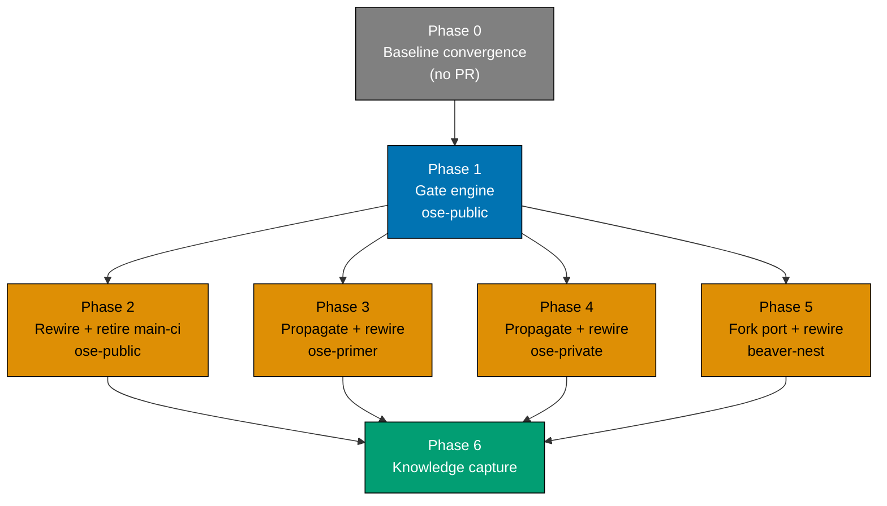

# Tech Docs — SDLC Gate Registry Enforcement

## 1. Audit Baseline — What Actually Runs Today

Captured 2026-08-02 across all four repos. This table is the conformance baseline the plan closes.
`lint-staged` is listed separately from `pre-commit` because it is the file-type dispatch mechanism
the pre-commit hook delegates to, and it is where most of the drift hides.

| Check                                                     | lint-staged     | pre-push         | PR gate                       | main-ci   | Verdict                                                                                               |
| --------------------------------------------------------- | --------------- | ---------------- | ----------------------------- | --------- | ----------------------------------------------------------------------------------------------------- |
| `md naming validate`                                      | yes             | —                | —                             | —         | Violates rule — never reaches CI                                                                      |
| `md frontmatter validate`                                 | yes             | —                | —                             | —         | Violates rule — never reaches CI                                                                      |
| `convention emoji validate`                               | yes             | —                | —                             | —         | Violates rule — never reaches CI                                                                      |
| `docker compose config`                                   | yes             | —                | —                             | —         | Violates rule — never reaches CI                                                                      |
| Formatters (prettier, rustfmt, gofmt, shfmt, fantomas, …) | write           | —                | auto-commit                   | —         | Never verified anywhere                                                                               |
| `env staged-guard validate`                               | — (hook step 1) | —                | —                             | —         | Staged-only — reads the git index; no CI counterpart can exist. Declare with `carve-out: staged-only` |
| `harness bindings generate`                               | — (hook step 3) | —                | —                             | —         | Mutation, not a check. Declare as `type: mutation`                                                    |
| lockfile sync                                             | — (hook step 4) | —                | —                             | —         | Mutation, inline shell. Extract to `git lockfile sync`, declare as `type: mutation`                   |
| `commitlint`                                              | — (commit-msg)  | —                | —                             | —         | Message-text scope; no file surface. Declare on the `commit-msg` surface                              |
| `harness bindings validate`                               | —               | path-gated       | —                             | —         | Violates rule — never reaches CI                                                                      |
| `harness sync validate` / `validate:sync`                 | —               | —                | —                             | —         | Declared in `package.json`, invoked nowhere                                                           |
| `md mermaid validate`                                     | yes             | —                | —                             | all files | Violates rule — absent from PR gate                                                                   |
| `md heading-hierarchy validate`                           | yes             | —                | —                             | all files | Violates rule — absent from PR gate                                                                   |
| `specs:structure-validation`                              | —               | via `test:quick` | pinned `--projects=rhino-cli` | `--all`   | Pinned scope, not affected scope                                                                      |
| `markdownlint-cli2`                                       | yes             | —                | via `npm run lint:md`         | all files | Conforms                                                                                              |
| `md links validate`                                       | —               | repo-wide        | repo-wide                     | repo-wide | Conforms                                                                                              |
| `md readme-index validate`                                | —               | repo-wide        | repo-wide                     | repo-wide | Conforms; absent from the standard's tables                                                           |
| `harness duplication validate`                            | —               | repo-wide        | repo-wide                     | repo-wide | Conforms; absent from the standard's tables                                                           |
| `convention license validate`                             | —               | path-gated       | always                        | always    | Conforms; absent from the standard's tables                                                           |
| `env validate`                                            | —               | repo-wide        | `validate-env.yml`            | repo-wide | Conforms via the standalone workflow                                                                  |
| `deps:audit`                                              | —               | —                | —                             | —         | Cron-only, undeclared side-channel                                                                    |

Two further structural findings:

- **The PR gate's `format` job carries `if: github.event_name == 'pull_request'`**, so on a direct
  push to `main` the entire `lint-staged` pass is skipped. Every per-file validator is therefore
  absent from the `main` path even where it is present on the PR path.
- **`main-ci.yml` has no `push` trigger** in any repo — `schedule` plus `workflow_dispatch` only. It
  cannot block a merge. The surface the ratified standard calls the "main quality gate" does not gate.

Per-repo variation on the above is small and does not change any verdict:

- `ose-private` alone already runs `markdown-per-file` (mermaid, heading-hierarchy) in its PR gate,
  and its pre-push additionally runs `specs structure validate` and `npm run lint:md`. It also adds an
  `iac-lint` gate (terraform, yamllint) the other three do not have.
- `ose-primer` adds per-language gates for its polyglot demo apps and names its audit workflow
  `Nightly Dependency Audit` where the other three use `deps-audit`.
- `beaver-nest` is near-identical to `ose-public` and carries a **fork** of `rhino-cli`.

## 2. Design

### 2.1 Why a registry rather than a linter over the existing files

The alternative considered was a validator that parses `.husky/*` shell and `pr-quality-gate.yml`
and diffs the extracted command sets. It was rejected: extracting a check set from arbitrary shell
requires understanding conditionals, variable expansion, and `lint-staged` glob dispatch. The
validator would be a shell interpreter with a permanent false-positive tail.

Declaring the check set once and _deriving_ both surfaces from it inverts the problem — there is
nothing to extract, because there is nothing hand-written to drift. This is the same shape the repo
already runs for harness bindings: one hand-authored source, generated consumers, and a validator
that fails on divergence.

### 2.2 Registry location and shape

The registry is a new `gates:` section in the existing root `repo-config.yml`, joining the sections
already there (`harness`, `coverage`, `specs`, `instruction-size`, `env-contract`, `env-injection`).
It is read by the existing strict-deserialize path, so an unknown key or a bad enum fails
`rhino-cli repo-config validate` at the schema-parity gate that already runs.

```yaml
gates:
  - id: md-links
    command: "md links validate"
    kind: rhino-cli
    args:
      exclude:
        - plans/done
        - apps/ayokoding-www/content
        - apps/ose-www/content
    surfaces:
      pre-push: { scope: all-file-type }
      ci: { scope: all-file-type }

  - id: md-mermaid
    command: "md mermaid validate"
    kind: rhino-cli
    args:
      exclude:
        - apps/rhino-cli/tests/fixtures
        - plans/done
        - apps/ayokoding-www/content
    surfaces:
      pre-commit: { scope: affected-file-type, glob: "*.md" }
      ci: { scope: all-file-type }

  - id: harness-bindings
    type: check
    command: "harness bindings validate"
    kind: rhino-cli
    surfaces:
      pre-push:
        scope: path-gated
        trigger:
          - ".amazonq/"
          - ".claude/"
          - ".opencode/"
          - ".cursor/"
          - "AGENTS.md"
          - "CLAUDE.md"
      ci: { scope: other }

  - id: shellcheck
    type: check
    command: "shellcheck --severity=warning"
    kind: external
    surfaces:
      pre-commit: { scope: affected-file-type, glob: "*.sh" }
      ci: { scope: affected-file-type, glob: "*.sh" }

  - id: test-quick
    type: check
    command: "test:quick"
    kind: nx
    wiring: hand-wired
    surfaces:
      pre-push: { scope: affected-projects }
      ci: { scope: affected-projects }

  - id: env-staged-guard
    type: check
    command: "env staged-guard validate"
    kind: rhino-cli
    carve-out: staged-only
    surfaces:
      pre-commit: { scope: other }

  - id: commitlint
    type: check
    command: 'npx --no -- commitlint --edit "$1"'
    kind: external
    surfaces:
      commit-msg: { scope: other }

  - id: format-prettier
    type: mutation
    command: "prettier --write"
    kind: external
    restages: true
    surfaces:
      pre-commit: { scope: affected-file-type, glob: "*.{md,json,yml,yaml,css,scss,html,sql,ts,tsx,js,jsx,mjs,cjs}" }

  - id: format-verify
    type: check
    command: "prettier --check"
    kind: external
    surfaces:
      ci: { scope: all-file-type }

  - id: harness-bindings-generate
    type: mutation
    command: "harness bindings generate"
    kind: rhino-cli
    restages: true
    surfaces:
      pre-commit: { scope: other }

  - id: lockfile-sync
    type: mutation
    command: "git lockfile sync"
    kind: rhino-cli
    restages: true
    surfaces:
      pre-commit: { scope: affected-file-type, glob: "apps/*/package.json" }

  - id: deps-audit
    type: check
    command: "deps:audit"
    kind: nx
    wiring: hand-wired
    surfaces:
      cron: { scope: all-projects }
```

Field contract:

| Field       | Required       | Meaning                                                                                                                                  |
| ----------- | -------------- | ---------------------------------------------------------------------------------------------------------------------------------------- |
| `id`        | yes            | Stable, unique, kebab-case. The job name in CI and the label in `gate run` output.                                                       |
| `type`      | yes            | `check` (can fail; subject to the composition rule) or `mutation` (rewrites files; cannot fail on style; exempt from the rule).          |
| `command`   | yes            | Leaf command. Interpretation depends on `kind`.                                                                                          |
| `kind`      | yes            | `rhino-cli` (invoked through the local binary), `external` (a tool on `PATH`), or `nx` (an Nx target).                                   |
| `wiring`    | no (checks)    | `matrix` (default — CI emits one job per gate) or `hand-wired` (the workflow declares the job itself; validation asserts presence only). |
| `restages`  | no (mutations) | `true` when the mutation's output must be `git add`-ed back, so generated files commit in lockstep.                                      |
| `args`      | no             | Command-shaped data that legitimately differs per repo — chiefly `exclude` lists.                                                        |
| `surfaces`  | yes            | Map of surface name to scope descriptor. At least one entry.                                                                             |
| `carve-out` | no (checks)    | `staged-only` — the check reads the git index, so no CI counterpart can exist. Exempts it from the composition rule.                     |

Surface names are `commit-msg`, `pre-commit`, `pre-push`, `ci`, and `cron`. Scope values are the five
already ratified in the SDLC Gate Standard — `affected-file-type`, `all-file-type`,
`affected-projects`, `all-projects`, `other` — plus `path-gated`, which is the qualifier the standard
already applies in prose to the governance validators. No new scope vocabulary is introduced.

**Declaration order is execution order.** `gate run` executes a surface's entries top to bottom, so
the registry preserves the ordering the hooks have today: the staged guard first, then the
per-file pass, then the mutations that regenerate and re-stage.

### 2.2.1 Why mutations are in the registry

Mutations are not checks — `prettier --write`, `harness bindings generate`, and the lockfile sync
rewrite files rather than failing. Declaring them anyway is what makes the registry a **complete**
source of truth: after this change, anything a surface does is in `gates:`, and anything absent from
`gates:` is not run by any surface. There is no third category living in prose.

Three consequences:

1. **The composition rule applies to `type: check` only.** A mutation at pre-commit does not demand
   a CI counterpart, because auto-fixing on a server that then has to commit back is a different
   operation, not the same check at a different scope.
2. **`carve-out: formatter` is no longer needed** and is removed from the schema. It existed to stop
   the rule from demanding a pre-commit `prettier --check` alongside the auto-fix. With formatters
   declared as `type: mutation`, the rule never reaches them. `format-verify` is an ordinary
   `type: check` declared on `ci` only — and a CI-only check was never a violation, since the rule
   runs pre-commit/pre-push ⇒ ci, not the reverse.
3. **`lockfile-sync` must become a real command.** It is inline shell in `.husky/pre-commit` today.
   To be declarable it moves into `rhino-cli` as `git lockfile sync`. This adds one command to
   Phase 1 that the original draft did not carry.

### 2.2.2 lint-staged is generated, not replaced

The per-file entries above (formatters, tool-linters, per-file validators) are exactly what
`lint-staged` dispatches today. `gate run --surface=pre-commit` does **not** reimplement that
dispatch — it invokes `npx lint-staged`, and the `lint-staged` block in `package.json` becomes a
**generated artifact** emitted from the registry by `rhino-cli gate emit --surface=pre-commit`.

This reuses the machinery the repo already trusts: hand-authored source, generated consumer,
validator that fails on divergence — the same shape as `harness bindings generate` plus
`harness bindings validate`. It also preserves `lint-staged`'s stash-and-restore safety, which a
bespoke dispatcher would have to re-earn.

The emitter writes marker-first: it checks for the already-applied marker **before** locating the
anchor, so a re-run replaces the block rather than appending a second copy.

### 2.3 Why gate _sets_ may differ per repo but the schema may not

The `apps/rhino-cli` byte-identity boundary requires the engine to be identical across `ose-public`,
`ose-primer`, and `ose-private`. The registry is data, and the boundary explicitly permits per-repo
data divergence — the existing `repo-config.yml` already differs per repo in `specs.domain-areas`,
`env-contract` scan paths, and the harness lists.

This plan states the rule for `gates:` explicitly, because it is a list rather than a fixed key set:

- **The schema is identical** — every entry in every repo conforms to the same field contract and the
  same enums. `rhino-cli repo-config validate` enforces this and already runs at pre-commit, the PR
  gate, and the schema-parity gate.
- **The entry set may differ**, because it follows the repo's actual app and tool set. `ose-private`
  declaring an `iac-lint` gate is sanctioned divergence of the same kind as it shipping Terraform at
  all. This is recorded under
  [Allowed Divergence](../../../docs/reference/sdlc-gate-standard.md#allowed-divergence).

### 2.4 Command surface

Four new leaf commands under a `gate` domain, following the ratified verb-last naming
(`{domain} {sub-domain} {verb}`), plus one supporting command extracted from the pre-commit hook:

| Command                                                        | Purpose                                                                                                                                                      |
| -------------------------------------------------------------- | ------------------------------------------------------------------------------------------------------------------------------------------------------------ |
| `rhino-cli gate list [--surface=<name>] [--format=json\|text]` | Enumerate declared gates, optionally projected onto one surface. JSON feeds the CI matrix.                                                                   |
| `rhino-cli gate run --surface=<name> [--only=<id>]`            | Execute every gate on that surface in declaration order, stopping at first failure. Path-gated entries are skipped when their triggers miss the changed set. |
| `rhino-cli gate emit --surface=pre-commit`                     | Regenerate the `lint-staged` block in `package.json` from the registry, marker-first. The generate half of the generate-and-validate pair.                   |
| `rhino-cli gate validate`                                      | The conformance gate. Fails on composition-rule violations and on surface files that no longer agree with the registry.                                      |
| `rhino-cli git lockfile sync`                                  | The lockfile-sync step, extracted from inline shell so it can be declared as a `type: mutation` gate.                                                        |

`gate validate` performs five checks:

1. **Composition rule** — every gate with `type: check` declaring `pre-commit` or `pre-push` must
   also declare `ci`, unless it carries `carve-out: staged-only`. Gates with `type: mutation` are
   not subject to this check.
2. **Surface-shim integrity** — `.husky/pre-commit` and `.husky/pre-push` invoke
   `gate run --surface=…` for every surface with declared gates.
3. **CI derivation** — for gates with `wiring: matrix` (the default), `pr-quality-gate.yml` builds
   its job matrix from `gate list` and runs no check command the registry does not declare. Gates
   with `wiring: hand-wired` are exempt from matrix derivation; the check asserts only that a job
   invoking them **exists** in the workflow. This is what lets the per-language `test:quick` jobs
   keep their own `setup-dotnet` / `setup-rust` steps while remaining declared and validated.
4. **No orphan surfaces** — no surface file invokes a gate id the registry does not carry.
5. **Emitted-artifact freshness** — the `lint-staged` block in `package.json` matches what
   `gate emit --surface=pre-commit` would write. Fails if someone hand-edits the generated block.

Checks 2 through 5 are deliberately narrow: they assert _that the surface derives from the registry_,
not _what the surface runs_. That is what makes them robust — there is no shell to interpret.

### 2.5 CI wiring — matrix, not a single job

`gate run --surface=ci` is **not** used by CI. Running every check inside one job would serialize
work that is currently parallel and would lose the per-language toolchain setup actions. Instead the
workflow derives a matrix:

```yaml
jobs:
  enumerate:
    outputs:
      gates: ${{ steps.list.outputs.gates }}
    steps:
      - id: list
        run: echo "gates=$(rhino-cli gate list --surface=ci --format=json)" >> "$GITHUB_OUTPUT"

  gate:
    needs: enumerate
    strategy:
      fail-fast: false
      matrix:
        gate: ${{ fromJson(needs.enumerate.outputs.gates) }}
    name: ${{ matrix.gate.id }}
    steps:
      - run: rhino-cli gate run --surface=ci --only=${{ matrix.gate.id }}
```

The matrix carries only `wiring: matrix` gates — `gate list` filters `hand-wired` entries out of the
`--format=json` projection used above, so they never produce a matrix row. One gate, one job, same
parallelism as today, and the job list can no longer drift from the registry because it is computed
from it.

The per-language `test:quick` jobs stay hand-written for their toolchain setup. They are declared as
`wiring: hand-wired` gates, so `gate validate` check 3 asserts a job invoking them exists without
demanding it be matrix-emitted. That is the reconciliation the first draft of this document was
missing: it claimed CI "runs no check command the registry does not declare" while simultaneously
leaving those jobs undeclared.

### 2.6 Formatting verification

Ratified rule 2 exempts formatters from being pass/fail checks at pre-commit, where they rewrite in
place. This plan keeps that exactly, expressed structurally: the formatters are declared
`type: mutation`, and the composition rule applies only to `type: check`. No carve-out is needed —
`carve-out: formatter` is removed from the schema, since with formatters modelled as mutations the
rule never reaches them.

`format-verify` is an ordinary `type: check` declared on `ci` only. A CI-only check was never a
composition-rule violation, because the rule runs pre-commit/pre-push ⇒ ci, not the reverse.

Net effect: unformatted code is still silently normalized when you commit locally, and can no longer
reach `main` through a hook-bypassed or web-UI push.

### 2.7 `main-ci.yml` retirement sequence

Order matters and is enforced by the phase gates:

1. Declare `md-mermaid`, `md-heading-hierarchy`, and the structural specs validator on the `ci`
   surface in the registry.
2. Verify they appear in `gate list --surface=ci --format=json` and produce matrix jobs.
3. Unpin the specs job from `--projects=rhino-cli`.
4. Only then delete `.github/workflows/main-ci.yml`.
5. Scrub every reference — `docs/reference/sdlc-gate-standard.md`,
   `repo-governance/development/infra/nx-targets.md`,
   `docs/reference/system-architecture/ci-cd.md`.

## 3. Document Amendments

| Document                                                     | Change                                                                                                                                                                                                                                                                                                                                                   |
| ------------------------------------------------------------ | -------------------------------------------------------------------------------------------------------------------------------------------------------------------------------------------------------------------------------------------------------------------------------------------------------------------------------------------------------- |
| `docs/reference/sdlc-gate-standard.md`                       | Composition rule becomes `(pre-commit ∪ pre-push) == PR gate`. Stage table drops stage 5. Stage 5 section removed. Stage 3 and 4 tables corrected to include `md readme-index validate`, `harness duplication validate`, `convention license validate`. Registry described as the normative mechanism. Allowed Divergence gains the gate-entry-set rule. |
| `repo-governance/development/workflow/git-hook-lifecycle.md` | Rewritten. Currently describes a pre-push that no longer exists, cites the non-existent target `specs:coverage`, and (in `ose-primer`) cites the non-existent workflow `validate-markdown.yml`. Its CI-parity table is replaced by a pointer to `gate list`, so it cannot restale. Created fresh in `ose-private`, which lacks it.                       |
| `repo-governance/development/infra/nx-targets.md`            | Drops `main-ci` references.                                                                                                                                                                                                                                                                                                                              |
| `docs/reference/system-architecture/ci-cd.md`                | Drops `main-ci` references; documents the matrix derivation.                                                                                                                                                                                                                                                                                             |
| `AGENTS.md`                                                  | Git Hooks section updated to describe the shim form. Watch the instruction-size budget — this section should shrink, not grow.                                                                                                                                                                                                                           |

## 4. Risks and Mitigations

| Risk                                                                               | Severity | Mitigation                                                                                                                                |
| ---------------------------------------------------------------------------------- | -------- | ----------------------------------------------------------------------------------------------------------------------------------------- |
| Cross-PR interaction breakage no longer swept                                      | Accepted | Documented in [brd.md §Accepted Risk](./brd.md#accepted-risk) with the reopening trigger and the named remedy                             |
| Registry becomes a second source of truth beside the standard doc                  | Medium   | The standard doc stops enumerating commands and points at `gate list`; `gate validate` is the enforcement, prose is the explanation       |
| Byte-identity window while the engine lands in `ose-public` before the other repos | Medium   | Phases 3 and 4 are the immediate next nodes and run in parallel; the window is stated in the delivery checklist and closed before Phase 6 |
| `beaver-nest`'s fork diverges from the engine                                      | Medium   | Phase 5 ports explicitly; `gate validate` exiting zero in `beaver-nest` is a phase-gate condition                                         |
| Matrix job names change, breaking required-status-check configuration              | Low      | Branch-protection required checks are re-pointed at the `quality-gate` join job, which is stable                                          |
| A re-runnable registry-emitting step duplicates on re-run                          | Low      | Any generated block is written marker-first: check the applied marker before the anchor                                                   |

## 5. Delivery DAG



Phase 1 is the single blocking node — the engine must be final before any repo copies it, because the
copy is byte-identical. Phases 2 through 5 are mutually independent and fan out up to the plan's
concurrency cap. Phase 6 is the terminal cleanup node.
