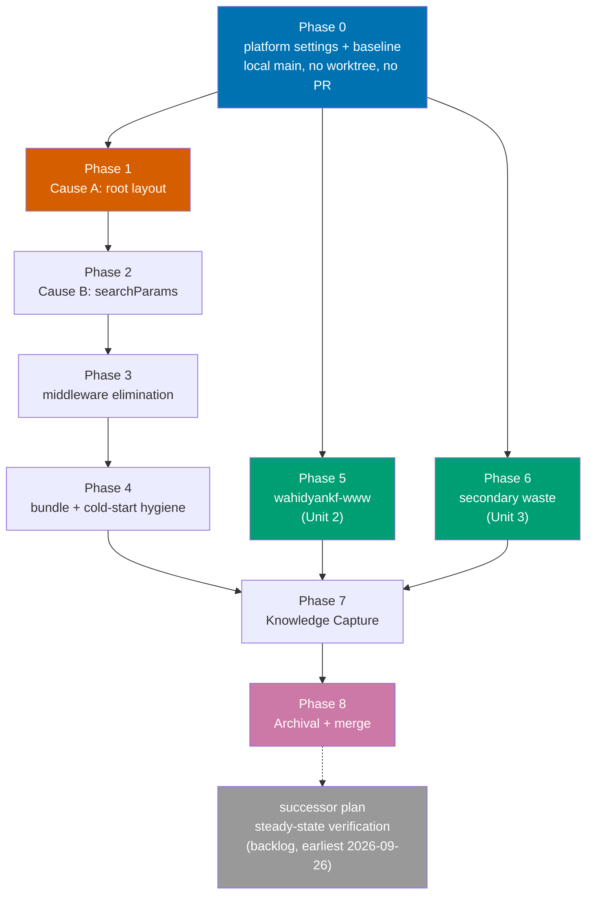

# Delivery — Vercel Function Cost Reduction

> **Legend** — `[AI]`: an agent performs the step (the default; unmarked steps are `[AI]`).
> `[HUMAN]`: only a human can do it (physical action, out-of-band approval, real-secret or
> privileged-credential handling). `[AI+HUMAN]`: agent prepares, human approves or finishes.
>
> **Phase Gate** — every phase ends with a `### Phase N Gate` (must-pass verification) plus a
> `> **Pause Safety**:` note (the safe-to-stop state and how to resume). A phase is not complete
> until its gate is green; do not start phase N+1 while any gate check fails.
>
> This plan **does** use `[HUMAN]` steps, but fewer than it did. The **Vercel MCP**
> (`plugin:vercel:vercel`) is authenticated as of 2026-08-01, which moves Phase 0's _measurement_
> steps to `[AI]`. Its _settings_ steps stay `[HUMAN]`: the MCP exposes no billing, Spend
> Management, Observability, firewall, Fluid Compute, or domain tool, and the invoice reading —
> now split out to its own plan — needs an account owner. See
> [tech-docs.md §Vercel MCP capability boundary](./tech-docs.md#vercel-mcp-capability-boundary) and
> DD-8. Git-mechanical steps (worktree create/remove, branch, push, merge) remain `[AI]`.
>
> **MCP call shape** used throughout — address projects by **slug, never by opaque ID**:
> `teamId: "wahidyan-kresna-fridayokas-projects"`, `projectId: "ayokoding-www"`. Both tool
> parameters accept a slug in place of the `team_*`/`prj_*` ID, and these slugs are already public
> (they appear in every deployment hostname), whereas the IDs are not — and this repo is public with
> permanent history. See [tech-docs.md §Identifiers in a public repo](./tech-docs.md#identifiers-in-a-public-repo).
> Widest usable window is `since: "72h"` — `7d` times out. Always pass `limit`, or `group_by`
> silently truncates.

## Worktree

This plan uses **three** worktrees, one per independent delivery unit, per the strict
1-PR ↔ 1-worktree rule:

| Unit | Worktree path                       | Branch                                           |
| ---- | ----------------------------------- | ------------------------------------------------ |
| 1    | `worktrees/vercel-cost-ayokoding/`  | `vercel-function-cost-reduction/ayokoding-www`   |
| 2    | `worktrees/vercel-cost-wahidyankf/` | `vercel-function-cost-reduction/wahidyankf-www`  |
| 3    | `worktrees/vercel-cost-secondary/`  | `vercel-function-cost-reduction/secondary-waste` |

Optional manual pre-provisioning (run from repo root):

```bash
claude --worktree vercel-cost-ayokoding
```

After any `git worktree add`, run `npm install` **and** `npm run doctor -- --fix` per the Worktree
Toolchain Initialization requirement.

**Phase 0 runs in the primary checkout on local `main` — no worktree.** It produces no shippable
code: its outputs are dashboard settings (not in the repo at all), evidence markdown inside this
plan folder, and throwaway builds used only to read a route table. That is exactly the plan-docs-only
carve-out, and provisioning three worktrees to hold zero code changes would be waste. **The three
worktrees are created at the start of Phases 1, 5, and 6 respectively**, off `main` as it stands once
Phase 0's gate is green.

Plan-document authoring and promotion likewise happen on local `main`; from Phase 1 onward,
execution-time delivery ticks go in the relevant worktree copy.

See [Worktree Path Convention](../../../repo-governance/conventions/structure/worktree-path.md) and
[Plans Organization Convention §Worktree Specification](../../../repo-governance/conventions/structure/plans.md#worktree-specification).

## Delivery Mode: worktree-to-pr

Each unit works in its own worktree; a draft PR opens against `main` once that unit has committed
work; the PR-Review Maker→Fixer Cycle (3 sequential CI-gated cycles) runs before merge; `[AI]`
merges once the hardened preconditions hold. See
[Plans Organization Convention §Delivery Mode](../../../repo-governance/conventions/structure/plans.md#delivery-mode).

## Parallelization Model

`1 main thread + N background agents`, **N=3**. The three code units touch disjoint apps and share
no files, so they are independent DAG leaves and fan out to fill all three slots. Phase 0 gates all
of them; Phase 7 (Knowledge Capture) joins them.

### Dependency DAG



The dashed edge is deliberate: the successor plan is **unblocked** by this plan's completion, not
executed by it.

Phases 1→2→3→4 are a dependent chain: Cause B's build verification needs Cause A fixed first; the
middleware can only be deleted once nothing reads `x-pathname`; and tracing scope depends on which
routes ended up static. One chain, one worktree, one PR.

### Delivery Boundaries

| Delivery unit | Phases                            | Worktree / branch                                                                      | PR opens at                                                  |
| ------------- | --------------------------------- | -------------------------------------------------------------------------------------- | ------------------------------------------------------------ |
| Unit 1        | Phases 1–4 (`apps/ayokoding-www`) | `worktrees/vercel-cost-ayokoding/` on `vercel-function-cost-reduction/ayokoding-www`   | Phase 1 (draft); reviewed and merged at the Phase 4 boundary |
| Unit 2        | Phase 5 (`apps/wahidyankf-www`)   | `worktrees/vercel-cost-wahidyankf/` on `vercel-function-cost-reduction/wahidyankf-www` | Phase 5 (draft); reviewed and merged at the Phase 5 boundary |
| Unit 3        | Phase 6 (secondary waste)         | `worktrees/vercel-cost-secondary/` on `vercel-function-cost-reduction/secondary-waste` | Phase 6 (draft); reviewed and merged at the Phase 6 boundary |
| Phase 0       | Phase 0 (settings + baseline)     | **primary checkout, local `main`** — no worktree, no code output                       | none (hard rule)                                             |
| Closeout      | Phases 7–8                        | `worktrees/vercel-cost-ayokoding/` reused after Unit 1 merges                          | Phase 8                                                      |

Phase 0 opens **no PR** (hard rule); its evidence rides Unit 1's PR.

---

## Phase 0: All platform settings, the baseline, and the middleware-behaviour question

> **Runs in the primary checkout on local `main`** — no worktree, no branch, no PR. Nothing this
> phase produces is shippable code: dashboard settings never touch the repo, evidence markdown is
> plan-docs, and the baseline builds exist only to read a route table. The three worktrees are
> created at the start of Phases 1, 5, and 6.
>
> The **settings** steps (0.2–0.5) are `[HUMAN]` — the Vercel MCP has no tool for any of them. The
> **measurement** steps (0.1, 0.6, 0.7, 0.8) are `[AI]` via the MCP. Do them in the stated order: the
> baseline snapshot must precede disabling Observability, or the per-project attribution is lost
> permanently.

### 0.1 Capture the per-project baseline — DO THIS FIRST

- [x] `[AI]` Record **per-project** invocation volume for all seven projects (`ayokoding-www`,
      `ose-www`, `organiclever-www`, `wahidyankf-www`, `organiclever-app-web`, `ose-app-web`, and
      `web-ui`) via the MCP: `get_runtime_logs` with `environment: "production"`, `since: "24h"`,
      `limit: 20`, and `group_by` run three ways — `source`, `route`, `statusCode`. Repeat `source`
      at `since: "72h"` for a rate stable enough to project from.
  - Acceptance: a table of seven rows is committed to
    `plans/in-progress/vercel-function-cost-reduction/evidence/baseline-per-project.md`. Before this
    step the file does not exist; after it, `test -f` exits 0 and the file names all seven projects.
  - Rationale: aggregate billing cannot be split per project from repo evidence (DD-7), and step 0.5
    destroys the ability to take this later.
  - **Done 2026-08-01.** Result: `ayokoding-www` is **43,105 of 43,150** function events across all
    seven projects — **99.90%**; `[...slug]` alone is **85.6%** of that. The DD-7 inference held.
    Independent cross-check: 91,162 invocations/day measured versus 85,250/day read off the
    dashboard on 2026-07-30, ~7% apart.
- [x] `[HUMAN]` Record the cycle-to-date Infrastructure Subtotal and the elapsed day count, so the
      monthly extrapolation is reproducible. **Still `[HUMAN]`** — the MCP exposes no billing or
      usage tool, so no agent can read a currency figure (DD-8).
  - Acceptance: same evidence file states both numbers. Baseline for comparison: **$7.43 over ~4
    days as of 2026-07-30**.
  - Append to the "What still needs a human" table already in the evidence file.
  - **Date**: 2026-08-01. **Status**: done — the account owner supplied the dashboard reading
    directly, which is the only route to this datum (DD-8).
  - **Files Changed**: `evidence/baseline-per-project.md`.
  - **Result**: **$9.79 of the $20 included credit consumed, $0.00 on-demand, 7 of 31 cycle days
    elapsed** (panel read "24 days remaining"). Rate **$1.399/day → ~$43/month gross**, materially
    **below** the ~$57/month the 2026-07-30 short-window reading projected. Baseline for the rest of
    the plan is now**$43/month**, not $57. Largest line: Function Duration $6.62 (~$29/mo).
  - **Dated projection**: credit exhausts ~**Aug 8**; the $30 budget goal is passed ~**Aug 15**; the
    $15 spend cap trips at $35 gross ~**Aug 19**, pausing every production project. Cycle close ~$43
    if nothing changes — above the cap, so it fires this cycle unless Phases 1–4 land first.
  - **Incidental finding**: `Fluid Active CPU` and `Fluid Provisioned Memory` are already listed at
    $0.00 next to a non-zero `Function Duration`. Vercel renders the full catalogue and zeroes
    inapplicable lines, so step 0.3's acceptance clause needed correcting — see the next item.

### 0.2 Install the spend safety rail

- [x] `[HUMAN]` Team → Settings → Billing → **Spend Management**: enable it, set the spend amount to
      **$15**, and explicitly enable **"Pause production deployment"** (off by default; requires
      typing the team name to confirm).
  - **The spend amount is measured after the credit, not before it.** Verbatim: "The spend amount
    that you set covers metered resources that go **beyond** your Pro plan credits and usage
    allocation." So $15 means $15 of _on-demand_ charge on top of the $20 platform fee — an
    **enforced worst case of $35**. It does **not** mean $15 of gross usage. See
    [tech-docs.md DD-9](./tech-docs.md#dd-9--15-spend-cap-as-a-soft-backstop-under-a-30-budget-goal).
  - **$15 is a backstop, not the budget.** The budget goal is a **$30 invoice** and it is
    **advisory** — deliberately not mechanically enforced. The cap sits $5 above it so it fires only
    on a genuine runaway rather than on a normal overrun. The accepted consequence is that a quiet
    month can invoice up to **$35** without the cap ever intervening: **the cap stops catastrophe,
    not overspend.** Holding $30 is the engineering work's job, not the cap's.
  - **Consequence to expect, not a surprise**: at the measured burn rate (**$1.399/day gross**, from
    $9.79 over 7 days on 2026-08-01) the $20 credit is exhausted around **Aug 8**, the $30 advisory
    goal is passed around **Aug 15**, and on-demand reaches $15 around **Aug 19** — at which point
    every production project returns
    [`503 DEPLOYMENT_PAUSED`](https://vercel.com/docs/errors/DEPLOYMENT_PAUSED). Projects **do not
    auto-resume**: raising the amount does not unpause them, and each must be resumed individually
    via the dashboard or the REST API. Cycle close at this rate is ~$43, which is **above** the cap,
    so the cap **will** fire this cycle unless Phases 1–4 land first. That is the schedule pressure.
  - Acceptance: the Spend Management panel shows **$15** configured **and** the pause action enabled.
    Falsifiable both ways: before this step no amount is set and no pause action exists; after it,
    both are visible.
  - Note the threshold also excludes **seats, Marketplace integrations, and add-ons**, which Vercel
    bills separately and monthly.
  - **Date**: 2026-08-01. **Status**: done, per the account owner.
  - **Files Changed**: none — a dashboard setting.
  - **Result**: Spend Management enabled at **$15** with the pause action armed. Enforced worst-case
    invoice is therefore **$35** (`$20 platform fee + $15 post-credit on-demand`), sitting $5 above
    the **$30 advisory budget goal** exactly as DD-9 intends.
  - **The clock this starts is real and it is short.** At the measured $1.399/day, the cap fires
    around **Aug 19** and the cycle closes near **$43** — above the cap — so on today's trajectory
    the pause **will** trigger before Aug 26 and every production project will return
    `503 DEPLOYMENT_PAUSED` until each is resumed **by hand, one at a time**. Phases 1–4 are what
    prevent that; they are now schedule-critical, not merely cost-motivated.
  - **No independent verification was possible** — the Vercel MCP exposes no Spend Management tool
    and its token is expired besides (DD-8). This tick rests on the owner's attestation.

### 0.3 Migrate off legacy billing (DD-3)

- [x] `[HUMAN]` For each project with functions, Project → Settings → Functions → enable **Fluid
      Compute**. Then trigger a redeploy so the setting takes effect.
  - Acceptance **(corrected 2026-08-01 against the real dashboard)**: after the next cycle's first
    usage appears, **`Fluid Active CPU` and `Fluid Provisioned Memory` are non-zero** and
    **`Function Duration` has stopped accruing** (it holds at its pre-migration value rather than
    climbing). Falsifiable both ways: today the reverse holds — Function Duration is $6.62 and
    climbing while both Fluid lines sit at $0.00.
  - **Do not use "the Fluid line items appear" as the test.** They are already present at $0.00
    today, alongside the legacy line. Vercel renders the full line-item catalogue and zeroes the ones
    that do not apply, so presence proves nothing and absence never happens. The original clause
    asserted a before-state that does not exist and would have passed the moment anyone looked.
    Legacy billing is diagnosed by `Function Duration` being **non-zero**, not by Fluid lines being
    missing.
  - **Date**: 2026-08-01. **Status**: setting applied — the account owner reports Fluid Compute
    enabled on every project. **Its acceptance clause is deliberately deferred**, because the clause
    is a billing observation and billing has not yet turned over.
  - **Files Changed**: none — a dashboard setting, no repo surface.
  - **No independent corroboration was available.** The Vercel MCP returned
    `requires re-authorization (token expired)`, and even authenticated it exposes no Fluid tool —
    `get_deployment` reports `type: "LAMBDAS"` either way (DD-8, and §"Vercel MCP capability
    boundary" in tech-docs.md). This tick therefore rests on the owner's attestation, which is the
    only evidence obtainable today. Recorded plainly rather than dressed up as a verification.
  - **Carry-forward — the acceptance is graded by the successor plan, not here.** Enabling Fluid
    Compute changes the meter, and a meter is only readable once it has metered. The check that
    `Fluid Active CPU` / `Fluid Provisioned Memory` go non-zero **while `Function Duration` stops
    climbing** belongs to
    [`vercel-cost-steady-state-verification`](../../../backlog/vercel-cost-steady-state-verification/README.md),
    which reads a full closed cycle.
  - **Open item — does the setting bind yet?** Fluid Compute applies to **new deployments**; it does
    not retrofit the deployment already serving traffic. If no redeploy followed the toggle, the
    setting is enabled but **inert**, and `Function Duration` keeps accruing exactly as before. This
    self-resolves the moment Phase 1 ships (every phase deploys), so it blocks nothing — but until
    then, do **not** read a still-climbing `Function Duration` as evidence that the migration
    failed. Confirm a post-toggle deployment exists before drawing any conclusion from the meter.

### 0.4 Enable the free firewall rulesets (DD-2)

- [ ] `[HUMAN]` Firewall → Managed Rulesets: set **Bot Protection** to active (from its default
      "Off") and **AI Bots** to **deny** (from its default "Allow"), for the public sites.
  - Acceptance: both rulesets show as active/deny in the dashboard.
- [ ] `[AI]` **Mandatory indexability smoke-test**, run immediately after the toggle — documentation
      does not confirm that verified crawlers such as Googlebot are auto-allowlisted, so verify
      rather than assume. No dashboard needed, so this half is `[AI]`:

  ```bash
  curl -sS -o /dev/null -D - -A "Mozilla/5.0 (compatible; Googlebot/2.1; +http://www.google.com/bot.html)" \
    https://www.ayokoding.com/en/learn/courses/debugging-and-profiling/learning
  curl -sSI https://www.ayokoding.com/robots.txt https://www.ayokoding.com/sitemap.xml
  ```

  - Acceptance: the Googlebot-UA fetch returns 200 with page content. Falsifiable both ways: a
    challenge interstitial or a non-200 fails this check and triggers the rollback below.
  - Second signal, MCP-side: `get_runtime_logs` `group_by: statusCode` over `since: "24h"` must not
    show a new mass of `403`s after the toggle. Baseline for comparison is in the evidence file
    (200: 42,524 / 404: 731 / 307: 98 / 504: 49 / 206: 13).
  - **Rollback if it fails**: `[HUMAN]` sets Bot Protection back to "Off" (single toggle, no
    deploy). Record the outcome in the evidence file either way.
  - **Date**: 2026-08-01. **Status**: **FAILED — rollback triggered. This step is not done.**
  - **Files Changed**: none.
  - **What was set** (dashboard screenshot, account owner): Bot Protection = **Challenge**, AI Bots =
    **Deny**. BotID left at Basic/uninstalled. So the `[HUMAN]` half was applied as specified —
    "Challenge" is the active mode, and its own subtitle reads "Challenge requests from non-browser
    sources, **excluding verified bots**".
  - **Result — every probe returned `HTTP/2 429` with `<title>Vercel Security Checkpoint</title>`**:

    | Probe                                | Result                             |
    | ------------------------------------ | ---------------------------------- |
    | Googlebot UA → `/en/learn/courses/…` | `429` + checkpoint interstitial    |
    | Bingbot UA → `/en`                   | `429`                              |
    | `/robots.txt`                        | `429`                              |
    | `/sitemap.xml`                       | `429`                              |
    | Plain `curl` UA → `/en`              | `429`                              |
    | **Chrome-140 browser UA → `/en`**    | **`429` — the control also fails** |

  - **The acceptance clause is met in the negative and the rollback clause fires**: "a challenge
    interstitial or a non-200 fails this check". A 33,789-byte checkpoint page was returned instead
    of content. Not a marginal result.
  - **But the test cannot answer the question it was written to answer, and that flaw is the real
    finding.** Verified-bot exclusion is decided by reverse-DNS / source-IP verification, not by the
    `User-Agent` string. A `curl` that merely _claims_ to be Googlebot is by construction an
    unverified bot, so challenging it is **correct** behaviour. UA spoofing can therefore never
    prove verified-Googlebot access — the probe as designed is unfalsifiable in the direction that
    matters. Recorded rather than quietly reinterpreted as a pass.
  - **What the run does prove, and it is enough to act on**: the Chrome-140 **control** was
    challenged too. The challenge is not narrowly scoped to bot-shaped traffic; it gates any client
    that cannot execute the JS challenge. Real browsers solve it and proceed, so human visitors are
    likely unaffected — but every non-JS consumer is not: `robots.txt` and `sitemap.xml` are behind
    the interstitial, and so is every feed reader, link checker, uptime monitor, social-card
    unfurler, and non-verified crawler.
  - **Decision — roll Bot Protection back to "Off"; keep AI Bots = Deny.** The asymmetry decides it:
    the downside is deindexing a content site whose entire value is organic search, which is severe
    and slow to reverse; the upside is a fraction of a line item on a ~$43/month bill. Never trade
    an SEO catastrophe for a cost optimisation. **AI Bots = Deny stays** — it is the half that
    actually cuts invocations (AI scrapers hammer content sites), it targets scrapers rather than
    search crawlers, and nothing in this run implicates it.
  - **Re-entry condition, not abandonment.** Bot Protection may be re-enabled once verified-bot
    access is proven by a method that UA spoofing cannot fake — Google Search Console's **URL
    Inspection → Live Test** (authoritative, and `[HUMAN]`), or Vercel Firewall logs showing zero
    challenges issued to verified Google source IPs. Until one of those exists, this stays "Off".
  - **Follow-up filed against the successor plan**: the smoke-test design itself needs replacing in
    [`vercel-cost-steady-state-verification`](../../../backlog/vercel-cost-steady-state-verification/README.md)
    — a UA-header probe is the wrong instrument for an IP-verified control, and it would have
    produced the same uninterpretable result on any future re-attempt.

### 0.5 Disable Observability Plus (DD-1) — only after 0.1 is committed

- [x] `[HUMAN]` Team → Settings → Billing → Observability Plus: disable team-wide.
  - Acceptance: the Observability Events line stops accruing in the next cycle. Removes a measured
    ~$10/month.
  - Precondition: step 0.1's evidence file is committed. Do not proceed otherwise.
  - **Date**: 2026-08-01. **Status**: done, precondition satisfied.
  - **Files Changed**: none — a dashboard setting.
  - **Precondition check**: step 0.1's evidence file was committed in `c88a0d4a0` **before** this
    toggle, so the seven-project attribution table and the 72h rate survive the loss of retention.
    The ordering DD-7 insisted on held; nothing was measured away.
  - **Result**: Observability Plus disabled team-wide. Removes the second-largest line item —
    **$1.69 of $9.79 consumed, ~$7.5/month** at the measured rate.
  - **Acceptance is deferred by construction** (it grades a line item in the _next_ cycle) and is
    read by the successor plan, same as 0.3.
  - **Consequence to expect**: `get_runtime_logs` retention shrinks to the base tier. Every
    measurement that depended on it — the per-project split, the 72h rate, the status-code
    histogram, the middleware-executes finding — is already captured in
    [`evidence/baseline-per-project.md`](./evidence/baseline-per-project.md). Do not plan a phase
    around re-querying that data.
  - **Bonus, volunteered by the account owner and outside this plan's scope**: **Speed Insights
    disabled on all projects** as well. Not a line item in the 2026-08-01 baseline table (it read
    $0.00), so this books no measured saving — but it removes a client-side beacon per page view
    and forecloses the line item growing once Phases 1–4 raise cached page views. Recorded so the
    successor plan does not attribute the difference to the engineering work.

### 0.6 Resolve the blocking middleware question empirically — RESOLVED

- [x] `[AI]` Determine whether `middleware.ts` still executes on Next.js 16.2.6, because sources
      conflict and a silent no-op is worse than a build error. The MCP answers this directly rather
      than by inference from a redirect: `get_runtime_logs`, `group_by: source`, `since: "72h"`.
  - Acceptance: a non-zero `middleware` row proves execution. **If it executes**, Phase 3 must
    replace the redirects before deleting it. **If it does not**, Phase 3 becomes a pure cleanup and
    something else is serving `/` → `/en` (identify what before changing anything).
  - Falsifiable both ways: the two outcomes lead to materially different Phase 3 work, so this is
    not a formality.
  - **Answer, 2026-08-01: middleware executes.** 274,463 `middleware`-source events in 72h, against
    273,487 `function` events — a 0.36% gap, i.e. essentially one middleware invocation per function
    invocation. Corroborated by `curl`: `https://ayokoding.com/` still redirects.
  - **Consequence: Phase 3 takes the "replace before delete" branch.** The `/` → `/en` and
    uppercase-locale redirects must land in `next.config.ts` and be verified before
    `src/middleware.ts` is deleted.
- [x] `[AI]` Record the finding and its consequence. Recorded in
      [`evidence/baseline-per-project.md`](./evidence/baseline-per-project.md) (§Phase 0.6 resolved)
      rather than a separate `middleware-runtime-behaviour.md` — it is the same measurement run and
      splitting it would duplicate the numbers.

### 0.7 Repo baseline

- [x] `[AI]` `npm install` and `npm run doctor -- --fix` in the primary checkout.
  - **Date**: 2026-08-01. **Status**: done, no remediation needed.
  - **Files Changed**: none — both commands were no-ops against an already-converged environment.
  - **Result**: `npm install` → "up to date, audited 1596 packages"; `npm run doctor -- --fix` →
    "16/16 tools OK, 0 warning, 0 missing", "Target-share fix: 0 created, 4 already correct",
    "Nothing to fix — all tools are installed."
  - **Noted, not actioned**: `npm audit` reports 52 vulnerabilities (4 critical, 20 high, 26
    moderate, 2 low). Preexisting and out of this plan's scope — it changes no application
    dependency. Not a Phase 0 blocker; recorded here so the number is not mistaken for a regression
    introduced by later phases.
- [x] `[AI]` Build `apps/ayokoding-www` and record the prerendered route count:
      `nx build ayokoding-www && jq '.routes | length' apps/ayokoding-www/.next/prerender-manifest.json`
  - Acceptance: returns **4** (the documented pre-fix baseline). If it returns anything else, stop —
    the premise of the plan has changed and the analysis must be redone.
  - **Date**: 2026-08-01. **Status**: done — acceptance met exactly.
  - **Files Changed**: none (throwaway build; `.next/` is gitignored).
  - **Result**: `.routes | length` = **4**, `.dynamicRoutes | length` = **0**,
    `find .next/server/app -name "*.html" | wc -l` = **1**. All nine app routes print `ƒ`; only
    `/feed.xml`, `/robots.txt`, `/sitemap.xml` print `○`.
  - **Strongest single piece of evidence for Cause A yet, and it is new**: the build log reads
    `✓ Generating static pages using 11 workers (2103/2103) in 3.8min` — `generateStaticParams`
    enumerates and Next.js **renders all 2,103 pages at build time**, then emits exactly **one**
    HTML file and marks every route `ƒ`. The work is done and thrown away. This is not "prerendering
    never runs"; it is "prerendering runs and its output is discarded because a dynamic API in the
    root layout forces on-demand rendering." Phase 1 therefore recovers a build step that is already
    being paid for.
  - **Second-order cost, previously unquantified**: those 3.8 minutes of static generation are spent
    on every deploy for zero benefit. Phase 1 converts the same 3.8 minutes into 2,103 cached pages.
  - **Build-time warning to carry into Phase 3**: `The "middleware" file convention is deprecated.
Please use "proxy" instead.` Phase 3 deletes `src/middleware.ts` outright, so this resolves
    itself — do **not** spend a step migrating `middleware.ts` → `proxy.ts` for a file about to be
    removed.
  - **Pre-existing, out of scope, recorded so it is not mistaken for a regression**: eight KaTeX
    `strict: 'warn'` diagnostics (`Unrecognized Unicode character "–"/"—"`, `\\ does nothing in
display mode`) and a handful of `took more than 60 seconds … Retrying` messages on
    `/en/learn/legacy/software-engineering/software-architecture/*`. All retries succeeded — the
    build exited clean. Slow pages under `learn/legacy/` are a content-side signal, not a blocker.
- [x] `[AI]` Build `apps/wahidyankf-www` and record its route table.
  - Acceptance: three routes show `ƒ` (`/`, `/cv`, `/personal-projects`).
  - **Date**: 2026-08-01. **Status**: done — acceptance met exactly.
  - **Files Changed**: none (throwaway build).
  - **Result**: the route table is four rows — `ƒ /`, `○ /_not-found`, `ƒ /cv`,
    `ƒ /personal-projects`. Exactly the three predicted dynamic routes; `_not-found` is already
    static and is not a Phase 5 target.
  - **Corroborates two Phase 5 premises at once**: `robots.txt` and `sitemap.xml` are **absent from
    the route table entirely**, independently confirming §0.8's "no `robots.ts`/`sitemap.ts`" via a
    second method (build output, not file existence). Contrast `ayokoding-www`, whose table lists
    all three of `/feed.xml`, `/robots.txt`, `/sitemap.xml` as `○`.
  - **Scale contrast worth keeping**: 6 static pages generated in **225ms** here versus 2,103 in
    **3.8min** on `ayokoding-www`. Consistent with the measured 45-versus-43,105 invocation split —
    Unit 2 remains an SEO/correctness fix, not a cost saving (README §Measured baseline).
- [x] `[AI]` Resolve preexisting failures in scope before any plan work begins.
  - **Date**: 2026-08-01. **Status**: done — baseline is clean; nothing needed fixing.
  - **Files Changed**: none.
  - **Command**:
    `nx run-many -t test:quick,lint,typecheck -p ayokoding-www,wahidyankf-www,organiclever-app-web`
  - **Result**: green for all three after one flake. First pass reported
    `Failed tasks: - wahidyankf-www:test:quick`; the isolated re-run passed and **Nx itself labelled
    it** — `NX Nx detected a flaky task: wahidyankf-www:test:coverage`. Not a real failure, and not
    a defect this plan introduced. Coverage and spec gates both clean:
    `Spec coverage valid! 42 specs, 367 scenarios, 1326 steps` (ayokoding-www) and
    `7 specs, 36 scenarios, 84 steps` (wahidyankf-www), plus `0 finding(s)` from
    `specs structure validate` across all six spec areas.
  - **Treat a single red `test:quick` here as flake-until-proven**, and re-run the one project in
    isolation before investigating. Matches the standing repo pattern of `test:quick` flaking under
    parallel load.
  - **Cross-worktree contamination observed, deliberately not acted on**: the run emitted ~24
    `[tsconfig-paths] An error occurred while parsing …/worktrees/push-plan-quality-gate-fix/apps/*-e2e/tsconfig.json`
    warnings. That worktree belongs to **another session** and is not on this plan's file-touch
    ledger, so it stays untouched. The warnings are noise — every gate passed — and they are exactly
    the symptom already filed as
    [`nx-affected-cross-worktree-contamination`](../../ideas/nx-affected-cross-worktree-contamination.md).
    Relevant because this plan runs three concurrent worktrees in Phases 1–6; expect the same noise
    there and do not chase it.

### 0.8 Source-premise re-verification — CONFIRMED 2026-08-01

The plan's source evidence was gathered 2026-07-30. Re-checked on `main` at `225b2a7ea`; every claim
still reproduces at the documented line numbers, so no phase needs rework:

| Claim                                            | Re-checked result                                                          |
| ------------------------------------------------ | -------------------------------------------------------------------------- |
| Cause A — `headers()` in the root layout         | present, `src/app/layout.tsx:24-25`                                        |
| Cause B — `await searchParams`                   | present, `[...slug]/page.tsx:365`; sole hit in the app                     |
| `src/middleware.ts`                              | present                                                                    |
| `outputFileTracingIncludes: { "/**": ... }`      | present, `next.config.ts:25-27`                                            |
| `wahidyankf-www` three dynamic routes            | present, `page.tsx:3-4`, `cv/page.tsx:10-11`, `personal-projects:10-11`    |
| `wahidyankf-www` has no `robots.ts`/`sitemap.ts` | confirmed absent                                                           |
| `organiclever-app-web` `force-dynamic`           | **9 hits total** — 8 inert + the `system/status/be` keeper                 |
| Storybook daily cron + no `ignoreCommand`        | both confirmed (`cron: "0 0 * * *"`; `vercel.json` has no `ignoreCommand`) |
| apex → `www` redirect downgrades to HTTP         | still reproduces: `301` → `http://www.ayokoding.com`                       |

The sibling `ai-benchmark-merged-chart` plan merged (PR #128, deployed 2026-08-01 06:46 WIB) and did
**not** disturb any of the above.

#### Second re-verification — 2026-08-01, `main` at `cfcb27cbc`

Re-run before execution started. Every premise in the table above still reproduces at the documented
line numbers. Four documentation defects were found and fixed in this pass; none invalidates the
analysis, but each would have broken a gate at execution time:

| Defect                                                                                         | Correction                                                                               |
| ---------------------------------------------------------------------------------------------- | ---------------------------------------------------------------------------------------- |
| `force-dynamic` stated as "9 inert / 10 before" in four places, while enumerating only 8 files | **8 inert, 9 before, 1 after** — the pre-state check would have failed against itself    |
| Phase 4 and Phase 5 gates required a `specs:coverage` target                                   | No such target exists on either project; use `test:quick`, which chains the real ones    |
| Phase 1's RED test path `test/unit/build-output/prerender-coverage.test.ts`                    | Matches no vitest include glob — would have been collected by nothing and read as a pass |
| Build-output assertions routed through the cached, non-`build`-dependent `test:unit` target    | Split into a source-level guard plus an explicit `nx build` proof                        |

One naming drift to carry into Phase 4: the AI-benchmark sort parameters went through **two**
renames, not one — `light` → `haiku` (DD-35), then camelCase → kebab-case. The live keys are
`sort-opus` / `sort-sonnet` / `sort-haiku`, and no unrated sort key exists at all
(`src/features/ai-benchmark/core/url-state.ts:42-46`).

### 0.9 Fix the apex redirect chain — moved here from Phase 6

- [ ] `[HUMAN]` Fix the `ayokoding.com` → `www.ayokoding.com` redirect chain, which currently
      **downgrades HTTPS to HTTP** mid-chain (`301` to `http://www…`, then `308` to `https://www…`).
  - A Vercel domain setting, not a repo change. Two extra edge round trips plus a security smell.
  - **Why it lives in Phase 0**: it has no dependency on any code in Unit 3, and hoisting it here is
    what makes Units 1–3 entirely `[AI]`. Grouping every dashboard action into one sitting is the
    point.
  - Re-verified still broken 2026-08-01 (step 0.8).
- [ ] `[AI]` Verify the fix:
      `curl -sS -o /dev/null -D - https://ayokoding.com/ | grep -i "^HTTP/\|^location:"`
  - Acceptance: a single redirect straight to `https://www.ayokoding.com/`, with **no** `http://`
    hop. Falsifiable both ways: today it emits `location: http://www.ayokoding.com`.

### Phase 0 Gate

**Every `[HUMAN]` action in this plan is in this phase.** Once this gate is green, Phases 1–8 are
100% `[AI]` — no further human step exists. (The successor plan's invoice reading is `[HUMAN]`, but
that is a future reading which cannot be performed early by anyone.)

- [ ] `[HUMAN]` Spend Management configured **with** the pause action enabled.
- [ ] `[HUMAN]` Fluid Compute enabled and redeployed.
- [ ] `[HUMAN]` Bot Protection active and AI Bots denying; `[AI]` indexability smoke-test passed (or
      the rollback applied and recorded).
- [ ] `[HUMAN]` Observability Plus disabled, with the per-project baseline committed beforehand.
- [ ] `[HUMAN]` Cycle-to-date Infrastructure Subtotal and elapsed-day count recorded (step 0.1).
- [ ] `[HUMAN]` Apex redirect fixed; `[AI]` confirms no `http://` hop remains (step 0.9).
- [x] `[AI]` Middleware runtime behaviour determined and recorded — **executes**; Phase 3 is the
      replace-before-delete branch.
- [x] `[AI]` Per-project baseline captured and committed (step 0.1, MCP-measured).
- [x] `[AI]` Source premises re-verified against current `main` (step 0.8).
- [ ] `[AI]` Both baseline builds recorded: 4 prerendered routes, 3 dynamic wahidyankf routes.
- [ ] `[AI]` No PR opened in this phase.

> **Deferred grading, stated honestly**: two Phase-0 actions cannot be _graded_ in Phase 0 even
> though they are _performed_ here. Fluid Compute's acceptance ("the Fluid lines go non-zero while
> Function Duration stops accruing") and Observability Plus's ("the Events line stops accruing") both
> need the next cycle's billing data. Those confirmations belong to
> [`vercel-cost-steady-state-verification`](../../backlog/vercel-cost-steady-state-verification/README.md),
> which carries them explicitly. Do not block Phase 1 on them.
>
> **Pause Safety**: this phase is a safe stop and is independently valuable — the platform changes
> alone are projected to cut roughly $10 (Observability) plus a large share of the $36 Function
> Duration line (Fluid Compute), with zero code risk. To resume: create Unit 1's worktree and start
> Phase 1.

---

## Phase 1: `apps/ayokoding-www` — Cause A, promote the locale layout

Highest-leverage single change in the plan. Isolated in its own phase because its blast radius is
every page on the site.

> **Why the regression net is a source-level test and the proof is a separate build command.**
> `test:unit` is `cache: true`, has **no** `dependsOn: ["build"]`, and does not list `.next/**` among
> its inputs. A test that reads `.next/prerender-manifest.json` would therefore (a) fail outright in
> the fresh worktree this phase mandates, before anything is built, and (b) once green, replay from
> the Nx cache without ever re-reading the manifest. Build output is not unit-testable here. So the
> committed guard asserts the **source-level** invariant (cache-safe, correctly hashed by `default`
> inputs), and the build-output count is asserted by an explicit `nx build` step that never runs
> through a cached target.

- [ ] `[AI]` **RED** — add a failing source-level guard that no root layout opts the app into dynamic
      rendering.
  - File: `apps/ayokoding-www/src/app/root-layout-static.unit.test.ts` (new)
  - Modelled on the existing `apps/ayokoding-www/src/app/security-headers.unit.test.ts`, which reads
    a source file as a string and asserts over it. That path and the `.unit.test.ts` suffix matter:
    vitest's `unit` project collects `**/*.unit.{test,spec}.{ts,tsx}` under `environment: "node"`,
    while a plain `*.test.ts` under `test/unit/<anything-but-be-steps>/` matches **neither** the
    `unit` nor the `unit-fe` include globs and would be silently collected by nothing — exiting 0
    with zero files matched. See the comment block at `apps/ayokoding-www/vitest.config.ts:82-93`,
    which records this exact failure mode being caught as a HIGH finding in the PR #122 review cycle.
  - Assertions: `src/app/layout.tsx` does not exist, **and** no file matching `src/app/**/layout.tsx`
    contains `headers(`, `cookies(`, `draftMode(`, `connection(`, or `noStore(`.
  - Command: `nx run ayokoding-www:test:unit`
  - Acceptance: the test **fails** today on both assertions — `src/app/layout.tsx` exists and calls
    `headers()` at line 24. Falsifiable both ways: it passes only once the file is gone and no layout
    reads a dynamic API.
- [ ] `[AI]` **GREEN** — promote the locale layout and delete the root layout.
  - Delete `apps/ayokoding-www/src/app/layout.tsx` **entirely**. If it remains it stays the root
    layout, and nested layouts may not render `<html>`/`<body>`.
  - Move its contents into `apps/ayokoding-www/src/app/[locale]/layout.tsx`, rendering
    `<html lang={(await params).locale}>` and `<body>`. Remove the `headers()` import and the
    `x-pathname` read; the locale now comes from the route segment.
  - Preserve everything else the old root layout rendered, including the Google Analytics tags.
  - Command: `nx run ayokoding-www:test:unit`
  - Acceptance: the RED guard now passes, and no other test breaks.
- [ ] `[AI]` **Build-output proof** — assert the prerendered route count against a real build.
  - Command, run in this order and never through a cached test target:

    ```bash
    nx build ayokoding-www
    jq '.routes | length' apps/ayokoding-www/.next/prerender-manifest.json
    ```

  - Acceptance: build exits 0 and the count is **`>= 2000`** (was `4`). The threshold is a floor, not
    a headcount — `apps/ayokoding-www/content` holds **2,183** markdown files today (`en` 2,059 /
    `id` 124) and is still growing under
    [`ayokoding-learning-path-04-course-authoring`](../ayokoding-learning-path-04-course-authoring/README.md),
    so an exact expected count would rot within days. Falsifiable both ways: the pre-fix build
    returns 4.

- [ ] `[AI]` **REFACTOR** — confirm no other dynamic-API read remains in a layout.
  - Command: `grep -rn "headers()\|cookies()\|draftMode()\|noStore()\|connection()" apps/ayokoding-www/src --exclude-dir=node_modules`
  - Acceptance: zero hits in any `layout.tsx`. Note: use `--exclude-dir`, never `--glob`, and never
    `-L` — `grep` here routes to UGREP.
- [ ] `[AI]` Verify the `lang` attribute for both locales in the built output.
  - Acceptance: the prerendered English page contains `lang="en"` and the Indonesian page
    `lang="id"`. Falsifiable both ways: a wrong or missing `lang` fails.

**Gherkin (binds) →** "Content pages are statically prerendered and CDN-cached" and "The document
language still reflects the locale" — see [prd.md](./prd.md).

- [ ] `[AI]` Write the companion feature file under
      `specs/apps/ayokoding/behavior/ayokoding-www/gherkin/`.

### Phase 1 Gate

- [ ] `[AI]` `apps/ayokoding-www/src/app/layout.tsx` no longer exists: `test ! -f` exits 0.
- [ ] `[AI]` Prerendered route count `>= 2000` (was 4).
- [ ] `[AI]` `nx run ayokoding-www:test:quick`, `typecheck`, and `lint` all exit 0.
- [ ] `[AI]` Draft PR opened for Unit 1.

> **Pause Safety**: safe to stop. The site is statically generated and functional. Rollback is a
> single revert commit restoring `app/layout.tsx`.

---

## Phase 2: `apps/ayokoding-www` — Cause B, move `?path=` client-side

The client-side equivalent **already ships**: `src/features/course-paths/shell/sidebar-host.tsx:36`
resolves `?path=` via `useSearchParams()` today. This phase removes the redundant server-side read.

- [ ] `[AI]` **RED** — add a failing source-level guard that the content catch-all takes no
      `searchParams`.
  - File: `apps/ayokoding-www/src/app/content-route-static.unit.test.ts` (new)
  - Same placement and `.unit.test.ts` suffix rule as Phase 1's guard, for the same
    silently-collected-by-nothing reason.
  - Assertion: the source of `src/app/[locale]/(content)/[...slug]/page.tsx` contains neither a
    `searchParams` prop member nor an `await searchParams` read.
  - Command: `nx run ayokoding-www:test:unit`
  - Acceptance: the test **fails** today — the prop is declared at line 94, destructured at line 322,
    and awaited at line 365. Falsifiable both ways: it passes only once all three are gone.
- [ ] `[AI]` **GREEN** — remove the `searchParams` prop.
  - File: `apps/ayokoding-www/src/app/[locale]/(content)/[...slug]/page.tsx` — drop the
    `searchParams` type member (line ~94) and the `await searchParams` read (line ~365).
  - Move any remaining `?path=`-dependent rendering into a client component behind `<Suspense>`,
    mirroring `tools/ai-benchmark/page.tsx`'s existing shape. Reuse `sidebar-host.tsx`'s resolution
    rather than duplicating it.
  - Command: `nx build ayokoding-www`
  - Acceptance: build exits 0 **and** the route table shows `●`/`○` for the content catch-all, not
    `ƒ`. A `next build` is mandatory here — dev mode hides a missing `<Suspense>` boundary, and a
    production build fails outright without one.
- [ ] `[AI]` **REFACTOR** — drop the now-vacuous `learn/paths/**` dynamic carve-out at
      `[...slug]/page.tsx:83` if it is still inert.
  - Note: `src/features/course-paths/manifests/` currently contains exactly one file, `README.md`, so
    `loadManifests()` returns `[]` on every request. Verify this still holds before removing;
    the sibling AI-benchmark plan does not add manifests, but confirm rather than assume.
  - Acceptance: state the manifest file count in the commit message; remove the carve-out only if it
    is zero.
- [ ] `[AI]` Verify `?path=` behaviour end-to-end against a real path context.

**Gherkin (binds) →** "Course-path context survives the move to client-side resolution".

- [ ] `[AI]` Write the companion feature file.

### Phase 2 Gate

- [ ] `[AI]` No `searchParams` read remains in any `apps/ayokoding-www` page:
      `grep -rn "await searchParams" apps/ayokoding-www/src --exclude-dir=node_modules` returns zero
      hits outside tests.
- [ ] `[AI]` Content catch-all is `●`/`○` in the route table, not `ƒ`.
- [ ] `[AI]` `test:quick`, `typecheck`, `lint` exit 0.

> **Pause Safety**: safe to stop. Both root causes are fixed and the site is fully static.

---

## Phase 3: `apps/ayokoding-www` — eliminate the middleware

Branch on Phase 0.6's finding. With Cause A fixed, nothing reads `x-pathname`, so the middleware's
only hot-path work is dead.

- [ ] `[AI]` **RED** — add a failing guard that both locale-entry redirects are declared in config
      rather than in middleware.
  - File: `apps/ayokoding-www/src/app/locale-redirects.unit.test.ts` (new)
  - Assertion: read `apps/ayokoding-www/next.config.ts` as a string (the
    `security-headers.unit.test.ts` pattern) and require a `redirects()` entry whose `source` is
    `"/"` with `destination` `"/en"`, plus one entry per uppercase-locale variant.
  - Command: `nx run ayokoding-www:test:unit`
  - Acceptance: the test **fails** today — those rules live in `src/features/i18n/shell/middleware.ts`
    (lines 21-23 and 30-34), not in `next.config.ts`. Falsifiable both ways: it passes only once every
    enumerated variant is present in config.
  - This guard is what makes deleting the middleware safe: it fails the moment a redirect loses its
    replacement home, which is precisely the regression Phase 0.6 proved is possible.
- [ ] `[AI]` **GREEN** — move both redirects into `apps/ayokoding-www/next.config.ts` `redirects()`.
  - `/` → `/en`, and the uppercase-locale variants. `path-to-regexp` is case-**sensitive** and cannot
    lowercase a captured parameter, so enumerate the finite variants literally for both locales
    (`/EN`, `/En`, `/eN`, plus their `/:path*` forms, and the same for `id`).
  - Append to the existing `redirects()` array — do **not** modify the 74 existing rules.
  - Config redirects are evaluated **before** middleware in Next.js's routing order, so behaviour is
    preserved.
  - Acceptance: `curl -sS -o /dev/null -D - <deploy-url>/ | grep -i location` shows `/en`, and the
    uppercase variants return 308 to lowercase. Falsifiable both ways: removing a rule breaks its URL.
- [ ] `[AI]` **REFACTOR** — delete `src/middleware.ts` and prune
      `src/features/i18n/shell/middleware.ts` to whatever pure helpers remain in use.
  - Acceptance: `test ! -f apps/ayokoding-www/src/middleware.ts` exits 0, and the build emits no
    middleware bundle (`.next/server/middleware-manifest.json` has no matcher for this app).
  - Note the secondary benefit: Vercel documents that middleware can accrue **Fast Origin Transfer
    twice** for a single function request, so this also trims that line item.
- [ ] `[AI]` If any middleware must survive for a reason discovered in Phase 0.6, migrate it to
      `proxy.ts` with the codemod `npx @next/codemod@canary middleware-to-proxy .` rather than
      leaving a deprecated `middleware.ts` whose runtime behaviour on 16.2.6 is unresolved.

**Gherkin (binds) →** "Locale entry redirects are preserved without middleware".

- [ ] `[AI]` Write the companion feature file.

### Phase 3 Gate

- [ ] `[AI]` No middleware file remains (or the surviving one is `proxy.ts`, deliberately).
- [ ] `[AI]` Both redirects verified live against a preview deployment.
- [ ] `[AI]` `test:quick`, `typecheck`, `lint` exit 0.

> **Pause Safety**: safe to stop. Middleware invocations (~$5/month at the measured rate) are gone.

---

## Phase 4: `apps/ayokoding-www` — bundle and cold-start hygiene

- [ ] `[AI]` Scope `outputFileTracingIncludes` per route instead of `"/**"`.
  - File: `apps/ayokoding-www/next.config.ts:25-27`
  - Acceptance: the `api/trpc` trace no longer includes the content tree. Measure with
    `jq '[.files[] | select(startswith("content/"))] | length' apps/ayokoding-www/.next/server/app/api/trpc/\[trpc\]/route.js.nft.json`
    — was **7,515**, must drop substantially. Falsifiable both ways.
- [ ] `[AI]` **RED** — assert `getBySlug` performs one underlying read per render pass, not two.
  - File: `apps/ayokoding-www/src/features/content/shell/service-getbyslug-cache.unit.test.ts` (new)
  - Assertion: with the underlying repository read spied, two `getBySlug` calls for the same slug
    within one render pass produce exactly **one** read.
  - Command: `nx run ayokoding-www:test:unit`
  - Acceptance: the test **fails** today with 2 reads — the call sites are
    `[...slug]/page.tsx:130` (`generateMetadata`) and `:339` (page body).
- [ ] `[AI]` **GREEN** — wrap `getBySlug` in `React.cache()`.
  - File: `apps/ayokoding-www/src/features/content/shell/service.ts`
  - Command: `nx run ayokoding-www:test:unit`
  - Acceptance: the RED test passes at exactly 1 read; no other test breaks.
- [ ] `[AI]` **REFACTOR** — confirm the memoisation scope is per-pass, not process-global.
  - `React.cache()` dedupes **within** one render pass only — "React will invalidate the cache for
    all memoized functions for each server request" — which is exactly the scope needed here, and
    the reason this is safe to apply to a content read that must not go stale across requests.
  - Command: `nx run ayokoding-www:test:unit`
  - Acceptance: a second render pass performs its own read (count returns to 1 per pass, not 0).
    Falsifiable both ways: a process-global memo would show 0 reads on the second pass and fail.
- [ ] `[AI]` Evaluate `output: "standalone"` (`next.config.ts:21`). It is dead configuration on
      Vercel but **is required by this app's Dockerfile** — do not delete it blindly.
  - Acceptance: whatever is decided, the Docker build path still succeeds. Record the decision.
- [ ] `[AI]` Confirm the sibling AI-benchmark route stays static.
  - `src/app/[locale]/tools/ai-benchmark/page.tsx` already wraps client content in `<Suspense>` with
    `useSearchParams()` in `benchmark-content.tsx:18`, so its sort query state is compliant. That
    plan merged as PR #128 on 2026-08-01.
  - **Two renames have landed since, not one** — re-verified 2026-08-01 against
    `src/features/ai-benchmark/core/url-state.ts:42-46`. The capability class `light` became `haiku`
    (DD-35), and then the keys themselves went camelCase → **kebab-case**. The live parameters are
    `sort-opus` / `sort-sonnet` / `sort-haiku`. There is **no `sortUnrated` and no unrated sort key
    at all** — that band is never sorted, and the parameter was dead on arrival. Neither `sortLight`
    nor `sortHaiku` exists any more; a URL carrying a retired key sanitises to the default sort
    rather than being rewritten.
  - Acceptance: the tools routes appear as `○`/`●` in the route table, not `ƒ`.
  - Note the measured baseline makes this check sharper: those two tools routes drew **1,273 +
    1,212** function invocations in 24h **despite already using the target pattern**, because Cause A
    made every route dynamic. After Phase 1 their MCP invocation counts should collapse toward zero —
    a falsifiable prediction, not a formality.

### Phase 4 Gate

- [ ] `[AI]` Content files traced into the tRPC function bundle substantially reduced from 7,515.
- [ ] `[AI]` `getBySlug` executes once per render pass.
- [ ] `[AI]` Tools routes confirmed static.
- [ ] `[AI]` Full local quality gate green: `nx run ayokoding-www:test:quick`, which itself chains
      `typecheck`, `lint`, `test:unit`, `test:coverage`, and `test:specs` (the last wrapping
      `specs:structure-validation` + `specs:behavior:coverage`).
  - There is **no `specs:coverage` target on this project.** `nx.json` declares `specs:coverage`
    under `targetDefaults`, but that entry only sets `{"cache": true}` — targetDefaults merge into
    targets that already exist and never create one, so `nx run ayokoding-www:specs:coverage` errors
    out. Verified with `nx show project ayokoding-www`. Use the real names above.
- [ ] `[AI]` **Unit 1 delivery boundary** — PR-Review Maker→Fixer Cycle (3 CI-gated cycles), then
      `[AI]` merge once all five hardened preconditions hold.
- [ ] `[AI]` Deploy to `prod-ayokoding-www` and verify live: a repeat request to a content page
      returns `x-vercel-cache: HIT` (was `MISS`).
- [ ] `[AI]` **MCP post-deploy verification** — 24h after the production deploy, re-run
      `get_runtime_logs` (`group_by: source` and `group_by: route`, `since: "24h"`,
      `environment: "production"`) and compare against the baseline table.
  - Acceptance, falsifiable in both directions against measured numbers, not impressions:
    - `middleware` source count → **0** (was 43,422/24h). Non-zero means the middleware survived.
    - `function` source count → down **≥90%** from 43,105/24h. This is the plan's real success
      metric; a single `x-vercel-cache: HIT` proves one URL, this proves the fleet.
    - `/[locale]/[...slug]` route count → down ≥90% from 36,881.
    - `504` count → **0** (was 49/24h).
  - Record the after-table in `evidence/baseline-per-project.md` beside the before-table.

> **Pause Safety**: safe to stop. Unit 1 — the 65% line item — is fully delivered and deployed.

---

## Phase 5: `apps/wahidyankf-www` — static conversion and SEO files (Unit 2)

Independent of Unit 1; runs in parallel in its own worktree.

> **Re-scoped by measurement (2026-08-01)**: this project drew **45** function invocations in 24h,
> against `ayokoding-www`'s 43,105 — about 0.1%. Its contribution to the bill is a rounding error.
> Keep the phase: the fix is a prop removal against already-`"use client"` consumers, and the missing
> `robots.ts`/`sitemap.ts` plus the 404 `og-image.jpg` are real correctness defects. But **do not
> attribute budget headroom to it**, and if capacity is ever contested, this is the unit to defer —
> not Unit 1. Phase 7's savings table is corrected accordingly.

- [ ] `[AI]` **RED** — add a failing source-level guard that the three routes take no `searchParams`.
  - File: `apps/wahidyankf-www/src/app/static-routes.unit.test.ts` (new)
  - This app's vitest globs differ from `ayokoding-www`'s: the `unit-fe` project collects
    `src/**/*.unit.test.{ts,tsx}` under **jsdom**, and there is no `test/unit/**` unit glob at all
    (`apps/wahidyankf-www/vitest.config.ts:38`). Put the file under `src/` with the `.unit.test.ts`
    suffix or nothing collects it.
  - Assertion: none of `src/app/page.tsx`, `src/app/cv/page.tsx`,
    `src/app/personal-projects/page.tsx` declares a `searchParams` prop or awaits it.
  - Command: `nx run wahidyankf-www:test:unit`
  - Acceptance: the test **fails** today on all three — `page.tsx:3-4`, `cv/page.tsx:10-11`,
    `personal-projects/page.tsx:10-11`. Falsifiable both ways.
- [ ] `[AI]` **Build-output proof** — `nx build wahidyankf-www`; the route table must show `ƒ` for
      `/`, `/cv`, and `/personal-projects` before the fix. Same tiering rationale as Phase 1: the
      route table is build output and cannot be asserted from a cached `test:unit` run.
- [ ] `[AI]` **GREEN** — remove the `searchParams` props and read the query client-side.
  - Files: `src/app/page.tsx:3-4`, `src/app/cv/page.tsx:10-11`,
    `src/app/personal-projects/page.tsx:10-11` — drop the prop.
  - Read `useSearchParams()` inside the already-`"use client"` consumers
    (`HomeContent.tsx:29-31`, `CvContent.tsx:477-484`, `PersonalProjectsContent.tsx:21-27`), each
    wrapped in `<Suspense>`. These components already only use the value to seed `useState`, so this
    is a prop swap, not a rewrite.
  - Command: `nx build wahidyankf-www`
  - Acceptance: all three routes show `○` in the route table (were `ƒ`). The production build fails
    outright if a `<Suspense>` boundary is missing, so a passing build is real evidence.
- [ ] `[AI]` **REFACTOR** — add `src/app/robots.ts` and `src/app/sitemap.ts` (neither exists today),
      modelled on `apps/ose-www/src/app/robots.ts` and its `sitemap-builder.ts`.
  - Acceptance: both routes prerender (`○` in the route table) and `robots.txt` names the sitemap.
    Falsifiable both ways: before this step, `test -f` on either file exits non-zero.
- [ ] `[AI]` Fix the 404 `og-image.jpg` referenced at `src/app/layout.tsx:39,51` — either ship the
      asset or remove the reference.
  - Acceptance: no metadata field points at a URL that 404s.
- [ ] `[AI]` Verify a shared filtered URL still works: opening `/cv?search=<term>` pre-fills the
      search box and filters results.

**Gherkin (binds) →** "Search-filtered portfolio routes are static yet still filterable".

- [ ] `[AI]` Locate the existing `specs/` path for `wahidyankf-www` (do not invent one) and write the
      companion feature file there.

### Phase 5 Gate

- [ ] `[AI]` Zero `ƒ` routes in the `wahidyankf-www` route table (was 3).
- [ ] `[AI]` `robots.ts` and `sitemap.ts` exist and prerender.
- [ ] `[AI]` `nx run wahidyankf-www:test:quick` exits 0 — it chains `typecheck`, `lint`, `test:unit`,
      `test:coverage`, and `test:specs`. Do **not** call `specs:coverage`; no such target exists on
      this project either (same `targetDefaults`-does-not-create-targets reason as Phase 4).
- [ ] `[AI]` **Unit 2 delivery boundary** — review cycle, then `[AI]` merge; deploy to
      `prod-wahidyankf-www` and confirm `x-vercel-cache: HIT` on a repeat request.

> **Pause Safety**: safe to stop. Unit 2 is self-contained.

---

## Phase 6: Secondary waste cleanups (Unit 3)

Independent of Units 1 and 2.

- [ ] `[AI]` Delete the **8** inert `export const dynamic = "force-dynamic"` lines in
      `apps/organiclever-app-web` — line 3 of `src/app/app/layout.tsx` and of the `home`, `history`,
      `progress`, `settings`, `routines/edit`, `workout`, and `workout/finish` pages.
  - These are no-ops today because every one of those eight files is `"use client"` (verified
    2026-08-01, all eight), so Next.js already prerenders them as `○`. They are a latent cost
    landmine if any file is later converted to a server component.
  - Acceptance: `grep -rn "force-dynamic" apps/organiclever-app-web/src --exclude-dir=node_modules`
    returns exactly **one** hit — `src/app/system/status/be/page.tsx`, which is a genuine server
    component (no `"use client"`; imports `env` and fetches) and keeps it. Falsifiable both ways:
    **9 before, 1 after**.
  - Behaviour-preserving deletion, so no Gherkin is owed for this step — see the change-type matrix
    in [feature-change-completeness.md](../../../repo-governance/development/quality/feature-change-completeness.md).
  - Acceptance: the route table is unchanged (all still `○`), proving the directives were inert.
- [ ] `[AI]` **RED** — assert the health-check page is non-indexable.
  - File: `apps/organiclever-app-web/src/app/system/status/be/metadata.unit.test.ts` (new)
  - This app's `unit` project collects `**/*.unit.{test,spec}.{ts,tsx}` **and**
    `src/**/*.{test,spec}.{ts,tsx}` under jsdom (`apps/organiclever-app-web/vitest.config.ts`), so
    either suffix is collected here — unlike `ayokoding-www`. Use `.unit.test.ts` for consistency.
  - Assertion: the route module exports `metadata` whose `robots.index` is `false`.
  - Command: `nx run organiclever-app-web:test:unit`
  - Acceptance: the test **fails** today — the module exports no `robots` metadata at all.
- [ ] `[AI]` **GREEN** — add `robots: { index: false }` to the page's exported `metadata`.
  - File: `apps/organiclever-app-web/src/app/system/status/be/page.tsx`
  - It is a genuinely dynamic server component that `fetch`es a backend health endpoint with a 3s
    `AbortSignal.timeout` (line 15) — worst case 3s of billed function time per crawler hit, and it
    is currently crawlable. Server-side metadata means crawlers that do not run JS still see it.
  - Command: `nx run organiclever-app-web:test:unit`
  - Acceptance: the RED test passes; no other test breaks.
- [ ] `[AI]` **REFACTOR** — confirm the directive reaches the rendered HTML, not just the module.
  - Command: `nx build organiclever-app-web`, then request the route and inspect the response body.
  - Acceptance: the served HTML carries `<meta name="robots" content="noindex">`. Falsifiable both
    ways: absent before this phase. A module-level assertion alone would pass even if Next.js never
    emitted the tag, which is why this substep exists.

**Gherkin (binds) →** "The backend health-check page is excluded from search indexes".

- [ ] `[AI]` Write the companion feature file under
      `specs/apps/organiclever/behavior/organiclever-app-web/gherkin/`. This is a
      behaviour-changing step, so Gherkin is owed; the `force-dynamic` deletions above are not.
- [ ] `[AI]` Gate the daily Storybook rebuild.
  - `.github/workflows/web-ui-build-deploy-prod.yml:5` schedules `cron: "0 0 * * *"` and line 36
    force-pushes unconditionally, while `libs/web-ui/vercel.json` has no `ignoreCommand` — so Vercel
    rebuilds Storybook every single day whether or not `libs/web-ui` changed.
  - Gate it on a `libs/web-ui/` diff, mirroring `_reusable-www-test-local-deploy.yml:112,122`, and
    add an `ignoreCommand` to `libs/web-ui/vercel.json`.
  - Acceptance: the workflow has a change-detection step guarding the push, and the `vercel.json`
    has an `ignoreCommand`. Falsifiable both ways: neither exists today.
    > The apex-redirect HTTPS-downgrade fix used to live here. It is a Vercel domain setting with no
    > dependency on any code in this unit, so it moved to **step 0.9** to keep every `[HUMAN]` action in
    > one sitting. **Unit 3 is now 100% `[AI]`.**

### Phase 6 Gate

- [ ] `[AI]` Exactly one `force-dynamic` remains in `organiclever-app-web` (9 before, 1 after), and
      route tables unchanged.
- [ ] `[AI]` `/system/status/be` emits a server-rendered `noindex` in the served HTML.
- [ ] `[AI]` Storybook deploy gated in both the workflow and `vercel.json`.
- [ ] `[AI]` `nx run organiclever-app-web:test:quick` exits 0; workflow lints clean (actionlint).
- [ ] `[AI]` **Unit 3 delivery boundary** — review cycle, then `[AI]` merge.

> **Pause Safety**: safe to stop. Unit 3 is pure waste removal.

---

## Steady-state measurement — split out to its own plan

Grading this plan's cost objective is **not** part of this plan. It moved, whole, to
[`plans/backlog/vercel-cost-steady-state-verification`](../../backlog/vercel-cost-steady-state-verification/README.md):
the full-cycle invoice reading, the MCP volume verification, the Fluid-Compute and
Observability-Plus billing-vocabulary confirmations, and the actual-versus-projected reconciliation.

**Why split**: grading is gated on a calendar nobody controls. The billing cycle runs the 26th to
the 26th, and the Jul 26 – Aug 26 cycle contains pre-fix days, so the first clean cycle closes
**2026-09-26**. Holding this plan open in `plans/in-progress/` for two months — blocking its own
Knowledge Capture and archival — to wait on one dashboard reading is the wrong shape.

**Carried risk, stated plainly**: this plan can now reach `plans/done/` without its cost objective
ever being verified. That is a real cost of the split, accepted deliberately. The mitigations are
that the successor plan carries a concrete earliest-run date and a hard `blockedBy` on this one, and
that this plan's Knowledge Capture (below) must record the unverified projection as an explicitly
open question rather than closing it out.

---

## Phase 7: Knowledge Capture

- [ ] `[AI]` Triage `learnings.md` — every entry either finds a home (a convention, a doc, an idea
      two-pager) or is explicitly discarded with a reason.
- [ ] `[AI]` Candidate homes to consider, based on what this plan uncovered:
  - The diagnostic that legacy-vs-Fluid billing is readable from line-item **names** alone.
  - The rule that a dynamic API in a root layout forfeits static generation for the entire app, and
    that the locale-segment root layout is the documented i18n fix.
  - That `next build` — never a dev-server check — is the only valid evidence for a `<Suspense>`
    boundary around `useSearchParams()`.
  - That Vercel's WAF blocks **before** the billing meter, making the free rulesets a cost control.
  - That Spend Management's pause action is off by default and lags by minutes.
- [ ] `[AI]` Fold anything cross-cutting into the existing
      [`nx-affected-cross-worktree-contamination`](../../ideas/nx-affected-cross-worktree-contamination.md)
      two-pager if it belongs there rather than creating a duplicate.
- [ ] `[AI]` **Record the unverified projection as an open question** — mandatory, because the
      steady-state grading was split out. State in `learnings.md` that the ~$57/mo → ~$2–4/mo
      projection is **unverified at archival**, name
      [`vercel-cost-steady-state-verification`](../../backlog/vercel-cost-steady-state-verification/README.md)
      as the plan that closes it, and note which projection rows were measured (Observability −$10,
      middleware −$5) versus estimated (the −$30 static conversion, the largest row).
  - Acceptance: `learnings.md` contains the open question and the successor plan's path. Falsifiable
    both ways: absent that entry, this plan archives claiming an outcome it never measured.

### Phase 7 Gate

- [ ] `[AI]` `learnings.md` fully triaged, with no untriaged entries remaining.
- [ ] `[AI]` The unverified-projection open question is recorded and points at the successor plan.

> **Pause Safety**: safe to stop. All delivery is complete; only archival remains.

---

## Phase 8: Plan archival, final push, and merge

- [ ] `[AI]` `git mv plans/in-progress/vercel-function-cost-reduction plans/done/YYYY-MM-DD__vercel-function-cost-reduction`
      using the actual completion date.
- [ ] `[AI]` Update `plans/done/README.md` and `plans/in-progress/README.md` indexes.
- [ ] `[AI]` Commit the archival move on the PR branch and push **before** the merge, per the
      Delivery Mode convention's Archival-in-PR requirement.
- [ ] `[AI]` `[AI]` merge once all five hardened preconditions hold.
- [ ] `[AI]` Fast-forward local `main` after the final push, so the base worktree does not silently
      diverge.
- [ ] `[AI]` Remove all three worktrees after confirming each is clean and fully merged.
- [ ] `[AI]` Confirm the successor plan
      [`vercel-cost-steady-state-verification`](../../backlog/vercel-cost-steady-state-verification/README.md)
      exists in `plans/backlog/` and its precondition now passes.
  - Acceptance: `test -f plans/backlog/vercel-cost-steady-state-verification/README.md` exits 0, and
    both `test ! -f apps/ayokoding-www/src/app/layout.tsx` and
    `test ! -f apps/ayokoding-www/src/middleware.ts` exit 0. This plan does **not** execute the
    successor — it only leaves it executable.

### Phase 8 Gate

- [ ] `[AI]` Plan folder lives under `plans/done/` with a date prefix.
- [ ] `[AI]` All three PRs merged; CI green on `main`.
- [ ] `[AI]` All three worktrees removed; local `main` fast-forwarded.
- [ ] `[AI]` Successor plan present and unblocked.

> **Pause Safety**: plan complete.
