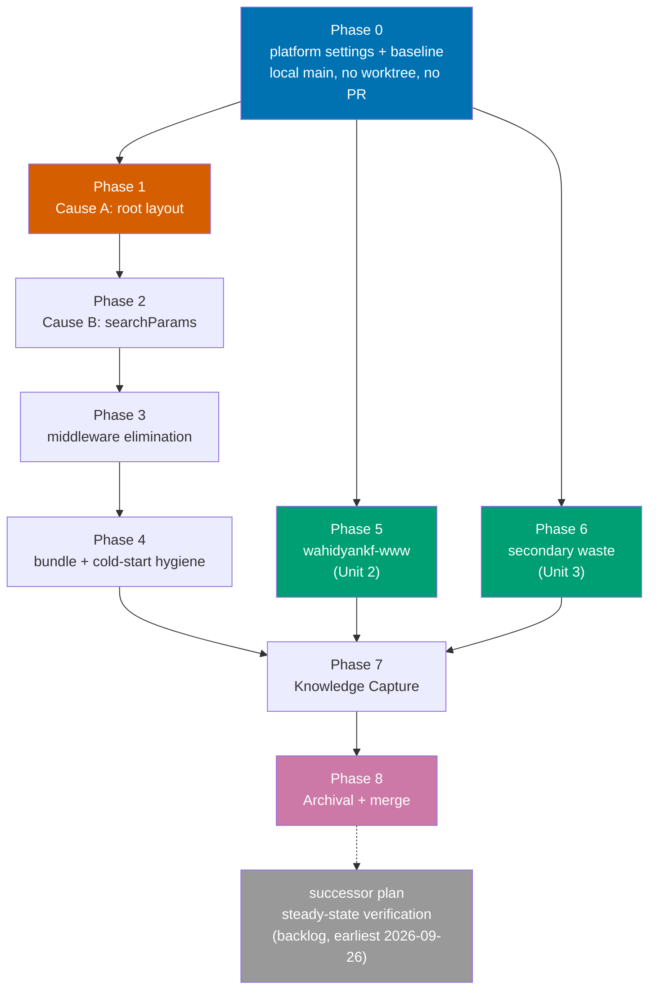

# Delivery — Vercel Function Cost Reduction

> **Legend** — `[AI]`: an agent performs the step (the default; unmarked steps are `[AI]`).
> `[HUMAN]`: only a human can do it (physical action, out-of-band approval, real-secret or
> privileged-credential handling). `[AI+HUMAN]`: agent prepares, human approves or finishes.
>
> **Phase Gate** — every phase ends with a `### Phase N Gate` (must-pass verification) plus a
> `> **Pause Safety**:` note (the safe-to-stop state and how to resume). A phase is not complete
> until its gate is green; do not start phase N+1 while any gate check fails.
>
> This plan **does** use `[HUMAN]` steps, but fewer than it did. The **Vercel MCP**
> (`plugin:vercel:vercel`) is authenticated as of 2026-08-01, which moves Phase 0's _measurement_
> steps to `[AI]`. Its _settings_ steps stay `[HUMAN]`: the MCP exposes no billing, Spend
> Management, Observability, firewall, Fluid Compute, or domain tool, and the invoice reading —
> now split out to its own plan — needs an account owner. See
> [tech-docs.md §Vercel MCP capability boundary](./tech-docs.md#vercel-mcp-capability-boundary) and
> DD-8. Git-mechanical steps (worktree create/remove, branch, push, merge) remain `[AI]`.
>
> **MCP call shape** used throughout — address projects by **slug, never by opaque ID**:
> `teamId: "wahidyan-kresna-fridayokas-projects"`, `projectId: "ayokoding-www"`. Both tool
> parameters accept a slug in place of the `team_*`/`prj_*` ID, and these slugs are already public
> (they appear in every deployment hostname), whereas the IDs are not — and this repo is public with
> permanent history. See [tech-docs.md §Identifiers in a public repo](./tech-docs.md#identifiers-in-a-public-repo).
> Widest usable window is `since: "72h"` — `7d` times out. Always pass `limit`, or `group_by`
> silently truncates.

## Worktree

This plan uses **three** worktrees, one per independent delivery unit, per the strict
1-PR ↔ 1-worktree rule:

| Unit | Worktree path                       | Branch                                           |
| ---- | ----------------------------------- | ------------------------------------------------ |
| 1    | `worktrees/vercel-cost-ayokoding/`  | `vercel-function-cost-reduction/ayokoding-www`   |
| 2    | `worktrees/vercel-cost-wahidyankf/` | `vercel-function-cost-reduction/wahidyankf-www`  |
| 3    | `worktrees/vercel-cost-secondary/`  | `vercel-function-cost-reduction/secondary-waste` |

Optional manual pre-provisioning (run from repo root):

```bash
claude --worktree vercel-cost-ayokoding
```

After any `git worktree add`, run `npm install` **and** `npm run doctor -- --fix` per the Worktree
Toolchain Initialization requirement.

**Phase 0 runs in the primary checkout on local `main` — no worktree.** It produces no shippable
code: its outputs are dashboard settings (not in the repo at all), evidence markdown inside this
plan folder, and throwaway builds used only to read a route table. That is exactly the plan-docs-only
carve-out, and provisioning three worktrees to hold zero code changes would be waste. **The three
worktrees are created at the start of Phases 1, 5, and 6 respectively**, off `main` as it stands once
Phase 0's gate is green.

Plan-document authoring and promotion likewise happen on local `main`; from Phase 1 onward,
execution-time delivery ticks go in the relevant worktree copy.

See [Worktree Path Convention](../../../repo-governance/conventions/structure/worktree-path.md) and
[Plans Organization Convention §Worktree Specification](../../../repo-governance/conventions/structure/plans.md#worktree-specification).

## Delivery Mode: worktree-to-pr

Each unit works in its own worktree; a draft PR opens against `main` once that unit has committed
work; the PR-Review Maker→Fixer Cycle (3 sequential CI-gated cycles) runs before merge; `[AI]`
merges once the hardened preconditions hold. See
[Plans Organization Convention §Delivery Mode](../../../repo-governance/conventions/structure/plans.md#delivery-mode).

## Parallelization Model

`1 main thread + N background agents`, **N=3**. The three code units touch disjoint apps and share
no files, so they are independent DAG leaves and fan out to fill all three slots. Phase 0 gates all
of them; Phase 7 (Knowledge Capture) joins them.

### Dependency DAG



The dashed edge is deliberate: the successor plan is **unblocked** by this plan's completion, not
executed by it.

Phases 1→2→3→4 are a dependent chain: Cause B's build verification needs Cause A fixed first; the
middleware can only be deleted once nothing reads `x-pathname`; and tracing scope depends on which
routes ended up static. One chain, one worktree, one PR.

### Delivery Boundaries

| Delivery unit | Phases                            | Worktree / branch                                                                      | PR opens at                                                  |
| ------------- | --------------------------------- | -------------------------------------------------------------------------------------- | ------------------------------------------------------------ |
| Unit 1        | Phases 1–4 (`apps/ayokoding-www`) | `worktrees/vercel-cost-ayokoding/` on `vercel-function-cost-reduction/ayokoding-www`   | Phase 1 (draft); reviewed and merged at the Phase 4 boundary |
| Unit 2        | Phase 5 (`apps/wahidyankf-www`)   | `worktrees/vercel-cost-wahidyankf/` on `vercel-function-cost-reduction/wahidyankf-www` | Phase 5 (draft); reviewed and merged at the Phase 5 boundary |
| Unit 3        | Phase 6 (secondary waste)         | `worktrees/vercel-cost-secondary/` on `vercel-function-cost-reduction/secondary-waste` | Phase 6 (draft); reviewed and merged at the Phase 6 boundary |
| Phase 0       | Phase 0 (settings + baseline)     | **primary checkout, local `main`** — no worktree, no code output                       | none (hard rule)                                             |
| Closeout      | Phases 7–8                        | `worktrees/vercel-cost-ayokoding/` reused after Unit 1 merges                          | Phase 8                                                      |

Phase 0 opens **no PR** (hard rule); its evidence rides Unit 1's PR.

---

## Phase 0: All platform settings, the baseline, and the middleware-behaviour question

> **Runs in the primary checkout on local `main`** — no worktree, no branch, no PR. Nothing this
> phase produces is shippable code: dashboard settings never touch the repo, evidence markdown is
> plan-docs, and the baseline builds exist only to read a route table. The three worktrees are
> created at the start of Phases 1, 5, and 6.
>
> The **settings** steps (0.2–0.5) are `[HUMAN]` — the Vercel MCP has no tool for any of them. The
> **measurement** steps (0.1, 0.6, 0.7, 0.8) are `[AI]` via the MCP. Do them in the stated order: the
> baseline snapshot must precede disabling Observability, or the per-project attribution is lost
> permanently.

### 0.1 Capture the per-project baseline — DO THIS FIRST

- [x] `[AI]` Record **per-project** invocation volume for all seven projects (`ayokoding-www`,
      `ose-www`, `organiclever-www`, `wahidyankf-www`, `organiclever-app-web`, `ose-app-web`, and
      `web-ui`) via the MCP: `get_runtime_logs` with `environment: "production"`, `since: "24h"`,
      `limit: 20`, and `group_by` run three ways — `source`, `route`, `statusCode`. Repeat `source`
      at `since: "72h"` for a rate stable enough to project from.
  - Acceptance: a table of seven rows is committed to
    `plans/in-progress/vercel-function-cost-reduction/evidence/baseline-per-project.md`. Before this
    step the file does not exist; after it, `test -f` exits 0 and the file names all seven projects.
  - Rationale: aggregate billing cannot be split per project from repo evidence (DD-7), and step 0.5
    destroys the ability to take this later.
  - **Done 2026-08-01.** Result: `ayokoding-www` is **43,105 of 43,150** function events across all
    seven projects — **99.90%**; `[...slug]` alone is **85.6%** of that. The DD-7 inference held.
    Independent cross-check: 91,162 invocations/day measured versus 85,250/day read off the
    dashboard on 2026-07-30, ~7% apart.
- [ ] `[HUMAN]` Record the cycle-to-date Infrastructure Subtotal and the elapsed day count, so the
      monthly extrapolation is reproducible. **Still `[HUMAN]`** — the MCP exposes no billing or
      usage tool, so no agent can read a currency figure (DD-8).
  - Acceptance: same evidence file states both numbers. Baseline for comparison: **$7.43 over ~4
    days as of 2026-07-30**.
  - Append to the "What still needs a human" table already in the evidence file.

### 0.2 Install the spend safety rail

- [ ] `[HUMAN]` Team → Settings → Billing → **Spend Management**: enable it, set the spend amount,
      and explicitly enable **"Pause production deployment"** (off by default; requires typing the
      team name to confirm).
  - Set the amount **below** the true ceiling — checks run only every few minutes, so spend can
    overshoot. Recommended: **$10**, giving a hard stop well inside the $20 credit.
  - Acceptance: the Spend Management panel shows a configured amount **and** the pause action
    enabled. Falsifiable both ways: before this step no amount is set and no pause action exists;
    after it, both are visible. Note the threshold governs **metered usage only** — not the $20 seat
    fee.

### 0.3 Migrate off legacy billing (DD-3)

- [ ] `[HUMAN]` For each project with functions, Project → Settings → Functions → enable **Fluid
      Compute**. Then trigger a redeploy so the setting takes effect.
  - Acceptance: after the next cycle's first usage appears, the dashboard reports **Active CPU** and
    **Provisioned Memory** line items and **no** "Function Duration (GB-Hrs)" line. Falsifiable both
    ways: today the reverse is true, which is precisely the diagnostic that identified legacy billing.

### 0.4 Enable the free firewall rulesets (DD-2)

- [ ] `[HUMAN]` Firewall → Managed Rulesets: set **Bot Protection** to active (from its default
      "Off") and **AI Bots** to **deny** (from its default "Allow"), for the public sites.
  - Acceptance: both rulesets show as active/deny in the dashboard.
- [ ] `[AI]` **Mandatory indexability smoke-test**, run immediately after the toggle — documentation
      does not confirm that verified crawlers such as Googlebot are auto-allowlisted, so verify
      rather than assume. No dashboard needed, so this half is `[AI]`:

  ```bash
  curl -sS -o /dev/null -D - -A "Mozilla/5.0 (compatible; Googlebot/2.1; +http://www.google.com/bot.html)" \
    https://www.ayokoding.com/en/learn/courses/debugging-and-profiling/learning
  curl -sSI https://www.ayokoding.com/robots.txt https://www.ayokoding.com/sitemap.xml
  ```

  - Acceptance: the Googlebot-UA fetch returns 200 with page content. Falsifiable both ways: a
    challenge interstitial or a non-200 fails this check and triggers the rollback below.
  - Second signal, MCP-side: `get_runtime_logs` `group_by: statusCode` over `since: "24h"` must not
    show a new mass of `403`s after the toggle. Baseline for comparison is in the evidence file
    (200: 42,524 / 404: 731 / 307: 98 / 504: 49 / 206: 13).
  - **Rollback if it fails**: `[HUMAN]` sets Bot Protection back to "Off" (single toggle, no
    deploy). Record the outcome in the evidence file either way.

### 0.5 Disable Observability Plus (DD-1) — only after 0.1 is committed

- [ ] `[HUMAN]` Team → Settings → Billing → Observability Plus: disable team-wide.
  - Acceptance: the Observability Events line stops accruing in the next cycle. Removes a measured
    ~$10/month.
  - Precondition: step 0.1's evidence file is committed. Do not proceed otherwise.

### 0.6 Resolve the blocking middleware question empirically — RESOLVED

- [x] `[AI]` Determine whether `middleware.ts` still executes on Next.js 16.2.6, because sources
      conflict and a silent no-op is worse than a build error. The MCP answers this directly rather
      than by inference from a redirect: `get_runtime_logs`, `group_by: source`, `since: "72h"`.
  - Acceptance: a non-zero `middleware` row proves execution. **If it executes**, Phase 3 must
    replace the redirects before deleting it. **If it does not**, Phase 3 becomes a pure cleanup and
    something else is serving `/` → `/en` (identify what before changing anything).
  - Falsifiable both ways: the two outcomes lead to materially different Phase 3 work, so this is
    not a formality.
  - **Answer, 2026-08-01: middleware executes.** 274,463 `middleware`-source events in 72h, against
    273,487 `function` events — a 0.36% gap, i.e. essentially one middleware invocation per function
    invocation. Corroborated by `curl`: `https://ayokoding.com/` still redirects.
  - **Consequence: Phase 3 takes the "replace before delete" branch.** The `/` → `/en` and
    uppercase-locale redirects must land in `next.config.ts` and be verified before
    `src/middleware.ts` is deleted.
- [x] `[AI]` Record the finding and its consequence. Recorded in
      [`evidence/baseline-per-project.md`](./evidence/baseline-per-project.md) (§Phase 0.6 resolved)
      rather than a separate `middleware-runtime-behaviour.md` — it is the same measurement run and
      splitting it would duplicate the numbers.

### 0.7 Repo baseline

- [ ] `[AI]` `npm install` and `npm run doctor -- --fix` in the primary checkout.
- [ ] `[AI]` Build `apps/ayokoding-www` and record the prerendered route count:
      `nx build ayokoding-www && jq '.routes | length' apps/ayokoding-www/.next/prerender-manifest.json`
  - Acceptance: returns **4** (the documented pre-fix baseline). If it returns anything else, stop —
    the premise of the plan has changed and the analysis must be redone.
- [ ] `[AI]` Build `apps/wahidyankf-www` and record its route table.
  - Acceptance: three routes show `ƒ` (`/`, `/cv`, `/personal-projects`).
- [ ] `[AI]` Resolve preexisting failures in scope before any plan work begins.

### 0.8 Source-premise re-verification — CONFIRMED 2026-08-01

The plan's source evidence was gathered 2026-07-30. Re-checked on `main` at `225b2a7ea`; every claim
still reproduces at the documented line numbers, so no phase needs rework:

| Claim                                            | Re-checked result                                                          |
| ------------------------------------------------ | -------------------------------------------------------------------------- |
| Cause A — `headers()` in the root layout         | present, `src/app/layout.tsx:24-25`                                        |
| Cause B — `await searchParams`                   | present, `[...slug]/page.tsx:365`; sole hit in the app                     |
| `src/middleware.ts`                              | present                                                                    |
| `outputFileTracingIncludes: { "/**": ... }`      | present, `next.config.ts:25-27`                                            |
| `wahidyankf-www` three dynamic routes            | present, `page.tsx:3-4`, `cv/page.tsx:10-11`, `personal-projects:10-11`    |
| `wahidyankf-www` has no `robots.ts`/`sitemap.ts` | confirmed absent                                                           |
| `organiclever-app-web` `force-dynamic`           | **9 hits** — matches; the 10th is the `system/status/be` keeper            |
| Storybook daily cron + no `ignoreCommand`        | both confirmed (`cron: "0 0 * * *"`; `vercel.json` has no `ignoreCommand`) |
| apex → `www` redirect downgrades to HTTP         | still reproduces: `301` → `http://www.ayokoding.com`                       |

The sibling `ai-benchmark-merged-chart` plan merged (PR #128, deployed 2026-08-01 06:46 WIB) and did
**not** disturb any of the above. One naming drift to be aware of when reading Phase 4: that plan
renamed the `light` capability class to `haiku`, so the query parameter is now `sortHaiku`, not
`sortLight`.

### 0.9 Fix the apex redirect chain — moved here from Phase 6

- [ ] `[HUMAN]` Fix the `ayokoding.com` → `www.ayokoding.com` redirect chain, which currently
      **downgrades HTTPS to HTTP** mid-chain (`301` to `http://www…`, then `308` to `https://www…`).
  - A Vercel domain setting, not a repo change. Two extra edge round trips plus a security smell.
  - **Why it lives in Phase 0**: it has no dependency on any code in Unit 3, and hoisting it here is
    what makes Units 1–3 entirely `[AI]`. Grouping every dashboard action into one sitting is the
    point.
  - Re-verified still broken 2026-08-01 (step 0.8).
- [ ] `[AI]` Verify the fix:
      `curl -sS -o /dev/null -D - https://ayokoding.com/ | grep -i "^HTTP/\|^location:"`
  - Acceptance: a single redirect straight to `https://www.ayokoding.com/`, with **no** `http://`
    hop. Falsifiable both ways: today it emits `location: http://www.ayokoding.com`.

### Phase 0 Gate

**Every `[HUMAN]` action in this plan is in this phase.** Once this gate is green, Phases 1–8 are
100% `[AI]` — no further human step exists. (The successor plan's invoice reading is `[HUMAN]`, but
that is a future reading which cannot be performed early by anyone.)

- [ ] `[HUMAN]` Spend Management configured **with** the pause action enabled.
- [ ] `[HUMAN]` Fluid Compute enabled and redeployed.
- [ ] `[HUMAN]` Bot Protection active and AI Bots denying; `[AI]` indexability smoke-test passed (or
      the rollback applied and recorded).
- [ ] `[HUMAN]` Observability Plus disabled, with the per-project baseline committed beforehand.
- [ ] `[HUMAN]` Cycle-to-date Infrastructure Subtotal and elapsed-day count recorded (step 0.1).
- [ ] `[HUMAN]` Apex redirect fixed; `[AI]` confirms no `http://` hop remains (step 0.9).
- [x] `[AI]` Middleware runtime behaviour determined and recorded — **executes**; Phase 3 is the
      replace-before-delete branch.
- [x] `[AI]` Per-project baseline captured and committed (step 0.1, MCP-measured).
- [x] `[AI]` Source premises re-verified against current `main` (step 0.8).
- [ ] `[AI]` Both baseline builds recorded: 4 prerendered routes, 3 dynamic wahidyankf routes.
- [ ] `[AI]` No PR opened in this phase.

> **Deferred grading, stated honestly**: two Phase-0 actions cannot be _graded_ in Phase 0 even
> though they are _performed_ here. Fluid Compute's acceptance ("Active CPU and Provisioned Memory
> line items appear, Function Duration disappears") and Observability Plus's ("the Events line stops
> accruing") both need the next cycle's billing data. Those confirmations belong to
> [`vercel-cost-steady-state-verification`](../../backlog/vercel-cost-steady-state-verification/README.md),
> which carries them explicitly. Do not block Phase 1 on them.
>
> **Pause Safety**: this phase is a safe stop and is independently valuable — the platform changes
> alone are projected to cut roughly $10 (Observability) plus a large share of the $36 Function
> Duration line (Fluid Compute), with zero code risk. To resume: create Unit 1's worktree and start
> Phase 1.

---

## Phase 1: `apps/ayokoding-www` — Cause A, promote the locale layout

Highest-leverage single change in the plan. Isolated in its own phase because its blast radius is
every page on the site.

- [ ] `[AI]` **RED** — add a failing assertion that content routes are prerendered.
  - File: `apps/ayokoding-www/test/unit/build-output/prerender-coverage.test.ts` (new)
  - Command: `nx run ayokoding-www:test:unit`
  - Acceptance: the test asserts the prerendered route count is `>= 2000` and **fails** against the
    current build output (which has 4).
- [ ] `[AI]` **GREEN** — promote the locale layout and delete the root layout.
  - Delete `apps/ayokoding-www/src/app/layout.tsx` **entirely**. If it remains it stays the root
    layout, and nested layouts may not render `<html>`/`<body>`.
  - Move its contents into `apps/ayokoding-www/src/app/[locale]/layout.tsx`, rendering
    `<html lang={(await params).locale}>` and `<body>`. Remove the `headers()` import and the
    `x-pathname` read; the locale now comes from the route segment.
  - Preserve everything else the old root layout rendered, including the Google Analytics tags.
  - Command: `nx build ayokoding-www`
  - Acceptance: build exits 0 and
    `jq '.routes | length' apps/ayokoding-www/.next/prerender-manifest.json` returns `>= 2000`
    (was `4`).
- [ ] `[AI]` **REFACTOR** — confirm no other dynamic-API read remains in a layout.
  - Command: `grep -rn "headers()\|cookies()\|draftMode()\|noStore()\|connection()" apps/ayokoding-www/src --exclude-dir=node_modules`
  - Acceptance: zero hits in any `layout.tsx`. Note: use `--exclude-dir`, never `--glob`, and never
    `-L` — `grep` here routes to UGREP.
- [ ] `[AI]` Verify the `lang` attribute for both locales in the built output.
  - Acceptance: the prerendered English page contains `lang="en"` and the Indonesian page
    `lang="id"`. Falsifiable both ways: a wrong or missing `lang` fails.

**Gherkin (binds) →** "Content pages are statically prerendered and CDN-cached" and "The document
language still reflects the locale" — see [prd.md](./prd.md).

- [ ] `[AI]` Write the companion feature file under
      `specs/apps/ayokoding/behavior/ayokoding-www/gherkin/`.

### Phase 1 Gate

- [ ] `[AI]` `apps/ayokoding-www/src/app/layout.tsx` no longer exists: `test ! -f` exits 0.
- [ ] `[AI]` Prerendered route count `>= 2000` (was 4).
- [ ] `[AI]` `nx run ayokoding-www:test:quick`, `typecheck`, and `lint` all exit 0.
- [ ] `[AI]` Draft PR opened for Unit 1.

> **Pause Safety**: safe to stop. The site is statically generated and functional. Rollback is a
> single revert commit restoring `app/layout.tsx`.

---

## Phase 2: `apps/ayokoding-www` — Cause B, move `?path=` client-side

The client-side equivalent **already ships**: `src/features/course-paths/shell/sidebar-host.tsx:36`
resolves `?path=` via `useSearchParams()` today. This phase removes the redundant server-side read.

- [ ] `[AI]` **RED** — assert the content catch-all is not dynamically rendered.
  - Command: `nx build ayokoding-www`
  - Acceptance: a test or build-output assertion fails while `[...slug]` still reads `searchParams`.
- [ ] `[AI]` **GREEN** — remove the `searchParams` prop.
  - File: `apps/ayokoding-www/src/app/[locale]/(content)/[...slug]/page.tsx` — drop the
    `searchParams` type member (line ~94) and the `await searchParams` read (line ~365).
  - Move any remaining `?path=`-dependent rendering into a client component behind `<Suspense>`,
    mirroring `tools/ai-benchmark/page.tsx`'s existing shape. Reuse `sidebar-host.tsx`'s resolution
    rather than duplicating it.
  - Command: `nx build ayokoding-www`
  - Acceptance: build exits 0 **and** the route table shows `●`/`○` for the content catch-all, not
    `ƒ`. A `next build` is mandatory here — dev mode hides a missing `<Suspense>` boundary, and a
    production build fails outright without one.
- [ ] `[AI]` **REFACTOR** — drop the now-vacuous `learn/paths/**` dynamic carve-out at
      `[...slug]/page.tsx:83` if it is still inert.
  - Note: `src/features/course-paths/manifests/` currently contains exactly one file, `README.md`, so
    `loadManifests()` returns `[]` on every request. Verify this still holds before removing;
    the sibling AI-benchmark plan does not add manifests, but confirm rather than assume.
  - Acceptance: state the manifest file count in the commit message; remove the carve-out only if it
    is zero.
- [ ] `[AI]` Verify `?path=` behaviour end-to-end against a real path context.

**Gherkin (binds) →** "Course-path context survives the move to client-side resolution".

- [ ] `[AI]` Write the companion feature file.

### Phase 2 Gate

- [ ] `[AI]` No `searchParams` read remains in any `apps/ayokoding-www` page:
      `grep -rn "await searchParams" apps/ayokoding-www/src --exclude-dir=node_modules` returns zero
      hits outside tests.
- [ ] `[AI]` Content catch-all is `●`/`○` in the route table, not `ƒ`.
- [ ] `[AI]` `test:quick`, `typecheck`, `lint` exit 0.

> **Pause Safety**: safe to stop. Both root causes are fixed and the site is fully static.

---

## Phase 3: `apps/ayokoding-www` — eliminate the middleware

Branch on Phase 0.6's finding. With Cause A fixed, nothing reads `x-pathname`, so the middleware's
only hot-path work is dead.

- [ ] `[AI]` **RED** — assert both redirects still work with middleware removed.
  - Acceptance: a test covering `/` → `/en` and uppercase-locale normalisation fails before the
    config redirects are added.
- [ ] `[AI]` **GREEN** — move both redirects into `apps/ayokoding-www/next.config.ts` `redirects()`.
  - `/` → `/en`, and the uppercase-locale variants. `path-to-regexp` is case-**sensitive** and cannot
    lowercase a captured parameter, so enumerate the finite variants literally for both locales
    (`/EN`, `/En`, `/eN`, plus their `/:path*` forms, and the same for `id`).
  - Append to the existing `redirects()` array — do **not** modify the 74 existing rules.
  - Config redirects are evaluated **before** middleware in Next.js's routing order, so behaviour is
    preserved.
  - Acceptance: `curl -sS -o /dev/null -D - <deploy-url>/ | grep -i location` shows `/en`, and the
    uppercase variants return 308 to lowercase. Falsifiable both ways: removing a rule breaks its URL.
- [ ] `[AI]` **REFACTOR** — delete `src/middleware.ts` and prune
      `src/features/i18n/shell/middleware.ts` to whatever pure helpers remain in use.
  - Acceptance: `test ! -f apps/ayokoding-www/src/middleware.ts` exits 0, and the build emits no
    middleware bundle (`.next/server/middleware-manifest.json` has no matcher for this app).
  - Note the secondary benefit: Vercel documents that middleware can accrue **Fast Origin Transfer
    twice** for a single function request, so this also trims that line item.
- [ ] `[AI]` If any middleware must survive for a reason discovered in Phase 0.6, migrate it to
      `proxy.ts` with the codemod `npx @next/codemod@canary middleware-to-proxy .` rather than
      leaving a deprecated `middleware.ts` whose runtime behaviour on 16.2.6 is unresolved.

**Gherkin (binds) →** "Locale entry redirects are preserved without middleware".

- [ ] `[AI]` Write the companion feature file.

### Phase 3 Gate

- [ ] `[AI]` No middleware file remains (or the surviving one is `proxy.ts`, deliberately).
- [ ] `[AI]` Both redirects verified live against a preview deployment.
- [ ] `[AI]` `test:quick`, `typecheck`, `lint` exit 0.

> **Pause Safety**: safe to stop. Middleware invocations (~$5/month at the measured rate) are gone.

---

## Phase 4: `apps/ayokoding-www` — bundle and cold-start hygiene

- [ ] `[AI]` Scope `outputFileTracingIncludes` per route instead of `"/**"`.
  - File: `apps/ayokoding-www/next.config.ts:25-27`
  - Acceptance: the `api/trpc` trace no longer includes the content tree. Measure with
    `jq '[.files[] | select(startswith("content/"))] | length' apps/ayokoding-www/.next/server/app/api/trpc/\[trpc\]/route.js.nft.json`
    — was **7,515**, must drop substantially. Falsifiable both ways.
- [ ] `[AI]` Wrap `getBySlug` in `React.cache()` to collapse the double per-request call
      (`[...slug]/page.tsx:130` in `generateMetadata` and `:339` in the body).
  - File: `apps/ayokoding-www/src/features/content/shell/service.ts`
  - Acceptance: an instrumented unit test shows one underlying read per render pass, not two.
    `React.cache()` dedupes **within** a render pass only, which is exactly the scope needed.
- [ ] `[AI]` Evaluate `output: "standalone"` (`next.config.ts:21`). It is dead configuration on
      Vercel but **is required by this app's Dockerfile** — do not delete it blindly.
  - Acceptance: whatever is decided, the Docker build path still succeeds. Record the decision.
- [ ] `[AI]` Confirm the sibling AI-benchmark route stays static.
  - `src/app/[locale]/tools/ai-benchmark/page.tsx` already wraps client content in `<Suspense>` with
    `useSearchParams()` in `benchmark-content.tsx:18`, so its `sortOpus`/`sortSonnet`/`sortHaiku`/
    `sortUnrated` query state is compliant. That plan merged as PR #128 on 2026-08-01; the parameter
    is `sortHaiku`, renamed from `sortLight`.
  - Acceptance: the tools routes appear as `○`/`●` in the route table, not `ƒ`.
  - Note the measured baseline makes this check sharper: those two tools routes drew **1,273 +
    1,212** function invocations in 24h **despite already using the target pattern**, because Cause A
    made every route dynamic. After Phase 1 their MCP invocation counts should collapse toward zero —
    a falsifiable prediction, not a formality.

### Phase 4 Gate

- [ ] `[AI]` Content files traced into the tRPC function bundle substantially reduced from 7,515.
- [ ] `[AI]` `getBySlug` executes once per render pass.
- [ ] `[AI]` Tools routes confirmed static.
- [ ] `[AI]` Full local quality gate green: `typecheck`, `lint`, `test:quick`, `specs:coverage`.
- [ ] `[AI]` **Unit 1 delivery boundary** — PR-Review Maker→Fixer Cycle (3 CI-gated cycles), then
      `[AI]` merge once all five hardened preconditions hold.
- [ ] `[AI]` Deploy to `prod-ayokoding-www` and verify live: a repeat request to a content page
      returns `x-vercel-cache: HIT` (was `MISS`).
- [ ] `[AI]` **MCP post-deploy verification** — 24h after the production deploy, re-run
      `get_runtime_logs` (`group_by: source` and `group_by: route`, `since: "24h"`,
      `environment: "production"`) and compare against the baseline table.
  - Acceptance, falsifiable in both directions against measured numbers, not impressions:
    - `middleware` source count → **0** (was 43,422/24h). Non-zero means the middleware survived.
    - `function` source count → down **≥90%** from 43,105/24h. This is the plan's real success
      metric; a single `x-vercel-cache: HIT` proves one URL, this proves the fleet.
    - `/[locale]/[...slug]` route count → down ≥90% from 36,881.
    - `504` count → **0** (was 49/24h).
  - Record the after-table in `evidence/baseline-per-project.md` beside the before-table.

> **Pause Safety**: safe to stop. Unit 1 — the 65% line item — is fully delivered and deployed.

---

## Phase 5: `apps/wahidyankf-www` — static conversion and SEO files (Unit 2)

Independent of Unit 1; runs in parallel in its own worktree.

> **Re-scoped by measurement (2026-08-01)**: this project drew **45** function invocations in 24h,
> against `ayokoding-www`'s 43,105 — about 0.1%. Its contribution to the bill is a rounding error.
> Keep the phase: the fix is a prop removal against already-`"use client"` consumers, and the missing
> `robots.ts`/`sitemap.ts` plus the 404 `og-image.jpg` are real correctness defects. But **do not
> attribute budget headroom to it**, and if capacity is ever contested, this is the unit to defer —
> not Unit 1. Phase 7's savings table is corrected accordingly.

- [ ] `[AI]` **RED** — assert the three routes are static.
  - Command: `nx build wahidyankf-www`
  - Acceptance: an assertion on the route table fails while `/`, `/cv`, `/personal-projects` are `ƒ`.
- [ ] `[AI]` **GREEN** — remove the `searchParams` props and read the query client-side.
  - Files: `src/app/page.tsx:3-4`, `src/app/cv/page.tsx:10-11`,
    `src/app/personal-projects/page.tsx:10-11` — drop the prop.
  - Read `useSearchParams()` inside the already-`"use client"` consumers
    (`HomeContent.tsx:29-31`, `CvContent.tsx:477-484`, `PersonalProjectsContent.tsx:21-27`), each
    wrapped in `<Suspense>`. These components already only use the value to seed `useState`, so this
    is a prop swap, not a rewrite.
  - Command: `nx build wahidyankf-www`
  - Acceptance: all three routes show `○` in the route table (were `ƒ`). The production build fails
    outright if a `<Suspense>` boundary is missing, so a passing build is real evidence.
- [ ] `[AI]` **REFACTOR** — add `src/app/robots.ts` and `src/app/sitemap.ts` (neither exists today),
      modelled on `apps/ose-www/src/app/robots.ts` and its `sitemap-builder.ts`.
  - Acceptance: both routes prerender (`○` in the route table) and `robots.txt` names the sitemap.
    Falsifiable both ways: before this step, `test -f` on either file exits non-zero.
- [ ] `[AI]` Fix the 404 `og-image.jpg` referenced at `src/app/layout.tsx:39,51` — either ship the
      asset or remove the reference.
  - Acceptance: no metadata field points at a URL that 404s.
- [ ] `[AI]` Verify a shared filtered URL still works: opening `/cv?search=<term>` pre-fills the
      search box and filters results.

**Gherkin (binds) →** "Search-filtered portfolio routes are static yet still filterable".

- [ ] `[AI]` Locate the existing `specs/` path for `wahidyankf-www` (do not invent one) and write the
      companion feature file there.

### Phase 5 Gate

- [ ] `[AI]` Zero `ƒ` routes in the `wahidyankf-www` route table (was 3).
- [ ] `[AI]` `robots.ts` and `sitemap.ts` exist and prerender.
- [ ] `[AI]` `typecheck`, `lint`, `test:quick`, `specs:coverage` exit 0.
- [ ] `[AI]` **Unit 2 delivery boundary** — review cycle, then `[AI]` merge; deploy to
      `prod-wahidyankf-www` and confirm `x-vercel-cache: HIT` on a repeat request.

> **Pause Safety**: safe to stop. Unit 2 is self-contained.

---

## Phase 6: Secondary waste cleanups (Unit 3)

Independent of Units 1 and 2.

- [ ] `[AI]` Delete the 9 inert `export const dynamic = "force-dynamic"` lines in
      `apps/organiclever-app-web` — line 3 of `src/app/app/layout.tsx` and of the `home`, `history`,
      `progress`, `settings`, `routines/edit`, `workout`, and `workout/finish` pages.
  - These are no-ops today because every one of those files is `"use client"`, so Next.js already
    prerenders them as `○`. They are a latent cost landmine if any file is later converted to a
    server component.
  - Acceptance: `grep -rn "force-dynamic" apps/organiclever-app-web/src --exclude-dir=node_modules`
    returns exactly **one** hit — `src/app/system/status/be/page.tsx`, which is a genuine server
    component and keeps it. Falsifiable both ways: returns 10 before, 1 after.
  - Acceptance: the route table is unchanged (all still `○`), proving the directives were inert.
- [ ] `[AI]` Make `apps/organiclever-app-web/src/app/system/status/be/page.tsx` non-indexable.
  - It is a genuinely dynamic server component that `fetch`es a backend health endpoint with a 3s
    `AbortSignal.timeout` (line 15) — worst case 3s of billed function time per crawler hit, and it
    is currently crawlable.
  - Add `robots: { index: false }` metadata (server-side, so crawlers that do not run JS see it).
  - Acceptance: the rendered page emits a `noindex` directive in its HTML, not via client JS.
- [ ] `[AI]` Gate the daily Storybook rebuild.
  - `.github/workflows/web-ui-build-deploy-prod.yml:5` schedules `cron: "0 0 * * *"` and line 36
    force-pushes unconditionally, while `libs/web-ui/vercel.json` has no `ignoreCommand` — so Vercel
    rebuilds Storybook every single day whether or not `libs/web-ui` changed.
  - Gate it on a `libs/web-ui/` diff, mirroring `_reusable-www-test-local-deploy.yml:112,122`, and
    add an `ignoreCommand` to `libs/web-ui/vercel.json`.
  - Acceptance: the workflow has a change-detection step guarding the push, and the `vercel.json`
    has an `ignoreCommand`. Falsifiable both ways: neither exists today.
    > The apex-redirect HTTPS-downgrade fix used to live here. It is a Vercel domain setting with no
    > dependency on any code in this unit, so it moved to **step 0.9** to keep every `[HUMAN]` action in
    > one sitting. **Unit 3 is now 100% `[AI]`.**

### Phase 6 Gate

- [ ] `[AI]` Exactly one `force-dynamic` remains in `organiclever-app-web`, and route tables unchanged.
- [ ] `[AI]` `/system/status/be` emits a server-rendered `noindex`.
- [ ] `[AI]` Storybook deploy gated in both the workflow and `vercel.json`.
- [ ] `[AI]` `typecheck`, `lint`, `test:quick` exit 0; workflow lints clean (actionlint).
- [ ] `[AI]` **Unit 3 delivery boundary** — review cycle, then `[AI]` merge.

> **Pause Safety**: safe to stop. Unit 3 is pure waste removal.

---

## Steady-state measurement — split out to its own plan

Grading this plan's cost objective is **not** part of this plan. It moved, whole, to
[`plans/backlog/vercel-cost-steady-state-verification`](../../backlog/vercel-cost-steady-state-verification/README.md):
the full-cycle invoice reading, the MCP volume verification, the Fluid-Compute and
Observability-Plus billing-vocabulary confirmations, and the actual-versus-projected reconciliation.

**Why split**: grading is gated on a calendar nobody controls. The billing cycle runs the 26th to
the 26th, and the Jul 26 – Aug 26 cycle contains pre-fix days, so the first clean cycle closes
**2026-09-26**. Holding this plan open in `plans/in-progress/` for two months — blocking its own
Knowledge Capture and archival — to wait on one dashboard reading is the wrong shape.

**Carried risk, stated plainly**: this plan can now reach `plans/done/` without its cost objective
ever being verified. That is a real cost of the split, accepted deliberately. The mitigations are
that the successor plan carries a concrete earliest-run date and a hard `blockedBy` on this one, and
that this plan's Knowledge Capture (below) must record the unverified projection as an explicitly
open question rather than closing it out.

---

## Phase 7: Knowledge Capture

- [ ] `[AI]` Triage `learnings.md` — every entry either finds a home (a convention, a doc, an idea
      two-pager) or is explicitly discarded with a reason.
- [ ] `[AI]` Candidate homes to consider, based on what this plan uncovered:
  - The diagnostic that legacy-vs-Fluid billing is readable from line-item **names** alone.
  - The rule that a dynamic API in a root layout forfeits static generation for the entire app, and
    that the locale-segment root layout is the documented i18n fix.
  - That `next build` — never a dev-server check — is the only valid evidence for a `<Suspense>`
    boundary around `useSearchParams()`.
  - That Vercel's WAF blocks **before** the billing meter, making the free rulesets a cost control.
  - That Spend Management's pause action is off by default and lags by minutes.
- [ ] `[AI]` Fold anything cross-cutting into the existing
      [`nx-affected-cross-worktree-contamination`](../../ideas/nx-affected-cross-worktree-contamination.md)
      two-pager if it belongs there rather than creating a duplicate.
- [ ] `[AI]` **Record the unverified projection as an open question** — mandatory, because the
      steady-state grading was split out. State in `learnings.md` that the ~$57/mo → ~$2–4/mo
      projection is **unverified at archival**, name
      [`vercel-cost-steady-state-verification`](../../backlog/vercel-cost-steady-state-verification/README.md)
      as the plan that closes it, and note which projection rows were measured (Observability −$10,
      middleware −$5) versus estimated (the −$30 static conversion, the largest row).
  - Acceptance: `learnings.md` contains the open question and the successor plan's path. Falsifiable
    both ways: absent that entry, this plan archives claiming an outcome it never measured.

### Phase 7 Gate

- [ ] `[AI]` `learnings.md` fully triaged, with no untriaged entries remaining.
- [ ] `[AI]` The unverified-projection open question is recorded and points at the successor plan.

> **Pause Safety**: safe to stop. All delivery is complete; only archival remains.

---

## Phase 8: Plan archival, final push, and merge

- [ ] `[AI]` `git mv plans/in-progress/vercel-function-cost-reduction plans/done/YYYY-MM-DD__vercel-function-cost-reduction`
      using the actual completion date.
- [ ] `[AI]` Update `plans/done/README.md` and `plans/in-progress/README.md` indexes.
- [ ] `[AI]` Commit the archival move on the PR branch and push **before** the merge, per the
      Delivery Mode convention's Archival-in-PR requirement.
- [ ] `[AI]` `[AI]` merge once all five hardened preconditions hold.
- [ ] `[AI]` Fast-forward local `main` after the final push, so the base worktree does not silently
      diverge.
- [ ] `[AI]` Remove all three worktrees after confirming each is clean and fully merged.
- [ ] `[AI]` Confirm the successor plan
      [`vercel-cost-steady-state-verification`](../../backlog/vercel-cost-steady-state-verification/README.md)
      exists in `plans/backlog/` and its precondition now passes.
  - Acceptance: `test -f plans/backlog/vercel-cost-steady-state-verification/README.md` exits 0, and
    both `test ! -f apps/ayokoding-www/src/app/layout.tsx` and
    `test ! -f apps/ayokoding-www/src/middleware.ts` exit 0. This plan does **not** execute the
    successor — it only leaves it executable.

### Phase 8 Gate

- [ ] `[AI]` Plan folder lives under `plans/done/` with a date prefix.
- [ ] `[AI]` All three PRs merged; CI green on `main`.
- [ ] `[AI]` All three worktrees removed; local `main` fast-forwarded.
- [ ] `[AI]` Successor plan present and unblocked.

> **Pause Safety**: plan complete.
