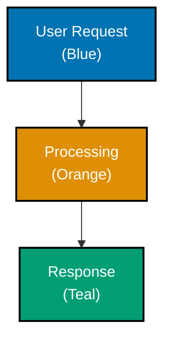
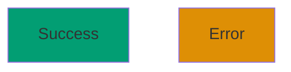

# Mermaid Color Accessibility: Dark Mode, Shape Differentiation, and Implementation Example

## Dark and Light Mode Compliance

All colors must provide sufficient contrast in BOTH rendering modes:

**Light mode background**: White (`#FFFFFF`)
**Dark mode background**: Dark gray/black (`#1E1E2E`)

**Contrast Requirements (WCAG AA):**

- Minimum contrast ratio: **4.5:1** for normal text
- Large text (18pt+ or 14pt+ bold): **3:1**
- Element borders must be distinguishable by shape + color, not color alone

## Shape Differentiation (Required)

**Never rely on color alone.** Always use multiple visual cues:

- Different node shapes (rectangle, circle, diamond, hexagon)
- Different line styles (solid, dashed, dotted)
- Clear text labels
- Icons or symbols where appropriate

## Implementation Example

**Good Example (accessible):**

````markdown
<!-- Uses accessible colors: blue (#0173B2), orange (#DE8F05), teal (#029E73) -->


````

**Bad Example (not accessible):**

````markdown
<!-- Uses inaccessible colors: red and green -->


````
