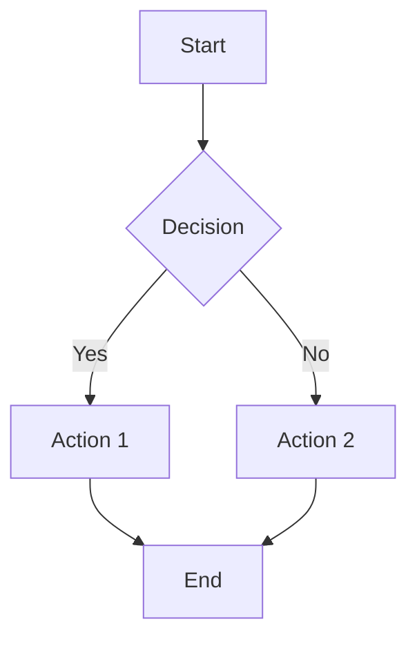

# Mermaid Diagrams: When, Why, and Syntax

## When to Use

Use Mermaid diagrams for **all markdown files** in the repository:

```
open-sharia-enterprise/
 ├── README.md              ← Use Mermaid
 ├── AGENTS.md             ← Use Mermaid
 ├── CONTRIBUTING.md       ← Use Mermaid
 ├── docs/                 ← Use Mermaid
│   ├── tutorials/
│   ├── how-to/
│   ├── reference/
│   └── explanation/
├── plans/                ← Use Mermaid
│   ├── in-progress/
│   ├── backlog/
│   └── done/
└── .github/              ← Use Mermaid
    └── *.md
```

## Why Mermaid?

1. **Universal Support** - GitHub, VS Code, and most platforms render Mermaid natively
2. **Rich Visuals** - Professional-looking diagrams with colors, shapes, and styling
3. **Interactive** - Diagrams can be zoomed and inspected
4. **Maintainable** - Text-based source is easy to version control and edit
5. **Powerful** - Supports flowcharts, sequence diagrams, class diagrams, entity relationships, state diagrams, and more
6. **Mobile-Friendly** - Renders beautifully on mobile devices (when using vertical orientation)

## Mermaid Syntax

Mermaid diagrams are defined in code blocks with the `mermaid` language identifier:

````markdown
%% Color palette: Blue #0173B2, Orange #DE8F05, Teal #029E73, Purple #CC78BC, Brown #CA9161, Gray #808080
%% All colors are color-blind friendly and meet WCAG AA contrast standards


````
