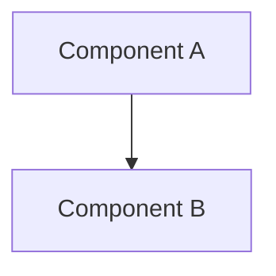
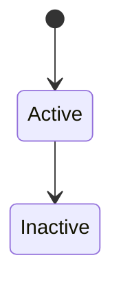
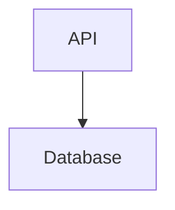

# Mixing Formats

**Prefer consistency within a single file**. Choose Mermaid as your primary format and use it throughout the file unless you have a specific reason to use ASCII art.

FAIL: **Avoid mixing unnecessarily**:

````markdown
## System Flow


## Directory Structure

```
A
└── B
```

## Another Flow

A --> B (plain text - no format!)
````

PASS: **Good - consistent Mermaid**:

````markdown
## System Flow



## State Transitions


````

PASS: **Acceptable - intentional format choice**:

````markdown
## Architecture Diagram



## Project Structure (simple tree)

```
project/
├── src/
└── docs/
```
````

**Rationale**: Mermaid is preferred, but ASCII directory trees are acceptable when they're clearer for simple file/folder listings.
