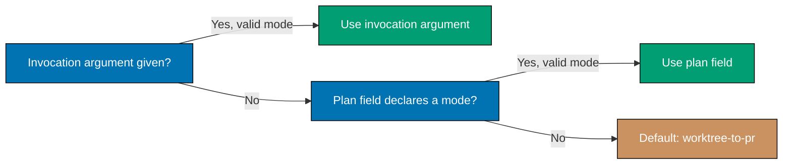

# Delivery Mode — Merge Authority and Resolution Precedence

Continues [Delivery Mode — main-to-origin-main Content Restriction](./delivery-mode-content-restriction.md).

**[AI] merges by default.** Every PR first uses the canonical behavior classifier, not a separate
plan-specific review path. Eligible executable work must reach its clean exit
within the seven-cycle maximum; noneligible static work requires the
named `pr-quality-gate.yml` workflow. A PR touching `plans/**` is **always eligible** and must
satisfy both routes unless the user waives it for that PR. A blocked eligible PR never merges. The shared hardened
preconditions still apply: no code-related CRITICAL/HIGH/MEDIUM finding outstanding, branch current
with `origin/main` via a non-destructive forward update, route-required quality checks green, and
eligible surface tester gates run and resolved — see the
[PR Review Quality Gate workflow](../../../workflows/pr/pr-review-quality-gate.md).

Where a plan **does** want human judgment at the merge point — an irreversible migration, a
production cutover, a change whose blast radius the gates cannot express — it says so explicitly in
the step itself, and that `[HUMAN]` gate then governs. Being explicit is the point: a merge gate that
exists because someone chose it is meaningful, while one that exists because it was the default is
indistinguishable from inertia.

**Three-tier precedence** — the active mode resolves deterministically:

```text
resolve_delivery_mode(invocation_arg, plan_field):
    if invocation_arg is a valid mode:      # tier 1: given at invocation time
        return invocation_arg
    if plan_field is a valid mode:          # tier 2: declared in the plan's own docs
        return plan_field
    return "worktree-to-pr"                 # tier 3: default
```



An invalid non-empty value at either tier (a string that is not one of the four modes) is a
`plan-checker` finding — it is never silently coerced to the default.

**Declaring the mode in a plan**: state it explicitly alongside the `## Worktree` /
`## Worktree Specification` declaration, e.g. `## Delivery Mode: worktree-to-pr`. An unmarked plan
resolves to the tier-3 default per the algorithm above.

See the [plan-execution workflow](../../../workflows/plan/plan-execution.md) for how each mode changes
Step 0 (worktree entry), the per-phase push target, and Step 8 (finalization and merge hand-off).
