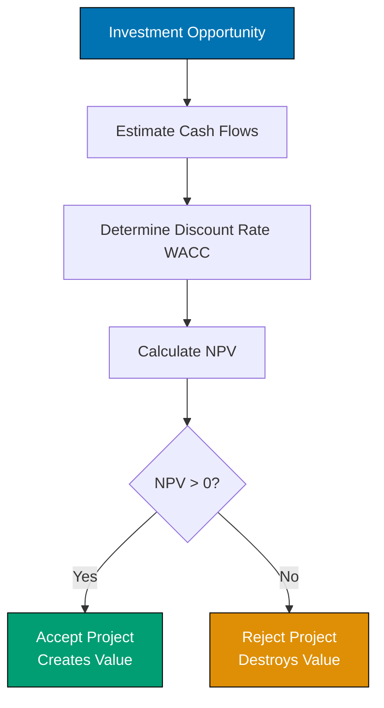

# Diagrams (Mermaid)

**When to Use Diagrams**: - Showing processes or workflows - Illustrating relationships between concepts - Visualizing decision trees - Depicting system architecture or structure

**Requirements**: - Every major concept has a diagram - Diagrams follow [Diagram and Schema Convention](../../formatting/diagrams.md) — Use Mermaid for all diagrams - Prefer vertical orientation for mobile-friendliness - Clear labels and styling - Legend or caption explaining the diagram

**Example**:

````markdown
### Capital Budgeting Decision Process

This flowchart shows how companies evaluate investment opportunities:

%% Color palette: Blue #0173B2, Orange #DE8F05, Teal #029E73, Purple #CC78BC, Brown #CA9161, Gray #808080
%% All colors are color-blind friendly and meet WCAG AA contrast standards


````

If NPV is positive, the project creates value. If negative, it destroys value.

````

**Diagram Types by Use Case**:

| Use Case                  | Mermaid Type   | Example                      |
| ------------------------- | -------------- | ---------------------------- |
| Process flow              | `flowchart TD` | Capital budgeting process    |
| Decision tree             | `flowchart TD` | Investment accept/reject     |
| Relationships             | `graph LR`     | Financial statement linkages |
| Timeline                  | `gantt`        | Project schedule             |
| Class/Entity relationship | `classDiagram` | Data model                   |

### Mathematical Formulas (LaTeX)

**Requirements**:
 - All formulas use LaTeX notation
 - Follow [Mathematical Notation Convention](../../formatting/mathematical-notation.md)
 - **CRITICAL**: Use `$$` for display math (not single `$`)
 - **CRITICAL**: All `\begin{align}` blocks MUST use `$$` delimiters
 - Define all variables after displaying formula
 - Show worked examples with step-by-step calculations

**Display Math Format**:
```markdown
$$
WACC = \frac{E}{V} \times r_e + \frac{D}{V} \times r_d \times (1 - T_c)
$$

Where:

- $E$ = market value of equity
- $D$ = market value of debt
- $V$ = total market value ($V = E + D$)
- $r_e$ = cost of equity
- $r_d$ = cost of debt
- $T_c$ = corporate tax rate
````

**Multi-line Calculations**:

```markdown
$$
\begin{align}
FV &= PV \times (1 + r)^n \\
   &= \$1,000 \times (1.08)^5 \\
   &= \$1,000 \times 1.469 \\
   &= \$1,469
\end{align}
$$
```

**Common LaTeX Mistakes to Avoid**: - FAIL: Single `$` on its own line (use `$$` for display math) - FAIL: Single `$` with `\begin{align}` (MUST use `$$`) - FAIL: Undefined variables (always define after formula) - FAIL: Using forward slash for fractions (use `\frac{}{}`)
