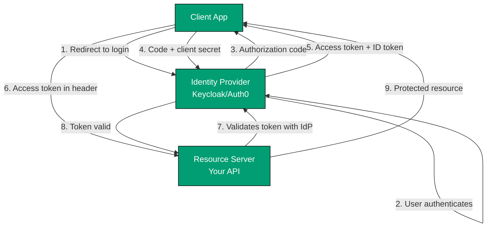
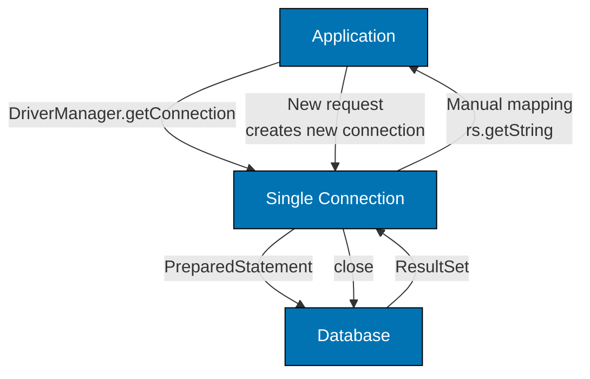
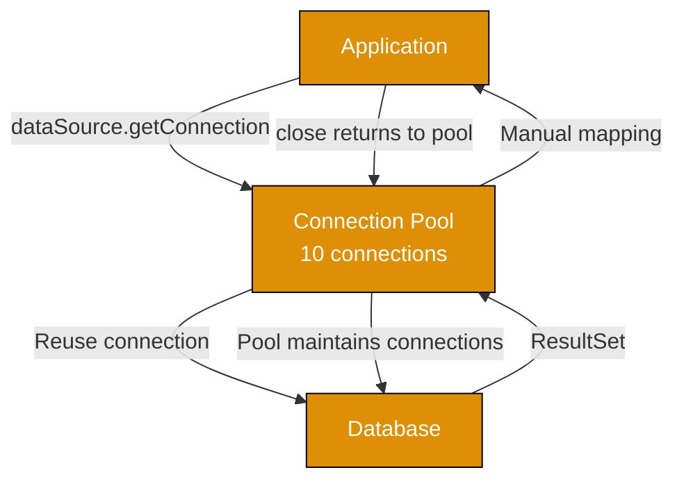
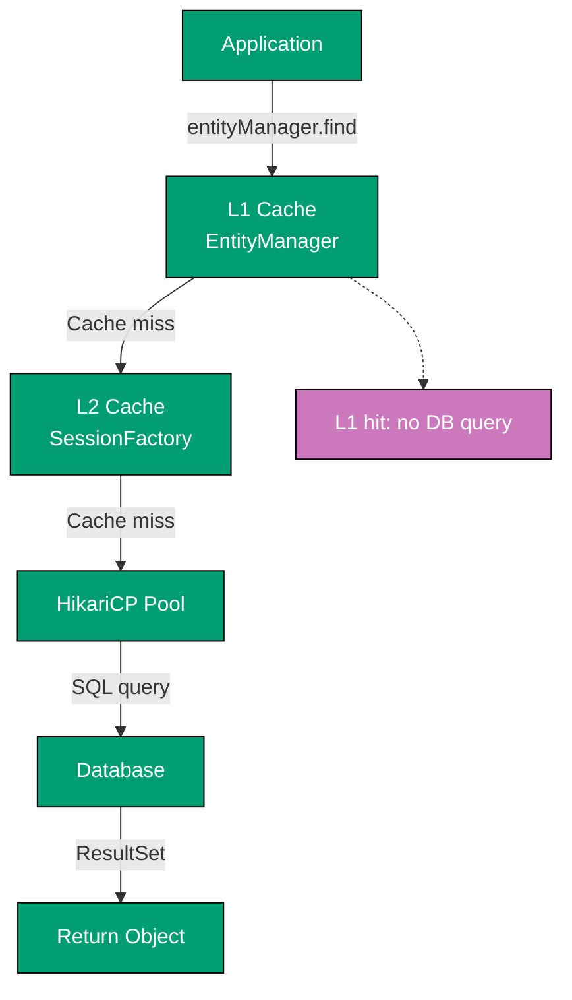

# Guide Structure Part 4: OAuth and Database Flow Diagrams

**Example 2c: Authentication Flow - Production (OAuth2 OIDC)**

**Production benefit**: Centralized identity management, single sign-on (SSO), third-party integrations, token refresh flows.

**Example 3a: Database Persistence - Standard Library (JDBC)**

**Limitation**: Each request creates new database connection, causing connection overhead.

**Example 3b: Database Persistence - Framework (HikariCP Connection Pool)**

**Improvement**: Connection pooling eliminates connection creation overhead, but still requires manual object mapping.

**Example 3c: Database Persistence - Production (JPA/Hibernate with Caching)**

**Production benefit**: Multi-level caching (L1, L2) + connection pooling + automatic ORM mapping.
