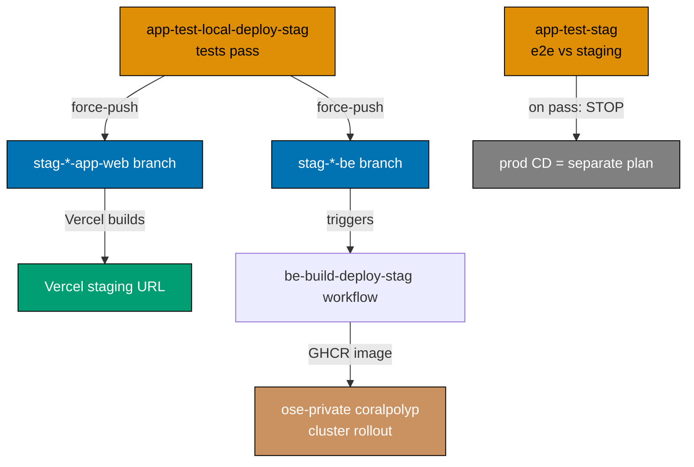

# GitHub Actions Workflow Naming Convention

GitHub Actions workflow files live in `.github/workflows/`. Two rules govern every file in that
directory: the **domain-first filename grammar** (what the file is called) and the
**`name:`-mirrors-filename rule** (what the `name:` field inside the file must say).

## Principles Implemented/Respected

This convention implements/respects the following core principles:

- **[Explicit Over Implicit](../../principles/software-engineering/explicit-over-implicit.md)**: The
  mapping between what GitHub Actions displays and what lives on disk is made explicit and
  deterministic. No guessing which file corresponds to a failing workflow run.

- **[Automation Over Manual](../../principles/software-engineering/automation-over-manual.md)**: A
  consistent mechanical grammar and derivation rule make it possible to validate filename/name
  alignment automatically, without relying on human review.

## Conventions Implemented/Respected

This practice respects the following conventions:

- **[File Naming Convention](../../conventions/structure/file-naming.md)**: Workflow filenames use
  kebab-case, consistent with the broader file naming rules applied across the repository.

## Purpose

Two problems motivate this convention:

1. **Discoverability**: GitHub shows the `name:` field in the Actions tab, in PR status checks, and
   in email notifications. When a workflow fails, developers look at the name in the UI then need to
   find and edit the corresponding `.yml` file. Without a consistent mapping rule, locating the right
   file requires opening files until the matching name is found.

2. **Grouping**: Sorting `.github/workflows/` alphabetically should cluster files by the product/domain
   they serve. A domain-first filename prefix (`organiclever-app-*`, `commons-*`, etc.) ensures related
   workflows appear together regardless of what action they perform.

This convention eliminates both friction points with a two-part standard: a domain-first grammar for
the filename and a deterministic derivation rule for the `name:` field.

## Scope

### What This Convention Covers

- All workflow files under `.github/workflows/`
- The relationship between the `name:` field and the `.yml` filename
- The `_reusable-` prefix for `workflow_call` reusable workflows

### What This Convention Does NOT Cover

- Workflow content, structure, or job naming
- Composite actions (`.github/actions/setup-*`) — these follow their own naming rules
- Fast-gate test policy (no integration/e2e in PR gates) — see
  [CI Conventions](./ci-conventions.md)

## Standards

### Domain-First Filename Grammar

Every workflow filename follows this grammar:

```text
[_reusable-]{domain}-{action-chain}.yml
```

| Token            | Description                                                                                                                                                                                                                                                                                                    |
| ---------------- | -------------------------------------------------------------------------------------------------------------------------------------------------------------------------------------------------------------------------------------------------------------------------------------------------------------- |
| `_reusable-`     | Optional prefix. Use **only** for `workflow_call` reusables. Never use on caller workflows.                                                                                                                                                                                                                    |
| `{domain}`       | The app or cross-cutting group the workflow serves. App/group values: `ose-www`, `ayokoding-www`, `organiclever-www`, `wahidyankf-www`, `organiclever-app`, `ose-app`, `organiclever-be`, `ose-be`. Cross-cutting values: `commons`, `markdown`, `docs`, `dependency`, or any `{cli-name}` (e.g. `crane-cli`). |
| `{action-chain}` | One or more verbs and environment qualifiers joined by `-`, written left-to-right in execution order (see vocabulary below).                                                                                                                                                                                   |

### Verb and Qualifier Vocabulary

Compose the `{action-chain}` from this fixed vocabulary, left-to-right in the order the actions
execute:

| Verb / qualifier    | Meaning                                                                                                                                                                      |
| ------------------- | ---------------------------------------------------------------------------------------------------------------------------------------------------------------------------- |
| `test-local`        | Run tests against a locally-spun stack (docker-compose: integration + e2e). Never runs in the PR gate.                                                                       |
| `test-stag`         | Run e2e tests against the **deployed staging** environment (no docker-compose).                                                                                              |
| `deploy-stag`       | Force-push to the `stag-*` branch. That branch push is the deploy trigger: Vercel builds web apps from it; backends trigger a `{product}-be-build-deploy-stag.yml` workflow. |
| `deploy-prod`       | Force-push to the `prod-*` branch. Same mechanism as `deploy-stag` for the production target.                                                                                |
| `build-deploy-stag` | For non-Vercel backends: build the container image, push it to GHCR, and hand the cluster rollout to ose-private `coralpolyp`. Triggered on push to the `stag-*-be` branch.  |
| `build-deploy-prod` | Same as `build-deploy-stag` for the production target (deferred — see [deploy model](#deploy-model)).                                                                        |
| `quality-gate`      | The PR quality gate: `typecheck`, `lint`, `test:quick`, `specs:coverage`, and cross-language lint jobs. No integration or e2e tests.                                         |
| `validate`          | A repo-wide validation job (markdown, links, heading hierarchy, Mermaid).                                                                                                    |
| `env-validate`      | Validate `.env.example` contracts and the `env-injection:` manifest (in `repo-config.yml`) for internal consistency.                                                         |
| `audit`             | Run a dependency-vulnerability audit outside the PR and registry gate surfaces.                                                                                              |

### `name:` Mirrors Filename

The `name:` field inside every workflow file must be a mechanical derivation of the filename
(without the `.yml` extension). Derive the `name:` value from the filename by reversing the
transformations below, or equivalently: derive the filename from the intended `name:` by applying
these transformations in order:

1. Convert to lowercase
2. Replace spaces with hyphens
3. Remove special characters: `+`, `(`, `)`, `/`, `#`
4. Replace `-` (space-hyphen-space) with `-`
5. Collapse consecutive hyphens to a single hyphen
6. Append `.yml`

The result must exactly match the filename (without path).

### Transformation Table

| Character or pattern in `name:` | Becomes in filename |
| ------------------------------- | ------------------- |
| Space (` `)                     | `-`                 |
| `-` (spaced hyphen)             | `-`                 |
| `+`                             | removed             |
| `(`                             | removed             |
| `)`                             | removed             |
| `/`                             | removed             |
| `#`                             | removed             |
| Consecutive hyphens (`--`)      | `-`                 |

## Deploy Model

"Deploy" in every workflow name is a **branch force-push**, never a direct cluster or Vercel API
call:



- **Web (Vercel)**: The branch push is the entire deploy — Vercel listens to `stag-*`/`prod-*`
  branches and builds from them. Workflows push the branch; Vercel does the rest.
- **Backend (non-Vercel)**: The app-tier deploy force-pushes the `stag-*-be` branch. A separate
  `{product}-be-build-deploy-stag.yml` (triggered on push to that branch) builds and pushes the
  GHCR image. The actual k3s rollout runs in ose-private via `coralpolyp` — out of this repo.
- **Prod CD**: Production deployment for app-tier workflows is deferred to a separate follow-on
  plan. Because no prod deploy happens yet, the app-tier staging gate ends at the `test-stag` verb —
  it is named `{group}-app-test-stag.yml` (it runs e2e against the deployed staging URL and stops on
  pass), with **no** `deploy-prod` segment. The `deploy-prod` qualifier is used today only by
  www-tier callers (`*-www-test-local-deploy-prod`, direct to prod) and is reserved for the app tier
  for when its prod CD lands (at which point the terminal step would extend to
  `*-app-test-stag-deploy-prod`).

## Target File Set

The 17 workflow files that the `standardize-github-actions-pipeline-naming` plan establishes as the
canonical set, organized by tier:

### Reusable workflows (`_reusable-` prefix)

| Filename                                   | Purpose                                                                                                |
| ------------------------------------------ | ------------------------------------------------------------------------------------------------------ |
| `_reusable-www-test-local-deploy.yml`      | Shared job graph for www-tier: lint → unit → specs-coverage → integration → e2e → deploy (prod branch) |
| `_reusable-app-test-local-deploy-stag.yml` | Shared job graph for app-tier local test + dual-branch staging deploy (web + be)                       |
| `_reusable-app-test-stag.yml`              | Shared staging e2e job: runs fe-e2e against deployed staging URL; stops on pass                        |
| `_reusable-be-build-deploy.yml`            | Shared GHCR build+push job for non-Vercel backends; inputs: `be-project`, `image-name`, `environment`  |

### www tier — callers of `_reusable-www-test-local-deploy.yml`

| Filename                                      | Domain             | Deploys to              |
| --------------------------------------------- | ------------------ | ----------------------- |
| `ose-www-test-local-deploy-prod.yml`          | `ose-www`          | `prod-ose-www`          |
| `ayokoding-www-test-local-deploy-prod.yml`    | `ayokoding-www`    | `prod-ayokoding-www`    |
| `wahidyankf-www-test-local-deploy-prod.yml`   | `wahidyankf-www`   | `prod-wahidyankf-www`   |
| `organiclever-www-test-local-deploy-prod.yml` | `organiclever-www` | `prod-organiclever-www` |

### app tier — callers of `_reusable-app-test-local-deploy-stag.yml` / `_reusable-app-test-stag.yml`

| Filename                                      | Domain             | Force-pushes                                         |
| --------------------------------------------- | ------------------ | ---------------------------------------------------- |
| `organiclever-app-test-local-deploy-stag.yml` | `organiclever-app` | `stag-organiclever-app-web` + `stag-organiclever-be` |
| `organiclever-app-test-stag.yml`              | `organiclever-app` | (stops on pass — prod CD deferred)                   |
| `ose-app-test-local-deploy-stag.yml`          | `ose-app`          | `stag-ose-app-web` + `stag-ose-be`                   |
| `ose-app-test-stag.yml`                       | `ose-app`          | (stops on pass — prod CD deferred)                   |

### Backend build-deploy (triggered on push to `stag-*-be`)

| Filename                                | Trigger branch         | Reusable called                 |
| --------------------------------------- | ---------------------- | ------------------------------- |
| `organiclever-be-build-deploy-stag.yml` | `stag-organiclever-be` | `_reusable-be-build-deploy.yml` |
| `ose-be-build-deploy-stag.yml`          | `stag-ose-be`          | `_reusable-be-build-deploy.yml` |

### Library deploy workflows

| Filename                       | Domain   | Purpose                                                                                |
| ------------------------------ | -------- | -------------------------------------------------------------------------------------- |
| `web-ui-build-deploy-prod.yml` | `web-ui` | Daily/on-demand: build Storybook and force-push `prod-web-ui` only when inputs changed |

### Cross-cutting workflows

| Filename                             | Domain       | Purpose                                                                  |
| ------------------------------------ | ------------ | ------------------------------------------------------------------------ |
| `dependency-vulnerability-audit.yml` | `dependency` | Scheduled dependency-vulnerability audit, outside registry gate surfaces |
| `pr-quality-gate.yml`                | `pr`         | PR gate: typecheck, lint, test:quick, specs:coverage, lint jobs          |
| `validate-env.yml`                   | `validate`   | `.env.example` contract + `env-injection:` manifest check                |

## Examples

### PASS: Correctly aligned name and filename (new grammar)

```yaml
# File: .github/workflows/pr-quality-gate.yml
name: PR - Quality Gate
```

Derivation: `PR - Quality Gate` → lowercase → `pr - quality gate` → spaces to hyphens →
`pr---quality-gate` → collapse hyphens → `pr-quality-gate` → append `.yml` →
`pr-quality-gate.yml`. Matches filename.

---

```yaml
# File: .github/workflows/organiclever-app-test-local-deploy-stag.yml
name: OrganicLever App - Test Local Deploy Stag
```

Derivation: lowercase + spaces-to-hyphens + collapse → `organiclever-app-test-local-deploy-stag` →
append `.yml` → `organiclever-app-test-local-deploy-stag.yml`. Matches filename.

### FAIL: Wrong prefix order (action before domain)

```yaml
# File: .github/workflows/test-and-deploy-organiclever-www.yml  ← action first
name: Test and Deploy - OrganicLever WWW
```

The domain (`organiclever-www`) must come first. Correct filename:
`organiclever-www-test-local-deploy-prod.yml`.

### FAIL: Using `_reusable-` on a caller workflow

```yaml
# File: .github/workflows/_reusable-organiclever-app-test-local-deploy-stag.yml  ← wrong
```

The `_reusable-` prefix is reserved for `workflow_call` reusables only. Caller workflows must
not carry this prefix.

## Special Considerations

### Permitted abbreviations for long names

When the fully derived filename would be excessively long (over 60 characters before `.yml`),
abbreviations are permitted provided they are applied consistently and the mapping remains obvious.
Established abbreviations in this codebase:

| Full word/phrase | Abbreviation |
| ---------------- | ------------ |
| `Backend`        | `be`         |
| `Staging`        | `stag`       |
| `Production`     | `prod`       |

When using an abbreviation, update this table so the mapping remains documented and reviewable.

### Language/framework identifiers in parentheses

The pattern `(Language/Framework)` in a name maps to `language-framework` in the filename:
parentheses are removed, the `/` is removed, a hyphen separates language from framework, and the
whole segment is lowercased. For example, `(Rust/Axum)` → `rust-axum`.

### Version Alignment Policy

`pr-quality-gate.yml` is the **source of truth** for language version choices. All scheduled
test and deploy workflows must use the same language versions as `pr-quality-gate.yml`.

**Rule**: When upgrading a language version in `pr-quality-gate.yml`, update all deploy
workflows that use that language in the same commit. Version drift creates inconsistencies where CI
passes on `main` but manually dispatched tests fail (or vice versa).

**Workflows that must stay aligned**:

| Language | `pr-quality-gate.yml` step | Scheduled workflows to update                                                       |
| -------- | -------------------------- | ----------------------------------------------------------------------------------- |
| Node.js  | `node-version`             | All workflows installing Node.js                                                    |
| .NET     | `dotnet-version`           | `organiclever-app-test-local-deploy-stag.yml`, `ose-app-test-local-deploy-stag.yml` |

### Adding new workflows

When creating a new workflow:

1. Identify the domain (app group or cross-cutting qualifier).
2. Compose the `{action-chain}` from the verb/qualifier vocabulary, left-to-right in execution
   order.
3. Prefix with `_reusable-` only if the workflow uses `on: workflow_call`.
4. Derive the `name:` field from the filename using the derivation rule above.
5. If the derived name would exceed 60 characters, apply a documented abbreviation.
6. Add the new filename to the target file set table in this document.

## Tools and Automation

`actionlint` validates every `.github/workflows/*.yml` file for syntax, job references, and input
types — it runs in the PR gate (`pr-quality-gate.yml`) and the local pre-commit Husky hook.
The `repo-rules-checker` agent validates adherence to this naming convention during governance
audits.

## References

**Related Development Standards:**

- [CI Conventions](./ci-conventions.md) — Fast-gate test policy (no integration/e2e in PR gates),
  workflow `environment:` scoping, and env-injection standards
- [Nx Target Standards](./nx-targets.md) — Consistent naming applied to Nx target identifiers
- [Commit Message Convention](../workflow/commit-messages.md) — Another naming consistency rule for
  developer-facing identifiers

**Agents:**

- `repo-rules-checker` — Validates that workflow filenames match their `name:` fields and follow
  the domain-first grammar
- `repo-rules-fixer` — Corrects misaligned workflow filenames or name fields
