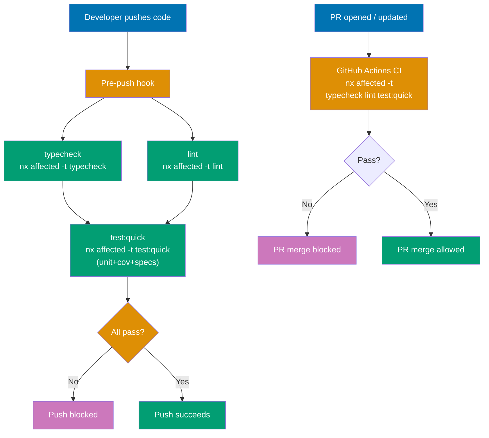
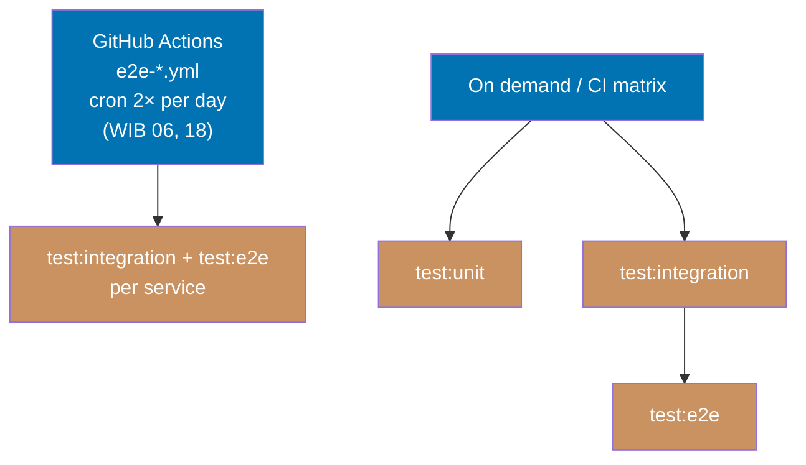

# Execution Model

## Quality Gates (pre-push enforcement)

Pre-push and PR CI execute their registry-declared projections; they are complementary lifecycle
surfaces, not three hardcoded identical checkpoints. Discover each live projection with `gate
list --surface=<surface>`. A successful PR aggregate is evidence for the exact repository, head,
and applicable base it reports; it does not prove a later head.

For ordinary projects, `test:quick` composes typecheck, lint, unit tests, coverage, and specs. The
registry determines where that target and any additional checks run, so this page does not copy a
gate inventory.

**One documented exception — `rhino-cli`**: its `test:quick` is a 4-step composition
(typecheck → lint → test:unit → test:specs). `test:coverage` was lifted out of the local chain
because instrumented rebuilds dominated pre-push wall time, and it now runs in the CI Rust
quality-gate job instead. The `test:coverage` target itself is unchanged and still carries
`--fail-under-lines 90`, so a coverage drop still blocks merge — it blocks at the PR gate rather
than at pre-push. No other project takes this exception.

## Scheduled and On-Demand Testing

Deeper tests run outside the pre-push/PR cycle — on a schedule or triggered explicitly.

Scheduled workflows run deeper suites outside the push/PR feedback path. Their workflow files and
registry wiring are authoritative for the current tracks.

