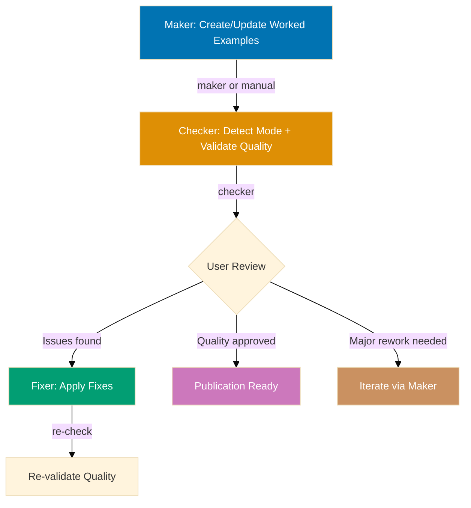
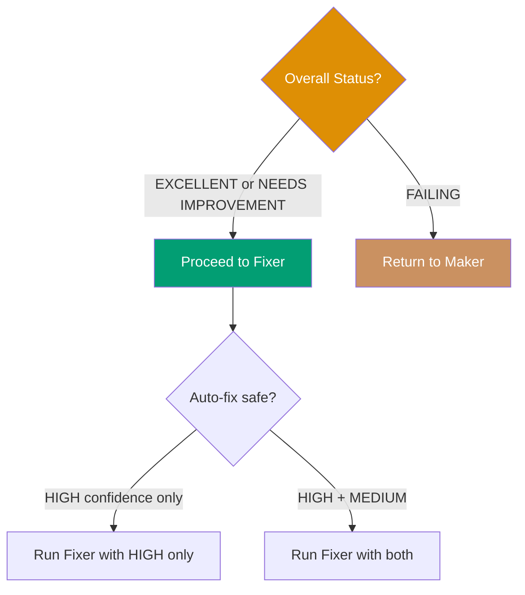

# AyoKoding Content Annotated-Concept Quality Gate Workflow

**Purpose**: Validate and improve Annotated-concept tutorial quality through iterative checking
and fixing until tutorials achieve 45-60 self-contained worked examples (or 20-30 worked scenarios
for the leadership no-code sub-mode) with correct mode integrity and accessible diagrams.

**When to use**:

- After creating or updating Annotated-concept tutorials (concept-centric subject topics, or
  leadership/governance topics authored in the no-code sub-mode)
- Before publishing Annotated-concept content to ayokoding-web
- After adding new worked examples, scenarios, or diagrams to existing tutorials
- Periodically to ensure tutorial quality remains high

This workflow implements the **Maker-Checker-Fixer pattern** to ensure Annotated-concept tutorials
meet quality standards before publication.

## Execution Mode

**Preferred Mode**: Agent Delegation — invoke `apps-ayokoding-www-annotated-concept-checker` and
`apps-ayokoding-www-annotated-concept-fixer` via the Agent tool with `subagent_type`
(see [Workflow Execution Modes Convention](../meta/execution-modes.md)).

**Fallback Mode**: Manual Orchestration — execute workflow logic directly using
Read/Write/Edit tools when Agent Delegation is unavailable.

The Agent tool runs delegated agents that persist file changes to the actual filesystem, making it
the preferred approach when these agents exist as defined delegated agent types. Note: this
workflow includes a manual user review step (step 3) — agent delegation applies to the checker and
fixer steps, not the human decision point.

**How to Execute**:

```
User: "Run ayokoding-web annotated-concept quality gate workflow for computer-science-foundations/learning/"
```

The AI will:

1. Invoke `apps-ayokoding-www-annotated-concept-checker` via the Agent tool (detects mode,
   validates tutorial, writes audit)
2. User reviews audit report and decides on fixes (manual decision point)
3. Invoke `apps-ayokoding-www-annotated-concept-fixer` via the Agent tool (reads audit, applies
   fixes, writes fix report)
4. Iterate until EXCELLENT status achieved (zero findings, count within its band, correct mode
   integrity)
5. Show git status with modified files
6. Wait for user commit approval

**Fallback (Manual Mode)**:

```
User: "Run ayokoding-web annotated-concept quality gate workflow for computer-science-foundations/learning/ in manual mode"
```

The AI executes checker and fixer logic directly using Read/Write/Edit tools in the main context —
use this when agent delegation is unavailable.

## Workflow Overview



## Research Delegation

The `apps-ayokoding-www-annotated-concept-maker` and `apps-ayokoding-www-facts-checker` agents
invoked by this workflow delegate multi-page web research to the
[`web-researcher`](../../../.claude/agents/web-researcher.md) delegated agent when composing or
verifying claims about library versions, API signatures, or best practices requires more than one
or two searches, or more than two fetches. In-context `WebSearch`/`WebFetch` remain available for
single-shot verification against known authoritative URLs. This keeps each agent's context lean.
The delegation is encoded in each agent's prompt — no workflow-level configuration required.

## Steps

### 1. Maker - Create/Update Worked Examples (Manual/AI-Assisted)

**Objective**: Create or update Annotated-concept tutorial content, in the correct mode (standard
concept-centric with code, or the leadership no-code sub-mode)

**Approaches**:

**Option A: Manual creation** (human author)

- Write worked examples following the anatomy documented in
  `apps-ayokoding-www-annotated-concept-maker`
- Focus on educational value and concept clarity
- Don't worry about perfect compliance (checker will catch issues)

**Option B: AI-assisted creation** (`apps-ayokoding-www-annotated-concept-maker`)

- Determine mode first (standard vs. no-code sub-mode) from the topic's format designation
- Generate initial worked examples/scenarios based on the topic's concept inventory
- Human review and refinement

**Outputs**:

- Tutorial files: `overview.md`, worked-example page(s) grouped by per-theme clusters, `capstone/`
- `code/` directory with colocated runnable files (standard mode only — absent in the no-code
  sub-mode)
- 45-60 worked examples (standard mode) or 20-30 worked scenarios (no-code sub-mode)
- Accessible Mermaid diagrams where a visual materially aids understanding

**Next step**: Proceed to step 2

### 2. Checker - Detect Mode and Validate Quality (Sequential)

**Objective**: Detect the topic's anatomy mode, then identify gaps and issues against
Annotated-concept standards

**Agent**: `apps-ayokoding-www-annotated-concept-checker`

**Execution**:

```bash
# Invoke via Task tool
subagent_type: apps-ayokoding-www-annotated-concept-checker
prompt: "Validate apps/ayokoding-www/content/en/learn/fundamentally-strong/software-engineer/computer-science-foundations/learning/ for compliance with Annotated-concept standards"
```

**Validation areas**:

1. **Mode detection**: standard (code-bearing) vs. leadership no-code sub-mode, decided before any
   other check
2. **Worked-example/scenario count**: 45-60 (standard) or 20-30 (no-code sub-mode) — floor, not a
   cap
3. **Annotation density** (standard mode only): 1.0-2.25 comment lines per code line, same formula
   direction as By Example
4. **Self-containment**: code-bearing worked examples copy-paste-runnable within topic scope
5. **Mode integrity** (CRITICAL): zero code blocks and no `code/` directory in a no-code sub-mode
   topic
6. **Diagrams**: accessible WCAG palette, used only where a visual materially aids understanding
7. **Structure**: Context, medium-fits-concept, Key Takeaway, Why It Matters (50-100 words)
8. **Frontmatter**: complete and correct

**Outputs**:

- Audit report:
  `generated-reports/ayokoding-web-annotated-concept__{uuid-chain}__{timestamp}__audit.md`
- Executive summary with overall status and detected mode
- Detailed findings with confidence levels
- Specific line numbers for issues
- Actionable recommendations

**UUID Chain Tracking**: Checker generates 6-char UUID and writes to
`generated-reports/.execution-chain-{scope}` (where scope is derived from tutorial path, e.g.,
"computer-science-foundations"). See
[Temporary Files Convention](../../development/infra/temporary-files.md#uuid-chain-generation) for
details.

**Depends on**: Step 1 completion

**Next step**: Proceed to step 3

### 3. User Review (Manual Decision Point)

**Objective**: Human decision on validation findings

**User actions**:

**1. Read audit report** from generated-reports/

**2. Count findings based on mode level** (default: `{input.mode}` or `normal`):

**Strictness-based counting**:

- **lax**: Count CRITICAL only
- **normal**: Count CRITICAL + HIGH
- **strict**: Count CRITICAL + HIGH + MEDIUM
- **ocd**: Count all levels (CRITICAL, HIGH, MEDIUM, LOW)

**Below-threshold findings**: Reported but don't block success

**3. Assess overall status**:

- PASS: **EXCELLENT**: Zero threshold-level findings, proceed to fixer for below-threshold issues
  (optional)
- **NEEDS IMPROVEMENT**: Some threshold-level findings, proceed to fixer for mechanical fixes
- FAIL: **FAILING**: Major structural issues (e.g., wrong mode entirely, count far below floor),
  return to maker for rework

**4. Review confidence levels**:

- **HIGH confidence**: Trust findings, approve auto-fix
- **MEDIUM confidence**: Review specific worked examples/scenarios, approve if valid
- **FALSE POSITIVE risk**: Decide whether to keep current design or fix

**5. Make decision**:



**Decision matrix**:

| Status            | HIGH Conf Issues | MEDIUM Conf Issues | Action                                 |
| ----------------- | ---------------- | ------------------ | -------------------------------------- |
| EXCELLENT         | 0-5              | 0-10               | Run fixer (all)                        |
| NEEDS IMPROVEMENT | 5-15             | 10-30              | Run fixer (HIGH only or review MEDIUM) |
| FAILING           | 15+              | 30+ or Major gaps  | Return to maker                        |

**Depends on**: Step 2 completion

**Next step**:

- If approved → Proceed to step 4
- If failing → Return to step 1

### 4. Fixer - Apply Validated Fixes (Sequential, Conditional)

**Objective**: Automatically apply safe, validated improvements

**Agent**: `apps-ayokoding-www-annotated-concept-fixer`

**Execution**:

```bash
# Invoke via Task tool with audit report and mode parameter
subagent_type: apps-ayokoding-www-annotated-concept-fixer
prompt: "Apply fixes from generated-reports/ayokoding-web-annotated-concept__a1b2c3__2026-07-13--14-30__audit.md with mode={input.mode}"
```

**Fix application strategy**:

**Fixer respects mode level** (`{input.mode}` from workflow):

- **lax**: Fix CRITICAL only (skip HIGH/MEDIUM/LOW)
- **normal**: Fix CRITICAL + HIGH (skip MEDIUM/LOW)
- **strict**: Fix CRITICAL + HIGH + MEDIUM (skip LOW)
- **ocd**: Fix all levels (CRITICAL, HIGH, MEDIUM, LOW)

**HIGH confidence fixes** (auto-apply within mode scope):

- Add missing imports on code-bearing worked examples
- Fix color palette violations
- Add frontmatter fields
- Remove a code block found in a no-code sub-mode topic (CRITICAL mode violation)

**MEDIUM confidence fixes** (re-validate first, only if mode includes MEDIUM):

- Add `// =>` style annotations to hit density
- Add missing key takeaways
- Condense verbose "Why It Matters" sections

**FALSE POSITIVE risks** (report to user):

- Worked-example/scenario count adjustments (requires content creation)
- Medium-choice adjustments (code vs. pseudocode vs. config vs. diagram — design choice)

**Outputs**:

- Modified tutorial files with fixes applied
- Fix report:
  `generated-reports/ayokoding-web-annotated-concept__{uuid-chain}__{timestamp}__fix.md` (uses
  same UUID chain as source audit)
- List of deferred issues requiring user decision

**Depends on**: Step 3 approval

**Success criteria**: Fixer successfully applies fixes without errors.

**On failure**: Log errors, proceed to re-validation anyway.

**Next step**: Proceed to step 5

### 5. Iteration Control (Sequential)

Determine whether to continue fixing or finalize.

**Logic**:

- Re-run checker (step 2) to get fresh report
- Count findings based on mode level (same as Step 3)
- Track `consecutive_zero_count` across iterations (resets to 0 when threshold-level findings > 0,
  increments when = 0)
- If consecutive_zero_count >= 2 AND iterations >= min-iterations (or min not provided): Proceed
  to step 6 (Finalization — double-zero confirmed)
- If consecutive_zero_count >= 2 AND iterations < min-iterations: Re-run checker and re-evaluate
  (need more iterations)
- If consecutive_zero_count < 2 AND threshold-level findings = 0: Re-run checker and re-evaluate
  (confirmation check — no fix or user review needed, just re-verify within this step)
- If threshold-level findings > 0 AND max-iterations provided AND iterations >= max-iterations:
  Proceed to step 6 with status `needs-improvement`
- If threshold-level findings > 0 AND (max-iterations not provided OR iterations < max-iterations):
  Loop back to step 3

**Below-threshold findings**: Continue to be reported in audit but don't affect iteration logic

**Depends on**: Step 4 completion

**Notes**:

- **Default behavior**: Runs up to 7 iterations (default max-iterations). Override with higher
  value for more attempts
- **Consecutive pass requirement**: Zero findings must be confirmed by a second independent check
  before declaring success
- **Optional min-iterations**: Prevents premature termination before sufficient iterations
- Each iteration gets fresh validation report
- Tracks iteration count and finding trends
- Below-threshold findings remain visible but don't block convergence

### 6. Finalization (Sequential)

Report final status and summary.

**Output**: `{final-status}`, `{iterations-completed}`, `{detected-mode}`,
`{worked-example-count}`, final reports

**Status determination**:

- **Excellent** (`excellent`): Zero threshold-level findings after final validation, worked-example
  count meets its floor (45 standard / 20 no-code sub-mode), mode integrity holds (below-threshold
  findings may exist and are acceptable)
- **Needs Improvement** (`needs-improvement`): Threshold-level findings remain after
  max-iterations OR count below its floor
- **Failing** (`failing`): Major structural issues prevent auto-fixing (e.g., wrong mode entirely),
  requires maker rework

**Depends on**: Step 5 completion

## Termination Criteria

**Success** (`excellent`):

- **lax**: Zero CRITICAL findings on 2 consecutive checks, count meets its floor (HIGH/MEDIUM/LOW
  may exist)
- **normal**: Zero CRITICAL/HIGH findings on 2 consecutive checks, count meets its floor
  (MEDIUM/LOW may exist)
- **strict**: Zero CRITICAL/HIGH/MEDIUM findings on 2 consecutive checks, count meets its floor
  (LOW may exist)
- **ocd**: Zero findings at all levels on 2 consecutive checks, count meets its floor

**Partial** (`needs-improvement`):

- Threshold-level findings remain after max-iterations OR count below its floor

**Failure** (`failing`):

- Major structural issues (wrong mode, count far below floor) require maker rework, auto-fixing
  not applicable

**Note**: Below-threshold findings are reported in final audit but don't prevent success status.

## Iteration Example: New Annotated-Concept Tutorial (Clean Path)

**Scenario**: Creating a standard-mode Annotated-concept tutorial from scratch

**Step 1: Maker** (manual creation)

- Author writes 40 worked examples in per-theme clusters
- Includes code, some annotations, few diagrams
- Saves to `computer-science-foundations/learning/`

**Step 2: Checker** (validation)

```bash
apps-ayokoding-www-annotated-concept-checker validates computer-science-foundations learning subtree
```

**Results**:

- Mode detected: standard
- 40 worked examples (floor: 45) ️
- Self-containment: 90%
- Annotations: 70% coverage ️
- Status: **NEEDS IMPROVEMENT**

**Step 3: User Review**

- Reviews audit report
- Approves HIGH confidence fixes
- Approves MEDIUM confidence annotation additions
- Defers additional worked examples (needs content planning)

**Step 4: Fixer** (apply fixes)

```bash
apps-ayokoding-www-annotated-concept-fixer applies fixes from audit
```

**Fixes applied**:

- Added annotations to meet 1.0-2.25 comment lines per code line density on existing examples
  (MEDIUM, re-validated)
- Fixed 2 color violations (HIGH)
- Added 3 missing key takeaways (MEDIUM)

**Step 5: Re-validation**

```bash
apps-ayokoding-www-annotated-concept-checker re-validates
```

**Results**:

- Self-containment: 100%
- Annotations: 95% coverage
- Worked-example count: 40 (below floor, deferred) ️
- Status: **NEEDS IMPROVEMENT** (count still below the 45 floor)

**Outcome**: Return to maker to add 5+ more worked examples before EXCELLENT can be declared

## Strictness Example: Normal Strictness (Default)

**Scenario**: Standard-mode validation for a system design Annotated-concept tutorial

**Invocation**:

```
User: "Run ayokoding-web annotated-concept quality gate workflow for system-design/learning/ in normal mode"
```

**Checker results**:

- 1 CRITICAL finding (code found in what should be a no-code sub-mode topic — mode mismatch)
- 4 HIGH findings (color violations, missing frontmatter)
- 6 MEDIUM findings (missing annotations)
- 9 LOW findings (style improvements)

**Fixer behavior**:

- Fixes: 1 CRITICAL + 4 HIGH = 5 fixes applied
- Skips: 6 MEDIUM + 9 LOW = 15 findings reported but not fixed
- Status: `excellent` (zero threshold-level findings, below-threshold findings acceptable)

## Workflow Invocation

### Agent Delegation (Preferred)

**User triggers workflow execution**:

```
User: "Run ayokoding-web annotated-concept quality gate workflow for computer-science-foundations/learning/"
```

**AI orchestrates all phases**:

1. **Create content** (if needed): User writes worked examples or uses maker agent
2. **Validate**: Invoke `apps-ayokoding-www-annotated-concept-checker` via Agent tool
3. **Review**: User reads audit report from generated-reports/
4. **Fix**: Invoke `apps-ayokoding-www-annotated-concept-fixer` via Agent tool
5. **Re-validate**: Invoke checker via Agent tool again
6. **Iterate**: Repeat validation-fixing until clean or max-iterations

**With parameters**:

```
User: "Run ayokoding-web annotated-concept quality gate workflow for computer-science-foundations/learning/ in strict mode with max-iterations=10"
```

The AI invokes agents with mode-based fixing and iteration limits.

## Safety Features

**Infinite Loop Prevention**:

- max-iterations defaults to 7 (override with higher value for more attempts)
- When provided, workflow terminates with `needs-improvement` if limit reached
- Tracks iteration count and finding trends
- Use max-iterations when fix convergence is uncertain

**Convergence Safeguards**:

- Checker loads `.known-false-positives.md` skip list at start of each iteration
- Fixer persists new FALSE_POSITIVEs to skip list after each run
- Re-validation uses scoped scan (changed files only) to prevent scope expansion
- Escalation after repeated checker-fixer disagreements on the same finding

**False Positive Protection**:

- Fixer re-validates findings before applying
- Skips FALSE_POSITIVE findings automatically
- Progressive writing ensures audit history survives

**Error Recovery**:

- Continues to finalization even if fixer partially fails
- Reports which fixes succeeded/failed
- Generates final reports regardless of status

**User Control**:

- Auto-fix-level parameter controls automation degree
- Manual decision points at user review step
- Can abort and return to maker for major rework

## Success Metrics

Track across executions:

- **Average iterations to completion**: How many cycles typically needed for EXCELLENT status
- **Success rate**: Percentage reaching zero findings and floor targets
- **Common issues**: What problems appear most frequently (density, missing artifacts, mode
  mismatches)
- **Fix success rate**: Percentage of fixes applied without errors
- **Tutorial improvement velocity**: Worked-example/scenario count increase per iteration

## Related Workflows

This workflow is part of the **Tutorial Quality Family**:

- **[Maker-Checker-Fixer Pattern](../../development/pattern/maker-checker-fixer.md)**: General
  pattern
- **[AyoKoding Web By-Example Quality Gate](./ayokoding-web-swe-by-example-quality-gate.md)**:
  Sibling workflow for language-syntax-centric topics
- **[AyoKoding Web Primer Quality Gate](./ayokoding-web-primer-quality-gate.md)**: Sibling
  workflow for "Just Enough X" language/tool on-ramps
- **ayokoding-web-general-quality-gate**: General content validation

## Notes

- **User-driven**: Requires manual decision points (user review), not fully automated
- **Iterative**: Multiple checker-fixer cycles until quality achieved
- **Bounded**: Max-iterations prevents runaway execution
- **Observable**: Generates detailed audit and fix reports
- **Flexible**: Auto-fix-level parameter controls automation degree
- **Focused**: Specialized for Annotated-concept tutorials only (both modes), not By Example or
  Primer tutorials

**Parallelization**: Currently executes sequentially due to user decision points
(maker-checker-fixer pattern). The `max-concurrency` parameter is reserved for future enhancements
where validation dimensions could run concurrently after user approval.

## Principles Implemented/Respected

- PASS: **Explicit Over Implicit**: All steps, decisions, and criteria are explicit — including
  the mandatory mode-detection step
- PASS: **Automation Over Manual**: Automated validation and fixing where safe
- PASS: **Quality Over Speed**: Iterative refinement until excellent
- PASS: **Convention Over Configuration**: Standardized Annotated-concept validation criteria
- PASS: **Simplicity Over Complexity**: Clear flow despite maker-checker-fixer complexity
- PASS: **Progressive Disclosure**: Can adjust iteration limits and auto-fix levels

## Conventions Implemented/Respected

- **[File Naming Convention](../../conventions/structure/file-naming.md)**: Workflow file follows
  plain name convention for workflows
- **[Linking Convention](../../conventions/formatting/linking.md)**: All cross-references use
  GitHub-compatible markdown with `.md` extensions
- **[Content Quality Principles](../../conventions/writing/quality.md)**: Active voice, proper
  heading hierarchy, single H1

## Related Documentation

- **[Tutorial Convention](../../conventions/tutorials/general.md)**: Base tutorial standards
- **[Maker-Checker-Fixer Pattern](../../development/pattern/maker-checker-fixer.md)**: Workflow
  pattern
- **[Fixer Confidence Levels](../../development/quality/fixer-confidence-levels.md)**: Confidence
  assessment
- **[`apps-ayokoding-www-annotated-concept-checker` agent](../../../.claude/agents/apps-ayokoding-www-annotated-concept-checker.md)**:
  Validation agent
- **[`apps-ayokoding-www-annotated-concept-fixer` agent](../../../.claude/agents/apps-ayokoding-www-annotated-concept-fixer.md)**:
  Fixing agent
- **[`apps-ayokoding-www-annotated-concept-maker` agent](../../../.claude/agents/apps-ayokoding-www-annotated-concept-maker.md)**:
  Content creation agent
