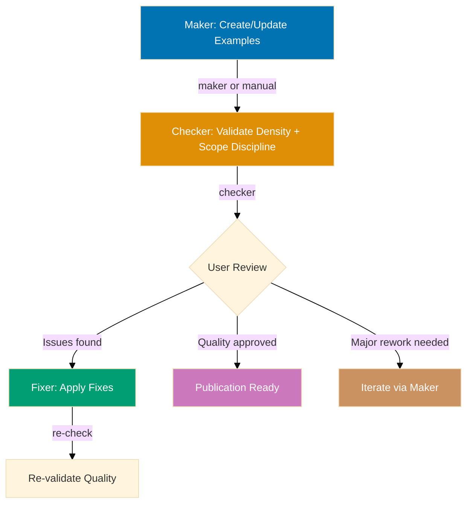
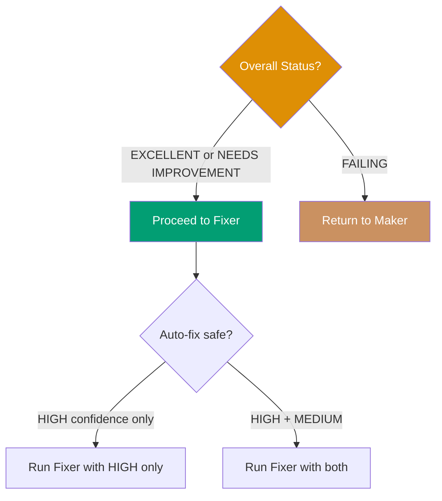

# AyoKoding Content Primer Quality Gate Workflow

**Purpose**: Validate and improve Primer ("Just Enough X") tutorial quality through iterative
checking and fixing until primers achieve 75-85 self-contained, annotated examples authored at
By-Example pace, scoped tightly to "just enough to be productive."

**When to use**:

- After creating or updating a "Just Enough &lt;Language&gt;" or "Just Enough &lt;Tool&gt;" primer
- Before publishing Primer content to ayokoding-web
- After adding new examples or diagrams to an existing primer
- When a primer's dependent topics change and its scope needs re-verification

This workflow implements the **Maker-Checker-Fixer pattern** to ensure Primer tutorials meet
quality standards before publication.

## Execution Mode

**Preferred Mode**: Agent Delegation — invoke `apps-ayokoding-www-primer-checker` and
`apps-ayokoding-www-primer-fixer` via the Agent tool with `subagent_type`
(see [Workflow Execution Modes Convention](../meta/execution-modes.md)).

**Fallback Mode**: Manual Orchestration — execute workflow logic directly using
Read/Write/Edit tools when Agent Delegation is unavailable.

The Agent tool runs delegated agents that persist file changes to the actual filesystem, making it
the preferred approach when these agents exist as defined delegated agent types. Note: this
workflow includes a manual user review step (step 3) — agent delegation applies to the checker and
fixer steps, not the human decision point.

**How to Execute**:

```
User: "Run ayokoding-web primer quality gate workflow for just-enough-go/learning/"
```

The AI will:

1. Invoke `apps-ayokoding-www-primer-checker` via the Agent tool (validates primer, writes audit)
2. User reviews audit report and decides on fixes (manual decision point)
3. Invoke `apps-ayokoding-www-primer-fixer` via the Agent tool (reads audit, applies fixes, writes
   fix report)
4. Iterate until EXCELLENT status achieved (zero findings, 75-85 examples, verified scope
   discipline)
5. Show git status with modified files
6. Wait for user commit approval

**Fallback (Manual Mode)**:

```
User: "Run ayokoding-web primer quality gate workflow for just-enough-go/learning/ in manual mode"
```

The AI executes checker and fixer logic directly using Read/Write/Edit tools in the main context —
use this when agent delegation is unavailable.

## Workflow Overview



## Research Delegation

The `apps-ayokoding-www-primer-maker` and `apps-ayokoding-www-facts-checker` agents invoked by
this workflow delegate multi-page web research to the
[`web-researcher`](../../../.claude/agents/web-researcher.md) delegated agent when composing or
verifying claims about language versions, tool versions, or CLI syntax requires more than one or
two searches, or more than two fetches. In-context `WebSearch`/`WebFetch` remain available for
single-shot verification against known authoritative URLs. This keeps each agent's context lean.
The delegation is encoded in each agent's prompt — no workflow-level configuration required.

## Steps

### 1. Maker - Create/Update Examples (Manual/AI-Assisted)

**Objective**: Create or update Primer tutorial content, scoped to "just enough to be productive"

**Approaches**:

**Option A: Manual creation** (human author)

- Write examples following the anatomy documented in `apps-ayokoding-www-primer-maker`
- Focus on educational value within the primer's scoped surface
- Don't worry about perfect compliance (checker will catch issues)

**Option B: AI-assisted creation** (`apps-ayokoding-www-primer-maker`)

- Identify the topics that depend on this primer and derive the minimum productive surface
- Generate initial examples authored at By-Example pace within that scope
- Human review and refinement

**Outputs**:

- Tutorial files: `overview.md` (stating scope + dependent topics), example page(s), `capstone/`
  (light consolidation exercise), `code/`
- 75-85 examples across the scoped surface
- Mermaid diagrams where appropriate
- Educational annotations and comments

**Next step**: Proceed to step 2

### 2. Checker - Validate Quality (Sequential)

**Objective**: Identify gaps and issues against Primer standards, including scope discipline

**Agent**: `apps-ayokoding-www-primer-checker`

**Execution**:

```bash
# Invoke via Task tool
subagent_type: apps-ayokoding-www-primer-checker
prompt: "Validate apps/ayokoding-www/content/en/learn/fundamentally-strong/software-engineer/just-enough-go/learning/ for compliance with Primer standards"
```

**Validation areas**:

1. **Coverage and count**: 75-85 examples (floor: 75)
2. **Annotation density**: 1.0-2.25 comment lines per code line, per example (same formula as By
   Example)
3. **Self-containment**: copy-paste-runnable within the primer's scope
4. **Scope discipline** (CRITICAL, Primer-specific): `overview.md` states the "just enough to be
   productive" scope and dependent topics; every example serves that stated scope
5. **Diagrams**: accessible color-blind palette
6. **Format**: five-part structure identical to By Example
7. **Capstone type**: light consolidation exercise, not a full runnable project
8. **Frontmatter**: complete and correct

**Outputs**:

- Audit report: `generated-reports/ayokoding-web-primer__{uuid-chain}__{timestamp}__audit.md`
- Executive summary with overall status
- Detailed findings with confidence levels
- Specific line numbers for issues
- Actionable recommendations

**UUID Chain Tracking**: Checker generates 6-char UUID and writes to
`generated-reports/.execution-chain-{scope}` (where scope is derived from tutorial path, e.g.,
"just-enough-go"). See
[Temporary Files Convention](../../development/infra/temporary-files.md#uuid-chain-generation) for
details.

**Depends on**: Step 1 completion

**Next step**: Proceed to step 3

### 3. User Review (Manual Decision Point)

**Objective**: Human decision on validation findings

**User actions**:

**1. Read audit report** from generated-reports/

**2. Count findings based on mode level** (default: `{input.mode}` or `normal`):

**Strictness-based counting**:

- **lax**: Count CRITICAL only
- **normal**: Count CRITICAL + HIGH
- **strict**: Count CRITICAL + HIGH + MEDIUM
- **ocd**: Count all levels (CRITICAL, HIGH, MEDIUM, LOW)

**Below-threshold findings**: Reported but don't block success

**3. Assess overall status**:

- PASS: **EXCELLENT**: Zero threshold-level findings, proceed to fixer for below-threshold issues
  (optional)
- **NEEDS IMPROVEMENT**: Some threshold-level findings, proceed to fixer for mechanical fixes
- FAIL: **FAILING**: Major structural issues (count far below 75, scope statement absent and
  pervasive scope creep), return to maker for rework

**4. Review confidence levels**:

- **HIGH confidence**: Trust findings, approve auto-fix
- **MEDIUM confidence**: Review specific examples (especially scope-creep flags), approve if valid
- **FALSE POSITIVE risk**: Decide whether to keep current design or fix

**5. Make decision**:



**Decision matrix**:

| Status            | HIGH Conf Issues | MEDIUM Conf Issues | Action                                 |
| ----------------- | ---------------- | ------------------ | -------------------------------------- |
| EXCELLENT         | 0-5              | 0-10               | Run fixer (all)                        |
| NEEDS IMPROVEMENT | 5-15             | 10-30              | Run fixer (HIGH only or review MEDIUM) |
| FAILING           | 15+              | 30+ or Major gaps  | Return to maker                        |

**Depends on**: Step 2 completion

**Next step**:

- If approved → Proceed to step 4
- If failing → Return to step 1

### 4. Fixer - Apply Validated Fixes (Sequential, Conditional)

**Objective**: Automatically apply safe, validated improvements

**Agent**: `apps-ayokoding-www-primer-fixer`

**Execution**:

```bash
# Invoke via Task tool with audit report and mode parameter
subagent_type: apps-ayokoding-www-primer-fixer
prompt: "Apply fixes from generated-reports/ayokoding-web-primer__a1b2c3__2026-07-13--14-30__audit.md with mode={input.mode}"
```

**Fix application strategy**:

**Fixer respects mode level** (`{input.mode}` from workflow):

- **lax**: Fix CRITICAL only (skip HIGH/MEDIUM/LOW)
- **normal**: Fix CRITICAL + HIGH (skip MEDIUM/LOW)
- **strict**: Fix CRITICAL + HIGH + MEDIUM (skip LOW)
- **ocd**: Fix all levels (CRITICAL, HIGH, MEDIUM, LOW)

**HIGH confidence fixes** (auto-apply within mode scope):

- Add missing imports
- Fix color palette violations
- Add frontmatter fields
- Add missing scope statement to `overview.md`

**MEDIUM confidence fixes** (re-validate first, only if mode includes MEDIUM):

- Add `// =>` annotations
- Add missing key takeaways
- Condense verbose explanations

**FALSE POSITIVE risks** (report to user):

- Example count adjustments (requires content creation)
- Scope-creep flags on examples that a dependent topic genuinely requires

**Outputs**:

- Modified tutorial files with fixes applied
- Fix report: `generated-reports/ayokoding-web-primer__{uuid-chain}__{timestamp}__fix.md` (uses
  same UUID chain as source audit)
- List of deferred issues requiring user decision

**Depends on**: Step 3 approval

**Success criteria**: Fixer successfully applies fixes without errors.

**On failure**: Log errors, proceed to re-validation anyway.

**Next step**: Proceed to step 5

### 5. Iteration Control (Sequential)

Determine whether to continue fixing or finalize.

**Logic**:

- Re-run checker (step 2) to get fresh report
- Count findings based on mode level (same as Step 3)
- Track `consecutive_zero_count` across iterations (resets to 0 when threshold-level findings > 0,
  increments when = 0)
- If consecutive_zero_count >= 2 AND iterations >= min-iterations (or min not provided): Proceed
  to step 6 (Finalization — double-zero confirmed)
- If consecutive_zero_count >= 2 AND iterations < min-iterations: Re-run checker and re-evaluate
  (need more iterations)
- If consecutive_zero_count < 2 AND threshold-level findings = 0: Re-run checker and re-evaluate
  (confirmation check — no fix or user review needed, just re-verify within this step)
- If threshold-level findings > 0 AND max-iterations provided AND iterations >= max-iterations:
  Proceed to step 6 with status `needs-improvement`
- If threshold-level findings > 0 AND (max-iterations not provided OR iterations < max-iterations):
  Loop back to step 3

**Below-threshold findings**: Continue to be reported in audit but don't affect iteration logic

**Depends on**: Step 4 completion

**Notes**:

- **Default behavior**: Runs up to 7 iterations (default max-iterations). Override with higher
  value for more attempts
- **Consecutive pass requirement**: Zero findings must be confirmed by a second independent check
  before declaring success
- **Optional min-iterations**: Prevents premature termination before sufficient iterations
- Each iteration gets fresh validation report
- Tracks iteration count and finding trends
- Below-threshold findings remain visible but don't block convergence

### 6. Finalization (Sequential)

Report final status and summary.

**Output**: `{final-status}`, `{iterations-completed}`, `{examples-count}`,
`{scope-discipline-status}`, final reports

**Status determination**:

- **Excellent** (`excellent`): Zero threshold-level findings after final validation, 75-85
  examples, scope discipline clean (below-threshold findings may exist and are acceptable)
- **Needs Improvement** (`needs-improvement`): Threshold-level findings remain after
  max-iterations OR below the 75-example floor
- **Failing** (`failing`): Major structural issues (count far below floor, no scope statement)
  prevent auto-fixing, requires maker rework

**Depends on**: Step 5 completion

## Termination Criteria

**Success** (`excellent`):

- **lax**: Zero CRITICAL findings on 2 consecutive checks, 75-85 examples (HIGH/MEDIUM/LOW may
  exist)
- **normal**: Zero CRITICAL/HIGH findings on 2 consecutive checks, 75-85 examples (MEDIUM/LOW may
  exist)
- **strict**: Zero CRITICAL/HIGH/MEDIUM findings on 2 consecutive checks, 75-85 examples (LOW may
  exist)
- **ocd**: Zero findings at all levels on 2 consecutive checks, 75-85 examples

**Partial** (`needs-improvement`):

- Threshold-level findings remain after max-iterations OR example count below 75

**Failure** (`failing`):

- Major structural issues require maker rework, auto-fixing not applicable

**Note**: Below-threshold findings are reported in final audit but don't prevent success status.

## Iteration Example: New Primer Tutorial (Clean Path)

**Scenario**: Creating a "Just Enough Go" primer from scratch

**Step 1: Maker** (manual creation)

- Author identifies dependent topics (CSP concurrency, backend services) and derives the "just
  enough" scope
- Writes 60 examples across the scoped surface
- Includes code, some annotations, few diagrams

**Step 2: Checker** (validation)

```bash
apps-ayokoding-www-primer-checker validates just-enough-go learning subtree
```

**Results**:

- 60 examples (target: 75-85) ️
- Self-containment: 90%
- Annotations: 70% coverage ️
- Scope discipline: clean (no drift toward comprehensive coverage)
- Status: **NEEDS IMPROVEMENT**

**Step 3: User Review**

- Reviews audit report
- Approves HIGH confidence fixes
- Approves MEDIUM confidence annotation additions
- Defers example count increase (needs content planning)

**Step 4: Fixer** (apply fixes)

```bash
apps-ayokoding-www-primer-fixer applies fixes from audit
```

**Fixes applied**:

- Added annotations to meet 1.0-2.25 comment lines per code line density (MEDIUM, re-validated)
- Fixed 2 color violations (HIGH)
- Added 2 missing key takeaways (MEDIUM)

**Step 5: Re-validation**

```bash
apps-ayokoding-www-primer-checker re-validates
```

**Results**:

- Self-containment: 100%
- Annotations: 95% coverage
- Example count: 60 (below floor, deferred) ️
- Status: **NEEDS IMPROVEMENT** (count still below the 75 floor)

**Outcome**: Return to maker to add 15+ more examples within scope before EXCELLENT can be
declared

## Strictness Example: Normal Strictness (Default)

**Scenario**: Standard validation for a "Just Enough Rust" primer

**Invocation**:

```
User: "Run ayokoding-web primer quality gate workflow for just-enough-rust/learning/ in normal mode"
```

**Checker results**:

- 2 CRITICAL findings (missing scope statement in `overview.md`)
- 3 HIGH findings (color violations, missing frontmatter)
- 5 MEDIUM findings (missing annotations, borderline scope-creep flags)
- 8 LOW findings (style improvements)

**Fixer behavior**:

- Fixes: 2 CRITICAL + 3 HIGH = 5 fixes applied
- Skips: 5 MEDIUM + 8 LOW = 13 findings reported but not fixed
- Status: `excellent` (zero threshold-level findings, below-threshold findings acceptable)

## Workflow Invocation

### Agent Delegation (Preferred)

**User triggers workflow execution**:

```
User: "Run ayokoding-web primer quality gate workflow for just-enough-go/learning/"
```

**AI orchestrates all phases**:

1. **Create content** (if needed): User writes examples or uses maker agent
2. **Validate**: Invoke `apps-ayokoding-www-primer-checker` via Agent tool
3. **Review**: User reads audit report from generated-reports/
4. **Fix**: Invoke `apps-ayokoding-www-primer-fixer` via Agent tool
5. **Re-validate**: Invoke checker via Agent tool again
6. **Iterate**: Repeat validation-fixing until clean or max-iterations

**With parameters**:

```
User: "Run ayokoding-web primer quality gate workflow for just-enough-go/learning/ in strict mode with max-iterations=10"
```

The AI invokes agents with mode-based fixing and iteration limits.

## Safety Features

**Infinite Loop Prevention**:

- max-iterations defaults to 7 (override with higher value for more attempts)
- When provided, workflow terminates with `needs-improvement` if limit reached
- Tracks iteration count and finding trends
- Use max-iterations when fix convergence is uncertain

**Convergence Safeguards**:

- Checker loads `.known-false-positives.md` skip list at start of each iteration
- Fixer persists new FALSE_POSITIVEs to skip list after each run
- Re-validation uses scoped scan (changed files only) to prevent scope expansion
- Escalation after repeated checker-fixer disagreements on the same finding

**False Positive Protection**:

- Fixer re-validates findings before applying
- Skips FALSE_POSITIVE findings automatically
- Progressive writing ensures audit history survives

**Error Recovery**:

- Continues to finalization even if fixer partially fails
- Reports which fixes succeeded/failed
- Generates final reports regardless of status

**User Control**:

- Auto-fix-level parameter controls automation degree
- Manual decision points at user review step
- Can abort and return to maker for major rework

## Success Metrics

Track across executions:

- **Average iterations to completion**: How many cycles typically needed for EXCELLENT status
- **Success rate**: Percentage reaching zero findings and coverage targets
- **Common issues**: What problems appear most frequently (imports, annotations, scope creep)
- **Fix success rate**: Percentage of fixes applied without errors
- **Primer improvement velocity**: Example count increase per iteration

## Related Workflows

This workflow is part of the **Tutorial Quality Family**:

- **[Maker-Checker-Fixer Pattern](../../development/pattern/maker-checker-fixer.md)**: General
  pattern
- **[AyoKoding Web By-Example Quality Gate](./ayokoding-web-swe-by-example-quality-gate.md)**:
  Sibling workflow this format is authored at the same pace as
- **[AyoKoding Web Annotated-Concept Quality Gate](./ayokoding-web-annotated-concept-quality-gate.md)**:
  Sibling workflow for concept-centric subject topics
- **ayokoding-web-general-quality-gate**: General content validation

## Notes

- **User-driven**: Requires manual decision points (user review), not fully automated
- **Iterative**: Multiple checker-fixer cycles until quality achieved
- **Bounded**: Max-iterations prevents runaway execution
- **Observable**: Generates detailed audit and fix reports
- **Flexible**: Auto-fix-level parameter controls automation degree
- **Focused**: Specialized for Primer tutorials only (not By Example or Annotated-concept)

**Parallelization**: Currently executes sequentially due to user decision points
(maker-checker-fixer pattern). The `max-concurrency` parameter is reserved for future enhancements
where validation dimensions could run concurrently after user approval.

## Principles Implemented/Respected

- PASS: **Explicit Over Implicit**: All steps, decisions, and criteria are explicit — including
  the mandatory scope-discipline check
- PASS: **Automation Over Manual**: Automated validation and fixing where safe
- PASS: **Quality Over Speed**: Iterative refinement until excellent
- PASS: **Convention Over Configuration**: Standardized Primer validation criteria
- PASS: **Simplicity Over Complexity**: Clear flow despite maker-checker-fixer complexity
- PASS: **Progressive Disclosure**: Can adjust iteration limits and auto-fix levels

## Conventions Implemented/Respected

- **[File Naming Convention](../../conventions/structure/file-naming.md)**: Workflow file follows
  plain name convention for workflows
- **[Linking Convention](../../conventions/formatting/linking.md)**: All cross-references use
  GitHub-compatible markdown with `.md` extensions
- **[Content Quality Principles](../../conventions/writing/quality.md)**: Active voice, proper
  heading hierarchy, single H1

## Related Documentation

- **[By-Example Tutorial Convention](../../conventions/tutorials/swe-by-example.md)**: The
  mechanical standards Primer reuses at the same pace
- **[Maker-Checker-Fixer Pattern](../../development/pattern/maker-checker-fixer.md)**: Workflow
  pattern
- **[Fixer Confidence Levels](../../development/quality/fixer-confidence-levels.md)**: Confidence
  assessment
- **[`apps-ayokoding-www-primer-checker` agent](../../../.claude/agents/apps-ayokoding-www-primer-checker.md)**:
  Validation agent
- **[`apps-ayokoding-www-primer-fixer` agent](../../../.claude/agents/apps-ayokoding-www-primer-fixer.md)**:
  Fixing agent
- **[`apps-ayokoding-www-primer-maker` agent](../../../.claude/agents/apps-ayokoding-www-primer-maker.md)**:
  Content creation agent
